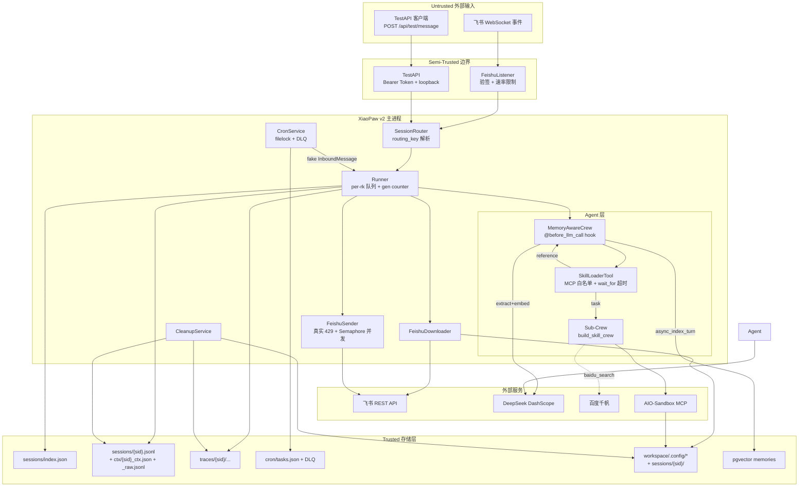
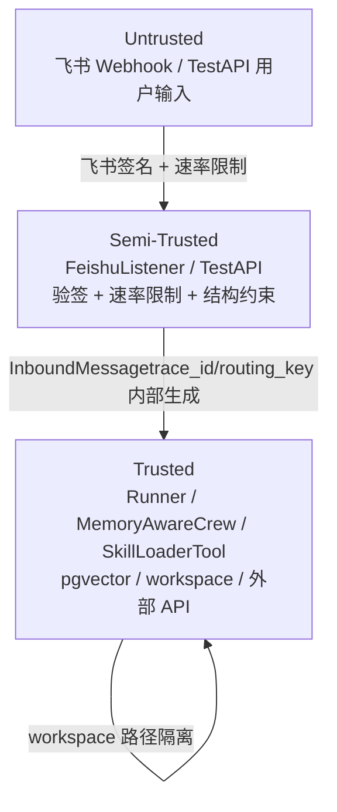
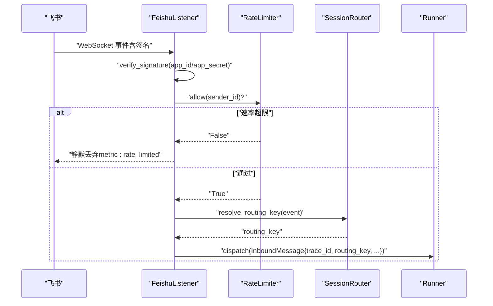
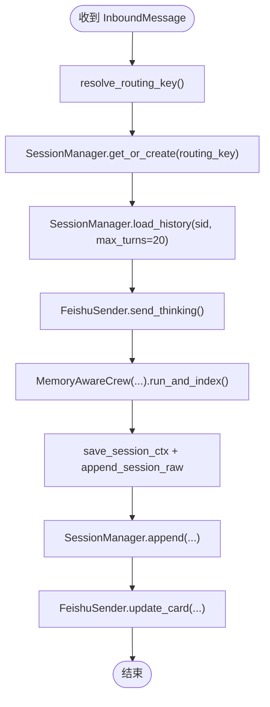
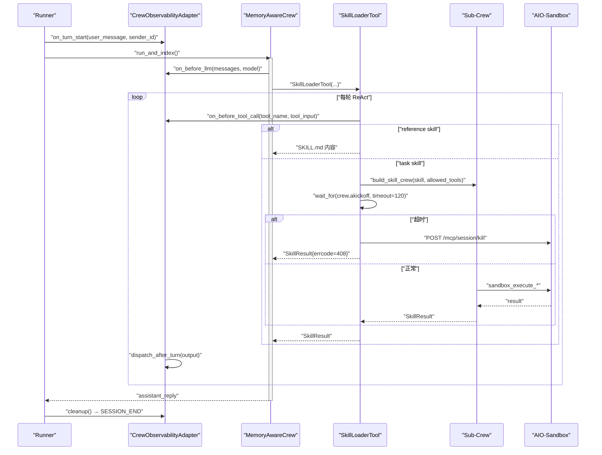
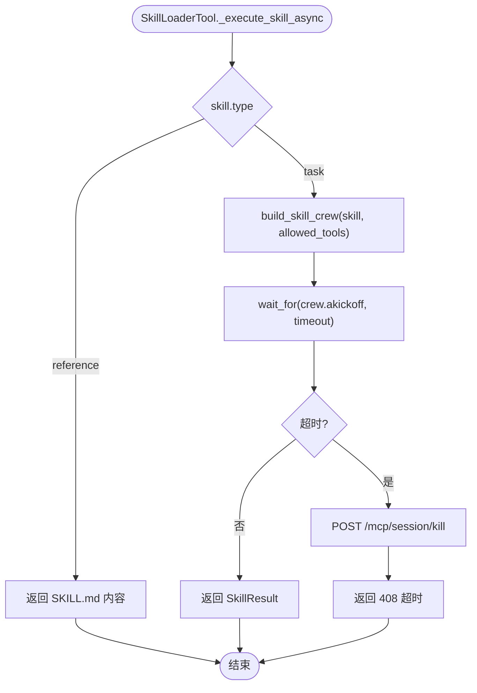
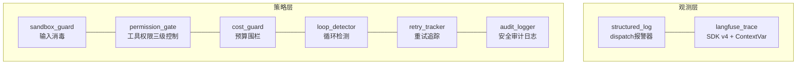
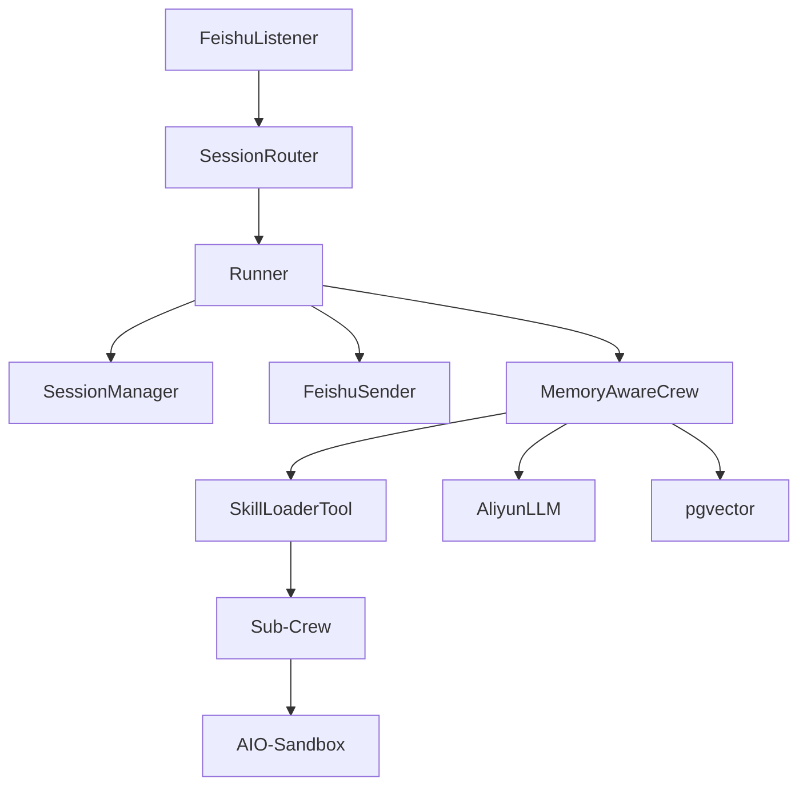

# 架构设计

<cite>
**本文引用的文件**
- [DESIGN.md](file://DESIGN.md)
- [01-architecture.md](file://docs/01-architecture.md)
- [02-modules.md](file://docs/02-modules.md)
- [07-security.md](file://docs/07-security.md)
- [main.py](file://xiaopaw/main.py)
- [runner.py](file://xiaopaw/runner.py)
- [listener.py](file://xiaopaw/feishu/listener.py)
- [main_crew.py](file://xiaopaw/agents/main_crew.py)
- [skill_loader.py](file://xiaopaw/tools/skill_loader.py)
- [registry.py](file://xiaopaw/hook_framework/registry.py)
- [crew_adapter.py](file://xiaopaw/hook_framework/crew_adapter.py)
- [structured_log.py](file://shared_hooks/structured_log.py)
- [langfuse_trace.py](file://shared_hooks/langfuse_trace.py)
- [hooks.yaml](file://shared_hooks/hooks.yaml)
- [config.yaml.example](file://config.yaml.example)
</cite>

## 目录
1. [简介](#简介)
2. [项目结构](#项目结构)
3. [核心组件](#核心组件)
4. [架构总览](#架构总览)
5. [详细组件分析](#详细组件分析)
6. [依赖关系分析](#依赖关系分析)
7. [性能考量](#性能考量)
8. [故障排查指南](#故障排查指南)
9. [结论](#结论)
10. [附录](#附录)

## 简介
本架构设计文档面向 XiaoPaw v2（小爪子 v2）——飞书本地工作助手的生产加固版本。系统围绕“三层信任边界”（Untrusted → Semi-Trusted → Trusted）构建，结合 Hook 框架与加固层（观测/可靠性/安全），实现飞书 WebSocket 事件接入、消息路由、智能体执行引擎与技能调度的闭环。本文档提供系统上下文图、组件分解图、数据流与消息处理流程，阐述技术决策、权衡与约束条件，并给出基础设施要求、可扩展性考虑与部署拓扑。

## 项目结构
XiaoPaw v2 采用模块化分层组织，核心模块包括：
- 接入层：FeishuListener、SessionRouter、TestAPI
- 执行层：Runner、SessionManager、FeishuDownloader、FeishuSender
- Agent 层：MemoryAwareCrew、Sub-Crew、SkillLoaderTool
- 记忆层：bootstrap、context_mgmt、token_counter、indexer
- LLM 层：AliyunLLM
- 工具层：BaiduSearchTool、AddImageToolLocal、IntermediateTool
- Skill 生态：13 个 Skills 的加固点
- 基础设施：Config、Cron、Cleanup、Observability、Security

图表来源
- [01-architecture.md:22-117](file://docs/01-architecture.md#L22-L117)
- [main.py:18-218](file://xiaopaw/main.py#L18-L218)
- [runner.py:33-335](file://xiaopaw/runner.py#L33-L335)
- [listener.py:21-148](file://xiaopaw/feishu/listener.py#L21-L148)
- [main_crew.py:118-348](file://xiaopaw/agents/main_crew.py#L118-L348)
- [skill_loader.py:223-535](file://xiaopaw/tools/skill_loader.py#L223-L535)

章节来源
- [01-architecture.md:20-117](file://docs/01-architecture.md#L20-L117)
- [02-modules.md:26-151](file://docs/02-modules.md#L26-L151)

## 核心组件
- FeishuListener：维护飞书 WebSocket 长连接，解析事件为 InboundMessage，执行应用层重放防护与入站速率限制。
- Runner：per-routing_key 串行队列与 gen-counter worker 生命周期管理，负责消息路由、会话管理、Agent 执行、存储写入与消息回复。
- MemoryAwareCrew：主 Agent 编排，@before_llm_call 钩子负责上下文恢复、剪枝与压缩，run_and_index 暴露 _index_coroutine 供 Runner 托管异步索引。
- SkillLoaderTool：渐进式能力披露，按类型派发（reference 返回 SKILL.md / task 触发 Sub-Crew），支持 MCP tool 白名单与超时 kill。
- Hook 框架：5+2 事件体系（BEFORE_TURN/AFTER_TURN/TASK_COMPLETE/SESSION_END 等），两套分发机制（dispatch/ dispatch_gate），GuardrailDeny 作为唯一可穿透策略层的异常。
- 观测与安全加固层：structured_log（本地结构化事件日志）、langfuse_trace（云端 trace 树）、sandbox_guard、permission_gate、cost_guard、loop_detector、retry_tracker、audit_logger。

章节来源
- [runner.py:33-335](file://xiaopaw/runner.py#L33-L335)
- [main_crew.py:118-348](file://xiaopaw/agents/main_crew.py#L118-L348)
- [skill_loader.py:223-535](file://xiaopaw/tools/skill_loader.py#L223-L535)
- [registry.py:118-209](file://xiaopaw/hook_framework/registry.py#L118-L209)
- [crew_adapter.py:63-357](file://xiaopaw/hook_framework/crew_adapter.py#L63-L357)
- [hooks.yaml:1-73](file://shared_hooks/hooks.yaml#L1-L73)

## 架构总览
XiaoPaw v2 的信任边界分为三层：
- Untrusted（外部输入）：飞书 WebSocket 事件与 TestAPI 调用方
- Semi-Trusted（接入层）：FeishuListener 与 TestAPI，负责验签、速率限制与结构约束
- Trusted（业务与外部）：Runner/MemoryAwareCrew/SkillLoaderTool，以及 pgvector/workspace/外部 API

图表来源
- [01-architecture.md:284-347](file://docs/01-architecture.md#L284-L347)
- [07-security.md:112-148](file://docs/07-security.md#L112-L148)

章节来源
- [01-architecture.md:284-347](file://docs/01-architecture.md#L284-L347)
- [07-security.md:108-148](file://docs/07-security.md#L108-L148)

## 详细组件分析

### 飞书 WebSocket 事件处理
- 长连接接入：lark-oapi ws.Client 在主线程启动，事件分发至 _build_event_handler，再交由 _handle_message_event 解析。
- 验签与重放：WS 模式下由飞书服务端在握手阶段用 app_secret 验签；应用层通过 ReplayCache（event_id LRU+TTL）防重放。
- 速率限制：RateLimiter.per_user_per_minute=20，超限静默丢弃并计数。
- 结构约束：InboundMessage 的 trace_id/routing_key/msg_id 由内部生成，content/attachment 经过 PII 脱敏与下游路径校验。

图表来源
- [01-architecture.md:136-163](file://docs/01-architecture.md#L136-L163)
- [listener.py:81-148](file://xiaopaw/feishu/listener.py#L81-L148)

章节来源
- [listener.py:21-148](file://xiaopaw/feishu/listener.py#L21-L148)
- [02-modules.md:26-91](file://docs/02-modules.md#L26-L91)

### 消息路由与会话管理
- routing_key：p2p/group/thread 三类，统一映射为 "type:identifier"。
- Runner per-rk 队列：同一 routing_key 串行处理，不同 routing_key 并行；空闲超时后 worker 自动退出。
- SessionManager：LRUCache(maxsize=1000) + 两级锁（dispatch_lock + per-sid lock）保障 JSONL 写入互斥；load_history 使用 asyncio.to_thread 倒序流式读取，自动 copy_context。

图表来源
- [runner.py:109-201](file://xiaopaw/runner.py#L109-L201)
- [main_crew.py:280-305](file://xiaopaw/agents/main_crew.py#L280-L305)

章节来源
- [runner.py:33-335](file://xiaopaw/runner.py#L33-L335)
- [02-modules.md:153-262](file://docs/02-modules.md#L153-L262)

### 智能体执行引擎与 Hook 框架
- MemoryAwareCrew：@before_llm_call 钩子负责恢复 ctx.json、剪枝 tool 结果、压缩消息，run_and_index 返回 reply 并暴露 _index_coroutine。
- Hook 事件体系：BEFORE_TURN → BEFORE_LLM → BEFORE_TOOL_CALL → AFTER_TOOL_CALL → AFTER_TURN；TASK_COMPLETE、SESSION_END。
- CrewObservabilityAdapter：将 CrewAI 回调翻译为 Hook 事件，pending_deny 模式在 step_callback/task_callback 安全出口重抛，确保策略层异常不被 CrewAI 吞掉。
- Runner 在 _handle 中创建每轮 adapter，预检 agent_execution（sandbox_guard/permission_gate），并在 finally 触发 SESSION_END。

图表来源
- [main_crew.py:195-254](file://xiaopaw/agents/main_crew.py#L195-L254)
- [crew_adapter.py:91-327](file://xiaopaw/hook_framework/crew_adapter.py#L91-L327)
- [runner.py:135-281](file://xiaopaw/runner.py#L135-L281)

章节来源
- [main_crew.py:118-348](file://xiaopaw/agents/main_crew.py#L118-L348)
- [crew_adapter.py:63-357](file://xiaopaw/hook_framework/crew_adapter.py#L63-L357)
- [registry.py:118-209](file://xiaopaw/hook_framework/registry.py#L118-L209)

### 技能调度与安全隔离
- SkillLoaderTool：按 SKILL.md frontmatter 加载，reference 返回 SKILL.md 内容，task 构建 Sub-Crew 并通过 allowed_tools 白名单过滤 MCP 工具。
- 超时与 kill：wait_for 超时后主动 POST /mcp/session/kill，防止僵尸进程积累。
- 路径隔离：workspace mount 精确到 {sid}/，Downloader 写入前 resolve() 校验路径不越界；SKILL.md scripts 路径 is_relative_to 校验。

图表来源
- [skill_loader.py:392-441](file://xiaopaw/tools/skill_loader.py#L392-L441)
- [skill_loader.py:639-700](file://xiaopaw/tools/skill_loader.py#L639-L700)

章节来源
- [skill_loader.py:223-535](file://xiaopaw/tools/skill_loader.py#L223-L535)
- [02-modules.md:601-735](file://docs/02-modules.md#L601-L735)

### 观测与安全加固层
- structured_log：每事件一行 JSON 输出到 stderr，不阻断业务。
- langfuse_trace：ContextVar + SDK v4 批量 flush，机制一（trace_id=sessionId）、机制二（Sub-Crew 自动挂父 trace）、机制三（span 栈管理）、机制四（generation 先写后更新）、机制五（强制 flush）。
- 策略层：sandbox_guard（输入消毒）、permission_gate（工具权限三级控制）、cost_guard（预算围栏）、loop_detector（循环检测）、retry_tracker（重试追踪）、audit_logger（安全审计日志）。

图表来源
- [hooks.yaml:1-73](file://shared_hooks/hooks.yaml#L1-L73)
- [structured_log.py:22-97](file://shared_hooks/structured_log.py#L22-L97)
- [langfuse_trace.py:137-710](file://shared_hooks/langfuse_trace.py#L137-L710)
- [registry.py:118-209](file://xiaopaw/hook_framework/registry.py#L118-L209)

章节来源
- [hooks.yaml:1-73](file://shared_hooks/hooks.yaml#L1-L73)
- [structured_log.py:1-97](file://shared_hooks/structured_log.py#L1-L97)
- [langfuse_trace.py:1-800](file://shared_hooks/langfuse_trace.py#L1-L800)
- [registry.py:118-209](file://xiaopaw/hook_framework/registry.py#L118-L209)

## 依赖关系分析
- 组件耦合与内聚：Runner 与 SessionManager 高内聚，通过 _dispatch_lock 与 _pending_index_tasks 降低耦合；MemoryAwareCrew 与 SkillLoaderTool 通过 ContextVar 与 Adapter 解耦。
- 直接与间接依赖：FeishuListener 依赖 lark-oapi.ws.Client；Runner 依赖 SessionManager、Sender、AgentFn；MemoryAwareCrew 依赖 Crew、LLM、HookAdapter；SkillLoaderTool 依赖 Sub-Crew 与 AIO-Sandbox。
- 外部依赖：飞书 REST API、DashScope、百度千帆、pgvector、AIO-Sandbox。

图表来源
- [main.py:18-218](file://xiaopaw/main.py#L18-L218)
- [runner.py:33-335](file://xiaopaw/runner.py#L33-L335)
- [main_crew.py:118-348](file://xiaopaw/agents/main_crew.py#L118-L348)
- [skill_loader.py:223-535](file://xiaopaw/tools/skill_loader.py#L223-L535)

章节来源
- [main.py:18-218](file://xiaopaw/main.py#L18-L218)
- [02-modules.md:26-151](file://docs/02-modules.md#L26-L151)

## 性能考量
- 并发与锁：LRUCache(maxsize=1000) + 两级锁 append，避免 JSONL 写入竞态；Runner per-rk 队列 + idle_timeout 释放内存；FeishuSender Semaphore(5) 控并发。
- 压缩与剪枝：@before_llm_call 剪枝 tool 结果与压缩消息，降低 token 使用；FeatureFlags 控制 token 计数器模式与上下文窗口。
- 异步索引：run_and_index 后暴露 _index_coroutine，Runner 统一 create_task 并托管于 _pending_index_tasks，避免阻塞主流程。
- 限流与退避：FeishuSender 识别 HTTP 429 与 SDK 错误码，按 Retry-After 或指数退避重试。

章节来源
- [runner.py:56-58](file://xiaopaw/runner.py#L56-L58)
- [runner.py:232-255](file://xiaopaw/runner.py#L232-L255)
- [main_crew.py:507-530](file://xiaopaw/agents/main_crew.py#L507-L530)
- [listener.py:419-448](file://xiaopaw/feishu/listener.py#L419-L448)
- [02-modules.md:390-454](file://docs/02-modules.md#L390-L454)

## 故障排查指南
- 入站速率限制：查看 rate_limited 指标与日志；确认 per_user_per_minute=20 设置。
- 重放防护：ReplayCache event_id 重复将被丢弃；关注 webhook_replay_hit 指标。
- 限流与退避：FeishuSender 识别 429 与特定 SDK 错误码，按 Retry-After 或指数退避；观察 feishu_rate_limit_total。
- 安全拦截：GuardrailDeny 由策略层抛出，Runner 捕获后友好提示；检查 audit_logger 与 langfuse_trace 中的 deny_reason。
- Trace 可见性：after_turn_handler 强制 flush，确保用户收到回复时 Langfuse 数据已就绪；验证 trace_id 覆盖率。

章节来源
- [01-architecture.md:136-227](file://docs/01-architecture.md#L136-L227)
- [07-security.md:136-148](file://docs/07-security.md#L136-L148)
- [langfuse_trace.py:595-710](file://shared_hooks/langfuse_trace.py#L595-L710)

## 结论
XiaoPaw v2 通过三层信任边界与 Hook 框架，实现了从飞书 WebSocket 到智能体执行与技能调度的全链路加固。系统在并发安全、可观测性、可靠性与安全性方面进行了全面升级，满足生产环境的稳定性与合规要求。部署拓扑建议单节点生产形态，配合 pgvector 与 AIO-Sandbox 容器化组件，确保数据与执行隔离。

## 附录
- 基础设施要求：Docker Compose 拉起 xiaopaw、pgvector、aio-sandbox；/metrics 与 /health 端口分离；TestAPI 仅开发环境启用。
- 配置管理：config.yaml 与 .env 分离，凭证通过 secret manager 注入；FeatureFlags 控制安全与功能开关。
- 部署拓扑：单主机 Docker Network，xiaopaw 与 sandbox 通过 volume 精确挂载 workspace；pgvector 单节点内网访问。

章节来源
- [01-architecture.md:349-410](file://docs/01-architecture.md#L349-L410)
- [config.yaml.example:1-90](file://config.yaml.example#L1-L90)
- [DESIGN.md:158-178](file://DESIGN.md#L158-L178)