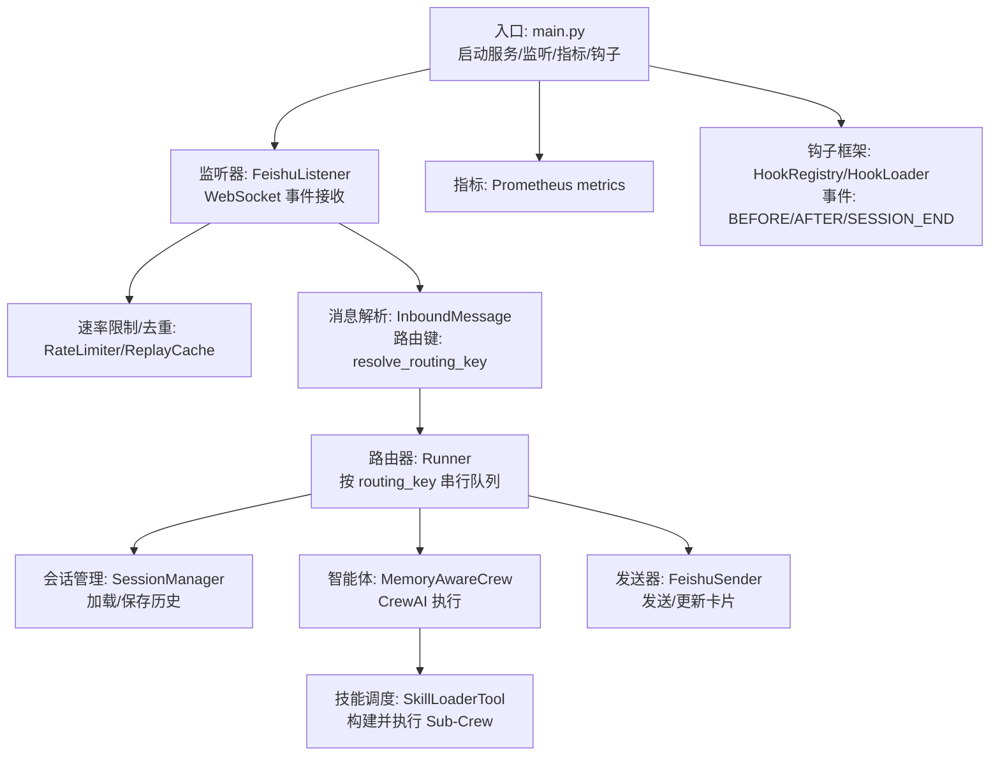
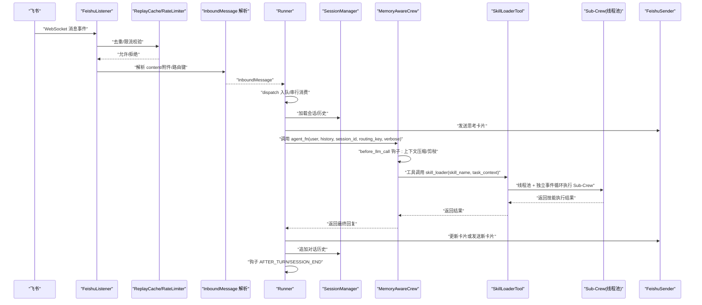
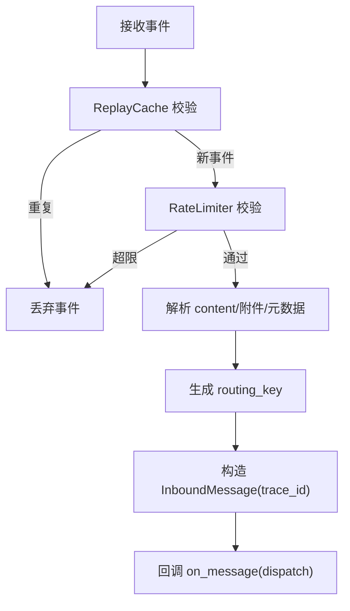
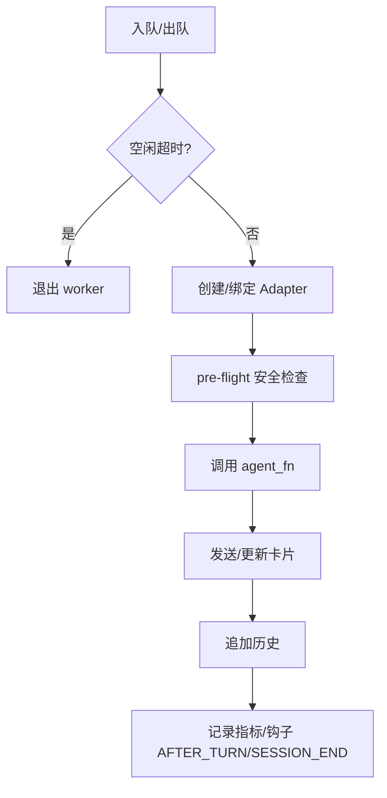
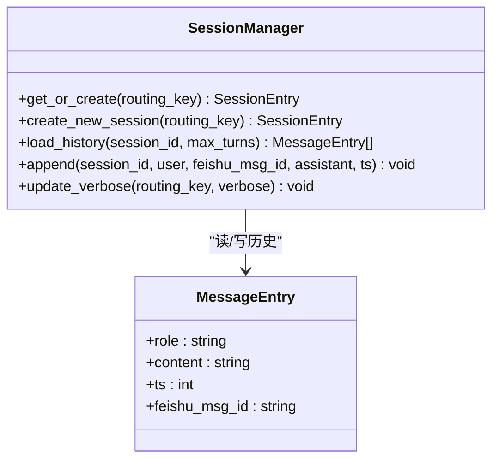
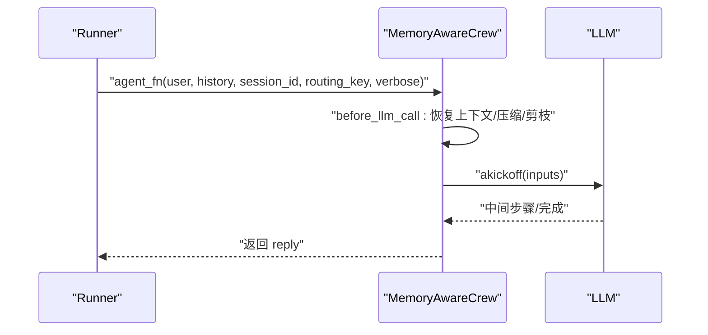
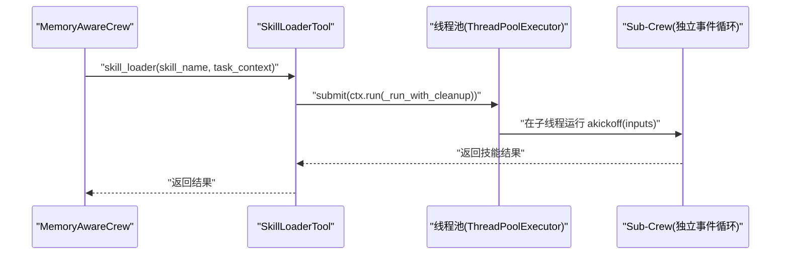
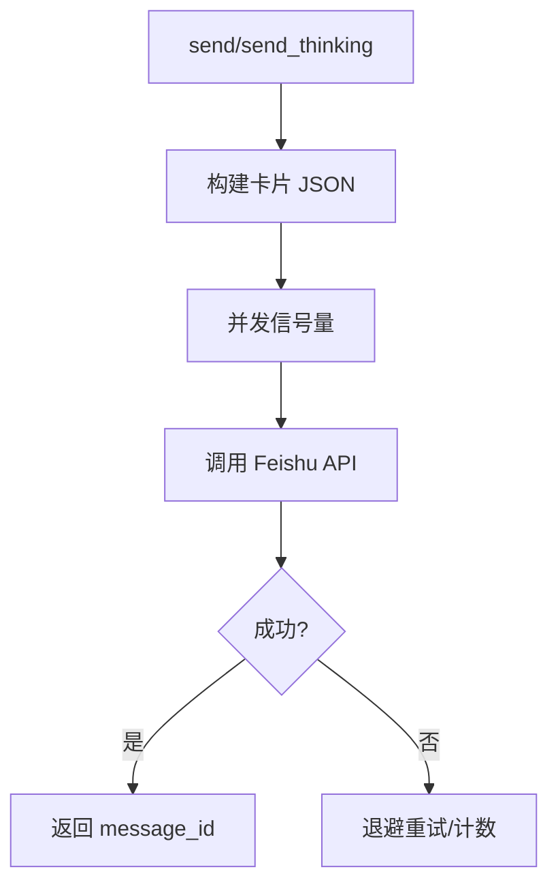
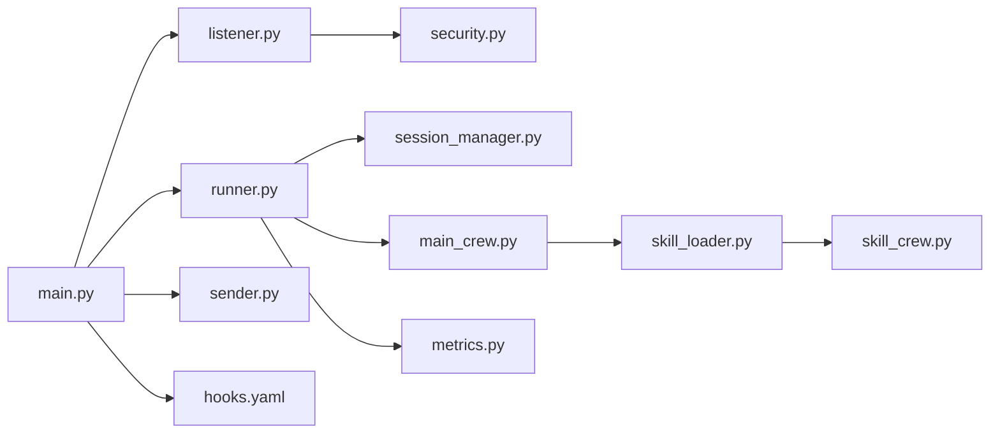

# 消息处理主时序

<cite>
**本文引用的文件**
- [main.py](file://xiaopaw/main.py)
- [listener.py](file://xiaopaw/feishu/listener.py)
- [security.py](file://xiaopaw/observability/security.py)
- [models.py](file://xiaopaw/models.py)
- [session_key.py](file://xiaopaw/feishu/session_key.py)
- [runner.py](file://xiaopaw/runner.py)
- [session_manager.py](file://xiaopaw/session/manager.py)
- [main_crew.py](file://xiaopaw/agents/main_crew.py)
- [skill_loader.py](file://xiaopaw/tools/skill_loader.py)
- [sender.py](file://xiaopaw/feishu/sender.py)
- [metrics.py](file://xiaopaw/observability/metrics.py)
- [flags.py](file://xiaopaw/config/flags.py)
- [hooks.yaml](file://shared_hooks/hooks.yaml)
</cite>

## 目录
1. [简介](#简介)
2. [项目结构](#项目结构)
3. [核心组件](#核心组件)
4. [架构总览](#架构总览)
5. [详细组件分析](#详细组件分析)
6. [依赖分析](#依赖分析)
7. [性能考量](#性能考量)
8. [故障排查指南](#故障排查指南)
9. [结论](#结论)
10. [附录](#附录)

## 简介
本文件面向 XiaoPaw v2 的消息处理主时序，聚焦生产环境从飞书 WebSocket 接收事件到最终回复用户的完整链路。文档覆盖以下关键环节：
- 飞书 WebSocket 事件接收、验签与速率限制
- InboundMessage 解析与路由键生成
- SessionRouter（SessionManager）会话加载与历史加载
- Runner 入队与串行消费、钩子框架（Hook Framework）生命周期
- MemoryAwareCrew 智能体执行、SkillLoaderTool 技能决策
- Sub-Crew 容器化执行（线程池 + 独立事件循环）
- FeishuSender 发送与更新卡片
- 延迟预期与告警阈值
- 性能基准与优化建议

## 项目结构
XiaoPaw v2 的消息处理主干由“入口启动器”驱动，围绕“监听器 → 路由器 → 执行器 → 发送器”的流水线组织模块。

图表来源
- [main.py:174-190](file://xiaopaw/main.py#L174-L190)
- [listener.py:42-80](file://xiaopaw/feishu/listener.py#L42-L80)
- [runner.py:60-108](file://xiaopaw/runner.py#L60-L108)
- [session_manager.py:70-131](file://xiaopaw/session/manager.py#L70-L131)
- [main_crew.py:313-347](file://xiaopaw/agents/main_crew.py#L313-L347)
- [skill_loader.py:451-535](file://xiaopaw/tools/skill_loader.py#L451-L535)
- [sender.py:43-71](file://xiaopaw/feishu/sender.py#L43-L71)
- [metrics.py:8-48](file://xiaopaw/observability/metrics.py#L8-L48)
- [hooks.yaml:4-26](file://shared_hooks/hooks.yaml#L4-L26)

章节来源
- [main.py:174-190](file://xiaopaw/main.py#L174-L190)
- [listener.py:42-80](file://xiaopaw/feishu/listener.py#L42-L80)
- [runner.py:60-108](file://xiaopaw/runner.py#L60-L108)
- [session_manager.py:70-131](file://xiaopaw/session/manager.py#L70-L131)
- [main_crew.py:313-347](file://xiaopaw/agents/main_crew.py#L313-L347)
- [skill_loader.py:451-535](file://xiaopaw/tools/skill_loader.py#L451-L535)
- [sender.py:43-71](file://xiaopaw/feishu/sender.py#L43-L71)
- [metrics.py:8-48](file://xiaopaw/observability/metrics.py#L8-L48)
- [hooks.yaml:4-26](file://shared_hooks/hooks.yaml#L4-L26)

## 核心组件
- 入口与服务编排：main.py 负责加载配置、初始化日志、构建 Sender、构建 AgentFn、注册钩子、启动监听器、指标服务器与后台服务。
- 飞书监听器：listener.py 负责 WebSocket 事件接收、去重（ReplayCache）、速率限制（RateLimiter）、消息解析与路由键生成。
- 路由与执行：runner.py 实现 per-routing_key 的串行队列，负责钩子生命周期、预检安全、会话加载、思考卡片、调用 AgentFn、持久化与统计。
- 会话管理：session_manager.py 提供会话索引、历史加载与追加写入，支持并发锁与 LRU 锁缓存。
- 智能体与技能：main_crew.py 提供 MemoryAwareCrew，集成 CrewAI 钩子与上下文压缩；skill_loader.py 提供 SkillLoaderTool，负责技能清单与 Sub-Crew 容器化执行。
- 发送器：sender.py 封装 Feishu 发送/更新卡片逻辑，内置并发信号量与重试。
- 安全与可观测：security.py 提供 RateLimiter 与 ReplayCache；metrics.py 定义 Prometheus 指标；hooks.yaml 描述钩子事件与策略。

章节来源
- [main.py:18-218](file://xiaopaw/main.py#L18-L218)
- [listener.py:21-148](file://xiaopaw/feishu/listener.py#L21-L148)
- [runner.py:33-335](file://xiaopaw/runner.py#L33-L335)
- [session_manager.py:38-183](file://xiaopaw/session/manager.py#L38-L183)
- [main_crew.py:118-347](file://xiaopaw/agents/main_crew.py#L118-L347)
- [skill_loader.py:223-535](file://xiaopaw/tools/skill_loader.py#L223-L535)
- [sender.py:18-149](file://xiaopaw/feishu/sender.py#L18-L149)
- [security.py:11-73](file://xiaopaw/observability/security.py#L11-L73)
- [metrics.py:1-65](file://xiaopaw/observability/metrics.py#L1-L65)
- [hooks.yaml:1-73](file://shared_hooks/hooks.yaml#L1-L73)

## 架构总览
下图展示从飞书事件到用户回复的端到端时序，标注关键延迟与告警点。

图表来源
- [listener.py:81-148](file://xiaopaw/feishu/listener.py#L81-L148)
- [runner.py:109-282](file://xiaopaw/runner.py#L109-L282)
- [session_manager.py:111-154](file://xiaopaw/session/manager.py#L111-L154)
- [main_crew.py:223-305](file://xiaopaw/agents/main_crew.py#L223-L305)
- [skill_loader.py:451-535](file://xiaopaw/tools/skill_loader.py#L451-L535)
- [sender.py:43-116](file://xiaopaw/feishu/sender.py#L43-L116)

## 详细组件分析

### 飞书 WebSocket 事件接收与预处理
- 事件接收：listener.py 使用 lark_oapi 的 WebSocket 客户端在独立线程中运行，主线程通过事件分发器回调。
- 去重与限流：ReplayCache 基于事件 ID 的 TTL + LRU 去重；RateLimiter 基于用户维度的滑动窗口（每分钟）。
- 消息解析：解析消息类型、文本、附件、聊天类型与 thread_id，生成 InboundMessage 并附带 trace_id。
- 路由键生成：根据 chat_type/chat_id/open_id/thread_id 生成 routing_key，区分 p2p/group/thread。

图表来源
- [listener.py:81-148](file://xiaopaw/feishu/listener.py#L81-L148)
- [session_key.py:6-16](file://xiaopaw/feishu/session_key.py#L6-L16)
- [models.py:18-28](file://xiaopaw/models.py#L18-L28)
- [security.py:47-73](file://xiaopaw/observability/security.py#L47-L73)
- [security.py:11-27](file://xiaopaw/observability/security.py#L11-L27)

章节来源
- [listener.py:42-148](file://xiaopaw/feishu/listener.py#L42-L148)
- [session_key.py:1-20](file://xiaopaw/feishu/session_key.py#L1-L20)
- [models.py:10-35](file://xiaopaw/models.py#L10-L35)
- [security.py:11-73](file://xiaopaw/observability/security.py#L11-L73)

### Runner 入队与串行消费、钩子与安全预检
- 入队与串行：按 routing_key 维度维护 asyncio.Queue，超过容量丢弃；空闲超时退出 worker。
- 钩子适配器：为每次请求创建 CrewObservabilityAdapter，绑定 session_id，贯穿主 Crew 与 Sub-Crew。
- 安全预检：在调用 agent_fn 前，以虚拟工具“agent_execution”触发 BEFORE_TOOL_CALL，提前拦截风险。
- 会话与历史：加载当前会话与历史消息，发送思考卡片（便于后续更新）。
- 执行与回退：捕获 GuardrailDeny 与异常，统一友好提示；最后统一触发 SESSION_END。

图表来源
- [runner.py:60-108](file://xiaopaw/runner.py#L60-L108)
- [runner.py:109-282](file://xiaopaw/runner.py#L109-L282)

章节来源
- [runner.py:33-335](file://xiaopaw/runner.py#L33-L335)

### SessionManager 会话与历史
- 会话索引：index.json 记录 active_session_id 与 sessions 列表，支持并发锁保护。
- 历史加载：按会话读取 .jsonl，限制回合数，返回 MessageEntry 列表。
- 历史追加：并发锁 + per-session 锁缓存，原子写入 user/assistant 条目并更新计数。

图表来源
- [session_manager.py:38-183](file://xiaopaw/session/manager.py#L38-L183)

章节来源
- [session_manager.py:38-183](file://xiaopaw/session/manager.py#L38-L183)

### MemoryAwareCrew 智能体执行与上下文管理
- Crew 构建：基于配置文件加载 agents/tasks，注册 CrewAI 钩子（before_llm_call/before_tool_call/step_callback/task_callback）。
- 上下文压缩：在首次 LLM 调用时恢复会话上下文，随后每轮裁剪工具结果并按令牌上限压缩。
- 执行与索引：异步 kickoff 返回结果，提取 reply；如启用数据库索引，则暴露 coroutine 交由 Runner 托管。

图表来源
- [main_crew.py:208-305](file://xiaopaw/agents/main_crew.py#L208-L305)

章节来源
- [main_crew.py:118-347](file://xiaopaw/agents/main_crew.py#L118-L347)

### SkillLoaderTool 技能决策与 Sub-Crew 容器化执行
- 渐进式能力披露：主 Crew 仅看到技能清单与简述，具体实现延迟到 Sub-Crew。
- 线程池与独立事件循环：在独立线程中创建事件循环，通过 contextvars.copy_context() 将钩子/trace 上下文传递至子线程。
- Langfuse 上下文重置：子线程重置生成/span 栈等瞬时状态，确保 trace 层级正确挂载在父 skill span 下。
- 清理与 flush：子线程结束前 flush 事件缓冲，关闭未关闭的 span/gen。

图表来源
- [skill_loader.py:451-535](file://xiaopaw/tools/skill_loader.py#L451-L535)

章节来源
- [skill_loader.py:223-535](file://xiaopaw/tools/skill_loader.py#L223-L535)

### FeishuSender 发送与更新卡片
- 发送卡片：构建交互卡片 JSON，发送至 Feishu；并发受信号量控制，失败按退避重试。
- 更新卡片：对已发送的卡片进行 patch 更新，失败记录警告。
- 速率限制感知：识别特定错误码并计数，便于告警。

图表来源
- [sender.py:43-116](file://xiaopaw/feishu/sender.py#L43-L116)

章节来源
- [sender.py:18-149](file://xiaopaw/feishu/sender.py#L18-L149)

## 依赖分析
- 组件耦合
  - main.py 依赖监听器、Runner、Sender、HookLoader、SessionManager、指标服务器。
  - Runner 依赖 Sender、SessionManager、HookRegistry、CrewObservabilityAdapter。
  - MemoryAwareCrew 依赖 SkillLoaderTool、CrewAI 钩子、上下文管理与索引。
  - SkillLoaderTool 依赖 Sub-Crew 构建器、线程池、Langfuse 上下文桥接。
  - FeishuSender 依赖 lark_oapi 客户端与并发控制。
- 外部依赖
  - lark_oapi（飞书 SDK）
  - prometheus_client（指标）
  - CrewAI（智能体执行）

图表来源
- [main.py:174-190](file://xiaopaw/main.py#L174-L190)
- [runner.py:115-175](file://xiaopaw/runner.py#L115-L175)
- [main_crew.py:168-182](file://xiaopaw/agents/main_crew.py#L168-L182)
- [skill_loader.py:404-410](file://xiaopaw/tools/skill_loader.py#L404-L410)
- [sender.py:75-115](file://xiaopaw/feishu/sender.py#L75-L115)
- [security.py:11-73](file://xiaopaw/observability/security.py#L11-L73)
- [metrics.py:8-48](file://xiaopaw/observability/metrics.py#L8-L48)

章节来源
- [main.py:174-190](file://xiaopaw/main.py#L174-L190)
- [runner.py:115-175](file://xiaopaw/runner.py#L115-L175)
- [main_crew.py:168-182](file://xiaopaw/agents/main_crew.py#L168-L182)
- [skill_loader.py:404-410](file://xiaopaw/tools/skill_loader.py#L404-L410)
- [sender.py:75-115](file://xiaopaw/feishu/sender.py#L75-L115)
- [security.py:11-73](file://xiaopaw/observability/security.py#L11-L73)
- [metrics.py:8-48](file://xiaopaw/observability/metrics.py#L8-L48)

## 性能考量
- 延迟预期与阈值
  - 飞书 WebSocket 到 Runner 入队：毫秒级（取决于网络与线程切换）。
  - Runner 串行消费：单 routing_key 内串行，队列满丢弃，需关注队列长度与空闲超时。
  - LLM 调用：受模型与上下文长度影响，结合 before_llm_call 的压缩策略，建议监控 llm_calls_total 与 llm_latency。
  - 技能执行：Sub-Crew 在线程池中运行，受沙箱与外部 API 影响，建议设置技能超时与告警。
  - 发送卡片：受 Feishu API 延迟与限流影响，注意 feishu_rate_limit_total。
- 关键指标
  - xiaopaw_agent_latency_seconds：按 routing_type 分桶统计。
  - xiaopaw_llm_calls_total / xiaopaw_llm_latency_seconds：LLM 调用与延迟。
  - xiaopaw_feishu_rate_limit_total：Feishu 限流命中。
  - xiaopaw_skill_timeout_total：技能超时。
- 优化建议
  - 合理设置 Runner 队列大小与空闲超时，避免积压与资源占用。
  - 使用上下文压缩与工具结果剪枝，降低 LLM 输入规模。
  - 为长耗时技能设置超时与重试，避免线程池阻塞。
  - 并发发送时控制信号量，结合退避重试与限流策略。
  - 通过钩子框架扩展成本与循环检测，减少无效调用。

章节来源
- [metrics.py:8-48](file://xiaopaw/observability/metrics.py#L8-L48)
- [main_crew.py:223-254](file://xiaopaw/agents/main_crew.py#L223-L254)
- [runner.py:168-176](file://xiaopaw/runner.py#L168-L176)
- [sender.py:100-115](file://xiaopaw/feishu/sender.py#L100-L115)
- [flags.py:9-23](file://xiaopaw/config/flags.py#L9-L23)

## 故障排查指南
- 飞书事件被拒
  - 检查 ReplayCache 是否命中（事件 ID 去重）与 RateLimiter 是否超限。
  - 确认 allowed_chats 白名单与 chat_type。
- Runner 队列积压
  - 检查 max_queue_size 与 idle_timeout；观察队列是否频繁 full。
  - 关注 GuardrailDeny 与异常分支是否导致长时间阻塞。
- LLM 调用异常
  - 检查 before_llm_call 的上下文恢复与压缩逻辑；确认 tokens 上限与剪枝策略。
- 技能执行失败
  - 线程池超时（默认 300 秒）；检查 Sub-Crew 初始化与沙箱 URL。
  - 检查 BEFORE_TOOL_CALL 钩子是否提前拦截并抛出 GuardrailDeny。
- 发送卡片失败
  - Feishu 限流错误码计数；检查并发信号量与退避重试。
- 钩子与 Trace
  - 确认 HookRegistry 的事件链（BEFORE_TURN/AFTER_TURN/SESSION_END）是否完整触发。
  - 检查 Langfuse 上下文在子线程的重置是否正确。

章节来源
- [listener.py:88-105](file://xiaopaw/feishu/listener.py#L88-L105)
- [runner.py:72-75](file://xiaopaw/runner.py#L72-L75)
- [runner.py:222-257](file://xiaopaw/runner.py#L222-L257)
- [main_crew.py:223-254](file://xiaopaw/agents/main_crew.py#L223-L254)
- [skill_loader.py:533-535](file://xiaopaw/tools/skill_loader.py#L533-L535)
- [sender.py:100-115](file://xiaopaw/feishu/sender.py#L100-L115)
- [hooks.yaml:4-26](file://shared_hooks/hooks.yaml#L4-L26)

## 结论
XiaoPaw v2 的消息处理主时序以“监听器 → Runner → 智能体 → 技能 → 发送器”为主线，配合钩子框架与安全预检，形成闭环的可观测与可控执行链。通过合理的队列与并发控制、上下文压缩与剪枝、线程池隔离与超时管理，可在保障稳定性的同时提升吞吐与响应速度。建议持续监控关键指标并结合告警阈值进行容量与性能优化。

## 附录
- 关键配置项参考
  - Runner：idle_timeout_s、max_queue_size
  - Sender：max_retries、retry_backoff、max_concurrent
  - RateLimiter：per_user_per_minute
  - ReplayCache：maxsize、ttl_sec
  - FeatureFlags：enable_inbound_rate_limit、enable_skill_timeout 等

章节来源
- [main.py:115-123](file://xiaopaw/main.py#L115-L123)
- [sender.py:19-30](file://xiaopaw/feishu/sender.py#L19-L30)
- [security.py:14-26](file://xiaopaw/observability/security.py#L14-L26)
- [security.py:50-72](file://xiaopaw/observability/security.py#L50-L72)
- [flags.py:9-23](file://xiaopaw/config/flags.py#L9-L23)