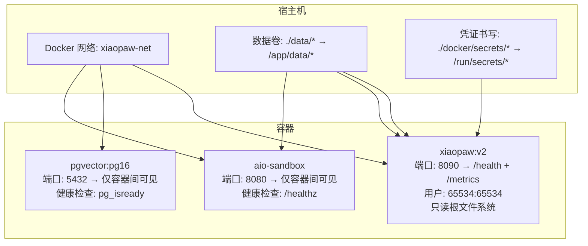
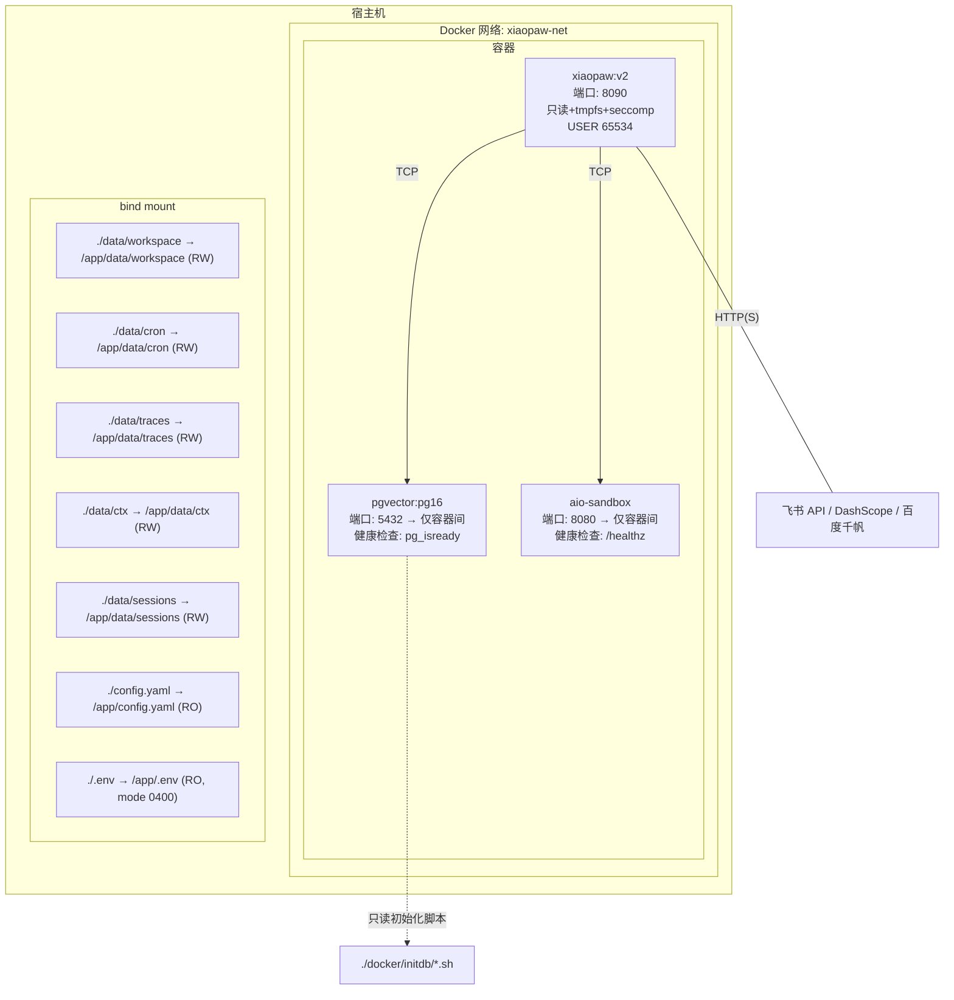
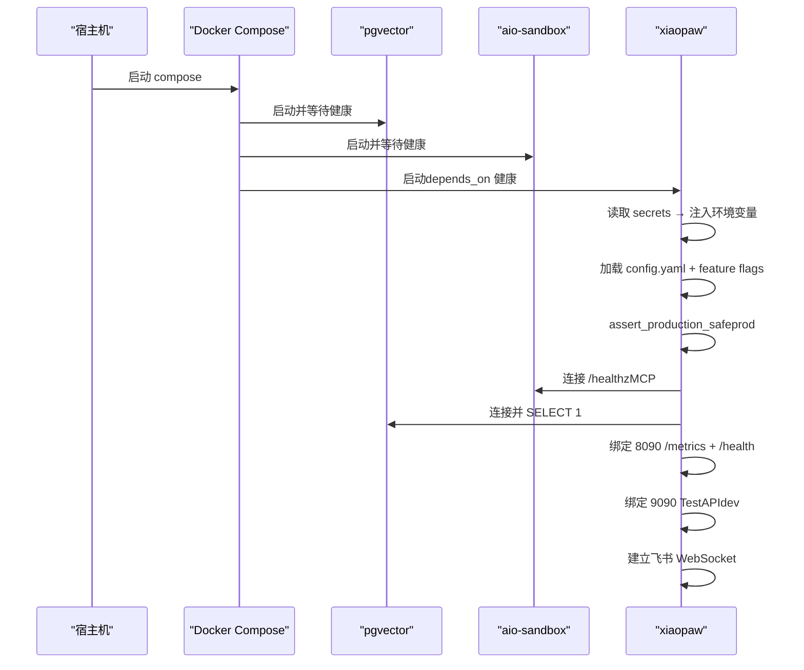
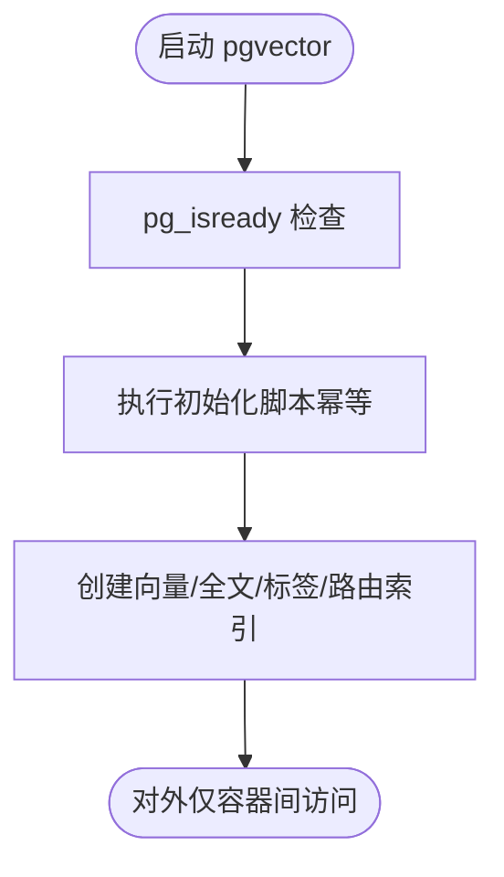
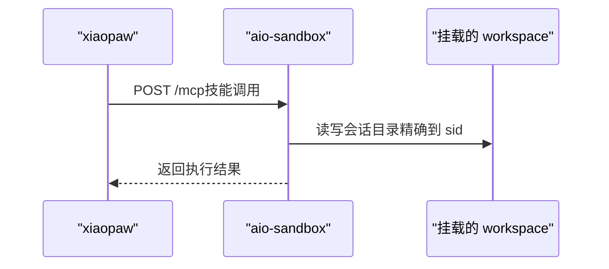
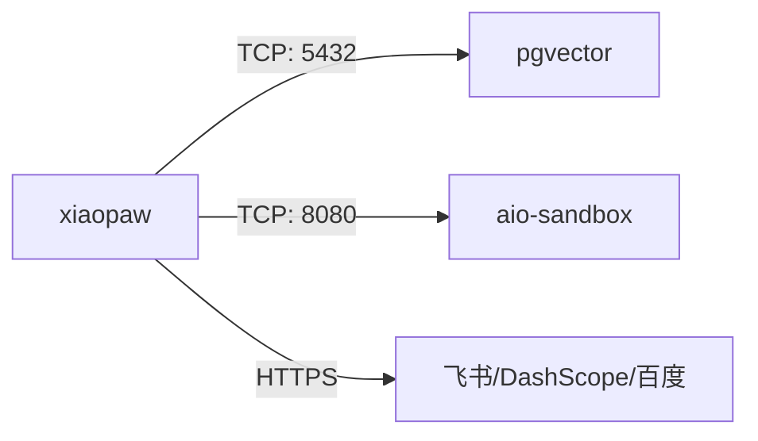

# 进程/组件部署视图

<cite>
**本文引用的文件**
- [docs/01-architecture.md](file://docs/01-architecture.md)
- [docs/08-deployment.md](file://docs/08-deployment.md)
- [docs/09-config.md](file://docs/09-config.md)
- [DESIGN.md](file://DESIGN.md)
- [sandbox-docker-compose.yaml](file://sandbox-docker-compose.yaml)
- [config.yaml.example](file://config.yaml.example)
- [pyproject.toml](file://pyproject.toml)
- [schema.sql](file://schema.sql)
- [verify_setup.py](file://verify_setup.py)
</cite>

## 目录
1. [简介](#简介)
2. [项目结构](#项目结构)
3. [核心组件](#核心组件)
4. [架构总览](#架构总览)
5. [详细组件分析](#详细组件分析)
6. [依赖分析](#依赖分析)
7. [性能考虑](#性能考虑)
8. [故障排查指南](#故障排查指南)
9. [结论](#结论)
10. [附录](#附录)

## 简介
本文件面向 XiaoPaw v2 的运维与开发团队，提供“进程/组件部署视图”的权威说明。内容覆盖单节点生产部署推荐方案、Docker 容器编排、网络配置、卷挂载、端口映射、环境变量与凭证分层、健康检查、安全权限与加固策略，并给出开发部署（localhost）与 Canary（Phase 0）两种部署形态的落地指引。文档同时解释各组件职责分工：xiaopaw 主进程（运行于非 root 用户）、pgvector 向量数据库、aio-sandbox 容器执行环境的部署架构与交互关系。

## 项目结构
XiaoPaw v2 采用“单节点三容器”架构：xiaopaw 主进程、pgvector 数据库、aio-sandbox 执行环境。容器通过 Docker 网络互联，数据通过 bind mount 持久化到宿主机。生产环境强调“镜像钉版本、凭证书写入 secrets、端口仅容器间可见、健康检查与资源约束”。

图表来源
- [docs/08-deployment.md](file://docs/08-deployment.md)
- [docs/01-architecture.md](file://docs/01-architecture.md)

章节来源
- [docs/08-deployment.md](file://docs/08-deployment.md)
- [docs/01-architecture.md](file://docs/01-architecture.md)

## 核心组件
- xiaopaw 主进程（USER 65534）
  - 职责：飞书 WebSocket 接入、会话路由、Runner 队列、Agent 执行、Cron/Cleanup 服务、TestAPI（仅 dev）、/metrics 与 /health。
  - 安全：只读根文件系统、tmpfs、seccomp 策略、非 root 运行、健康检查。
  - 网络：对外仅暴露 8090（/health + /metrics），TestAPI 仅 dev 暴露 9090（127.0.0.1）。
- pgvector 向量数据库
  - 职责：三层记忆的向量与全文检索后端，提供混合检索能力。
  - 安全：仅容器间访问（不暴露 5432 至宿主），健康检查基于 pg_isready。
  - 持久化：Docker volume 管理数据目录。
- aio-sandbox 容器执行环境
  - 职责：隔离执行技能脚本（MCP 协议），提供 bash/code/file/browser 等工具。
  - 安全：仅容器间访问（不暴露 8080 至宿主），沙箱内 seccomp 策略，健康检查基于 /healthz。
  - 卷挂载：挂载 ./data/workspace 供技能读写与持久化。

章节来源
- [docs/08-deployment.md](file://docs/08-deployment.md)
- [docs/01-architecture.md](file://docs/01-architecture.md)

## 架构总览
下图展示单节点生产部署的进程/组件视图与数据流：

图表来源
- [docs/01-architecture.md](file://docs/01-architecture.md)
- [docs/08-deployment.md](file://docs/08-deployment.md)

章节来源
- [docs/01-architecture.md](file://docs/01-architecture.md)
- [docs/08-deployment.md](file://docs/08-deployment.md)

## 详细组件分析

### xiaopaw 主进程（USER 65534）
- 运行时安全
  - 非 root 用户（数字 uid/gid）运行，配合只读根文件系统与 tmpfs，降低攻击面。
  - seccomp 策略限制系统调用，减少逃逸风险。
  - 健康检查仅做轻量探活，不依赖下游服务，避免级联重启。
- 网络与端口
  - 对外仅暴露 8090（/health 与 /metrics 同端口），/metrics 需 Bearer Token。
  - TestAPI 仅 dev 暴露 9090（127.0.0.1），prod 关闭。
- 配置与凭证
  - config.yaml 与 .env 通过卷挂载注入；敏感凭证通过 Docker secrets 注入（/run/secrets/*），entrypoint 脚本读取并转为环境变量。
  - 生产环境强制安全断言（如 TestAPI 关闭、/metrics Token 长度、飞书凭证强度等）。
- 依赖与启动顺序
  - 依赖 pgvector 与 aio-sandbox 健康后启动；启动后进行 DB 连接测试、sandbox ping、绑定端口、建立飞书 WS 等。

图表来源
- [docs/08-deployment.md](file://docs/08-deployment.md)

章节来源
- [docs/08-deployment.md](file://docs/08-deployment.md)
- [docs/09-config.md](file://docs/09-config.md)
- [DESIGN.md](file://DESIGN.md)

### pgvector 向量数据库
- 部署要点
  - 镜像钉版本（digest），仅容器间访问（5432 不映射至宿主）。
  - 健康检查使用 pg_isready，启动后执行初始化脚本（幂等）。
  - schema 定义包含向量索引、全文索引、标签索引、路由键索引与时间索引。
- 安全与合规
  - 最小权限连接串，生产环境通过 secrets 注入。
  - 可选启用行级安全（RLS）以满足多租户隔离需求。

图表来源
- [docs/08-deployment.md](file://docs/08-deployment.md)
- [schema.sql](file://schema.sql)

章节来源
- [docs/08-deployment.md](file://docs/08-deployment.md)
- [schema.sql](file://schema.sql)

### aio-sandbox 容器执行环境
- 部署要点
  - 镜像钉版本（digest），仅容器间访问（8080 不映射至宿主）。
  - 健康检查基于 /healthz；沙盒内 seccomp 策略限制系统调用。
  - 卷挂载：skills 读写、workspace 读写（精确到会话子目录）。
- 安全与隔离
  - MCP 工具白名单（由技能声明的 allowed_tools 控制），防止 prompt injection 逃逸。
  - workspace 挂载精确到会话目录，结合路径解析校验，防止越界访问。

图表来源
- [docs/08-deployment.md](file://docs/08-deployment.md)
- [sandbox-docker-compose.yaml](file://sandbox-docker-compose.yaml)

章节来源
- [docs/08-deployment.md](file://docs/08-deployment.md)
- [sandbox-docker-compose.yaml](file://sandbox-docker-compose.yaml)

### 开发部署（localhost）
- 启动形态
  - 使用 dev compose，允许 root 运行以便调试；TestAPI 暴露 9090（127.0.0.1）。
  - pgvector 可选择映射 5432 仅本地访问（便于 psql 直连）。
- 环境变量与凭证
  - .env 中放置凭证；生产环境建议迁移到 secrets。
- 适用场景
  - 本地开发、联调、快速验证。

章节来源
- [docs/08-deployment.md](file://docs/08-deployment.md)
- [config.yaml.example](file://config.yaml.example)

### Canary（Phase 0）部署方案
- 目标
  - 72 小时光基准监控，验证内存增长斜率、稳定性与回归风险。
- 配置
  - 独立环境变量文件与 secrets；镜像钉版本；与 prod 相同的 feature flags。
- 与生产差异
  - 无真实流量；可启用 TestAPI（仅内部演练）；日志级别可调整。

章节来源
- [DESIGN.md](file://DESIGN.md)
- [docs/08-deployment.md](file://docs/08-deployment.md)

## 依赖分析
- 组件耦合
  - xiaopaw 依赖 pgvector 与 aio-sandbox 健康；启动顺序通过 depends_on 保证。
  - 沙盒内的记忆搜索 Skill 依赖 pgvector；启动阶段不需要 DB 可用。
- 外部依赖
  - 飞书 WebSocket、DashScope、百度千帆 API；均通过 HTTPS 出站。
- 端口契约（SSOT）
  - 8090：/health + /metrics（同一应用，/metrics 需 Bearer）。
  - 9090：TestAPI（仅 dev，127.0.0.1）。
  - 5432：pgvector（仅容器间）。
  - 8080：aio-sandbox（仅容器间）。

图表来源
- [docs/08-deployment.md](file://docs/08-deployment.md)

章节来源
- [docs/08-deployment.md](file://docs/08-deployment.md)
- [DESIGN.md](file://DESIGN.md)

## 性能考虑
- 连接池与阻塞规避
  - pgvector 连接池采用线程池（psycopg2），避免阻塞事件循环；所有 DB 调用通过 to_thread 包装。
- 端口与网络
  - 统一端口 8090，减少防火墙与负载均衡复杂度；容器间通信避免宿主暴露。
- 资源约束
  - compose 中为各服务设置 CPU 与内存上限与预留，避免资源争用导致级联故障。
- 指标与告警
  - /metrics 暴露核心指标（入站、LLM 调用、延迟、重试、超时、限流、死信等），Prometheus 拉取并告警。

章节来源
- [docs/08-deployment.md](file://docs/08-deployment.md)
- [pyproject.toml](file://pyproject.toml)

## 故障排查指南
- 健康检查失败
  - xiaopaw：确认 /health 轻量探活成功，关注 /metrics 中下游状态（pgvector_up、sandbox_up）。
  - pgvector：确认 pg_isready 可达；查看初始化脚本是否幂等执行。
  - aio-sandbox：确认 /healthz 可达；检查 seccomp 策略与卷挂载。
- 启动顺序问题
  - 确认 depends_on 健康条件满足；查看容器日志中“connect pgvector / ping sandbox / bind port”顺序。
- 凭证与安全断言
  - 生产环境断言失败：检查 TestAPI 是否开启、/metrics Token 长度、飞书凭证强度、sandbox.url 是否指向容器内地址。
- 数据持久化
  - 确认 bind mount 路径与权限；workspace 挂载到会话子目录，避免跨会话写冲突。
- 自检脚本
  - 使用 verify_setup.py 检查环境变量、配置文件、核心模块导入与 LLM 配置。

章节来源
- [docs/08-deployment.md](file://docs/08-deployment.md)
- [verify_setup.py](file://verify_setup.py)

## 结论
XiaoPaw v2 的单节点生产部署以“三容器 + 单网络 + bind mount 持久化”为核心，强调“镜像钉版本、凭证书写 secrets、端口仅容器间可见、健康检查与资源约束”。该方案在保障安全性与可维护性的同时，提供了清晰的开发与 Canary 部署路径，适合中小规模生产与灰度验证场景。对于多节点/多副本需求，需等待后续阶段规划。

## 附录

### 单节点生产部署推荐清单
- 镜像与 digest
  - pgvector、aio-sandbox、xiaopaw 均钉版本（digest）。
- 网络与端口
  - 仅 8090 对外；5432/8080 仅容器间可见。
- 卷挂载
  - data 目录按子目录分别挂载（workspace/sessions/ctx/traces/cron），确保读写权限与一致性。
- 凭证与安全
  - .env 仅存放非敏感变量；敏感变量通过 Docker secrets 注入；生产环境启用安全断言。
- 健康检查与重启
  - 三层健康检查（容器内/编排/外部巡检）；失败重启策略与连续失败告警。
- 升级与回滚
  - 配置变更 SIGHUP 热重载；代码变更蓝绿切换；Schema 变更幂等迁移。

章节来源
- [docs/08-deployment.md](file://docs/08-deployment.md)
- [docs/01-architecture.md](file://docs/01-architecture.md)