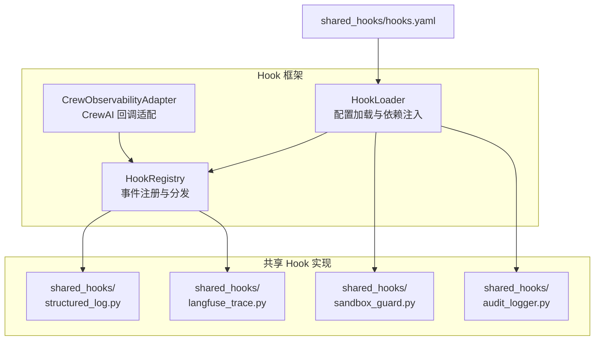
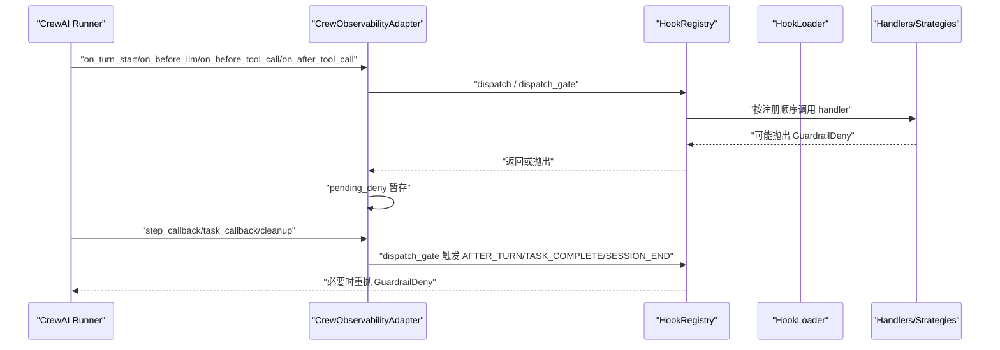
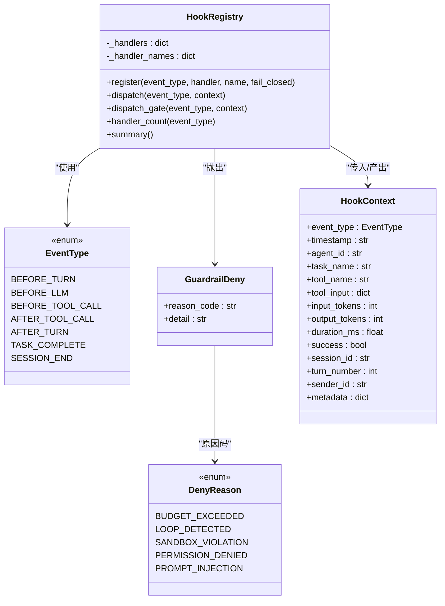
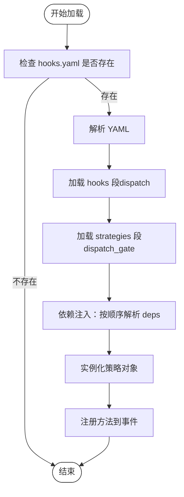
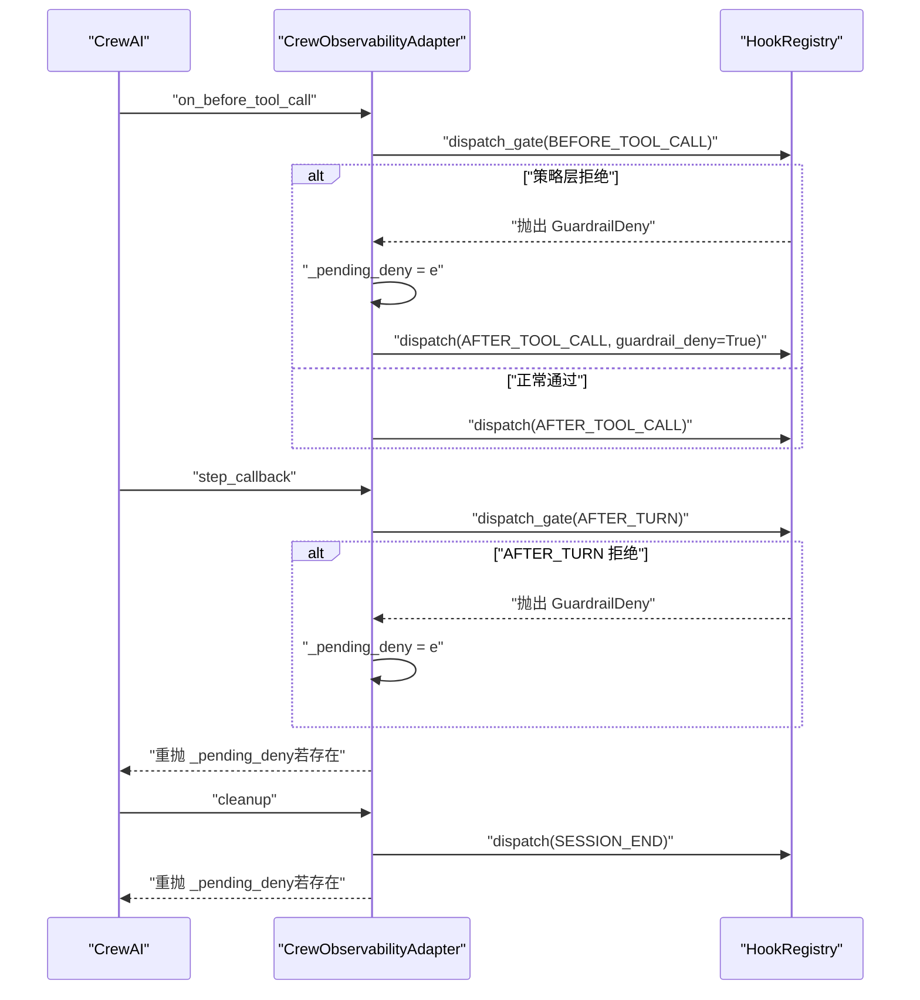
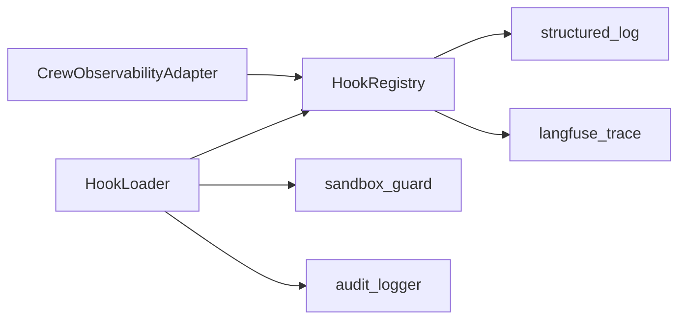

# Hook 框架系统

<cite>
**本文档引用的文件**
- [registry.py](file://xiaopaw/hook_framework/registry.py)
- [loader.py](file://xiaopaw/hook_framework/loader.py)
- [crew_adapter.py](file://xiaopaw/hook_framework/crew_adapter.py)
- [__init__.py](file://xiaopaw/hook_framework/__init__.py)
- [hooks.yaml](file://shared_hooks/hooks.yaml)
- [audit_logger.py](file://shared_hooks/audit_logger.py)
- [sandbox_guard.py](file://shared_hooks/sandbox_guard.py)
- [langfuse_trace.py](file://shared_hooks/langfuse_trace.py)
- [structured_log.py](file://shared_hooks/structured_log.py)
- [test_hook_registry.py](file://tests/unit/hook_framework/test_hook_registry.py)
- [test_hook_loader.py](file://tests/unit/hook_framework/test_hook_loader.py)
- [test_crew_adapter.py](file://tests/unit/hook_framework/test_crew_adapter.py)
- [test_adapter_integration.py](file://tests/integration/test_adapter_integration.py)
- [test_two_layer_config.py](file://tests/integration/test_two_layer_config.py)
</cite>

## 目录
1. [简介](#简介)
2. [项目结构](#项目结构)
3. [核心组件](#核心组件)
4. [架构总览](#架构总览)
5. [详细组件分析](#详细组件分析)
6. [依赖关系分析](#依赖关系分析)
7. [性能考量](#性能考量)
8. [故障排查指南](#故障排查指南)
9. [结论](#结论)
10. [附录](#附录)

## 简介
本文件面向 XiaoPaw v2 的 Hook 框架系统，系统性阐述 HookRegistry、HookLoader 与 CrewObservabilityAdapter 的实现细节与设计原理，涵盖：
- Hook 的生命周期管理与事件模型（5+2 事件体系）
- 配置加载机制与两层加载策略（全局层与工作区层）
- 执行顺序控制与 fail-closed 安全策略
- 与 CrewAI 框架的集成方式与回调适配
- 常见配置与执行问题的定位与修复

## 项目结构
Hook 框架位于 xiaopaw/hook_framework 目录，包含注册中心、加载器与 Crew 适配器三大核心模块，配合 shared_hooks 中的观测与策略实现，形成“观测层（dispatch）+ 策略层（dispatch_gate）”的双轨体系。

图表来源
- [registry.py:118-209](file://xiaopaw/hook_framework/registry.py#L118-L209)
- [loader.py:29-246](file://xiaopaw/hook_framework/loader.py#L29-L246)
- [crew_adapter.py:63-357](file://xiaopaw/hook_framework/crew_adapter.py#L63-L357)
- [hooks.yaml:1-73](file://shared_hooks/hooks.yaml#L1-L73)

章节来源
- [registry.py:1-209](file://xiaopaw/hook_framework/registry.py#L1-L209)
- [loader.py:1-246](file://xiaopaw/hook_framework/loader.py#L1-L246)
- [crew_adapter.py:1-357](file://xiaopaw/hook_framework/crew_adapter.py#L1-L357)
- [hooks.yaml:1-73](file://shared_hooks/hooks.yaml#L1-L73)

## 核心组件
- HookRegistry：定义 5+2 事件类型、HookContext 上下文、两套分发机制（dispatch 与 dispatch_gate）、GuardrailDeny 拒绝信号与 fail-closed 策略。
- HookLoader：解析 hooks.yaml，两层加载（全局与工作区），策略实例化与依赖注入，保证执行顺序与安全约束。
- CrewObservabilityAdapter：将 CrewAI 的回调映射为 5+2 事件，处理 pending_deny 安全出口，计算工具耗时，触发 SESSION_END 清理。

章节来源
- [registry.py:28-209](file://xiaopaw/hook_framework/registry.py#L28-L209)
- [loader.py:29-246](file://xiaopaw/hook_framework/loader.py#L29-L246)
- [crew_adapter.py:63-357](file://xiaopaw/hook_framework/crew_adapter.py#L63-L357)

## 架构总览
Hook 框架采用“配置驱动 + 事件驱动”的架构：
- 配置驱动：hooks.yaml 将 handler 与策略绑定到事件，支持 hooks 段（观测层）与 strategies 段（策略层）。
- 事件驱动：CrewObservabilityAdapter 将 CrewAI 的回调翻译为 5+2 事件，触发 HookRegistry 分发。
- 双轨分发：dispatch（观测层，异常吞掉）与 dispatch_gate（策略层，GuardrailDeny 可穿透，fail-closed 安全兜底）。

图表来源
- [crew_adapter.py:91-357](file://xiaopaw/hook_framework/crew_adapter.py#L91-L357)
- [registry.py:153-198](file://xiaopaw/hook_framework/registry.py#L153-L198)
- [loader.py:37-65](file://xiaopaw/hook_framework/loader.py#L37-L65)

## 详细组件分析

### HookRegistry：事件注册与分发
- 事件类型：BEFORE_TURN、BEFORE_LLM、BEFORE_TOOL_CALL、AFTER_TOOL_CALL、AFTER_TURN、TASK_COMPLETE、SESSION_END。
- 上下文：HookContext 为不可变对象，tool_input 与 metadata 使用只读代理，确保 handler 间数据隔离。
- 分发机制：
  - dispatch：异常吞掉，不影响业务，适用于观测层。
  - dispatch_gate：仅 GuardrailDeny 可穿透，其余异常在 fail-closed=true 时转换为 GuardrailDeny，确保安全组件崩溃时默认拒绝。
- fail-closed：仅在 dispatch_gate 生效，handler 内部异常可转为拒绝，保障安全组件的健壮性。

图表来源
- [registry.py:28-209](file://xiaopaw/hook_framework/registry.py#L28-L209)

章节来源
- [registry.py:28-209](file://xiaopaw/hook_framework/registry.py#L28-L209)

### HookLoader：配置加载与依赖注入
- 两层加载：先全局 shared_hooks，后工作区 hooks，保证全局安全策略优先执行。
- 三段式 YAML：hooks（观测层，dispatch）、strategies（策略层，dispatch_gate）、deps（依赖注入）。
- 加载顺序：严格先 hooks 段，后 strategies 段，确保即使策略层拒绝，观测 handler 已执行并记录证据链。
- 依赖注入：按声明顺序实例化策略，deps 中引用的策略必须先声明；缺失依赖仅警告（fail-open），但运行时会因 fail-closed 转为拒绝。
- 安全校验：禁止路径穿越，模块/函数/类不存在时跳过并打印错误信息。

图表来源
- [loader.py:37-155](file://xiaopaw/hook_framework/loader.py#L37-L155)

章节来源
- [loader.py:29-246](file://xiaopaw/hook_framework/loader.py#L29-L246)
- [hooks.yaml:1-73](file://shared_hooks/hooks.yaml#L1-L73)

### CrewObservabilityAdapter：CrewAI 回调适配
- 生命周期：每轮对话开始实例化，工具调用期间累积 _pending_deny，step_callback/task_callback/cleanup 作为安全出口重抛。
- 事件映射：on_turn_start→BEFORE_TURN、on_before_llm→BEFORE_LLM、on_before_tool_call→BEFORE_TOOL_CALL、on_after_tool_call→AFTER_TOOL_CALL、step_callback→AFTER_TURN、task_callback→TASK_COMPLETE、cleanup→SESSION_END。
- pending_deny：CrewAI 会吞掉 @before_tool_use 抛出的异常，因此在 BEFORE_TOOL_CALL 捕获 GuardrailDeny，暂存到 _pending_deny，等待 step_callback 或 task_callback 重抛。
- 耗时计算：在 BEFORE_TOOL_CALL 记录开始时间，在 AFTER_TOOL_CALL 计算 duration_ms。
- 安全出口：step_callback、task_callback、cleanup 三个安全出口负责重抛 _pending_deny，确保 Runner 能正确感知拒绝。

图表来源
- [crew_adapter.py:160-357](file://xiaopaw/hook_framework/crew_adapter.py#L160-L357)
- [registry.py:170-198](file://xiaopaw/hook_framework/registry.py#L170-L198)

章节来源
- [crew_adapter.py:63-357](file://xiaopaw/hook_framework/crew_adapter.py#L63-L357)

### 典型 Hook 实现示例
- 观测层：structured_log.py 输出每事件一行 JSON 至 stderr，不干扰业务。
- 策略层：sandbox_guard.py 在 BEFORE_TOOL_CALL 对输入进行确定性消毒，命中即抛 GuardrailDeny；fail_closed=True，崩溃时转为拒绝。
- 可观测层：langfuse_trace.py 将事件翻译为 Langfuse trace 树，支持批量提交与强制 flush，保证用户收到回复时数据已就绪。
- 审计层：audit_logger.py 以 append-only JSONL 记录安全事件，支持会话级摘要，供事后分析。

章节来源
- [structured_log.py:1-97](file://shared_hooks/structured_log.py#L1-L97)
- [sandbox_guard.py:1-168](file://shared_hooks/sandbox_guard.py#L1-L168)
- [langfuse_trace.py:1-800](file://shared_hooks/langfuse_trace.py#L1-L800)
- [audit_logger.py:1-90](file://shared_hooks/audit_logger.py#L1-L90)

## 依赖关系分析
- HookRegistry 依赖 EventType、GuardrailDeny、HookContext，提供注册与分发能力。
- HookLoader 依赖 HookRegistry，解析 hooks.yaml，实例化策略并通过 deps 注入依赖。
- CrewObservabilityAdapter 依赖 HookRegistry，将 CrewAI 回调翻译为 5+2 事件。
- shared_hooks 中的实现通过 hooks.yaml 挂载到 HookRegistry。

图表来源
- [loader.py:26-36](file://xiaopaw/hook_framework/loader.py#L26-L36)
- [crew_adapter.py:37-44](file://xiaopaw/hook_framework/crew_adapter.py#L37-L44)
- [hooks.yaml:1-73](file://shared_hooks/hooks.yaml#L1-L73)

章节来源
- [loader.py:26-36](file://xiaopaw/hook_framework/loader.py#L26-L36)
- [crew_adapter.py:37-44](file://xiaopaw/hook_framework/crew_adapter.py#L37-L44)
- [hooks.yaml:1-73](file://shared_hooks/hooks.yaml#L1-L73)

## 性能考量
- dispatch 与 dispatch_gate 的异常吞掉策略避免了观测层与策略层的性能抖动相互影响。
- langfuse_trace 的批量提交与锁保护减少并发写入开销，flush 时机可控。
- HookRegistry 的注册顺序即执行顺序，避免额外排序成本。
- fail-closed 仅在策略层生效，降低误拒概率，同时保证安全组件崩溃时的兜底拒绝。

## 故障排查指南
- YAML 解析失败：检查 hooks.yaml 语法与字段类型，确保 hooks 与 strategies 段格式正确。
- handler/策略未加载：确认模块路径与函数/类名存在，避免路径穿越；模块/函数/类不存在时会打印错误并跳过。
- 依赖缺失：deps 引用的策略未声明会导致 None 注入，运行时 AttributeError；建议将被依赖策略置于 deps 前面声明。
- 策略层拒绝：检查 BEFORE_TOOL_CALL 链路是否触发 GuardrailDeny；可通过 step_callback/task_callback/cleanup 的 _pending_deny 获取拒绝原因。
- 观测层异常：dispatch 吞掉异常，不影响业务；如需定位，检查 stderr 输出与日志文件。
- 两层加载顺序：确保全局层在工作区层之前加载，避免工作区 handler 覆盖全局策略。

章节来源
- [test_hook_loader.py:36-84](file://tests/unit/hook_framework/test_hook_loader.py#L36-L84)
- [test_hook_registry.py:52-67](file://tests/unit/hook_framework/test_hook_registry.py#L52-L67)
- [test_crew_adapter.py:145-198](file://tests/unit/hook_framework/test_crew_adapter.py#L145-L198)
- [test_adapter_integration.py:50-68](file://tests/integration/test_adapter_integration.py#L50-L68)

## 结论
XiaoPaw v2 的 Hook 框架通过清晰的事件模型、严格的两层加载策略与 fail-closed 安全机制，实现了可观测与安全的解耦。CrewObservabilityAdapter 将 CrewAI 的回调无缝映射到 Hook 事件，结合 pending_deny 安全出口，确保策略层的拒绝能够可靠地传递到 Runner。通过 shared_hooks 中的观测与策略实现，系统在生产环境中具备高可用与可审计性。

## 附录

### 代码示例路径（注册、加载与执行）
- 注册与分发
  - [HookRegistry.register:135-152](file://xiaopaw/hook_framework/registry.py#L135-L152)
  - [HookRegistry.dispatch:153-169](file://xiaopaw/hook_framework/registry.py#L153-L169)
  - [HookRegistry.dispatch_gate:170-198](file://xiaopaw/hook_framework/registry.py#L170-L198)
- 配置加载与依赖注入
  - [HookLoader.load_from_directory:37-65](file://xiaopaw/hook_framework/loader.py#L37-L65)
  - [HookLoader.load_two_layers:235-246](file://xiaopaw/hook_framework/loader.py#L235-L246)
  - [HookLoader._load_strategies_section:88-155](file://xiaopaw/hook_framework/loader.py#L88-L155)
- CrewAI 集成
  - [CrewObservabilityAdapter.on_before_tool_call:160-207](file://xiaopaw/hook_framework/crew_adapter.py#L160-L207)
  - [CrewObservabilityAdapter.make_step_callback:250-301](file://xiaopaw/hook_framework/crew_adapter.py#L250-L301)
  - [CrewObservabilityAdapter.cleanup:329-357](file://xiaopaw/hook_framework/crew_adapter.py#L329-L357)

### 测试参考
- 单元测试
  - [test_hook_registry.py:1-174](file://tests/unit/hook_framework/test_hook_registry.py#L1-L174)
  - [test_hook_loader.py:1-287](file://tests/unit/hook_framework/test_hook_loader.py#L1-L287)
  - [test_crew_adapter.py:1-245](file://tests/unit/hook_framework/test_crew_adapter.py#L1-L245)
- 集成测试
  - [test_adapter_integration.py:1-138](file://tests/integration/test_adapter_integration.py#L1-L138)
  - [test_two_layer_config.py:1-106](file://tests/integration/test_two_layer_config.py#L1-L106)