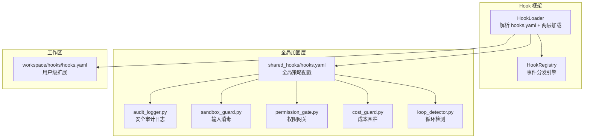
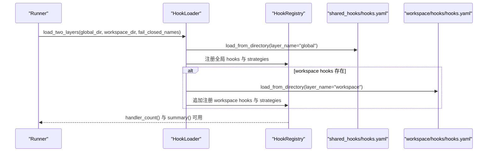
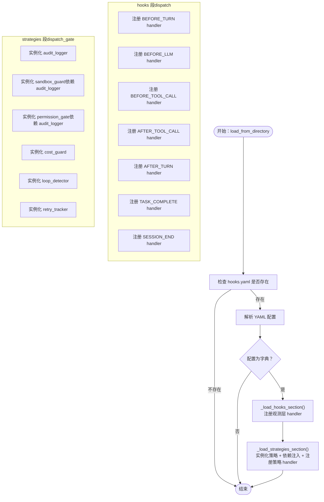
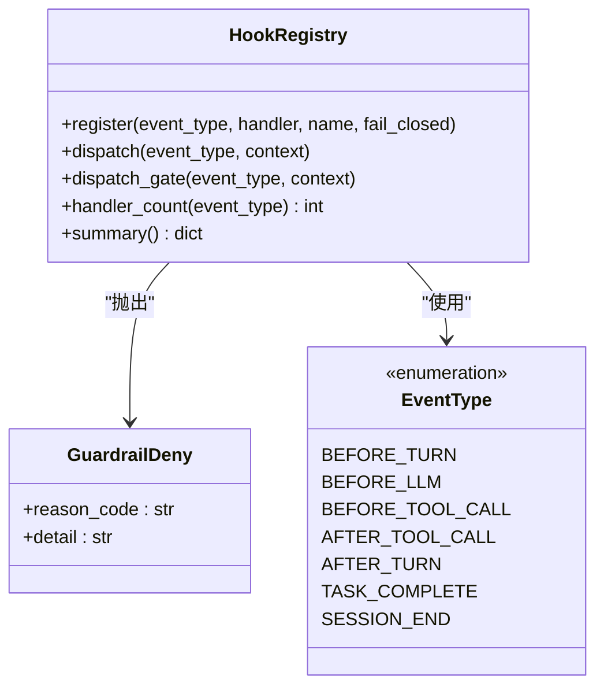
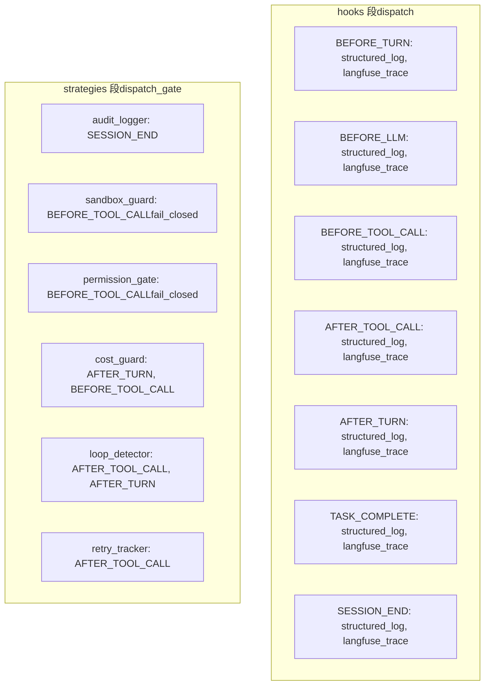
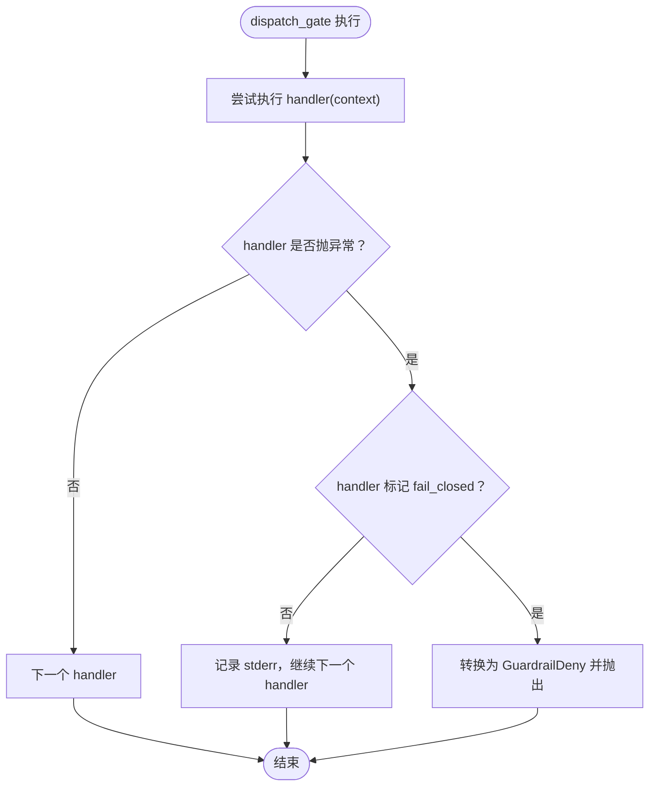
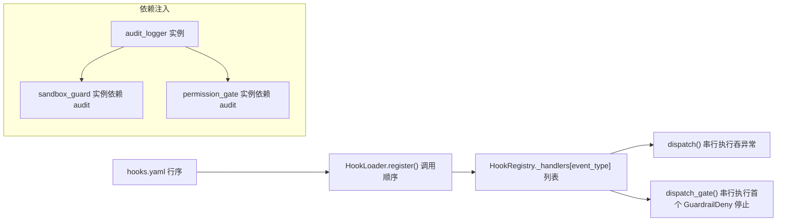
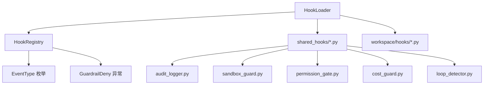

# HookLoader 配置加载器

<cite>
**本文档引用的文件**
- [loader.py](file://xiaopaw/hook_framework/loader.py)
- [registry.py](file://xiaopaw/hook_framework/registry.py)
- [hooks.yaml](file://shared_hooks/hooks.yaml)
- [audit_logger.py](file://shared_hooks/audit_logger.py)
- [sandbox_guard.py](file://shared_hooks/sandbox_guard.py)
- [permission_gate.py](file://shared_hooks/permission_gate.py)
- [cost_guard.py](file://shared_hooks/cost_guard.py)
- [loop_detector.py](file://shared_hooks/loop_detector.py)
- [test_hook_loader.py](file://tests/unit/hook_framework/test_hook_loader.py)
- [test_two_layer_config.py](file://tests/integration/test_two_layer_config.py)
- [hook_yaml_samples.py](file://tests/fixtures/hook_yaml_samples.py)
- [12-hook-hardening.md](file://docs/12-hook-hardening.md)
- [conftest.py](file://tests/e2e/conftest.py)
</cite>

## 目录
1. [简介](#简介)
2. [项目结构](#项目结构)
3. [核心组件](#核心组件)
4. [架构概览](#架构概览)
5. [详细组件分析](#详细组件分析)
6. [依赖关系分析](#依赖关系分析)
7. [性能考虑](#性能考虑)
8. [故障排除指南](#故障排除指南)
9. [结论](#结论)
10. [附录](#附录)

## 简介
HookLoader 是 XiaoPaw v3 Hook 框架的核心配置加载器，负责解析 hooks.yaml 两层配置（全局 shared_hooks 与工作区 workspace hooks），动态加载并实例化策略，建立依赖注入关系，并将处理器注册到 HookRegistry 中。其设计遵循 fail-closed 安全策略，确保安全组件在发生异常时能够默认拒绝，从而保障系统的安全性。

## 项目结构
HookLoader 所在的 Hook 框架位于 `xiaopaw/hook_framework/` 目录，配合 `shared_hooks/` 提供的全局安全策略与可观测性 handler，以及测试用例验证配置加载与执行顺序。



**图表来源**
- [loader.py:29-246](file://xiaopaw/hook_framework/loader.py#L29-L246)
- [registry.py:118-209](file://xiaopaw/hook_framework/registry.py#L118-L209)
- [hooks.yaml:1-73](file://shared_hooks/hooks.yaml#L1-L73)

**章节来源**
- [loader.py:1-246](file://xiaopaw/hook_framework/loader.py#L1-L246)
- [registry.py:1-209](file://xiaopaw/hook_framework/registry.py#L1-L209)
- [hooks.yaml:1-73](file://shared_hooks/hooks.yaml#L1-L73)

## 核心组件
- HookLoader：负责解析 hooks.yaml，动态导入模块，实例化策略对象，建立依赖注入关系，并将 handler 注册到 HookRegistry。
- HookRegistry：维护事件类型与处理器的映射，提供 dispatch（报警器模式）与 dispatch_gate（保险丝模式）两种分发机制。
- 全局策略模块：audit_logger、sandbox_guard、permission_gate、cost_guard、loop_detector 等，通过 hooks.yaml 的 strategies 段进行配置与依赖注入。

**章节来源**
- [loader.py:29-246](file://xiaopaw/hook_framework/loader.py#L29-L246)
- [registry.py:118-209](file://xiaopaw/hook_framework/registry.py#L118-L209)
- [hooks.yaml:28-73](file://shared_hooks/hooks.yaml#L28-L73)

## 架构概览
HookLoader 的两层配置加载策略确保全局安全策略与可观测性 handler 优先于工作区扩展加载，同时保证策略层的 fail-closed 安全语义。



**图表来源**
- [loader.py:235-246](file://xiaopaw/hook_framework/loader.py#L235-L246)
- [hooks.yaml:1-73](file://shared_hooks/hooks.yaml#L1-L73)

**章节来源**
- [loader.py:235-246](file://xiaopaw/hook_framework/loader.py#L235-L246)
- [hooks.yaml:1-73](file://shared_hooks/hooks.yaml#L1-L73)

## 详细组件分析

### HookLoader：两层配置加载与动态加载流程
HookLoader 的核心职责包括：
- 解析 hooks.yaml：支持 hooks 段（观测层，使用 dispatch）与 strategies 段（策略层，使用 dispatch_gate）。
- 两层加载：先加载全局 shared_hooks，再加载工作区 workspace hooks，后者追加到全局之后执行。
- 动态导入：通过 importlib 动态加载模块，支持模块缓存避免重复加载。
- 依赖注入：按声明顺序实例化策略，后声明的策略可通过 deps 引用前面已实例化的策略。
- fail-closed：通过 fail_closed_names 标记安全策略，使其在异常时转换为 GuardrailDeny。



**图表来源**
- [loader.py:37-154](file://xiaopaw/hook_framework/loader.py#L37-L154)
- [hooks.yaml:4-73](file://shared_hooks/hooks.yaml#L4-L73)

**章节来源**
- [loader.py:37-154](file://xiaopaw/hook_framework/loader.py#L37-L154)
- [hooks.yaml:4-73](file://shared_hooks/hooks.yaml#L4-L73)

### HookRegistry：事件分发与 fail-closed 机制
HookRegistry 提供两类分发机制：
- dispatch：报警器模式，吞掉 handler 内部异常，不影响业务继续执行。
- dispatch_gate：保险丝模式，仅 GuardrailDeny 能穿透，其余异常被吞掉；若 handler 标记 fail_closed，则异常转换为 GuardrailDeny。



**图表来源**
- [registry.py:118-209](file://xiaopaw/hook_framework/registry.py#L118-L209)

**章节来源**
- [registry.py:118-209](file://xiaopaw/hook_framework/registry.py#L118-L209)

### 全局 hooks.yaml 配置详解
全局 hooks.yaml 将观测层与策略层分离：
- 观测层（hooks 段）：在 dispatch 模式下执行，即使策略层 deny，观测 handler 也会记录完整证据链。
- 策略层（strategies 段）：在 dispatch_gate 模式下执行，支持 fail-closed 与依赖注入。



**图表来源**
- [hooks.yaml:1-73](file://shared_hooks/hooks.yaml#L1-L73)

**章节来源**
- [hooks.yaml:1-73](file://shared_hooks/hooks.yaml#L1-L73)

### 策略依赖注入与执行顺序
- 依赖注入：strategies 按声明顺序实例化，后声明的策略通过 deps 引用前面已实例化的策略。
- 执行顺序：hooks 段整体先于 strategies 段，确保即使策略层 deny，观测 handler 已记录完整 trace/log。
- fail-closed：通过 fail_closed_names 标记安全策略，使其在异常时转换为 GuardrailDeny，默认拒绝。

```mermaid
sequenceDiagram
participant Loader as "HookLoader"
participant Audit as "audit_logger"
participant Sandbox as "sandbox_guard"
participant Perm as "permission_gate"
participant Cost as "cost_guard"
participant Loop as "loop_detector"
participant Registry as "HookRegistry"
Loader->>Audit : 实例化无 deps
Loader->>Sandbox : 实例化deps : audit=audit_logger
Loader->>Perm : 实例化deps : audit=audit_logger
Loader->>Cost : 实例化
Loader->>Loop : 实例化
Loader->>Registry : 注册各策略的 handlerdispatch_gate
Note over Registry,Sandbox : fail_closed_names 标记安全策略
```

**图表来源**
- [loader.py:88-154](file://xiaopaw/hook_framework/loader.py#L88-L154)
- [hooks.yaml:28-73](file://shared_hooks/hooks.yaml#L28-L73)

**章节来源**
- [loader.py:88-154](file://xiaopaw/hook_framework/loader.py#L88-L154)
- [hooks.yaml:28-73](file://shared_hooks/hooks.yaml#L28-L73)

### fail-closed 安全策略实现原理与配置
- 实现原理：HookRegistry 在 dispatch_gate 中，若 handler 标记 fail_closed，则 handler 内部异常会被转换为 GuardrailDeny，从而阻断业务。
- 配置方法：通过 load_from_directory 的 fail_closed_names 参数传入安全策略名称集合，HookLoader 在注册时设置 fail_closed=True。
- 典型安全策略：sandbox_guard、permission_gate 在 E2E 测试中被标记为 fail_closed。



**图表来源**
- [registry.py:170-197](file://xiaopaw/hook_framework/registry.py#L170-L197)

**章节来源**
- [registry.py:170-197](file://xiaopaw/hook_framework/registry.py#L170-L197)
- [conftest.py:48-53](file://tests/e2e/conftest.py#L48-L53)

### 配置示例：不同类型的 Hook 配置语法与参数选项
以下示例展示了 hooks.yaml 中的典型配置语法与参数选项（基于测试样例与真实配置）：

- 观测层 handler 配置
  - 语法：hooks.<事件类型> 下的 handler 字段，支持字符串或对象形式。
  - 示例：BEFORE_TURN、BEFORE_LLM、BEFORE_TOOL_CALL 等事件下的 handler 列表。
  - 参考：[hooks.yaml:4-25](file://shared_hooks/hooks.yaml#L4-L25)

- 策略层配置
  - name：策略实例名称，用于依赖注入。
  - class：模块类引用，格式为 "module.Class"。
  - config：传递给策略构造函数的参数字典。
  - hooks：将策略方法绑定到事件的映射。
  - deps：依赖注入映射，键为构造函数参数名，值为已实例化的策略名称。
  - 示例：audit_logger、sandbox_guard、permission_gate、cost_guard、loop_detector、retry_tracker。
  - 参考：[hooks.yaml:28-73](file://shared_hooks/hooks.yaml#L28-L73)

- 测试样例中的配置片段
  - 有效 hooks 配置与 handler：[VALID_HOOKS_YAML:3-9](file://tests/fixtures/hook_yaml_samples.py#L3-L9)
  - 有效 strategies 配置与 Counter 策略：[STRATEGIES_YAML:21-29](file://tests/fixtures/hook_yaml_samples.py#L21-L29)
  - 依赖注入示例：[DEPS_YAML:40-53](file://tests/fixtures/hook_yaml_samples.py#L40-L53)

**章节来源**
- [hooks.yaml:4-73](file://shared_hooks/hooks.yaml#L4-L73)
- [hook_yaml_samples.py:3-53](file://tests/fixtures/hook_yaml_samples.py#L3-L53)

### 执行顺序控制与依赖关系管理
- 注册顺序即执行顺序：HookLoader 严格按 hooks.yaml 中的声明顺序调用 register()，因此 yaml 里的行序直接决定运行时的执行链路。
- 依赖关系：strategies 段按声明顺序实例化，后声明的策略通过 deps 引用前面已实例化的策略；若依赖缺失，仅打印 WARNING（fail-open），但运行时调用 self.audit.xxx 可能 AttributeError，且因 fail_closed 会转换为 GuardrailDeny。
- 事件绑定：每个策略通过 hooks 映射将其方法绑定到相应事件，如 BEFORE_TOOL_CALL、AFTER_TURN 等。



**图表来源**
- [registry.py:135-151](file://xiaopaw/hook_framework/registry.py#L135-L151)
- [loader.py:115-137](file://xiaopaw/hook_framework/loader.py#L115-L137)

**章节来源**
- [registry.py:135-151](file://xiaopaw/hook_framework/registry.py#L135-L151)
- [loader.py:115-137](file://xiaopaw/hook_framework/loader.py#L115-L137)

## 依赖关系分析
HookLoader 与 HookRegistry 的耦合关系清晰，Loader 负责配置解析与动态加载，Registry 负责事件分发与安全语义。全局策略模块通过 hooks.yaml 与 Loader/Registry 协同工作。



**图表来源**
- [loader.py:26-36](file://xiaopaw/hook_framework/loader.py#L26-L36)
- [registry.py:118-127](file://xiaopaw/hook_framework/registry.py#L118-L127)

**章节来源**
- [loader.py:26-36](file://xiaopaw/hook_framework/loader.py#L26-L36)
- [registry.py:118-127](file://xiaopaw/hook_framework/registry.py#L118-L127)

## 性能考虑
- 模块缓存：HookLoader 使用 _module_cache 避免同一文件被多次加载，减少 IO 与导入开销。
- 事件分发：dispatch 与 dispatch_gate 分离，观测层异常不影响业务，策略层异常可快速阻断。
- 依赖注入：按声明顺序实例化，避免循环依赖；缺失依赖仅打印 WARNING，fail-open 降低启动失败风险。
- 策略顺序：安全策略（sandbox_guard、permission_gate）置于策略层首位，确保输入消毒与权限检查在成本与循环检测之前执行。

**章节来源**
- [loader.py:32-36](file://xiaopaw/hook_framework/loader.py#L32-L36)
- [loader.py:115-137](file://xiaopaw/hook_framework/loader.py#L115-L137)
- [registry.py:153-197](file://xiaopaw/hook_framework/registry.py#L153-L197)

## 故障排除指南
常见问题与解决方案：
- YAML 解析错误
  - 现象：YAML 语法错误导致配置未加载。
  - 处理：检查 hooks.yaml 语法，确保为有效字典结构。
  - 参考：[test_hook_loader.py:36-54](file://tests/unit/hook_framework/test_hook_loader.py#L36-L54)

- 缺少模块或函数
  - 现象：handler 或策略类引用不存在，注册被跳过。
  - 处理：确认模块路径与函数/类名正确，模块文件存在。
  - 参考：[test_hook_loader.py:56-74](file://tests/unit/hook_framework/test_hook_loader.py#L56-L74)

- 路径遍历攻击防护
  - 现象：handler 或策略类引用包含路径遍历，被阻断。
  - 处理：修正引用路径，确保模块文件位于 hooks 目录内。
  - 参考：[test_hook_loader.py:76-83](file://tests/unit/hook_framework/test_hook_loader.py#L76-L83)

- 依赖缺失（fail-open）
  - 现象：后声明策略依赖的前置策略未实例化，仅打印 WARNING。
  - 处理：调整声明顺序，确保被依赖策略先于依赖者声明。
  - 参考：[loader.py:115-123](file://xiaopaw/hook_framework/loader.py#L115-L123)

- fail-closed 导致的拒绝风暴
  - 现象：安全策略异常被转换为 GuardrailDeny，阻断所有请求。
  - 处理：检查安全策略实现与依赖注入，确保依赖对象正确注入。
  - 参考：[audit_logger.py:14-19](file://shared_hooks/audit_logger.py#L14-L19)

**章节来源**
- [test_hook_loader.py:36-83](file://tests/unit/hook_framework/test_hook_loader.py#L36-L83)
- [loader.py:115-123](file://xiaopaw/hook_framework/loader.py#L115-L123)
- [audit_logger.py:14-19](file://shared_hooks/audit_logger.py#L14-L19)

## 结论
HookLoader 通过两层配置加载策略、动态模块导入、依赖注入与 fail-closed 安全语义，构建了灵活且安全的 Hook 框架。全局加固层提供统一的安全与可观测性策略，工作区层允许用户定制扩展。严格的执行顺序与事件绑定机制确保策略链路的可控性与可审计性。

## 附录

### 配置最佳实践
- 将安全策略（sandbox_guard、permission_gate）置于 strategies 段首位，确保依赖注入正确。
- 使用 fail_closed_names 明确标记安全策略，避免因异常导致的系统瘫痪。
- 在 hooks.yaml 中按事件维度合理组织 handler，确保观测层在策略层 deny 时仍能记录完整证据链。
- 通过 workspace hooks 仅追加用户级扩展，避免覆盖全局策略。

**章节来源**
- [hooks.yaml:28-73](file://shared_hooks/hooks.yaml#L28-L73)
- [conftest.py:48-53](file://tests/e2e/conftest.py#L48-L53)