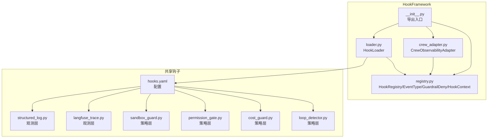
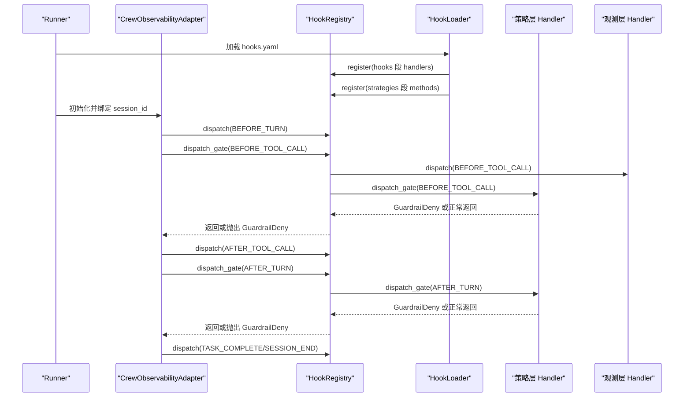
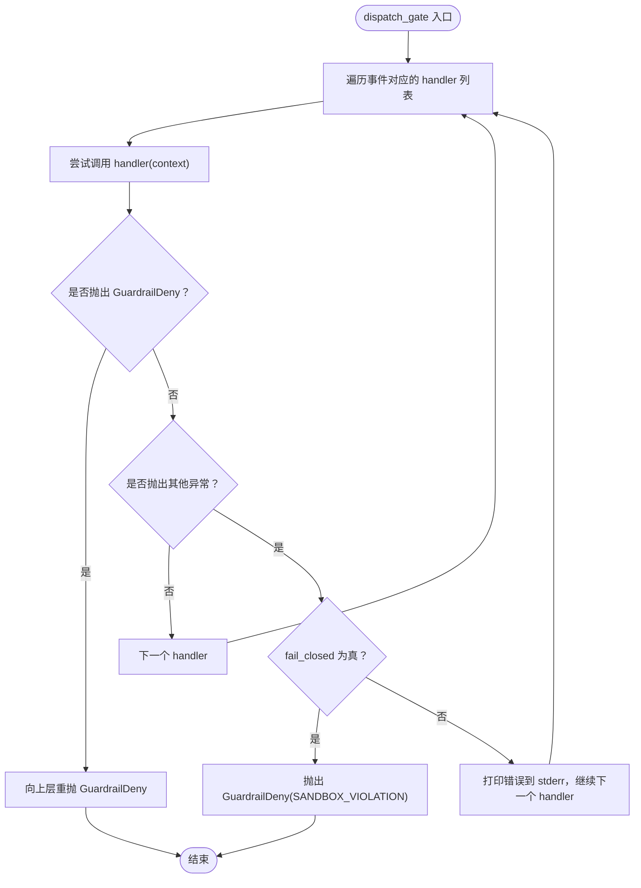
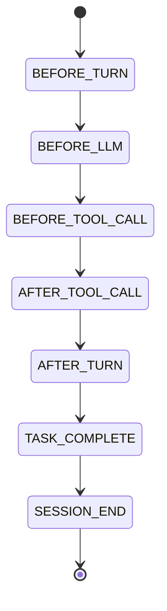
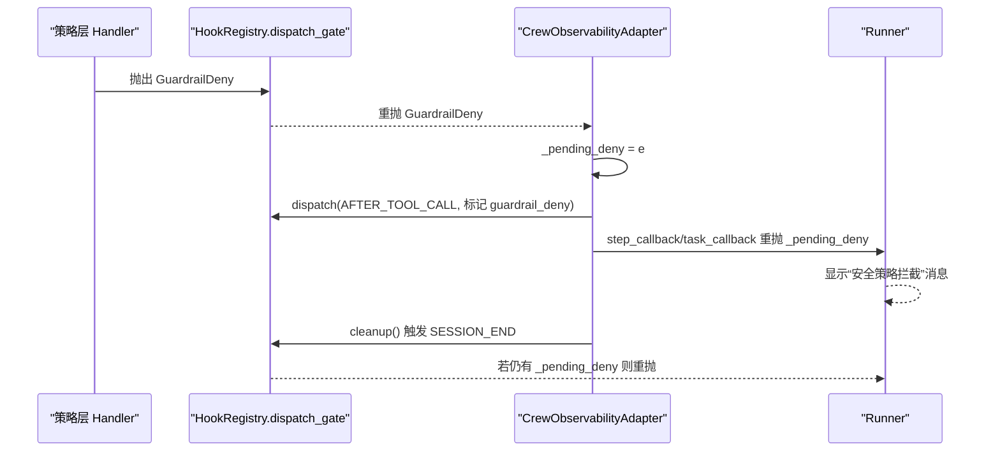
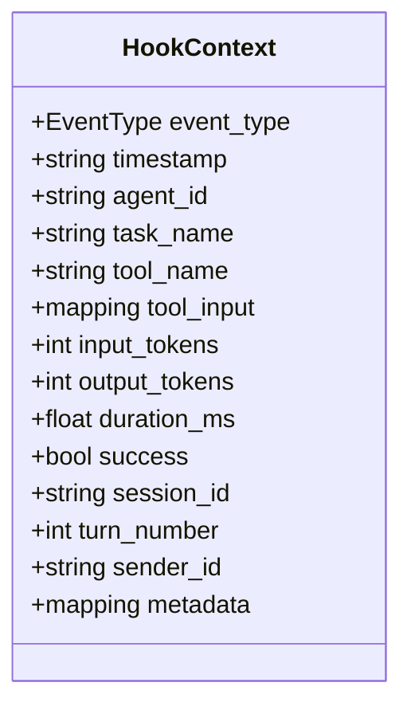
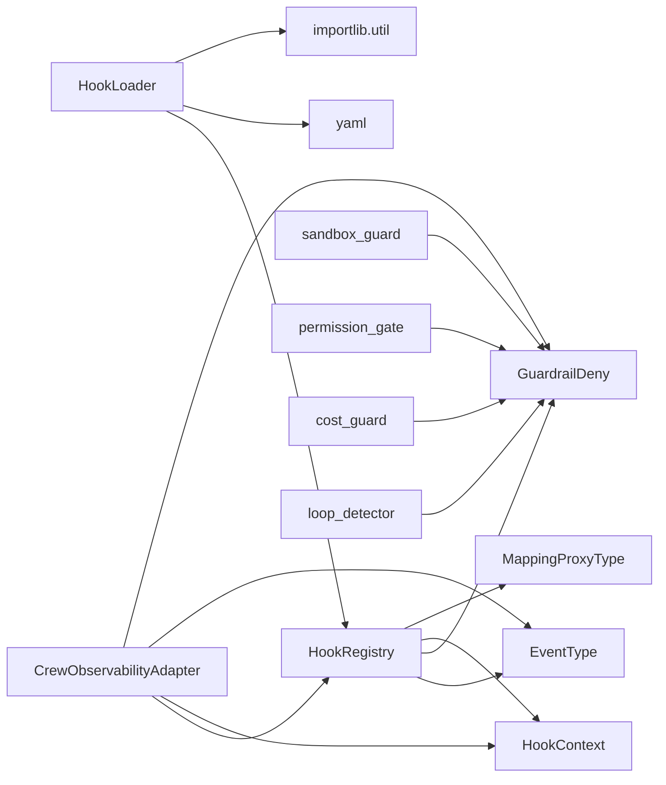

# HookRegistry 注册中心

<cite>
**本文档引用的文件**
- [registry.py](file://xiaopaw/hook_framework/registry.py)
- [loader.py](file://xiaopaw/hook_framework/loader.py)
- [crew_adapter.py](file://xiaopaw/hook_framework/crew_adapter.py)
- [__init__.py](file://xiaopaw/hook_framework/__init__.py)
- [hooks.yaml](file://shared_hooks/hooks.yaml)
- [structured_log.py](file://shared_hooks/structured_log.py)
- [langfuse_trace.py](file://shared_hooks/langfuse_trace.py)
- [sandbox_guard.py](file://shared_hooks/sandbox_guard.py)
- [permission_gate.py](file://shared_hooks/permission_gate.py)
- [cost_guard.py](file://shared_hooks/cost_guard.py)
- [loop_detector.py](file://shared_hooks/loop_detector.py)
- [test_hook_registry.py](file://tests/unit/hook_framework/test_hook_registry.py)
- [test_hook_chain.py](file://tests/integration/test_hook_chain.py)
- [test_guardrail_deny_flow.py](file://tests/integration/test_guardrail_deny_flow.py)
</cite>

## 目录
1. [简介](#简介)
2. [项目结构](#项目结构)
3. [核心组件](#核心组件)
4. [架构总览](#架构总览)
5. [详细组件分析](#详细组件分析)
6. [依赖关系分析](#依赖关系分析)
7. [性能考量](#性能考量)
8. [故障排查指南](#故障排查指南)
9. [结论](#结论)
10. [附录](#附录)

## 简介
本文件为 HookRegistry 注册中心的技术文档，系统阐述其核心设计与实现细节。HookRegistry 提供五种核心事件类型（BEFORE_TURN、BEFORE_LLM、BEFORE_TOOL_CALL、AFTER_TOOL_CALL、AFTER_TURN）与两种补充事件（TASK_COMPLETE、SESSION_END）的生命周期管理，以及两套分发机制：dispatch（报警器模式）与 dispatch_gate（保险丝模式）。文档还解释 GuardrailDeny 异常的设计目的与传播路径，HookContext 的不可变设计与 MappingProxyType 的使用方式，并结合真实代码示例展示注册、分发与异常处理流程。最后给出常见问题的解决方案与性能优化建议。

## 项目结构
HookFramework 相关代码位于 xiaopaw/hook_framework，包含注册中心、加载器、Crew 适配器等模块；共享钩子策略位于 shared_hooks，包含观测层（structured_log、langfuse_trace）与策略层（sandbox_guard、permission_gate、cost_guard、loop_detector、retry_tracker 等）。

图表来源
- [registry.py:118-209](file://xiaopaw/hook_framework/registry.py#L118-L209)
- [loader.py:29-246](file://xiaopaw/hook_framework/loader.py#L29-L246)
- [crew_adapter.py:63-357](file://xiaopaw/hook_framework/crew_adapter.py#L63-L357)
- [__init__.py:1-4](file://xiaopaw/hook_framework/__init__.py#L1-L4)
- [hooks.yaml:1-73](file://shared_hooks/hooks.yaml#L1-L73)

章节来源
- [registry.py:1-209](file://xiaopaw/hook_framework/registry.py#L1-L209)
- [loader.py:1-246](file://xiaopaw/hook_framework/loader.py#L1-L246)
- [crew_adapter.py:1-357](file://xiaopaw/hook_framework/crew_adapter.py#L1-L357)
- [hooks.yaml:1-73](file://shared_hooks/hooks.yaml#L1-L73)

## 核心组件
- 事件类型（EventType）：定义五种核心事件与两种补充事件，严格规定 TURN 生命周期顺序与触发时机。
- HookContext：不可变上下文，使用 MappingProxyType 保证 tool_input 与 metadata 只读，防止 handler 串行执行时互相污染。
- HookRegistry：注册中心，提供 register、dispatch、dispatch_gate、handler_count、summary 等能力。
- GuardrailDeny：唯一能穿透 dispatch_gate 的异常，用于策略层阻断业务流。
- DenyReason：标准化拒绝原因码，便于审计与归因。

章节来源
- [registry.py:28-116](file://xiaopaw/hook_framework/registry.py#L28-L116)
- [registry.py:118-209](file://xiaopaw/hook_framework/registry.py#L118-L209)

## 架构总览
HookRegistry 与 HookLoader、CrewObservabilityAdapter 协同工作：Loader 从 hooks.yaml 加载配置，将 handler 注册到 Registry；CrewAdapter 将 CrewAI 回调翻译为 5+2 事件，驱动 Registry 的 dispatch 与 dispatch_gate 分发；策略层（sandbox_guard、permission_gate、cost_guard、loop_detector）与观测层（structured_log、langfuse_trace）分别挂载在不同事件上，遵循“观测层先于策略层”的执行顺序。

图表来源
- [loader.py:37-65](file://xiaopaw/hook_framework/loader.py#L37-L65)
- [crew_adapter.py:91-357](file://xiaopaw/hook_framework/crew_adapter.py#L91-L357)
- [registry.py:153-198](file://xiaopaw/hook_framework/registry.py#L153-L198)

章节来源
- [loader.py:37-65](file://xiaopaw/hook_framework/loader.py#L37-L65)
- [crew_adapter.py:91-357](file://xiaopaw/hook_framework/crew_adapter.py#L91-L357)
- [registry.py:153-198](file://xiaopaw/hook_framework/registry.py#L153-L198)

## 详细组件分析

### HookRegistry：注册中心与分发机制
- 注册顺序即执行顺序：HookLoader 严格按 hooks.yaml 声明顺序调用 register，因此 yaml 行序直接决定运行时链路。
- 两套分发机制：
  - dispatch（报警器模式）：吞掉所有异常，不影响业务；适用于观测层（如 structured_log、langfuse_trace）。
  - dispatch_gate（保险丝模式）：仅 GuardrailDeny 能穿透；其他异常可被吞掉或在 fail_closed=True 时转换为 GuardrailDeny；适用于策略层（如 sandbox_guard、permission_gate、cost_guard、loop_detector）。
- fail_closed 语义：
  - false（默认）：handler 内部异常被吞掉（与 dispatch 一致）。
  - true：handler 自身崩溃 → 转换为 GuardrailDeny 抛出（fail-closed 默认拒绝），用于安全组件。
- 辅助能力：handler_count、summary 用于调试与排障。

图表来源
- [registry.py:170-198](file://xiaopaw/hook_framework/registry.py#L170-L198)

章节来源
- [registry.py:129-209](file://xiaopaw/hook_framework/registry.py#L129-L209)

### 事件生命周期与事件类型
- 五种核心事件按 TURN 生命周期顺序触发：
  - BEFORE_TURN → BEFORE_LLM → BEFORE_TOOL_CALL → AFTER_TOOL_CALL → AFTER_TURN
- 两种补充事件按需触发：
  - TASK_COMPLETE：CrewAI Task 完成回调
  - SESSION_END：整个会话结束（runner.cleanup 时触发）

图表来源
- [registry.py:28-45](file://xiaopaw/hook_framework/registry.py#L28-L45)

章节来源
- [registry.py:28-45](file://xiaopaw/hook_framework/registry.py#L28-L45)

### GuardrailDeny 异常与传播路径
- 设计目的：唯一能穿透 dispatch_gate 的异常，用于策略层阻断业务流。
- 传播路径：
  - 策略层 handler 抛出 GuardrailDeny，dispatch_gate 捕获后向上重抛。
  - CrewObservabilityAdapter 在 BEFORE_TOOL_CALL 捕获并暂存 _pending_deny，等待 step_callback 或 task_callback 的安全出口统一重抛。
  - SESSION_END 时若仍有 _pending_deny，cleanup 也会重抛，确保 Runner 能收到最终拦截原因。

图表来源
- [registry.py:60-75](file://xiaopaw/hook_framework/registry.py#L60-L75)
- [crew_adapter.py:160-207](file://xiaopaw/hook_framework/crew_adapter.py#L160-L207)
- [crew_adapter.py:250-301](file://xiaopaw/hook_framework/crew_adapter.py#L250-L301)
- [crew_adapter.py:329-357](file://xiaopaw/hook_framework/crew_adapter.py#L329-L357)

章节来源
- [registry.py:60-75](file://xiaopaw/hook_framework/registry.py#L60-L75)
- [crew_adapter.py:160-207](file://xiaopaw/hook_framework/crew_adapter.py#L160-L207)
- [crew_adapter.py:250-301](file://xiaopaw/hook_framework/crew_adapter.py#L250-L301)
- [crew_adapter.py:329-357](file://xiaopaw/hook_framework/crew_adapter.py#L329-L357)

### HookContext 不可变设计与 MappingProxyType 使用
- frozen=True：防止整个上下文对象被替换，保障多 handler 串行执行时的数据一致性。
- MappingProxyType：对 tool_input 与 metadata 进行只读包装，避免 handler 修改原始输入，防止污染后续 handler。
- 字段约定：包含事件类型、时间戳、会话与轮次信息、工具名与输入、token 用量、耗时、成功标志、发送者 ID、扩展 metadata 等。

图表来源
- [registry.py:77-116](file://xiaopaw/hook_framework/registry.py#L77-L116)

章节来源
- [registry.py:77-116](file://xiaopaw/hook_framework/registry.py#L77-L116)

### 两套分发机制的使用场景
- 观测层（hooks 段）：使用 dispatch，即使写日志或上报失败也不影响业务。
- 策略层（strategies 段）：使用 dispatch_gate，首个拒绝（GuardrailDeny）立即中止链路；fail_closed 用于安全组件自崩溃时的 fail-closed 默认拒绝。

章节来源
- [loader.py:8-18](file://xiaopaw/hook_framework/loader.py#L8-L18)
- [registry.py:118-127](file://xiaopaw/hook_framework/registry.py#L118-L127)
- [registry.py:170-198](file://xiaopaw/hook_framework/registry.py#L170-L198)

### 配置与加载（hooks.yaml）
- hooks 段：观测层 handler，使用 dispatch。
- strategies 段：策略层对象，通过 deps 注入共享实例（如 audit_logger），按声明顺序实例化，fail_closed 名称集合控制 fail-closed 行为。
- 两层加载：先全局 shared_hooks，后 workspace 用户级 hooks，保持顺序约束。

章节来源
- [hooks.yaml:1-73](file://shared_hooks/hooks.yaml#L1-L73)
- [loader.py:37-65](file://xiaopaw/hook_framework/loader.py#L37-L65)
- [loader.py:235-246](file://xiaopaw/hook_framework/loader.py#L235-L246)

### 策略层与观测层示例
- 观测层：structured_log、langfuse_trace 在 BEFORE_TURN/BEFORE_LLM/BEFORE_TOOL_CALL/AFTER_TOOL_CALL/AFTER_TURN/TASK_COMPLETE/SESSION_END 等事件上输出日志与 trace。
- 策略层：
  - sandbox_guard：输入消毒，fail_closed=True，首个命中即拒绝。
  - permission_gate：工具权限网关，支持 deny/warn/allow 三级策略。
  - cost_guard：实时 token 成本追踪，超预算拒绝。
  - loop_detector：基于状态哈希的循环检测。

章节来源
- [structured_log.py:1-97](file://shared_hooks/structured_log.py#L1-L97)
- [langfuse_trace.py:1-800](file://shared_hooks/langfuse_trace.py#L1-L800)
- [sandbox_guard.py:1-168](file://shared_hooks/sandbox_guard.py#L1-L168)
- [permission_gate.py:1-107](file://shared_hooks/permission_gate.py#L1-L107)
- [cost_guard.py:1-100](file://shared_hooks/cost_guard.py#L1-L100)
- [loop_detector.py:1-84](file://shared_hooks/loop_detector.py#L1-L84)

## 依赖关系分析
- HookRegistry 依赖 EventType、GuardrailDeny、HookContext、MappingProxyType、dataclasses 等。
- HookLoader 依赖 yaml、importlib.util、pathlib.Path，负责从 hooks.yaml 加载并注册 handlers。
- CrewObservabilityAdapter 依赖 HookRegistry、HookContext、EventType、GuardrailDeny，负责将 CrewAI 回调翻译为 5+2 事件。
- 策略与观测模块各自独立，通过 hooks.yaml 与 HookLoader 组合。

图表来源
- [registry.py:18-26](file://xiaopaw/hook_framework/registry.py#L18-L26)
- [loader.py:20-27](file://xiaopaw/hook_framework/loader.py#L20-L27)
- [crew_adapter.py:32-38](file://xiaopaw/hook_framework/crew_adapter.py#L32-L38)

章节来源
- [registry.py:18-26](file://xiaopaw/hook_framework/registry.py#L18-L26)
- [loader.py:20-27](file://xiaopaw/hook_framework/loader.py#L20-L27)
- [crew_adapter.py:32-38](file://xiaopaw/hook_framework/crew_adapter.py#L32-L38)

## 性能考量
- dispatch_gate 中的 fail_closed：对安全组件启用 fail_closed，可在组件自身崩溃时快速阻断，避免错误放行。
- 观测层 handler 使用 dispatch，避免 IO 失败影响业务；策略层 handler 使用 dispatch_gate，确保异常传播。
- 事件链路尽量短小精悍，避免在 handler 中进行昂贵操作；必要时异步化或批量化（如 langfuse_trace 的批处理）。
- HookContext 的 MappingProxyType 与 frozen=True 降低并发风险，减少不必要的深拷贝。

## 故障排查指南
- 注册顺序问题：确认 hooks.yaml 中策略层 handler 的声明顺序满足依赖与执行约束（如 cost_guard 必须在 loop_detector 之前）。
- 异常捕获问题：CrewObservabilityAdapter 会暂存 BEFORE_TOOL_CALL 的 GuardrailDeny，需在 step_callback 或 task_callback 中统一重抛；若未重抛，Runner 将无法感知拦截。
- fail_closed 误用：安全组件应启用 fail_closed，避免组件崩溃导致漏检。
- Handler 数量与摘要：使用 handler_count 与 summary 快速定位未注册或未生效的 handler。

章节来源
- [test_hook_registry.py:161-174](file://tests/unit/hook_framework/test_hook_registry.py#L161-L174)
- [test_guardrail_deny_flow.py:46-64](file://tests/integration/test_guardrail_deny_flow.py#L46-L64)
- [test_hook_chain.py:83-115](file://tests/integration/test_hook_chain.py#L83-L115)

## 结论
HookRegistry 通过清晰的事件生命周期、两套分发机制与 GuardrailDeny 的传播路径，实现了可观测与安全的解耦设计。配合 HookLoader 的两层加载与 CrewObservabilityAdapter 的事件翻译，系统在复杂业务场景下具备良好的稳定性与可维护性。遵循“观测层先于策略层”的执行顺序与 fail_closed 的正确使用，是保障系统安全与可靠的关键。

## 附录

### 代码示例路径（注册、分发与异常处理）
- 注册与分发（单元测试）：
  - [注册与 dispatch 测试:18-67](file://tests/unit/hook_framework/test_hook_registry.py#L18-L67)
  - [dispatch_gate 测试:72-144](file://tests/unit/hook_framework/test_hook_registry.py#L72-L144)
  - [GuardrailDeny 属性测试:149-156](file://tests/unit/hook_framework/test_hook_registry.py#L149-L156)
- 集成测试（端到端链路）：
  - [观测链路与策略链路集成:57-168](file://tests/integration/test_hook_chain.py#L57-L168)
  - [GuardrailDeny 传播流程:20-79](file://tests/integration/test_guardrail_deny_flow.py#L20-L79)
- HookLoader 与 hooks.yaml：
  - [两层加载与顺序约束:235-246](file://xiaopaw/hook_framework/loader.py#L235-L246)
  - [hooks.yaml 配置示例:1-73](file://shared_hooks/hooks.yaml#L1-L73)
- 策略与观测模块：
  - [观测层：structured_log:1-97](file://shared_hooks/structured_log.py#L1-L97)
  - [观测层：langfuse_trace:1-800](file://shared_hooks/langfuse_trace.py#L1-L800)
  - [策略层：sandbox_guard:1-168](file://shared_hooks/sandbox_guard.py#L1-L168)
  - [策略层：permission_gate:1-107](file://shared_hooks/permission_gate.py#L1-L107)
  - [策略层：cost_guard:1-100](file://shared_hooks/cost_guard.py#L1-L100)
  - [策略层：loop_detector:1-84](file://shared_hooks/loop_detector.py#L1-L84)