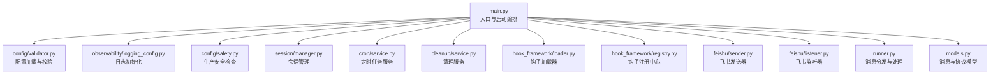
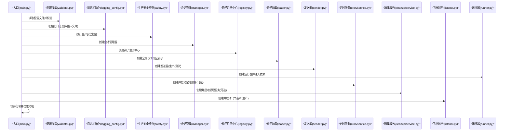
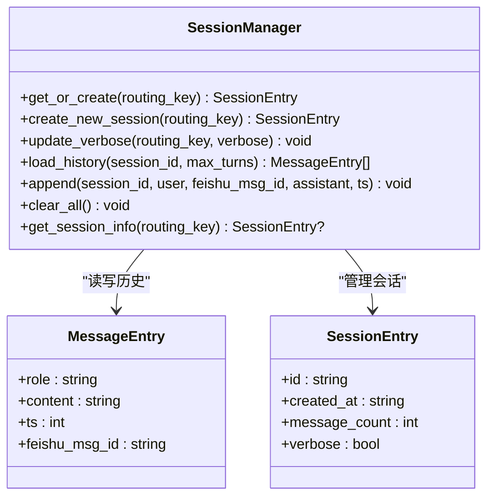
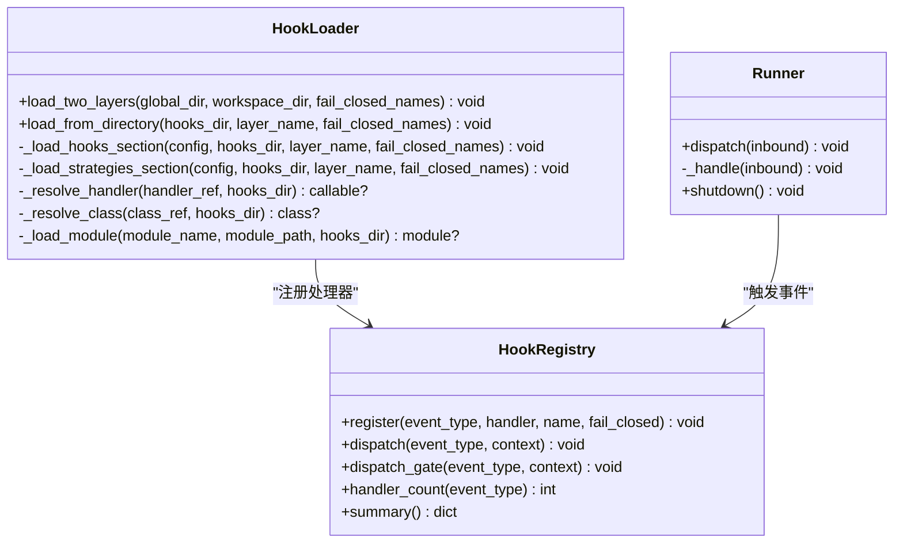
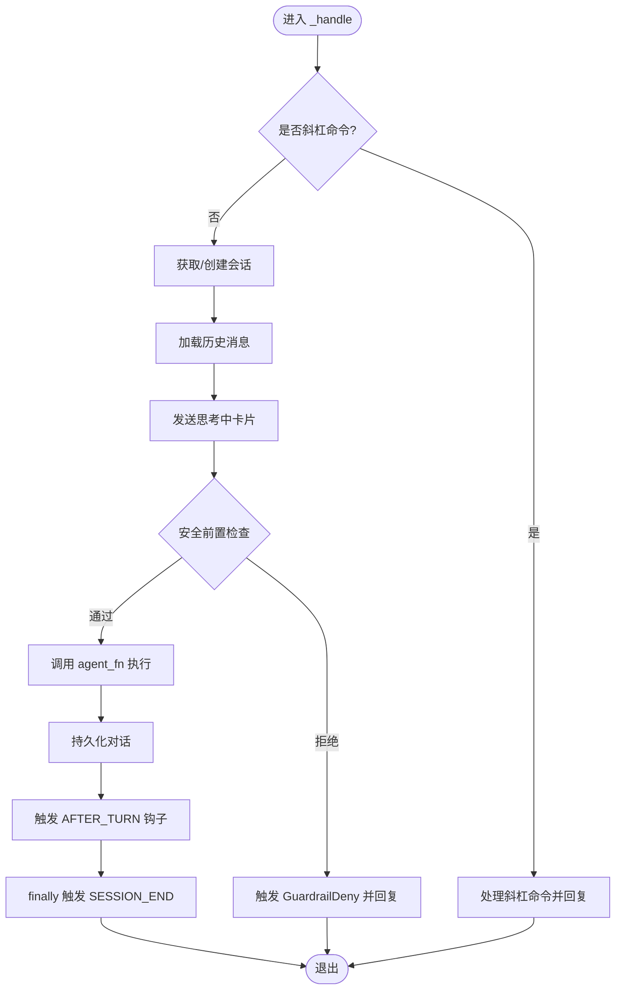
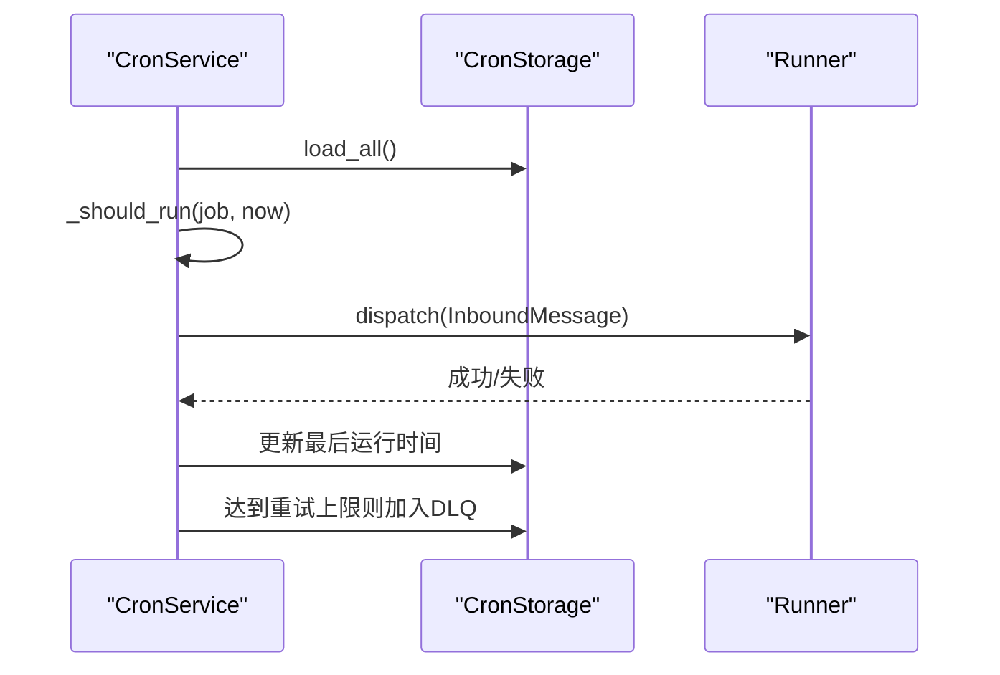
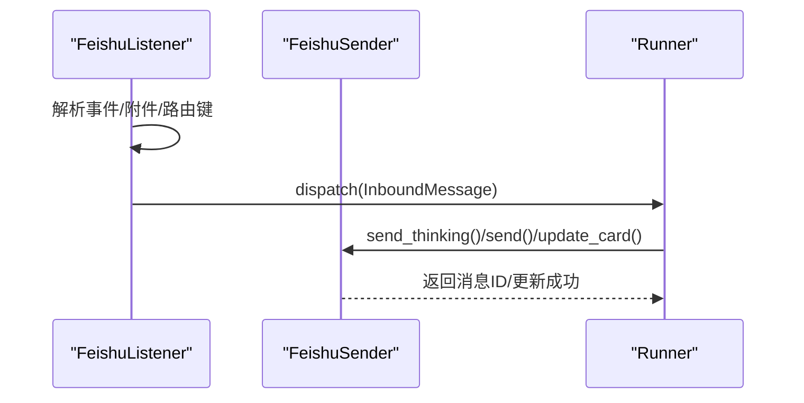
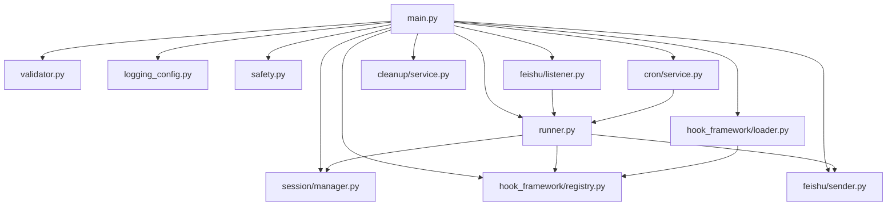

# 主程序入口

<cite>
**本文引用的文件**
- [main.py](file://xiaopaw/main.py)
- [runner.py](file://xiaopaw/runner.py)
- [manager.py](file://xiaopaw/session/manager.py)
- [service.py](file://xiaopaw/cleanup/service.py)
- [service.py](file://xiaopaw/cron/service.py)
- [loader.py](file://xiaopaw/hook_framework/loader.py)
- [registry.py](file://xiaopaw/hook_framework/registry.py)
- [safety.py](file://xiaopaw/config/safety.py)
- [validator.py](file://xiaopaw/config/validator.py)
- [logging_config.py](file://xiaopaw/observability/logging_config.py)
- [models.py](file://xiaopaw/models.py)
- [listener.py](file://xiaopaw/feishu/listener.py)
- [sender.py](file://xiaopaw/feishu/sender.py)
- [config.yaml.example](file://config.yaml.example)
</cite>

## 目录
1. [简介](#简介)
2. [项目结构](#项目结构)
3. [核心组件](#核心组件)
4. [架构总览](#架构总览)
5. [详细组件分析](#详细组件分析)
6. [依赖关系分析](#依赖关系分析)
7. [性能考量](#性能考量)
8. [故障排查指南](#故障排查指南)
9. [结论](#结论)
10. [附录](#附录)

## 简介
本文件面向 XiaoPaw v2 的主程序入口，系统性阐述 main() 函数的启动流程与组件初始化顺序，覆盖配置加载、日志设置、生产环境安全检查、服务组件创建与依赖关系，并给出关键组件间的交互序列图与流程图。文档既适合初学者快速上手，也为有经验的开发者提供足够的技术深度与可操作的排障建议。

## 项目结构
XiaoPaw v2 的入口位于 xiaopaw/main.py，围绕它构建了以下关键模块：
- 配置与安全：config/validator.py、config/safety.py
- 日志与可观测：observability/logging_config.py
- 会话管理：session/manager.py
- 任务调度：cron/service.py
- 清理服务：cleanup/service.py
- 钩子框架：hook_framework/loader.py、hook_framework/registry.py
- 通信与监听：feishu/sender.py、feishu/listener.py
- 运行器：runner.py
- 消息模型：models.py

图表来源
- [main.py:18-218](file://xiaopaw/main.py#L18-L218)
- [validator.py:116-122](file://xiaopaw/config/validator.py#L116-L122)
- [logging_config.py:40-61](file://xiaopaw/observability/logging_config.py#L40-L61)
- [safety.py:27-48](file://xiaopaw/config/safety.py#L27-L48)
- [manager.py:38-183](file://xiaopaw/session/manager.py#L38-L183)
- [service.py:14-77](file://xiaopaw/cleanup/service.py#L14-L77)
- [service.py:19-97](file://xiaopaw/cron/service.py#L19-L97)
- [loader.py:29-246](file://xiaopaw/hook_framework/loader.py#L29-L246)
- [registry.py:118-209](file://xiaopaw/hook_framework/registry.py#L118-L209)
- [sender.py:18-149](file://xiaopaw/feishu/sender.py#L18-L149)
- [listener.py:21-148](file://xiaopaw/feishu/listener.py#L21-L148)
- [runner.py:33-335](file://xiaopaw/runner.py#L33-L335)
- [models.py:10-35](file://xiaopaw/models.py#L10-L35)

章节来源
- [main.py:18-218](file://xiaopaw/main.py#L18-L218)

## 核心组件
- 配置加载与校验：从环境变量或默认路径读取配置，使用 Pydantic 校验并生成强类型配置对象。
- 日志初始化：根据配置选择 JSON 或控制台格式输出，统一注入 trace_id 并屏蔽敏感信息。
- 生产安全检查：在非开发环境强制执行凭证强度与调试开关检查。
- 会话管理：基于路由键维护会话索引与历史消息持久化。
- 钩子框架：两层加载（全局与工作区），先观测后策略，支持 fail-closed 与依赖注入。
- 运行器：按路由键串行队列处理消息，集成钩子事件与安全前置检查。
- 定时任务与清理：周期性扫描与清理过期资源。
- 飞书发送与监听：生产环境使用官方客户端，开发环境可切换为测试发送器与监听器。

章节来源
- [validator.py:97-122](file://xiaopaw/config/validator.py#L97-L122)
- [logging_config.py:40-61](file://xiaopaw/observability/logging_config.py#L40-L61)
- [safety.py:27-48](file://xiaopaw/config/safety.py#L27-L48)
- [manager.py:38-183](file://xiaopaw/session/manager.py#L38-L183)
- [loader.py:29-246](file://xiaopaw/hook_framework/loader.py#L29-L246)
- [registry.py:118-209](file://xiaopaw/hook_framework/registry.py#L118-L209)
- [runner.py:33-335](file://xiaopaw/runner.py#L33-L335)
- [service.py:14-77](file://xiaopaw/cleanup/service.py#L14-L77)
- [service.py:19-97](file://xiaopaw/cron/service.py#L19-L97)
- [sender.py:18-149](file://xiaopaw/feishu/sender.py#L18-L149)
- [listener.py:21-148](file://xiaopaw/feishu/listener.py#L21-L148)

## 架构总览
下图展示了 XiaoPaw v2 启动阶段的组件交互与控制流，包括配置加载、日志初始化、安全检查、组件创建与启动、以及优雅停机流程。

图表来源
- [main.py:18-218](file://xiaopaw/main.py#L18-L218)
- [validator.py:116-122](file://xiaopaw/config/validator.py#L116-L122)
- [logging_config.py:40-61](file://xiaopaw/observability/logging_config.py#L40-L61)
- [safety.py:27-48](file://xiaopaw/config/safety.py#L27-L48)
- [manager.py:38-183](file://xiaopaw/session/manager.py#L38-L183)
- [registry.py:118-209](file://xiaopaw/hook_framework/registry.py#L118-L209)
- [loader.py:29-246](file://xiaopaw/hook_framework/loader.py#L29-L246)
- [sender.py:18-149](file://xiaopaw/feishu/sender.py#L18-L149)
- [service.py:19-97](file://xiaopaw/cron/service.py#L19-L97)
- [service.py:14-77](file://xiaopaw/cleanup/service.py#L14-L77)
- [listener.py:21-148](file://xiaopaw/feishu/listener.py#L21-L148)
- [runner.py:33-335](file://xiaopaw/runner.py#L33-L335)

## 详细组件分析

### 启动流程与初始化顺序
- 配置加载与校验
  - 从环境变量读取配置路径，默认 config.yaml。
  - 使用 Pydantic 校验并生成 AppConfig。
- 日志初始化
  - 控制台使用人类可读格式，文件输出使用 JSON-line 格式并注入 trace_id。
- 生产安全检查
  - 非开发环境强制要求密钥强度、禁用测试 API、测试 API 地址限制为本地回环。
- 组件创建与启动
  - 会话管理器：负责会话索引与历史持久化。
  - 发送器：生产环境使用官方客户端，开发环境使用 CaptureSender。
  - 钩子框架：两层加载（全局 shared_hooks 与工作区 hooks），先观测后策略。
  - 运行器：按路由键串行队列处理消息，集成钩子事件与安全前置检查。
  - 定时服务：周期性扫描并派发计划任务。
  - 清理服务：按 UTC 小时周期清理过期资源。
  - 飞书监听：WebSocket 接收消息，速率限制与去重。
- 优雅停机
  - 捕获 SIGINT/SIGTERM，依次停止监听、定时、清理、运行器、测试 API、指标服务。

章节来源
- [main.py:18-218](file://xiaopaw/main.py#L18-L218)
- [validator.py:116-122](file://xiaopaw/config/validator.py#L116-L122)
- [logging_config.py:40-61](file://xiaopaw/observability/logging_config.py#L40-L61)
- [safety.py:27-48](file://xiaopaw/config/safety.py#L27-L48)

### 配置加载与校验
- 配置文件路径优先从环境变量读取，不存在则报错。
- 使用 Pydantic 模型对字段进行长度、范围、类型校验，确保运行时安全。
- 示例配置项涵盖飞书、代理、沙箱、内存、会话、运行器、发送器、调试、可观测、限流、重放缓存、定时任务、清理、功能开关等。

章节来源
- [validator.py:97-122](file://xiaopaw/config/validator.py#L97-L122)
- [config.yaml.example:1-90](file://config.yaml.example#L1-L90)

### 日志设置
- 控制台输出采用人类可读格式，包含时间戳、trace_id、级别与消息。
- 文件输出采用 JSON-line 格式，自动屏蔽敏感信息，便于集中采集与检索。
- 降低第三方库噪声级别，避免干扰业务日志。

章节来源
- [logging_config.py:40-61](file://xiaopaw/observability/logging_config.py#L40-L61)

### 生产环境安全检查
- 强制密钥长度与强度，禁止弱口令与占位符。
- 禁止生产环境启用测试 API，测试 API 地址必须为 127.0.0.1。
- 违规将触发安全异常并阻止启动。

章节来源
- [safety.py:27-48](file://xiaopaw/config/safety.py#L27-L48)

### 会话管理（SessionManager）
- 会话索引存储在 sessions/index.json，按路由键维护活动会话与历史会话列表。
- 历史消息以 JSONL 文件存储，按会话 ID 命名，支持并发写入锁与 LRU 锁缓存。
- 支持创建新会话、更新详细模式、加载历史、追加消息、清空索引与查询会话信息。

图表来源
- [manager.py:38-183](file://xiaopaw/session/manager.py#L38-L183)
- [models.py:10-35](file://xiaopaw/models.py#L10-L35)

章节来源
- [manager.py:38-183](file://xiaopaw/session/manager.py#L38-L183)
- [models.py:10-35](file://xiaopaw/models.py#L10-L35)

### 钩子框架（HookLoader 与 HookRegistry）
- HookLoader 两层加载：先加载 hooks 段（观测层，异常吞掉），再加载 strategies 段（策略层，fail-closed）。
- 支持依赖注入：策略声明 deps，按声明顺序实例化，后声明策略可引用先前实例。
- HookRegistry 提供两类分发机制：
  - dispatch：报警器模式，异常吞掉不影响业务。
  - dispatch_gate：保险丝模式，仅 GuardrailDeny 能穿透，fail-closed 时将异常转换为拒绝。
- 事件体系：BEFORE_TURN、BEFORE_LLM、BEFORE_TOOL_CALL、AFTER_TOOL_CALL、AFTER_TURN、TASK_COMPLETE、SESSION_END。

图表来源
- [loader.py:29-246](file://xiaopaw/hook_framework/loader.py#L29-L246)
- [registry.py:118-209](file://xiaopaw/hook_framework/registry.py#L118-L209)
- [runner.py:33-335](file://xiaopaw/runner.py#L33-L335)

章节来源
- [loader.py:29-246](file://xiaopaw/hook_framework/loader.py#L29-L246)
- [registry.py:118-209](file://xiaopaw/hook_framework/registry.py#L118-L209)
- [runner.py:33-335](file://xiaopaw/runner.py#L33-L335)

### 运行器（Runner）
- 按路由键维护独立队列与工作协程，支持空闲超时退出与队列满丢弃。
- 消息处理流程：
  - 解析斜杠命令（/new、/help、/status、/verbose）。
  - 获取或创建会话，加载历史。
  - 发送“思考中”卡片，预检安全（fail-closed）。
  - 调用 agent_fn 执行，发送最终回复并持久化。
  - 触发钩子事件（BEFORE_TURN/AFTER_TURN 等）。
  - finally 触发 SESSION_END，确保 Langfuse 数据落盘。
- 异常处理：捕获 GuardrailDeny 向用户友好提示，其他异常返回通用错误提示。

图表来源
- [runner.py:109-282](file://xiaopaw/runner.py#L109-L282)

章节来源
- [runner.py:33-335](file://xiaopaw/runner.py#L33-L335)

### 定时服务（CronService）
- 周期性扫描 CronStorage 中的任务，根据 cron 表达式判断是否需要执行。
- 将任务包装为 InboundMessage 并派发给 Runner。
- 失败达到阈值进入死信队列（DLQ），并统计指标。

图表来源
- [service.py:19-97](file://xiaopaw/cron/service.py#L19-L97)
- [runner.py:60-84](file://xiaopaw/runner.py#L60-L84)
- [models.py:18-28](file://xiaopaw/models.py#L18-L28)

章节来源
- [service.py:19-97](file://xiaopaw/cron/service.py#L19-L97)

### 清理服务（CleanupService）
- 按 UTC 小时周期运行，清理过期的 raw 日志与 traces 目录。
- 支持会话、trace、raw 文件 TTL 配置。

章节来源
- [service.py:14-77](file://xiaopaw/cleanup/service.py#L14-L77)

### 飞书发送与监听
- 发送器：支持并发限流、重试与退避，区分文本与交互卡片消息。
- 监听器：WebSocket 接收飞书消息，速率限制、重放去重、路由键解析与消息派发。

图表来源
- [listener.py:81-148](file://xiaopaw/feishu/listener.py#L81-L148)
- [sender.py:43-149](file://xiaopaw/feishu/sender.py#L43-L149)
- [runner.py:109-282](file://xiaopaw/runner.py#L109-L282)

章节来源
- [listener.py:21-148](file://xiaopaw/feishu/listener.py#L21-L148)
- [sender.py:18-149](file://xiaopaw/feishu/sender.py#L18-L149)

## 依赖关系分析
- 入口依赖：main.py 依赖配置、日志、安全、会话、钩子、发送器、监听器、运行器、定时与清理服务。
- 运行器依赖：Runner 依赖 SessionManager、SenderProtocol、HookRegistry、CrewObservabilityAdapter。
- 钩子框架：HookLoader 依赖 HookRegistry；Runner 通过 HookRegistry 触发事件。
- 通信层：FeishuListener 依赖 RateLimiter、ReplayCache；FeishuSender 依赖 lark_oapi 客户端。
- 数据层：SessionManager 依赖 JSONL 文件与索引文件；CronService 依赖 CronStorage。

图表来源
- [main.py:18-218](file://xiaopaw/main.py#L18-L218)
- [runner.py:33-335](file://xiaopaw/runner.py#L33-L335)
- [loader.py:29-246](file://xiaopaw/hook_framework/loader.py#L29-L246)
- [registry.py:118-209](file://xiaopaw/hook_framework/registry.py#L118-L209)
- [sender.py:18-149](file://xiaopaw/feishu/sender.py#L18-L149)
- [listener.py:21-148](file://xiaopaw/feishu/listener.py#L21-L148)
- [service.py:19-97](file://xiaopaw/cron/service.py#L19-L97)
- [service.py:14-77](file://xiaopaw/cleanup/service.py#L14-L77)
- [manager.py:38-183](file://xiaopaw/session/manager.py#L38-L183)

章节来源
- [main.py:18-218](file://xiaopaw/main.py#L18-L218)

## 性能考量
- 并发与限流
  - 发送器使用信号量限制并发，避免飞书 API 限流。
  - 运行器按路由键串行队列，避免竞争条件；空闲超时退出减少资源占用。
- I/O 优化
  - 会话历史读写使用线程池，避免阻塞事件循环。
  - 日志 JSON-line 输出，利于异步写入与批量处理。
- 调度与清理
  - 定时服务与清理服务采用后台任务，按间隔与 UTC 小时运行，避免主线程阻塞。
- 观测与指标
  - 入站消息、速率限制、定时任务 DLQ 等指标便于监控与容量规划。

[本节为通用性能建议，无需特定文件引用]

## 故障排查指南
- 启动失败（配置错误）
  - 现象：启动时报配置文件缺失或字段校验失败。
  - 排查：检查配置文件路径与字段类型/范围，参考示例配置。
  - 参考
    - [validator.py:116-122](file://xiaopaw/config/validator.py#L116-L122)
    - [config.yaml.example:1-90](file://config.yaml.example#L1-L90)
- 启动失败（生产安全检查）
  - 现象：生产环境密钥过短、启用测试 API、测试 API 地址非本地。
  - 排查：修正密钥强度与调试开关，确保测试 API 仅开发环境启用。
  - 参考
    - [safety.py:27-48](file://xiaopaw/config/safety.py#L27-L48)
- 日志未输出或格式异常
  - 现象：控制台无日志或文件未生成。
  - 排查：确认日志目录存在、JSON 输出开关、trace_id 注入。
  - 参考
    - [logging_config.py:40-61](file://xiaopaw/observability/logging_config.py#L40-L61)
- 飞书消息未送达或重复
  - 现象：消息发送失败或重复。
  - 排查：检查速率限制、重放缓存、并发限制与退避策略。
  - 参考
    - [sender.py:43-149](file://xiaopaw/feishu/sender.py#L43-L149)
    - [listener.py:81-148](file://xiaopaw/feishu/listener.py#L81-L148)
- 定时任务未执行
  - 现象：cron 表达式无效或任务未派发。
  - 排查：检查 cron 表达式、间隔、DLQ 与失败计数。
  - 参考
    - [service.py:19-97](file://xiaopaw/cron/service.py#L19-L97)
- 清理未生效
  - 现象：过期文件未删除。
  - 排查：确认 UTC 小时设置、TTL 配置与运行权限。
  - 参考
    - [service.py:14-77](file://xiaopaw/cleanup/service.py#L14-L77)
- 钩子策略导致拒绝
  - 现象：请求被拒绝但无明确原因。
  - 排查：检查 fail-closed 策略、依赖注入顺序与 deny 原因码。
  - 参考
    - [registry.py:118-209](file://xiaopaw/hook_framework/registry.py#L118-L209)
    - [loader.py:29-246](file://xiaopaw/hook_framework/loader.py#L29-L246)

章节来源
- [validator.py:116-122](file://xiaopaw/config/validator.py#L116-L122)
- [config.yaml.example:1-90](file://config.yaml.example#L1-L90)
- [safety.py:27-48](file://xiaopaw/config/safety.py#L27-L48)
- [logging_config.py:40-61](file://xiaopaw/observability/logging_config.py#L40-L61)
- [sender.py:43-149](file://xiaopaw/feishu/sender.py#L43-L149)
- [listener.py:81-148](file://xiaopaw/feishu/listener.py#L81-L148)
- [service.py:19-97](file://xiaopaw/cron/service.py#L19-L97)
- [service.py:14-77](file://xiaopaw/cleanup/service.py#L14-L77)
- [registry.py:118-209](file://xiaopaw/hook_framework/registry.py#L118-L209)
- [loader.py:29-246](file://xiaopaw/hook_framework/loader.py#L29-L246)

## 结论
XiaoPaw v2 的主程序入口遵循“先配置、后日志、再安全”的启动原则，随后按依赖顺序创建并启动核心服务组件。通过钩子框架实现“观测层先于策略层”的安全前置检查，结合运行器的消息串行处理与会话持久化，形成稳定可靠的生产级消息处理流水线。配合定时与清理服务，确保系统长期健康运行。建议在部署前严格核对配置与安全检查项，并结合日志与指标进行持续监控。

[本节为总结性内容，无需特定文件引用]

## 附录
- 环境变量与默认值
  - XIAOPAW_CONFIG：配置文件路径，默认 config.yaml。
  - XIAOPAW_ENV：环境标识，默认 dev。
  - 可通过环境变量覆盖部分可观测性配置（如 Langfuse 密钥）。
- 示例配置
  - 参考 config.yaml.example，包含飞书、代理、沙箱、内存、会话、运行器、发送器、调试、可观测、限流、重放缓存、定时任务、清理、功能开关等字段。

章节来源
- [config.yaml.example:1-90](file://config.yaml.example#L1-L90)