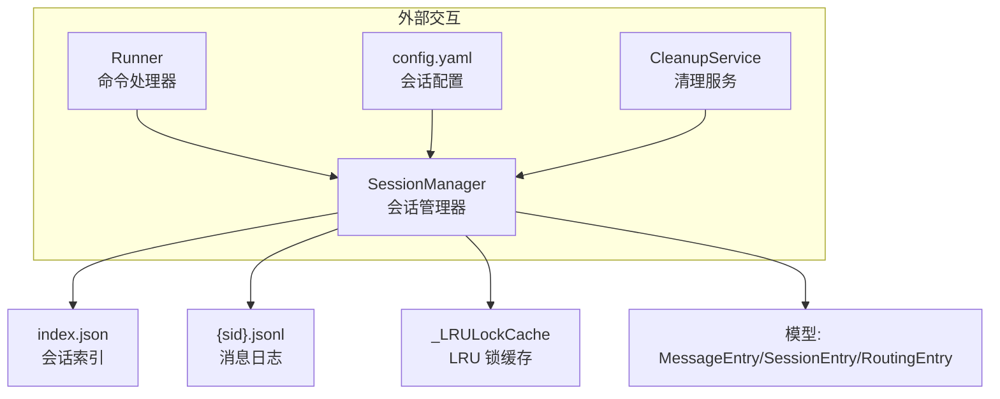
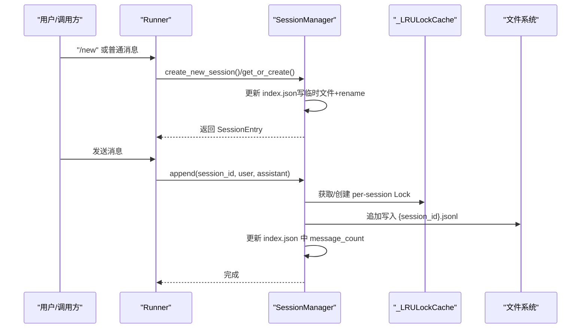
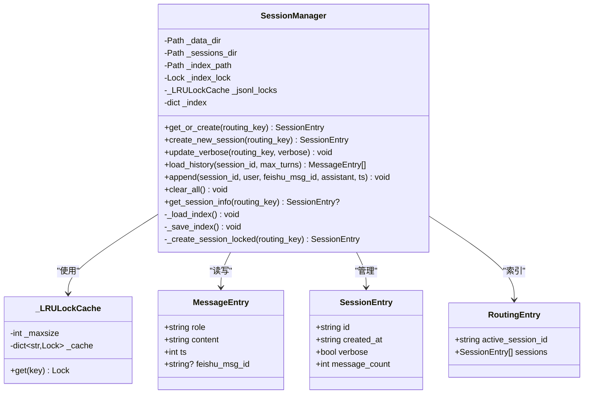
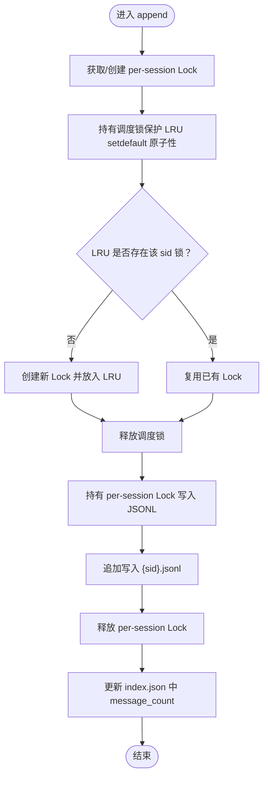
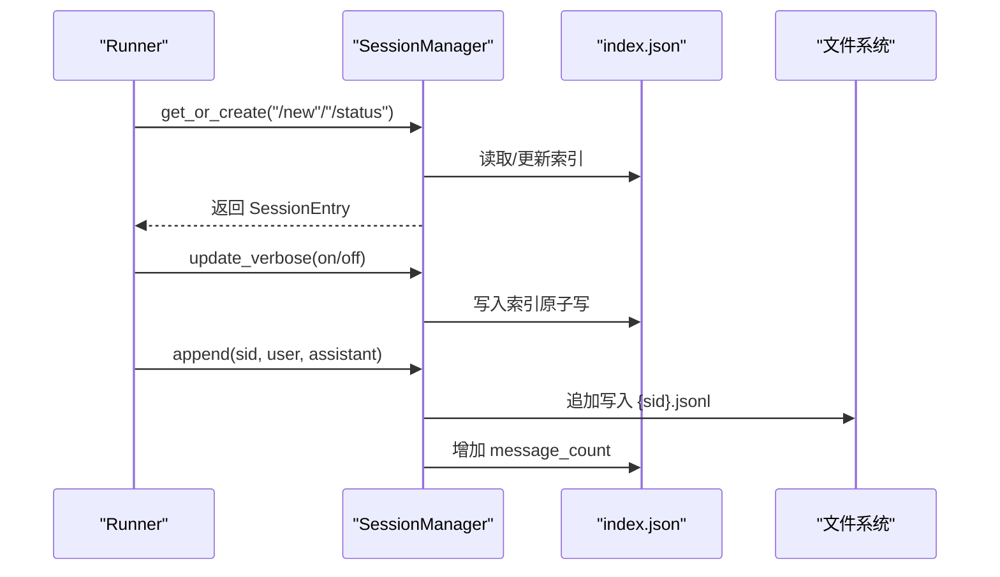
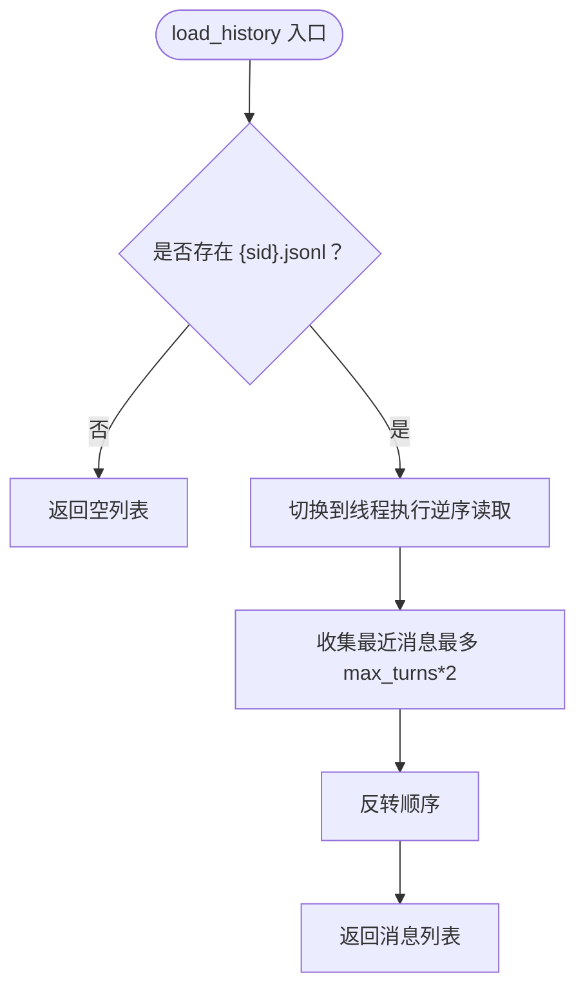
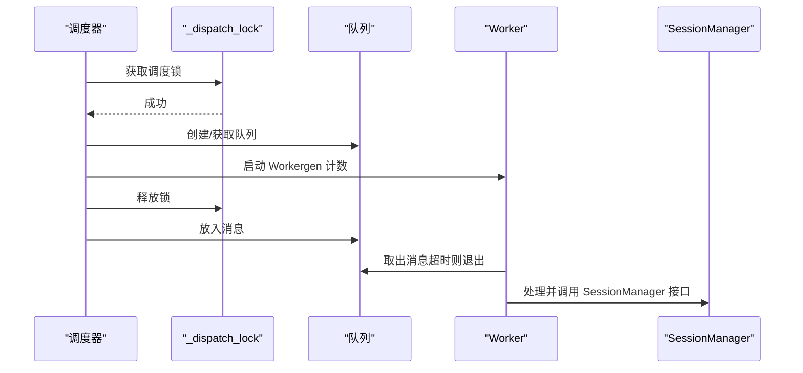
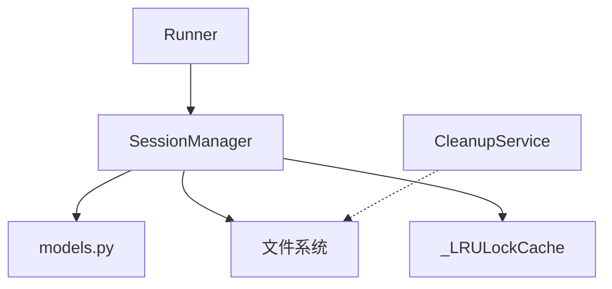

# 会话管理系统

<cite>
**本文引用的文件**
- [manager.py](file://xiaopaw/session/manager.py)
- [models.py](file://xiaopaw/session/models.py)
- [02-modules.md](file://docs/02-modules.md)
- [05-concurrency.md](file://docs/05-concurrency.md)
- [concurrency-verification-report.md](file://docs/concurrency-verification-report.md)
- [config.yaml.example](file://config.yaml.example)
- [runner.py](file://xiaopaw/runner.py)
- [service.py](file://xiaopaw/cleanup/service.py)
</cite>

## 目录
1. [简介](#简介)
2. [项目结构](#项目结构)
3. [核心组件](#核心组件)
4. [架构总览](#架构总览)
5. [详细组件分析](#详细组件分析)
6. [依赖关系分析](#依赖关系分析)
7. [性能考量](#性能考量)
8. [故障排查指南](#故障排查指南)
9. [结论](#结论)
10. [附录](#附录)

## 简介
本文件面向 XiaoPaw v2 的会话管理系统，系统性阐述 SessionManager 的实现细节、会话状态管理与并发控制机制，覆盖会话的创建、更新、销毁与持久化流程；解释 LRUCache 的缓存策略与内存管理；提供会话生命周期与状态同步的流程图与时序图；并给出会话路由、队列管理与超时控制的实现方式及常见问题的解决方案。

## 项目结构
会话管理相关的核心代码集中在 xiaopaw/session 目录，配合配置与运行时模块协同工作：
- xiaopaw/session/manager.py：会话管理器实现，包含索引与 JSONL 存储、LRU 锁缓存、并发控制与历史加载。
- xiaopaw/session/models.py：会话数据模型定义（消息条目、会话条目、路由条目）。
- docs/02-modules.md 与 docs/05-concurrency.md：模块化设计与并发控制规范，包含两级锁与 LRU 锁缓存的设计动机与实现细节。
- config.yaml.example：会话相关配置项（最大活跃会话数、历史轮次等）。
- xiaopaw/runner.py：对外提供 /new、/status、/verbose 等命令，驱动 SessionManager 的会话生命周期管理。
- xiaopaw/cleanup/service.py：定时清理过期会话与日志，保障磁盘空间与长期稳定性。

图表来源
- [manager.py:38-182](file://xiaopaw/session/manager.py#L38-L182)
- [models.py:18-38](file://xiaopaw/session/models.py#L18-L38)
- [02-modules.md:269-358](file://docs/02-modules.md#L269-L358)
- [config.yaml.example:32-35](file://config.yaml.example#L32-L35)
- [runner.py:283-316](file://xiaopaw/runner.py#L283-L316)
- [service.py:14-77](file://xiaopaw/cleanup/service.py#L14-L77)

章节来源
- [manager.py:1-182](file://xiaopaw/session/manager.py#L1-L182)
- [models.py:1-38](file://xiaopaw/session/models.py#L1-L38)
- [02-modules.md:269-358](file://docs/02-modules.md#L269-L358)
- [config.yaml.example:32-35](file://config.yaml.example#L32-L35)
- [runner.py:283-316](file://xiaopaw/runner.py#L283-L316)
- [service.py:14-77](file://xiaopaw/cleanup/service.py#L14-L77)

## 核心组件
- SessionManager：负责会话索引与消息持久化、会话创建/更新/查询、历史加载与清理。
- _LRULockCache：带容量上限的 LRU 缓存，用于持有 per-session 的 asyncio.Lock，防止无界增长导致 OOM。
- 数据模型：MessageEntry（消息条目）、SessionEntry（会话条目）、RoutingEntry（路由条目）。
- Runner：通过命令驱动 SessionManager 的生命周期操作。
- CleanupService：按配置周期清理过期会话与日志文件。

章节来源
- [manager.py:18-182](file://xiaopaw/session/manager.py#L18-L182)
- [models.py:18-38](file://xiaopaw/session/models.py#L18-L38)
- [runner.py:283-316](file://xiaopaw/runner.py#L283-L316)
- [service.py:14-77](file://xiaopaw/cleanup/service.py#L14-L77)

## 架构总览
会话管理采用“索引 + JSONL”存储方案：
- 索引 index.json 记录每个 routing_key 的活跃会话 ID 与会话列表，并通过写入临时文件再 rename 的方式保证原子性。
- 每个会话对应一个独立的 {sid}.jsonl 文件，按行存储消息条目，append-only 写入。
- 并发控制通过两级锁实现：全局调度锁保护 LRU 缓存的 setdefault 原子性，per-session 锁保证 JSONL 写入互斥。

图表来源
- [manager.py:70-168](file://xiaopaw/session/manager.py#L70-L168)
- [02-modules.md:295-313](file://docs/02-modules.md#L295-L313)

章节来源
- [manager.py:38-168](file://xiaopaw/session/manager.py#L38-L168)
- [02-modules.md:295-313](file://docs/02-modules.md#L295-L313)

## 详细组件分析

### SessionManager 类与数据模型
- SessionManager 提供以下关键能力：
  - get_or_create/create_new_session：基于 routing_key 获取或创建当前活跃会话。
  - update_verbose：切换当前活跃会话的 verbose 标志。
  - load_history：异步加载最近若干轮对话（按行逆序读取，避免阻塞事件循环）。
  - append：追加一条用户与助手消息到指定会话的 JSONL 文件，并更新索引中的消息计数。
  - clear_all：清空索引。
  - get_session_info：查询某 routing_key 的当前活跃会话信息。
- 索引持久化采用“写临时文件再 rename”的原子写法，降低损坏风险。
- 消息持久化采用 JSONL 追加写入，保证顺序与可读性。

图表来源
- [manager.py:18-182](file://xiaopaw/session/manager.py#L18-L182)
- [models.py:18-38](file://xiaopaw/session/models.py#L18-L38)

章节来源
- [manager.py:38-182](file://xiaopaw/session/manager.py#L38-L182)
- [models.py:18-38](file://xiaopaw/session/models.py#L18-L38)

### LRUCache 与并发控制
- LRU 锁缓存：_LRULockCache 以 dict 实现 LRU，容量上限为 1000（可通过配置调整）。当缓存满时，淘汰最久未使用的锁，避免内存无限增长。
- 两级锁 append 流程：
  - 第一级：调度锁保护“检查 + 创建 + 获取”三步的原子性，避免 LRU 驱逐后并发访问导致重复创建不同锁。
  - 第二级：per-session 锁真正保护 JSONL 写入，避免不同协程对同一会话文件的竞争。
- 设计动机与结论：
  - LRU 的核心是防 OOM，而非并发互斥；并发互斥由 per-session 锁保证。
  - max_active_sessions 必须大于峰值活跃会话数，否则会出现“驱逐后重入”的双锁并存窗口，需通过运维告警监控。

图表来源
- [manager.py:132-168](file://xiaopaw/session/manager.py#L132-L168)
- [05-concurrency.md:339-407](file://docs/05-concurrency.md#L339-L407)

章节来源
- [manager.py:18-36](file://xiaopaw/session/manager.py#L18-L36)
- [05-concurrency.md:339-407](file://docs/05-concurrency.md#L339-L407)
- [concurrency-verification-report.md:80-97](file://docs/concurrency-verification-report.md#L80-L97)

### 会话生命周期管理与状态同步
- 创建：get_or_create/create_new_session 在索引中为 routing_key 创建新的 SessionEntry，并将该会话设置为活跃会话。
- 更新：update_verbose 修改当前活跃会话的 verbose 标志，立即持久化到索引。
- 查询：get_session_info 返回当前活跃会话的元信息（ID、创建时间、消息数、verbose）。
- 销毁：clear_all 清空索引，适用于重置或维护场景。
- 状态同步：append 成功后，立即更新索引中的 message_count，保证状态一致性。

图表来源
- [runner.py:283-316](file://xiaopaw/runner.py#L283-L316)
- [manager.py:70-168](file://xiaopaw/session/manager.py#L70-L168)

章节来源
- [runner.py:283-316](file://xiaopaw/runner.py#L283-L316)
- [manager.py:70-168](file://xiaopaw/session/manager.py#L70-L168)

### 历史加载与性能优化
- load_history 采用异步线程池读取，避免阻塞事件循环；按行逆序读取，仅取最近 max_turns*2 条消息，减少 IO 与内存占用。
- v2.1 修正了 v1 的一次性全量读取导致的阻塞问题，提升大文件场景下的响应性。

图表来源
- [manager.py:111-130](file://xiaopaw/session/manager.py#L111-L130)
- [02-modules.md:315-347](file://docs/02-modules.md#L315-L347)

章节来源
- [manager.py:111-130](file://xiaopaw/session/manager.py#L111-L130)
- [02-modules.md:315-347](file://docs/02-modules.md#L315-L347)

### 会话路由、队列管理与超时控制
- 路由键（routing_key）：用于区分不同用户、群组或话题的会话上下文，SessionManager 以 routing_key 为单位维护活跃会话与会话列表。
- Runner 的队列管理：Runner 为每个 routing_key 维护一个队列与工作协程，支持空闲超时与队列长度限制，避免资源泄露与堆积。
- 超时控制：Runner 的空闲超时与队列长度限制共同保证在低流量时段及时释放资源，高流量时维持有序处理。

图表来源
- [02-modules.md:269-313](file://docs/02-modules.md#L269-L313)
- [05-concurrency.md:264-312](file://docs/05-concurrency.md#L264-L312)

章节来源
- [02-modules.md:269-313](file://docs/02-modules.md#L269-L313)
- [05-concurrency.md:264-312](file://docs/05-concurrency.md#L264-L312)

## 依赖关系分析
- SessionManager 依赖：
  - 数据模型：MessageEntry、SessionEntry、RoutingEntry。
  - 文件系统：index.json 与 {sid}.jsonl。
  - 并发原语：asyncio.Lock、asyncio.to_thread。
  - LRU 锁缓存：_LRULockCache（内部使用 dict 实现 LRU）。
- Runner 依赖 SessionManager 提供的会话生命周期接口，用于命令处理与状态查询。
- CleanupService 与会话管理解耦，按配置周期清理过期文件，不直接依赖 SessionManager 的索引。

图表来源
- [manager.py:1-182](file://xiaopaw/session/manager.py#L1-L182)
- [models.py:1-38](file://xiaopaw/session/models.py#L1-L38)
- [runner.py:283-316](file://xiaopaw/runner.py#L283-L316)
- [service.py:14-77](file://xiaopaw/cleanup/service.py#L14-L77)

章节来源
- [manager.py:1-182](file://xiaopaw/session/manager.py#L1-L182)
- [models.py:1-38](file://xiaopaw/session/models.py#L1-L38)
- [runner.py:283-316](file://xiaopaw/runner.py#L283-L316)
- [service.py:14-77](file://xiaopaw/cleanup/service.py#L14-L77)

## 性能考量
- LRU 锁缓存容量：默认 1000，建议根据峰值活跃会话数进行调优；超过上限会触发驱逐，出现双锁并存窗口，需通过运维告警监控。
- 异步线程池：历史加载与 JSONL 写入使用 asyncio.to_thread，避免阻塞事件循环，提升吞吐。
- 原子写入：index.json 使用临时文件 + rename，降低损坏风险并提升可靠性。
- 清理策略：定期清理过期会话与日志，控制磁盘占用，避免长期运行导致的空间膨胀。

章节来源
- [05-concurrency.md:399-407](file://docs/05-concurrency.md#L399-L407)
- [02-modules.md:315-347](file://docs/02-modules.md#L315-L347)
- [service.py:14-77](file://xiaopaw/cleanup/service.py#L14-L77)

## 故障排查指南
- 并发写冲突：
  - 现象：不同协程对同一 sid 写入 JSONL，出现交叉写入或数据错乱。
  - 原因：未使用 per-session 锁或 LRU 驱逐后重入导致双锁并存。
  - 解决：确保使用两级锁；增大 max_active_sessions 以避免驱逐。
- OOM 与内存泄漏：
  - 现象：进程内存持续增长。
  - 原因：无界锁缓存或未及时释放资源。
  - 解决：使用 LRU 锁缓存并保持合理上限；确认 Runner 的队列与 worker 在空闲超时后正确清理。
- 阻塞事件循环：
  - 现象：大文件读取导致延迟上升。
  - 原因：一次性全量读取。
  - 解决：使用异步线程池逆序读取，限制读取条数。
- 索引损坏：
  - 现象：index.json 无法解析或内容不一致。
  - 原因：写入中断或并发写入。
  - 解决：采用临时文件 + rename 的原子写入方式；避免并发写入同一索引。

章节来源
- [05-concurrency.md:335-407](file://docs/05-concurrency.md#L335-L407)
- [concurrency-verification-report.md:80-97](file://docs/concurrency-verification-report.md#L80-L97)
- [manager.py:59-68](file://xiaopaw/session/manager.py#L59-L68)

## 结论
XiaoPaw v2 的会话管理系统通过“索引 + JSONL”与两级锁并发模型，在保证数据一致性的同时实现了良好的可扩展性与性能。LRU 锁缓存有效防止 OOM，异步线程池避免阻塞事件循环，原子写入与清理策略进一步提升了可靠性。建议结合配置与运维监控，动态调整活跃会话上限，确保系统在高并发场景下的稳定运行。

## 附录
- 配置项参考（来自 config.yaml.example）：
  - session.max_active_sessions：会话锁缓存上限，默认 1000。
  - session.max_history_turns：历史加载的最大轮次，默认 20。
  - runner.max_queue_size/idle_timeout_s：队列长度与空闲超时。
  - cleanup.session_ttl_days：会话文件保留天数。

章节来源
- [config.yaml.example:32-35](file://config.yaml.example#L32-L35)
- [config.yaml.example:36-38](file://config.yaml.example#L36-L38)
- [config.yaml.example:73-79](file://config.yaml.example#L73-L79)