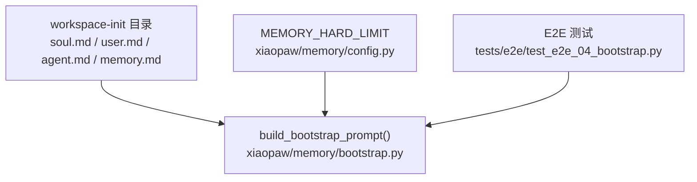
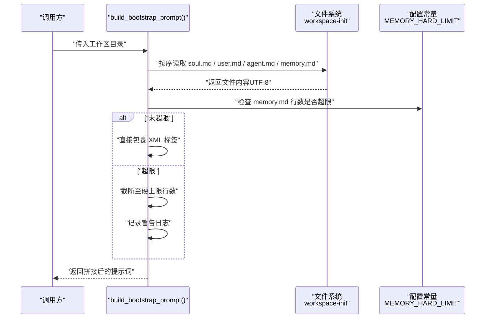
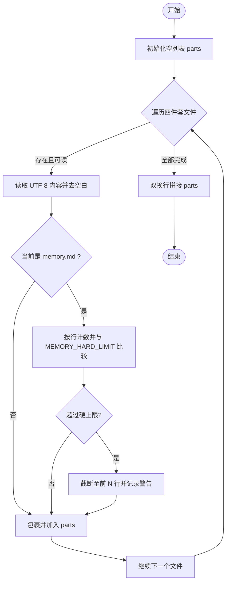
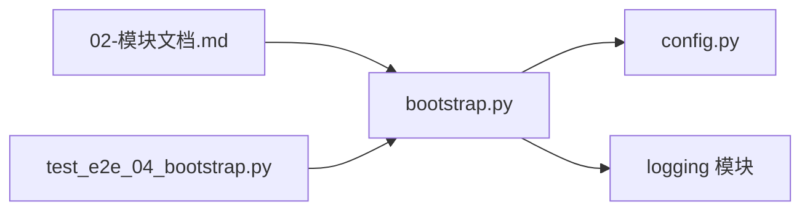

# Bootstrap 四件套

<cite>
**本文引用的文件**
- [bootstrap.py](file://xiaopaw/memory/bootstrap.py)
- [config.py](file://xiaopaw/memory/config.py)
- [test_e2e_04_bootstrap.py](file://tests/e2e/test_e2e_04_bootstrap.py)
- [02-模块文档.md](file://docs/02-modules.md)
</cite>

## 目录
1. [简介](#简介)
2. [项目结构](#项目结构)
3. [核心组件](#核心组件)
4. [架构总览](#架构总览)
5. [详细组件分析](#详细组件分析)
6. [依赖关系分析](#依赖关系分析)
7. [性能考量](#性能考量)
8. [故障排查指南](#故障排查指南)
9. [结论](#结论)
10. [附录](#附录)

## 简介
本文件聚焦于 XiaoPaw v2 的“Bootstrap 四件套”系统，围绕 build_bootstrap_prompt 函数的工作机制展开，系统性阐述 soul、user、agent、memory 四个部分的构建流程与约束规则；说明如何从 workspace-init 目录读取模板文件并组合为完整的背景设定提示词；给出文件读取、内容截断与标签包装的实现要点；解释 MEMORY_HARD_LIMIT 的作用与限制机制；并提供日志记录与错误处理策略，以及常见问题的解决方案。

## 项目结构
- 四件套文件位于 workspace-init 目录，包含 soul.md、user.md、agent.md、memory.md。
- 构建逻辑集中在内存层的 bootstrap 模块，负责按固定顺序读取文件、拼接 XML 标签片段。
- 配置常量 MEMORY_HARD_LIMIT 定义在 memory/config.py 中，用于控制 memory.md 的硬上限行数。
- E2E 测试覆盖了四件套加载与身份问答等关键行为。

图表来源
- [bootstrap.py:1-36](file://xiaopaw/memory/bootstrap.py#L1-L36)
- [config.py:1-4](file://xiaopaw/memory/config.py#L1-L4)
- [test_e2e_04_bootstrap.py:1-45](file://tests/e2e/test_e2e_04_bootstrap.py#L1-L45)

章节来源
- [bootstrap.py:1-36](file://xiaopaw/memory/bootstrap.py#L1-L36)
- [config.py:1-4](file://xiaopaw/memory/config.py#L1-L4)
- [test_e2e_04_bootstrap.py:1-45](file://tests/e2e/test_e2e_04_bootstrap.py#L1-L45)

## 核心组件
- build_bootstrap_prompt：按固定顺序读取 soul、user、agent、memory 文件，逐个进行内容清洗与标签包裹，最终以双换行拼接为单一提示词字符串。
- MEMORY_HARD_LIMIT：memory.md 的硬上限行数阈值，超过时进行截断并记录警告日志。
- 日志与度量：对越界情况输出 warning 并触发相关指标（在模块文档中提及）。
- E2E 覆盖：通过端到端测试验证四件套注入后的身份问答能力。

章节来源
- [bootstrap.py:20-36](file://xiaopaw/memory/bootstrap.py#L20-L36)
- [config.py:1-4](file://xiaopaw/memory/config.py#L1-L4)
- [02-模块文档.md:790-824](file://docs/02-modules.md#L790-L824)
- [test_e2e_04_bootstrap.py:28-45](file://tests/e2e/test_e2e_04_bootstrap.py#L28-L45)

## 架构总览
下图展示了 Bootstrap 四件套在系统中的位置与调用关系：外部通过路由或会话入口进入，内部由 build_bootstrap_prompt 读取 workspace-init 下的四件套文件，生成 XML 包裹的背景设定，供后续推理或对话上下文使用。

图表来源
- [bootstrap.py:20-36](file://xiaopaw/memory/bootstrap.py#L20-L36)
- [config.py:1-4](file://xiaopaw/memory/config.py#L1-L4)

## 详细组件分析

### build_bootstrap_prompt 工作流
- 输入：工作区目录路径（Path）。
- 输出：XML 标签包裹的四件套提示词字符串。
- 处理步骤：
  1) 固定顺序遍历四件套文件：soul → user → agent → memory。
  2) 对每个存在的文件，读取 UTF-8 文本并去除首尾空白。
  3) 特殊处理 memory.md：按行切分，若行数超过 MEMORY_HARD_LIMIT，则仅保留前 N 行，并记录警告日志。
  4) 将每一段用形如 <tag> ... </tag> 的 XML 标签包裹。
  5) 使用双换行符连接各段，形成最终提示词。

图表来源
- [bootstrap.py:20-36](file://xiaopaw/memory/bootstrap.py#L20-L36)
- [config.py:1-4](file://xiaopaw/memory/config.py#L1-L4)

章节来源
- [bootstrap.py:20-36](file://xiaopaw/memory/bootstrap.py#L20-L36)
- [config.py:1-4](file://xiaopaw/memory/config.py#L1-L4)

### 四件套文件与标签映射
- soul → <soul>...</soul>
- user → <user>...</user>
- agent → <agent>...</agent>
- memory → <memory>...</memory>

这些标签用于在后续推理阶段区分不同来源的背景信息，便于模型理解角色定位、用户画像、代理能力与记忆历史。

章节来源
- [bootstrap.py:12-17](file://xiaopaw/memory/bootstrap.py#L12-L17)

### MEMORY_HARD_LIMIT 限制机制
- 定义位置：memory/config.py。
- 作用对象：memory.md。
- 触发条件：当 memory.md 的行数超过阈值时，执行截断并记录警告日志。
- 影响范围：避免过长的历史记忆导致上下文膨胀与成本上升。

章节来源
- [config.py:1-4](file://xiaopaw/memory/config.py#L1-L4)
- [bootstrap.py:27-35](file://xiaopaw/memory/bootstrap.py#L27-L35)
- [02-模块文档.md:790-824](file://docs/02-modules.md#L790-L824)

### 日志记录与错误处理策略
- 文件缺失：对不存在的文件采用“静默跳过”，不中断整体流程。
- 编码问题：统一以 UTF-8 读取，建议确保 workspace-init 下文件均为 UTF-8。
- 内容过长：memory.md 超限时进行截断并记录警告日志；模块文档还提到会触发相关指标（在该模块内实现）。
- 其他异常：未在该函数内显式捕获异常，建议在上层调用处增加 try/except 以兜底。

章节来源
- [bootstrap.py:24-26](file://xiaopaw/memory/bootstrap.py#L24-L26)
- [bootstrap.py:31-34](file://xiaopaw/memory/bootstrap.py#L31-L34)
- [02-模块文档.md:790-824](file://docs/02-modules.md#L790-L824)

### E2E 场景与验证点
- E2E-04 覆盖：四件套文件预加载与 XML 注入；通过“你是谁？”等提问验证身份信息是否被正确注入。
- 依赖：需要真实 LLM 与 Langfuse 可用时进行链路追踪校验（可选）。

章节来源
- [test_e2e_04_bootstrap.py:1-45](file://tests/e2e/test_e2e_04_bootstrap.py#L1-L45)

## 依赖关系分析
- 内部依赖：
  - bootstrap.py 依赖 memory/config.py 提供 MEMORY_HARD_LIMIT。
  - 模块文档中提及的度量（如 XIAOPAW_MEMORY_OVERFLOW_TOTAL）在该模块内实现。
- 外部依赖：
  - 文件系统访问（Path / read_text）。
  - 日志系统（logging）。

图表来源
- [bootstrap.py:1-36](file://xiaopaw/memory/bootstrap.py#L1-L36)
- [config.py:1-4](file://xiaopaw/memory/config.py#L1-L4)
- [02-模块文档.md:790-824](file://docs/02-modules.md#L790-L824)
- [test_e2e_04_bootstrap.py:1-45](file://tests/e2e/test_e2e_04_bootstrap.py#L1-L45)

章节来源
- [bootstrap.py:1-36](file://xiaopaw/memory/bootstrap.py#L1-L36)
- [config.py:1-4](file://xiaopaw/memory/config.py#L1-L4)
- [02-模块文档.md:790-824](file://docs/02-modules.md#L790-L824)
- [test_e2e_04_bootstrap.py:1-45](file://tests/e2e/test_e2e_04_bootstrap.py#L1-L45)

## 性能考量
- I/O 成本：顺序读取四个文件，文件数量固定，I/O 成本可忽略。
- 内存占用：memory.md 截断后长度受 MEMORY_HARD_LIMIT 控制，避免大块文本进入内存。
- 计算复杂度：按行截断为 O(N)，N 为 memory.md 行数，通常较小。
- 建议：
  - 将四件套文件保持较小体积，尤其是 memory.md。
  - 在上层调用处缓存构建结果，减少重复构建开销。

## 故障排查指南
- 文件缺失
  - 现象：对应部分未出现在最终提示词中。
  - 排查：确认 workspace-init 下目标文件是否存在。
  - 处理：补齐缺失文件或调整业务期望。
  章节来源
  - [bootstrap.py:24-26](file://xiaopaw/memory/bootstrap.py#L24-L26)

- 编码问题
  - 现象：读取时报错或内容乱码。
  - 排查：确认文件为 UTF-8 编码。
  - 处理：转换为 UTF-8 或在上层统一转码。
  章节来源
  - [bootstrap.py:26](file://xiaopaw/memory/bootstrap.py#L26)

- memory.md 过长
  - 现象：出现警告日志；最终提示词被截断。
  - 排查：查看日志中的行数统计与阈值。
  - 处理：精简历史记录，或在上游进行定期清理与归档。
  章节来源
  - [bootstrap.py:27-35](file://xiaopaw/memory/bootstrap.py#L27-L35)
  - [config.py:1-4](file://xiaopaw/memory/config.py#L1-L4)
  - [02-模块文档.md:790-824](file://docs/02-modules.md#L790-L824)

- E2E 不通过
  - 现象：身份问答未体现预期信息。
  - 排查：确认四件套文件内容与标签包裹是否正确；检查路由键与会话上下文。
  - 处理：修正文件内容或调用流程。
  章节来源
  - [test_e2e_04_bootstrap.py:28-45](file://tests/e2e/test_e2e_04_bootstrap.py#L28-L45)

## 结论
Bootstrap 四件套通过 build_bootstrap_prompt 将 soul、user、agent、memory 四类背景信息标准化地注入到系统中，形成结构化的 XML 提示词。其设计强调稳定性（缺失文件静默跳过）、可控性（memory.md 硬上限截断）与可观测性（警告日志与指标）。配合 E2E 测试，能够有效验证身份与知识注入的效果。建议在生产环境中严格维护 workspace-init 的内容质量与编码规范，并结合日志与指标持续监控截断事件。

## 附录
- 关键实现参考路径
  - [build_bootstrap_prompt 实现:20-36](file://xiaopaw/memory/bootstrap.py#L20-L36)
  - [MEMORY_HARD_LIMIT 定义:1-4](file://xiaopaw/memory/config.py#L1-L4)
  - [E2E-04 测试用例:1-45](file://tests/e2e/test_e2e_04_bootstrap.py#L1-L45)
  - [模块文档中的核心函数与变更说明:790-824](file://docs/02-modules.md#L790-L824)