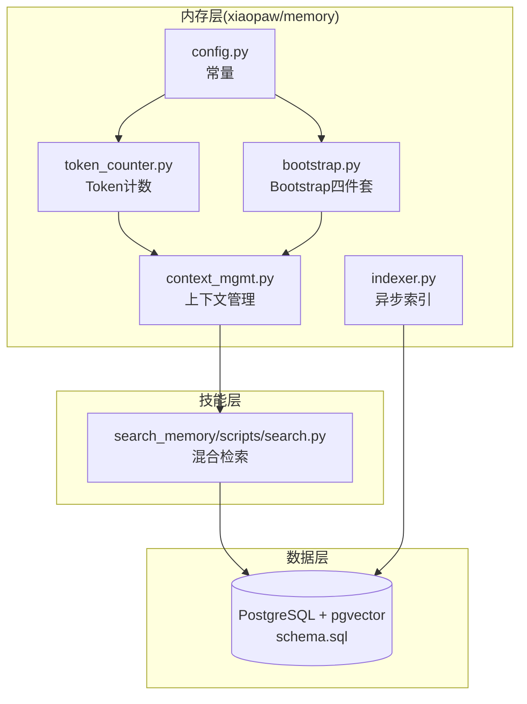
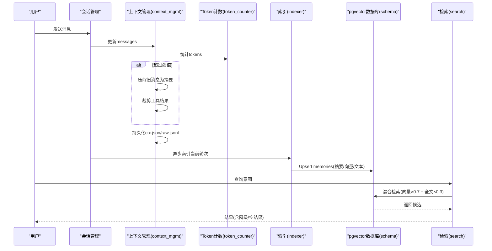
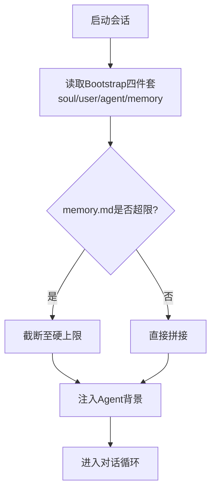
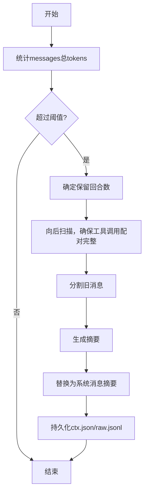
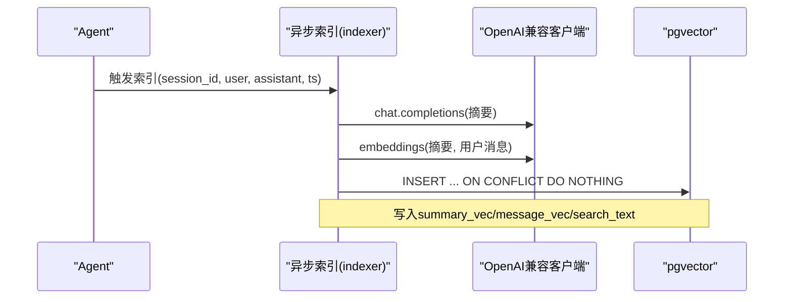
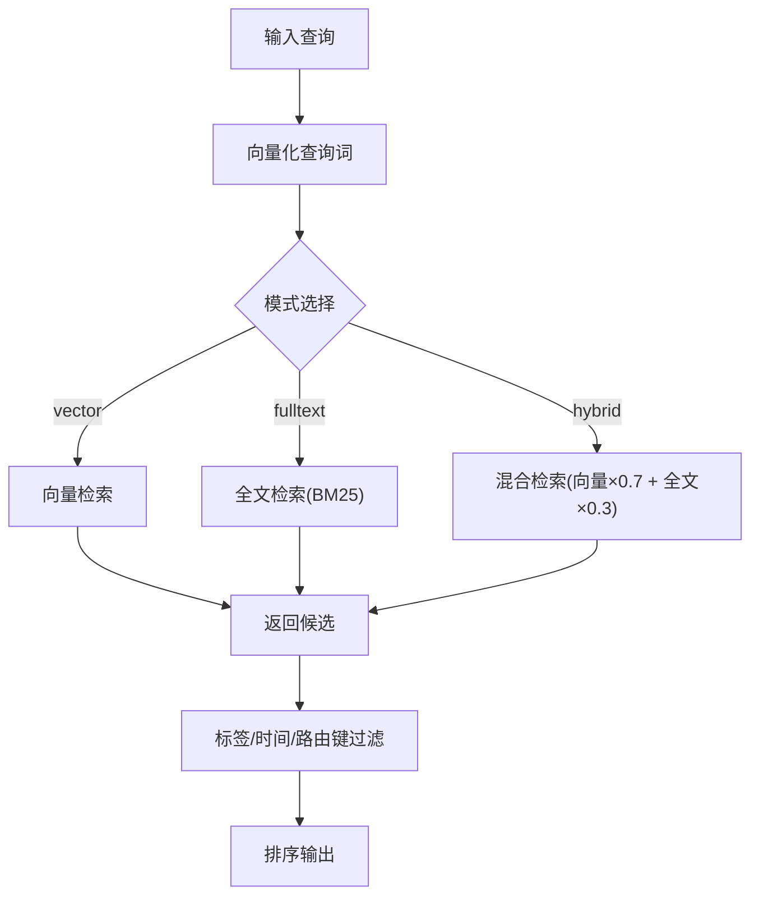
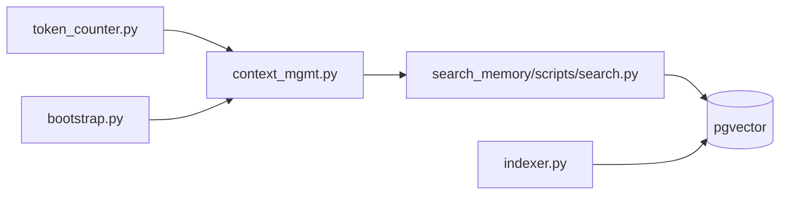

# 内存管理模块

<cite>
**本文引用的文件**
- [bootstrap.py](file://xiaopaw/memory/bootstrap.py)
- [context_mgmt.py](file://xiaopaw/memory/context_mgmt.py)
- [indexer.py](file://xiaopaw/memory/indexer.py)
- [token_counter.py](file://xiaopaw/memory/token_counter.py)
- [config.py](file://xiaopaw/memory/config.py)
- [schema.sql](file://schema.sql)
- [search.py](file://xiaopaw/skills/search_memory/scripts/search.py)
- [test_e2e_07_memory_save.py](file://tests/e2e/test_e2e_07_memory_save.py)
- [test_e2e_08_search_memory.py](file://tests/e2e/test_e2e_08_search_memory.py)
- [test_e2e_09_pruning.py](file://tests/e2e/test_e2e_09_pruning.py)
- [pyproject.toml](file://pyproject.toml)
</cite>

## 目录
1. [简介](#简介)
2. [项目结构](#项目结构)
3. [核心组件](#核心组件)
4. [架构总览](#架构总览)
5. [组件详解](#组件详解)
6. [依赖关系分析](#依赖关系分析)
7. [性能考量](#性能考量)
8. [故障排查指南](#故障排查指南)
9. [结论](#结论)
10. [附录](#附录)

## 简介
本文件系统性梳理 XiaoPaw v2 的内存管理模块，围绕三层记忆架构（短期/中期/长期）、Bootstrap 四件套（soul、user、agent、memory）工作原理、Token 计数器、上下文管理、向量索引与检索、持久化与更新流程进行深入解析，并结合端到端测试与数据库模式，给出可操作的优化建议与常见问题解决方案。

## 项目结构
内存管理相关代码集中于 xiaopaw/memory 子模块，配合 pgvector 数据库 schema 与 search_memory 技能脚本共同构成完整的记忆体系；端到端测试覆盖了跨会话记忆保存、语义检索与降级、长对话裁剪压缩等关键路径。

图表来源
- [bootstrap.py:1-37](file://xiaopaw/memory/bootstrap.py#L1-L37)
- [context_mgmt.py:1-99](file://xiaopaw/memory/context_mgmt.py#L1-L99)
- [indexer.py:1-96](file://xiaopaw/memory/indexer.py#L1-L96)
- [token_counter.py:1-44](file://xiaopaw/memory/token_counter.py#L1-L44)
- [config.py:1-5](file://xiaopaw/memory/config.py#L1-L5)
- [search.py:1-209](file://xiaopaw/skills/search_memory/scripts/search.py#L1-L209)
- [schema.sql:1-44](file://schema.sql#L1-L44)

章节来源
- [bootstrap.py:1-37](file://xiaopaw/memory/bootstrap.py#L1-L37)
- [context_mgmt.py:1-99](file://xiaopaw/memory/context_mgmt.py#L1-L99)
- [indexer.py:1-96](file://xiaopaw/memory/indexer.py#L1-L96)
- [token_counter.py:1-44](file://xiaopaw/memory/token_counter.py#L1-L44)
- [config.py:1-5](file://xiaopaw/memory/config.py#L1-L5)
- [schema.sql:1-44](file://schema.sql#L1-L44)
- [search.py:1-209](file://xiaopaw/skills/search_memory/scripts/search.py#L1-L209)

## 核心组件
- 三层记忆架构
  - 短期记忆：当前会话上下文，通过上下文管理与持久化文件（ctx.json、raw.jsonl）实现。
  - 中期记忆：基于向量索引的对话片段，支持语义检索与标签/时间过滤。
  - 长期记忆：通过 Bootstrap 将 workspace 文件注入到 Agent 背景中，实现跨会话恢复。
- Bootstrap 四件套
  - soul、user、agent、memory 四类 Markdown 片段，按固定顺序拼接为提示词，注入到 Agent 初始化背景。
- Token 计数器
  - 优先使用本地 HuggingFace 分词器，回退到字符长度估算，用于上下文压缩与阈值控制。
- 上下文管理
  - 压缩旧消息为“早期对话摘要”，裁剪工具结果，持久化会话上下文与原始日志。
- 向量索引与检索
  - 异步提取摘要与嵌入，Upsert 至 pgvector；提供混合检索（向量×0.7 + 全文×0.3），并支持标签与时间过滤。

章节来源
- [bootstrap.py:20-37](file://xiaopaw/memory/bootstrap.py#L20-L37)
- [context_mgmt.py:14-99](file://xiaopaw/memory/context_mgmt.py#L14-L99)
- [indexer.py:32-96](file://xiaopaw/memory/indexer.py#L32-L96)
- [token_counter.py:15-44](file://xiaopaw/memory/token_counter.py#L15-L44)
- [config.py:3-5](file://xiaopaw/memory/config.py#L3-L5)
- [search.py:58-172](file://xiaopaw/skills/search_memory/scripts/search.py#L58-L172)

## 架构总览
下图展示了从对话到记忆持久化与检索的整体流程，涵盖 Token 计算、上下文压缩、向量索引、pgvector 检索与降级策略。

图表来源
- [context_mgmt.py:27-99](file://xiaopaw/memory/context_mgmt.py#L27-L99)
- [token_counter.py:35-44](file://xiaopaw/memory/token_counter.py#L35-L44)
- [indexer.py:32-96](file://xiaopaw/memory/indexer.py#L32-L96)
- [schema.sql:4-44](file://schema.sql#L4-L44)
- [search.py:58-172](file://xiaopaw/skills/search_memory/scripts/search.py#L58-L172)

## 组件详解

### 三层记忆架构与 Bootstrap 四件套
- 架构要点
  - 短期：会话内上下文，支持压缩与持久化，便于快速恢复。
  - 中期：每轮对话摘要与嵌入，支持语义检索与标签/时间过滤。
  - 长期：Bootstrap 将 workspace 的 soul/user/agent/memory 注入 Agent 背景，实现跨会话记忆恢复。
- Bootstrap 四件套
  - 顺序：soul → user → agent → memory。
  - memory.md 支持硬上限截断，防止超长内容影响初始化性能。
- 使用示例（端到端）
  - 记忆保存与跨会话回忆：见 [test_e2e_07_memory_save.py:38-84](file://tests/e2e/test_e2e_07_memory_save.py#L38-L84)，验证 user.md 在沙箱中被写入并在新会话中被 Bootstrap 读取。
  - 语义检索与降级：见 [test_e2e_08_search_memory.py:36-79](file://tests/e2e/test_e2e_08_search_memory.py#L36-L79)，验证混合检索与“无相关记录”的降级行为。

图表来源
- [bootstrap.py:20-37](file://xiaopaw/memory/bootstrap.py#L20-L37)
- [config.py:3-5](file://xiaopaw/memory/config.py#L3-L5)

章节来源
- [bootstrap.py:20-37](file://xiaopaw/memory/bootstrap.py#L20-L37)
- [config.py:3-5](file://xiaopaw/memory/config.py#L3-L5)
- [test_e2e_07_memory_save.py:38-84](file://tests/e2e/test_e2e_07_memory_save.py#L38-L84)
- [test_e2e_08_search_memory.py:36-79](file://tests/e2e/test_e2e_08_search_memory.py#L36-L79)

### Token 计数器与上下文管理
- Token 计数
  - 优先加载本地 HuggingFace 分词器（DeepSeek 基座），失败则回退到字符长度估算。
  - 用于判断是否触发压缩与阈值控制。
- 上下文管理
  - 压缩：将旧消息压缩为“早期对话摘要”，保护工具调用配对边界，避免破坏消息完整性。
  - 裁剪：对过长的 tool_result 内容进行截断标记，降低 token 占用。
  - 持久化：会话上下文保存为 ctx.json，原始消息流保存为 raw.jsonl，便于审计与恢复。
- 端到端验证
  - 长对话压缩与持久化：见 [test_e2e_09_pruning.py:46-85](file://tests/e2e/test_e2e_09_pruning.py#L46-L85)，验证 ctx.json 与 raw.jsonl 的存在与规模。

图表来源
- [context_mgmt.py:27-61](file://xiaopaw/memory/context_mgmt.py#L27-L61)
- [token_counter.py:35-44](file://xiaopaw/memory/token_counter.py#L35-L44)

章节来源
- [token_counter.py:15-44](file://xiaopaw/memory/token_counter.py#L15-L44)
- [context_mgmt.py:14-99](file://xiaopaw/memory/context_mgmt.py#L14-L99)
- [test_e2e_09_pruning.py:46-85](file://tests/e2e/test_e2e_09_pruning.py#L46-L85)

### 向量索引与检索
- 异步索引
  - 提取摘要与嵌入，Upsert 至 memories 表；内容 ID 基于 session_id 与时间戳哈希生成，避免重复。
  - 使用 HNSW 向量索引与全文索引，支持 cosine 距离与 BM25 排序。
- 检索策略
  - 混合检索：向量得分×0.7 + 全文得分×0.3，兼顾语义与精确匹配。
  - 支持标签过滤、时间窗口过滤与路由键隔离。
- 端到端验证
  - 语义检索与降级：见 [test_e2e_08_search_memory.py:36-79](file://tests/e2e/test_e2e_08_search_memory.py#L36-L79)，验证跨会话语义回忆与“无相关记录”的降级。

图表来源
- [indexer.py:32-96](file://xiaopaw/memory/indexer.py#L32-L96)
- [schema.sql:4-44](file://schema.sql#L4-L44)

图表来源
- [search.py:58-172](file://xiaopaw/skills/search_memory/scripts/search.py#L58-L172)
- [schema.sql:4-44](file://schema.sql#L4-L44)

章节来源
- [indexer.py:32-96](file://xiaopaw/memory/indexer.py#L32-L96)
- [search.py:58-172](file://xiaopaw/skills/search_memory/scripts/search.py#L58-L172)
- [schema.sql:4-44](file://schema.sql#L4-L44)
- [test_e2e_08_search_memory.py:36-79](file://tests/e2e/test_e2e_08_search_memory.py#L36-L79)

### 记忆的持久化、检索与更新流程
- 持久化
  - 会话上下文：ctx.json（原子写入，先写临时文件再重命名）。
  - 原始消息：raw.jsonl（追加写入，便于审计）。
  - 向量记忆：memories 表（Upsert，避免重复）。
- 检索
  - 混合检索为主，支持标签、时间窗口与路由键过滤。
  - 无匹配时返回降级提示，保证用户体验。
- 更新
  - Bootstrap 通过读取 workspace 文件更新长期记忆。
  - 向量记忆通过异步索引持续增量更新。

章节来源
- [context_mgmt.py:74-99](file://xiaopaw/memory/context_mgmt.py#L74-L99)
- [indexer.py:71-96](file://xiaopaw/memory/indexer.py#L71-L96)
- [bootstrap.py:20-37](file://xiaopaw/memory/bootstrap.py#L20-L37)
- [search.py:58-172](file://xiaopaw/skills/search_memory/scripts/search.py#L58-L172)

## 依赖关系分析
- 外部依赖
  - openai：用于摘要与嵌入。
  - psycopg2：连接 pgvector 执行 Upsert 与查询。
  - transformers：可选，用于本地分词器。
- 模块耦合
  - context_mgmt 依赖 token_counter 进行阈值判断。
  - indexer 依赖 openai 与 psycopg2，且与 schema.sql 字段强关联。
  - search_memory/scripts/search.py 依赖 pgvector 索引与嵌入模型。
- 可能的循环依赖
  - 当前模块间为单向依赖，无明显循环。

图表来源
- [token_counter.py:15-44](file://xiaopaw/memory/token_counter.py#L15-L44)
- [context_mgmt.py:27-99](file://xiaopaw/memory/context_mgmt.py#L27-L99)
- [indexer.py:12-25](file://xiaopaw/memory/indexer.py#L12-L25)
- [search.py:19-38](file://xiaopaw/skills/search_memory/scripts/search.py#L19-L38)

章节来源
- [pyproject.toml:22-31](file://pyproject.toml#L22-L31)
- [token_counter.py:15-44](file://xiaopaw/memory/token_counter.py#L15-L44)
- [context_mgmt.py:27-99](file://xiaopaw/memory/context_mgmt.py#L27-L99)
- [indexer.py:12-25](file://xiaopaw/memory/indexer.py#L12-L25)
- [search.py:19-38](file://xiaopaw/skills/search_memory/scripts/search.py#L19-L38)

## 性能考量
- Token 计数
  - 优先使用本地分词器，显著提升准确性；回退策略保证可用性。
  - 建议在高并发场景下缓存分词器实例，减少初始化开销。
- 上下文压缩
  - 压缩阈值与保留回合数需根据模型上下文长度动态调整。
  - 压缩摘要采用抽取式策略，兼顾速度与质量。
- 向量索引
  - HNSW 参数（m、ef_construction）影响构建与查询性能，建议结合数据规模调优。
  - 混合检索在语义与精确度之间平衡，建议根据业务场景调整权重。
- 数据库
  - 建议开启 WAL 与合适的 checkpoint 设置，保障 Upsert 事务稳定性。
  - 对高频查询字段建立索引（已包含），并定期维护统计信息。

[本节为通用性能指导，无需特定文件引用]

## 故障排查指南
- 存储空间不足
  - 现象：索引失败、Upsert 报错。
  - 排查：检查磁盘空间、数据库容量与连接池大小。
  - 解决：清理历史数据、扩大存储、优化索引参数。
- 检索性能差
  - 现象：检索延迟高、命中率低。
  - 排查：确认 HNSW 参数、向量维度、查询权重设置。
  - 解决：调整索引参数、增加向量维度或减少维度、优化查询词。
- 数据一致性
  - 现象：重复索引、数据丢失。
  - 排查：检查 Upsert 条件、内容 ID 哈希逻辑。
  - 解决：确保唯一键约束、幂等 Upsert、重试与幂等标识。
- Bootstrap 截断
  - 现象：长期记忆被截断。
  - 排查：确认 memory.md 行数与硬上限配置。
  - 解决：合理设置硬上限、拆分长期记忆文件。
- 上下文持久化失败
  - 现象：ctx.json 无法读取或写入异常。
  - 排查：检查目录权限、文件锁、编码问题。
  - 解决：确保目录存在、使用原子写入、统一编码。

章节来源
- [bootstrap.py:27-35](file://xiaopaw/memory/bootstrap.py#L27-L35)
- [context_mgmt.py:74-99](file://xiaopaw/memory/context_mgmt.py#L74-L99)
- [indexer.py:71-96](file://xiaopaw/memory/indexer.py#L71-L96)
- [schema.sql:4-44](file://schema.sql#L4-L44)

## 结论
XiaoPaw v2 的内存管理模块通过三层记忆架构与 Bootstrap 四件套实现了从短期到长期的完整记忆闭环；借助 Token 计数与上下文压缩保障了上下文窗口的稳定性；通过 pgvector 的异步索引与混合检索提供了高效、可降级的记忆检索能力。结合端到端测试与数据库模式，该方案在工程上具备良好的可维护性与扩展性。

[本节为总结性内容，无需特定文件引用]

## 附录

### 关键流程示例（代码路径）
- 创建记忆（保存用户偏好并跨会话回忆）
  - 见 [test_e2e_07_memory_save.py:38-84](file://tests/e2e/test_e2e_07_memory_save.py#L38-L84)
- 查询记忆（语义检索与降级）
  - 见 [test_e2e_08_search_memory.py:36-79](file://tests/e2e/test_e2e_08_search_memory.py#L36-L79)
- 管理长对话（裁剪与压缩）
  - 见 [test_e2e_09_pruning.py:46-85](file://tests/e2e/test_e2e_09_pruning.py#L46-L85)

### 数据库模式概览
- 表结构与索引
  - 表：memories（主键 id、会话标识、路由键、摘要、标签、时间戳、向量、全文索引）
  - 索引：HNSW 向量索引（summary_vec、message_vec）、全文 GIN 索引、标签 GIN 索引、路由键与时间索引

章节来源
- [schema.sql:4-44](file://schema.sql#L4-L44)