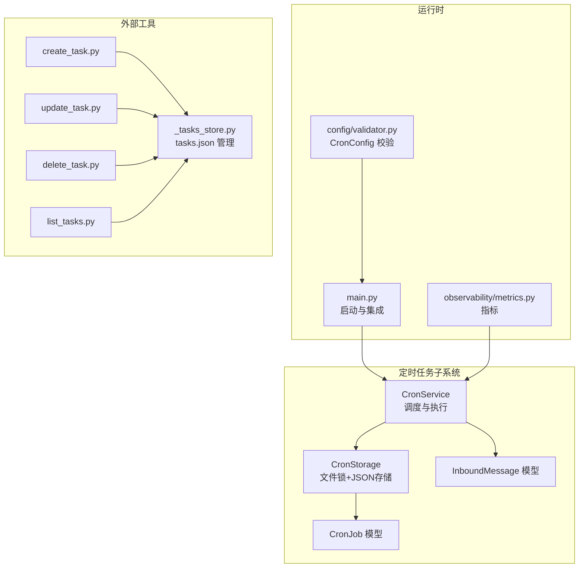
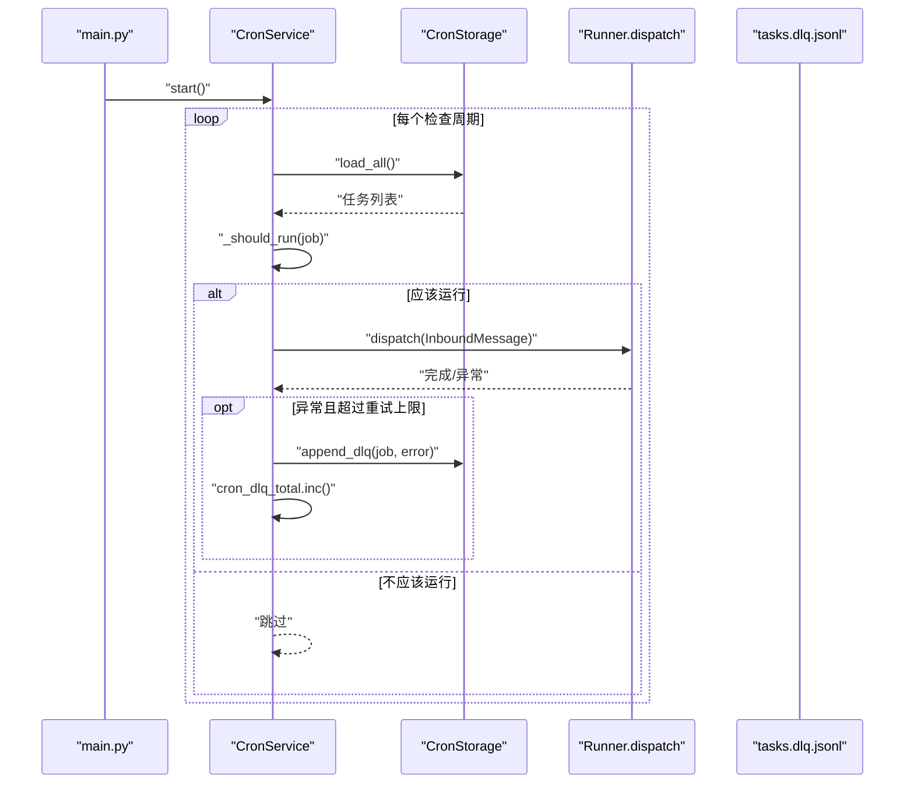
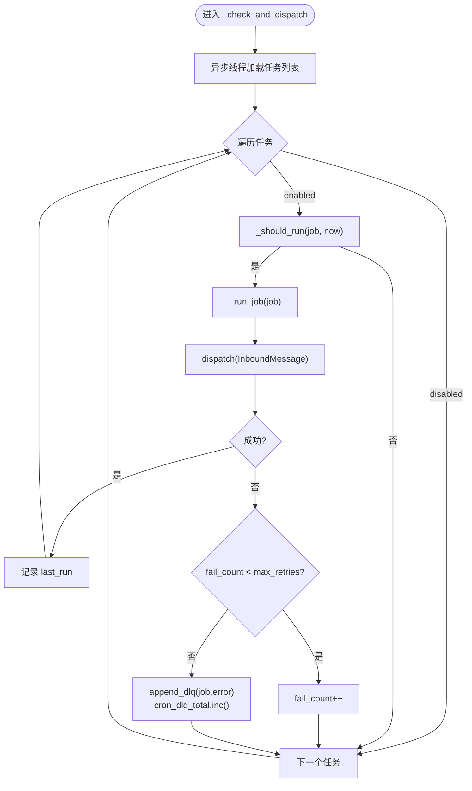
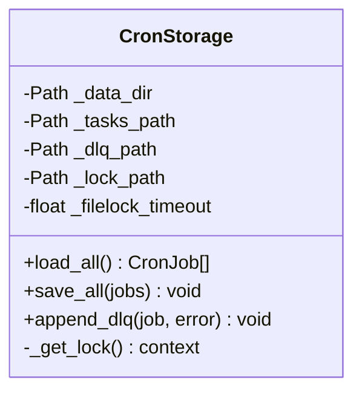
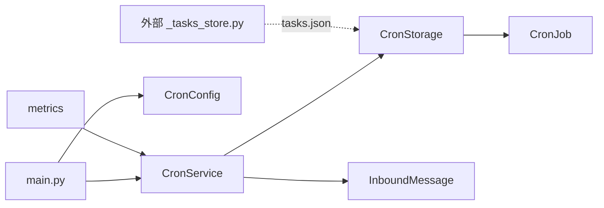

# 定时任务服务

<cite>
**本文引用的文件**
- [xiaopaw/cron/service.py](file://xiaopaw/cron/service.py)
- [xiaopaw/cron/storage.py](file://xiaopaw/cron/storage.py)
- [xiaopaw/cron/models.py](file://xiaopaw/cron/models.py)
- [xiaopaw/main.py](file://xiaopaw/main.py)
- [xiaopaw/config/validator.py](file://xiaopaw/config/validator.py)
- [xiaopaw/models.py](file://xiaopaw/models.py)
- [xiaopaw/observability/metrics.py](file://xiaopaw/observability/metrics.py)
- [config.yaml.example](file://config.yaml.example)
- [xiaopaw/skills/scheduler_mgr/scripts/_tasks_store.py](file://xiaopaw/skills/scheduler_mgr/scripts/_tasks_store.py)
- [xiaopaw/skills/scheduler_mgr/scripts/create_task.py](file://xiaopaw/skills/scheduler_mgr/scripts/create_task.py)
- [xiaopaw/skills/scheduler_mgr/scripts/update_task.py](file://xiaopaw/skills/scheduler_mgr/scripts/update_task.py)
- [xiaopaw/skills/scheduler_mgr/scripts/delete_task.py](file://xiaopaw/skills/scheduler_mgr/scripts/delete_task.py)
- [xiaopaw/skills/scheduler_mgr/scripts/list_tasks.py](file://xiaopaw/skills/scheduler_mgr/scripts/list_tasks.py)
</cite>

## 目录
1. [简介](#简介)
2. [项目结构](#项目结构)
3. [核心组件](#核心组件)
4. [架构总览](#架构总览)
5. [组件详解](#组件详解)
6. [依赖关系分析](#依赖关系分析)
7. [性能与可靠性](#性能与可靠性)
8. [故障排查指南](#故障排查指南)
9. [结论](#结论)
10. [附录](#附录)

## 简介
本文档系统性阐述 XiaoPaw v2 的定时任务服务，围绕 CronService 与 CronStorage 的实现细节，解释定时任务的注册、调度、执行与监控流程；并结合文件锁机制、死信队列（DLQ）处理与任务状态管理，给出优先级、重试策略与失败处理机制说明。同时提供可操作的代码路径示例，帮助读者快速理解与排障常见问题（如任务丢失、重复执行、性能瓶颈等）。

## 项目结构
定时任务相关代码主要分布在以下模块：
- 运行时调度与执行：xiaopaw/cron/service.py
- 任务持久化与并发保护：xiaopaw/cron/storage.py
- 数据模型：xiaopaw/cron/models.py
- 应用入口集成：xiaopaw/main.py
- 配置校验与默认值：xiaopaw/config/validator.py
- 消息模型：xiaopaw/models.py
- 指标监控：xiaopaw/observability/metrics.py
- 配置样例：config.yaml.example
- 外部任务管理脚本（兼容旧版/其他实现）：xiaopaw/skills/scheduler_mgr/scripts/*

图表来源
- [xiaopaw/cron/service.py:19-97](file://xiaopaw/cron/service.py#L19-L97)
- [xiaopaw/cron/storage.py:14-49](file://xiaopaw/cron/storage.py#L14-L49)
- [xiaopaw/cron/models.py:8-17](file://xiaopaw/cron/models.py#L8-L17)
- [xiaopaw/main.py:131-140](file://xiaopaw/main.py#L131-L140)
- [xiaopaw/config/validator.py:82-87](file://xiaopaw/config/validator.py#L82-L87)
- [xiaopaw/observability/metrics.py:44-47](file://xiaopaw/observability/metrics.py#L44-L47)
- [xiaopaw/skills/scheduler_mgr/scripts/_tasks_store.py:12-322](file://xiaopaw/skills/scheduler_mgr/scripts/_tasks_store.py#L12-L322)

章节来源
- [xiaopaw/cron/service.py:19-97](file://xiaopaw/cron/service.py#L19-L97)
- [xiaopaw/cron/storage.py:14-49](file://xiaopaw/cron/storage.py#L14-L49)
- [xiaopaw/cron/models.py:8-17](file://xiaopaw/cron/models.py#L8-L17)
- [xiaopaw/main.py:131-140](file://xiaopaw/main.py#L131-L140)
- [xiaopaw/config/validator.py:82-87](file://xiaopaw/config/validator.py#L82-L87)
- [xiaopaw/observability/metrics.py:44-47](file://xiaopaw/observability/metrics.py#L44-L47)
- [xiaopaw/skills/scheduler_mgr/scripts/_tasks_store.py:12-322](file://xiaopaw/skills/scheduler_mgr/scripts/_tasks_store.py#L12-L322)

## 核心组件
- CronService：负责周期性扫描任务、判断是否应触发、构造消息并分发给 Runner 执行，支持失败计数与 DLQ 移动。
- CronStorage：基于 JSON 文件的任务存储，采用文件锁保证并发安全；提供加载、保存与 DLQ 追加能力。
- CronJob：任务数据模型，包含标识、表达式、内容、开关、描述、失败计数与最大重试次数等字段。
- InboundMessage：统一入站消息结构，定时任务通过该结构注入 trace_id、is_cron 标记等。
- 集成点：main.py 中按配置实例化 CronStorage 与 CronService，并在运行时启动/停止。
- 配置：CronConfig 提供开关、检查间隔、文件锁超时、最大 DLQ 重试等参数。

章节来源
- [xiaopaw/cron/service.py:19-97](file://xiaopaw/cron/service.py#L19-L97)
- [xiaopaw/cron/storage.py:14-49](file://xiaopaw/cron/storage.py#L14-L49)
- [xiaopaw/cron/models.py:8-17](file://xiaopaw/cron/models.py#L8-L17)
- [xiaopaw/models.py:18-27](file://xiaopaw/models.py#L18-L27)
- [xiaopaw/main.py:131-140](file://xiaopaw/main.py#L131-L140)
- [xiaopaw/config/validator.py:82-87](file://xiaopaw/config/validator.py#L82-L87)

## 架构总览
定时任务从 CronStorage 加载任务列表，CronService 周期性评估每个任务的 cron 表达式，满足条件即构造 InboundMessage 并调用分发函数（通常为 Runner.dispatch）。若执行异常且超过最大重试次数，则写入 DLQ 并上报指标。

图表来源
- [xiaopaw/main.py:131-140](file://xiaopaw/main.py#L131-L140)
- [xiaopaw/cron/service.py:32-97](file://xiaopaw/cron/service.py#L32-L97)
- [xiaopaw/cron/storage.py:31-49](file://xiaopaw/cron/storage.py#L31-L49)
- [xiaopaw/observability/metrics.py:44-47](file://xiaopaw/observability/metrics.py#L44-L47)

## 组件详解

### CronService：调度与执行
- 生命周期管理：start 创建后台任务循环，stop 取消并等待退出。
- 调度逻辑：每轮从存储加载全部任务，遍历筛选已启用任务，使用 croniter 计算下次触发时间并与当前时间比较决定是否执行。
- 执行与消息构造：对满足条件的任务构造 InboundMessage（设置 is_cron、trace_id 等），调用传入的分发函数。
- 失败与重试：捕获分发异常，递增 fail_count；当达到 max_retries 时写入 DLQ 并上报指标。
- 性能注意：检查逻辑在独立线程中读取存储，避免阻塞事件循环。

图表来源
- [xiaopaw/cron/service.py:53-97](file://xiaopaw/cron/service.py#L53-L97)

章节来源
- [xiaopaw/cron/service.py:32-97](file://xiaopaw/cron/service.py#L32-L97)

### CronStorage：文件锁与持久化
- 存储布局：data_dir/cron/tasks.json（任务清单）、data_dir/cron/tasks.dlq.jsonl（死信队列）、data_dir/cron/tasks.json.lock（文件锁）。
- 并发控制：通过 filelock 或空上下文（无依赖时退化为空操作）确保同一时刻只有一个进程写入 tasks.json。
- 读写策略：load_all 读取并反序列化；save_all 写临时文件再原子重命名，降低损坏风险；append_dlq 以 JSONL 追加条目。
- 错误处理：导入 filelock 失败时回退到无锁模式，日志提示。

图表来源
- [xiaopaw/cron/storage.py:14-49](file://xiaopaw/cron/storage.py#L14-L49)

章节来源
- [xiaopaw/cron/storage.py:14-49](file://xiaopaw/cron/storage.py#L14-L49)

### CronJob：任务数据模型
- 关键字段：id、routing_key、cron_expr、content、enabled、description、fail_count、max_retries。
- 校验约束：fail_count、max_retries 非负；extra="forbid" 限制多余字段。

章节来源
- [xiaopaw/cron/models.py:8-17](file://xiaopaw/cron/models.py#L8-L17)

### InboundMessage：统一入站消息
- 用于定时任务的分发载体，包含 routing_key、content、msg_id、ts、is_cron、trace_id 等。
- CronService 在执行时为定时任务生成唯一 trace_id，便于链路追踪。

章节来源
- [xiaopaw/models.py:18-27](file://xiaopaw/models.py#L18-L27)
- [xiaopaw/cron/service.py:75-85](file://xiaopaw/cron/service.py#L75-L85)

### 集成与启动流程
- main.py 中根据配置实例化 CronStorage 与 CronService，并在启用时启动；停止时优雅关闭。
- 配置项来自 CronConfig：enabled、check_interval_s、filelock_timeout_s、max_dlq_retries。

章节来源
- [xiaopaw/main.py:131-140](file://xiaopaw/main.py#L131-L140)
- [xiaopaw/config/validator.py:82-87](file://xiaopaw/config/validator.py#L82-L87)

### 外部任务管理脚本（兼容旧实现）
- _tasks_store.py：提供 tasks.json 的读写、任务创建/更新/删除、列出任务等能力，采用临时文件写入策略。
- create_task.py/update_task.py/delete_task.py/list_tasks.py：命令行入口，封装 _tasks_store 的功能。

章节来源
- [xiaopaw/skills/scheduler_mgr/scripts/_tasks_store.py:12-322](file://xiaopaw/skills/scheduler_mgr/scripts/_tasks_store.py#L12-L322)
- [xiaopaw/skills/scheduler_mgr/scripts/create_task.py:8-33](file://xiaopaw/skills/scheduler_mgr/scripts/create_task.py#L8-L33)
- [xiaopaw/skills/scheduler_mgr/scripts/update_task.py:8-44](file://xiaopaw/skills/scheduler_mgr/scripts/update_task.py#L8-L44)
- [xiaopaw/skills/scheduler_mgr/scripts/delete_task.py:8-15](file://xiaopaw/skills/scheduler_mgr/scripts/delete_task.py#L8-L15)
- [xiaopaw/skills/scheduler_mgr/scripts/list_tasks.py:7-10](file://xiaopaw/skills/scheduler_mgr/scripts/list_tasks.py#L7-L10)

## 依赖关系分析
- CronService 依赖 CronStorage（读取任务）、InboundMessage（构造消息）、metrics（DLQ 指标）。
- CronStorage 依赖 CronJob（序列化/反序列化）。
- main.py 依赖 CronService/CronStorage，并通过配置驱动其行为。
- 外部脚本与 CronService/CronStorage 解耦，通过文件系统共享任务数据。

图表来源
- [xiaopaw/cron/service.py:11-14](file://xiaopaw/cron/service.py#L11-L14)
- [xiaopaw/cron/storage.py:9](file://xiaopaw/cron/storage.py#L9)
- [xiaopaw/main.py:131-137](file://xiaopaw/main.py#L131-L137)
- [xiaopaw/observability/metrics.py:44-47](file://xiaopaw/observability/metrics.py#L44-L47)
- [xiaopaw/skills/scheduler_mgr/scripts/_tasks_store.py:9](file://xiaopaw/skills/scheduler_mgr/scripts/_tasks_store.py#L9)

章节来源
- [xiaopaw/cron/service.py:11-14](file://xiaopaw/cron/service.py#L11-L14)
- [xiaopaw/cron/storage.py:9](file://xiaopaw/cron/storage.py#L9)
- [xiaopaw/main.py:131-137](file://xiaopaw/main.py#L131-L137)
- [xiaopaw/observability/metrics.py:44-47](file://xiaopaw/observability/metrics.py#L44-L47)
- [xiaopaw/skills/scheduler_mgr/scripts/_tasks_store.py:9](file://xiaopaw/skills/scheduler_mgr/scripts/_tasks_store.py#L9)

## 性能与可靠性
- 检查频率：由配置项 check_interval_s 控制，默认 30 秒；过短会增加 I/O 压力，过长可能错过触发。
- 文件锁：filelock_timeout_s 控制写锁等待时间；在高并发场景下建议适当增大以避免频繁竞争。
- 重试与 DLQ：max_dlq_retries 控制最大重试次数；超过后进入 DLQ 并上报 cron_dlq_total 指标，便于告警。
- I/O 原子性：CronStorage 使用 .tmp + rename 的写入策略，降低部分写入导致的数据损坏风险。
- 线程隔离：CronService 将存储读取放入线程池，避免阻塞事件循环。

章节来源
- [xiaopaw/config/validator.py:82-87](file://xiaopaw/config/validator.py#L82-L87)
- [xiaopaw/cron/storage.py:38-43](file://xiaopaw/cron/storage.py#L38-L43)
- [xiaopaw/cron/service.py:45-51](file://xiaopaw/cron/service.py#L45-L51)
- [xiaopaw/observability/metrics.py:44-47](file://xiaopaw/observability/metrics.py#L44-L47)

## 故障排查指南
- 任务未触发
  - 检查 cron_expr 是否有效；无效表达式会被记录警告并跳过。
  - 确认任务 enabled 为真。
  - 核对 check_interval_s 设置是否合理。
  - 参考：[xiaopaw/cron/service.py:65-73](file://xiaopaw/cron/service.py#L65-L73)
- 任务重复执行
  - 当前实现按“上次检查窗口内”的下一次触发时间判断，若系统时间回拨或检查间隔过大，可能导致边界误差。建议保持稳定的系统时间与合理的检查间隔。
  - 参考：[xiaopaw/cron/service.py:65-73](file://xiaopaw/cron/service.py#L65-L73)
- 任务丢失
  - 若 filelock 依赖缺失，_get_lock 回退为空上下文，存在并发写入风险。建议安装 filelock 并确认锁文件路径可达。
  - 参考：[xiaopaw/cron/storage.py:23-29](file://xiaopaw/cron/storage.py#L23-L29)
- 执行失败与 DLQ
  - 分发异常且 fail_count 达到 max_retries 后自动进入 DLQ，并上报 cron_dlq_total 指标。
  - 建议定期巡检 DLQ 文件并人工干预恢复。
  - 参考：[xiaopaw/cron/service.py:87-97](file://xiaopaw/cron/service.py#L87-L97)，[xiaopaw/observability/metrics.py:44-47](file://xiaopaw/observability/metrics.py#L44-L47)
- 性能瓶颈
  - 检查间隔过短或任务过多会导致 I/O 压力上升；适当增大 check_interval_s 或拆分任务。
  - 参考：[xiaopaw/config/validator.py:82-87](file://xiaopaw/config/validator.py#L82-L87)

章节来源
- [xiaopaw/cron/service.py:65-73](file://xiaopaw/cron/service.py#L65-L73)
- [xiaopaw/cron/service.py:87-97](file://xiaopaw/cron/service.py#L87-L97)
- [xiaopaw/cron/storage.py:23-29](file://xiaopaw/cron/storage.py#L23-L29)
- [xiaopaw/observability/metrics.py:44-47](file://xiaopaw/observability/metrics.py#L44-L47)
- [xiaopaw/config/validator.py:82-87](file://xiaopaw/config/validator.py#L82-L87)

## 结论
XiaoPaw v2 的定时任务服务以简洁可靠为核心设计目标：通过 CronService 的周期扫描与 CronStorage 的文件锁持久化，实现了稳定的任务调度与执行；配合 DLQ 与指标监控，提供了完善的失败处理与可观测性。生产环境中建议合理配置检查间隔与文件锁超时，关注 DLQ 与日志，以保障任务的正确性与时效性。

## 附录

### 任务创建、配置与管理（代码路径示例）
- 创建任务（命令行）
  - [xiaopaw/skills/scheduler_mgr/scripts/create_task.py:8-33](file://xiaopaw/skills/scheduler_mgr/scripts/create_task.py#L8-L33)
- 更新任务（命令行）
  - [xiaopaw/skills/scheduler_mgr/scripts/update_task.py:8-44](file://xiaopaw/skills/scheduler_mgr/scripts/update_task.py#L8-L44)
- 删除任务（命令行）
  - [xiaopaw/skills/scheduler_mgr/scripts/delete_task.py:8-15](file://xiaopaw/skills/scheduler_mgr/scripts/delete_task.py#L8-L15)
- 列出任务（命令行）
  - [xiaopaw/skills/scheduler_mgr/scripts/list_tasks.py:7-10](file://xiaopaw/skills/scheduler_mgr/scripts/list_tasks.py#L7-L10)
- 任务存储核心（tasks.json 管理）
  - [xiaopaw/skills/scheduler_mgr/scripts/_tasks_store.py:12-322](file://xiaopaw/skills/scheduler_mgr/scripts/_tasks_store.py#L12-L322)

### 配置参考
- 默认配置项与含义
  - [xiaopaw/config/validator.py:82-87](file://xiaopaw/config/validator.py#L82-L87)
- 示例配置文件
  - [config.yaml.example:67-71](file://config.yaml.example#L67-L71)