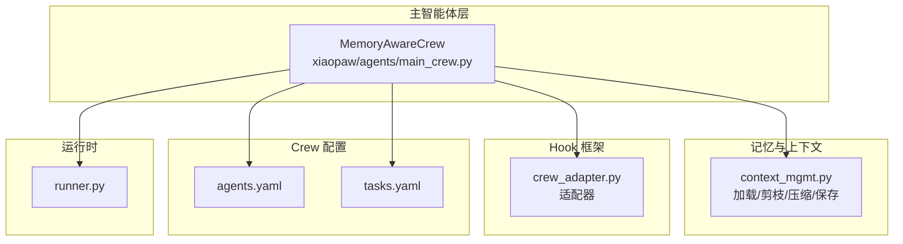
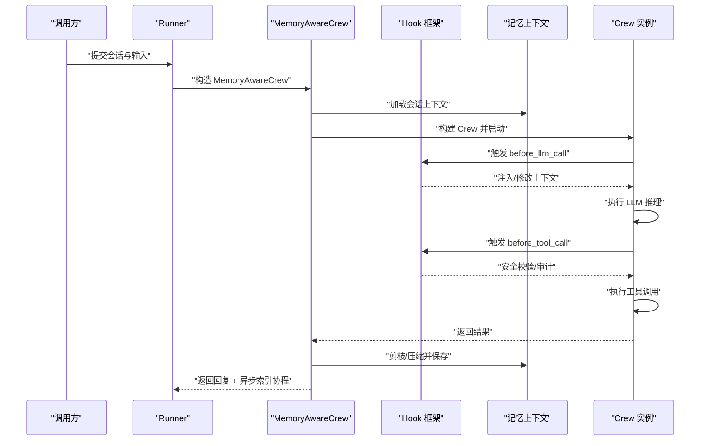
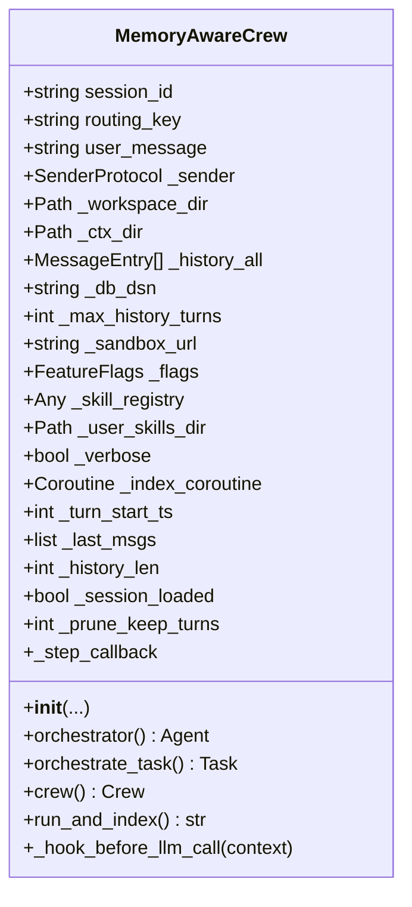
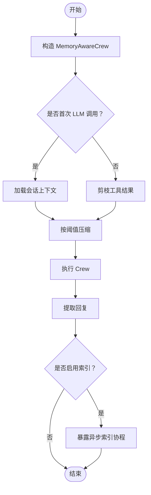
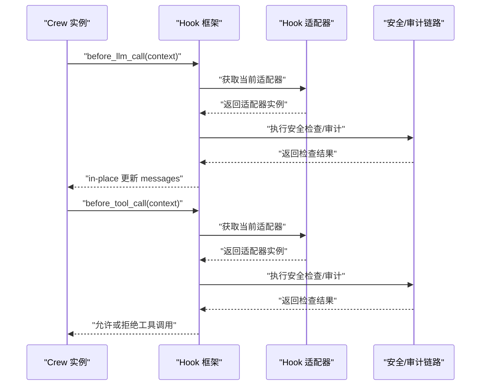
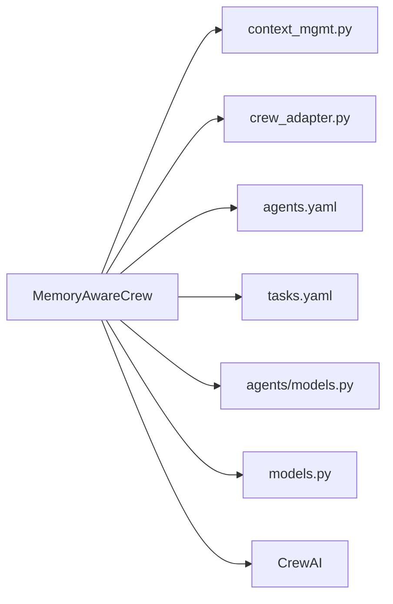

# MemoryAwareCrew 主智能体

<cite>
**本文档引用的文件**
- [main_crew.py](file://xiaopaw/agents/main_crew.py)
- [context_mgmt.py](file://xiaopaw/memory/context_mgmt.py)
- [crew_adapter.py](file://xiaopaw/hook_framework/crew_adapter.py)
- [agents.yaml](file://xiaopaw/agents/config/agents.yaml)
- [tasks.yaml](file://xiaopaw/agents/config/tasks.yaml)
- [models.py](file://xiaopaw/agents/models.py)
- [models.py](file://xiaopaw/models.py)
- [runner.py](file://xiaopaw/runner.py)
- [02-modules.md](file://docs/02-modules.md)
</cite>

## 目录
1. [简介](#简介)
2. [项目结构](#项目结构)
3. [核心组件](#核心组件)
4. [架构总览](#架构总览)
5. [详细组件分析](#详细组件分析)
6. [依赖关系分析](#依赖关系分析)
7. [性能考量](#性能考量)
8. [故障排查指南](#故障排查指南)
9. [结论](#结论)
10. [附录](#附录)

## 简介
本文件面向 MemoryAwareCrew 主智能体，系统性阐述其设计架构与实现细节，重点覆盖：
- 三层记忆系统（会话上下文、工具调用结果、历史记录）的组织与管理
- Hook 框架集成（before_llm_call、before_tool_call）与安全控制机制
- 上下文管理（加载、剪枝、压缩、持久化）与会话恢复流程
- 初始化参数、配置选项与生命周期管理
- 与 CrewAI 框架（Agent、Task、Crew）的集成方式
- 常见配置问题与解决方案

## 项目结构
MemoryAwareCrew 位于 xiaopaw/agents/main_crew.py，围绕其构建了以下支撑模块：
- 记忆与上下文管理：xiaopaw/memory/context_mgmt.py
- Hook 框架适配：xiaopaw/hook_framework/crew_adapter.py
- Crew 配置：xiaopaw/agents/config/agents.yaml、tasks.yaml
- 输出模型与通用协议：xiaopaw/agents/models.py、xiaopaw/models.py
- 运行时编排：xiaopaw/runner.py
- 文档化说明：docs/02-modules.md

图表来源
- [main_crew.py:118-160](file://xiaopaw/agents/main_crew.py#L118-L160)
- [context_mgmt.py](file://xiaopaw/memory/context_mgmt.py)
- [crew_adapter.py](file://xiaopaw/hook_framework/crew_adapter.py)
- [agents.yaml](file://xiaopaw/agents/config/agents.yaml)
- [tasks.yaml](file://xiaopaw/agents/config/tasks.yaml)
- [runner.py](file://xiaopaw/runner.py)

章节来源
- [main_crew.py:118-160](file://xiaopaw/agents/main_crew.py#L118-L160)
- [02-modules.md:463-583](file://docs/02-modules.md#L463-L583)

## 核心组件
- MemoryAwareCrew：主智能体，负责会话上下文加载、消息剪枝与压缩、Hook 注入、Crew 生命周期编排。
- 记忆上下文管理：封装会话上下文的加载、保存、剪枝与压缩。
- Hook 适配器：桥接 CrewAI Hook 与内部安全/审计链路。
- Crew 配置：Agent、Task 的 YAML 配置文件。
- Runner：异步调度与索引协程托管。

章节来源
- [main_crew.py:118-160](file://xiaopaw/agents/main_crew.py#L118-L160)
- [context_mgmt.py](file://xiaopaw/memory/context_mgmt.py)
- [crew_adapter.py](file://xiaopaw/hook_framework/crew_adapter.py)
- [agents.yaml](file://xiaopaw/agents/config/agents.yaml)
- [tasks.yaml](file://xiaopaw/agents/config/tasks.yaml)
- [runner.py](file://xiaopaw/runner.py)

## 架构总览
MemoryAwareCrew 将 CrewAI 的 Agent、Task、Crew 与内部的记忆系统、Hook 框架、会话管理紧密耦合，形成“上下文驱动 + 安全前置”的执行流。

图表来源
- [main_crew.py:118-160](file://xiaopaw/agents/main_crew.py#L118-L160)
- [context_mgmt.py](file://xiaopaw/memory/context_mgmt.py)
- [crew_adapter.py](file://xiaopaw/hook_framework/crew_adapter.py)
- [runner.py](file://xiaopaw/runner.py)

## 详细组件分析

### MemoryAwareCrew 类设计与实现
- 角色定位：基于 CrewAI 的 CrewBase，封装主流程编排、上下文管理与 Hook 集成。
- 关键职责：
  - 会话上下文加载与恢复（首次 LLM 调用时）
  - 消息剪枝与压缩（控制上下文窗口）
  - 会话历史管理（最大轮次限制）
  - Crew 构建与执行（Agent、Task、Crew）
  - 异步索引与持久化（可选）

图表来源
- [main_crew.py:118-160](file://xiaopaw/agents/main_crew.py#L118-L160)

章节来源
- [main_crew.py:118-160](file://xiaopaw/agents/main_crew.py#L118-L160)
- [02-modules.md:463-583](file://docs/02-modules.md#L463-L583)

### 初始化参数与配置选项
- 必填参数
  - session_id：会话标识
  - routing_key：路由键
  - user_message：用户输入
  - sender：发送协议
  - workspace_dir：工作区目录
  - ctx_dir：上下文存储目录
  - history_all：完整历史消息列表
- 可选参数
  - db_dsn：数据库连接串（启用异步索引）
  - max_history_turns：最大历史轮次
  - sandbox_url：沙箱服务地址
  - flags：特性开关（含上下文窗口等）
  - skill_registry：技能注册表
  - user_skills_dir：用户自定义技能目录
  - verbose：调试输出开关
- 配置文件
  - agents.yaml：Agent 配置
  - tasks.yaml：Task 配置

章节来源
- [main_crew.py:123-139](file://xiaopaw/agents/main_crew.py#L123-L139)
- [agents.yaml](file://xiaopaw/agents/config/agents.yaml)
- [tasks.yaml](file://xiaopaw/agents/config/tasks.yaml)

### 生命周期管理
- 构造阶段：设置会话参数、回调、窗口大小、历史轮次等
- 执行阶段：首次 LLM 调用前加载上下文；每次调用前进行剪枝与压缩；执行 Crew；提取回复
- 结束阶段：可选地暴露异步索引协程给 Runner 管理

图表来源
- [main_crew.py:118-160](file://xiaopaw/agents/main_crew.py#L118-L160)

章节来源
- [main_crew.py:118-160](file://xiaopaw/agents/main_crew.py#L118-L160)

### 三层记忆系统
- 会话上下文（ctx.json）
  - 首次 LLM 调用时从 ctx_dir 加载并拼接到 messages
  - 用于承载系统提示、摘要与新鲜对话
- 工具调用结果
  - 每次 LLM 调用前对工具结果进行剪枝，保留最近若干轮
- 历史记录（history_all）
  - 全量历史消息，受 max_history_turns 限制
  - 通过会话原始消息追加与保存实现持久化

章节来源
- [main_crew.py:118-160](file://xiaopaw/agents/main_crew.py#L118-L160)
- [context_mgmt.py](file://xiaopaw/memory/context_mgmt.py)

### Hook 框架集成与安全控制
- before_llm_call
  - 在 LLM 调用前执行：加载上下文、剪枝、压缩
  - 严格要求 in-place 修改 messages，避免替换引用导致 CrewAI 执行器脱钩
- before_tool_call
  - 在工具调用前执行：安全门禁、审计日志、重试追踪等
  - 通过 Hook 适配器与 crew_adapter 获取当前适配器链路
- Hook 协作
  - CrewAI Hook 与内部安全链路协同，确保“前置控制、可观测、可审计”

图表来源
- [main_crew.py:118-160](file://xiaopaw/agents/main_crew.py#L118-L160)
- [crew_adapter.py](file://xiaopaw/hook_framework/crew_adapter.py)

章节来源
- [main_crew.py:118-160](file://xiaopaw/agents/main_crew.py#L118-L160)
- [crew_adapter.py](file://xiaopaw/hook_framework/crew_adapter.py)

### 上下文管理机制
- 加载：首次 LLM 调用时从 ctx_dir 加载会话上下文并拼接到 messages
- 剪枝：保留最近若干轮工具结果，减少冗余
- 压缩：按阈值压缩，控制上下文窗口占用
- 保存：将当前 messages 的拷贝保存到会话原始记录中，供后续索引与检索

章节来源
- [main_crew.py:118-160](file://xiaopaw/agents/main_crew.py#L118-L160)
- [context_mgmt.py](file://xiaopaw/memory/context_mgmt.py)

### 与 CrewAI 的集成
- Agent：通过 orchestrator 方法构建，backstory 由引导提示生成，工具包含技能加载器
- Task：通过 orchestrate_task 方法构建，任务配置来自 tasks.yaml
- Crew：通过 crew 方法构建，启用 step_callback 以便逐步回调与可观测性

章节来源
- [main_crew.py:118-160](file://xiaopaw/agents/main_crew.py#L118-L160)
- [agents.yaml](file://xiaopaw/agents/config/agents.yaml)
- [tasks.yaml](file://xiaopaw/agents/config/tasks.yaml)

### 会话恢复机制、历史记录管理与消息压缩策略
- 会话恢复：首次 LLM 调用时从 ctx_dir 加载 ctx.json，并更新历史长度标记
- 历史记录：history_all 作为全量历史，受 max_history_turns 限制
- 消息压缩：基于阈值的压缩策略，结合 fresh_keep_turns 保留最新对话片段
- 剪枝策略：工具调用结果按固定轮次保留，避免上下文膨胀

章节来源
- [main_crew.py:118-160](file://xiaopaw/agents/main_crew.py#L118-L160)
- [context_mgmt.py](file://xiaopaw/memory/context_mgmt.py)

### 代码示例（路径指引）
- 构建与配置
  - [MemoryAwareCrew.__init__:123-139](file://xiaopaw/agents/main_crew.py#L123-L139)
  - [Agent 配置文件](file://xiaopaw/agents/config/agents.yaml)
  - [Task 配置文件](file://xiaopaw/agents/config/tasks.yaml)
- 执行流程
  - [run_and_index:557-582](file://xiaopaw/agents/main_crew.py#L557-L582)
  - [before_llm_call 钩子:507-530](file://xiaopaw/agents/main_crew.py#L507-L530)
- 上下文管理
  - [load_session_ctx / save_session_ctx / prune_tool_results / maybe_compress](file://xiaopaw/memory/context_mgmt.py)

章节来源
- [main_crew.py:118-160](file://xiaopaw/agents/main_crew.py#L118-L160)
- [context_mgmt.py](file://xiaopaw/memory/context_mgmt.py)

## 依赖关系分析
- 内部依赖
  - 记忆上下文：context_mgmt.py 提供加载、剪枝、压缩、保存能力
  - Hook 适配：crew_adapter.py 提供适配器获取与链路集成
  - 输出模型：agents/models.py、models.py 提供统一输出与协议
- 外部依赖
  - CrewAI：Agent、Task、Crew、CrewBase、Hook 注解
  - 配置：YAML 文件提供 Agent/Task 参数
  - 异步索引：可选的数据库 DSN 与异步协程

图表来源
- [main_crew.py:118-160](file://xiaopaw/agents/main_crew.py#L118-L160)
- [context_mgmt.py](file://xiaopaw/memory/context_mgmt.py)
- [crew_adapter.py](file://xiaopaw/hook_framework/crew_adapter.py)
- [agents.yaml](file://xiaopaw/agents/config/agents.yaml)
- [tasks.yaml](file://xiaopaw/agents/config/tasks.yaml)
- [models.py](file://xiaopaw/agents/models.py)
- [models.py](file://xiaopaw/models.py)

章节来源
- [main_crew.py:118-160](file://xiaopaw/agents/main_crew.py#L118-L160)

## 性能考量
- 上下文窗口控制：通过剪枝与压缩降低 tokens 使用，避免超出模型上下文限制
- 异步索引：在后台异步执行索引，不阻塞主线程
- 历史轮次限制：max_history_turns 控制历史规模，平衡信息完整性与性能
- Hook 前置控制：在工具调用前进行安全检查，减少无效计算

## 故障排查指南
- 问题：Hook 未生效或上下文未更新
  - 检查是否正确使用 @before_llm_call 注解
  - 确认 messages 是否 in-place 修改，避免替换引用
  - 参考：[before_llm_call 钩子实现:507-530](file://xiaopaw/agents/main_crew.py#L507-L530)
- 问题：会话上下文未加载
  - 确认 ctx_dir 正确且存在 ctx.json
  - 确认首次 LLM 调用前已触发加载逻辑
  - 参考：[run_and_index 中的上下文加载:557-582](file://xiaopaw/agents/main_crew.py#L557-L582)
- 问题：历史记录过多导致性能下降
  - 调整 max_history_turns 或检查剪枝/压缩阈值
  - 参考：[上下文管理接口](file://xiaopaw/memory/context_mgmt.py)
- 问题：工具调用被拒绝
  - 检查 Hook 适配器链路与权限策略
  - 参考：[Hook 适配器](file://xiaopaw/hook_framework/crew_adapter.py)

章节来源
- [main_crew.py:118-160](file://xiaopaw/agents/main_crew.py#L118-L160)
- [context_mgmt.py](file://xiaopaw/memory/context_mgmt.py)
- [crew_adapter.py](file://xiaopaw/hook_framework/crew_adapter.py)

## 结论
MemoryAwareCrew 以“上下文驱动 + Hook 前置控制”为核心，将 CrewAI 的推理能力与内部的安全、审计、记忆管理无缝整合。通过三层记忆系统与严格的上下文管理策略，实现了高可用、可扩展、可观测的主智能体执行框架。

## 附录
- 输出模型参考：[MainTaskOutput](file://xiaopaw/agents/models.py)
- 通用协议参考：[SenderProtocol](file://xiaopaw/models.py)
- 运行时编排参考：[Runner](file://xiaopaw/runner.py)