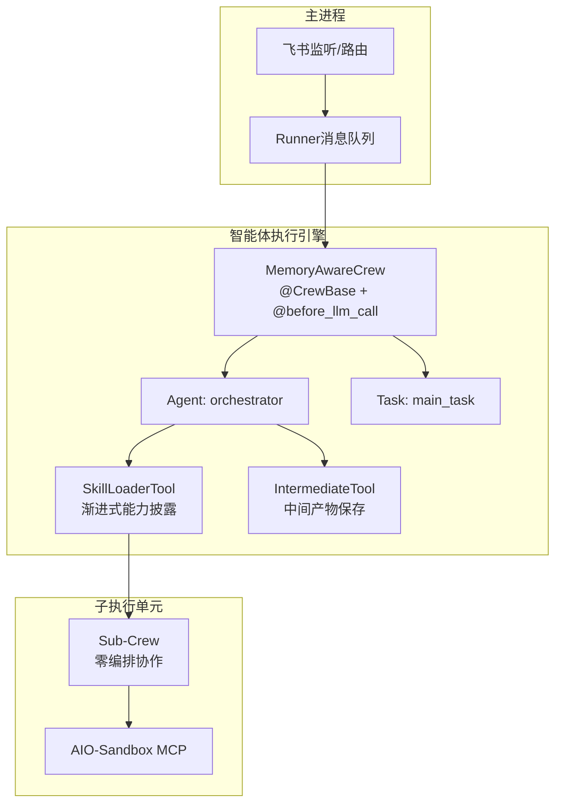
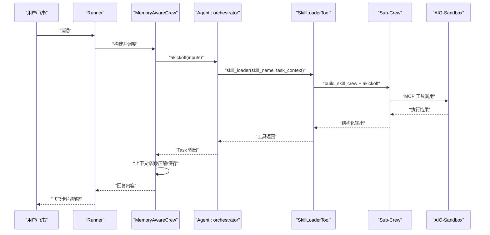
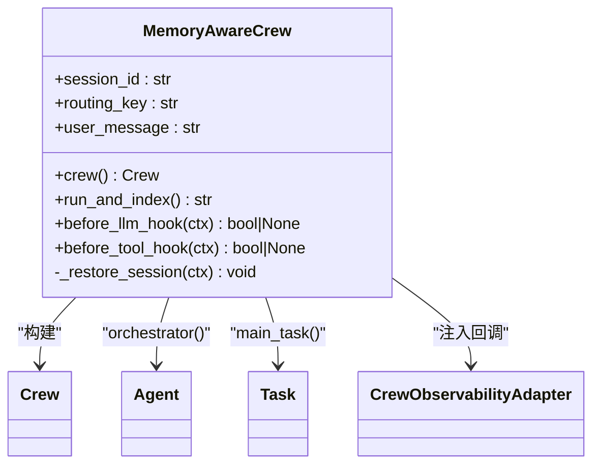
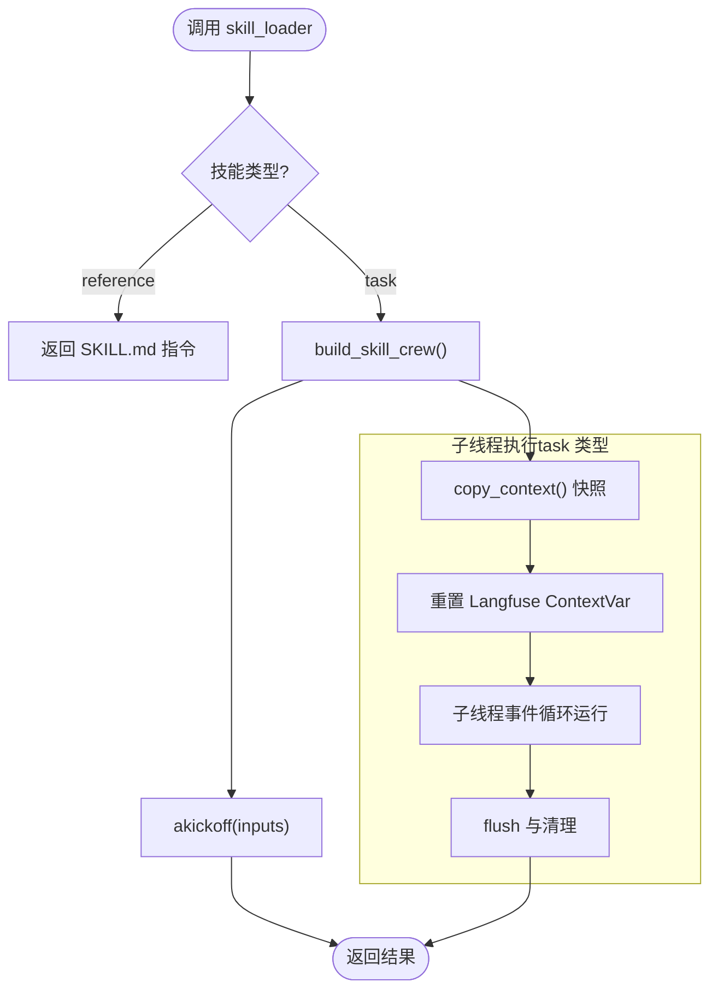
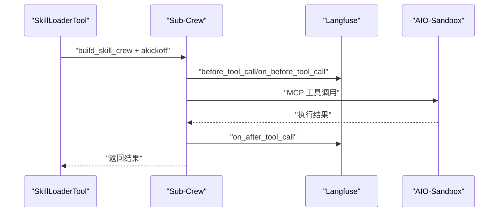
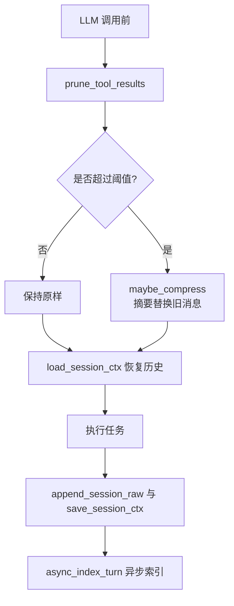
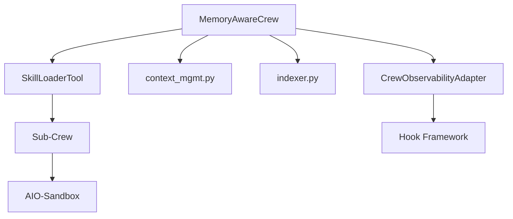

# 智能体执行引擎

<cite>
**本文引用的文件**
- [main_crew.py](file://xiaopaw/agents/main_crew.py)
- [skill_crew.py](file://xiaopaw/agents/skill_crew.py)
- [skill_loader.py](file://xiaopaw/tools/skill_loader.py)
- [context_mgmt.py](file://xiaopaw/memory/context_mgmt.py)
- [bootstrap.py](file://xiaopaw/memory/bootstrap.py)
- [indexer.py](file://xiaopaw/memory/indexer.py)
- [crew_adapter.py](file://xiaopaw/hook_framework/crew_adapter.py)
- [models.py](file://xiaopaw/agents/models.py)
- [session_models.py](file://xiaopaw/session/models.py)
- [agents.yaml](file://xiaopaw/agents/config/agents.yaml)
- [tasks.yaml](file://xiaopaw/agents/config/tasks.yaml)
- [load_skills.yaml](file://xiaopaw/skills/load_skills.yaml)
- [DESIGN.md](file://DESIGN.md)
- [README.md](file://README.md)
</cite>

## 目录
1. [简介](#简介)
2. [项目结构](#项目结构)
3. [核心组件](#核心组件)
4. [架构总览](#架构总览)
5. [详细组件分析](#详细组件分析)
6. [依赖分析](#依赖分析)
7. [性能考虑](#性能考虑)
8. [故障排查指南](#故障排查指南)
9. [结论](#结论)
10. [附录](#附录)

## 简介
本文件面向 XiaoPaw v2 的智能体执行引擎，聚焦以下关键目标：
- 深入解析 MemoryAwareCrew、SkillLoaderTool 与 Sub-Crew 的实现细节与协作机制
- 文档化智能体的决策流程、技能选择算法与执行策略
- 解释上下文管理、历史记录与记忆存储的实现方式
- 提供可追溯的代码示例路径，展示智能体的构建、配置与执行过程
- 说明与 CrewAI 框架的集成方式与自定义扩展点
- 提供常见配置与执行问题的诊断与解决方案

## 项目结构
XiaoPaw v2 的智能体执行引擎位于 xiaopaw/agents 与 xiaopaw/tools 目录，围绕 CrewAI 的 CrewBase、Agent、Task 与 Hooks，结合 hook_framework 的 CrewObservabilityAdapter，形成“主 Crew + 渐进式能力披露 + Sub-Crew 沙箱执行”的两层 Agent 架构。

图表来源
- [main_crew.py:118-221](file://xiaopaw/agents/main_crew.py#L118-L221)
- [skill_crew.py:98-155](file://xiaopaw/agents/skill_crew.py#L98-L155)
- [skill_loader.py:223-450](file://xiaopaw/tools/skill_loader.py#L223-L450)

章节来源
- [main_crew.py:118-221](file://xiaopaw/agents/main_crew.py#L118-L221)
- [skill_crew.py:98-155](file://xiaopaw/agents/skill_crew.py#L98-L155)
- [skill_loader.py:223-450](file://xiaopaw/tools/skill_loader.py#L223-L450)

## 核心组件
- MemoryAwareCrew：基于 CrewBase 的主智能体，负责上下文修剪与压缩、会话历史恢复、任务执行与索引异步写入。
- SkillLoaderTool：渐进式能力披露工具，根据技能清单动态加载 SKILL.md 并触发 Sub-Crew 执行。
- Sub-Crew：零编排的子执行单元，按 SKILL.md 动态构建 Agent/Task，在沙箱中执行受限工具。
- Hook 框架（CrewObservabilityAdapter）：将 CrewAI 的回调映射为 5+2 事件体系，统一观测、可靠性和安全策略的接入点。

章节来源
- [main_crew.py:118-221](file://xiaopaw/agents/main_crew.py#L118-L221)
- [skill_loader.py:223-450](file://xiaopaw/tools/skill_loader.py#L223-L450)
- [skill_crew.py:98-155](file://xiaopaw/agents/skill_crew.py#L98-L155)
- [crew_adapter.py:63-357](file://xiaopaw/hook_framework/crew_adapter.py#L63-L357)

## 架构总览
XiaoPaw v2 的执行引擎以“主 Crew + 工具 + 子 Crew”三层协作为核心，结合上下文管理、历史持久化与 Langfuse 可观测性，形成闭环的生产级智能体执行链路。

图表来源
- [main_crew.py:280-311](file://xiaopaw/agents/main_crew.py#L280-L311)
- [skill_loader.py:392-449](file://xiaopaw/tools/skill_loader.py#L392-L449)
- [skill_crew.py:146-154](file://xiaopaw/agents/skill_crew.py#L146-L154)

章节来源
- [main_crew.py:280-311](file://xiaopaw/agents/main_crew.py#L280-L311)
- [skill_loader.py:392-449](file://xiaopaw/tools/skill_loader.py#L392-L449)
- [skill_crew.py:146-154](file://xiaopaw/agents/skill_crew.py#L146-L154)

## 详细组件分析

### MemoryAwareCrew：主执行单元
- 职责
  - 定义 orchestrator Agent 与 main_task Task
  - 在 @before_llm_call 钩子中执行上下文修剪、压缩与会话历史恢复
  - 在 run_and_index 中执行 Crew 并异步写入索引
  - 通过 CrewObservabilityAdapter 注入 step_callback 与 task_callback，实现“安全出口”重抛 pending_deny
- 关键实现要点
  - 上下文修剪与压缩：prune_tool_results 与 maybe_compress
  - 会话历史恢复：load_session_ctx 与 restore 逻辑
  - 输出与索引：append_session_raw/save_session_ctx 与 async_index_turn
  - Hook 集成：before_llm_hook、before_tool_hook、crew 装配

图表来源
- [main_crew.py:118-221](file://xiaopaw/agents/main_crew.py#L118-L221)
- [main_crew.py:207-221](file://xiaopaw/agents/main_crew.py#L207-L221)
- [main_crew.py:256-279](file://xiaopaw/agents/main_crew.py#L256-L279)
- [main_crew.py:280-311](file://xiaopaw/agents/main_crew.py#L280-L311)

章节来源
- [main_crew.py:118-221](file://xiaopaw/agents/main_crew.py#L118-L221)
- [main_crew.py:223-254](file://xiaopaw/agents/main_crew.py#L223-L254)
- [main_crew.py:256-279](file://xiaopaw/agents/main_crew.py#L256-L279)
- [main_crew.py:280-311](file://xiaopaw/agents/main_crew.py#L280-L311)

### SkillLoaderTool：渐进式能力披露与 Sub-Crew 触发器
- 职责
  - 构建技能清单（load_skills.yaml + SKILL.md）并注入 Agent 描述
  - 根据 skill_name 选择 reference 或 task 类型
  - task 类型：在子线程中构建 Sub-Crew 并执行，桥接 ContextVar，确保 trace 自动挂父节点
  - reference 类型：返回 SKILL.md 指令文本供主 Crew 自身推理
- 关键实现要点
  - 技能注册与指令缓存：_build_description/_get_skill_instructions
  - 子线程执行与 ContextVar 桥接：_run 中 copy_context + _run_with_cleanup
  - Langfuse 上下文重置：_reset_langfuse_contextvars
  - 清理与 flush：_flush_langfuse_subcrew + 子 loop 任务取消

图表来源
- [skill_loader.py:223-450](file://xiaopaw/tools/skill_loader.py#L223-L450)
- [skill_loader.py:451-535](file://xiaopaw/tools/skill_loader.py#L451-L535)
- [skill_loader.py:109-183](file://xiaopaw/tools/skill_loader.py#L109-L183)

章节来源
- [skill_loader.py:223-450](file://xiaopaw/tools/skill_loader.py#L223-L450)
- [skill_loader.py:451-535](file://xiaopaw/tools/skill_loader.py#L451-L535)
- [skill_loader.py:109-183](file://xiaopaw/tools/skill_loader.py#L109-L183)

### Sub-Crew：零编排的沙箱执行单元
- 职责
  - 从 SKILL.md 动态提取 Agent/Task 配置，构建最小化 Crew
  - 通过 MCPServerHTTP 与沙箱 MCP 交互，执行受限工具
  - 在子线程中运行，自动继承父线程 ContextVar，trace 自动挂父
- 关键实现要点
  - URL 校验与异常提示，避免 SSE 与 Streamable HTTP 混用
  - 工具输入规范化（字典转 JSON 字符串），减少重试
  - 步骤回调与 pending_deny 重抛，统一观测与安全出口

图表来源
- [skill_crew.py:98-155](file://xiaopaw/agents/skill_crew.py#L98-L155)
- [skill_crew.py:141-154](file://xiaopaw/agents/skill_crew.py#L141-L154)

章节来源
- [skill_crew.py:98-155](file://xiaopaw/agents/skill_crew.py#L98-L155)
- [skill_crew.py:141-154](file://xiaopaw/agents/skill_crew.py#L141-L154)

### 上下文管理、历史记录与记忆存储
- 上下文管理
  - prune_tool_results：对旧 tool_result 内容进行摘要替换，降低上下文长度
  - maybe_compress：超过阈值时将旧消息压缩为摘要，保护最新若干轮对话
  - load_session_ctx/save_session_ctx/append_session_raw：会话上下文快照与原始消息流持久化
- 记忆与索引
  - async_index_turn：抽取摘要、生成嵌入、写入 pgvector，支持 fire-and-forget 异步索引
- Bootstrap
  - build_bootstrap_prompt：从 workspace 初始化文件构建角色记忆，限制 memory.md 行数上限

图表来源
- [context_mgmt.py:14-61](file://xiaopaw/memory/context_mgmt.py#L14-L61)
- [context_mgmt.py:74-99](file://xiaopaw/memory/context_mgmt.py#L74-L99)
- [indexer.py:32-96](file://xiaopaw/memory/indexer.py#L32-L96)
- [bootstrap.py:20-37](file://xiaopaw/memory/bootstrap.py#L20-L37)

章节来源
- [context_mgmt.py:14-61](file://xiaopaw/memory/context_mgmt.py#L14-L61)
- [context_mgmt.py:74-99](file://xiaopaw/memory/context_mgmt.py#L74-L99)
- [indexer.py:32-96](file://xiaopaw/memory/indexer.py#L32-L96)
- [bootstrap.py:20-37](file://xiaopaw/memory/bootstrap.py#L20-L37)

### 决策流程、技能选择与执行策略
- 决策流程
  - 主 Crew 的 orchestrator Agent 仅持有 skill_loader 与 IntermediateTool 两个工具
  - 通过 @before_llm_call 控制上下文规模，确保推理稳定
  - 通过 step_callback/task_callback 触发 AFTER_TURN/TASK_COMPLETE，统一观测与安全出口
- 技能选择算法
  - 基于 load_skills.yaml 的 manifest 与 SKILL.md frontmatter 动态生成技能清单
  - reference 类型用于获取技能指导，task 类型用于在沙箱中执行
- 执行策略
  - 子线程执行 Sub-Crew，避免阻塞主事件循环
  - ContextVar 自动桥接，Langfuse trace 自动挂父节点
  - 工具输入规范化，减少因类型不匹配导致的重试

章节来源
- [agents.yaml:1-46](file://xiaopaw/agents/config/agents.yaml#L1-L46)
- [tasks.yaml:1-28](file://xiaopaw/agents/config/tasks.yaml#L1-L28)
- [load_skills.yaml:1-55](file://xiaopaw/skills/load_skills.yaml#L1-L55)
- [main_crew.py:195-206](file://xiaopaw/agents/main_crew.py#L195-L206)
- [skill_loader.py:254-310](file://xiaopaw/tools/skill_loader.py#L254-L310)

### 与 CrewAI 的集成与扩展点
- 集成点
  - @CrewBase：定义 agents_config 与 tasks_config，统一配置来源
  - @before_llm_call：在消息入 LLM 前进行上下文修剪与压缩
  - @before_tool_call：在工具调用前触发 Hook 链，支持 pending_deny
  - step_callback/task_callback：安全出口，统一 dispatch AFTER_TURN/TASK_COMPLETE
- 扩展点
  - CrewObservabilityAdapter：将 CrewAI 回调映射为 5+2 事件，便于接入观测、安全与可靠性策略
  - HookRegistry：dispatch/dispatch_gate 两套分发机制，观测层用 dispatch，策略层用 dispatch_gate

章节来源
- [main_crew.py:118-221](file://xiaopaw/agents/main_crew.py#L118-L221)
- [main_crew.py:195-206](file://xiaopaw/agents/main_crew.py#L195-L206)
- [crew_adapter.py:63-357](file://xiaopaw/hook_framework/crew_adapter.py#L63-L357)

## 依赖分析
- 组件耦合
  - MemoryAwareCrew 依赖 SkillLoaderTool 与 IntermediateTool，以及上下文管理与索引模块
  - SkillLoaderTool 依赖 Sub-Crew 构建器与 Langfuse 上下文桥接
  - Sub-Crew 依赖 AIO-Sandbox 的 MCP 服务与工具白名单
- 外部依赖
  - CrewAI：Agent/Task/Crew/Hook 体系
  - Langfuse：trace/span/generation 管理
  - pgvector：向量检索与存储（可选）

图表来源
- [main_crew.py:118-221](file://xiaopaw/agents/main_crew.py#L118-L221)
- [skill_loader.py:223-450](file://xiaopaw/tools/skill_loader.py#L223-L450)
- [skill_crew.py:98-155](file://xiaopaw/agents/skill_crew.py#L98-L155)
- [crew_adapter.py:63-357](file://xiaopaw/hook_framework/crew_adapter.py#L63-L357)

章节来源
- [main_crew.py:118-221](file://xiaopaw/agents/main_crew.py#L118-L221)
- [skill_loader.py:223-450](file://xiaopaw/tools/skill_loader.py#L223-L450)
- [skill_crew.py:98-155](file://xiaopaw/agents/skill_crew.py#L98-L155)
- [crew_adapter.py:63-357](file://xiaopaw/hook_framework/crew_adapter.py#L63-L357)

## 性能考虑
- 上下文控制
  - prune_tool_results 与 maybe_compress 有效控制 LLM 输入长度，避免 OOM 与延迟上升
  - 通过会话快照与增量追加，平衡内存占用与恢复效率
- 执行隔离
  - Sub-Crew 在子线程运行，避免阻塞主事件循环
  - Langfuse 上下文重置确保子线程 trace 从干净状态开始，避免栈污染
- 异步索引
  - async_index_turn fire-and-forget，不阻塞主流程，提升端到端吞吐

章节来源
- [context_mgmt.py:14-61](file://xiaopaw/memory/context_mgmt.py#L14-L61)
- [indexer.py:32-96](file://xiaopaw/memory/indexer.py#L32-L96)
- [skill_loader.py:451-535](file://xiaopaw/tools/skill_loader.py#L451-L535)

## 故障排查指南
- 子线程卡死（5 分钟超时）
  - 症状：MCP 连接 Started 后无响应
  - 根因：MCPServerSSE 与 Streamable HTTP 不匹配；URL 空串导致协议错误
  - 解决：使用 MCPServerHTTP；确认 sandbox_url 非空且为 http(s) URL
- 沙箱挂载异常
  - 症状：rm -rf workspace 后 host/container 不可见
  - 根因：bind mount 绑定 inode，重建目录导致 inode 变化
  - 解决：重启沙箱容器；或正确清空（保留目录本身）
- 权限问题导致写入失败
  - 症状：memory-save 显示成功但无法召回
  - 根因：workspace/*.md 权限变为 644
  - 解决：chmod 666 data/workspace/*.md；或重启主服务自动修复
- Langfuse trace 不完整
  - 症状：根 span 显示成功，但工具内部失败
  - 解决：检查工具 span level 与 statusMessage；以跨 session 语义为准进行断言

章节来源
- [README.md:663-725](file://README.md#L663-L725)
- [skill_crew.py:107-113](file://xiaopaw/agents/skill_crew.py#L107-L113)

## 结论
XiaoPaw v2 的智能体执行引擎通过 MemoryAwareCrew、SkillLoaderTool 与 Sub-Crew 的协同，实现了“主 Crew 决策 + 渐进式能力披露 + 沙箱隔离执行”的生产级架构。配合 CrewObservabilityAdapter 的 5+2 事件体系与 Langfuse 可观测性，系统在稳定性、安全性与可维护性方面达到较高水准。通过合理的上下文控制、历史持久化与异步索引，引擎在复杂任务场景下仍能保持高效与可控。

## 附录

### 代码示例路径（构建、配置与执行）
- 构建主 Crew
  - [main_crew.py:118-221](file://xiaopaw/agents/main_crew.py#L118-L221)
- 定义 Agent 与 Task 配置
  - [agents.yaml:1-46](file://xiaopaw/agents/config/agents.yaml#L1-L46)
  - [tasks.yaml:1-28](file://xiaopaw/agents/config/tasks.yaml#L1-L28)
- 注册技能清单
  - [load_skills.yaml:1-55](file://xiaopaw/skills/load_skills.yaml#L1-L55)
- 执行主任务并索引
  - [main_crew.py:280-311](file://xiaopaw/agents/main_crew.py#L280-L311)
- 触发 Sub-Crew
  - [skill_loader.py:392-449](file://xiaopaw/tools/skill_loader.py#L392-L449)
- 子线程执行与上下文桥接
  - [skill_loader.py:451-535](file://xiaopaw/tools/skill_loader.py#L451-L535)
- 上下文修剪与压缩
  - [context_mgmt.py:14-61](file://xiaopaw/memory/context_mgmt.py#L14-L61)
- 会话历史恢复与持久化
  - [context_mgmt.py:74-99](file://xiaopaw/memory/context_mgmt.py#L74-L99)
  - [main_crew.py:256-279](file://xiaopaw/agents/main_crew.py#L256-L279)
- 异步索引
  - [indexer.py:32-96](file://xiaopaw/memory/indexer.py#L32-L96)
- 中间产物保存工具
  - [skill_loader.py:361-391](file://xiaopaw/tools/skill_loader.py#L361-L391)