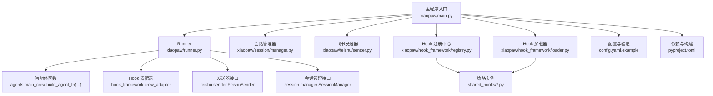
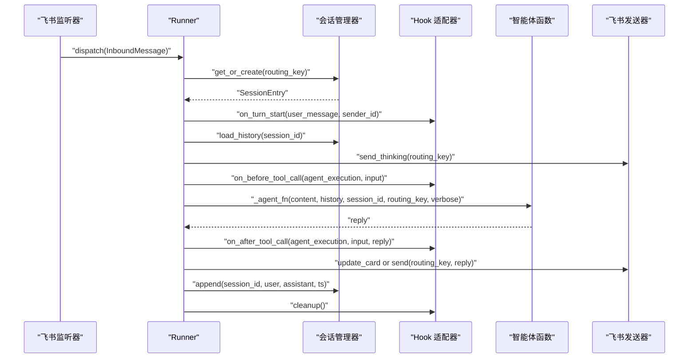
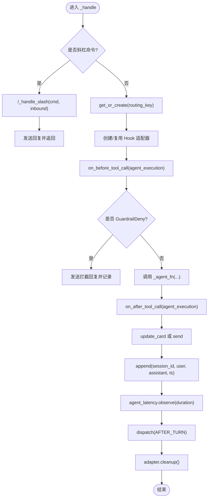
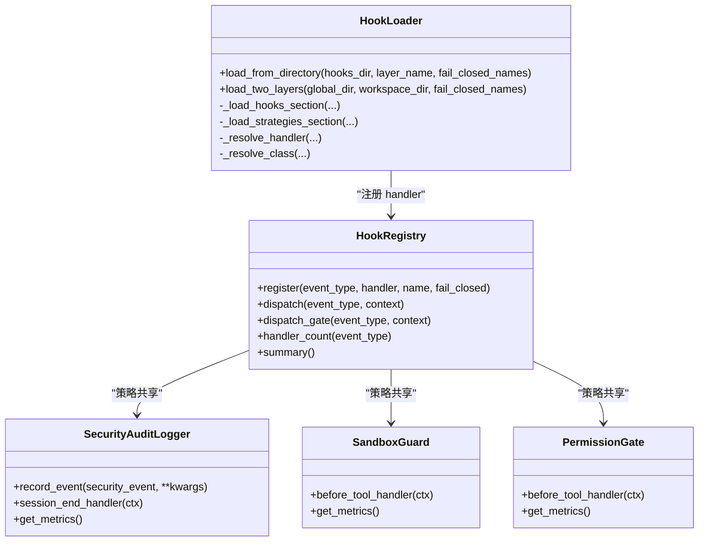
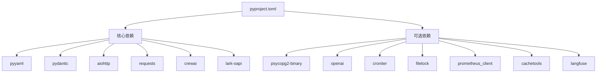

# 核心模块详解

<cite>
**本文档引用的文件**
- [main.py](file://xiaopaw/main.py)
- [runner.py](file://xiaopaw/runner.py)
- [registry.py](file://xiaopaw/hook_framework/registry.py)
- [loader.py](file://xiaopaw/hook_framework/loader.py)
- [manager.py](file://xiaopaw/session/manager.py)
- [sender.py](file://xiaopaw/feishu/sender.py)
- [bootstrap.py](file://xiaopaw/memory/bootstrap.py)
- [hooks.yaml](file://shared_hooks/hooks.yaml)
- [audit_logger.py](file://shared_hooks/audit_logger.py)
- [langfuse_trace.py](file://shared_hooks/langfuse_trace.py)
- [sandbox_guard.py](file://shared_hooks/sandbox_guard.py)
- [permission_gate.py](file://shared_hooks/permission_gate.py)
- [config.yaml.example](file://config.yaml.example)
- [pyproject.toml](file://pyproject.toml)
</cite>

## 目录
1. [引言](#引言)
2. [项目结构](#项目结构)
3. [核心组件](#核心组件)
4. [架构总览](#架构总览)
5. [详细组件分析](#详细组件分析)
6. [依赖分析](#依赖分析)
7. [性能考虑](#性能考虑)
8. [故障排除指南](#故障排除指南)
9. [结论](#结论)
10. [附录](#附录)

## 引言
本文件面向 XiaoPaw v2 的核心模块，系统化梳理主程序入口、Hook 框架、飞书集成、智能体执行引擎、会话管理、内存与工作区、观测性系统等关键子系统。文档以“代码级映射”的方式呈现模块间的交互关系，辅以流程图与序列图，帮助初学者快速上手，同时为资深开发者提供足够的技术深度与实操指引。

## 项目结构
XiaoPaw v2 采用“功能域 + 层次化”组织方式：
- xiaopaw/：核心业务逻辑与服务
  - main.py：应用入口，负责配置加载、组件装配、服务启动与优雅停机
  - runner.py：消息路由与执行编排，串接会话、发送器、Hook 与智能体
  - hook_framework/：Hook 事件分发与策略加载
  - session/：会话生命周期与历史存储
  - feishu/：飞书消息发送与监听
  - memory/：工作区引导提示构建
  - observability/：指标、日志、安全与追踪
  - agents/、skills/、tools/：智能体与技能生态
- shared_hooks/：全局安全与观测策略
- tests/、docs/：测试与文档
- 配置与构建：config.yaml.example、pyproject.toml

图表来源
- [main.py:18-218](file://xiaopaw/main.py#L18-L218)
- [runner.py:33-335](file://xiaopaw/runner.py#L33-L335)
- [registry.py:118-209](file://xiaopaw/hook_framework/registry.py#L118-L209)
- [loader.py:29-246](file://xiaopaw/hook_framework/loader.py#L29-L246)
- [manager.py:38-183](file://xiaopaw/session/manager.py#L38-L183)
- [sender.py:18-149](file://xiaopaw/feishu/sender.py#L18-L149)
- [config.yaml.example:1-90](file://config.yaml.example#L1-L90)
- [pyproject.toml:1-63](file://pyproject.toml#L1-L63)

章节来源
- [main.py:18-218](file://xiaopaw/main.py#L18-L218)
- [config.yaml.example:1-90](file://config.yaml.example#L1-L90)
- [pyproject.toml:1-63](file://pyproject.toml#L1-L63)

## 核心组件
- 主程序入口：负责配置加载、日志初始化、组件装配、服务启动与优雅停机
- Runner：按 routing_key 的串行队列处理器，贯穿 Hook 生命周期与智能体执行
- Hook 框架：事件类型、上下文、注册中心与两套分发机制（观测/策略）
- 会话管理：索引与 JSONL 历史存储，支持并发锁与 LRU 锁缓存
- 飞书集成：消息发送、思考卡片、速率限制与重试
- 观测性：结构化日志、Langfuse 全链路追踪、指标与安全审计
- 安全策略：沙箱守卫、权限网关、成本守卫、环路检测、重试追踪
- 工作区引导：从 workspace-init 与 workspace 目录构建智能体背景

章节来源
- [main.py:18-218](file://xiaopaw/main.py#L18-L218)
- [runner.py:33-335](file://xiaopaw/runner.py#L33-L335)
- [registry.py:28-209](file://xiaopaw/hook_framework/registry.py#L28-L209)
- [loader.py:29-246](file://xiaopaw/hook_framework/loader.py#L29-L246)
- [manager.py:38-183](file://xiaopaw/session/manager.py#L38-L183)
- [sender.py:18-149](file://xiaopaw/feishu/sender.py#L18-L149)
- [hooks.yaml:1-73](file://shared_hooks/hooks.yaml#L1-L73)

## 架构总览
XiaoPaw v2 的核心控制流如下：
- 入口加载配置与日志，初始化会话管理、发送器、Hook 注册中心与 Runner
- 启动指标服务器、定时任务、清理服务、可选的 TestAPI
- 生产环境启动飞书监听器，消费消息并交由 Runner 分发
- Runner 为每个 routing_key 维护独立队列与 worker，串行处理消息
- 每轮对话触发 Hook 事件：BEFORE_TURN → BEFORE_LLM → BEFORE_TOOL_CALL → AFTER_TOOL_CALL → AFTER_TURN
- Hook 适配器在智能体内部传播，确保子 Crew 与工具调用均纳入观测与策略

图表来源
- [runner.py:60-282](file://xiaopaw/runner.py#L60-L282)
- [manager.py:70-131](file://xiaopaw/session/manager.py#L70-L131)
- [sender.py:43-71](file://xiaopaw/feishu/sender.py#L43-L71)
- [registry.py:153-198](file://xiaopaw/hook_framework/registry.py#L153-L198)

## 详细组件分析

### 主程序入口（xiaopaw/main.py）
- 职责
  - 读取配置文件与环境变量，准备 data_dir 与 logs 目录
  - 初始化结构化日志与生产安全断言
  - 装配并启动：会话管理器、发送器（飞书或捕获）、智能体工厂、Hook 框架、Runner
  - 启动指标服务器、定时任务、清理服务、可选 TestAPI
  - 启动飞书监听器（生产环境）或捕获发送器（开发）
  - 信号处理与优雅停机
- 关键配置项
  - workspace、data_dir、feishu.*、agent.*、sandbox.*、memory.*、session.*、runner.*、sender.*、debug.*、observability.*、rate_limit.*、replay_cache.*、cron.*、cleanup.*、feature_flags.*

章节来源
- [main.py:18-218](file://xiaopaw/main.py#L18-L218)
- [config.yaml.example:1-90](file://config.yaml.example#L1-L90)

### Runner（消息路由与执行编排）
- 职责
  - 按 routing_key 维护有界队列与 worker，空闲超时退出，保证串行处理
  - 处理斜杠命令（/new、/help、/status、/verbose）
  - 与 Hook 适配器协作，触发 TURN 生命周期事件
  - 预飞行安全检查：在工具调用前对“agent_execution”进行前置拦截
  - 发送思考卡片、更新卡片或发送文本
  - 记录会话历史、上报指标、处理 GuardrailDeny 与异常
  - 会话结束清理：触发 SESSION_END，确保 Langfuse flush
- 关键接口
  - dispatch(inbound)：入队并启动 worker
  - _handle(inbound)：完整处理流程
  - shutdown()：取消所有 worker 与待决任务
- 参数与返回
  - 构造参数：session_mgr, sender, agent_fn, idle_timeout, max_queue_size, data_dir, hook_registry
  - 返回：None（异步）

图表来源
- [runner.py:109-282](file://xiaopaw/runner.py#L109-L282)

章节来源
- [runner.py:33-335](file://xiaopaw/runner.py#L33-L335)

### Hook 框架（事件分发与策略加载）
- Hook 注册中心（registry.py）
  - 事件类型：BEFORE_TURN、BEFORE_LLM、BEFORE_TOOL_CALL、AFTER_TOOL_CALL、AFTER_TURN、TASK_COMPLETE、SESSION_END
  - 上下文：冻结不可变，tool_input 与 metadata 为只读代理
  - 两套分发：
    - dispatch：观测层（报警器），吞掉异常，不影响业务
    - dispatch_gate：策略层（保险丝），仅 GuardrailDeny 可穿透，异常可转为 GuardrailDeny（fail-closed）
  - 异常：GuardrailDeny（携带原因码与详情）
- Hook 加载器（loader.py）
  - 两层加载：shared_hooks（全局）与 workspace/hooks（用户层）
  - YAML 结构：hooks（观测）与 strategies（策略）
  - 依赖注入：strategies 支持 deps，按声明顺序实例化
  - 安全约束：观测段必须先于策略段，以确保 deny 时仍有完整观测记录

图表来源
- [registry.py:118-209](file://xiaopaw/hook_framework/registry.py#L118-L209)
- [loader.py:29-246](file://xiaopaw/hook_framework/loader.py#L29-L246)
- [audit_logger.py:30-90](file://shared_hooks/audit_logger.py#L30-L90)
- [sandbox_guard.py:93-168](file://shared_hooks/sandbox_guard.py#L93-L168)
- [permission_gate.py:32-107](file://shared_hooks/permission_gate.py#L32-L107)

章节来源
- [registry.py:28-209](file://xiaopaw/hook_framework/registry.py#L28-L209)
- [loader.py:29-246](file://xiaopaw/hook_framework/loader.py#L29-L246)
- [hooks.yaml:1-73](file://shared_hooks/hooks.yaml#L1-L73)

### 会话管理系统（session/manager.py）
- 职责
  - 索引 index.json：按 routing_key 管理 active_session_id 与会话列表
  - 历史存储：每个会话一个 .jsonl 文件，按时间戳与角色存储消息
  - 并发控制：索引锁 + LRU 锁缓存（按 session_id），避免竞态
  - 查询与更新：加载历史、追加消息、更新 verbose、查询当前会话信息
- 关键接口
  - get_or_create(routing_key)、create_new_session(routing_key)
  - load_history(session_id, max_turns)
  - append(session_id, user, assistant, ts)
  - update_verbose(routing_key, verbose)
  - get_session_info(routing_key)

章节来源
- [manager.py:38-183](file://xiaopaw/session/manager.py#L38-L183)

### 飞书集成（feishu/sender.py）
- 职责
  - 通过 lark-oapi 发送消息（interactive 卡片与 text 文本）
  - 支持并发限流（Semaphore）、重试与退避、速率限制识别与指标上报
  - 支持发送思考卡片与更新卡片
- 关键接口
  - send(routing_key, content) → 卡片消息
  - send_thinking(routing_key, text) → 思考中卡片
  - update_card(card_msg_id, content) → 更新卡片
  - send_text(routing_key, text) → 纯文本
- 速率限制
  - 识别特定错误码与 HTTP 429，记录指标并按退避策略重试

章节来源
- [sender.py:18-149](file://xiaopaw/feishu/sender.py#L18-L149)

### 观测性系统（shared_hooks/*）
- 结构化日志与 Langfuse 全链路追踪
  - 事件映射：BEFORE_TURN/BEFORE_LLM/BEFORE_TOOL_CALL/AFTER_TOOL_CALL/AFTER_TURN/TASK_COMPLETE/SESSION_END
  - 五大机制：同会话同 trace、子 Crew 自动挂父 trace、Span 栈管理、Generation 先写后更新、强制 flush
  - trace_id 绑定 session_id，跨轮对话合并为一棵树
- 安全审计（audit_logger.py）
  - 追加式 JSONL 审计日志，支持会话级摘要
  - 多策略共享实例，统一事件入口
- 安全策略
  - 沙箱守卫（sandbox_guard.py）：路径穿越、危险命令、Shell 注入、Prompt 注入检测，fail_closed
  - 权限网关（permission_gate.py）：工具权限矩阵（deny/warn/allow），默认 deny/warn
  - 成本守卫、环路检测、重试追踪（在 hooks.yaml 中声明）

章节来源
- [langfuse_trace.py:1-800](file://shared_hooks/langfuse_trace.py#L1-L800)
- [audit_logger.py:30-90](file://shared_hooks/audit_logger.py#L30-L90)
- [sandbox_guard.py:93-168](file://shared_hooks/sandbox_guard.py#L93-L168)
- [permission_gate.py:32-107](file://shared_hooks/permission_gate.py#L32-L107)
- [hooks.yaml:1-73](file://shared_hooks/hooks.yaml#L1-L73)

### 内存与工作区引导（memory/bootstrap.py）
- 职责
  - 从 workspace-init 与 workspace 目录读取 soul、user、agent、memory 等 Markdown 片段
  - memory.md 有硬限制，超过行数截断并警告
  - 拼装为引导提示，供智能体初始化使用

章节来源
- [bootstrap.py:20-37](file://xiaopaw/memory/bootstrap.py#L20-L37)

## 依赖分析
- 运行时依赖
  - Python ≥ 3.11
  - 核心：pyyaml、pydantic、aiohttp、requests、crewai、lark-oapi
  - 可选：psycopg2-binary、openai、croniter、filelock、prometheus_client、cachetools、langfuse
- 测试与覆盖率
  - pytest、pytest-asyncio、pytest-cov、覆盖率源包含 xiaopaw 与 shared_hooks

图表来源
- [pyproject.toml:6-31](file://pyproject.toml#L6-L31)

章节来源
- [pyproject.toml:1-63](file://pyproject.toml#L1-L63)

## 性能考虑
- Runner 队列与空闲超时：避免僵尸 worker 占用资源
- 会话锁 LRU 缓存：限制活跃会话数量，降低锁竞争
- 发送器并发与退避：平衡吞吐与平台限流
- Hook 事件批处理与 flush：Langfuse 批量提交，减少网络往返
- 预飞行安全检查：在工具调用前拦截，避免浪费算力

## 故障排除指南
- 飞书发送失败
  - 检查速率限制错误码与 HTTP 429，确认重试与退避配置
  - 确认 app_id/app_secret 与聊天类型映射
- Hook 策略拦截
  - GuardrailDeny 会阻止工具执行，查看 deny_reason 与 deny_detail
  - 沙箱守卫：路径穿越、危险命令、Shell 注入、Prompt 注入
  - 权限网关：工具权限矩阵与默认策略
- 会话历史缺失
  - 确认 append 是否成功写入 .jsonl，检查索引保存与 active_session_id
- Langfuse 无数据
  - 确认环境变量与客户端初始化，检查 flush 时机与 batch 提交
- 启动失败
  - 检查配置文件路径与环境变量，确认 data_dir 与 workspace 目录权限

章节来源
- [runner.py:222-267](file://xiaopaw/runner.py#L222-L267)
- [sender.py:14-16](file://xiaopaw/feishu/sender.py#L14-L16)
- [sandbox_guard.py:109-146](file://shared_hooks/sandbox_guard.py#L109-L146)
- [permission_gate.py:57-94](file://shared_hooks/permission_gate.py#L57-L94)
- [langfuse_trace.py:60-100](file://shared_hooks/langfuse_trace.py#L60-L100)

## 结论
XiaoPaw v2 通过清晰的模块边界与 Hook 事件体系，实现了“可观测 + 安全 + 可扩展”的智能体工作台。主程序入口负责装配与生命周期管理，Runner 串联会话、Hook 与智能体，飞书集成提供稳定的消息通道，观测性与安全策略以插件化方式接入，既满足生产可用性，又便于持续演进。

## 附录
- 配置参考：见 config.yaml.example 的各段落说明
- 依赖清单：见 pyproject.toml 的依赖与可选依赖

章节来源
- [config.yaml.example:1-90](file://config.yaml.example#L1-L90)
- [pyproject.toml:1-63](file://pyproject.toml#L1-L63)