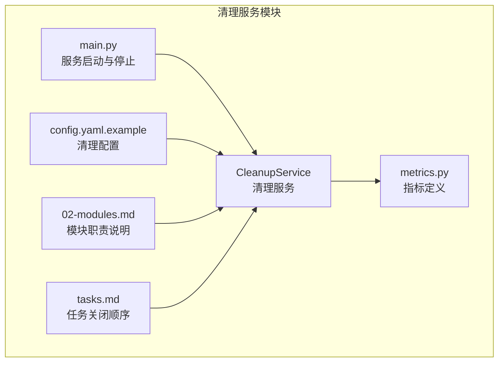
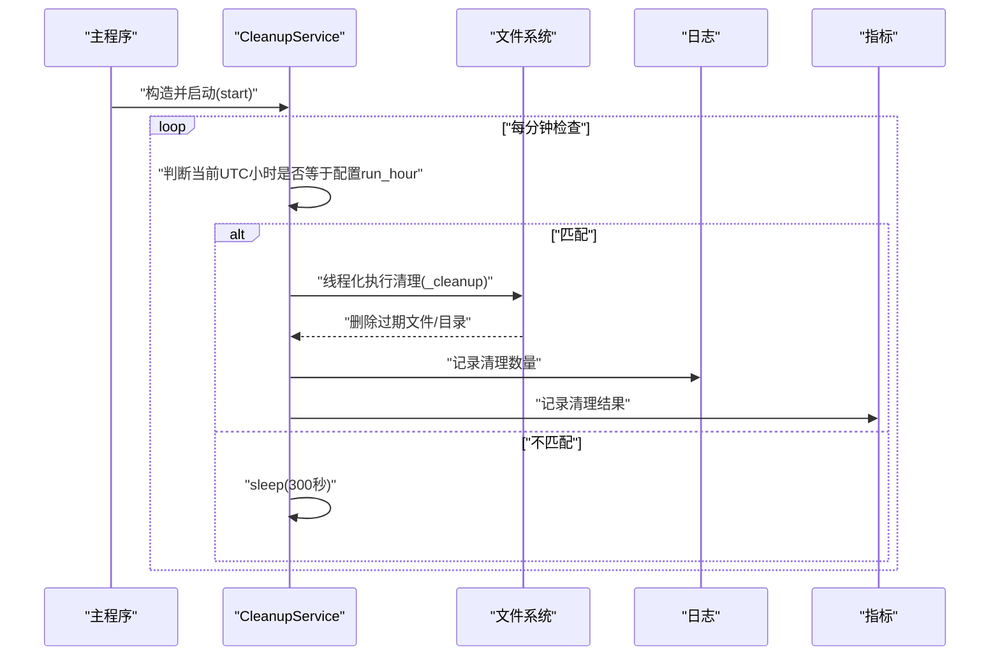
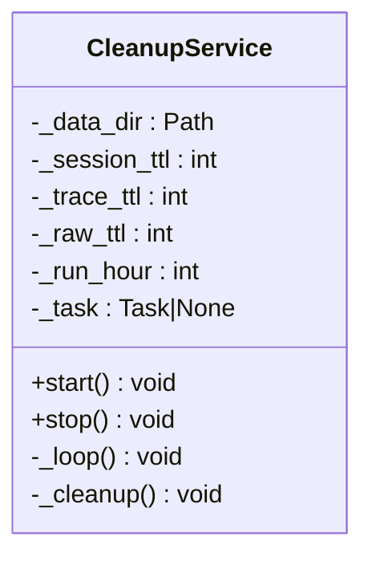
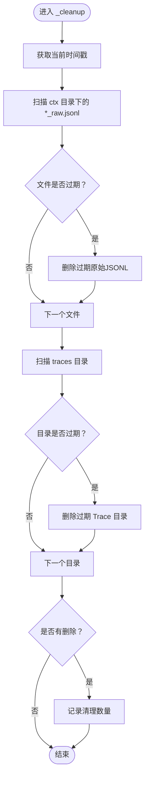
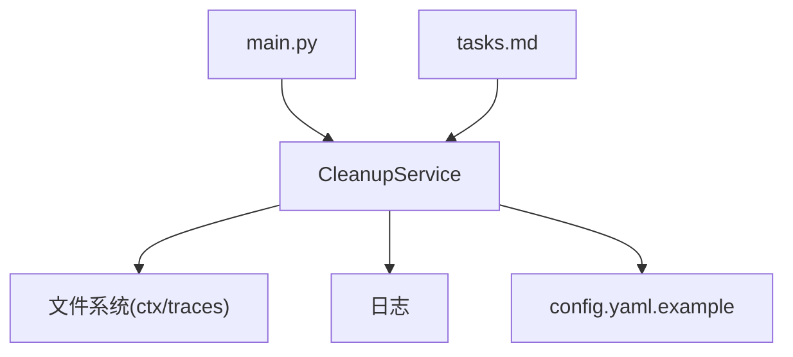

# 清理服务模块

<cite>
**本文引用的文件列表**
- [service.py](file://xiaopaw/cleanup/service.py)
- [config.yaml.example](file://config.yaml.example)
- [main.py](file://xiaopaw/main.py)
- [metrics.py](file://xiaopaw/observability/metrics.py)
- [02-modules.md](file://docs/02-modules.md)
- [tasks.md](file://docs/ssot/tasks.md)
- [manager.py](file://xiaopaw/session/manager.py)
- [models.py](file://xiaopaw/session/models.py)
</cite>

## 目录
1. [简介](#简介)
2. [项目结构](#项目结构)
3. [核心组件](#核心组件)
4. [架构总览](#架构总览)
5. [详细组件分析](#详细组件分析)
6. [依赖关系分析](#依赖关系分析)
7. [性能考量](#性能考量)
8. [故障排查指南](#故障排查指南)
9. [结论](#结论)
10. [附录](#附录)

## 简介
本文件面向 XiaoPaw v2 的清理服务模块，系统性阐述 CleanupService 的实现细节、自动清理策略与生命周期管理，覆盖会话、Trace 与原始数据的清理规则与时间窗口，并解释清理任务的调度、执行与监控机制。同时提供配置与执行过程的参考路径，以及数据保留策略、存储优化与资源回收的实现方式，并给出常见清理问题的诊断与解决方案。

## 项目结构
清理服务位于 xiaopaw/cleanup/service.py，负责按 UTC 小时窗口触发清理，删除过期的原始 JSONL 日志与 Trace 目录，释放磁盘空间并维持运行环境整洁。



图表来源
- [service.py:1-77](file://xiaopaw/cleanup/service.py#L1-L77)
- [config.yaml.example:73-78](file://config.yaml.example#L73-L78)
- [main.py:141-150](file://xiaopaw/main.py#L141-L150)
- [metrics.py:1-65](file://xiaopaw/observability/metrics.py#L1-L65)
- [02-modules.md:1264-1272](file://docs/02-modules.md#L1264-L1272)
- [tasks.md:87-87](file://docs/ssot/tasks.md#L87-L87)

章节来源
- [service.py:1-77](file://xiaopaw/cleanup/service.py#L1-L77)
- [config.yaml.example:73-78](file://config.yaml.example#L73-L78)
- [main.py:141-150](file://xiaopaw/main.py#L141-L150)
- [02-modules.md:1264-1272](file://docs/02-modules.md#L1264-L1272)
- [tasks.md:87-87](file://docs/ssot/tasks.md#L87-L87)

## 核心组件
- CleanupService：按 UTC 小时窗口触发清理，删除过期的原始 JSONL 与 Trace 目录。
- 配置项：来自 config.yaml.example 的 cleanup 段，包含是否启用、TTL 天数与 UTC 运行小时。
- 启停集成：在主程序启动时创建并启动，在优雅停机时停止。
- 指标与日志：记录清理结果与异常，便于监控与排障。

章节来源
- [service.py:14-77](file://xiaopaw/cleanup/service.py#L14-L77)
- [config.yaml.example:73-78](file://config.yaml.example#L73-L78)
- [main.py:141-150](file://xiaopaw/main.py#L141-L150)
- [metrics.py:1-65](file://xiaopaw/observability/metrics.py#L1-L65)

## 架构总览
清理服务在主进程中作为后台任务运行，遵循“UTC 小时窗口 + 线程化执行”的模式，避免阻塞事件循环。其清理范围限定于 data_dir 下的 ctx 与 traces 两个子目录。



图表来源
- [service.py:30-52](file://xiaopaw/cleanup/service.py#L30-L52)
- [service.py:54-77](file://xiaopaw/cleanup/service.py#L54-L77)
- [metrics.py:1-65](file://xiaopaw/observability/metrics.py#L1-L65)

## 详细组件分析

### CleanupService 类设计
- 职责：按配置的 UTC 小时窗口触发清理，删除过期的原始 JSONL 与 Trace 目录。
- 关键字段：
  - data_dir：数据根目录
  - session_ttl、trace_ttl、raw_ttl：TTL 秒数
  - run_hour：UTC 运行小时
  - task：后台清理任务
- 方法：
  - start/stop：启动与停止后台循环
  - _loop：每分钟检查一次，匹配 run_hour 后执行清理
  - _cleanup：线程化执行，遍历 ctx 与 traces，删除过期项



图表来源
- [service.py:14-77](file://xiaopaw/cleanup/service.py#L14-L77)

章节来源
- [service.py:14-77](file://xiaopaw/cleanup/service.py#L14-L77)

### 清理策略与时间窗口
- 原始 JSONL（ctx 目录）：按文件的最后修改时间与 raw_ttl 比较，超过 TTL 即删除。
- Trace 目录（traces 目录）：按目录的最后修改时间与 trace_ttl 比较，超过 TTL 即递归删除。
- UTC 小时窗口：仅在 run_hour UTC 时执行清理，其余时间 sleep(300)。
- 线程化执行：使用 asyncio.to_thread 将 CPU 密集的文件遍历与删除放入线程池，避免阻塞事件循环。



图表来源
- [service.py:54-77](file://xiaopaw/cleanup/service.py#L54-L77)

章节来源
- [service.py:54-77](file://xiaopaw/cleanup/service.py#L54-L77)

### 生命周期管理与优雅停机
- 启动：主程序在加载配置后创建 CleanupService 并调用 start。
- 停止：主程序收到信号后，按任务关闭顺序依次停止各服务，其中 CleanupService 在 CronService 之后停止。
- 异常处理：清理过程中捕获异常并记录日志，避免影响主流程。

```mermaid
sequenceDiagram
participant Main as "主程序"
participant CS as "CleanupService"
participant Loop as "_loop"
participant Exec as "_cleanup"
Main->>CS : "start()"
CS->>Loop : "创建后台任务"
loop "每分钟"
Loop->>Loop : "检查UTC小时"
alt "匹配run_hour"
Loop->>Exec : "线程化执行"
Exec-->>Loop : "完成/异常被捕获"
else "不匹配"
Loop->>Loop : "sleep(300)"
end
end
Main->>CS : "stop()"
CS->>Loop : "取消任务并等待"
```

图表来源
- [main.py:141-150](file://xiaopaw/main.py#L141-L150)
- [main.py:206-207](file://xiaopaw/main.py#L206-L207)
- [service.py:30-52](file://xiaopaw/cleanup/service.py#L30-L52)

章节来源
- [main.py:141-150](file://xiaopaw/main.py#L141-L150)
- [main.py:206-207](file://xiaopaw/main.py#L206-L207)
- [tasks.md:87-87](file://docs/ssot/tasks.md#L87-L87)
- [service.py:30-52](file://xiaopaw/cleanup/service.py#L30-L52)

### 配置与执行过程示例（参考路径）
- 配置项位置：config.yaml.example 中的 cleanup 段，包含 enabled、session_ttl_days、trace_ttl_days、raw_ttl_days、run_hour_utc。
- 启动集成：main.py 中根据配置创建 CleanupService 并在条件满足时启动。
- 执行时机：仅在 UTC run_hour 时执行清理，其余时间休眠。

章节来源
- [config.yaml.example:73-78](file://config.yaml.example#L73-L78)
- [main.py:141-150](file://xiaopaw/main.py#L141-L150)
- [service.py:42-52](file://xiaopaw/cleanup/service.py#L42-L52)

### 数据保留策略与存储优化
- 原始 JSONL：按 raw_ttl 删除，适合短期调试与审计需求。
- Trace 目录：按 trace_ttl 删除，适合短期可观测性保留。
- 存储优化：清理采用线程化执行，避免阻塞事件循环；删除操作为文件/目录级，减少 IO 压力。
- 资源回收：通过 TTL 控制磁盘占用，防止长期运行导致的空间耗尽。

章节来源
- [service.py:54-77](file://xiaopaw/cleanup/service.py#L54-L77)
- [config.yaml.example:73-78](file://config.yaml.example#L73-L78)

## 依赖关系分析
- CleanupService 依赖：
  - 文件系统：ctx 与 traces 目录的遍历与删除
  - 日志：记录清理数量与异常
  - 配置：来自 config.yaml.example 的 cleanup 段
  - 主程序：在启动/停止阶段创建与销毁
  - 任务关闭顺序：在 CronService 之后停止



图表来源
- [service.py:1-77](file://xiaopaw/cleanup/service.py#L1-L77)
- [config.yaml.example:73-78](file://config.yaml.example#L73-L78)
- [main.py:141-150](file://xiaopaw/main.py#L141-L150)
- [tasks.md:87-87](file://docs/ssot/tasks.md#L87-L87)

章节来源
- [service.py:1-77](file://xiaopaw/cleanup/service.py#L1-L77)
- [config.yaml.example:73-78](file://config.yaml.example#L73-L78)
- [main.py:141-150](file://xiaopaw/main.py#L141-L150)
- [tasks.md:87-87](file://docs/ssot/tasks.md#L87-L87)

## 性能考量
- 清理频率：每分钟检查一次，仅在 UTC run_hour 执行实际清理，降低对运行时的影响。
- 线程化执行：将文件遍历与删除放入线程池，避免阻塞事件循环。
- 时间复杂度：遍历 ctx 与 traces 的复杂度近似 O(N)，N 为文件/目录数量，受 TTL 与数据规模影响。
- I/O 优化：批量删除，减少系统调用次数；删除后记录清理数量，便于监控。

## 故障排查指南
- 清理未执行
  - 检查 run_hour 是否为 UTC 当前小时；否则需等待至该小时。
  - 检查配置中的 cleanup.enabled 与 run_hour_utc。
- 清理失败
  - 查看日志中“cleanup failed”异常堆栈，定位具体文件或权限问题。
  - 确认 ctx 与 traces 目录存在且可访问。
- 存储空间不足
  - 调整 raw_ttl 与 trace_ttl，缩短保留周期。
  - 检查是否存在大量过期文件未被删除（权限/锁定问题）。
- 数据误删
  - 确保清理范围仅限于 ctx 与 traces，不涉及会话索引文件。
  - 如需清理会话，请使用专门的会话管理能力（见会话模块）。
- 会话与 Trace 的关系
  - 会话管理（SessionManager）与清理服务（CleanupService）职责分离：前者负责会话索引与消息持久化，后者负责 ctx 与 traces 的过期清理。

章节来源
- [service.py:42-52](file://xiaopaw/cleanup/service.py#L42-L52)
- [service.py:54-77](file://xiaopaw/cleanup/service.py#L54-L77)
- [config.yaml.example:73-78](file://config.yaml.example#L73-L78)
- [manager.py:38-183](file://xiaopaw/session/manager.py#L38-L183)
- [models.py:18-38](file://xiaopaw/session/models.py#L18-L38)

## 结论
CleanupService 通过“UTC 小时窗口 + 线程化执行”的方式，对 ctx 与 traces 的过期数据进行自动化清理，有效控制磁盘占用并保障运行稳定性。结合配置化的 TTL 与运行小时，可在保证可观测性的前提下实现资源回收与存储优化。建议在生产环境中合理设置 TTL 与运行小时，并配合日志与指标进行持续监控。

## 附录
- 会话模块（SessionManager）：负责会话索引与消息持久化，清理服务不直接清理会话文件。
- Trace 模块：清理服务删除过期 Trace 目录，不影响 Trace 的生成与记录逻辑。
- 指标与日志：清理服务记录清理数量与异常，便于监控与排障。

章节来源
- [manager.py:38-183](file://xiaopaw/session/manager.py#L38-L183)
- [models.py:18-38](file://xiaopaw/session/models.py#L18-L38)
- [service.py:54-77](file://xiaopaw/cleanup/service.py#L54-L77)
- [metrics.py:1-65](file://xiaopaw/observability/metrics.py#L1-L65)