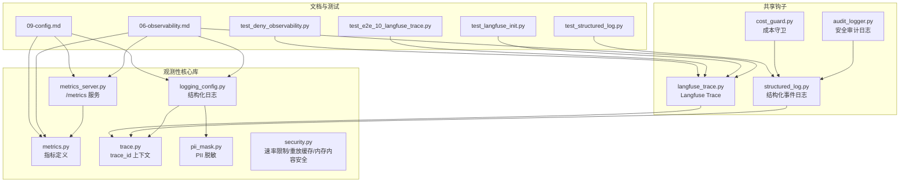
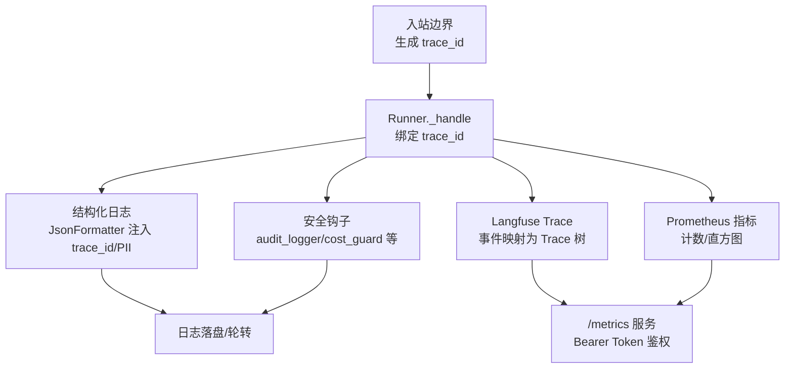
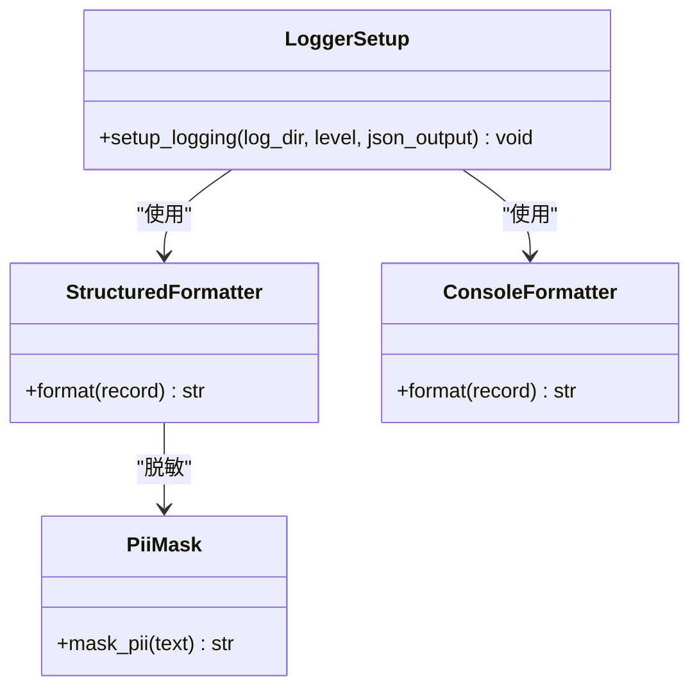
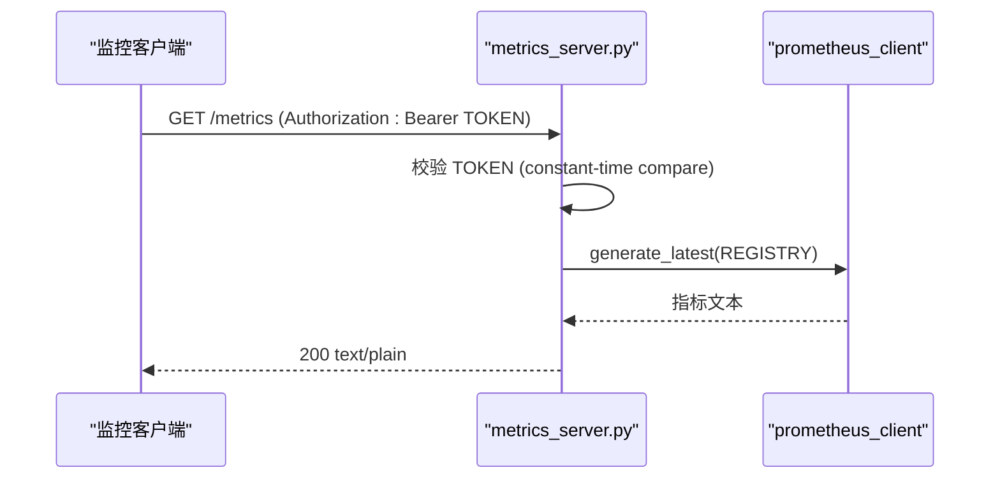
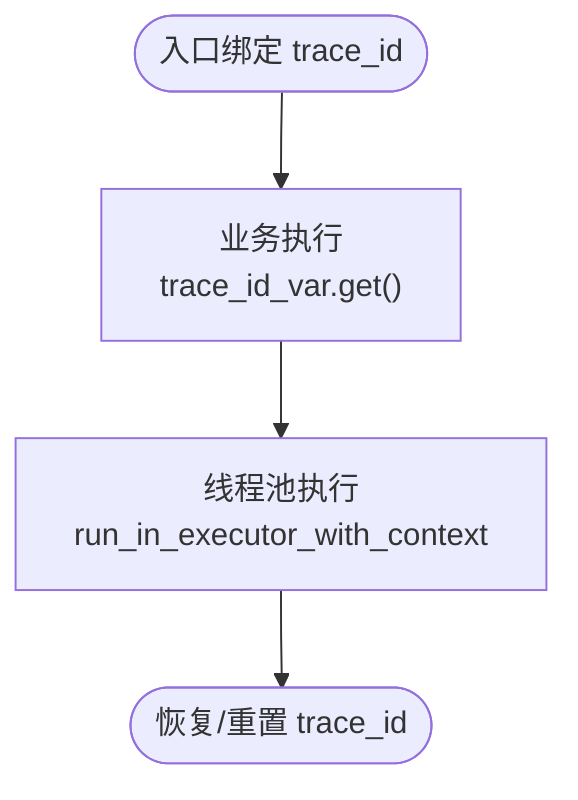
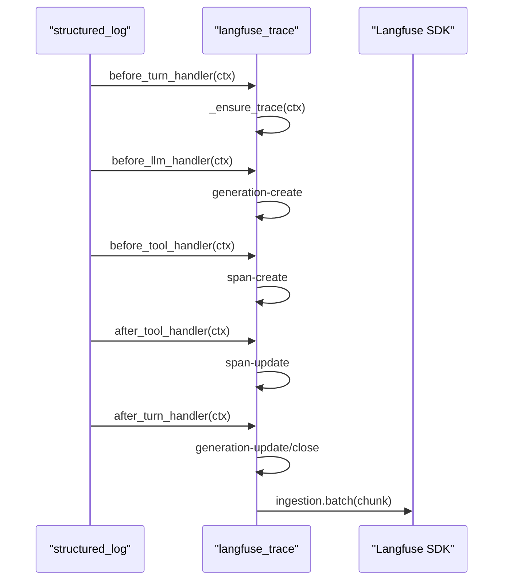
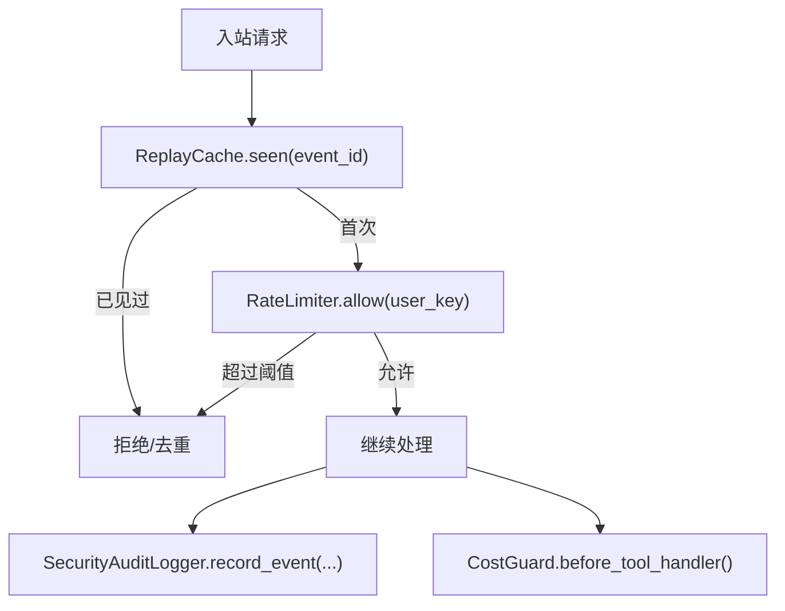
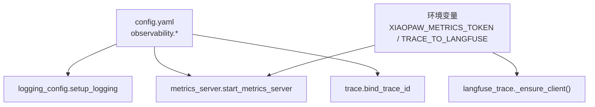
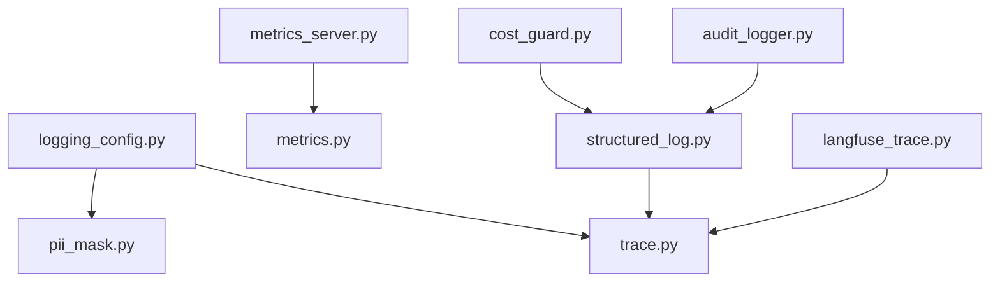

# 观测性系统

<cite>
**本文引用的文件**
- [logging_config.py](file://xiaopaw/observability/logging_config.py)
- [metrics.py](file://xiaopaw/observability/metrics.py)
- [metrics_server.py](file://xiaopaw/observability/metrics_server.py)
- [trace.py](file://xiaopaw/observability/trace.py)
- [pii_mask.py](file://xiaopaw/observability/pii_mask.py)
- [security.py](file://xiaopaw/observability/security.py)
- [structured_log.py](file://shared_hooks/structured_log.py)
- [langfuse_trace.py](file://shared_hooks/langfuse_trace.py)
- [audit_logger.py](file://shared_hooks/audit_logger.py)
- [cost_guard.py](file://shared_hooks/cost_guard.py)
- [hooks.yaml](file://shared_hooks/hooks.yaml)
- [06-observability.md](file://docs/06-observability.md)
- [09-config.md](file://docs/09-config.md)
- [test_structured_log.py](file://tests/unit/shared_hooks/test_structured_log.py)
- [test_langfuse_init.py](file://tests/unit/shared_hooks/test_langfuse_init.py)
- [test_e2e_10_langfuse_trace.py](file://tests/e2e/test_e2e_10_langfuse_trace.py)
- [test_deny_observability.py](file://tests/integration/test_deny_observability.py)
</cite>

## 目录
1. [简介](#简介)
2. [项目结构](#项目结构)
3. [核心组件](#核心组件)
4. [架构总览](#架构总览)
5. [详细组件分析](#详细组件分析)
6. [依赖分析](#依赖分析)
7. [性能考量](#性能考量)
8. [故障排查指南](#故障排查指南)
9. [结论](#结论)
10. [附录](#附录)

## 简介
本文件面向 XiaoPaw v2 的观测性系统，系统性阐述结构化日志、指标收集、Trace 追踪与 PII 脱敏的实现细节，以及 Langfuse Trace 的集成方式、安全监控策略、日志配置、指标聚合与性能监控的实现方式。文档还提供可操作的配置与使用指引、常见问题与解决方案，帮助开发者与 SRE 快速落地可观测能力。

## 项目结构
XiaoPaw v2 的观测性由“本地化结构化日志 + Prometheus 指标 + Langfuse Trace + 安全审计”四部分组成，分别位于以下位置：
- 观测性核心库：xiaopaw/observability（日志格式化、指标定义、指标 HTTP 服务、Trace 上下文、PII 脱敏、安全工具）
- 共享钩子：shared_hooks（结构化事件日志、Langfuse Trace、安全审计、成本守卫等）
- 文档：docs（设计文档与配置说明）
- 测试：tests（单元与端到端验证）

**图表来源**
- [logging_config.py:1-61](file://xiaopaw/observability/logging_config.py#L1-L61)
- [metrics.py:1-65](file://xiaopaw/observability/metrics.py#L1-L65)
- [metrics_server.py:1-55](file://xiaopaw/observability/metrics_server.py#L1-L55)
- [trace.py:1-34](file://xiaopaw/observability/trace.py#L1-L34)
- [pii_mask.py:1-18](file://xiaopaw/observability/pii_mask.py#L1-L18)
- [security.py:1-73](file://xiaopaw/observability/security.py#L1-L73)
- [structured_log.py:1-97](file://shared_hooks/structured_log.py#L1-L97)
- [langfuse_trace.py:1-800](file://shared_hooks/langfuse_trace.py#L1-L800)
- [audit_logger.py:1-90](file://shared_hooks/audit_logger.py#L1-L90)
- [cost_guard.py:1-100](file://shared_hooks/cost_guard.py#L1-L100)
- [06-observability.md:1-836](file://docs/06-observability.md#L1-L836)
- [09-config.md:81-260](file://docs/09-config.md#L81-L260)

**章节来源**
- [06-observability.md:1-836](file://docs/06-observability.md#L1-L836)
- [09-config.md:81-260](file://docs/09-config.md#L81-L260)

## 核心组件
- 结构化日志：统一 JSON 行日志格式，自动注入 trace_id、PII 脱敏、异常栈、上下文字段，支持控制台与文件落盘。
- Prometheus 指标：定义 8 个核心指标，涵盖入站、LLM 调用、延迟、重试、超时、限流、死信队列等。
- 指标 HTTP 服务：/health 与 /metrics 共用 8090 端口，/metrics 采用 Bearer Token 鉴权。
- Trace 上下文：基于 contextvars 的 trace_id 传播，支持 asyncio.to_thread 与 run_in_executor 的上下文透传。
- PII 脱敏：在 Formatter 层对消息正文进行脱敏，保障日志与 Trace 的合规性。
- 安全工具：速率限制、重放去重、内存内容安全校验、安全审计日志、成本守卫。
- Langfuse Trace：将 Hook 事件映射为 Trace 树，支持 generation 先写后更新、span 栈管理、批量 flush。

**章节来源**
- [logging_config.py:15-61](file://xiaopaw/observability/logging_config.py#L15-L61)
- [metrics.py:8-47](file://xiaopaw/observability/metrics.py#L8-L47)
- [metrics_server.py:18-54](file://xiaopaw/observability/metrics_server.py#L18-L54)
- [trace.py:13-34](file://xiaopaw/observability/trace.py#L13-L34)
- [pii_mask.py:7-17](file://xiaopaw/observability/pii_mask.py#L7-L17)
- [security.py:11-73](file://xiaopaw/observability/security.py#L11-L73)
- [langfuse_trace.py:137-294](file://shared_hooks/langfuse_trace.py#L137-L294)

## 架构总览
XiaoPaw v2 的可观测性遵循“日志/指标/Trace 三支柱”，通过统一 trace_id 贯穿各模块，结合共享钩子在事件边界进行观测与安全控制。

**图表来源**
- [trace.py:18-34](file://xiaopaw/observability/trace.py#L18-L34)
- [logging_config.py:15-28](file://xiaopaw/observability/logging_config.py#L15-L28)
- [metrics.py:8-47](file://xiaopaw/observability/metrics.py#L8-L47)
- [metrics_server.py:40-54](file://xiaopaw/observability/metrics_server.py#L40-L54)
- [langfuse_trace.py:297-710](file://shared_hooks/langfuse_trace.py#L297-L710)
- [hooks.yaml:4-25](file://shared_hooks/hooks.yaml#L4-L25)

## 详细组件分析

### 结构化日志与 PII 脱敏
- 日志格式：JSON 行格式，包含时间戳、级别、logger 名、trace_id、消息、调用者、异常栈等字段。
- PII 脱敏：在 Formatter 层对消息正文进行正则替换，避免手机号、邮箱、身份证号等敏感信息泄露。
- 控制台与文件：支持人类可读控制台输出与 JSON 文件落盘，文件轮转策略可配置。

**图表来源**
- [logging_config.py:15-61](file://xiaopaw/observability/logging_config.py#L15-L61)
- [pii_mask.py:14-17](file://xiaopaw/observability/pii_mask.py#L14-L17)

**章节来源**
- [logging_config.py:15-61](file://xiaopaw/observability/logging_config.py#L15-L61)
- [pii_mask.py:7-17](file://xiaopaw/observability/pii_mask.py#L7-L17)
- [06-observability.md:176-330](file://docs/06-observability.md#L176-L330)

### Prometheus 指标与 /metrics HTTP 服务
- 指标定义：8 个核心指标，覆盖入站、LLM 调用、延迟、重试、超时、限流、死信队列等。
- 指标收集：在关键路径（Runner、LLM 调用、工具执行、Cron）埋点，使用 Counter/Histogram。
- /metrics 服务：统一 8090 端口，/health 无鉴权，/metrics 采用 Bearer Token 鉴权，防时序攻击。

**图表来源**
- [metrics_server.py:22-37](file://xiaopaw/observability/metrics_server.py#L22-L37)
- [metrics.py:8-47](file://xiaopaw/observability/metrics.py#L8-L47)

**章节来源**
- [metrics.py:8-47](file://xiaopaw/observability/metrics.py#L8-L47)
- [metrics_server.py:14-54](file://xiaopaw/observability/metrics_server.py#L14-L54)
- [06-observability.md:526-620](file://docs/06-observability.md#L526-L620)

### Trace 上下文与传播
- trace_id 生成：UUID 截断为 16 字符，冲突概率极低，兼顾可读性与存储效率。
- 上下文传播：使用 contextvars，支持 asyncio.to_thread 自动 copy_context，run_in_executor 需要手动透传。
- 出站透传：在 HTTP 请求头注入 trace_id，便于外部系统关联。

**图表来源**
- [trace.py:18-34](file://xiaopaw/observability/trace.py#L18-L34)

**章节来源**
- [trace.py:13-34](file://xiaopaw/observability/trace.py#L13-L34)
- [06-observability.md:51-173](file://docs/06-observability.md#L51-L173)

### Langfuse Trace 集成
- 事件映射：将 BEFORE_TURN/AFTER_TURN/BEFORE_LLM/BEFORE_TOOL_CALL/AFTER_TOOL_CALL/TASK_COMPLETE 映射为 Trace 树节点。
- 机制要点：多轮同树（session_id 作为 trace_id）、Span 栈管理父子关系、Generation 先写后更新、强制 flush。
- 批量写入：显式批处理，分块发送，失败降级不影响主流程。

**图表来源**
- [langfuse_trace.py:297-710](file://shared_hooks/langfuse_trace.py#L297-L710)
- [structured_log.py:30-96](file://shared_hooks/structured_log.py#L30-L96)

**章节来源**
- [langfuse_trace.py:137-710](file://shared_hooks/langfuse_trace.py#L137-L710)
- [structured_log.py:1-97](file://shared_hooks/structured_log.py#L1-L97)
- [hooks.yaml:4-25](file://shared_hooks/hooks.yaml#L4-L25)

### 安全监控与审计
- 速率限制：基于滑动窗口的 per-user 限流，支持配置每用户每分钟请求数。
- 重放防护：基于 LRU + TTL 的事件 ID 去重缓存，支持并发安全。
- 内容安全：对内存内容长度与关键词进行安全校验。
- 安全审计：append-only JSONL 审计日志，支持会话级摘要聚合，集中记录安全事件。
- 成本守卫：实时 token 成本估算与预算硬停，工具调用前二次校验。

**图表来源**
- [security.py:11-73](file://xiaopaw/observability/security.py#L11-L73)
- [audit_logger.py:41-90](file://shared_hooks/audit_logger.py#L41-L90)
- [cost_guard.py:68-82](file://shared_hooks/cost_guard.py#L68-L82)

**章节来源**
- [security.py:11-73](file://xiaopaw/observability/security.py#L11-L73)
- [audit_logger.py:30-90](file://shared_hooks/audit_logger.py#L30-L90)
- [cost_guard.py:34-100](file://shared_hooks/cost_guard.py#L34-L100)
- [hooks.yaml:27-73](file://shared_hooks/hooks.yaml#L27-L73)

### 配置与使用示例
- 日志与指标：通过配置文件开启日志目录、级别、JSON 输出、指标端口、Trace 采样策略等。
- /metrics 鉴权：设置环境变量 XIAOPAW_METRICS_TOKEN，生产环境强制存在。
- Langfuse 开关：通过环境变量控制是否启用 Langfuse Trace。

**图表来源**
- [09-config.md:191-203](file://docs/09-config.md#L191-L203)
- [metrics_server.py:22-29](file://xiaopaw/observability/metrics_server.py#L22-L29)
- [langfuse_trace.py:38-100](file://shared_hooks/langfuse_trace.py#L38-L100)

**章节来源**
- [09-config.md:191-203](file://docs/09-config.md#L191-L203)
- [metrics_server.py:22-29](file://xiaopaw/observability/metrics_server.py#L22-L29)
- [langfuse_trace.py:38-100](file://shared_hooks/langfuse_trace.py#L38-L100)

## 依赖分析
- 组件耦合：日志与 Trace 通过 trace_id_var 耦合；Langfuse Trace 依赖共享钩子事件；安全审计与成本守卫通过 hooks.yaml 注入。
- 外部依赖：prometheus_client（指标导出）、aiohttp（/metrics 服务）、langfuse SDK（Trace 写入）。
- 循环依赖：观测性模块之间无循环导入，钩子层通过事件解耦。

**图表来源**
- [logging_config.py:11-12](file://xiaopaw/observability/logging_config.py#L11-L12)
- [metrics_server.py:32-35](file://xiaopaw/observability/metrics_server.py#L32-L35)
- [langfuse_trace.py:40-46](file://shared_hooks/langfuse_trace.py#L40-L46)

**章节来源**
- [logging_config.py:11-12](file://xiaopaw/observability/logging_config.py#L11-L12)
- [metrics_server.py:32-35](file://xiaopaw/observability/metrics_server.py#L32-L35)
- [langfuse_trace.py:40-46](file://shared_hooks/langfuse_trace.py#L40-L46)

## 性能考量
- 指标粒度：标签基数严格控制，避免高基数字段进入 label，降低时间序列数量与查询开销。
- 异步落盘：Trace 写盘使用 asyncio.to_thread，避免阻塞事件循环。
- 批量写入：Langfuse 使用显式批处理与分块发送，减少网络往返。
- 采样策略：默认全采样，支持按请求路径与 trace_id hash 采样，满足大规模场景需求。

**章节来源**
- [06-observability.md:333-836](file://docs/06-observability.md#L333-L836)

## 故障排查指南
- /metrics 401 未授权：检查 XIAOPAW_METRICS_TOKEN 是否正确配置，请求头 Authorization 是否为 Bearer TOKEN。
- Langfuse 初始化失败：检查公钥、密钥、基础地址是否配置，日志中是否存在初始化警告。
- Trace 未落盘：确认 observability.trace.enabled 与 sample_rate 设置，检查 data/traces 目录权限。
- 审计日志未写入：确认 SECURITY_AUDIT_FILE 环境变量或构造参数，检查文件权限与磁盘空间。
- 成本守卫提前拒绝：确认 hooks.yaml 中 cost_guard 的执行顺序在 loop_detector 之前，避免预算被低估。

**章节来源**
- [metrics_server.py:22-29](file://xiaopaw/observability/metrics_server.py#L22-L29)
- [test_langfuse_init.py:10-38](file://tests/unit/shared_hooks/test_langfuse_init.py#L10-L38)
- [test_e2e_10_langfuse_trace.py:30-79](file://tests/e2e/test_e2e_10_langfuse_trace.py#L30-L79)
- [test_deny_observability.py:54-110](file://tests/integration/test_deny_observability.py#L54-L110)

## 结论
XiaoPaw v2 的观测性系统以统一 trace_id 为核心，结合结构化日志、Prometheus 指标与 Langfuse Trace，形成完整的“事件-指标-链路”闭环。通过安全钩子与审计日志强化安全治理，配合严格的采样与落盘策略，既满足生产级可观测性需求，又兼顾合规与性能。

## 附录
- 配置参考：见配置文档中的 observability、rate_limit、replay_cache 等段落。
- 测试参考：单元与端到端测试覆盖了结构化日志、Langfuse 初始化、Trace 结构验证与拒绝路径可观测性。

**章节来源**
- [09-config.md:191-217](file://docs/09-config.md#L191-L217)
- [test_structured_log.py:19-114](file://tests/unit/shared_hooks/test_structured_log.py#L19-L114)
- [test_e2e_10_langfuse_trace.py:30-79](file://tests/e2e/test_e2e_10_langfuse_trace.py#L30-L79)
- [test_deny_observability.py:54-216](file://tests/integration/test_deny_observability.py#L54-L216)