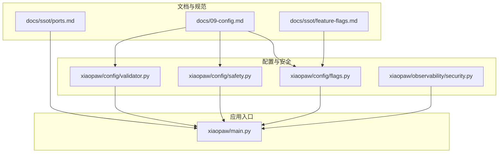
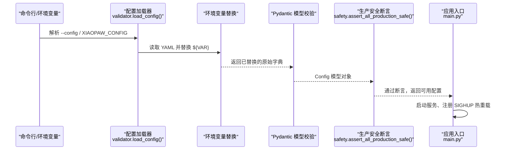
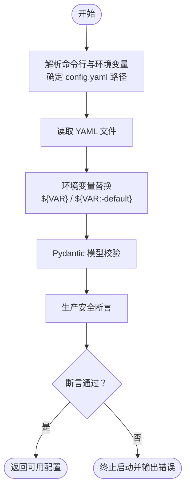
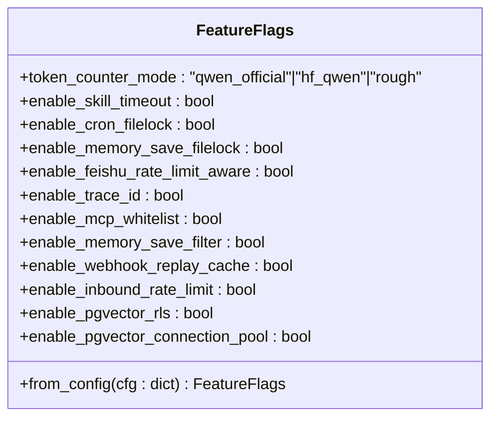
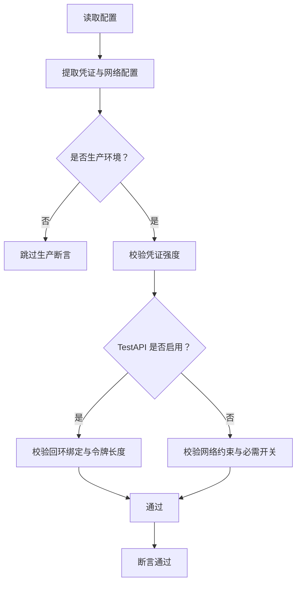
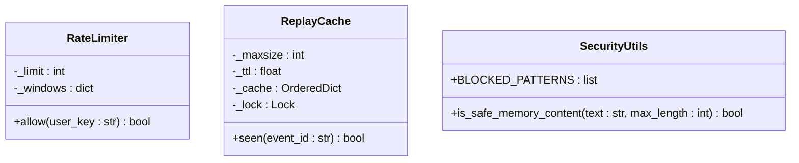
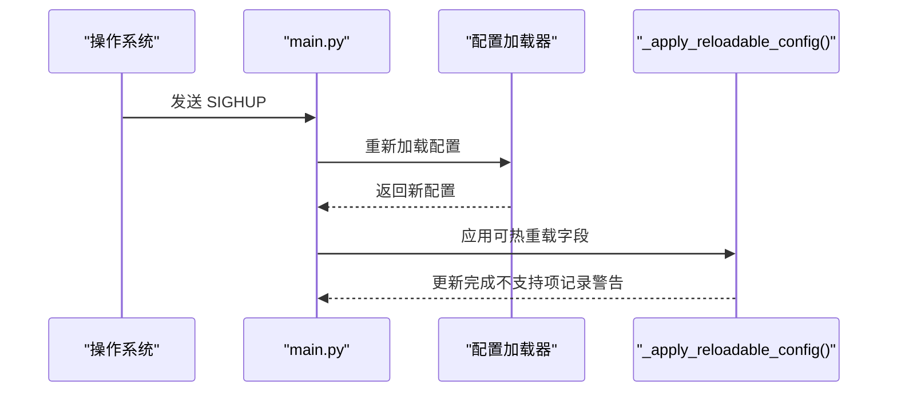
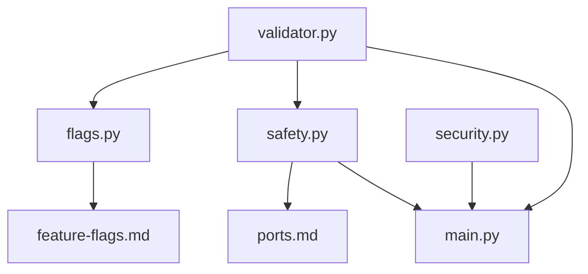

# 配置管理模块

<cite>
**本文档引用的文件**
- [09-config.md](file://docs/09-config.md)
- [feature-flags.md](file://docs/ssot/feature-flags.md)
- [ports.md](file://docs/ssot/ports.md)
- [flags.py](file://xiaopaw/config/flags.py)
- [safety.py](file://xiaopaw/config/safety.py)
- [validator.py](file://xiaopaw/config/validator.py)
- [security.py](file://xiaopaw/observability/security.py)
- [main.py](file://xiaopaw/main.py)
- [config.yaml.example](file://config.yaml.example)
</cite>

## 目录
1. [简介](#简介)
2. [项目结构](#项目结构)
3. [核心组件](#核心组件)
4. [架构总览](#架构总览)
5. [详细组件分析](#详细组件分析)
6. [依赖分析](#依赖分析)
7. [性能考虑](#性能考虑)
8. [故障排查指南](#故障排查指南)
9. [结论](#结论)
10. [附录](#附录)

## 简介
本文件系统化阐述 XiaoPaw v2 的配置管理模块，涵盖配置文件加载、解析与验证流程，FeatureFlags 的注册与运行时控制，以及生产环境的安全检查与凭证管理策略。文档同时给出配置优先级、继承与覆盖规则，并提供热重载机制、常见问题与解决方案，帮助运维与实现工程师在不同环境中正确、安全地部署与调优系统。

## 项目结构
配置管理相关的关键文件与职责如下：
- 文档与规范
  - docs/09-config.md：配置分层、优先级、FeatureFlags 注册表、启动校验、热重载与变更管理等权威说明
  - docs/ssot/feature-flags.md：FeatureFlags 的权威清单、启动校验约束、指标暴露与测试锚点
  - docs/ssot/ports.md：端口清单与路由划分，支撑安全边界与生产暴露策略
- 配置加载与验证
  - xiaopaw/config/validator.py：Pydantic 模型定义与配置加载函数
  - xiaopaw/config/safety.py：生产环境安全断言与弱凭证检测
  - xiaopaw/config/flags.py：FeatureFlags 数据类与未知字段拒绝逻辑
- 运行时安全与可观测性
  - xiaopaw/observability/security.py：速率限制、内存内容安全过滤、事件去重缓存
- 应用入口
  - xiaopaw/main.py：配置加载、服务启动、热重载信号处理

**图表来源**
- [09-config.md:35-80](file://docs/09-config.md#L35-L80)
- [feature-flags.md:67-107](file://docs/ssot/feature-flags.md#L67-L107)
- [ports.md:1-122](file://docs/ssot/ports.md#L1-L122)
- [validator.py:1-122](file://xiaopaw/config/validator.py#L1-L122)
- [safety.py:1-48](file://xiaopaw/config/safety.py#L1-L48)
- [flags.py:1-23](file://xiaopaw/config/flags.py#L1-L23)
- [security.py:1-73](file://xiaopaw/observability/security.py#L1-L73)
- [main.py:60-218](file://xiaopaw/main.py#L60-L218)

**章节来源**
- [09-config.md:35-80](file://docs/09-config.md#L35-L80)
- [validator.py:1-122](file://xiaopaw/config/validator.py#L1-L122)
- [safety.py:1-48](file://xiaopaw/config/safety.py#L1-L48)
- [flags.py:1-23](file://xiaopaw/config/flags.py#L1-L23)
- [security.py:1-73](file://xiaopaw/observability/security.py#L1-L73)
- [main.py:60-218](file://xiaopaw/main.py#L60-L218)

## 核心组件
- 配置模型与加载
  - 使用 Pydantic 定义各子系统的配置模型，提供类型、取值范围与默认值校验
  - 通过加载函数读取 YAML、进行环境变量替换、模型校验与生产安全断言
- FeatureFlags 注册表
  - 以数据类形式集中声明所有特性开关，包含未知字段拒绝逻辑，确保配置一致性
  - 与可观测性指标联动，暴露当前开关状态
- 安全与合规
  - 生产环境强制断言：凭证强度、TestAPI 限制、网络约束、必需开关
  - 速率限制、事件去重、内存内容过滤等运行时安全措施
- 热重载与变更管理
  - 仅对安全可热重载的配置进行动态更新，其余字段提示需重启

**章节来源**
- [validator.py:97-122](file://xiaopaw/config/validator.py#L97-L122)
- [flags.py:9-23](file://xiaopaw/config/flags.py#L9-L23)
- [safety.py:27-48](file://xiaopaw/config/safety.py#L27-L48)
- [security.py:11-73](file://xiaopaw/observability/security.py#L11-L73)
- [09-config.md:501-620](file://docs/09-config.md#L501-L620)

## 架构总览
配置管理的端到端流程如下：
- 解析命令行与环境变量，定位配置文件路径
- 读取 YAML，执行环境变量替换（${VAR} / ${VAR:-default}）
- 使用 Pydantic 模型进行结构与取值范围校验
- 执行生产安全断言（凭证强度、TestAPI 限制、网络约束、必需开关）
- 启动各服务组件并建立热重载信号处理器

**图表来源**
- [validator.py:116-122](file://xiaopaw/config/validator.py#L116-L122)
- [09-config.md:60-77](file://docs/09-config.md#L60-L77)
- [safety.py:27-48](file://xiaopaw/config/safety.py#L27-L48)
- [main.py:60-218](file://xiaopaw/main.py#L60-L218)

## 详细组件分析

### 配置加载与验证流程
- 加载顺序与优先级
  - 命令行参数 --config > 环境变量 XIAOPAW_* > config.yaml > 代码默认值
- 关键步骤
  - 命令行解析与路径确定
  - YAML 安全解析与环境变量替换
  - Pydantic 模型校验（类型、范围、必填）
  - 生产安全断言（凭证强度、TestAPI 限制、网络约束、必需开关）

**图表来源**
- [09-config.md:60-77](file://docs/09-config.md#L60-L77)
- [validator.py:116-122](file://xiaopaw/config/validator.py#L116-L122)
- [safety.py:27-48](file://xiaopaw/config/safety.py#L27-L48)

**章节来源**
- [09-config.md:35-80](file://docs/09-config.md#L35-L80)
- [validator.py:116-122](file://xiaopaw/config/validator.py#L116-L122)
- [safety.py:27-48](file://xiaopaw/config/safety.py#L27-L48)

### FeatureFlags 注册与运行时控制
- 注册表实现
  - 数据类集中声明开关名称、类型与默认值
  - 未知字段拒绝：防止历史字段残留与拼写错误
- 指标暴露
  - 启动时将开关状态暴露为指标，便于监控与审计
- 运行时影响矩阵
  - 高风险开关（如 MCP 白名单、Webhook 去重）需谨慎回滚
  - 多数开关可在下次执行分支时生效，少数需重启

**图表来源**
- [flags.py:9-23](file://xiaopaw/config/flags.py#L9-L23)
- [feature-flags.md:67-107](file://docs/ssot/feature-flags.md#L67-L107)

**章节来源**
- [flags.py:1-23](file://xiaopaw/config/flags.py#L1-L23)
- [feature-flags.md:1-170](file://docs/ssot/feature-flags.md#L1-L170)

### 生产环境安全检查与凭证管理
- 强制断言
  - 凭证强度：飞书 app_secret、数据库密码弱值检测
  - TestAPI：生产环境禁止启用，回环绑定限制
  - 网络约束：生产环境必须配置指标访问令牌；沙盒地址不得指向宿主回环
  - 必需开关：生产环境禁止关闭若干关键开关
- 凭证强度要求
  - 最小长度与字符集策略
  - 弱值与占位符检测（正则 + 哈希）
- 凭证轮换与托管
  - 建议周期性轮换（90 天）
  - Secret Manager 托管，避免明文落盘

**图表来源**
- [safety.py:27-48](file://xiaopaw/config/safety.py#L27-L48)
- [09-config.md:501-598](file://docs/09-config.md#L501-L598)

**章节来源**
- [safety.py:1-48](file://xiaopaw/config/safety.py#L1-L48)
- [09-config.md:501-598](file://docs/09-config.md#L501-L598)

### 运行时安全与可观测性
- 速率限制
  - 每用户滑动窗口限流，按分钟计数
- 事件去重
  - 基于 LRU + TTL 的事件 ID 去重缓存
- 内容安全
  - 阻断系统提示注入等敏感模式
- 指标与日志
  - FeatureFlags 指标暴露
  - 日志格式与 JSON 输出

**图表来源**
- [security.py:11-73](file://xiaopaw/observability/security.py#L11-L73)

**章节来源**
- [security.py:1-73](file://xiaopaw/observability/security.py#L1-L73)

### 配置优先级、继承与覆盖规则
- 优先级（高 → 低）
  - 命令行参数 --config
  - 环境变量 XIAOPAW_*
  - config.yaml
  - 代码默认值
- 继承与覆盖
  - 子配置模型（如 FeishuConfig、AgentConfig）在父模型中以字段存在时被覆盖
  - FeatureFlags 通过独立节进行覆盖，未知字段将触发校验失败
- 环境差异
  - dev：宽松模式，允许 TestAPI、较低日志级别、可关闭安全开关
  - canary/prod：严格模式，必需开关全开，生产令牌与网络约束强制

**章节来源**
- [09-config.md:35-80](file://docs/09-config.md#L35-L80)
- [config.yaml.example:1-90](file://config.yaml.example#L1-L90)

### 热重载（SIGHUP）与变更管理
- 支持热重载的配置
  - rate_limit.*、observability.log_level、observability.trace.sample_rate、feature_flags.enable_*（多数）、cleanup.*
- 不支持热重载的配置
  - agent.model、sandbox.url、凭证类字段等，需蓝绿部署或重启
- 实现要点
  - 信号处理捕获 SIGHUP，重新加载配置并应用可热重载字段
  - 对不支持热重载的字段记录警告并保持旧值

**图表来源**
- [09-config.md:601-660](file://docs/09-config.md#L601-L660)
- [main.py:624-652](file://xiaopaw/main.py#L624-L652)

**章节来源**
- [09-config.md:601-660](file://docs/09-config.md#L601-L660)
- [main.py:624-652](file://xiaopaw/main.py#L624-L652)

## 依赖分析
- 组件耦合
  - 配置加载器依赖 Pydantic 模型与环境变量替换
  - 安全断言依赖凭证强度检测与网络约束
  - FeatureFlags 与可观测性指标耦合，用于运行态可视化
- 外部依赖
  - 端口与路由由文档 SSOT 统一，确保生产暴露最小化
  - 容器网络与 DNS 地址（如 aio-sandbox:8080）在文档中明确

**图表来源**
- [validator.py:1-122](file://xiaopaw/config/validator.py#L1-L122)
- [flags.py:1-23](file://xiaopaw/config/flags.py#L1-L23)
- [safety.py:1-48](file://xiaopaw/config/safety.py#L1-L48)
- [feature-flags.md:1-170](file://docs/ssot/feature-flags.md#L1-L170)
- [ports.md:1-122](file://docs/ssot/ports.md#L1-L122)
- [security.py:1-73](file://xiaopaw/observability/security.py#L1-L73)
- [main.py:60-218](file://xiaopaw/main.py#L60-L218)

**章节来源**
- [validator.py:1-122](file://xiaopaw/config/validator.py#L1-L122)
- [flags.py:1-23](file://xiaopaw/config/flags.py#L1-L23)
- [safety.py:1-48](file://xiaopaw/config/safety.py#L1-L48)
- [feature-flags.md:1-170](file://docs/ssot/feature-flags.md#L1-L170)
- [ports.md:1-122](file://docs/ssot/ports.md#L1-L122)
- [security.py:1-73](file://xiaopaw/observability/security.py#L1-L73)
- [main.py:60-218](file://xiaopaw/main.py#L60-L218)

## 性能考虑
- FeatureFlags 的性能影响
  - enable_pgvector_connection_pool：连接池可显著降低连接建立开销
  - enable_trace_id：采样率与追踪上下文传播会影响 CPU 与存储
- 运行时安全措施
  - 速率限制与事件去重会引入少量内存与锁开销，建议根据流量规模调整参数
- 日志与指标
  - JSON 日志与指标端口分离，减少 I/O 干扰

[本节为通用指导，无需具体文件分析]

## 故障排查指南
- 启动失败：凭证过弱或占位符
  - 现象：生产环境启动时报弱凭证错误
  - 处理：更换符合强度要求的凭证，避免使用弱值与占位符
- 启动失败：TestAPI 在生产启用
  - 现象：生产环境启用 TestAPI 或绑定非回环地址
  - 处理：关闭 TestAPI 或仅在回环绑定
- 启动失败：沙盒地址指向宿主回环
  - 现象：sandbox.url 指向 localhost/127.0.0.1
  - 处理：改为容器内 DNS 地址（如 aio-sandbox:8080）
- 启动失败：必需开关被关闭
  - 现象：生产环境关闭某些关键开关导致断言失败
  - 处理：恢复必需开关为开启状态
- 热重载无效
  - 现象：修改配置后未生效
  - 处理：确认字段支持热重载；不支持热重载的字段需重启

**章节来源**
- [safety.py:27-48](file://xiaopaw/config/safety.py#L27-L48)
- [09-config.md:501-620](file://docs/09-config.md#L501-L620)

## 结论
XiaoPaw v2 的配置管理模块通过严格的分层与优先级、强类型的 Pydantic 校验、生产环境强制安全断言与 FeatureFlags 注册表，实现了可演进、可观察、可回滚的配置体系。结合热重载与变更管理流程，能够在保障安全的前提下快速迭代功能与优化性能。

[本节为总结性内容，无需具体文件分析]

## 附录
- 端口与路由
  - 8090：/metrics 与 /health（Bearer 鉴权仅作用于 /metrics）
  - 9090：TestAPI（仅 dev，回环绑定）
  - 8080：AIO-Sandbox MCP（容器内网络，不映射宿主）
- 环境变量
  - XIAOPAW_ENV：dev / canary / prod
  - XIAOPAW_METRICS_TOKEN：生产指标访问令牌
  - XIAOPAW_TESTAPI_TOKEN：TestAPI 访问令牌（≥32 字符）
- 配置文件
  - config.yaml.example：模板与字段说明
  - config.yaml：运维配置（不含密钥）
  - .env：凭证（chmod 0400，90 天轮换）

**章节来源**
- [ports.md:1-122](file://docs/ssot/ports.md#L1-L122)
- [09-config.md:321-380](file://docs/09-config.md#L321-L380)
- [config.yaml.example:1-90](file://config.yaml.example#L1-L90)