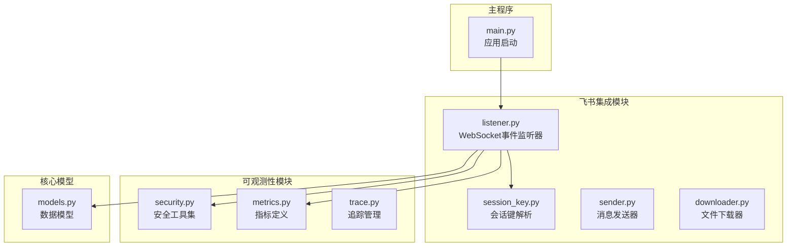
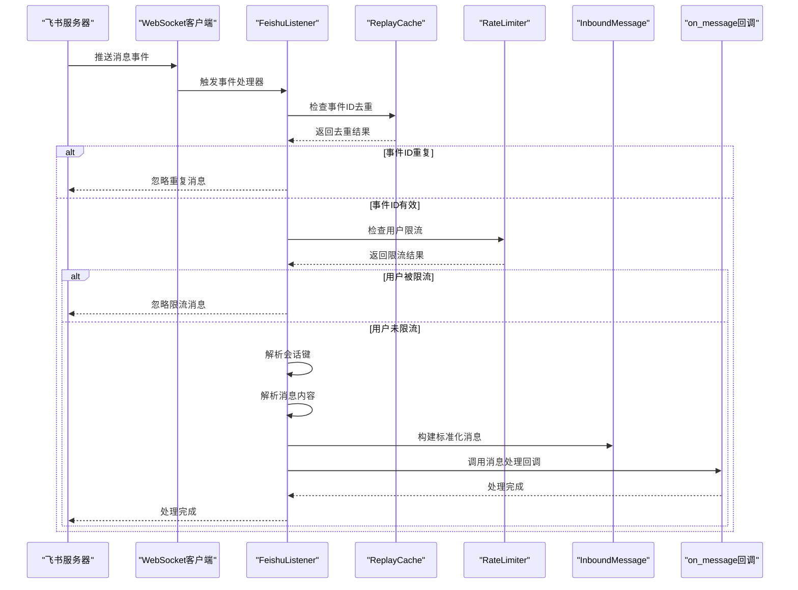
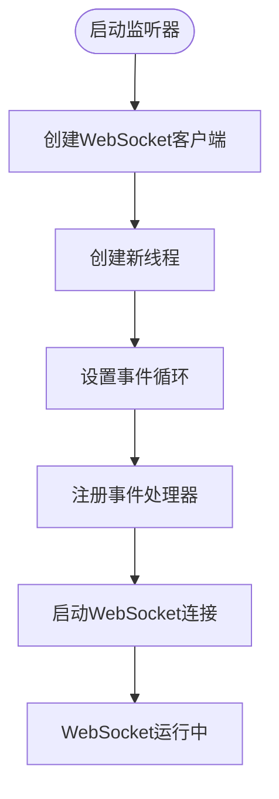
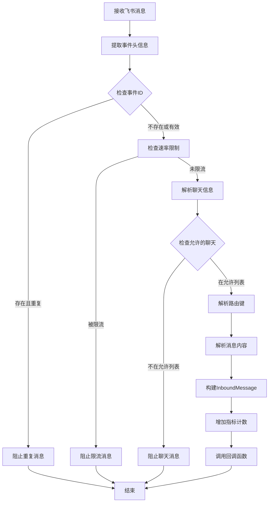
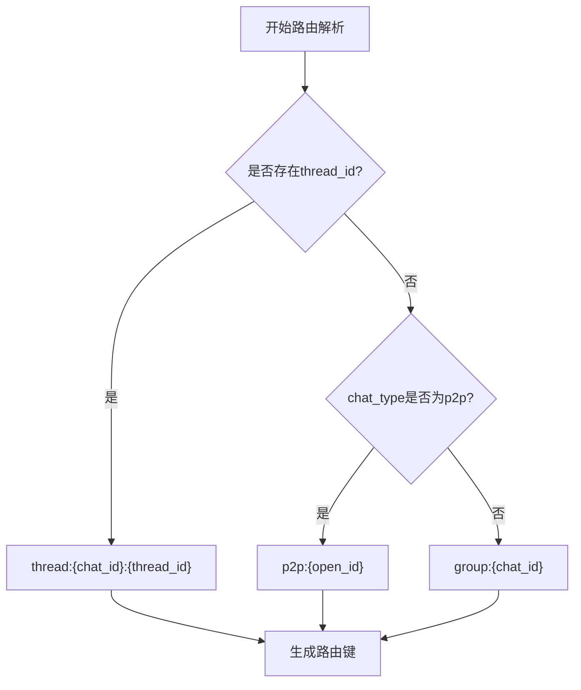
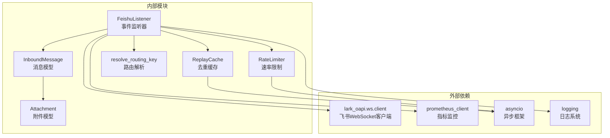

# WebSocket 事件监听器

<cite>
**本文档引用的文件**
- [listener.py](file://xiaopaw/feishu/listener.py)
- [session_key.py](file://xiaopaw/feishu/session_key.py)
- [security.py](file://xiaopaw/observability/security.py)
- [metrics.py](file://xiaopaw/observability/metrics.py)
- [models.py](file://xiaopaw/models.py)
- [main.py](file://xiaopaw/main.py)
- [04-api.md](file://docs/04-api.md)
- [09-config.md](file://docs/09-config.md)
- [config.yaml.example](file://config.yaml.example)
</cite>

## 目录
1. [简介](#简介)
2. [项目结构](#项目结构)
3. [核心组件](#核心组件)
4. [架构概览](#架构概览)
5. [详细组件分析](#详细组件分析)
6. [依赖关系分析](#依赖关系分析)
7. [性能考虑](#性能考虑)
8. [故障排除指南](#故障排除指南)
9. [结论](#结论)

## 简介

XiaoPaw v2 的 WebSocket 事件监听器是一个基于飞书开放平台 WebSocket API 的实时消息处理系统。该系统负责监听飞书机器人推送的消息事件，进行去重、限流、路由解析和消息解码，最终将标准化的消息传递给下游处理流程。

本文档深入分析 FeishuListener 类的实现原理，包括 WebSocket 连接建立、事件处理器构建和消息接收机制，详细解释事件类型处理（p2p_im_message_receive_v1）、消息解码和验证流程，以及 ReplayCache 的去重机制和 RateLimiter 的限流策略在事件监听中的应用。

## 项目结构

XiaoPaw v2 的 WebSocket 事件监听器主要分布在以下模块中：



**图表来源**
- [listener.py:1-148](file://xiaopaw/feishu/listener.py#L1-L148)
- [session_key.py:1-21](file://xiaopaw/feishu/session_key.py#L1-L21)
- [security.py:1-73](file://xiaopaw/observability/security.py#L1-L73)
- [models.py:1-34](file://xiaopaw/models.py#L1-L34)

**章节来源**
- [listener.py:1-148](file://xiaopaw/feishu/listener.py#L1-L148)
- [session_key.py:1-21](file://xiaopaw/feishu/session_key.py#L1-L21)
- [security.py:1-73](file://xiaopaw/observability/security.py#L1-L73)
- [models.py:1-34](file://xiaopaw/models.py#L1-L34)

## 核心组件

### FeishuListener 类

FeishuListener 是整个 WebSocket 事件监听系统的核心类，负责管理 WebSocket 连接、事件处理和消息路由。

#### 主要职责
- **WebSocket 连接管理**：建立和维护与飞书服务器的 WebSocket 连接
- **事件处理器构建**：注册特定的事件类型处理器
- **消息接收和处理**：接收飞书推送的消息事件并进行处理
- **会话路由解析**：根据消息类型和参数生成路由键
- **安全控制**：实施重放防护和速率限制

#### 关键属性
- `_app_id`: 飞书应用 ID
- `_app_secret`: 飞书应用密钥
- `_on_message`: 消息处理回调函数
- `_replay_cache`: 重放缓存实例
- `_rate_limiter`: 速率限制器实例
- `_allowed_chats`: 允许的聊天列表

**章节来源**
- [listener.py:21-41](file://xiaopaw/feishu/listener.py#L21-L41)

### ReplayCache 去重机制

ReplayCache 实现了基于 LRU 和 TTL 的事件 ID 去重机制，有效防止飞书 WebSocket 推送的重复消息。

#### 核心特性
- **LRU 淘汰**：当缓存达到最大容量时，最久未使用的事件 ID 会被淘汰
- **TTL 过期**：每个事件 ID 在 300 秒（5 分钟）后过期
- **线程安全**：使用 asyncio.Lock 确保并发访问的安全性

#### 工作原理
1. 检查事件 ID 是否存在于缓存中
2. 如果存在且未过期，标记为重复并返回
3. 如果不存在，添加到缓存并返回非重复标记
4. 清理过期的事件 ID

**章节来源**
- [security.py:47-73](file://xiaopaw/observability/security.py#L47-L73)
- [listener.py:87-90](file://xiaopaw/feishu/listener.py#L87-L90)

### RateLimiter 限流策略

RateLimiter 实现了基于滑动窗口的每用户每分钟限流机制，防止恶意用户或异常流量对系统造成冲击。

#### 限流规则
- **默认限制**：每用户每分钟 20 条消息
- **滑动窗口**：基于最近 60 秒内的请求计数
- **静默丢弃**：超过限制的消息会被直接丢弃

#### 实现细节
1. 使用字典存储每个用户的请求时间戳列表
2. 每次请求时清理 60 秒之前的记录
3. 比较当前窗口内的请求数量与限制值

**章节来源**
- [security.py:11-27](file://xiaopaw/observability/security.py#L11-L27)
- [listener.py:92-95](file://xiaopaw/feishu/listener.py#L92-L95)

### 会话键解析

resolve_routing_key 函数负责将飞书消息的聊天类型、聊天 ID、用户 ID 和线程 ID 解析为统一的路由键格式。

#### 路由键格式
- **私聊**：`p2p:{open_id}`
- **群聊**：`group:{chat_id}`
- **主题帖**：`thread:{chat_id}:{thread_id}`

#### 解析逻辑
1. 检查是否存在 thread_id，优先处理主题帖
2. 如果是私聊（p2p），使用 open_id 作为路由键
3. 否则使用 chat_id 作为路由键

**章节来源**
- [session_key.py:6-16](file://xiaopaw/feishu/session_key.py#L6-L16)

## 架构概览

XiaoPaw v2 的 WebSocket 事件监听器采用异步架构设计，确保高并发场景下的性能和可靠性。



**图表来源**
- [listener.py:42-62](file://xiaopaw/feishu/listener.py#L42-L62)
- [listener.py:81-147](file://xiaopaw/feishu/listener.py#L81-L147)
- [security.py:47-73](file://xiaopaw/observability/security.py#L47-L73)
- [security.py:11-27](file://xiaopaw/observability/security.py#L11-L27)

## 详细组件分析

### WebSocket 连接建立

FeishuListener 使用独立的线程来运行 lark_oapi.ws.client，确保 WebSocket 事件循环不会阻塞主事件循环。

#### 连接流程
1. 创建 WebSocket 客户端实例
2. 在新线程中启动事件循环
3. 注册事件处理器
4. 开始接收消息



**图表来源**
- [listener.py:42-62](file://xiaopaw/feishu/listener.py#L42-L62)

**章节来源**
- [listener.py:42-62](file://xiaopaw/feishu/listener.py#L42-L62)

### 事件处理器构建

事件处理器使用 lark_oapi.EventDispatcherHandler.builder 来注册特定的飞书事件类型。

#### 事件类型注册
- **p2p_im_message_receive_v1**: 私聊消息接收事件
- **支持扩展**: 可以注册其他飞书事件类型

#### 处理器工作原理
1. 创建 EventDispatcherHandler 实例
2. 注册 p2p_im_message_receive_v1 事件处理器
3. 构建并返回处理器实例

**章节来源**
- [listener.py:68-79](file://xiaopaw/feishu/listener.py#L68-L79)

### 消息接收机制

消息接收机制实现了完整的安全过滤和数据转换流程。



**图表来源**
- [listener.py:81-147](file://xiaopaw/feishu/listener.py#L81-L147)

**章节来源**
- [listener.py:81-147](file://xiaopaw/feishu/listener.py#L81-L147)

### 消息解码和验证流程

消息解码过程将飞书原始消息转换为标准化的 InboundMessage 对象。

#### 解码步骤
1. **事件 ID 检查**：使用 ReplayCache 验证事件唯一性
2. **速率限制检查**：使用 RateLimiter 验证用户配额
3. **聊天信息解析**：提取 chat_id、chat_type、thread_id
4. **路由键生成**：根据聊天类型生成统一路由标识
5. **内容解析**：解析消息内容和附件信息
6. **标准化构建**：创建 InboundMessage 对象

#### 内容解析逻辑
- **文本消息**：提取 content 字段中的 text 内容
- **图片消息**：提取 image_key 作为附件
- **文件消息**：提取 file_key 和 file_name 作为附件

**章节来源**
- [listener.py:87-147](file://xiaopaw/feishu/listener.py#L87-L147)

### 会话键解析和消息路由

会话键解析是消息路由的核心机制，确保消息能够正确地分配到相应的会话中。

#### 路由决策流程


**图表来源**
- [session_key.py:6-16](file://xiaopaw/feishu/session_key.py#L6-L16)

**章节来源**
- [session_key.py:6-16](file://xiaopaw/feishu/session_key.py#L6-L16)

## 依赖关系分析

XiaoPaw v2 的 WebSocket 事件监听器具有清晰的模块化依赖关系，各组件职责明确且耦合度适中。



**图表来源**
- [listener.py:10-14](file://xiaopaw/feishu/listener.py#L10-L14)
- [security.py:1-9](file://xiaopaw/observability/security.py#L1-L9)

### 组件耦合度分析

#### 高内聚低耦合
- **FeishuListener**：专注于 WebSocket 事件处理，与其他模块松耦合
- **ReplayCache**：独立的去重服务，无业务逻辑依赖
- **RateLimiter**：独立的限流服务，无业务逻辑依赖

#### 关键依赖点
- **lark_oapi.ws.client**：外部 WebSocket 客户端库
- **asyncio**：异步事件循环支持
- **prometheus_client**：指标监控支持

**章节来源**
- [listener.py:10-14](file://xiaopaw/feishu/listener.py#L10-L14)
- [security.py:1-9](file://xiaopaw/observability/security.py#L1-L9)

## 性能考虑

### 异步架构优势

XiaoPaw v2 的 WebSocket 事件监听器采用了完全异步的设计，具有以下性能优势：

#### 并发处理能力
- **事件循环分离**：WebSocket 事件循环运行在独立线程中
- **非阻塞 I/O**：使用 asyncio 实现高效的异步 I/O 操作
- **资源隔离**：避免 WebSocket 连接阻塞主应用事件循环

#### 内存管理优化
- **LRU 缓存**：ReplayCache 使用 OrderedDict 实现 O(1) 访问时间
- **TTL 过期**：自动清理过期的事件 ID，控制内存使用
- **滑动窗口**：RateLimiter 使用列表存储时间戳，空间复杂度 O(n)

### 性能监控指标

系统提供了完善的性能监控指标，用于评估和优化系统性能。

#### 关键指标
- **xiaopaw_inbound_total**: 入站消息总数（按来源和路由类型分类）
- **xiaopaw_feishu_rate_limit_total**: 飞书 API 速率限制命中次数
- **Agent 处理延迟**: 端到端处理延迟直方图

#### 监控建议
- 定期检查 xiaopaw_inbound_total 指标，评估系统负载
- 监控 xiaopaw_feishu_rate_limit_total，及时调整限流参数
- 分析 agent latency 直方图，识别性能瓶颈

**章节来源**
- [metrics.py:8-44](file://xiaopaw/observability/metrics.py#L8-L44)
- [04-api.md:346-381](file://docs/04-api.md#L346-L381)

## 故障排除指南

### 常见 WebSocket 连接问题

#### 连接失败排查
1. **检查凭证配置**
   - 验证 FEISHU_APP_ID 和 FEISHU_APP_SECRET
   - 确认应用权限配置正确
   - 检查网络连通性

2. **查看日志信息**
   - 关注 WebSocket 连接日志
   - 检查认证失败相关信息
   - 监控连接重试情况

3. **网络问题诊断**
   - 验证防火墙设置
   - 检查代理配置
   - 确认 DNS 解析正常

#### 连接中断处理
- 系统会自动尝试重新连接
- 检查网络稳定性
- 验证应用凭证有效性

**章节来源**
- [main.py:288-304](file://xiaopaw/main.py#L288-L304)

### 消息重复问题

#### 重放防护机制
1. **ReplayCache 配置**
   - 默认 TTL 300 秒（5 分钟）
   - 最大缓存大小 10000
   - 线程安全的并发访问

2. **重复消息检测**
   - 检查事件 ID 是否存在于缓存
   - 验证事件 ID 是否在有效 TTL 内
   - 自动清理过期的事件 ID

3. **跨重启处理**
   - 进程重启后缓存丢失
   - 建议使用 Redis 实现分布式去重
   - 配置示例：`SET event_id 1 EX 300 NX`

**章节来源**
- [security.py:47-73](file://xiaopaw/observability/security.py#L47-L73)
- [04-api.md:124-145](file://docs/04-api.md#L124-L145)

### 速率限制问题

#### 限流策略配置
1. **默认参数**
   - 每用户每分钟 20 条消息
   - 滑动窗口 60 秒
   - 超限时静默丢弃

2. **配置调整**
   ```yaml
   rate_limit:
     per_user_per_minute: 20
     global_per_minute: 1000
   ```

3. **监控和告警**
   - 监控 xiaopaw_feishu_rate_limit_total 指标
   - 设置合理的告警阈值
   - 分析限流原因和用户分布

**章节来源**
- [security.py:11-27](file://xiaopaw/observability/security.py#L11-L27)
- [09-config.md:205-217](file://docs/09-config.md#L205-L217)

### 性能优化建议

#### 系统级优化
1. **资源配置**
   - 增加系统文件描述符限制
   - 调整网络缓冲区大小
   - 优化操作系统网络参数

2. **应用级优化**
   - 调整 ReplayCache 缓存大小
   - 优化 RateLimiter 限流参数
   - 监控和调整日志级别

3. **监控和调优**
   - 建立完整的性能监控体系
   - 定期分析性能指标
   - 根据业务需求调整配置

#### 代码级优化
1. **异步优化**
   - 避免在事件处理器中执行阻塞操作
   - 使用适当的并发模式
   - 优化内存使用效率

2. **缓存优化**
   - 调整缓存大小和 TTL 参数
   - 实现智能缓存淘汰策略
   - 监控缓存命中率

**章节来源**
- [listener.py:42-62](file://xiaopaw/feishu/listener.py#L42-L62)
- [security.py:47-73](file://xiaopaw/observability/security.py#L47-L73)

## 结论

XiaoPaw v2 的 WebSocket 事件监听器通过精心设计的架构和完善的监控机制，为飞书消息处理提供了高效、可靠和可扩展的解决方案。

### 核心优势

1. **异步架构设计**：完全基于 asyncio 的异步事件处理，确保高并发场景下的性能表现
2. **安全防护机制**：内置 ReplayCache 去重和 RateLimiter 限流，有效防范恶意攻击和异常流量
3. **灵活路由系统**：统一的会话键解析机制，支持私聊、群聊和主题帖等多种消息类型
4. **可观测性完善**：全面的指标监控和日志记录，便于系统运维和性能优化

### 技术亮点

- **线程隔离**：WebSocket 事件循环与主应用事件循环分离，避免相互影响
- **标准化消息**：统一的 InboundMessage 数据结构，简化下游处理逻辑
- **配置驱动**：通过配置文件灵活调整系统行为和性能参数
- **错误处理**：完善的异常处理和恢复机制，确保系统稳定性

### 未来发展

随着业务规模的增长和技术演进，建议重点关注以下方面：

1. **分布式去重**：在多节点部署场景下，使用 Redis 实现全局去重
2. **动态限流**：根据实时负载情况动态调整限流参数
3. **性能监控**：建立更细粒度的性能监控指标，支持 A/B 测试和性能对比
4. **弹性扩展**：支持水平扩展和自动扩缩容，适应业务高峰期需求

通过持续优化和改进，XiaoPaw v2 的 WebSocket 事件监听器将继续为飞书生态系统的消息处理提供强有力的技术支撑。