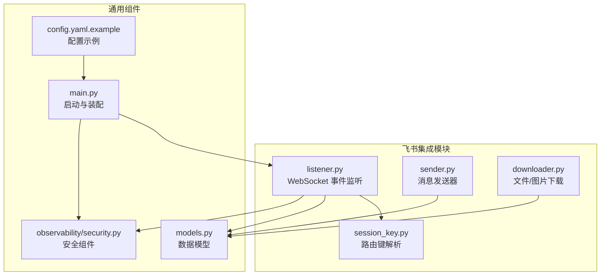
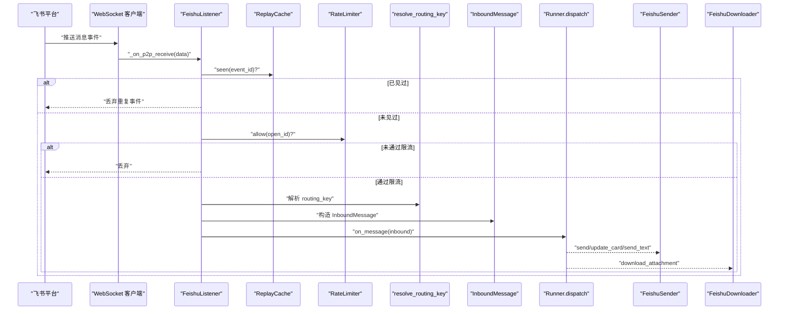
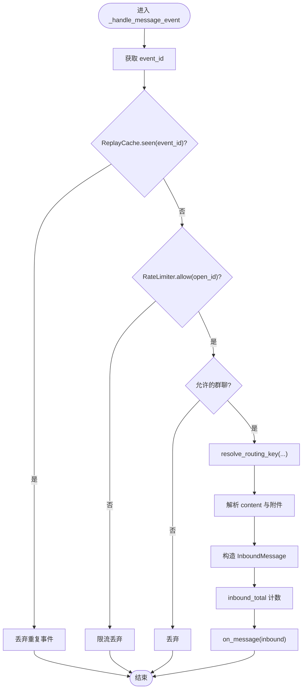
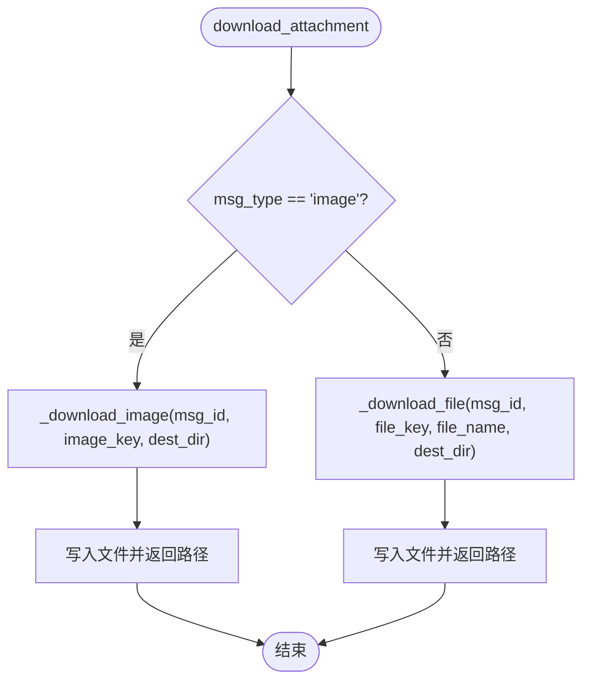
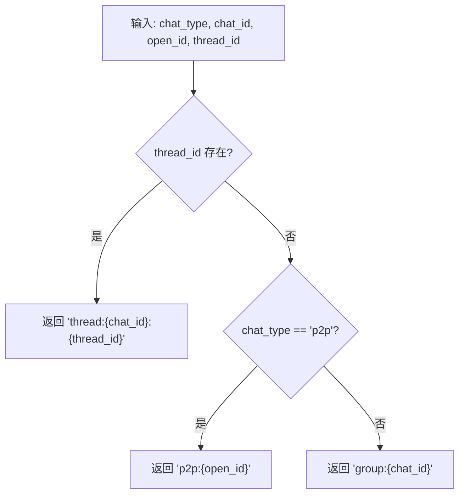
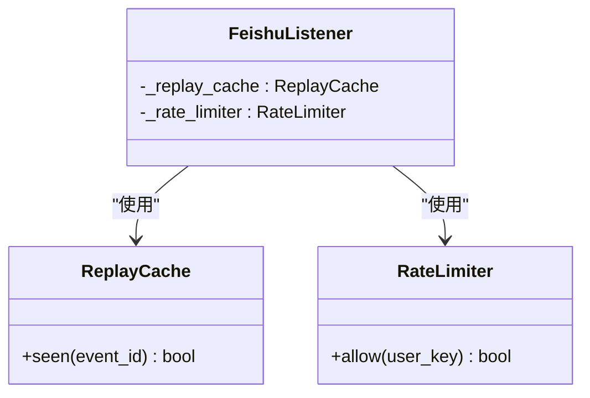
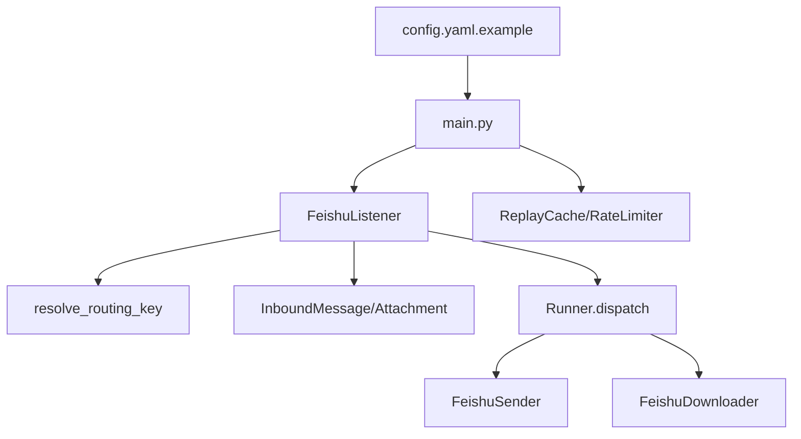

# 飞书集成模块

<cite>
**本文引用的文件**
- [listener.py](file://xiaopaw/feishu/listener.py)
- [sender.py](file://xiaopaw/feishu/sender.py)
- [downloader.py](file://xiaopaw/feishu/downloader.py)
- [session_key.py](file://xiaopaw/feishu/session_key.py)
- [models.py](file://xiaopaw/models.py)
- [security.py](file://xiaopaw/observability/security.py)
- [main.py](file://xiaopaw/main.py)
- [config.yaml.example](file://config.yaml.example)
- [04-api.md](file://docs/04-api.md)
- [02-modules.md](file://docs/02-modules.md)
- [03-data.md](file://docs/03-data.md)
- [test_e2e_11_events.py](file://tests/e2e/test_e2e_11_events.py)
</cite>

## 目录
1. [简介](#简介)
2. [项目结构](#项目结构)
3. [核心组件](#核心组件)
4. [架构总览](#架构总览)
5. [详细组件分析](#详细组件分析)
6. [依赖关系分析](#依赖关系分析)
7. [性能考量](#性能考量)
8. [故障排查指南](#故障排查指南)
9. [结论](#结论)
10. [附录](#附录)

## 简介
本文件面向 XiaoPaw v2 的飞书集成模块，系统性说明 WebSocket 事件监听、消息发送与文件下载的实现细节，以及飞书 API 的集成方式、验签与速率限制策略。文档还解释消息路由、会话管理与文件处理的工作流程，并提供事件处理、消息发送与文件下载的完整流程图示与代码片段路径，帮助开发者快速理解并正确使用飞书集成能力。

## 项目结构
飞书集成相关代码位于 xiaopaw/feishu 目录，配合通用数据模型、安全组件与主程序启动逻辑共同构成完整的飞书接入链路。



图表来源
- [listener.py:1-148](file://xiaopaw/feishu/listener.py#L1-L148)
- [sender.py:1-149](file://xiaopaw/feishu/sender.py#L1-L149)
- [downloader.py:1-77](file://xiaopaw/feishu/downloader.py#L1-L77)
- [session_key.py:1-21](file://xiaopaw/feishu/session_key.py#L1-L21)
- [models.py:1-35](file://xiaopaw/models.py#L1-L35)
- [security.py:1-72](file://xiaopaw/observability/security.py#L1-L72)
- [main.py:152-190](file://xiaopaw/main.py#L152-L190)
- [config.yaml.example:1-90](file://config.yaml.example#L1-L90)

章节来源
- [listener.py:1-148](file://xiaopaw/feishu/listener.py#L1-L148)
- [sender.py:1-149](file://xiaopaw/feishu/sender.py#L1-L149)
- [downloader.py:1-77](file://xiaopaw/feishu/downloader.py#L1-L77)
- [session_key.py:1-21](file://xiaopaw/feishu/session_key.py#L1-L21)
- [models.py:1-35](file://xiaopaw/models.py#L1-L35)
- [security.py:1-72](file://xiaopaw/observability/security.py#L1-L72)
- [main.py:152-190](file://xiaopaw/main.py#L152-L190)
- [config.yaml.example:1-90](file://config.yaml.example#L1-L90)

## 核心组件
- WebSocket 事件监听器：负责启动 lark-oapi WebSocket 客户端，接收飞书消息事件，进行去重、限流、路由键解析与消息封装，最终投递到业务分发器。
- 消息发送器：基于 lark-oapi SDK 发送文本、交互卡片与更新卡片，内置并发控制、指数退避重试与飞书限流识别。
- 文件下载器：根据消息中的 file_key/image_key 下载图片或文件资源至本地会话目录。
- 路由键解析器：将飞书事件中的聊天类型、聊天 ID、用户 ID、线程 ID 映射为统一的 routing_key，支撑后续会话路由。
- 安全组件：ReplayCache（应用层去重，LRU+TTL）、RateLimiter（滑动窗口限流）。
- 数据模型：InboundMessage、Attachment、SenderProtocol，定义飞书消息在系统内的标准流转形态。

章节来源
- [listener.py:21-148](file://xiaopaw/feishu/listener.py#L21-L148)
- [sender.py:18-149](file://xiaopaw/feishu/sender.py#L18-L149)
- [downloader.py:12-77](file://xiaopaw/feishu/downloader.py#L12-L77)
- [session_key.py:6-21](file://xiaopaw/feishu/session_key.py#L6-L21)
- [security.py:11-72](file://xiaopaw/observability/security.py#L11-L72)
- [models.py:10-35](file://xiaopaw/models.py#L10-L35)

## 架构总览
飞书集成采用“事件驱动 + 并发控制 + 限流与去重”的设计，确保高吞吐下的稳定性与可靠性。



图表来源
- [listener.py:42-148](file://xiaopaw/feishu/listener.py#L42-L148)
- [security.py:47-72](file://xiaopaw/observability/security.py#L47-L72)
- [session_key.py:6-21](file://xiaopaw/feishu/session_key.py#L6-L21)
- [models.py:17-27](file://xiaopaw/models.py#L17-L27)
- [sender.py:43-149](file://xiaopaw/feishu/sender.py#L43-L149)
- [downloader.py:16-77](file://xiaopaw/feishu/downloader.py#L16-L77)

## 详细组件分析

### WebSocket 事件监听器（FeishuListener）
- 启动方式：在独立线程中启动 lark-oapi WebSocket 客户端，主线程通过 asyncio.run_coroutine_threadsafe 将事件回调切换到主事件循环。
- 事件处理流程：
  - 从 header 中提取 event_id，交由 ReplayCache 判断是否重复。
  - 使用 RateLimiter 对 open_id 进行限流。
  - 解析 allowed_chats 白名单（非 p2p 场景）。
  - 调用 resolve_routing_key 生成 routing_key。
  - 解析消息内容与附件（image/file），构造 InboundMessage。
  - 增加指标计数，调用 on_message 回调。
- 异常处理：捕获异常并记录日志，避免中断 WebSocket 循环。



图表来源
- [listener.py:81-148](file://xiaopaw/feishu/listener.py#L81-L148)
- [security.py:47-72](file://xiaopaw/observability/security.py#L47-L72)
- [session_key.py:6-21](file://xiaopaw/feishu/session_key.py#L6-L21)
- [models.py:17-27](file://xiaopaw/models.py#L17-L27)

章节来源
- [listener.py:21-148](file://xiaopaw/feishu/listener.py#L21-L148)

### 消息发送器（FeishuSender）
- 角色：实现 SenderProtocol，负责向飞书发送文本、交互卡片、更新卡片与思考提示等。
- 并发控制：使用 asyncio.Semaphore 控制最大并发，避免对飞书 API 造成瞬时压力。
- 重试策略：指数退避重试，识别飞书特定限流错误码并进行延迟重试。
- 方法族：
  - send：发送交互卡片（Markdown 内容）。
  - send_thinking：发送“思考中”提示（非关键路径，失败不抛异常）。
  - update_card：更新已发送的卡片内容。
  - send_text：发送纯文本消息。
- 路由键解析：根据 routing_key 自动选择 receive_id_type（p2p 使用 open_id，群组使用 chat_id）。

```mermaid
sequenceDiagram
participant Caller as "调用方"
participant S as "FeishuSender"
participant API as "lark-oapi im.v1.message"
participant RL as "RateLimiter(外部)"
Caller->>S : "send/route_key,content"
S->>S : "解析 routing_key -> chat_type, chat_id"
S->>S : "构建请求体 (receive_id_type, msg_type, content)"
loop 最多重试次数
S->>API : "create"
alt 返回限流错误码
S->>S : "等待退避时间"
else 成功
API-->>S : "返回 message_id"
S-->>Caller : "message_id"
exit
else 失败
S->>S : "等待退避时间"
end
end
S-->>Caller : "抛出异常"
```

图表来源
- [sender.py:43-116](file://xiaopaw/feishu/sender.py#L43-L116)
- [04-api.md:324-356](file://docs/04-api.md#L324-L356)

章节来源
- [sender.py:18-149](file://xiaopaw/feishu/sender.py#L18-L149)
- [04-api.md:324-356](file://docs/04-api.md#L324-L356)

### 文件下载器（FeishuDownloader）
- 功能：根据消息 ID 与 file_key/image_key 下载图片或文件资源，写入指定会话目录。
- 类型区分：image 与 file 采用不同的资源接口；图片默认以 image_key.png 命名，文件按 file_name 或 file_key 命名。
- 异常处理：捕获异常并记录日志，返回 None 表示失败。



图表来源
- [downloader.py:16-77](file://xiaopaw/feishu/downloader.py#L16-L77)

章节来源
- [downloader.py:12-77](file://xiaopaw/feishu/downloader.py#L12-L77)

### 路由键解析（resolve_routing_key）
- 输入：chat_type、chat_id、open_id、thread_id。
- 输出：统一的 routing_key 格式，支持 p2p、group、thread 三类场景。
- 用途：作为会话路由与话题定位的基础标识，承载 thread 信息以支持多轮对话。



图表来源
- [session_key.py:6-21](file://xiaopaw/feishu/session_key.py#L6-L21)

章节来源
- [session_key.py:6-21](file://xiaopaw/feishu/session_key.py#L6-L21)

### 安全组件：ReplayCache 与 RateLimiter
- ReplayCache（应用层去重）：
  - LRU + TTL 设计，5 分钟窗口内去重；支持异步锁保护。
  - 受功能开关控制，适用于单实例场景；多实例建议使用 Redis。
- RateLimiter（滑动窗口限流）：
  - 每用户每分钟滑动窗口计数，超过阈值拒绝请求。
  - 在监听器中对 open_id 进行限流，防止恶意刷屏。



图表来源
- [security.py:47-72](file://xiaopaw/observability/security.py#L47-L72)
- [listener.py:21-40](file://xiaopaw/feishu/listener.py#L21-L40)

章节来源
- [security.py:11-72](file://xiaopaw/observability/security.py#L11-L72)
- [listener.py:81-96](file://xiaopaw/feishu/listener.py#L81-L96)

### 数据模型与协议
- InboundMessage：飞书入站消息的标准载体，包含 routing_key、content、msg_id、sender_id、ts、attachment、trace_id 等字段。
- Attachment：附件元信息，支持 image/file 两类。
- SenderProtocol：发送器的运行时多态接口，v2 起不再携带 root_id，话题定位由 routing_key 自带 thread 前缀承载。

章节来源
- [models.py:10-35](file://xiaopaw/models.py#L10-L35)
- [03-data.md:94-128](file://docs/03-data.md#L94-L128)
- [04-api.md:724-741](file://docs/04-api.md#L724-L741)

## 依赖关系分析
- 启动装配：主程序在生产模式下创建 ReplayCache、RateLimiter，并注入 FeishuListener；随后启动 WebSocket 监听。
- 配置来源：配置文件提供飞书凭据、白名单、限流与去重参数等。
- 文档参考：API 文档与模块文档对 SDK 使用、SenderProtocol 约定与限流策略有明确说明。



图表来源
- [main.py:174-190](file://xiaopaw/main.py#L174-L190)
- [config.yaml.example:7-11](file://config.yaml.example#L7-L11)
- [listener.py:21-40](file://xiaopaw/feishu/listener.py#L21-L40)
- [sender.py:18-30](file://xiaopaw/feishu/sender.py#L18-L30)
- [downloader.py:12-15](file://xiaopaw/feishu/downloader.py#L12-L15)

章节来源
- [main.py:174-190](file://xiaopaw/main.py#L174-L190)
- [config.yaml.example:60-90](file://config.yaml.example#L60-L90)
- [02-modules.md:390-414](file://docs/02-modules.md#L390-L414)

## 性能考量
- 并发控制：FeishuSender 使用信号量限制最大并发，避免对飞书 API 造成瞬时压力。
- 指数退避：在识别到飞书限流错误码时进行指数退避重试，降低峰值。
- 去重与限流：ReplayCache 与 RateLimiter 双重保护，减少无效负载与滥用风险。
- 指标监控：入站消息计数与限流计数指标，便于观测与调优。

章节来源
- [sender.py:18-30](file://xiaopaw/feishu/sender.py#L18-L30)
- [security.py:11-27](file://xiaopaw/observability/security.py#L11-L27)
- [listener.py:139-142](file://xiaopaw/feishu/listener.py#L139-L142)

## 故障排查指南
- WebSocket 启动失败
  - 检查飞书 app_id/app_secret 是否正确配置。
  - 查看线程启动日志与异常堆栈。
  - 参考：[listener.py:42-62](file://xiaopaw/feishu/listener.py#L42-L62)
- 事件被去重或限流
  - 检查 ReplayCache 是否命中（event_id 是否重复）。
  - 检查 RateLimiter 是否达到阈值（per_user_per_minute）。
  - 参考：[security.py:47-72](file://xiaopaw/observability/security.py#L47-L72)
- 发送失败或限流
  - 观察限流错误码与 HTTP 429，确认退避与重试是否生效。
  - 调整 max_concurrent 与 retry_backoff。
  - 参考：[sender.py:100-115](file://xiaopaw/feishu/sender.py#L100-L115)
- 附件下载失败
  - 检查 file_key/image_key 是否有效，目标路径是否存在且可写。
  - 参考：[downloader.py:16-32](file://xiaopaw/feishu/downloader.py#L16-L32)
- 配置问题
  - 确认 config.yaml 中 feishu、rate_limit、replay_cache、feature_flags 等项。
  - 参考：[config.yaml.example:7-11](file://config.yaml.example#L7-L11), [config.yaml.example:60-90](file://config.yaml.example#L60-L90)

章节来源
- [listener.py:42-62](file://xiaopaw/feishu/listener.py#L42-L62)
- [security.py:47-72](file://xiaopaw/observability/security.py#L47-L72)
- [sender.py:100-115](file://xiaopaw/feishu/sender.py#L100-L115)
- [downloader.py:16-32](file://xiaopaw/feishu/downloader.py#L16-L32)
- [config.yaml.example:7-11](file://config.yaml.example#L7-L11)
- [config.yaml.example:60-90](file://config.yaml.example#L60-L90)

## 结论
XiaoPaw v2 的飞书集成模块通过 WebSocket 事件监听、消息发送与文件下载三大能力，结合 ReplayCache 与 RateLimiter 的安全策略，实现了稳定、可观测且可扩展的飞书接入方案。路由键统一规范与 SenderProtocol 的多态设计，进一步提升了系统的可维护性与可测试性。建议在生产环境中合理配置并发与限流参数，并结合指标监控持续优化性能与稳定性。

## 附录

### 飞书 API 集成方式与验签机制
- SDK 使用：统一使用 lark-oapi 官方 SDK，自动管理 tenant_access_token 的刷新。
- 验签机制：飞书 WebSocket 事件由官方 SDK 处理，应用侧无需自行验签。
- 参考：[04-api.md:308-323](file://docs/04-api.md#L308-L323)

章节来源
- [04-api.md:308-323](file://docs/04-api.md#L308-L323)

### 速率限制策略
- 应用层限流：RateLimiter 对每个 open_id 进行每分钟滑动窗口计数。
- 飞书限流：识别特定错误码与 HTTP 429，进行指数退避重试。
- 参考：[sender.py:14-15](file://xiaopaw/feishu/sender.py#L14-L15), [security.py:11-27](file://xiaopaw/observability/security.py#L11-L27)

章节来源
- [sender.py:14-15](file://xiaopaw/feishu/sender.py#L14-L15)
- [security.py:11-27](file://xiaopaw/observability/security.py#L11-L27)

### 消息路由与会话管理
- 路由键：p2p/group/thread 三种类型，thread 前缀承载话题定位。
- 会话路由：InboundMessage 的 routing_key 作为会话路由依据。
- 参考：[session_key.py:6-21](file://xiaopaw/feishu/session_key.py#L6-L21), [models.py:17-27](file://xiaopaw/models.py#L17-L27)

章节来源
- [session_key.py:6-21](file://xiaopaw/feishu/session_key.py#L6-L21)
- [models.py:17-27](file://xiaopaw/models.py#L17-L27)

### 文件处理工作流程
- 下载流程：根据 msg_type 选择 image 或 file 接口，写入会话目录。
- 命名策略：图片默认 image_key.png，文件按 file_name 或 file_key 命名。
- 参考：[downloader.py:16-77](file://xiaopaw/feishu/downloader.py#L16-L77)

章节来源
- [downloader.py:16-77](file://xiaopaw/feishu/downloader.py#L16-L77)

### 完整流程示例（事件处理）
- 事件到达 → 去重与限流 → 路由键解析 → 构造 InboundMessage → 投递到 Runner.dispatch → 业务处理 → 发送消息/下载附件。
- 参考：[listener.py:81-148](file://xiaopaw/feishu/listener.py#L81-L148), [main.py:174-190](file://xiaopaw/main.py#L174-L190)

章节来源
- [listener.py:81-148](file://xiaopaw/feishu/listener.py#L81-L148)
- [main.py:174-190](file://xiaopaw/main.py#L174-L190)

### 完整流程示例（消息发送）
- 调用 send → 解析 routing_key → 构建请求 → 并发控制 → 重试与退避 → 返回 message_id。
- 参考：[sender.py:43-116](file://xiaopaw/feishu/sender.py#L43-L116)

章节来源
- [sender.py:43-116](file://xiaopaw/feishu/sender.py#L43-L116)

### 完整流程示例（文件下载）
- 调用 download_attachment → 判断类型 → 请求资源 → 写入本地 → 返回路径。
- 参考：[downloader.py:16-77](file://xiaopaw/feishu/downloader.py#L16-L77)

章节来源
- [downloader.py:16-77](file://xiaopaw/feishu/downloader.py#L16-L77)