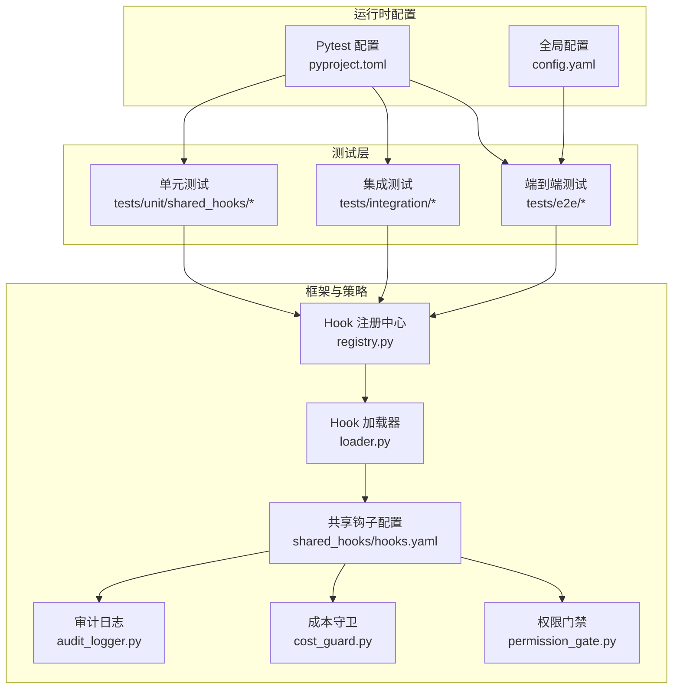
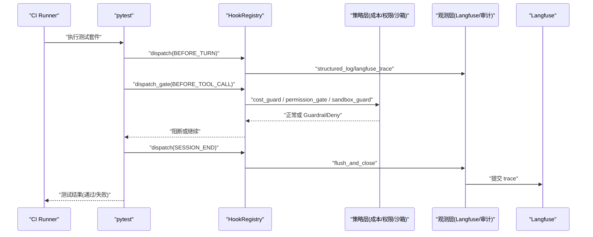
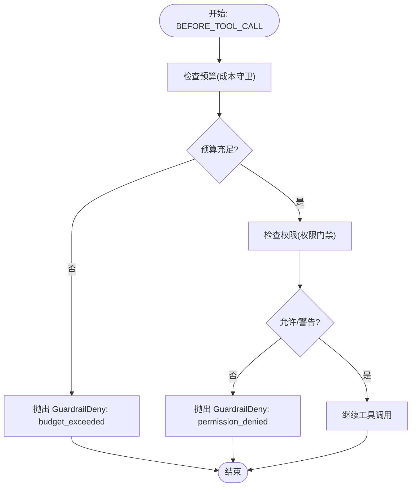
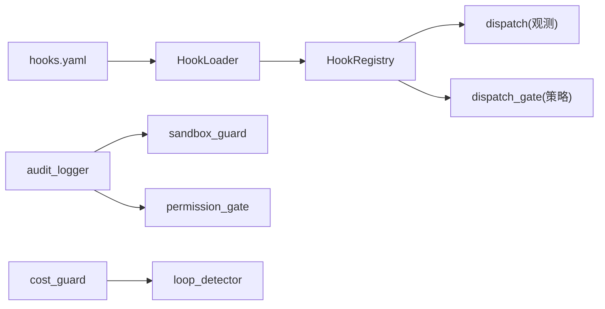

# CI 门禁集成

<cite>
**本文引用的文件**
- [pyproject.toml](file://pyproject.toml)
- [config.yaml](file://config.yaml)
- [shared_hooks/hooks.yaml](file://shared_hooks/hooks.yaml)
- [tests/conftest.py](file://tests/conftest.py)
- [tests/e2e/conftest.py](file://tests/e2e/conftest.py)
- [tests/integration/conftest.py](file://tests/integration/conftest.py)
- [xiaopaw/hook_framework/loader.py](file://xiaopaw/hook_framework/loader.py)
- [xiaopaw/hook_framework/registry.py](file://xiaopaw/hook_framework/registry.py)
- [shared_hooks/audit_logger.py](file://shared_hooks/audit_logger.py)
- [shared_hooks/cost_guard.py](file://shared_hooks/cost_guard.py)
- [shared_hooks/permission_gate.py](file://shared_hooks/permission_gate.py)
- [tests/unit/shared_hooks/test_audit_logger.py](file://tests/unit/shared_hooks/test_audit_logger.py)
- [tests/unit/shared_hooks/test_cost_guard.py](file://tests/unit/shared_hooks/test_cost_guard.py)
- [tests/unit/shared_hooks/test_permission_gate.py](file://tests/unit/shared_hooks/test_permission_gate.py)
</cite>

## 目录
1. [简介](#简介)
2. [项目结构](#项目结构)
3. [核心组件](#核心组件)
4. [架构总览](#架构总览)
5. [详细组件分析](#详细组件分析)
6. [依赖分析](#依赖分析)
7. [性能考量](#性能考量)
8. [故障排查指南](#故障排查指南)
9. [结论](#结论)
10. [附录](#附录)

## 简介
本文件面向 XiaoPaw v2 的 CI 门禁集成，系统性阐述如何在 CI 中配置与执行测试门禁，确保质量门槛稳定可靠。内容覆盖：
- 测试层级与执行顺序：单元、集成、端到端的分层策略与依赖关系
- 超时与失败处理：基于 pytest 配置与钩子框架的 fail-closed 语义
- 质量保证流程：可观测性（Langfuse）、安全审计（JSONL）、预算与权限策略
- 并行化、缓存与资源管理：测试并发、Langfuse 缓冲与资源清理
- CI 失败排查、重试与门禁实施：从配置到回归验证的闭环

## 项目结构
XiaoPaw v2 的测试组织采用分层结构：
- 单元测试：覆盖共享钩子策略（审计、成本、权限）与框架核心
- 集成测试：围绕 Langfuse 跟踪与会话隔离，验证事件树完整性
- 端到端测试：真实 LLM + Sandbox + Hook 链路，含 Langfuse 断言与安全审计

图表来源
- [pyproject.toml:40-55](file://pyproject.toml#L40-L55)
- [config.yaml:1-90](file://config.yaml#L1-L90)
- [shared_hooks/hooks.yaml:1-73](file://shared_hooks/hooks.yaml#L1-L73)
- [xiaopaw/hook_framework/loader.py:37-65](file://xiaopaw/hook_framework/loader.py#L37-L65)
- [xiaopaw/hook_framework/registry.py:118-209](file://xiaopaw/hook_framework/registry.py#L118-L209)

章节来源
- [pyproject.toml:40-55](file://pyproject.toml#L40-L55)
- [config.yaml:1-90](file://config.yaml#L1-L90)
- [shared_hooks/hooks.yaml:1-73](file://shared_hooks/hooks.yaml#L1-L73)
- [xiaopaw/hook_framework/loader.py:37-65](file://xiaopaw/hook_framework/loader.py#L37-L65)
- [xiaopaw/hook_framework/registry.py:118-209](file://xiaopaw/hook_framework/registry.py#L118-L209)

## 核心组件
- 测试运行与门禁
  - pytest 配置：测试路径、异步模式、全局超时、标记选择
  - 钩子注册中心：两套分发机制（观测 dispatch、策略 dispatch_gate）
  - Hook 加载器：两层加载（全局 shared_hooks + 工作区 hooks），严格顺序与依赖注入
- 安全与可观测性
  - 审计日志：append-only JSONL，会话摘要，多策略共享
  - 成本守卫：按模型计费、累计 token、预算硬停
  - 权限门禁：deny > warn > allow 三级策略，默认 deny 原则
  - Langfuse：事件树校验、根 span 校验、生成观察校验、flush 与重试

章节来源
- [pyproject.toml:40-55](file://pyproject.toml#L40-L55)
- [xiaopaw/hook_framework/registry.py:118-209](file://xiaopaw/hook_framework/registry.py#L118-L209)
- [xiaopaw/hook_framework/loader.py:37-65](file://xiaopaw/hook_framework/loader.py#L37-L65)
- [shared_hooks/audit_logger.py:30-90](file://shared_hooks/audit_logger.py#L30-L90)
- [shared_hooks/cost_guard.py:34-100](file://shared_hooks/cost_guard.py#L34-L100)
- [shared_hooks/permission_gate.py:32-107](file://shared_hooks/permission_gate.py#L32-L107)

## 架构总览
CI 门禁由“测试分层 + 钩子门禁 + 可观测性”三层构成，形成“执行-阻断-记录”的闭环。

图表来源
- [xiaopaw/hook_framework/registry.py:153-198](file://xiaopaw/hook_framework/registry.py#L153-L198)
- [shared_hooks/hooks.yaml:1-73](file://shared_hooks/hooks.yaml#L1-L73)
- [tests/integration/conftest.py:98-135](file://tests/integration/conftest.py#L98-L135)

## 详细组件分析

### 测试分层与执行顺序
- 分层策略
  - 单元测试：独立、快速、覆盖策略与工具逻辑
  - 集成测试：Langfuse 跟踪与会话隔离，验证事件树与根 span
  - 端到端测试：真实 LLM + Sandbox + Hook 链路，含断言与审计
- 执行顺序
  - 钩子加载顺序：观测段先于策略段，确保即使策略阻断，观测记录仍在
  - 策略执行顺序：由 hooks.yaml 中声明顺序决定，依赖通过 deps 注入
- 标记与选择
  - 使用 pytest 标记对测试进行分层选择与过滤

章节来源
- [tests/conftest.py:8-17](file://tests/conftest.py#L8-L17)
- [tests/integration/conftest.py:30-36](file://tests/integration/conftest.py#L30-L36)
- [tests/e2e/conftest.py:241-265](file://tests/e2e/conftest.py#L241-L265)
- [pyproject.toml:44-55](file://pyproject.toml#L44-L55)
- [xiaopaw/hook_framework/loader.py:62-64](file://xiaopaw/hook_framework/loader.py#L62-L64)

### 钩子注册与门禁语义
- 两套分发机制
  - dispatch：观测层 handler 异常吞掉，不影响业务
  - dispatch_gate：策略层 handler 抛出 GuardrailDeny 阻断链路，fail-closed 时将 handler 异常转为拒绝
- 事件生命周期
  - BEFORE_TURN → BEFORE_LLM → BEFORE_TOOL_CALL → AFTER_TOOL_CALL → AFTER_TURN → SESSION_END
- 门禁异常
  - DenyReason：预算超支、循环检测、沙箱违规、权限拒绝、提示注入

图表来源
- [xiaopaw/hook_framework/registry.py:170-198](file://xiaopaw/hook_framework/registry.py#L170-L198)
- [shared_hooks/cost_guard.py:68-82](file://shared_hooks/cost_guard.py#L68-L82)
- [shared_hooks/permission_gate.py:57-94](file://shared_hooks/permission_gate.py#L57-L94)

章节来源
- [xiaopaw/hook_framework/registry.py:153-198](file://xiaopaw/hook_framework/registry.py#L153-L198)
- [shared_hooks/cost_guard.py:52-82](file://shared_hooks/cost_guard.py#L52-L82)
- [shared_hooks/permission_gate.py:57-94](file://shared_hooks/permission_gate.py#L57-L94)

### 观测与质量门禁
- Langfuse 断言
  - 会话隔离：每个测试生成唯一 session_id
  - trace 校验：根 span、生成观察、树结构完整性
  - flush 与重试：批量缓冲 flush、异步注入延迟重试
- 审计日志
  - JSONL 追加写入，支持环境变量路径
  - 会话摘要：统计各类安全事件数量
- 端到端断言
  - LLM-as-Judge：DeepSeek API 判定回复是否满足标准
  - Sandbox 可达性与健康检查

章节来源
- [tests/integration/conftest.py:30-36](file://tests/integration/conftest.py#L30-L36)
- [tests/integration/conftest.py:66-96](file://tests/integration/conftest.py#L66-L96)
- [tests/integration/conftest.py:123-135](file://tests/integration/conftest.py#L123-L135)
- [tests/integration/conftest.py:159-192](file://tests/integration/conftest.py#L159-L192)
- [tests/integration/conftest.py:212-223](file://tests/integration/conftest.py#L212-L223)
- [tests/e2e/conftest.py:113-152](file://tests/e2e/conftest.py#L113-L152)
- [tests/e2e/conftest.py:165-208](file://tests/e2e/conftest.py#L165-L208)
- [tests/e2e/conftest.py:215-229](file://tests/e2e/conftest.py#L215-L229)
- [shared_hooks/audit_logger.py:30-90](file://shared_hooks/audit_logger.py#L30-L90)

### 配置与环境
- 全局配置
  - agent、sandbox、memory、runner、sender、observability、feature_flags 等
- 测试配置
  - pytest：testpaths、asyncio_mode、timeout、markers
  - 覆盖率：source、omit
- 环境变量
  - Langfuse：XIAOPAW_LANGFUSE_PUBLIC_KEY/SECRET_KEY、LANGFUSE_BASE_URL
  - 安全审计：SECURITY_AUDIT_FILE
  - 成本预算：COST_GUARD_BUDGET
  - LLM：DEEPSEEK_API_KEY/DASHSCOPE_API_KEY

章节来源
- [config.yaml:1-90](file://config.yaml#L1-L90)
- [pyproject.toml:40-63](file://pyproject.toml#L40-L63)
- [tests/e2e/conftest.py:29-32](file://tests/e2e/conftest.py#L29-L32)
- [tests/e2e/conftest.py:211-213](file://tests/e2e/conftest.py#L211-L213)
- [tests/e2e/conftest.py:416-423](file://tests/e2e/conftest.py#L416-L423)
- [tests/integration/conftest.py:12-24](file://tests/integration/conftest.py#L12-L24)
- [tests/unit/shared_hooks/test_cost_guard.py:96-107](file://tests/unit/shared_hooks/test_cost_guard.py#L96-L107)

## 依赖分析
- 钩子加载顺序与依赖注入
  - 先加载 hooks 段，再加载 strategies 段
  - strategies 有序实例化，deps 依赖前置策略
- 策略依赖关系
  - sandbox_guard、permission_gate 依赖 audit_logger（通过 deps 注入）
  - cost_guard 与 loop_detector 的顺序敏感性（cost_guard 先于 loop_detector）

图表来源
- [xiaopaw/hook_framework/loader.py:88-155](file://xiaopaw/hook_framework/loader.py#L88-L155)
- [shared_hooks/hooks.yaml:27-73](file://shared_hooks/hooks.yaml#L27-L73)

章节来源
- [xiaopaw/hook_framework/loader.py:88-155](file://xiaopaw/hook_framework/loader.py#L88-L155)
- [shared_hooks/hooks.yaml:27-73](file://shared_hooks/hooks.yaml#L27-L73)

## 性能考量
- 测试超时
  - 全局超时：pytest timeout=600 秒
  - 端到端客户端超时：aiohttp.ClientTimeout 与 socket 超时
- 并行化与资源管理
  - pytest-asyncio 异步模式
  - 端到端测试中的 safe teardown 与资源清理
- Langfuse 缓冲与重试
  - flush 批量缓冲与异步注入延迟重试
  - trace 查询重试与最小观察数校验

章节来源
- [pyproject.toml:43](file://pyproject.toml#L43)
- [tests/e2e/conftest.py:64-75](file://tests/e2e/conftest.py#L64-L75)
- [tests/e2e/conftest.py:323-332](file://tests/e2e/conftest.py#L323-L332)
- [tests/integration/conftest.py:58-64](file://tests/integration/conftest.py#L58-L64)
- [tests/integration/conftest.py:78-95](file://tests/integration/conftest.py#L78-L95)

## 故障排查指南
- 常见失败场景
  - 预算超支：cost_guard 抛出 GuardrailDeny，deny_reason=budget_exceeded
  - 权限拒绝：permission_gate 抛出 GuardrailDeny，deny_reason=permission_denied
  - 沙箱违规：sandbox_guard 抛出 GuardrailDeny，fail-closed 时转换为默认拒绝
  - 循环检测：loop_detector 抛出 GuardrailDeny，deny_reason=loop_detected
- 排查步骤
  - 检查 Langfuse trace：根 span、生成观察、树结构
  - 检查审计日志：JSONL 文件是否存在、会话摘要
  - 检查环境变量：Langfuse 凭据、审计文件路径、成本预算
  - 检查策略顺序：hooks.yaml 中 cost_guard 是否在 loop_detector 之前
- 重试与回退
  - Langfuse 查询重试与最小观察数等待
  - 端到端测试中的 safe teardown 与资源回收

章节来源
- [tests/integration/conftest.py:123-135](file://tests/integration/conftest.py#L123-L135)
- [tests/integration/conftest.py:159-192](file://tests/integration/conftest.py#L159-L192)
- [tests/integration/conftest.py:212-223](file://tests/integration/conftest.py#L212-L223)
- [shared_hooks/cost_guard.py:61-66](file://shared_hooks/cost_guard.py#L61-L66)
- [shared_hooks/permission_gate.py:82-85](file://shared_hooks/permission_gate.py#L82-L85)
- [tests/e2e/conftest.py:113-152](file://tests/e2e/conftest.py#L113-L152)
- [tests/e2e/conftest.py:323-332](file://tests/e2e/conftest.py#L323-L332)

## 结论
XiaoPaw v2 的 CI 门禁通过“分层测试 + 钩子门禁 + 可观测性”构建了稳健的质量保障体系。遵循以下原则可获得最佳效果：
- 严格控制钩子加载顺序与依赖注入，确保观测记录在策略阻断前完成
- 使用 Langfuse 与审计日志进行双轨记录，提升可追溯性
- 设置合理的超时与重试策略，平衡稳定性与速度
- 通过 pytest 标记与分层执行，实现可选择、可并行的门禁策略

## 附录
- CI 配置建议
  - 在 CI 中设置 pytest timeout、并发度与覆盖率阈值
  - 为 Langfuse 与审计日志准备专用环境变量
  - 为端到端测试准备 LLM 与 Sandbox 资源
- 测试报告与质量指标
  - 使用 pytest-cov 输出覆盖率报告
  - 通过 Langfuse trace 与审计 JSONL 生成质量报告
- 重试与门禁实施
  - 对不稳定环节（Langfuse 注入、Sandbox 健康检查）增加重试
  - 将 fail-closed 策略应用于关键安全 handler，确保默认拒绝