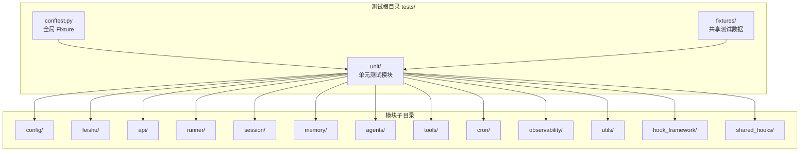
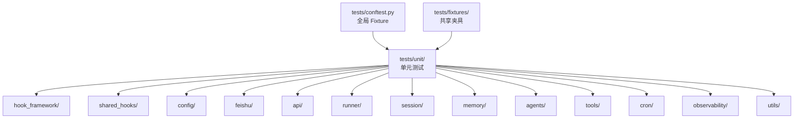

# 单元测试组织

<cite>
**本文引用的文件**
- [docs/10-testing.md](file://docs/10-testing.md)
- [tests/conftest.py](file://tests/conftest.py)
- [tests/unit/test_v3_fixes.py](file://tests/unit/test_v3_fixes.py)
- [tests/fixtures/hook_tool_inputs.py](file://tests/fixtures/hook_tool_inputs.py)
- [tests/fixtures/hook_yaml_samples.py](file://tests/fixtures/hook_yaml_samples.py)
- [tests/fixtures/security_policy_samples.py](file://tests/fixtures/security_policy_samples.py)
- [tests/unit/hook_framework/test_crew_adapter.py](file://tests/unit/hook_framework/test_crew_adapter.py)
- [tests/unit/hook_framework/test_edge_cases.py](file://tests/unit/hook_framework/test_edge_cases.py)
- [tests/unit/hook_framework/test_hook_loader.py](file://tests/unit/hook_framework/test_hook_loader.py)
- [tests/unit/hook_framework/test_hook_registry.py](file://tests/unit/hook_framework/test_hook_registry.py)
- [tests/unit/shared_hooks/test_audit_logger.py](file://tests/unit/shared_hooks/test_audit_logger.py)
- [tests/unit/shared_hooks/test_cost_guard.py](file://tests/unit/shared_hooks/test_cost_guard.py)
- [tests/unit/shared_hooks/test_langfuse_autoclose.py](file://tests/unit/shared_hooks/test_langfuse_autoclose.py)
- [tests/unit/shared_hooks/test_langfuse_init.py](file://tests/unit/shared_hooks/test_langfuse_init.py)
- [tests/unit/shared_hooks/test_loop_detector.py](file://tests/unit/shared_hooks/test_loop_detector.py)
- [tests/unit/shared_hooks/test_permission_gate.py](file://tests/unit/shared_hooks/test_permission_gate.py)
- [tests/unit/shared_hooks/test_retry_tracker.py](file://tests/unit/shared_hooks/test_retry_tracker.py)
- [tests/unit/shared_hooks/test_sandbox_guard.py](file://tests/unit/shared_hooks/test_sandbox_guard.py)
- [tests/unit/shared_hooks/test_structured_log.py](file://tests/unit/shared_hooks/test_structured_log.py)
</cite>

## 目录
1. [简介](#简介)
2. [项目结构](#项目结构)
3. [核心组件](#核心组件)
4. [架构总览](#架构总览)
5. [详细组件分析](#详细组件分析)
6. [依赖分析](#依赖分析)
7. [性能考量](#性能考量)
8. [故障排查指南](#故障排查指南)
9. [结论](#结论)
10. [附录](#附录)

## 简介
本文件面向 XiaoPaw v2 的单元测试组织，系统阐述测试目录结构、命名约定、Fixture 复用原则与最佳实践，并对 720+ 单元测试进行分类与组织说明。内容覆盖配置测试、飞书集成测试、API 测试、Runner 测试、会话管理测试、内存管理测试、代理测试、工具测试、定时任务测试、观测性测试与共享钩子测试等模块。同时提供测试数据管理、Mock 策略与测试隔离原则，辅以具体用例示例与编写指南，帮助开发者高效构建高质量、可维护的单元测试体系。

## 项目结构
XiaoPaw v2 的测试采用五层金字塔结构：性能基准、安全/对抗测试、故障注入、集成测试、单元测试。单元测试位于 tests/unit/，按功能域划分子目录，形成“按模块/能力”组织的层次化结构。全局 Fixture 由 tests/conftest.py 提供，测试夹具（fixtures）位于 tests/fixtures/，用于共享测试数据与样本。

- 测试分层与规模
  - 单元层：≥720 个用例，全 mock 外部依赖，执行时间 <60s
  - 集成层：≥30 个用例，按标记启用真实外部服务
  - 故障注入：5 组破坏性测试，release PR + 每周运行
  - 安全测试：单元层模式匹配 + E2E 攻击场景
  - 性能基准：压测与 p95 SLO 基线

- 目录与文件组织
  - tests/
    - conftest.py：全局 Fixture（事件循环、临时工作区、mock Qwen 客户端等）
    - fixtures/：共享测试数据（飞书事件、上下文快照、PII 样本、SKILL.md 样本、内存文档模板）
    - unit/：单元测试按模块组织（hook_framework、shared_hooks、config、feishu、api、runner、session、memory、agents、tools、cron、observability、utils）
    - integration/：集成测试与故障注入测试
    - security/：安全对抗测试

- 命名约定
  - 文件名：test_<模块>_<场景>.py，与被测文件路径一一对应
  - 用例名：test_<行为>_<条件>_<期望>
  - 参数化：使用 @pytest.mark.parametrize(...) 提升可读性
  - 类分组：同一被测函数的多场景用 class Test<Name> 包裹

- Fixture 复用原则
  - 作用域：session（全局共享）、module（文件内复用）、function（默认，每例新建）
  - 推荐基线：tmp_workspace、mock_qwen、session_mgr、runner 等

- 测试隔离与 Mock 策略
  - 单元层全 mock 外部依赖
  - respx 用于 HTTP 出站（DeepSeek、百度、飞书）
  - freezegun 用于时间冻结（RateLimiter、ReplayCache、Cron）
  - Hypothesis 用于属性测试（压缩算法、tokenizer 容错）

- 覆盖率与 CI Gate
  - 全局覆盖率不低于 88%，核心模块不低于 90%
  - CI 必跑：安全测试、并发正确性测试、已知风险测试矩阵中的 P0/P1

**章节来源**
- [docs/10-testing.md:168-330](file://docs/10-testing.md#L168-L330)

## 核心组件
- 全局 Fixture（tests/conftest.py）
  - hook_registry：Hook 注册表实例
  - hook_context_factory：构造 HookContext 的工厂函数
  - 作用域：function（默认），确保每用例隔离

- 测试夹具（tests/fixtures/）
  - hook_tool_inputs.py：钩子工具输入样本
  - hook_yaml_samples.py：Hook YAML 样本
  - security_policy_samples.py：安全策略样本

- 单元测试模块概览（按目录）
  - hook_framework：crew_adapter、edge_cases、hook_loader、hook_registry
  - shared_hooks：audit_logger、cost_guard、langfuse_autoclose、langfuse_init、loop_detector、permission_gate、retry_tracker、sandbox_guard、structured_log
  - 其他模块：config、feishu、api、runner、session、memory、agents、tools、cron、observability、utils（按目录组织）

- v3 设计修复专项（tests/unit/test_v3_fixes.py）
  - dispatch_after_turn 行为与标志位重置
  - 工具输入归一化（_normalize_tool_input）
  - MCP 沙箱工具识别（_is_mcp_sandbox_tool）
  - session_id 校验与拒绝无效 ID

**章节来源**
- [tests/conftest.py:1-18](file://tests/conftest.py#L1-L18)
- [tests/fixtures/hook_tool_inputs.py](file://tests/fixtures/hook_tool_inputs.py)
- [tests/fixtures/hook_yaml_samples.py](file://tests/fixtures/hook_yaml_samples.py)
- [tests/fixtures/security_policy_samples.py](file://tests/fixtures/security_policy_samples.py)
- [tests/unit/test_v3_fixes.py:1-204](file://tests/unit/test_v3_fixes.py#L1-L204)

## 架构总览
下图展示单元测试组织的高层视图，突出测试目录、关键 Fixture 与模块划分的关系。

**图表来源**
- [docs/10-testing.md:170-253](file://docs/10-testing.md#L170-L253)

**章节来源**
- [docs/10-testing.md:170-253](file://docs/10-testing.md#L170-L253)

## 详细组件分析

### Hook 框架测试（hook_framework）
- 目标：验证 Hook 注册表、加载器、crew 适配器与边缘情况的行为
- 关键用例示例路径
  - [tests/unit/hook_framework/test_crew_adapter.py](file://tests/unit/hook_framework/test_crew_adapter.py)
  - [tests/unit/hook_framework/test_edge_cases.py](file://tests/unit/hook_framework/test_edge_cases.py)
  - [tests/unit/hook_framework/test_hook_loader.py](file://tests/unit/hook_framework/test_hook_loader.py)
  - [tests/unit/hook_framework/test_hook_registry.py](file://tests/unit/hook_framework/test_hook_registry.py)
- 测试要点
  - 注册表事件类型与回调注册/注销
  - crew 适配器在 TURN 前后事件中的行为
  - 加载器对无效/异常输入的健壮性
  - 边界条件与竞态场景

**章节来源**
- [tests/unit/hook_framework/test_crew_adapter.py](file://tests/unit/hook_framework/test_crew_adapter.py)
- [tests/unit/hook_framework/test_edge_cases.py](file://tests/unit/hook_framework/test_edge_cases.py)
- [tests/unit/hook_framework/test_hook_loader.py](file://tests/unit/hook_framework/test_hook_loader.py)
- [tests/unit/hook_framework/test_hook_registry.py](file://tests/unit/hook_framework/test_hook_registry.py)

### 共享钩子测试（shared_hooks）
- 目标：验证审计日志、成本守卫、Langfuse 生命周期、环路检测、权限门、重试追踪、沙箱守卫与结构化日志等共享钩子的行为
- 关键用例示例路径
  - [tests/unit/shared_hooks/test_audit_logger.py](file://tests/unit/shared_hooks/test_audit_logger.py)
  - [tests/unit/shared_hooks/test_cost_guard.py](file://tests/unit/shared_hooks/test_cost_guard.py)
  - [tests/unit/shared_hooks/test_langfuse_autoclose.py](file://tests/unit/shared_hooks/test_langfuse_autoclose.py)
  - [tests/unit/shared_hooks/test_langfuse_init.py](file://tests/unit/shared_hooks/test_langfuse_init.py)
  - [tests/unit/shared_hooks/test_loop_detector.py](file://tests/unit/shared_hooks/test_loop_detector.py)
  - [tests/unit/shared_hooks/test_permission_gate.py](file://tests/unit/shared_hooks/test_permission_gate.py)
  - [tests/unit/shared_hooks/test_retry_tracker.py](file://tests/unit/shared_hooks/test_retry_tracker.py)
  - [tests/unit/shared_hooks/test_sandbox_guard.py](file://tests/unit/shared_hooks/test_sandbox_guard.py)
  - [tests/unit/shared_hooks/test_structured_log.py](file://tests/unit/shared_hooks/test_structured_log.py)
- 测试要点
  - 日志输出格式与字段完整性
  - 成本阈值与告警触发
  - Langfuse 初始化/关闭的幂等性
  - 环路检测的误报/漏报控制
  - 权限门对不同角色的放行/拦截
  - 重试指标与退避策略
  - 沙箱操作的隔离与清理
  - 结构化日志的序列化与脱敏

**章节来源**
- [tests/unit/shared_hooks/test_audit_logger.py](file://tests/unit/shared_hooks/test_audit_logger.py)
- [tests/unit/shared_hooks/test_cost_guard.py](file://tests/unit/shared_hooks/test_cost_guard.py)
- [tests/unit/shared_hooks/test_langfuse_autoclose.py](file://tests/unit/shared_hooks/test_langfuse_autoclose.py)
- [tests/unit/shared_hooks/test_langfuse_init.py](file://tests/unit/shared_hooks/test_langfuse_init.py)
- [tests/unit/shared_hooks/test_loop_detector.py](file://tests/unit/shared_hooks/test_loop_detector.py)
- [tests/unit/shared_hooks/test_permission_gate.py](file://tests/unit/shared_hooks/test_permission_gate.py)
- [tests/unit/shared_hooks/test_retry_tracker.py](file://tests/unit/shared_hooks/test_retry_tracker.py)
- [tests/unit/shared_hooks/test_sandbox_guard.py](file://tests/unit/shared_hooks/test_sandbox_guard.py)
- [tests/unit/shared_hooks/test_structured_log.py](file://tests/unit/shared_hooks/test_structured_log.py)

### v3 设计修复专项（tests/unit/test_v3_fixes.py）
- 目标：验证 dispatch_after_turn、工具输入归一化、MCP 沙箱工具识别、session_id 校验等设计修复
- 关键用例示例路径
  - [tests/unit/test_v3_fixes.py](file://tests/unit/test_v3_fixes.py)
- 测试要点
  - AFTER_TURN 事件的触发与元数据捕获
  - turn 标志位的重置与提示截断
  - 工具输入的 None/布尔值转换
  - MCP 沙箱工具识别规则
  - session_id 正则校验与拒绝无效 ID

**章节来源**
- [tests/unit/test_v3_fixes.py:1-204](file://tests/unit/test_v3_fixes.py#L1-L204)

### 配置测试（config）
- 目标：验证配置校验、安全策略与特性开关
- 建议用例方向
  - 配置项解析与默认值
  - 弱凭据检测与禁止默认值
  - 特性开关的启用/禁用逻辑
- 测试数据建议
  - 使用 tests/fixtures/ 下的安全策略与 YAML 样本

**章节来源**
- [docs/10-testing.md:170-253](file://docs/10-testing.md#L170-L253)

### 飞书集成测试（feishu）
- 目标：验证监听器签名、重放防护、速率限制、允许聊天列表等
- 建议用例方向
  - webhook 签名验证
  - 重放攻击防护
  - 速率限制与 429 处理
  - 允许聊天列表的白名单控制
- 测试数据建议
  - 使用 tests/fixtures/ 下的飞书事件样本

**章节来源**
- [docs/10-testing.md:170-253](file://docs/10-testing.md#L170-L253)

### API 测试（api）
- 目标：验证测试服务器与消息捕获发送器
- 建议用例方向
  - 测试服务器的路由与响应
  - 消息捕获发送器的序列化与转发

**章节来源**
- [docs/10-testing.md:170-253](file://docs/10-testing.md#L170-L253)

### Runner 测试（runner）
- 目标：验证队列生成竞争、并行与串行、挂起任务清理、Worker 空闲超时等
- 建议用例方向
  - queue_gen 竞态与新队列保护
  - 同一 routing_key 串行、跨 routing_key 并行
  - pending_tasks 的自动丢弃与 shutdown 等待
  - Worker 空闲超时模拟与清理
- 测试数据建议
  - 使用 tests/conftest.py 中的 runner Fixture

**章节来源**
- [docs/10-testing.md:170-253](file://docs/10-testing.md#L170-L253)

### 会话管理测试（session）
- 目标：验证会话锁生命周期、互斥、历史加载不阻塞主循环、UTF-8 边界与损坏行处理
- 建议用例方向
  - 互斥锁的获取/释放与并发安全性
  - 历史加载的异步化与性能
  - UTF-8 边界的容错
  - 损坏行的跳过与恢复

**章节来源**
- [docs/10-testing.md:170-253](file://docs/10-testing.md#L170-L253)

### 内存管理测试（memory）
- 目目：验证引导、压缩与 token 计数准确性
- 建议用例方向
  - 引导流程的完整性
  - 压缩算法保留工具调用对
  - ctx.json 恢复与一致性
  - token 计数的回退与精度

**章节来源**
- [docs/10-testing.md:170-253](file://docs/10-testing.md#L170-L253)

### 代理测试（agents）
- 目标：验证与记忆感知相关的 crew 行为
- 建议用例方向
  - 记忆感知 crew 的钩子前置/索引协程
  - 无数据库环境下的降级行为

**章节来源**
- [docs/10-testing.md:170-253](file://docs/10-testing.md#L170-L253)

### 工具测试（tools）
- 目标：验证技能加载器的超时、路由键拒绝、YAML 安全加载、路径遍历与 MCP 白名单
- 建议用例方向
  - 超时与错误传播
  - 路由键拒绝策略
  - YAML 安全加载与注入防护
  - 路径遍历与沙箱访问控制
  - MCP 白名单生效

**章节来源**
- [docs/10-testing.md:170-253](file://docs/10-testing.md#L170-L253)

### 定时任务测试（cron）
- 目标：验证文件锁与死信队列行为
- 建议用例方向
  - 文件锁的获取/释放与并发
  - 死信队列的入队与重试

**章节来源**
- [docs/10-testing.md:170-253](file://docs/10-testing.md#L170-L253)

### 观测性测试（observability）
- 目标：验证 trace 上下文、执行器、PII 脱敏、限流器、重放缓存、内存过滤与常数时间
- 建议用例方向
  - trace 上下文变量的传递
  - 执行器的隔离与资源回收
  - PII 脱敏规则与边界
  - 限流器与重放缓存的正确性
  - 内存过滤与常数时间复杂度

**章节来源**
- [docs/10-testing.md:170-253](file://docs/10-testing.md#L170-L253)

### 工具测试（utils）
- 目标：验证重试工具的指数退避与异常传播
- 建议用例方向
  - tenacity reraise 策略与异常链路
  - 退避参数与最大重试次数

**章节来源**
- [docs/10-testing.md:170-253](file://docs/10-testing.md#L170-L253)

## 依赖分析
- 测试依赖与耦合
  - 单元测试依赖 tests/conftest.py 提供的 Fixture，降低重复初始化成本
  - 共享夹具（fixtures/*）减少重复数据准备，提升可维护性
  - 模块内用例通过类分组与参数化增强可读性与可维护性

- 外部依赖与 Mock
  - respx 用于 HTTP 出站（DeepSeek、飞书、百度）
  - freezegun 用于时间相关逻辑（RateLimiter、ReplayCache、Cron）
  - Hypothesis 用于属性测试（压缩算法、tokenizer 容错）

- 作用域与隔离
  - session 级别 Fixture 仅用于只读模板与常量
  - module 级别 Fixture 用于 mock 工厂
  - function 级别 Fixture 保证每用例隔离

**图表来源**
- [docs/10-testing.md:170-253](file://docs/10-testing.md#L170-L253)

**章节来源**
- [docs/10-testing.md:170-253](file://docs/10-testing.md#L170-L253)

## 性能考量
- 单元测试执行时间 <60s，优先使用内存与本地文件系统，避免真实外部依赖
- 使用 pytest-xdist 并行执行（pytest -n auto），提升吞吐
- 内存回归检测：在 Linux/macOS 上使用 pytest-memray，关注 LRUCache、pending_tasks、长跑会话套件
- 平台约束：pytest-memray 不支持 Windows，CI 需统一 runner 平台（推荐 ubuntu-22.04）

**章节来源**
- [docs/10-testing.md:83-118](file://docs/10-testing.md#L83-L118)

## 故障排查指南
- 常见问题与对策
  - respx 路由不匹配：确认使用 body 匹配或退化为自定义分流回调
  - tenacity 重试耗尽：统一 reraise=True，断言原始异常类型
  - Worker 卡死：使用 wait_for(timeout=120s) 主动 kill sandbox 进程
  - ENOSPC：拦截原子写入，验证 metric 计数与文件完整性
  - pgvector 不可达：使用 test helper drain pending tasks，确保主回复不受影响

- 相关实现参考
  - tenacity reraise 策略锚点：[docs/10-testing.md:447-460](file://docs/10-testing.md#L447-L460)
  - Runner test helper：[docs/10-testing.md:625-670](file://docs/10-testing.md#L625-L670)
  - 飞书 respx body 匹配修复：[docs/10-testing.md:561-567](file://docs/10-testing.md#L561-L567)

**章节来源**
- [docs/10-testing.md:421-607](file://docs/10-testing.md#L421-L607)

## 结论
XiaoPaw v2 的单元测试组织遵循严格的分层与模块化原则，结合全局 Fixture 与共享夹具，实现高可维护性与强隔离性。通过明确的命名约定、参数化与类分组，测试用例具备良好的可读性与可扩展性。配合 respx、freezegun、Hypothesis 等工具，单元测试在全 mock 条件下覆盖核心逻辑与关键边界，支撑 ≥720 个用例的目标与 88% 全局覆盖率要求。建议持续完善各模块用例密度，强化并发正确性与安全测试矩阵，确保发布质量与稳定性。

## 附录
- 测试数据管理
  - 使用 tests/fixtures/ 管理共享样本，避免重复构造
  - 临时工作区通过 tmp_workspace Fixture 自动生成最小 bootstrap 文件
- Mock 策略
  - respx：HTTP 出站 mock（DeepSeek、飞书、百度）
  - freezegun：时间冻结（RateLimiter、ReplayCache、Cron）
  - Hypothesis：属性测试（压缩算法、tokenizer 容错）
- 测试隔离原则
  - 严格区分 session/module/function 作用域
  - 禁止在 fixture 中创建未托管任务、共享全局可变状态、使用真实网络/磁盘 IO
  - 使用参数化与类分组提升可读性与可维护性

**章节来源**
- [docs/10-testing.md:149-164](file://docs/10-testing.md#L149-L164)