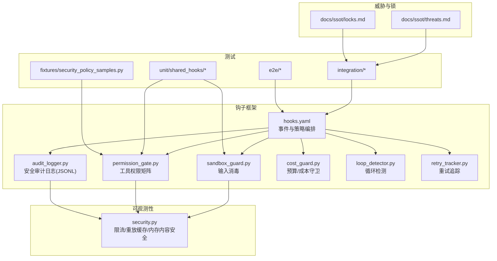
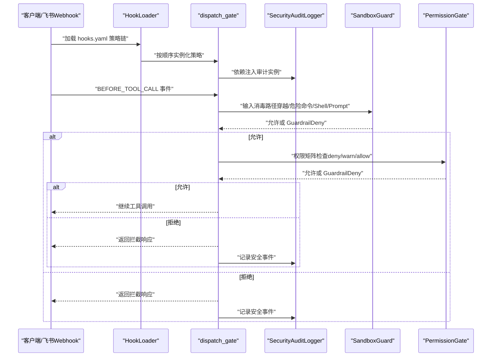
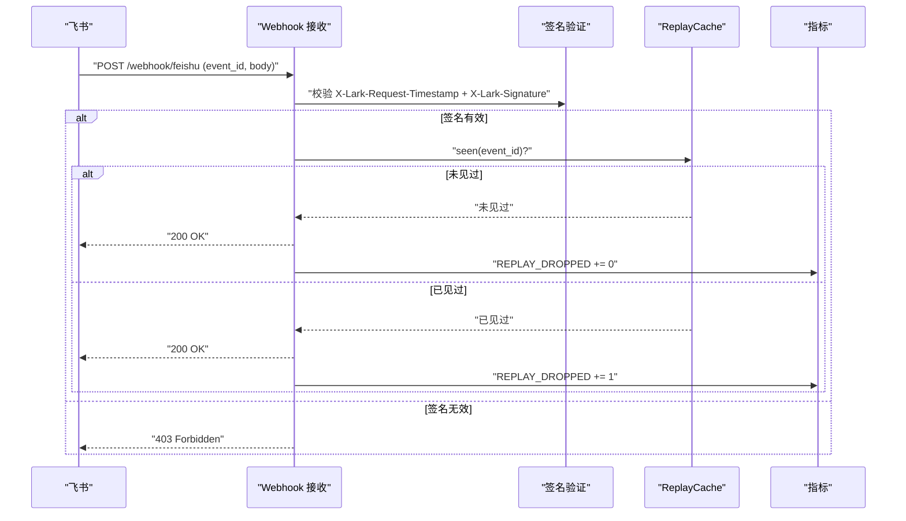
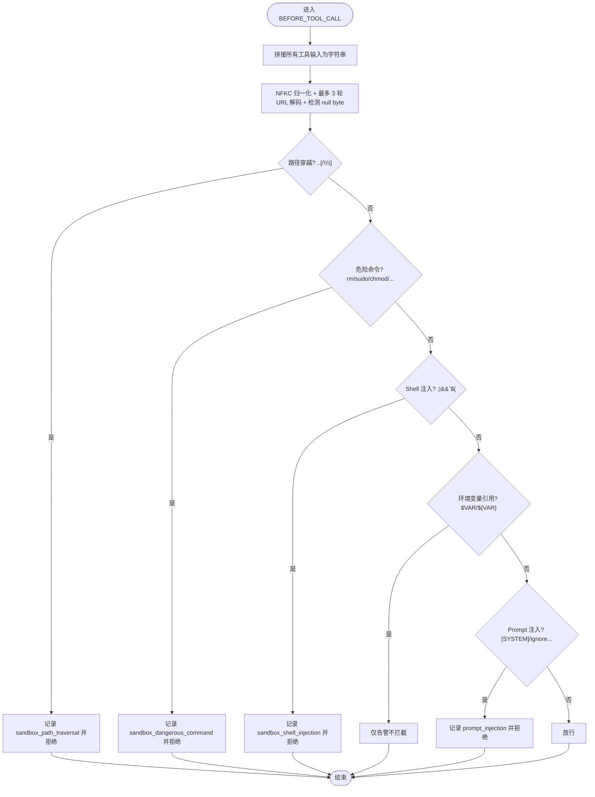
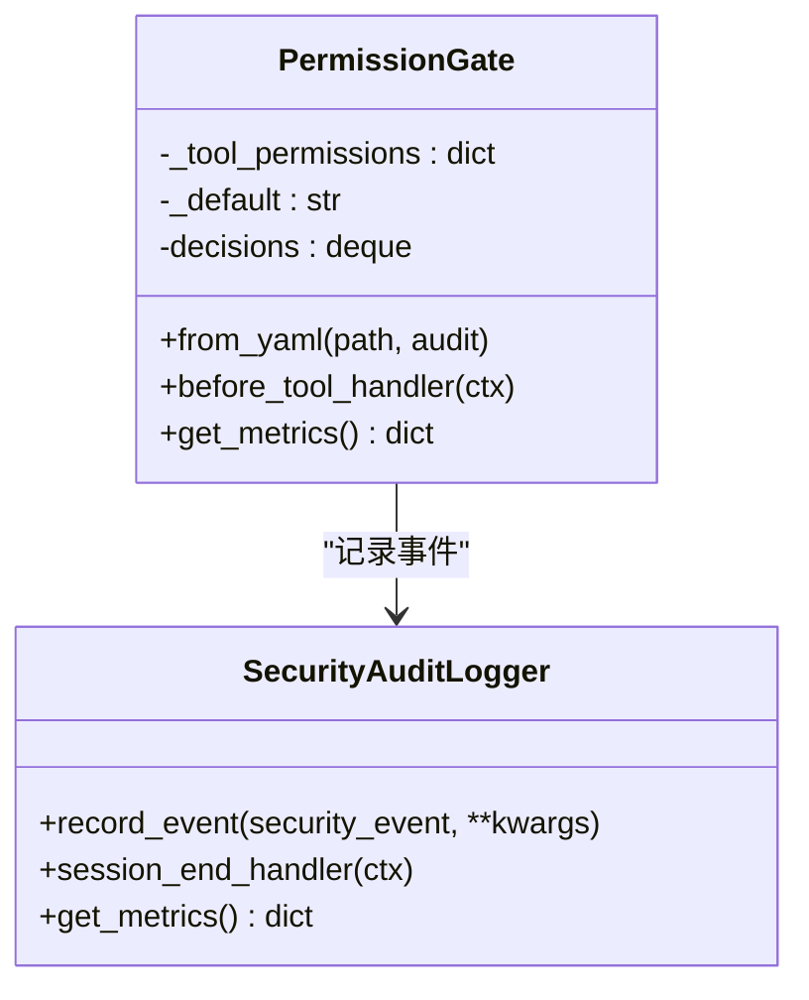
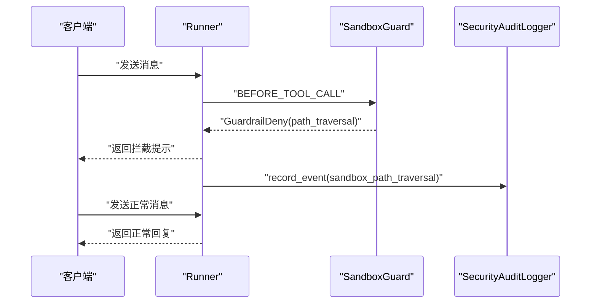
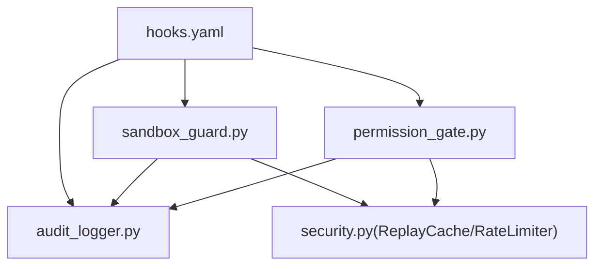

# 安全测试

<cite>
**本文引用的文件**
- [shared_hooks/hooks.yaml](file://shared_hooks/hooks.yaml)
- [shared_hooks/audit_logger.py](file://shared_hooks/audit_logger.py)
- [shared_hooks/sandbox_guard.py](file://shared_hooks/sandbox_guard.py)
- [shared_hooks/permission_gate.py](file://shared_hooks/permission_gate.py)
- [xiaopaw/observability/security.py](file://xiaopaw/observability/security.py)
- [tests/e2e/test_e2e_13_sandbox_guard.py](file://tests/e2e/test_e2e_13_sandbox_guard.py)
- [tests/e2e/test_e2e_15_audit_deny.py](file://tests/e2e/test_e2e_15_audit_deny.py)
- [tests/unit/shared_hooks/test_permission_gate.py](file://tests/unit/shared_hooks/test_permission_gate.py)
- [tests/unit/shared_hooks/test_sandbox_guard.py](file://tests/unit/shared_hooks/test_sandbox_guard.py)
- [tests/fixtures/security_policy_samples.py](file://tests/fixtures/security_policy_samples.py)
- [docs/ssot/threats.md](file://docs/ssot/threats.md)
- [docs/ssot/locks.md](file://docs/ssot/locks.md)
- [docs/10-testing.md](file://docs/10-testing.md)
- [docs/12-hook-hardening.md](file://docs/12-hook-hardening.md)
- [docs/13-test-design-hook-hardening.md](file://docs/13-test-design-hook-hardening.md)
</cite>

## 目录
1. [简介](#简介)
2. [项目结构](#项目结构)
3. [核心组件](#核心组件)
4. [架构总览](#架构总览)
5. [详细组件分析](#详细组件分析)
6. [依赖分析](#依赖分析)
7. [性能考虑](#性能考虑)
8. [故障排查指南](#故障排查指南)
9. [结论](#结论)
10. [附录](#附录)

## 简介
本文件面向 XiaoPaw v2 的安全测试，聚焦三组必做测试与对抗性测试策略，系统阐述 Webhook 签名验证与重放攻击防护、路径遍历攻击、权限提升攻击等关键安全场景的测试方法与自动化流程。文档结合威胁建模与风险评估方法，提供安全测试报告生成、漏洞修复验证与安全回归测试的最佳实践，帮助团队在持续交付中稳健推进安全质量。

## 项目结构
XiaoPaw v2 的安全加固采用“钩子框架 + 策略层”的分层设计：观测层负责结构化日志与链路追踪，策略层通过 hooks.yaml 配置串联多个安全策略（审计、沙箱守卫、权限网关、成本守卫、循环检测、重试追踪）。安全测试覆盖单元、集成与端到端三个层次，并在威胁清单与锁清单中明确风险与防御矩阵。

图表来源
- [shared_hooks/hooks.yaml:1-73](file://shared_hooks/hooks.yaml#L1-L73)
- [shared_hooks/audit_logger.py:1-90](file://shared_hooks/audit_logger.py#L1-L90)
- [shared_hooks/sandbox_guard.py:1-168](file://shared_hooks/sandbox_guard.py#L1-L168)
- [shared_hooks/permission_gate.py:1-107](file://shared_hooks/permission_gate.py#L1-L107)
- [xiaopaw/observability/security.py:1-73](file://xiaopaw/observability/security.py#L1-L73)
- [tests/unit/shared_hooks/test_sandbox_guard.py:1-231](file://tests/unit/shared_hooks/test_sandbox_guard.py#L1-L231)
- [tests/unit/shared_hooks/test_permission_gate.py:1-101](file://tests/unit/shared_hooks/test_permission_gate.py#L1-L101)
- [tests/e2e/test_e2e_13_sandbox_guard.py:1-79](file://tests/e2e/test_e2e_13_sandbox_guard.py#L1-L79)
- [tests/e2e/test_e2e_15_audit_deny.py:1-94](file://tests/e2e/test_e2e_15_audit_deny.py#L1-L94)
- [tests/fixtures/security_policy_samples.py:1-25](file://tests/fixtures/security_policy_samples.py#L1-L25)
- [docs/ssot/threats.md:1-147](file://docs/ssot/threats.md#L1-L147)
- [docs/ssot/locks.md:1-86](file://docs/ssot/locks.md#L1-L86)

章节来源
- [shared_hooks/hooks.yaml:1-73](file://shared_hooks/hooks.yaml#L1-L73)
- [docs/12-hook-hardening.md:559-638](file://docs/12-hook-hardening.md#L559-L638)

## 核心组件
- 安全审计日志（SecurityAuditLogger）：以追加只读 JSONL 记录安全事件，支持会话级摘要，供外部 SIEM 消费。
- 沙箱守卫（SandboxGuard）：在 BEFORE_TOOL_CALL 事件前进行确定性输入消毒，涵盖路径穿越、危险命令、Shell 注入、Prompt 注入与环境变量引用告警。
- 权限网关（PermissionGate）：基于工具名的 deny/warn/allow 三级策略，默认 deny 原则，支持 YAML 配置与决策指标统计。
- 成本守卫（CostGuard）：预算控制与前后轮次事件联动。
- 循环检测（LoopDetector）：阈值驱动的工具/回合循环检测。
- 重试追踪（RetryTracker）：最大重试次数统计。
- 观测性安全工具：滑动窗口限流、事件重放缓存（LRU+TTL）、内存内容安全检查。

章节来源
- [shared_hooks/audit_logger.py:1-90](file://shared_hooks/audit_logger.py#L1-L90)
- [shared_hooks/sandbox_guard.py:1-168](file://shared_hooks/sandbox_guard.py#L1-L168)
- [shared_hooks/permission_gate.py:1-107](file://shared_hooks/permission_gate.py#L1-L107)
- [xiaopaw/observability/security.py:1-73](file://xiaopaw/observability/security.py#L1-L73)

## 架构总览
安全测试围绕 hooks.yaml 的两段式配置展开：观测层（dispatch，fire-and-forget）与策略层（dispatch_gate，可阻断）。策略层以 SecurityAuditLogger 为首，确保即使被 deny 也能记录审计轨迹；SandboxGuard 与 PermissionGate 在 BEFORE_TOOL_CALL 事件上协同，前者兜底输入风险，后者控制工具调用权限。

图表来源
- [shared_hooks/hooks.yaml:27-73](file://shared_hooks/hooks.yaml#L27-L73)
- [shared_hooks/audit_logger.py:14-20](file://shared_hooks/audit_logger.py#L14-L20)
- [shared_hooks/sandbox_guard.py:109-146](file://shared_hooks/sandbox_guard.py#L109-L146)
- [shared_hooks/permission_gate.py:57-94](file://shared_hooks/permission_gate.py#L57-L94)

## 详细组件分析

### Webhook 签名验证与重放攻击防护
- 签名验证：服务端对接飞书 Webhook，要求携带时间戳与签名头；未提供或签名错误应拒绝。
- 重放防护：基于事件 ID 的 LRU+TTL 缓存去重，重复事件在应用层丢弃并计数。
- 自动化测试：集成测试覆盖“无签名拒绝”“错误签名拒绝”“重放事件丢弃并计数”。

图表来源
- [docs/10-testing.md:787-839](file://docs/10-testing.md#L787-L839)
- [xiaopaw/observability/security.py:47-72](file://xiaopaw/observability/security.py#L47-L72)

章节来源
- [docs/10-testing.md:787-839](file://docs/10-testing.md#L787-L839)
- [xiaopaw/observability/security.py:47-72](file://xiaopaw/observability/security.py#L47-L72)

### 路径遍历攻击测试
- 测试目标：阻断相对路径穿越、反斜杠穿越、URL 编码绕过、空字节绕过、MCP 沙箱工具豁免与非沙箱工具严格校验。
- 测试用例覆盖：多种路径穿越 payload、危险命令、Shell 注入、Prompt 注入、环境变量引用告警、长输入性能与空输入处理。
- 端到端验证：发送包含路径穿越的指令，确认被拦截且链路追踪正常。

图表来源
- [shared_hooks/sandbox_guard.py:65-90](file://shared_hooks/sandbox_guard.py#L65-L90)
- [shared_hooks/sandbox_guard.py:109-146](file://shared_hooks/sandbox_guard.py#L109-L146)
- [tests/unit/shared_hooks/test_sandbox_guard.py:25-191](file://tests/unit/shared_hooks/test_sandbox_guard.py#L25-L191)
- [tests/e2e/test_e2e_13_sandbox_guard.py:27-78](file://tests/e2e/test_e2e_13_sandbox_guard.py#L27-L78)

章节来源
- [shared_hooks/sandbox_guard.py:13-22](file://shared_hooks/sandbox_guard.py#L13-L22)
- [shared_hooks/sandbox_guard.py:109-146](file://shared_hooks/sandbox_guard.py#L109-L146)
- [tests/unit/shared_hooks/test_sandbox_guard.py:25-191](file://tests/unit/shared_hooks/test_sandbox_guard.py#L25-L191)
- [tests/e2e/test_e2e_13_sandbox_guard.py:27-78](file://tests/e2e/test_e2e_13_sandbox_guard.py#L27-L78)

### 权限提升攻击测试
- 测试目标：验证默认 deny 原则、显式 allow/warn/deny 策略、YAML 加载与大小写不敏感、决策指标统计。
- 测试用例覆盖：deny 被拦截、allow 放行、warn 放行并记录、默认策略覆盖、YAML 默认值优先、工具名大小写不敏感、指标统计准确性。

图表来源
- [shared_hooks/permission_gate.py:32-107](file://shared_hooks/permission_gate.py#L32-L107)
- [shared_hooks/audit_logger.py:30-90](file://shared_hooks/audit_logger.py#L30-L90)
- [tests/unit/shared_hooks/test_permission_gate.py:17-101](file://tests/unit/shared_hooks/test_permission_gate.py#L17-L101)
- [tests/fixtures/security_policy_samples.py:1-25](file://tests/fixtures/security_policy_samples.py#L1-L25)

章节来源
- [shared_hooks/permission_gate.py:7-22](file://shared_hooks/permission_gate.py#L7-L22)
- [shared_hooks/permission_gate.py:57-94](file://shared_hooks/permission_gate.py#L57-L94)
- [tests/unit/shared_hooks/test_permission_gate.py:17-101](file://tests/unit/shared_hooks/test_permission_gate.py#L17-L101)
- [tests/fixtures/security_policy_samples.py:3-24](file://tests/fixtures/security_policy_samples.py#L3-L24)

### 审计日志与拦截传播链
- 测试目标：拦截后审计日志存在、系统恢复能力、Langfuse 链路完整性。
- 测试步骤：发送安全策略拦截消息，断言回复包含拦截提示；读取审计文件，断言存在路径穿越事件；验证系统在后续正常消息中恢复。

图表来源
- [tests/e2e/test_e2e_15_audit_deny.py:33-93](file://tests/e2e/test_e2e_15_audit_deny.py#L33-L93)
- [shared_hooks/sandbox_guard.py:147-158](file://shared_hooks/sandbox_guard.py#L147-L158)
- [shared_hooks/audit_logger.py:41-70](file://shared_hooks/audit_logger.py#L41-L70)

章节来源
- [tests/e2e/test_e2e_15_audit_deny.py:30-94](file://tests/e2e/test_e2e_15_audit_deny.py#L30-L94)

## 依赖分析
- 策略依赖：hooks.yaml 中策略按顺序实例化，SecurityAuditLogger 必须在首位，否则 SandboxGuard 初始化时审计依赖为空会导致 fail_closed 场景下的系统瘫痪。
- 事件耦合：SandboxGuard 与 PermissionGate 共享审计实例，统一输出到同一 JSONL 文件，便于事后关联分析。
- 观测性工具：ReplayCache 与 RateLimiter 作为应用层安全补充，分别用于重放防护与 DoS 防护。

图表来源
- [shared_hooks/hooks.yaml:27-73](file://shared_hooks/hooks.yaml#L27-L73)
- [shared_hooks/audit_logger.py:14-20](file://shared_hooks/audit_logger.py#L14-L20)
- [shared_hooks/sandbox_guard.py:93-100](file://shared_hooks/sandbox_guard.py#L93-L100)
- [xiaopaw/observability/security.py:47-72](file://xiaopaw/observability/security.py#L47-L72)

章节来源
- [shared_hooks/hooks.yaml:14-20](file://shared_hooks/hooks.yaml#L14-L20)
- [shared_hooks/audit_logger.py:14-20](file://shared_hooks/audit_logger.py#L14-L20)

## 性能考虑
- 输入消毒性能：SandboxGuard 对长输入的处理耗时应小于阈值，单元测试包含长输入性能用例。
- 缓存与锁：ReplayCache 使用 LRU+TTL，避免内存膨胀；锁清单明确了两级锁与跨进程锁的使用场景与失败降级策略。
- 限流：滑动窗口限流按用户维度控制入站速率，缓解 DoS 攻击。

章节来源
- [tests/unit/shared_hooks/test_sandbox_guard.py:215-222](file://tests/unit/shared_hooks/test_sandbox_guard.py#L215-L222)
- [docs/ssot/locks.md:8-35](file://docs/ssot/locks.md#L8-L35)
- [xiaopaw/observability/security.py:11-27](file://xiaopaw/observability/security.py#L11-L27)

## 故障排查指南
- 审计日志缺失：确认 SECURITY_AUDIT_FILE 环境变量或构造函数参数是否设置；检查文件写入权限与磁盘空间。
- 拦截后系统卡死：检查 hooks.yaml 中策略顺序，确保 SecurityAuditLogger 在首位；确认 dispatch_gate 的 fail_closed 行为。
- 重放未生效：确认 ReplayCache 的 event_id 是否正确传入；检查 TTL 与容量配置；核对指标 REPLAY_DROPPED 是否递增。
- 权限策略误判：核对 security.yaml 的 permissions.default 与 tools 映射；确认工具名大小写不敏感逻辑；检查决策指标统计。

章节来源
- [shared_hooks/audit_logger.py:31-40](file://shared_hooks/audit_logger.py#L31-L40)
- [shared_hooks/hooks.yaml:14-20](file://shared_hooks/hooks.yaml#L14-L20)
- [xiaopaw/observability/security.py:47-72](file://xiaopaw/observability/security.py#L47-L72)
- [tests/fixtures/security_policy_samples.py:3-24](file://tests/fixtures/security_policy_samples.py#L3-L24)

## 结论
XiaoPaw v2 的安全测试体系以钩子框架为核心，通过策略层的确定性输入消毒与权限矩阵控制，配合应用层的限流与重放防护，形成完整的安全闭环。三组必做测试（Webhook 签名与重放、路径遍历、权限提升）与对抗性测试用例共同覆盖关键攻击面。结合威胁建模与锁清单，可系统化地识别残余风险并制定补偿措施，保障系统在持续交付中的安全稳定性。

## 附录

### 三组必做测试清单
- Webhook 签名验证与重放防护
  - 无签名/错误签名拒绝
  - 重放事件丢弃并计数
- 路径遍历攻击
  - 相对路径穿越、反斜杠穿越、URL 编码绕过、空字节绕过
  - MCP 沙箱工具豁免与非沙箱工具严格校验
- 权限提升攻击
  - 默认 deny 原则、显式 allow/warn/deny、YAML 加载与大小写不敏感、决策指标统计

章节来源
- [docs/10-testing.md:787-839](file://docs/10-testing.md#L787-L839)
- [tests/unit/shared_hooks/test_sandbox_guard.py:25-191](file://tests/unit/shared_hooks/test_sandbox_guard.py#L25-L191)
- [tests/unit/shared_hooks/test_permission_gate.py:17-101](file://tests/unit/shared_hooks/test_permission_gate.py#L17-L101)

### 对抗性测试策略
- Prompt 注入：系统标签、忽略指令等多语言表达
- Shell 注入：分号、管道、命令替换、子命令组合
- 危险命令：删除、提权、磁盘格式化、动态执行
- 环境变量引用：合法场景告警，避免误拦截
- 路径穿越：编码绕过、空字节、混合分隔符
- 权限绕过：默认 allow 配置、工具名大小写、策略链顺序

章节来源
- [shared_hooks/sandbox_guard.py:13-22](file://shared_hooks/sandbox_guard.py#L13-L22)
- [shared_hooks/permission_gate.py:7-22](file://shared_hooks/permission_gate.py#L7-L22)

### 自动化流程与报告
- 自动化流程：集成测试负责 Webhook 签名与重放；单元测试覆盖策略细节；端到端测试验证拦截与恢复。
- 报告生成：审计日志 JSONL + 会话摘要 + 指标统计；威胁清单与锁清单作为风险与合规依据。
- 修复验证：针对拦截事件的修复需重新运行相应测试集；回归测试覆盖策略链与可观测性工具。
- 安全回归：在每次发布前执行三组必做测试与对抗性用例，确保策略链与防护工具未退化。

章节来源
- [docs/ssot/threats.md:134-147](file://docs/ssot/threats.md#L134-L147)
- [docs/ssot/locks.md:79-86](file://docs/ssot/locks.md#L79-L86)
- [tests/e2e/test_e2e_13_sandbox_guard.py:27-78](file://tests/e2e/test_e2e_13_sandbox_guard.py#L27-L78)
- [tests/e2e/test_e2e_15_audit_deny.py:33-93](file://tests/e2e/test_e2e_15_audit_deny.py#L33-L93)