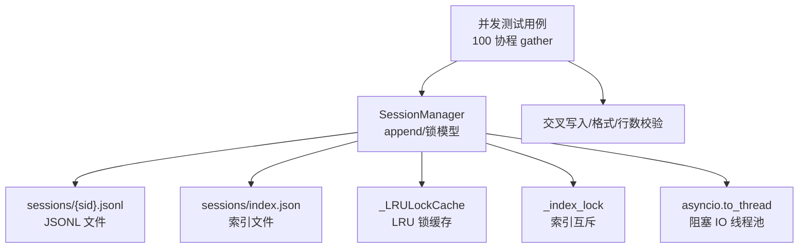
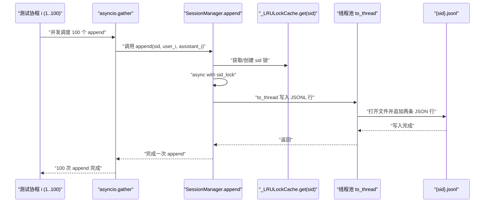
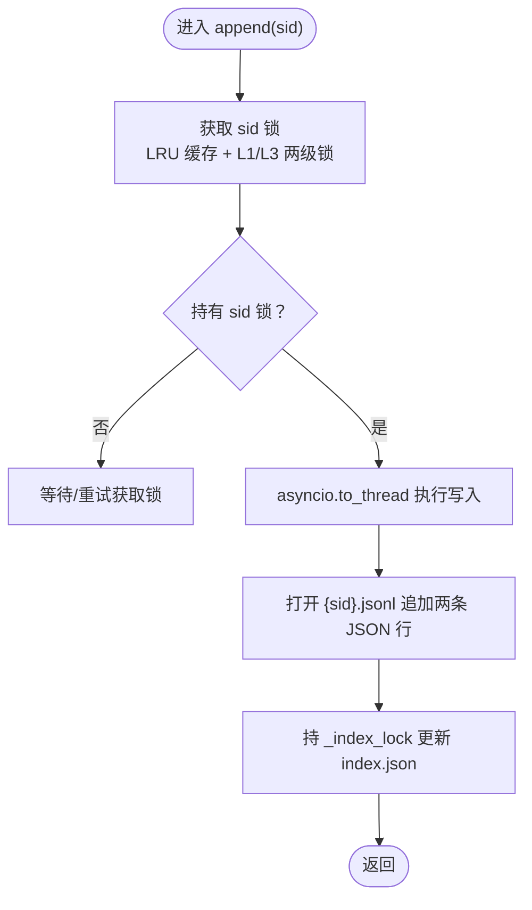
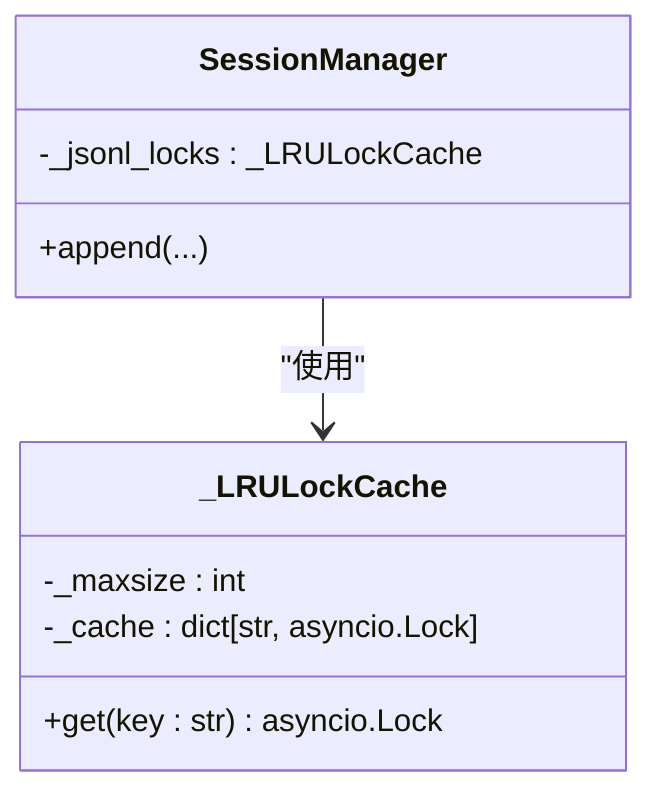
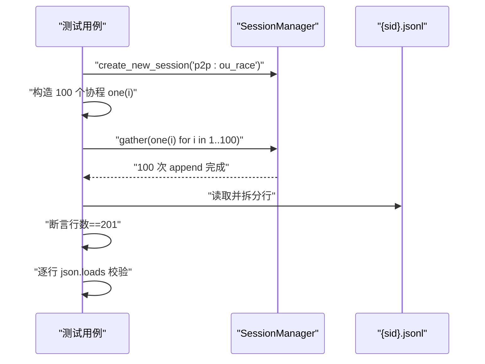
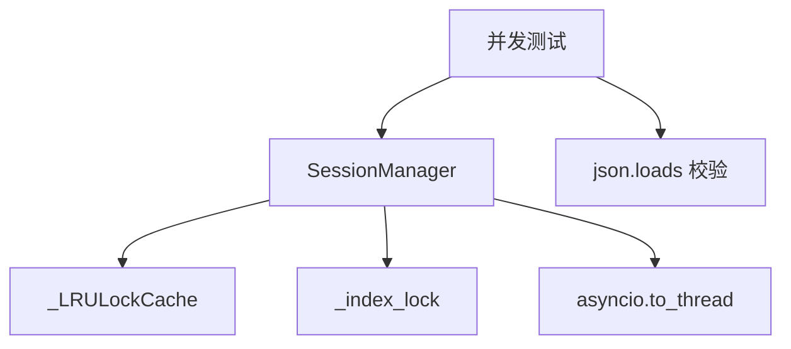

# JSONL 并发追加测试

<cite>
**本文引用的文件**
- [xiaopaw/session/manager.py](file://xiaopaw/session/manager.py)
- [xiaopaw/session/models.py](file://xiaopaw/session/models.py)
- [docs/10-testing.md](file://docs/10-testing.md)
- [docs/05-concurrency.md](file://docs/05-concurrency.md)
- [docs/02-modules.md](file://docs/02-modules.md)
- [docs/concurrency-verification-report.md](file://docs/concurrency-verification-report.md)
</cite>

## 目录
1. [简介](#简介)
2. [项目结构](#项目结构)
3. [核心组件](#核心组件)
4. [架构总览](#架构总览)
5. [详细组件分析](#详细组件分析)
6. [依赖关系分析](#依赖关系分析)
7. [性能考量](#性能考量)
8. [故障排查指南](#故障排查指南)
9. [结论](#结论)
10. [附录](#附录)

## 简介
本文件面向 XiaoPaw v2 的 JSONL 并发追加测试，围绕“同一会话 ID（sid）下 100 个协程并发 append”的场景，系统阐述测试设计、验证方法与实现细节。重点包括：
- SessionManager.append 的线程安全实现与锁模型
- per-session 文件互斥与 LRU 锁缓存策略
- asyncio.gather 并发模式与锁生命周期管理
- 交叉写入检测、JSONL 格式验证与行数统计
- 竞态条件检测、内存泄漏预防与性能基准最佳实践

## 项目结构
与 JSONL 并发追加测试直接相关的代码与文档分布如下：
- 会话管理与 JSONL 写入：xiaopaw/session/manager.py
- 会话与消息数据模型：xiaopaw/session/models.py
- 并发正确性测试目标与用例：docs/10-testing.md
- 并发与锁模型设计：docs/05-concurrency.md
- 模块接口与变更说明：docs/02-modules.md
- 并发验证与执行器细节：docs/concurrency-verification-report.md

图表来源
- [xiaopaw/session/manager.py:132-154](file://xiaopaw/session/manager.py#L132-L154)
- [xiaopaw/session/manager.py:18-35](file://xiaopaw/session/manager.py#L18-L35)
- [docs/10-testing.md:699-718](file://docs/10-testing.md#L699-L718)

章节来源
- [xiaopaw/session/manager.py:1-183](file://xiaopaw/session/manager.py#L1-L183)
- [xiaopaw/session/models.py:1-38](file://xiaopaw/session/models.py#L1-L38)
- [docs/10-testing.md:687-718](file://docs/10-testing.md#L687-L718)
- [docs/05-concurrency.md:331-441](file://docs/05-concurrency.md#L331-L441)
- [docs/02-modules.md:269-309](file://docs/02-modules.md#L269-L309)
- [docs/concurrency-verification-report.md:58-70](file://docs/concurrency-verification-report.md#L58-L70)

## 核心组件
- SessionManager.append：负责同一 sid 的并发写入，采用两级锁模型与线程池阻塞 IO，确保 JSONL 原子追加。
- _LRULockCache：基于 LRUCache 的 per-session 锁缓存，控制活跃会话锁数量上限，避免 OOM。
- _index_lock：保护 sessions/index.json 的读写与更新，确保索引一致性。
- asyncio.to_thread：将阻塞式文件写入放入线程池，避免阻塞事件循环。

章节来源
- [xiaopaw/session/manager.py:18-35](file://xiaopaw/session/manager.py#L18-L35)
- [xiaopaw/session/manager.py:132-154](file://xiaopaw/session/manager.py#L132-L154)
- [docs/05-concurrency.md:339-407](file://docs/05-concurrency.md#L339-L407)

## 架构总览
下图展示了并发 append 的整体流程与锁交互：

图表来源
- [xiaopaw/session/manager.py:132-154](file://xiaopaw/session/manager.py#L132-L154)
- [docs/10-testing.md:699-718](file://docs/10-testing.md#L699-L718)

## 详细组件分析

### SessionManager.append 的并发与原子性保障
- 两级锁模型
  - L1：_dispatch_lock 保护 LRUCache 的 setdefault 原子性，避免驱逐后并发创建多把锁。
  - L3：_jsonl_locks[sid] 保护 JSONL 追加写入，确保同一 sid 的写入互斥。
- 文件写入策略
  - 使用 asyncio.to_thread 将阻塞式文件写入放入线程池，避免阻塞事件循环。
  - 写入过程为“追加两条 JSON 行”，形成 user/assistant 成对消息。
- 索引更新
  - 写入完成后，再次持 _index_lock 更新 sessions/index.json 中的 message_count，保证索引与文件一致。

图表来源
- [xiaopaw/session/manager.py:132-168](file://xiaopaw/session/manager.py#L132-L168)
- [docs/05-concurrency.md:339-374](file://docs/05-concurrency.md#L339-L374)

章节来源
- [xiaopaw/session/manager.py:132-168](file://xiaopaw/session/manager.py#L132-L168)
- [docs/05-concurrency.md:339-374](file://docs/05-concurrency.md#L339-L374)

### _LRULockCache：LRU 锁缓存与竞态规避
- 目标：限制活跃会话锁数量，避免 OOM；通过 L1 锁保护 setdefault 原子性，避免驱逐后并发创建多把锁。
- 行为：当缓存满时淘汰最久未使用项；get 时若不存在则创建新锁并插入缓存。
- 竞态说明：LRUCache 本身非原子 setdefault，必须配合 _dispatch_lock 使用。

图表来源
- [xiaopaw/session/manager.py:18-35](file://xiaopaw/session/manager.py#L18-L35)

章节来源
- [xiaopaw/session/manager.py:18-35](file://xiaopaw/session/manager.py#L18-L35)
- [docs/05-concurrency.md:376-407](file://docs/05-concurrency.md#L376-L407)

### 并发测试设计与验证方法
- 测试目标：100 个协程并发 append 到同一 sid，确保 JSONL 不交叉、每行合法 JSON、条数正确。
- 测试步骤：
  - 创建会话 sid
  - 使用 asyncio.gather 并发调度 100 次 append（每个协程传入不同的 user/assistant 文本）
  - 读取 {sid}.jsonl，统计行数并逐行解析 JSON，断言无异常
- 验证指标：
  - 行数断言：期望 1（meta）+ 200（100 对 user/assistant）= 201 行
  - JSON 格式断言：逐行 json.loads 不抛异常
  - 交叉写入断言：通过每行合法 JSON 间接保证

图表来源
- [docs/10-testing.md:699-718](file://docs/10-testing.md#L699-L718)

章节来源
- [docs/10-testing.md:699-718](file://docs/10-testing.md#L699-L718)

### asyncio.gather 并发模式与锁生命周期管理
- 并发模式：使用 asyncio.gather 并发调度 100 个协程，每个协程调用 append。
- 锁生命周期：
  - 获取 sid 锁：_LRULockCache.get(sid) 返回或创建 asyncio.Lock
  - 持有锁：async with sid_lock 保护写入
  - 释放锁：写入完成后立即释放，避免阻塞 _dispatch_lock
  - 索引更新：写入完成后持 _index_lock 更新 index.json
- 事件循环与阻塞 IO：append 内部通过 asyncio.to_thread 将文件写入移至线程池，避免阻塞主循环。

章节来源
- [xiaopaw/session/manager.py:132-154](file://xiaopaw/session/manager.py#L132-L154)
- [docs/05-concurrency.md:423-431](file://docs/05-concurrency.md#L423-L431)

### 文件 I/O 原子性与交叉写入检测
- 原子性策略：
  - 追加写入：每次写两条 JSON 行，使用“追加”模式打开文件，避免随机写导致的交叉。
  - 线程池隔离：写入在独立线程执行，避免协程间抢占。
- 交叉写入检测：
  - 通过逐行解析 JSON 的方式验证：若出现交叉写入，某行将无法解析为合法 JSON，断言失败。
  - 行数统计：确保消息对数量与预期一致（100 对 = 200 行消息 + 1 行 meta）。

章节来源
- [xiaopaw/session/manager.py:149-154](file://xiaopaw/session/manager.py#L149-L154)
- [docs/10-testing.md:713-718](file://docs/10-testing.md#L713-L718)

### 长消息场景下的健壮性
- 长消息设计目的：通过更长的 user/assistant 文本，增加交叉写入暴露的概率，从而更严格地验证互斥与原子性。
- 验证要点：即使在高负载与长文本情况下，仍需满足“每行合法 JSON、行数正确”。

章节来源
- [docs/10-testing.md:706-709](file://docs/10-testing.md#L706-L709)

### 竞态条件检测与已知风险
- 已知风险：v1 中 LRUCache 驱逐后并发创建多把锁的竞态，v2 通过 _dispatch_lock 保护 setdefault 原子性解决。
- 风险验证：并发测试用例覆盖“同一 sid 多协程并发 append”，验证互斥与一致性。

章节来源
- [docs/05-concurrency.md:376-407](file://docs/05-concurrency.md#L376-L407)
- [docs/10-testing.md:687-718](file://docs/10-testing.md#L687-L718)

### 内存泄漏预防与锁缓存容量
- LRU 锁缓存容量：默认上限 1000，避免活跃会话过多导致 OOM。
- 容量调优：若日活接近上限，建议提升配置；超过上限将出现驱逐，需关注互斥有效性。
- 内存回归：可结合 pytest-memray 对锁生命周期与内存增长进行回归检测。

章节来源
- [docs/05-concurrency.md:401-407](file://docs/05-concurrency.md#L401-L407)
- [docs/05-concurrency.md:1049-1075](file://docs/05-concurrency.md#L1049-L1075)

### 性能基准与最佳实践
- 并发规模：100 协程并发 append 同一 sid，验证在高并发下的稳定性与正确性。
- I/O 隔离：使用 asyncio.to_thread 将阻塞 IO 移出事件循环，降低主线程延迟。
- 锁粒度：细粒度 per-session 锁，避免全局锁阻塞。
- 压测建议：可参考文档中的压测用例思路，扩展到更多 routing_key 与消息长度组合。

章节来源
- [docs/05-concurrency.md:325-329](file://docs/05-concurrency.md#L325-L329)
- [docs/05-concurrency.md:423-431](file://docs/05-concurrency.md#L423-L431)

## 依赖关系分析
- SessionManager 依赖：
  - _LRULockCache：提供 per-session 锁缓存
  - _index_lock：保护 index.json
  - asyncio.to_thread：隔离阻塞 IO
- 测试依赖：
  - asyncio.gather：并发调度
  - JSON 解析：交叉写入与格式验证

图表来源
- [xiaopaw/session/manager.py:18-47](file://xiaopaw/session/manager.py#L18-L47)
- [docs/10-testing.md:699-718](file://docs/10-testing.md#L699-L718)

章节来源
- [xiaopaw/session/manager.py:18-47](file://xiaopaw/session/manager.py#L18-L47)
- [docs/10-testing.md:699-718](file://docs/10-testing.md#L699-L718)

## 性能考量
- 事件循环延迟：通过 asyncio.to_thread 将阻塞 IO 移至线程池，事件循环延迟近似任务切换开销。
- 锁持有时间：append 内部锁持有时间短（毫秒级），避免阻塞 _dispatch_lock。
- 并发扩展：在合理容量上限下，可进一步扩大并发规模进行压力测试，观察延迟与吞吐变化。

章节来源
- [docs/05-concurrency.md:423-431](file://docs/05-concurrency.md#L423-L431)

## 故障排查指南
- 交叉写入/格式错误：
  - 现象：逐行解析 JSON 抛异常
  - 排查：确认是否使用 per-session 锁；检查 LRUCache 是否被过早驱逐
- 行数不符：
  - 现象：行数不等于 201
  - 排查：检查 append 是否成对写入两条 JSON 行；确认索引更新逻辑
- 锁容量不足：
  - 现象：活跃会话数接近上限，出现驱逐
  - 排查：调整配置上限；监控活跃会话数量
- 执行器与僵尸任务：
  - 现象：shutdown 时仍有线程未结束
  - 排查：遵循文档建议的 shutdown 流程，接受“僵尸线程”并记录指标

章节来源
- [docs/10-testing.md:713-718](file://docs/10-testing.md#L713-L718)
- [docs/concurrency-verification-report.md:58-70](file://docs/concurrency-verification-report.md#L58-L70)

## 结论
通过两级锁模型、LRU 锁缓存与线程池隔离的阻塞 IO，XiaoPaw v2 的 SessionManager.append 在“同一 sid 100 协程并发 append”的场景下实现了强互斥与原子性保障。并发测试用例以“交叉写入检测、JSONL 格式验证、行数统计”三位一体的方式，全面验证了正确性与鲁棒性。结合容量调优与性能基准实践，可在高并发场景下保持稳定与可观测。

## 附录
- 相关模块接口与变更：参见模块文档中的接口定义与 v2.1 关键变化。
- 并发验证报告：包含执行器与跨 loop 锁等细节，有助于深入理解并发模型。

章节来源
- [docs/02-modules.md:269-309](file://docs/02-modules.md#L269-L309)
- [docs/concurrency-verification-report.md:58-70](file://docs/concurrency-verification-report.md#L58-L70)