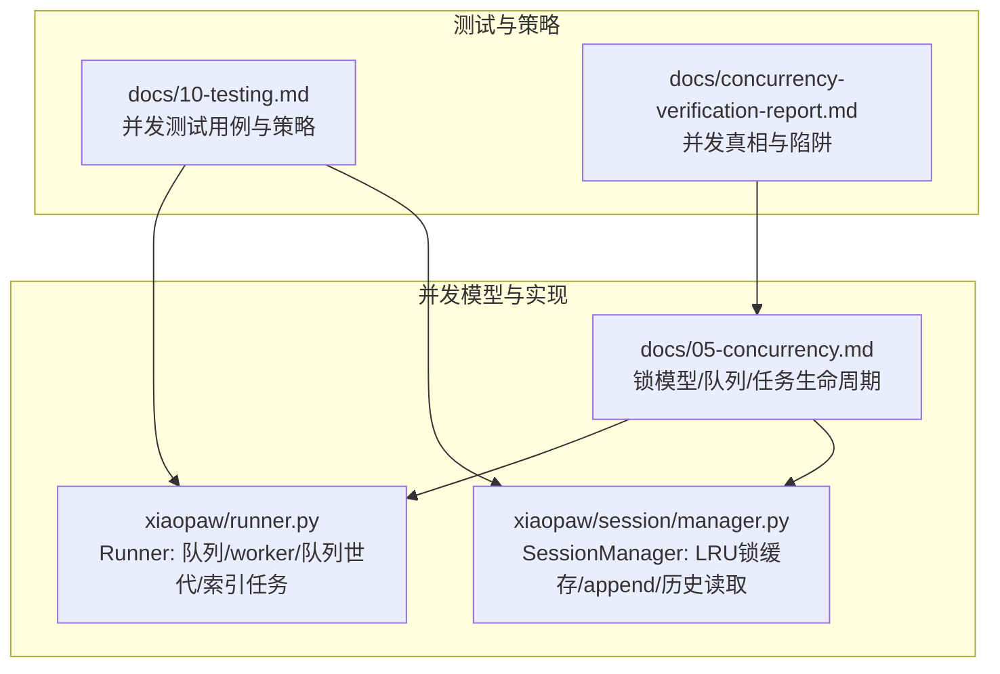
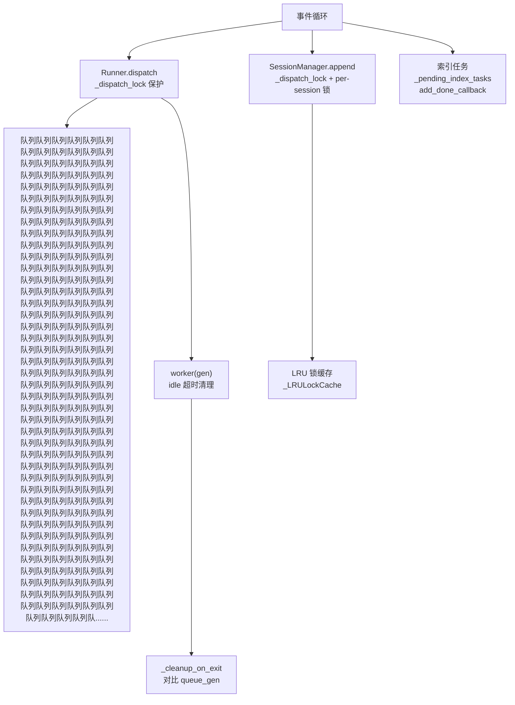
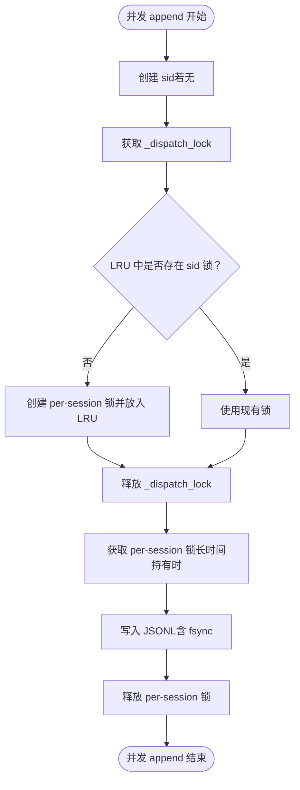
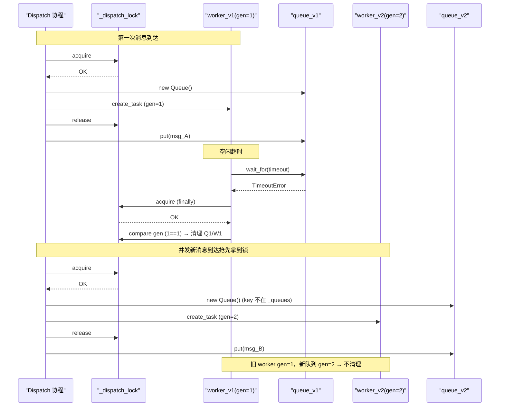
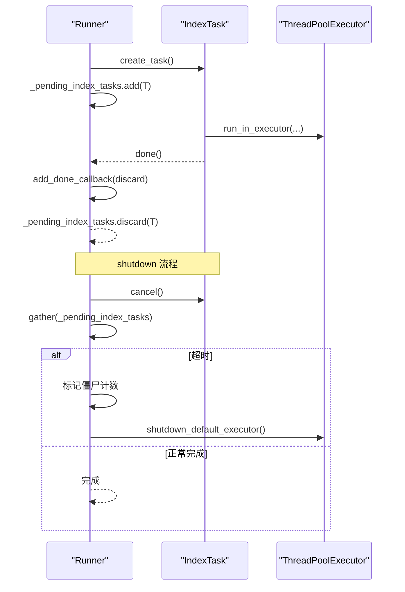
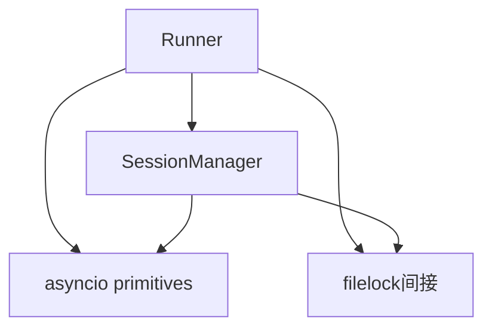

# 并发正确性测试

<cite>
**本文引用的文件**
- [docs/10-testing.md](file://docs/10-testing.md)
- [docs/05-concurrency.md](file://docs/05-concurrency.md)
- [docs/concurrency-verification-report.md](file://docs/concurrency-verification-report.md)
- [xiaopaw/runner.py](file://xiaopaw/runner.py)
- [xiaopaw/session/manager.py](file://xiaopaw/session/manager.py)
</cite>

## 目录
1. [简介](#简介)
2. [项目结构](#项目结构)
3. [核心组件](#核心组件)
4. [架构总览](#架构总览)
5. [详细组件分析](#详细组件分析)
6. [依赖分析](#依赖分析)
7. [性能考虑](#性能考虑)
8. [故障排查指南](#故障排查指南)
9. [结论](#结论)
10. [附录](#附录)

## 简介
本文件面向 XiaoPaw v2 的并发正确性测试，系统化解析三组“必做”并发测试的设计目标、验证方法与实现原理，涵盖：
- JSONL 并发 append（同 sid）
- Runner queue_gen 竞态
- pending_index_tasks GC

文档同时解释 asyncio 并发模型、锁机制与异步任务管理在测试中的应用，并提供内存泄漏检测、性能基准与稳定性验证的最佳实践建议。

## 项目结构
围绕并发正确性测试的相关文档与实现主要分布在以下位置：
- 测试策略与三组并发测试用例定义：docs/10-testing.md
- 并发模型与锁体系、队列与任务生命周期说明：docs/05-concurrency.md
- 并发真相报告（cachetools/LRU 竞态、ContextVar、executor shutdown 等）：docs/concurrency-verification-report.md
- Runner 实现（队列、worker 生命周期、队列世代、索引任务管理）：xiaopaw/runner.py
- SessionManager 实现（LRU 锁缓存、JSONL append、历史读取）：xiaopaw/session/manager.py

图表来源
- [docs/10-testing.md:687-786](file://docs/10-testing.md#L687-L786)
- [docs/05-concurrency.md:31-120](file://docs/05-concurrency.md#L31-L120)
- [xiaopaw/runner.py:33-108](file://xiaopaw/runner.py#L33-L108)
- [xiaopaw/session/manager.py:38-168](file://xiaopaw/session/manager.py#L38-L168)

章节来源
- [docs/10-testing.md:687-786](file://docs/10-testing.md#L687-L786)
- [docs/05-concurrency.md:31-120](file://docs/05-concurrency.md#L31-L120)

## 核心组件
- Runner：负责 per-routing_key 队列、worker 生命周期、队列世代（queue_gen）与索引任务集合管理。其并发正确性体现在：
  - 通过 _dispatch_lock 保护队列/worker/队列世代的并发修改
  - 通过 queue_gen 防止 worker idle 清理误删新队列
  - 通过 _pending_index_tasks 集合与 add_done_callback 实现 fire-and-forget 任务的 GC 与 shutdown 等待
- SessionManager：负责会话索引与 JSONL 文件的并发安全写入，核心在于：
  - LRU 锁缓存（_LRULockCache）+ 两级锁（_dispatch_lock + per-session 锁）防止并发写入交叉
  - 历史读取通过 asyncio.to_thread 避免阻塞事件循环

章节来源
- [xiaopaw/runner.py:33-108](file://xiaopaw/runner.py#L33-L108)
- [xiaopaw/session/manager.py:38-168](file://xiaopaw/session/manager.py#L38-L168)

## 架构总览
XiaoPaw v2 的并发模型建立在“单事件循环、单进程、单节点”的前提下，所有并发控制围绕以下原则：
- 锁粒度最小化：按 routing_key、session_id、topic 粒度加锁
- 锁持有时间最短化：仅在临界区内持锁，IO 与 LLM 调用不持锁
- 任务生命周期强引用 + 回调清理：避免 Python 3.12+ 的 GC 取消问题
- 队列世代机制：解决 worker idle 清理与并发 dispatch 的竞态

图表来源
- [docs/05-concurrency.md:104-222](file://docs/05-concurrency.md#L104-L222)
- [xiaopaw/runner.py:60-108](file://xiaopaw/runner.py#L60-L108)
- [xiaopaw/session/manager.py:132-168](file://xiaopaw/session/manager.py#L132-L168)

## 详细组件分析

### JSONL 并发 append（同 sid）
- 设计目标
  - 100 个协程并发 append 到同一 sid，确保：
    - JSONL 不交叉写入
    - 每行合法 JSON
    - 条数正确（1 条 meta + 200 条消息）
- 实现原理与验证方法
  - 两级锁：SessionManager._dispatch_lock 保护“检查 + setdefault + 获取”三步，避免 LRU 驱逐后并发创建多把锁导致互斥失效
  - per-session 锁：获取到的 asyncio.Lock 用于长时间持有时的互斥，避免阻塞 _dispatch_lock
  - 验证：并发调用后读取 .jsonl，断言行数与 json.loads 可用性
- 竞态条件与规避
  - LRU 驱逐后并发 getter 会各自新建锁，必须通过 _dispatch_lock 保护 setdefault
  - 若 maxsize 不足以承载峰值活跃 session，会出现两把锁并存，互斥失效
- 测试用例路径
  - [docs/10-testing.md:694-718](file://docs/10-testing.md#L694-L718)

图表来源
- [docs/05-concurrency.md:339-407](file://docs/05-concurrency.md#L339-L407)
- [xiaopaw/session/manager.py:132-168](file://xiaopaw/session/manager.py#L132-L168)

章节来源
- [docs/10-testing.md:694-718](file://docs/10-testing.md#L694-L718)
- [docs/05-concurrency.md:339-407](file://docs/05-concurrency.md#L339-L407)
- [xiaopaw/session/manager.py:132-168](file://xiaopaw/session/manager.py#L132-L168)

### Runner queue_gen 竞态
- 设计目标
  - worker idle timeout 清理旧 queue 的同时，dispatch 写入新消息，queue_gen 世代机制保证新 queue 不被误删
- 实现原理与验证方法
  - dispatch 时无条件 +1 并重建 queue/worker，记录 gen
  - worker 退出时对比 gen，仅当 gen 相等才清理队列/worker/队列世代
  - 测试通过 _simulate_stale_cleanup 模拟旧 worker finally 清理逻辑，验证 gen 不匹配时不清理新队列
- 竞态条件与规避
  - v1：基于“是否 current_task”的判断不足以防止竞态
  - v2：引入 queue_gen，确保并发 dispatch 与 worker idle 清理的正确性
- 测试用例路径
  - [docs/10-testing.md:725-747](file://docs/10-testing.md#L725-L747)

图表来源
- [docs/05-concurrency.md:179-222](file://docs/05-concurrency.md#L179-L222)
- [docs/10-testing.md:725-747](file://docs/10-testing.md#L725-L747)
- [xiaopaw/runner.py:60-108](file://xiaopaw/runner.py#L60-L108)

章节来源
- [docs/10-testing.md:725-747](file://docs/10-testing.md#L725-L747)
- [docs/05-concurrency.md:179-222](file://docs/05-concurrency.md#L179-L222)
- [xiaopaw/runner.py:60-108](file://xiaopaw/runner.py#L60-L108)

### pending_index_tasks GC
- 设计目标
  - fire-and-forget 的索引 task 完成后自动从集合中 discard；shutdown 时能等齐或统计僵尸
- 实现原理与验证方法
  - Runner 维护 _pending_index_tasks 集合，创建 task 后添加回调，完成后自动从集合移除
  - shutdown 时先 cancel 所有 pending task，再 gather 等待；若超时则记录僵尸计数指标
  - 测试验证：
    - 任务完成后集合清空
    - shutdown 能等待完成或统计僵尸
- 竞态条件与规避
  - v1：局部 create_task 未强引用，Python 3.12+ 可能被 GC 取消，导致索引写入中断
  - v2：通过集合强引用 + 回调清理，避免 GC 导致的任务丢失
- 测试用例路径
  - [docs/10-testing.md:754-783](file://docs/10-testing.md#L754-L783)

图表来源
- [docs/05-concurrency.md:444-530](file://docs/05-concurrency.md#L444-L530)
- [docs/10-testing.md:754-783](file://docs/10-testing.md#L754-L783)
- [xiaopaw/runner.py:318-334](file://xiaopaw/runner.py#L318-L334)

章节来源
- [docs/10-testing.md:754-783](file://docs/10-testing.md#L754-L783)
- [docs/05-concurrency.md:444-530](file://docs/05-concurrency.md#L444-L530)
- [xiaopaw/runner.py:318-334](file://xiaopaw/runner.py#L318-L334)

## 依赖分析
- 组件耦合
  - Runner 与 SessionManager：Runner 在 _handle 中调用 SessionManager.append，append 使用 per-session 锁保证互斥
  - Runner 内部：_dispatch_lock 保护队列/worker/队列世代；queue_gen 防止竞态；_pending_index_tasks 集合管理索引任务
- 外部依赖
  - asyncio primitives：Lock、Queue、Semaphore、Event、to_thread、wait_for、shutdown_default_executor
  - filelock：跨进程锁（Cron 与 memory-save），与并发正确性测试无直接耦合
- 潜在循环依赖
  - 无直接循环依赖；模块间通过方法调用与上下文传递耦合

图表来源
- [xiaopaw/runner.py:60-108](file://xiaopaw/runner.py#L60-L108)
- [xiaopaw/session/manager.py:132-168](file://xiaopaw/session/manager.py#L132-L168)

章节来源
- [xiaopaw/runner.py:60-108](file://xiaopaw/runner.py#L60-L108)
- [xiaopaw/session/manager.py:132-168](file://xiaopaw/session/manager.py#L132-L168)

## 性能考虑
- 并发压测预期
  - 100 个 routing_key，每个投递 20 条消息，队列最大长度 10；预期部分 dispatch 因 queue 满阻塞，但最终所有消息完成且顺序正确
- 事件循环延迟
  - 历史读取通过 asyncio.to_thread 避免阻塞；线程池读取文件，事件循环延迟≈任务切换开销
- 锁与任务生命周期
  - 锁持有时间短，IO 与 LLM 调用不持锁；索引任务通过回调自动清理，避免 GC 导致的僵尸任务
- 平台与工具
  - pytest-memray 仅支持 Linux/macOS，Windows 开发者需改走 WSL2 或跳过 memray 子任务

章节来源
- [docs/10-testing.md:325-329](file://docs/10-testing.md#L325-L329)
- [docs/05-concurrency.md:409-431](file://docs/05-concurrency.md#L409-L431)
- [docs/10-testing.md:116-118](file://docs/10-testing.md#L116-L118)

## 故障排查指南
- cachetools.LRUCache 并发竞态
  - 现象：LRU 驱逐后并发 getter 会各自新建锁，出现两把锁并存，互斥被破坏
  - 解决：通过 _dispatch_lock 保护“检查 + setdefault + 获取”，并在 maxsize 足够时避免持续驱逐
  - 参考：[docs/concurrency-verification-report.md:6-21](file://docs/concurrency-verification-report.md#L6-L21)
- ContextVar 与 to_thread/run_in_executor
  - 现象：run_in_executor 不自动 copy_context，to_thread 从 3.9 起自动 copy_context
  - 解决：使用 asyncio.to_thread 或在 run_in_executor 中手动 copy_context
  - 参考：[docs/concurrency-verification-report.md:23-40](file://docs/concurrency-verification-report.md#L23-L40)
- executor shutdown 与僵尸线程
  - 现象：gather + wait_for 取消仅取消 Task，底层线程不可强制终止，可能出现僵尸线程
  - 解决：使用公开 async API shutdown_default_executor，或记录僵尸计数指标
  - 参考：[docs/concurrency-verification-report.md:47-58](file://docs/concurrency-verification-report.md#L47-L58)
- asyncio.Lock 跨 loop
  - 现象：跨 loop 使用同一把锁会报 RuntimeError
  - 解决：所有锁在 __init__ 中创建，不在模块级；测试串行 asyncio.run 更安全
  - 参考：[docs/concurrency-verification-report.md:60-64](file://docs/concurrency-verification-report.md#L60-L64)

章节来源
- [docs/concurrency-verification-report.md:6-21](file://docs/concurrency-verification-report.md#L6-L21)
- [docs/concurrency-verification-report.md:23-40](file://docs/concurrency-verification-report.md#L23-L40)
- [docs/concurrency-verification-report.md:47-58](file://docs/concurrency-verification-report.md#L47-L58)
- [docs/concurrency-verification-report.md:60-64](file://docs/concurrency-verification-report.md#L60-L64)

## 结论
XiaoPaw v2 的并发正确性测试围绕三组关键场景构建：JSONL 并发 append、Runner queue_gen 竞态与 pending_index_tasks GC。通过两级锁、队列世代与回调清理等机制，系统在单事件循环、单进程、单节点的前提下实现了高并发下的数据一致性与稳定性。结合并发真相报告中的陷阱与最佳实践，可进一步提升系统的健壮性与可观测性。

## 附录
- 并发测试用例清单
  - JSONL 并发 append（同 sid）：[docs/10-testing.md:694-718](file://docs/10-testing.md#L694-L718)
  - Runner queue_gen 竞态：[docs/10-testing.md:725-747](file://docs/10-testing.md#L725-L747)
  - pending_index_tasks GC：[docs/10-testing.md:754-783](file://docs/10-testing.md#L754-L783)
- 并发模型与锁体系参考
  - [docs/05-concurrency.md:31-120](file://docs/05-concurrency.md#L31-L120)
  - [docs/05-concurrency.md:104-222](file://docs/05-concurrency.md#L104-L222)
  - [docs/05-concurrency.md:444-530](file://docs/05-concurrency.md#L444-L530)
- 实现参考
  - [xiaopaw/runner.py:33-108](file://xiaopaw/runner.py#L33-L108)
  - [xiaopaw/session/manager.py:38-168](file://xiaopaw/session/manager.py#L38-L168)