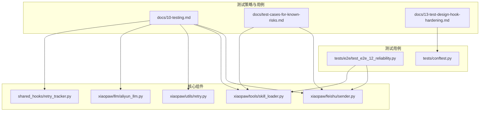
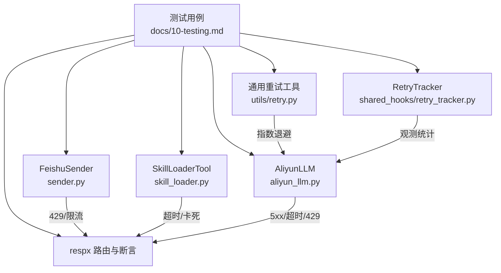
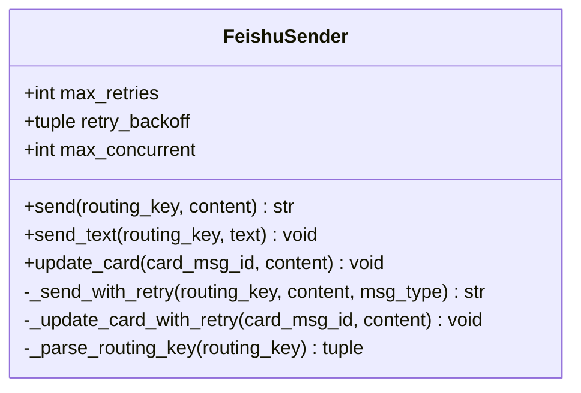
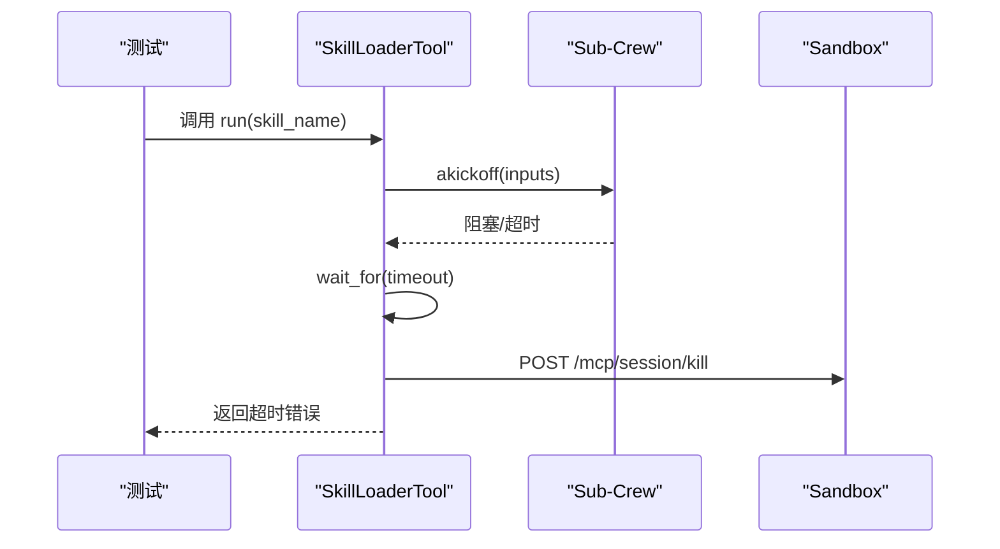
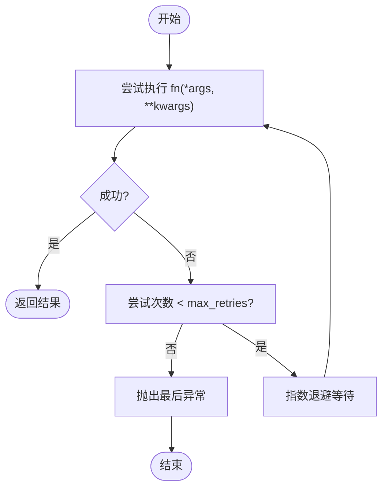
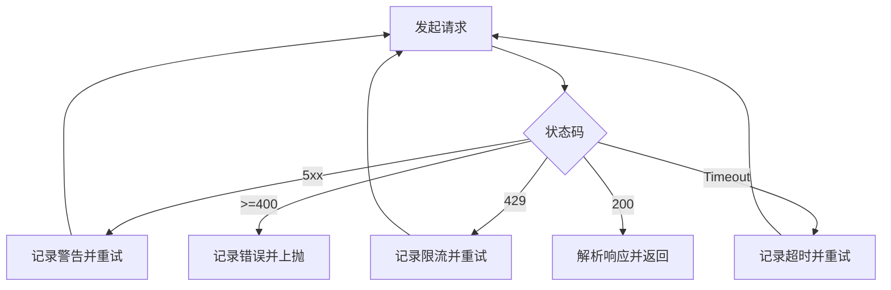
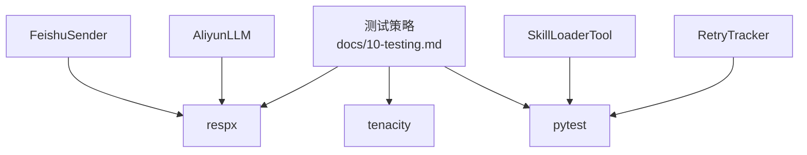
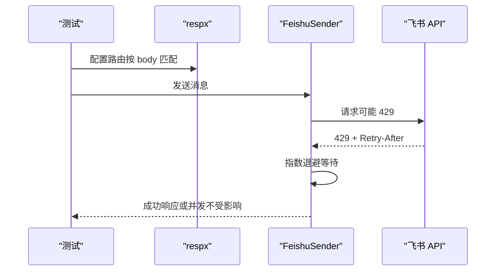

# 故障注入测试

<cite>
**本文引用的文件**
- [docs/10-testing.md](file://docs/10-testing.md)
- [docs/13-test-design-hook-hardening.md](file://docs/13-test-design-hook-hardening.md)
- [docs/test-cases-for-known-risks.md](file://docs/test-cases-for-known-risks.md)
- [xiaopaw/feishu/sender.py](file://xiaopaw/feishu/sender.py)
- [xiaopaw/tools/skill_loader.py](file://xiaopaw/tools/skill_loader.py)
- [xiaopaw/utils/retry.py](file://xiaopaw/utils/retry.py)
- [xiaopaw/llm/aliyun_llm.py](file://xiaopaw/llm/aliyun_llm.py)
- [shared_hooks/retry_tracker.py](file://shared_hooks/retry_tracker.py)
- [tests/e2e/test_e2e_12_reliability.py](file://tests/e2e/test_e2e_12_reliability.py)
- [tests/conftest.py](file://tests/conftest.py)
</cite>

## 目录
1. [简介](#简介)
2. [项目结构](#项目结构)
3. [核心组件](#核心组件)
4. [架构总览](#架构总览)
5. [详细组件分析](#详细组件分析)
6. [依赖分析](#依赖分析)
7. [性能考量](#性能考量)
8. [故障注入测试设计与实现](#故障注入测试设计与实现)
9. [测试用例与断言方法](#测试用例与断言方法)
10. [Mock 策略与异常处理](#mock-策略与异常处理)
11. [系统恢复验证](#系统恢复验证)
12. [疑难解答](#疑难解答)
13. [结论](#结论)
14. [附录](#附录)

## 简介
本文件面向 XiaoPaw v2 的“必做”五组故障注入测试，系统性阐述设计理念、实现方法与验证策略。重点覆盖以下场景：
- 磁盘空间耗尽（ENOSPC）
- LLM 服务故障（5xx/超时/限流）
- pgvector 数据库故障
- 技能子 Crew 卡死（超时）
- 飞书 API 429 限流

文档同时总结 respx 路由匹配修复、tenacity 重试策略调整等关键改进，提供可落地的测试用例路径与断言方法，帮助开发者与测试工程师在 CI 与预合并阶段稳定交付。

## 项目结构
围绕故障注入测试，相关代码与文档分布如下：
- 测试策略与用例清单：docs/10-testing.md、docs/test-cases-for-known-risks.md
- 飞书发送器与限流逻辑：xiaopaw/feishu/sender.py
- 技能加载与子 Crew 超时控制：xiaopaw/tools/skill_loader.py
- 通用异步重试工具：xiaopaw/utils/retry.py
- LLM 客户端与重试策略：xiaopaw/llm/aliyun_llm.py
- 重试观测钩子：shared_hooks/retry_tracker.py
- E2E 可靠性测试：tests/e2e/test_e2e_12_reliability.py
- 测试夹具：tests/conftest.py

**图表来源**
- [docs/10-testing.md:386-686](file://docs/10-testing.md#L386-L686)
- [xiaopaw/feishu/sender.py:18-149](file://xiaopaw/feishu/sender.py#L18-L149)
- [xiaopaw/tools/skill_loader.py:392-701](file://xiaopaw/tools/skill_loader.py#L392-L701)
- [xiaopaw/utils/retry.py:14-36](file://xiaopaw/utils/retry.py#L14-L36)
- [xiaopaw/llm/aliyun_llm.py:189-263](file://xiaopaw/llm/aliyun_llm.py#L189-L263)
- [shared_hooks/retry_tracker.py:21-68](file://shared_hooks/retry_tracker.py#L21-L68)
- [tests/e2e/test_e2e_12_reliability.py:21-51](file://tests/e2e/test_e2e_12_reliability.py#L21-L51)
- [tests/conftest.py:8-18](file://tests/conftest.py#L8-L18)

**章节来源**
- [docs/10-testing.md:386-686](file://docs/10-testing.md#L386-L686)
- [docs/test-cases-for-known-risks.md:1-200](file://docs/test-cases-for-known-risks.md#L1-L200)
- [xiaopaw/feishu/sender.py:18-149](file://xiaopaw/feishu/sender.py#L18-L149)
- [xiaopaw/tools/skill_loader.py:392-701](file://xiaopaw/tools/skill_loader.py#L392-L701)
- [xiaopaw/utils/retry.py:14-36](file://xiaopaw/utils/retry.py#L14-L36)
- [xiaopaw/llm/aliyun_llm.py:189-263](file://xiaopaw/llm/aliyun_llm.py#L189-L263)
- [shared_hooks/retry_tracker.py:21-68](file://shared_hooks/retry_tracker.py#L21-L68)
- [tests/e2e/test_e2e_12_reliability.py:21-51](file://tests/e2e/test_e2e_12_reliability.py#L21-L51)
- [tests/conftest.py:8-18](file://tests/conftest.py#L8-L18)

## 核心组件
- 飞书发送器（含限流与退避）：负责消息发送、速率限制识别与并发信号量控制。
- 技能加载工具（含子 Crew 超时与沙箱终止）：负责构建并执行子 Crew，超时后主动终止沙箱进程。
- 通用异步重试：提供指数退避与异常重试策略。
- LLM 客户端：封装 HTTP 调用与重试，区分 5xx、429、超时等异常路径。
- 重试观测钩子：仅观测不阻断，统计工具稳定性指标。

**章节来源**
- [xiaopaw/feishu/sender.py:18-149](file://xiaopaw/feishu/sender.py#L18-L149)
- [xiaopaw/tools/skill_loader.py:392-701](file://xiaopaw/tools/skill_loader.py#L392-L701)
- [xiaopaw/utils/retry.py:14-36](file://xiaopaw/utils/retry.py#L14-L36)
- [xiaopaw/llm/aliyun_llm.py:189-263](file://xiaopaw/llm/aliyun_llm.py#L189-L263)
- [shared_hooks/retry_tracker.py:21-68](file://shared_hooks/retry_tracker.py#L21-L68)

## 架构总览
下图展示五组故障注入测试所涉及的组件交互与关键路径：

**图表来源**
- [docs/10-testing.md:386-686](file://docs/10-testing.md#L386-L686)
- [xiaopaw/feishu/sender.py:18-149](file://xiaopaw/feishu/sender.py#L18-L149)
- [xiaopaw/tools/skill_loader.py:392-701](file://xiaopaw/tools/skill_loader.py#L392-L701)
- [xiaopaw/utils/retry.py:14-36](file://xiaopaw/utils/retry.py#L14-L36)
- [xiaopaw/llm/aliyun_llm.py:189-263](file://xiaopaw/llm/aliyun_llm.py#L189-L263)
- [shared_hooks/retry_tracker.py:21-68](file://shared_hooks/retry_tracker.py#L21-L68)

## 详细组件分析

### 飞书发送器（限流与退避）
- 限流识别：内置特定 code 集合与 HTTP 429。
- 退避策略：基于尝试次数的指数退避，结合信号量限制并发。
- 并发控制：Semaphore 控制最大并发，避免资源被单个 routing_key 占满。

**图表来源**
- [xiaopaw/feishu/sender.py:18-149](file://xiaopaw/feishu/sender.py#L18-L149)

**章节来源**
- [xiaopaw/feishu/sender.py:18-149](file://xiaopaw/feishu/sender.py#L18-L149)

### 技能加载工具（子 Crew 超时与沙箱终止）
- 子 Crew 执行：在独立线程与事件循环中执行，确保与主线程隔离。
- 超时控制：wait_for 超时后主动终止沙箱进程，记录指标并返回错误。
- 清理与可观测：清理 MCP 资源，记录僵尸进程指标。

**图表来源**
- [xiaopaw/tools/skill_loader.py:673-701](file://xiaopaw/tools/skill_loader.py#L673-L701)

**章节来源**
- [xiaopaw/tools/skill_loader.py:392-701](file://xiaopaw/tools/skill_loader.py#L392-L701)

### 通用异步重试（指数退避）
- 提供统一的异步重试接口，支持异常类型过滤与指数退避。
- 用于 LLM 客户端等外部依赖的稳健调用。

**图表来源**
- [xiaopaw/utils/retry.py:14-36](file://xiaopaw/utils/retry.py#L14-L36)

**章节来源**
- [xiaopaw/utils/retry.py:14-36](file://xiaopaw/utils/retry.py#L14-L36)

### LLM 客户端（5xx/超时/429）
- 识别 5xx、429、超时与 4xx 错误，分别采取重试或直接失败。
- 与 respx/mock 配合，模拟外部服务故障与限流。

**图表来源**
- [xiaopaw/llm/aliyun_llm.py:189-263](file://xiaopaw/llm/aliyun_llm.py#L189-L263)

**章节来源**
- [xiaopaw/llm/aliyun_llm.py:189-263](file://xiaopaw/llm/aliyun_llm.py#L189-L263)

### 重试观测钩子（RetryTracker）
- 仅观测不阻断，统计工具连续失败与成功重试次数，计算成功率。
- 用于生产环境稳定性观测，避免盲目阻断。

**章节来源**
- [shared_hooks/retry_tracker.py:21-68](file://shared_hooks/retry_tracker.py#L21-L68)

## 依赖分析
- 测试策略依赖：respx（HTTP 路由与断言）、tenacity（重试策略）、pytest（异步与标记）。
- 组件间耦合：飞书发送器与 LLM 客户端均依赖外部 HTTP 服务；技能加载工具依赖沙箱 MCP；重试工具为通用能力。

**图表来源**
- [docs/10-testing.md:386-686](file://docs/10-testing.md#L386-L686)
- [xiaopaw/feishu/sender.py:18-149](file://xiaopaw/feishu/sender.py#L18-L149)
- [xiaopaw/llm/aliyun_llm.py:189-263](file://xiaopaw/llm/aliyun_llm.py#L189-L263)
- [xiaopaw/tools/skill_loader.py:392-701](file://xiaopaw/tools/skill_loader.py#L392-L701)
- [shared_hooks/retry_tracker.py:21-68](file://shared_hooks/retry_tracker.py#L21-L68)

## 性能考量
- 飞书并发：Semaphore(5) 保证限流与公平调度，避免单 routing_key 占满资源。
- LLM 重试：指数退避降低抖动，提升整体吞吐。
- 子 Crew 超时：及时终止沙箱进程，避免僵尸资源积累。

[本节为通用指导，无需具体文件来源]

## 故障注入测试设计与实现
围绕五组必做故障注入，测试设计遵循“可控、可验证、可恢复”的原则：
- 磁盘空间耗尽（ENOSPC）：通过 mock 抛出 ENOSPC，验证异常可恢复与指标计数。
- LLM 服务故障（5xx/超时/限流）：通过 respx 拦截并返回指定状态，验证重试与退避。
- pgvector 数据库故障：mock 索引失败，验证主流程不受阻塞且任务集合清空。
- 技能子 Crew 卡死：mock 子过程永不返回，验证超时与沙箱终止。
- 飞书 API 429 限流：按 body 匹配路由，验证限流退避与并发不被拖累。

**章节来源**
- [docs/10-testing.md:386-686](file://docs/10-testing.md#L386-L686)

## 测试用例与断言方法
以下为五组故障注入测试的实现要点与断言方法（以路径引用代替具体代码）：
- 磁盘空间耗尽（ENOSPC）
  - 设计理念：验证写入失败抛出 OSError(errno=ENOSPC)，主循环不崩溃，后续写入恢复。
  - 实现要点：mock 写入函数抛出 ENOSPC；断言异常类型与后续写入成功。
  - 断言方法：异常类型断言、文件存在性断言、指标计数断言。
  - 参考路径：[docs/10-testing.md:390-419](file://docs/10-testing.md#L390-L419)

- LLM 服务故障（5xx/超时/限流）
  - 设计理念：验证 5xx、超时、429 场景下的重试与最终失败路径，不阻塞 Runner。
  - 实现要点：respx 拦截 LLM 端点，按序列返回 503/Timeout/429；断言调用次数与异常类型。
  - 断言方法：调用计数断言、原始异常断言、限流指标断言。
  - 参考路径：[docs/10-testing.md:426-491](file://docs/10-testing.md#L426-L491)

- pgvector 数据库故障
  - 设计理念：验证索引失败不影响主流程回复，待处理任务最终清空。
  - 实现要点：mock 索引函数抛出连接错误；断言主回复写入、任务集合清空、指标计数。
  - 断言方法：JSONL 文件存在性、任务集合长度断言、指标计数断言。
  - 参考路径：[docs/10-testing.md:500-528](file://docs/10-testing.md#L500-L528)

- 技能子 Crew 卡死（超时）
  - 设计理念：验证子 Crew 永不返回时触发超时，主动终止沙箱进程，继续处理下一条消息。
  - 实现要点：mock 子过程永不返回；断言超时返回、沙箱终止调用。
  - 断言方法：返回状态断言、沙箱终止调用断言。
  - 参考路径：[docs/10-testing.md:535-555](file://docs/10-testing.md#L535-L555)

- 飞书 API 429 限流
  - 设计理念：验证 429 时按 Retry-After 退避，Semaphore 不被长期占用，其他 routing_key 不受影响。
  - 实现要点：respx 按 body 匹配路由，先 429 再 200；并发发送断言耗时。
  - 断言方法：响应 code 断言、耗时断言、并发不被拖累断言。
  - 参考路径：[docs/10-testing.md:564-604](file://docs/10-testing.md#L564-L604)

**章节来源**
- [docs/10-testing.md:386-686](file://docs/10-testing.md#L386-L686)

## Mock 策略与异常处理
- respx 路由匹配修复：飞书路由匹配从 query 改为 body 匹配，避免路由不命中导致的假阳性。
- tenacity 重试策略调整：统一设置 reraise=True，测试中直接断言原始异常类型，提升断言清晰度。
- E2E 可靠性测试：验证环路检测与成本守卫在极端场景下的有效性。

**图表来源**
- [docs/10-testing.md:557-604](file://docs/10-testing.md#L557-L604)
- [xiaopaw/feishu/sender.py:72-115](file://xiaopaw/feishu/sender.py#L72-L115)

**章节来源**
- [docs/10-testing.md:557-604](file://docs/10-testing.md#L557-L604)
- [docs/10-testing.md:447-460](file://docs/10-testing.md#L447-L460)
- [tests/e2e/test_e2e_12_reliability.py:24-50](file://tests/e2e/test_e2e_12_reliability.py#L24-L50)

## 系统恢复验证
- ENOSPC：异常抛出后主循环继续，后续写入成功；指标计数增加。
- LLM 5xx/超时/429：重试后成功或显式失败；Runner 不阻塞。
- pgvector：索引失败不影响主回复；待处理任务清空；指标计数增加。
- 子 Crew 超时：超时后终止沙箱进程，继续处理下一条消息。
- 飞书 429：限流退避后恢复，其他 routing_key 并发不受影响。

**章节来源**
- [docs/10-testing.md:386-686](file://docs/10-testing.md#L386-L686)

## 疑难解答
- respx 路由不匹配：确认使用 body 匹配而非 query；参考飞书路由修复示例。
- tenacity 断言失败：确保 reraise=True，测试中断言原始异常类型。
- 子 Crew 超时未触发：检查 wait_for 超时配置与沙箱终止调用。
- 飞书并发被拖累：确认 Semaphore(5) 未被单 routing_key 长期占用。

**章节来源**
- [docs/10-testing.md:557-604](file://docs/10-testing.md#L557-L604)
- [docs/10-testing.md:447-460](file://docs/10-testing.md#L447-L460)
- [xiaopaw/tools/skill_loader.py:673-701](file://xiaopaw/tools/skill_loader.py#L673-L701)

## 结论
通过五组必做故障注入测试，XiaoPaw v2 在关键路径上实现了对磁盘、外部服务、数据库、子流程与限流的稳健应对。配合 respx 路由修复与 tenacity 策略统一，测试具备更高的可维护性与可读性。建议在 CI 中持续运行这些测试，确保系统在真实故障场景下的可靠性与可恢复性。

[本节为总结性内容，无需具体文件来源]

## 附录
- 测试夹具与工厂：hook_registry、hook_context_factory 等，用于 Hook 框架测试。
- 已知风险测试矩阵：锚定 v2.1 的 26 组风险测试用例，便于审查与回归。

**章节来源**
- [tests/conftest.py:8-18](file://tests/conftest.py#L8-L18)
- [docs/test-cases-for-known-risks.md:1-200](file://docs/test-cases-for-known-risks.md#L1-L200)