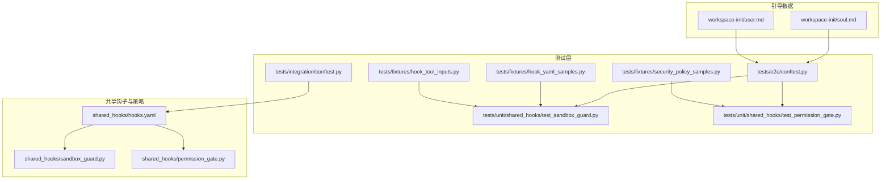
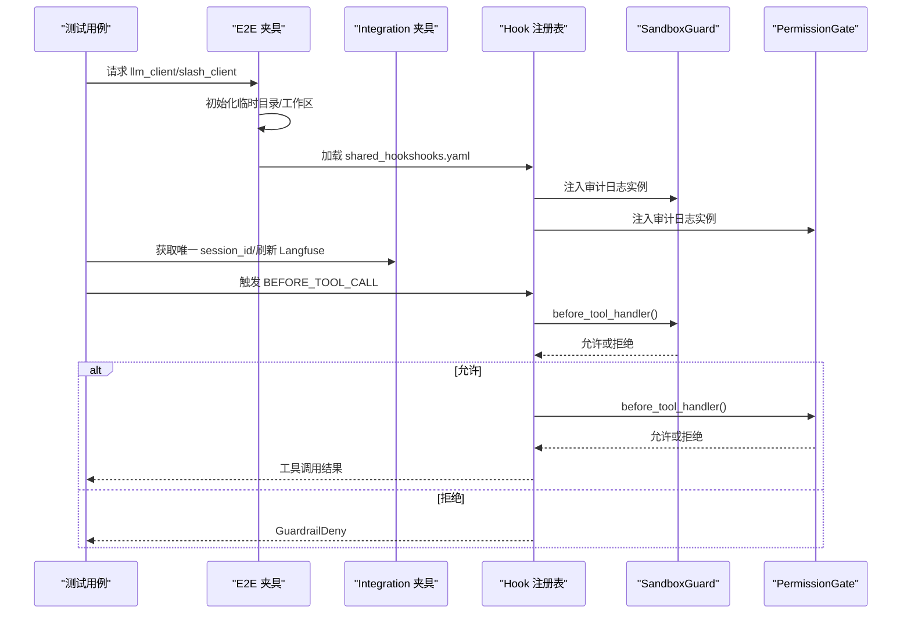
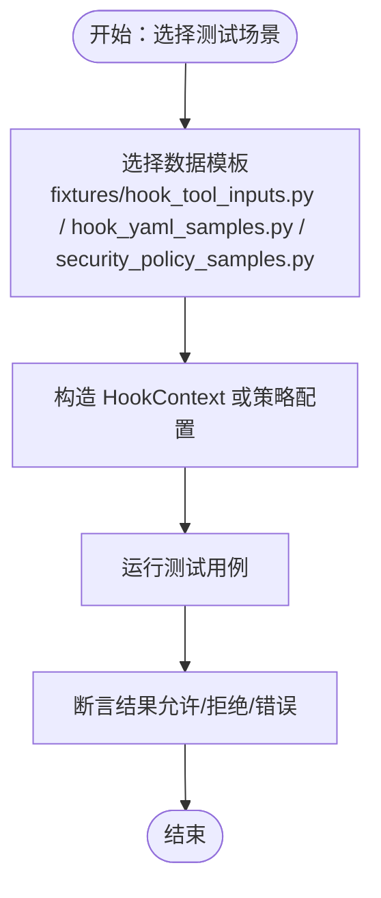
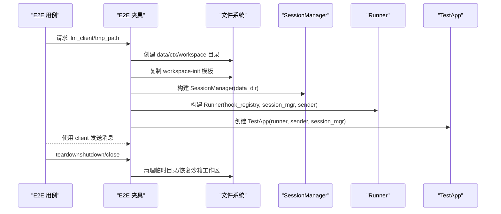
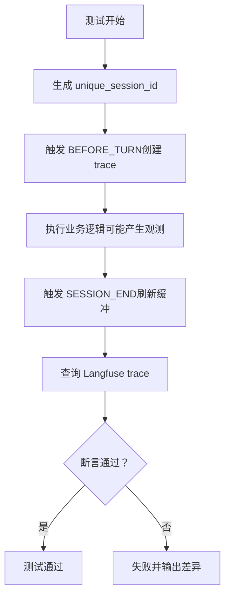
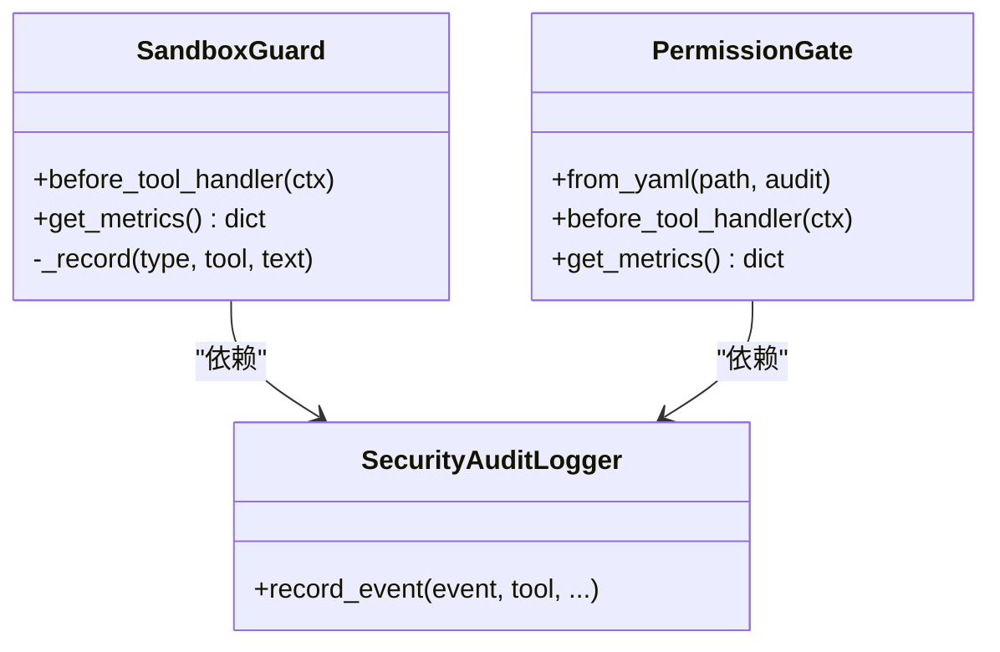
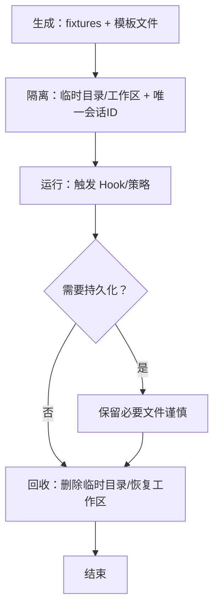
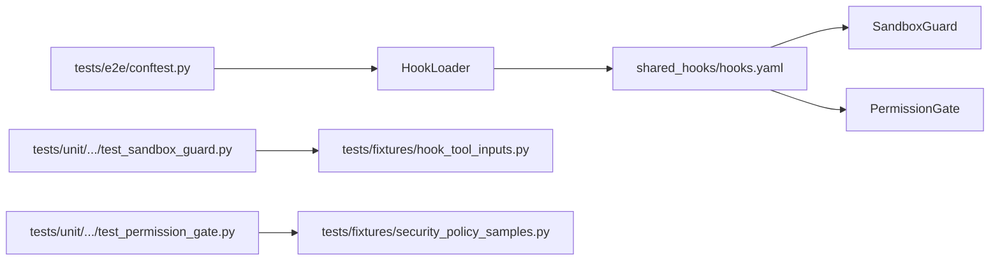

# 测试数据管理

<cite>
**本文引用的文件**
- [tests/conftest.py](file://tests/conftest.py)
- [tests/e2e/conftest.py](file://tests/e2e/conftest.py)
- [tests/integration/conftest.py](file://tests/integration/conftest.py)
- [tests/fixtures/hook_tool_inputs.py](file://tests/fixtures/hook_tool_inputs.py)
- [tests/fixtures/hook_yaml_samples.py](file://tests/fixtures/hook_yaml_samples.py)
- [tests/fixtures/security_policy_samples.py](file://tests/fixtures/security_policy_samples.py)
- [tests/unit/shared_hooks/test_sandbox_guard.py](file://tests/unit/shared_hooks/test_sandbox_guard.py)
- [tests/unit/shared_hooks/test_permission_gate.py](file://tests/unit/shared_hooks/test_permission_gate.py)
- [shared_hooks/sandbox_guard.py](file://shared_hooks/sandbox_guard.py)
- [shared_hooks/permission_gate.py](file://shared_hooks/permission_gate.py)
- [shared_hooks/hooks.yaml](file://shared_hooks/hooks.yaml)
- [workspace-init/user.md](file://workspace-init/user.md)
- [workspace-init/soul.md](file://workspace-init/soul.md)
</cite>

## 目录
1. [引言](#引言)
2. [项目结构](#项目结构)
3. [核心组件](#核心组件)
4. [架构总览](#架构总览)
5. [详细组件分析](#详细组件分析)
6. [依赖分析](#依赖分析)
7. [性能考量](#性能考量)
8. [故障排查指南](#故障排查指南)
9. [结论](#结论)
10. [附录](#附录)

## 引言
本文件面向 XiaoPaw v2 的测试数据管理，系统性阐述测试数据的组织结构、生成策略与生命周期管理；解释 fixtures 的设计原则、数据模板与合成数据生成方法；提供测试数据隔离、版本控制与依赖管理的最佳实践；说明测试数据的持久化、清理与回收机制；并给出测试数据安全、PII 处理与合规要求的实施指南。

## 项目结构
XiaoPaw v2 的测试数据主要分布在以下位置：
- tests/fixtures：集中存放参数化测试数据与配置样本，便于单元与集成测试复用
- tests/e2e/conftest.py：端到端测试的全局夹具，负责会话隔离、临时目录、沙箱工作区初始化与清理
- tests/integration/conftest.py：集成测试夹具，负责 Langfuse 缓冲区刷新与追踪隔离
- shared_hooks：安全钩子与策略的实现与配置，为测试提供真实的安全策略与审计日志
- workspace-init：引导阶段的用户与人格模板，作为 E2E 测试的上下文基线

**图表来源**
- [tests/fixtures/hook_tool_inputs.py:1-39](file://tests/fixtures/hook_tool_inputs.py#L1-L39)
- [tests/fixtures/hook_yaml_samples.py:1-91](file://tests/fixtures/hook_yaml_samples.py#L1-L91)
- [tests/fixtures/security_policy_samples.py:1-25](file://tests/fixtures/security_policy_samples.py#L1-L25)
- [tests/e2e/conftest.py:1-424](file://tests/e2e/conftest.py#L1-L424)
- [tests/integration/conftest.py:1-246](file://tests/integration/conftest.py#L1-L246)
- [shared_hooks/sandbox_guard.py:1-168](file://shared_hooks/sandbox_guard.py#L1-L168)
- [shared_hooks/permission_gate.py:1-107](file://shared_hooks/permission_gate.py#L1-L107)
- [shared_hooks/hooks.yaml:1-73](file://shared_hooks/hooks.yaml#L1-L73)
- [workspace-init/user.md:1-28](file://workspace-init/user.md#L1-L28)
- [workspace-init/soul.md:1-29](file://workspace-init/soul.md#L1-L29)

**章节来源**
- [tests/conftest.py:1-18](file://tests/conftest.py#L1-L18)
- [tests/e2e/conftest.py:1-424](file://tests/e2e/conftest.py#L1-L424)
- [tests/integration/conftest.py:1-246](file://tests/integration/conftest.py#L1-L246)
- [shared_hooks/hooks.yaml:1-73](file://shared_hooks/hooks.yaml#L1-L73)

## 核心组件
- 参数化测试数据集（fixtures）
  - 输入污染样例：路径穿越、危险命令、Shell 注入、提示词注入与安全输入集合
  - Hook 配置样例：有效/无效 YAML、依赖关系、处理器脚本
  - 安全策略样例：默认 ask/warn/deny 的权限策略
- 端到端测试夹具（E2E）
  - 会话隔离与唯一 session_id 生成
  - 临时目录与沙箱工作区初始化与清理
  - LLM 客户端构建、Langfuse 追踪查询与质量断言
- 集成测试夹具（Integration）
  - Langfuse 缓冲区刷新与追踪断言工具
  - 会话级 trace 隔离与树形结构验证
- 安全钩子与策略
  - SandboxGuard：确定性输入消毒与违规记录
  - PermissionGate：工具权限矩阵与审计日志
  - hooks.yaml：策略加载与依赖注入

**章节来源**
- [tests/fixtures/hook_tool_inputs.py:1-39](file://tests/fixtures/hook_tool_inputs.py#L1-L39)
- [tests/fixtures/hook_yaml_samples.py:1-91](file://tests/fixtures/hook_yaml_samples.py#L1-L91)
- [tests/fixtures/security_policy_samples.py:1-25](file://tests/fixtures/security_policy_samples.py#L1-L25)
- [tests/e2e/conftest.py:1-424](file://tests/e2e/conftest.py#L1-L424)
- [tests/integration/conftest.py:1-246](file://tests/integration/conftest.py#L1-L246)
- [shared_hooks/sandbox_guard.py:1-168](file://shared_hooks/sandbox_guard.py#L1-L168)
- [shared_hooks/permission_gate.py:1-107](file://shared_hooks/permission_gate.py#L1-L107)
- [shared_hooks/hooks.yaml:1-73](file://shared_hooks/hooks.yaml#L1-L73)

## 架构总览
测试数据管理围绕“数据模板 + 夹具 + 策略”协同工作：
- 数据模板：fixtures 提供标准化的输入与配置样本
- 夹具：E2E 与 Integration 夹具负责环境准备、隔离与清理
- 策略：hooks.yaml 加载 SandboxGuard 与 PermissionGate，形成真实的安全链路

**图表来源**
- [tests/e2e/conftest.py:241-321](file://tests/e2e/conftest.py#L241-L321)
- [tests/integration/conftest.py:30-121](file://tests/integration/conftest.py#L30-L121)
- [shared_hooks/hooks.yaml:27-73](file://shared_hooks/hooks.yaml#L27-L73)
- [shared_hooks/sandbox_guard.py:93-168](file://shared_hooks/sandbox_guard.py#L93-L168)
- [shared_hooks/permission_gate.py:32-107](file://shared_hooks/permission_gate.py#L32-L107)

## 详细组件分析

### 参数化测试数据与模板
- 输入污染样例
  - 路径穿越、危险命令、Shell 注入、提示词注入与安全输入集合，用于驱动 SandboxGuard 的单元测试
- Hook 配置样例
  - 有效/无效 YAML、依赖关系、处理器脚本，用于验证 HookLoader 的解析与加载
- 安全策略样例
  - 默认 ask/warn/deny 的权限策略，用于验证 PermissionGate 的决策逻辑

**图表来源**
- [tests/fixtures/hook_tool_inputs.py:1-39](file://tests/fixtures/hook_tool_inputs.py#L1-L39)
- [tests/fixtures/hook_yaml_samples.py:1-91](file://tests/fixtures/hook_yaml_samples.py#L1-L91)
- [tests/fixtures/security_policy_samples.py:1-25](file://tests/fixtures/security_policy_samples.py#L1-L25)

**章节来源**
- [tests/fixtures/hook_tool_inputs.py:1-39](file://tests/fixtures/hook_tool_inputs.py#L1-L39)
- [tests/fixtures/hook_yaml_samples.py:1-91](file://tests/fixtures/hook_yaml_samples.py#L1-L91)
- [tests/fixtures/security_policy_samples.py:1-25](file://tests/fixtures/security_policy_samples.py#L1-L25)

### 端到端测试夹具（E2E）
- 会话隔离
  - 通过 unique_session_id 生成器确保每条测试的 trace 隔离
- 临时目录与工作区
  - 初始化 data/ctx/workspace 目录，复制 workspace-init 模板文件，保证测试前后状态一致
- 沙箱工作区清理
  - 重置宿主机上的沙箱工作区，确保外部工具调用的幂等性
- LLM 客户端构建
  - 组装 Runner、SessionManager、CaptureSender 与 TestApp，支持真实 LLM 与 Sandbox（MCP）

**图表来源**
- [tests/e2e/conftest.py:34-424](file://tests/e2e/conftest.py#L34-L424)

**章节来源**
- [tests/e2e/conftest.py:1-424](file://tests/e2e/conftest.py#L1-L424)
- [workspace-init/user.md:1-28](file://workspace-init/user.md#L1-L28)
- [workspace-init/soul.md:1-29](file://workspace-init/soul.md#L1-L29)

### 集成测试夹具（Integration）
- 唯一会话 ID 与 Langfuse 隔离
  - 为每个测试生成唯一 session_id，避免 trace 干扰
- Langfuse 缓冲区刷新
  - 自动刷新动态模块中的批量缓冲，确保断言前事件已落盘
- 追踪断言工具
  - 查询 trace、断言根节点、生成器存在、树形结构完整性与拒绝观察

**图表来源**
- [tests/integration/conftest.py:30-246](file://tests/integration/conftest.py#L30-L246)

**章节来源**
- [tests/integration/conftest.py:1-246](file://tests/integration/conftest.py#L1-L246)

### 安全钩子与策略（SandboxGuard 与 PermissionGate）
- SandboxGuard
  - 输入预处理（NFKC 归一化、URL 多轮解码、空字节拦截）
  - 四类检测：路径穿越、危险命令、Shell 注入、提示词注入
  - 沙箱原生工具豁免与审计记录
- PermissionGate
  - 工具级权限矩阵（deny > warn > allow）
  - 默认策略（建议 warn/deny，避免默认 allow）
  - YAML 加载与审计记录

**图表来源**
- [shared_hooks/sandbox_guard.py:93-168](file://shared_hooks/sandbox_guard.py#L93-L168)
- [shared_hooks/permission_gate.py:32-107](file://shared_hooks/permission_gate.py#L32-L107)
- [shared_hooks/hooks.yaml:29-49](file://shared_hooks/hooks.yaml#L29-L49)

**章节来源**
- [shared_hooks/sandbox_guard.py:1-168](file://shared_hooks/sandbox_guard.py#L1-L168)
- [shared_hooks/permission_gate.py:1-107](file://shared_hooks/permission_gate.py#L1-L107)
- [shared_hooks/hooks.yaml:1-73](file://shared_hooks/hooks.yaml#L1-L73)

### 测试数据生命周期管理
- 生成
  - 使用 fixtures 提供的标准输入与配置样本
  - E2E 夹具在测试前复制模板文件，确保初始状态一致
- 隔离
  - E2E：临时目录与沙箱工作区隔离；unique_session_id 隔离 Langfuse trace
  - Integration：自动刷新缓冲，避免跨测试污染
- 清理与回收
  - E2E：teardown 关闭 Runner 与 TestClient，清理临时目录与恢复沙箱工作区
  - Integration：断言后刷新缓冲，trace 由外部系统管理
- 持久化
  - 临时目录与工作区在测试结束后回收，不保留持久化数据

**图表来源**
- [tests/e2e/conftest.py:273-378](file://tests/e2e/conftest.py#L273-L378)
- [tests/integration/conftest.py:38-121](file://tests/integration/conftest.py#L38-L121)

**章节来源**
- [tests/e2e/conftest.py:1-424](file://tests/e2e/conftest.py#L1-L424)
- [tests/integration/conftest.py:1-246](file://tests/integration/conftest.py#L1-L246)

### 测试数据安全、PII 处理与合规
- PII 与敏感信息
  - 引导模板中涉及用户偏好与工作背景，测试中应避免在日志或报告中泄露
  - SandboxGuard 对敏感输入进行拦截与审计，避免真实系统被滥用
- 审计与可追溯性
  - SandboxGuard 与 PermissionGate 共享审计日志实例，统一记录违规与权限决策
  - hooks.yaml 将审计日志作为策略依赖，确保策略链路中始终记录关键事件
- 合规要求
  - 默认策略建议使用 warn/deny，避免新工具上线时的默认放行风险
  - 权限矩阵可通过 YAML 配置，便于审计与变更控制

**章节来源**
- [shared_hooks/sandbox_guard.py:93-168](file://shared_hooks/sandbox_guard.py#L93-L168)
- [shared_hooks/permission_gate.py:32-107](file://shared_hooks/permission_gate.py#L32-L107)
- [shared_hooks/hooks.yaml:29-49](file://shared_hooks/hooks.yaml#L29-L49)
- [workspace-init/user.md:1-28](file://workspace-init/user.md#L1-L28)
- [workspace-init/soul.md:1-29](file://workspace-init/soul.md#L1-L29)

## 依赖分析
- 测试夹具对共享钩子的依赖
  - E2E 夹具通过 HookLoader 从 shared_hooks 目录加载策略，fail_closed 名单确保关键安全策略生效
  - Integration 夹具通过 hooks.yaml 注入审计日志实例，保障策略链路的可观测性
- 测试用例对 fixtures 的依赖
  - 单元测试使用 fixtures 中的参数化数据驱动 SandboxGuard 与 PermissionGate 的行为验证

**图表来源**
- [tests/e2e/conftest.py:44-54](file://tests/e2e/conftest.py#L44-L54)
- [shared_hooks/hooks.yaml:27-73](file://shared_hooks/hooks.yaml#L27-L73)
- [tests/unit/shared_hooks/test_sandbox_guard.py:1-231](file://tests/unit/shared_hooks/test_sandbox_guard.py#L1-L231)
- [tests/unit/shared_hooks/test_permission_gate.py:1-101](file://tests/unit/shared_hooks/test_permission_gate.py#L1-L101)
- [tests/fixtures/hook_tool_inputs.py:1-39](file://tests/fixtures/hook_tool_inputs.py#L1-L39)
- [tests/fixtures/security_policy_samples.py:1-25](file://tests/fixtures/security_policy_samples.py#L1-L25)

**章节来源**
- [tests/e2e/conftest.py:1-424](file://tests/e2e/conftest.py#L1-L424)
- [shared_hooks/hooks.yaml:1-73](file://shared_hooks/hooks.yaml#L1-L73)
- [tests/unit/shared_hooks/test_sandbox_guard.py:1-231](file://tests/unit/shared_hooks/test_sandbox_guard.py#L1-L231)
- [tests/unit/shared_hooks/test_permission_gate.py:1-101](file://tests/unit/shared_hooks/test_permission_gate.py#L1-L101)

## 性能考量
- 输入消毒性能
  - SandboxGuard 对长输入的处理时间应控制在合理范围内，避免影响端到端测试吞吐
- Langfuse 断言重试
  - Integration 夹具在断言 trace 时采用固定延迟重试，平衡异步写入的延迟与测试稳定性
- 资源回收
  - E2E 夹具在 teardown 阶段安全关闭 Runner 与 TestClient，避免资源泄漏

**章节来源**
- [tests/unit/shared_hooks/test_sandbox_guard.py:215-222](file://tests/unit/shared_hooks/test_sandbox_guard.py#L215-L222)
- [tests/integration/conftest.py:76-95](file://tests/integration/conftest.py#L76-L95)
- [tests/e2e/conftest.py:323-332](file://tests/e2e/conftest.py#L323-L332)

## 故障排查指南
- Langfuse 断言失败
  - 检查唯一 session_id 是否正确生成与传递
  - 确认 SESSION_END 已触发并刷新缓冲
  - 若 trace 未就绪，等待固定延迟后重试
- 沙箱工作区异常
  - 确认沙箱 URL 可达且健康
  - 检查工作区清理逻辑是否成功恢复模板文件
- 权限策略误判
  - 核对 security.yaml 的 default 与工具权限映射
  - 确认策略加载顺序与依赖注入是否正确

**章节来源**
- [tests/integration/conftest.py:123-246](file://tests/integration/conftest.py#L123-L246)
- [tests/e2e/conftest.py:362-378](file://tests/e2e/conftest.py#L362-L378)
- [shared_hooks/permission_gate.py:41-56](file://shared_hooks/permission_gate.py#L41-L56)

## 结论
XiaoPaw v2 的测试数据管理通过“标准化模板 + 夹具隔离 + 策略链路”的方式，实现了高内聚、低耦合的测试数据组织与生命周期管理。fixtures 提供了可复用的数据与配置样本，E2E 与 Integration 夹具确保了环境隔离与清理回收，而 SandboxGuard 与 PermissionGate 则提供了真实的安全策略与审计能力。遵循本文的最佳实践，可在保证测试稳定性的同时，兼顾安全性与合规性。

## 附录
- 测试数据最佳实践
  - 使用 fixtures 维护参数化数据，避免硬编码
  - 通过 unique_session_id 与临时目录实现强隔离
  - 在 teardown 阶段严格回收资源，避免状态泄漏
  - 将敏感信息与 PII 处理纳入测试流程，确保不外泄
  - 通过 hooks.yaml 统一加载策略，确保策略链路一致