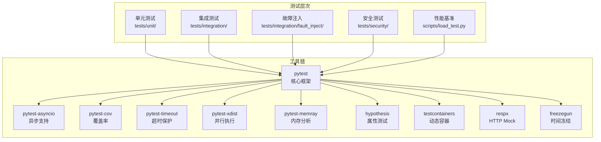
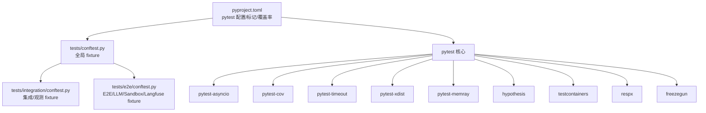
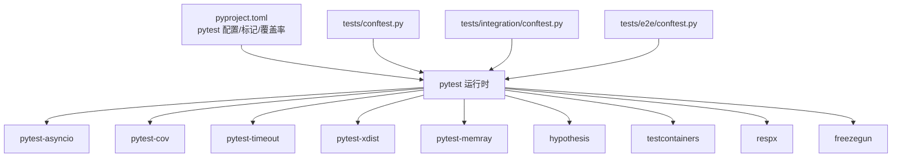

# 测试框架与工具链

<cite>
**本文引用的文件**
- [pyproject.toml](file://pyproject.toml)
- [tests/conftest.py](file://tests/conftest.py)
- [tests/e2e/conftest.py](file://tests/e2e/conftest.py)
- [tests/integration/conftest.py](file://tests/integration/conftest.py)
- [docs/10-testing.md](file://docs/10-testing.md)
- [tests/unit/shared_hooks/test_audit_logger.py](file://tests/unit/shared_hooks/test_audit_logger.py)
- [tests/unit/shared_hooks/test_cost_guard.py](file://tests/unit/shared_hooks/test_cost_guard.py)
- [tests/unit/shared_hooks/test_langfuse_init.py](file://tests/unit/shared_hooks/test_langfuse_init.py)
- [tests/unit/hook_framework/test_hook_registry.py](file://tests/unit/hook_framework/test_hook_registry.py)
</cite>

## 目录
1. [简介](#简介)
2. [项目结构](#项目结构)
3. [核心组件](#核心组件)
4. [架构总览](#架构总览)
5. [详细组件分析](#详细组件分析)
6. [依赖关系分析](#依赖关系分析)
7. [性能考量](#性能考量)
8. [故障排查指南](#故障排查指南)
9. [结论](#结论)
10. [附录](#附录)

## 简介
本文件面向 XiaoPaw v2 的测试框架与工具链，系统梳理 pytest 核心配置、异步测试支持、覆盖率工具、并行执行器以及与之协同的多种测试工具（pytest-asyncio、pytest-cov、pytest-timeout、pytest-memray、hypothesis、testcontainers、respx、freezegun）。文档结合项目实际配置与测试实践，提供最佳集成方式、配置示例与命令行参数说明，并总结测试环境搭建与依赖管理策略。

## 项目结构
XiaoPaw v2 的测试组织遵循“五层金字塔”策略：单元测试（全 mock）、集成测试（真实外部服务可选）、故障注入（破坏性子集）、安全测试（单元+E2E）、性能基准（压测与 SLO）。测试工具链围绕 pytest 生态构建，配合覆盖率、并行、超时、内存分析、属性测试、容器化与 HTTP Mock 等能力，形成高稳定性与可维护性的测试体系。

**图表来源**
- [docs/10-testing.md:48-80](file://docs/10-testing.md#L48-L80)
- [pyproject.toml:32-38](file://pyproject.toml#L32-L38)

**章节来源**
- [docs/10-testing.md:48-80](file://docs/10-testing.md#L48-L80)

## 核心组件
- pytest 核心配置与标记体系
  - 测试路径、异步模式、默认超时、严格标记与配置、覆盖率报告与阈值、自定义标记等均在配置中集中定义，确保跨层级一致性。
- 异步测试支持
  - 通过 pytest-asyncio 提供的装饰器与自动模式，统一管理 async/await 测试与 fixture 生命周期。
- 覆盖率工具
  - 使用 pytest-cov 针对源码目录进行覆盖率统计，并配置忽略测试目录、缺失行显示等细节。
- 并行执行器
  - 通过 pytest-xdist 的自动并行能力加速单元测试套件，提升 CI/本地反馈速度。
- 超时与稳定性
  - pytest-timeout 为易挂起或潜在阻塞的测试提供超时保护，尤其在故障注入场景中至关重要。
- 内存分析
  - pytest-memray 用于长跑与高并发场景下的内存增长与峰值检测，受限于平台（Linux/macOS）。
- 属性测试与容器化
  - hypothesis 用于属性测试，testcontainers 用于动态拉起 pgvector 等外部依赖，避免共享状态。
- HTTP Mock 与时间冻结
  - respx 用于拦截外部 HTTP 请求，freezegun 用于冻结时间推进，便于测试定时与缓存逻辑。

**章节来源**
- [pyproject.toml:40-63](file://pyproject.toml#L40-L63)
- [docs/10-testing.md:83-166](file://docs/10-testing.md#L83-L166)

## 架构总览
下图展示测试框架与工具链在项目中的协作关系，以及关键配置如何贯穿不同测试层级。

**图表来源**
- [pyproject.toml:40-63](file://pyproject.toml#L40-L63)
- [tests/conftest.py:1-18](file://tests/conftest.py#L1-L18)
- [tests/integration/conftest.py:1-246](file://tests/integration/conftest.py#L1-L246)
- [tests/e2e/conftest.py:1-424](file://tests/e2e/conftest.py#L1-L424)

## 详细组件分析

### pytest 核心配置与标记体系
- 配置要点
  - testpaths：统一扫描 tests 目录
  - asyncio_mode：auto，适配 async/await 测试
  - timeout：默认 600 秒，针对长时间端到端测试
  - markers：定义集成、LLM 依赖、沙箱、pgvector、安全、可观测性、E2E 等标记，便于按需选择测试集
- 覆盖率配置
  - source：仅统计 xiaopaw 与 shared_hooks
  - omit：排除 tests/*
  - report：显示缺失行
- 命令行建议
  - 快通道：排除 llm/sandbox/pgvector/feishu/chaos 标记
  - 全量：直接运行 pytest
  - 并行：pytest tests/unit/ -n auto
  - 故障注入：pytest -m chaos --timeout=120

**章节来源**
- [pyproject.toml:40-63](file://pyproject.toml#L40-L63)
- [docs/10-testing.md:120-166](file://docs/10-testing.md#L120-L166)

### 异步测试支持（pytest-asyncio）
- 关键点
  - 使用 pytest-asyncio 的 fixture 与装饰器，确保异步生命周期正确管理
  - E2E 与集成测试广泛采用 async def 测试与异步 fixture
- 实践
  - 在 E2E conftest 中提供异步客户端与 runner 管理
  - 在集成层对 Langfuse 缓冲与 trace 查询采用异步等待与重试

**章节来源**
- [tests/e2e/conftest.py:241-341](file://tests/e2e/conftest.py#L241-L341)
- [tests/integration/conftest.py:38-121](file://tests/integration/conftest.py#L38-L121)

### 覆盖率工具（pytest-cov）
- 配置
  - source 限定为 xiaopaw 与 shared_hooks
  - omit 排除 tests/*
  - report 显示缺失行
- 使用建议
  - 在 CI 中开启 XML 报告与 fail-under，确保覆盖率达标
  - 针对关键模块设置文件级 fail-under，保障核心模块覆盖率

**章节来源**
- [pyproject.toml:57-63](file://pyproject.toml#L57-L63)

### 并行执行器（pytest-xdist）
- 适用场景
  - 单元测试套件大规模并行，显著缩短本地与 CI 时间
- 注意事项
  - 避免共享状态与竞态；使用 tmp_path 等隔离资源
  - 与某些需要严格顺序或共享资源的测试不兼容

**章节来源**
- [docs/10-testing.md:120-166](file://docs/10-testing.md#L120-L166)

### 超时与稳定性（pytest-timeout）
- 适用场景
  - 故障注入测试、易挂起的外部依赖、长时间运行的 E2E
- 建议
  - 为混沌测试设置更长超时（如 120s）
  - 对网络/容器健康检查设置合理超时，避免误判

**章节来源**
- [docs/10-testing.md:120-166](file://docs/10-testing.md#L120-L166)

### 内存分析（pytest-memray）
- 适用场景
  - 长跑 session、LRUCache、pending_tasks 等高并发/长生命周期对象
- 平台限制
  - Linux/macOS 支持；Windows 不支持
- 建议
  - CI 使用 ubuntu-latest runner；本地 Windows 用户建议 WSL2 或跳过该任务

**章节来源**
- [docs/10-testing.md:1257-1273](file://docs/10-testing.md#L1257-L1273)

### 属性测试（hypothesis）
- 适用场景
  - 压缩算法、tokenizer 容错、BLOCKED_PATTERNS 等对输入分布敏感的逻辑
- 建议
  - 与 respx、freezegun 结合，控制外部依赖与时间因素

**章节来源**
- [docs/10-testing.md:83-119](file://docs/10-testing.md#L83-L119)

### 容器化与外部依赖（testcontainers）
- 适用场景
  - pgvector 集成测试，避免共享数据库状态
- 实践
  - 使用 session 作用域的 fixture 动态拉起容器，应用 schema 后提供 DSN

**章节来源**
- [docs/10-testing.md:1140-1162](file://docs/10-testing.md#L1140-L1162)

### HTTP Mock（respx）
- 适用场景
  - DeepSeek、百度、飞书等出站 REST 调用的拦截与模拟
- 关键技巧
  - 飞书路由匹配需基于 body 内容，避免 params 匹配不到导致假阳性
  - 对 429/5xx/超时等场景进行序列化模拟，验证重试与退避逻辑

**章节来源**
- [docs/10-testing.md:557-607](file://docs/10-testing.md#L557-L607)

### 时间冻结（freezegun）
- 适用场景
  - RateLimiter、ReplayCache、Cron 下次运行时间等依赖时间推进的逻辑
- 建议
  - 与 respx、hypothesis 协同，确保时间可控与输入多样化

**章节来源**
- [docs/10-testing.md:111-119](file://docs/10-testing.md#L111-L119)

### 全局与层级 fixture
- tests/conftest.py
  - 提供 HookRegistry 与 HookContext 工厂等通用 fixture
- tests/integration/conftest.py
  - 生成唯一 session_id、Langfuse 缓冲刷新、trace 查询与断言工具
- tests/e2e/conftest.py
  - 提供 slash/LLM/Sandbox/Langfuse 相关的异步客户端与清理逻辑

**章节来源**
- [tests/conftest.py:1-18](file://tests/conftest.py#L1-L18)
- [tests/integration/conftest.py:1-246](file://tests/integration/conftest.py#L1-L246)
- [tests/e2e/conftest.py:1-424](file://tests/e2e/conftest.py#L1-L424)

### 工具链集成最佳实践
- 标记驱动的测试选择
  - 使用 -m 选择性运行：如 -m "not (llm or sandbox or pgvector)" 快速通道
- 覆盖率与阈值
  - 在 CI 中启用 XML 报告与 fail-under，确保全局与模块级覆盖率达标
- 并行与隔离
  - 单元测试使用 -n auto 并行；注意避免共享状态与竞态
- 超时与健壮性
  - 故障注入与 E2E 设置合理 timeout，防止 CI 卡死
- 内存回归
  - 使用 pytest-memray 对高并发/长跑场景进行回归对比，CI 保存报告归档

**章节来源**
- [pyproject.toml:40-63](file://pyproject.toml#L40-L63)
- [docs/10-testing.md:120-166](file://docs/10-testing.md#L120-L166)

## 依赖关系分析
下图展示测试工具链与配置文件之间的依赖关系，以及关键测试文件如何利用这些工具。

**图表来源**
- [pyproject.toml:40-63](file://pyproject.toml#L40-L63)
- [tests/conftest.py:1-18](file://tests/conftest.py#L1-L18)
- [tests/integration/conftest.py:1-246](file://tests/integration/conftest.py#L1-L246)
- [tests/e2e/conftest.py:1-424](file://tests/e2e/conftest.py#L1-L424)

**章节来源**
- [pyproject.toml:40-63](file://pyproject.toml#L40-L63)
- [tests/conftest.py:1-18](file://tests/conftest.py#L1-L18)
- [tests/integration/conftest.py:1-246](file://tests/integration/conftest.py#L1-L246)
- [tests/e2e/conftest.py:1-424](file://tests/e2e/conftest.py#L1-L424)

## 性能考量
- 单元测试并行
  - 使用 pytest-xdist 的 -n auto 提升执行效率，注意资源隔离与竞态规避
- 覆盖率与报告
  - 启用 term-missing 与 XML 报告，结合 fail-under 确保质量门槛
- 内存回归
  - pytest-memray 仅支持 Linux/macOS，CI 使用 ubuntu-latest runner，本地 Windows 建议 WSL2
- 性能 SLO
  - 通过 scripts/load_test.py 与微基准（pytest-benchmark）对 stub 与 real 场景分别设定 p95 SLO，并在 CI 中对比回归

**章节来源**
- [docs/10-testing.md:1240-1273](file://docs/10-testing.md#L1240-L1273)

## 故障排查指南
- 超时问题
  - 故障注入与 E2E 测试设置合理 timeout；必要时增加 --timeout=120
- 容器健康
  - 集成测试前检查容器健康端点；失败时跳过或重试
- HTTP Mock 匹配
  - 飞书路由需基于 body 匹配，避免 params 导致的假阳性
- 时间相关逻辑
  - 使用 freezegun 控制时间推进，避免依赖真实时钟导致不稳定
- 覆盖率缺失
  - 检查覆盖率配置与忽略规则，确保 source 目录正确

**章节来源**
- [docs/10-testing.md:557-607](file://docs/10-testing.md#L557-L607)
- [tests/integration/conftest.py:38-121](file://tests/integration/conftest.py#L38-L121)

## 结论
XiaoPaw v2 的测试框架与工具链以 pytest 为核心，结合 pytest-asyncio、pytest-cov、pytest-timeout、pytest-xdist、pytest-memray、hypothesis、testcontainers、respx、freezegun 等工具，构建了覆盖五层金字塔的完整测试体系。通过集中配置、标记驱动的选择、严格的覆盖率与超时策略，以及对平台与外部依赖的妥善管理，项目在稳定性、可维护性与可扩展性方面达到较高水准。

## 附录

### 命令行与配置示例
- 快通道（仅单元与无外部依赖集成）
  - pytest -m "not (llm or sandbox or pgvector or feishu or chaos)"
- 全量运行
  - pytest
- 单元并行
  - pytest tests/unit/ -n auto
- 故障注入
  - pytest -m chaos --timeout=120
- 覆盖率
  - pytest --cov=xiaopaw --cov-report=term-missing --cov-report=xml --cov-fail-under=88

**章节来源**
- [pyproject.toml:40-63](file://pyproject.toml#L40-L63)
- [docs/10-testing.md:150-166](file://docs/10-testing.md#L150-L166)

### 工具职责与使用场景
- pytest-asyncio：所有 async def 测试
- pytest-timeout：防挂死（故障注入必配）
- pytest-memray：内存增长检测（Linux/macOS）
- pytest-cov：覆盖率（全局与模块 fail-under）
- pytest-xdist：并行执行（单元套件）
- hypothesis：属性测试（压缩/正则/容错）
- testcontainers：动态容器（pgvector）
- respx：HTTP Mock（DeepSeek/飞书/百度）
- freezegun：时间冻结（RateLimiter/Cron）

**章节来源**
- [docs/10-testing.md:102-119](file://docs/10-testing.md#L102-L119)

### 测试环境搭建与依赖管理
- Python 版本与依赖
  - Python >= 3.11，开发依赖集中在 dev 组
- 外部服务
  - LLM：DEEPSEEK_API_KEY
  - 沙箱：AIO-Sandbox（localhost:8080）
  - pgvector：PostgreSQL + pgvector（testcontainers 或本地）
  - 飞书：真实应用凭据（可选）
- 环境变量
  - Langfuse：LANGFUSE_PUBLIC_KEY/LANGFUSE_SECRET_KEY/LANGFUSE_BASE_URL
  - 安全审计：SECURITY_AUDIT_FILE
  - 成本预算：COST_GUARD_BUDGET

**章节来源**
- [pyproject.toml:22-38](file://pyproject.toml#L22-L38)
- [tests/e2e/conftest.py:29-31](file://tests/e2e/conftest.py#L29-L31)
- [tests/integration/conftest.py:12-23](file://tests/integration/conftest.py#L12-L23)
- [tests/unit/shared_hooks/test_cost_guard.py:96-107](file://tests/unit/shared_hooks/test_cost_guard.py#L96-L107)

### 关键测试用例与断言参考
- 审计日志
  - 记录事件、写入 JSONL、会话结束汇总、环境变量路径
- 成本守卫
  - 令牌累计、成本计算、预算上限、拒绝计数、环境变量覆盖
- Langfuse 初始化
  - 缺失/部分密钥警告、初始化失败标记
- Hook 注册表
  - 分发与门控、拒绝传播、fail-closed/fail-open、处理器计数与摘要

**章节来源**
- [tests/unit/shared_hooks/test_audit_logger.py:1-82](file://tests/unit/shared_hooks/test_audit_logger.py#L1-L82)
- [tests/unit/shared_hooks/test_cost_guard.py:1-107](file://tests/unit/shared_hooks/test_cost_guard.py#L1-L107)
- [tests/unit/shared_hooks/test_langfuse_init.py:1-66](file://tests/unit/shared_hooks/test_langfuse_init.py#L1-L66)
- [tests/unit/hook_framework/test_hook_registry.py:1-174](file://tests/unit/hook_framework/test_hook_registry.py#L1-L174)