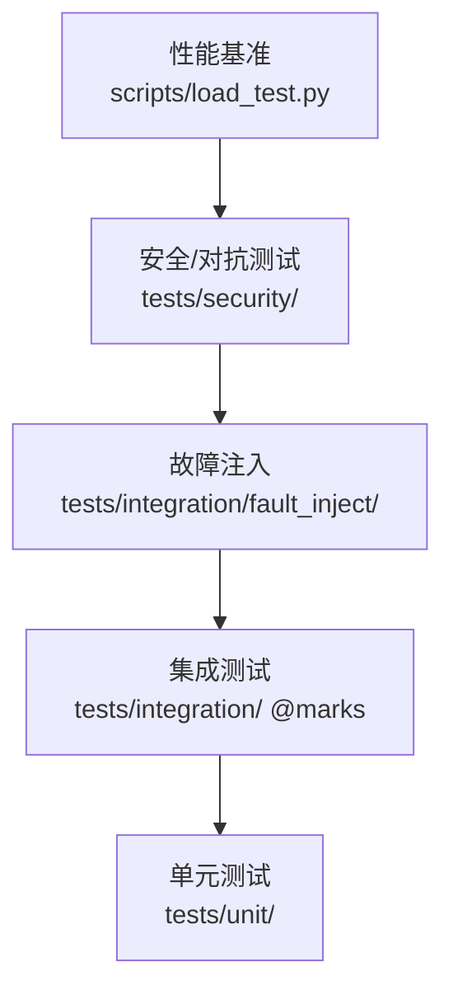
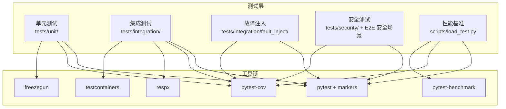
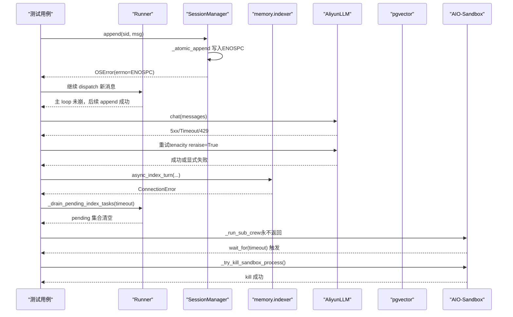
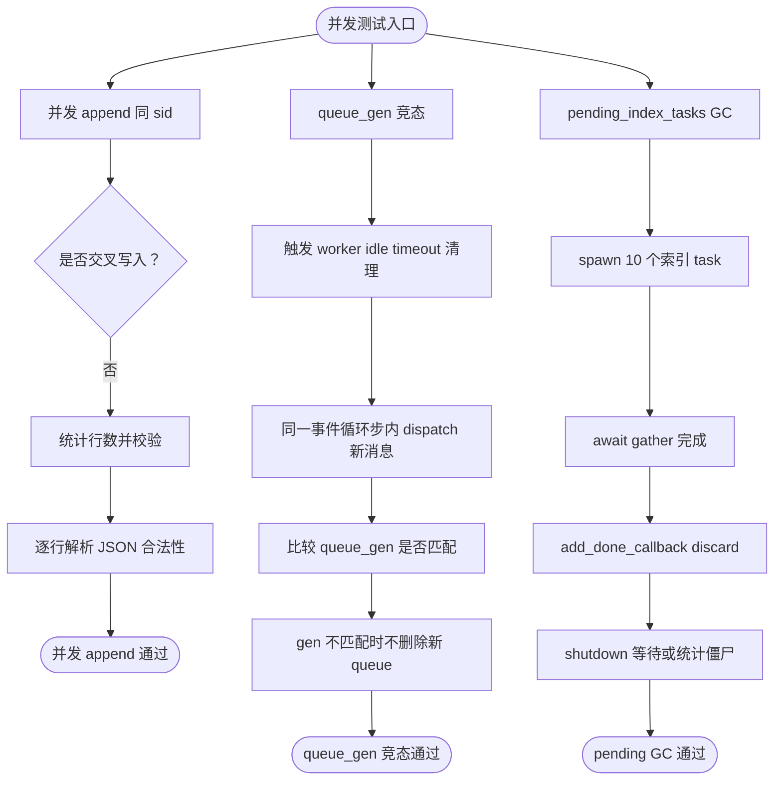
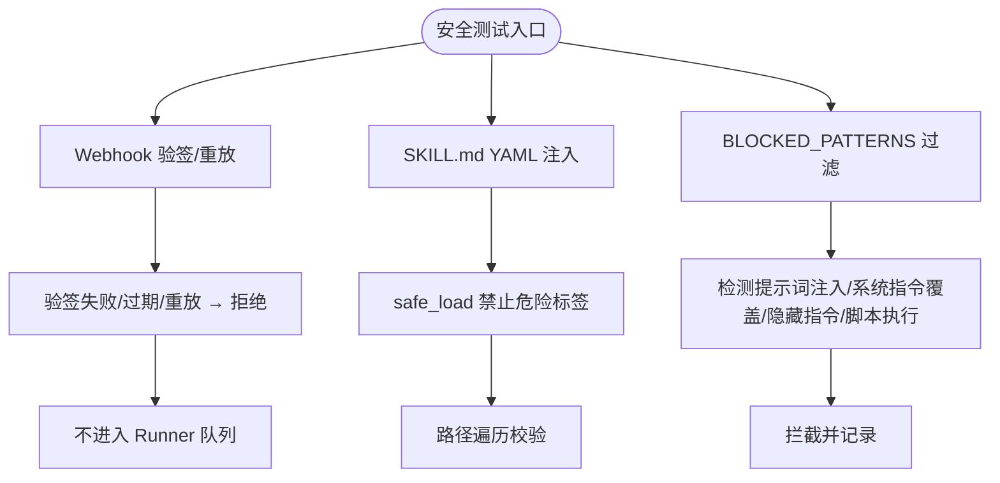
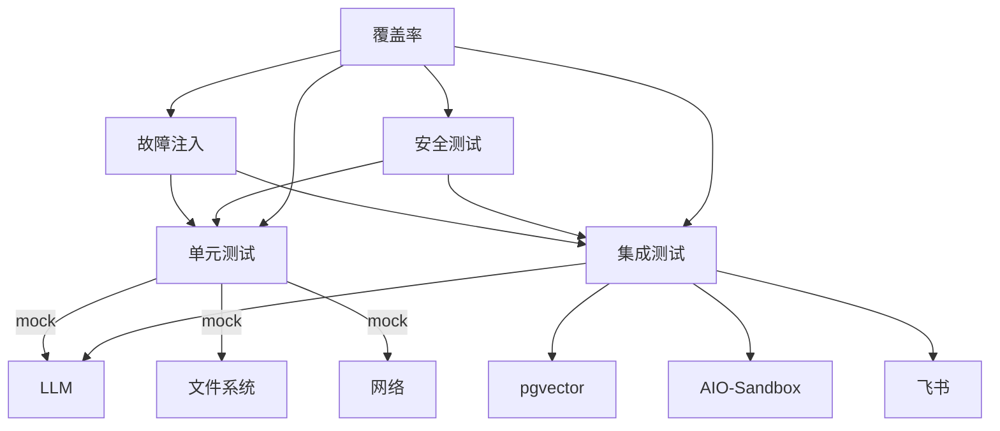

# 测试策略

<cite>
**本文引用的文件**
- [docs/10-testing.md](file://docs/10-testing.md)
- [DESIGN.md](file://DESIGN.md)
- [pyproject.toml](file://pyproject.toml)
- [DEEPSEEK_CONFIG.md](file://DEEPSEEK_CONFIG.md)
- [tests/conftest.py](file://tests/conftest.py)
- [docs/test-cases-for-known-risks.md](file://docs/test-cases-for-known-risks.md)
- [docs/13-test-design-hook-hardening.md](file://docs/13-test-design-hook-hardening.md)
- [docs/14-e2e-test-design.md](file://docs/14-e2e-test-design.md)
- [docs/15-e2e-fix-structured-log-and-timing.md](file://docs/15-e2e-fix-structured-log-and-timing.md)
- [docs/langfuse-trace-fix-design.md](file://docs/langfuse-trace-fix-design.md)
- [docs/e2e-05-search-regression-report.md](file://docs/e2e-05-search-regression-report.md)
- [docs/sdk-verification-report.md](file://docs/sdk-verification-report.md)
- [docs/concurrency-verification-report.md](file://docs/concurrency-verification-report.md)
</cite>

## 目录
1. [简介](#简介)
2. [项目结构](#项目结构)
3. [核心组件](#核心组件)
4. [架构总览](#架构总览)
5. [详细组件分析](#详细组件分析)
6. [依赖分析](#依赖分析)
7. [性能考量](#性能考量)
8. [故障排查指南](#故障排查指南)
9. [结论](#结论)
10. [附录](#附录)

## 简介
本文件面向 XiaoPaw v2 的测试策略，系统化阐述测试分层、方法学、覆盖率与门禁、故障注入与互斥正确性测试、已知风险测试矩阵、E2E 设计与验证、以及 CI/CD 质量保证流程。文档以 v2.1 为基础，结合 v3 的加固层与 293 个测试用例，提供可操作的最佳实践与自动化指南。

## 项目结构
XiaoPaw v2 的测试体系分为五层金字塔，自底向上：
- 性能基准（压测 / p95 SLO）
- 安全 / 对抗测试（3 组）
- 故障注入（5 组，chaos）
- 集成测试（≥30，真实外部服务）
- 单元测试（≥720，全 mock 依赖）

测试组织与标记策略如下：
- 单元测试：tests/unit/，全 mock，无外部依赖
- 集成测试：tests/integration/，按 marker 控制启用（llm、sandbox、pgvector、feishu）
- 故障注入：tests/integration/fault_inject/，独立 marker @chaos
- 安全测试：tests/security/（单元）+ E2E 安全场景
- 性能基准：scripts/load_test.py，按 --mode real/stub 切换 SLO

图表来源
- [docs/10-testing.md:48-80](file://docs/10-testing.md#L48-L80)

章节来源
- [docs/10-testing.md:48-80](file://docs/10-testing.md#L48-L80)
- [DESIGN.md:592-616](file://DESIGN.md#L592-L616)

## 核心组件
- 测试框架与工具链：pytest + pytest-asyncio + pytest-cov + pytest-timeout + pytest-xdist + pytest-benchmark + hypothesis + testcontainers + respx + freezegun
- pytest 配置：markers、timeout、cov、strict 标记与配置
- 单元测试组织：tests/unit/ 下按模块与功能划分，命名与参数化规范
- 集成测试标记矩阵：llm、sandbox、pgvector、feishu、chaos、security
- 故障注入：5 组（磁盘满 ENOSPC、LLM 5xx/超时/429、pgvector 下线、Skill 卡死、飞书 429）
- 并发正确性：JSONL 并发 append、queue_gen 竞态、pending_index_tasks GC
- 安全测试：Webhook 验签/重放、SKILL.md 注入与路径遍历、Memory Poisoning BLOCKED_PATTERNS
- 覆盖率策略：全局 ≥88%，核心模块 ≥90%，个别文件 ≥95%，trace_id 覆盖率 ≥85%
- CI 门禁：格式/静态类型/安全扫描/依赖漏洞/密钥扫描/单元+集成/按文件覆盖率/trace_id 覆盖率/PII 验证/容器非 root/8 指标齐全/安全 E2E/故障注入/LLM/飞书夜间

章节来源
- [docs/10-testing.md:83-165](file://docs/10-testing.md#L83-L165)
- [docs/10-testing.md:332-380](file://docs/10-testing.md#L332-L380)
- [docs/10-testing.md:382-607](file://docs/10-testing.md#L382-L607)
- [docs/10-testing.md:687-784](file://docs/10-testing.md#L687-L784)
- [docs/10-testing.md:787-899](file://docs/10-testing.md#L787-L899)
- [docs/10-testing.md:919-1041](file://docs/10-testing.md#L919-L1041)
- [docs/10-testing.md:1014-1041](file://docs/10-testing.md#L1014-L1041)

## 架构总览
测试架构围绕“分层 + 标记 + 门禁”展开，配合工具链与 fixtures，形成可重复、可扩展的质量保障闭环。

图表来源
- [docs/10-testing.md:83-165](file://docs/10-testing.md#L83-L165)
- [pyproject.toml:40-55](file://pyproject.toml#L40-L55)

章节来源
- [docs/10-testing.md:83-165](file://docs/10-testing.md#L83-L165)
- [pyproject.toml:40-55](file://pyproject.toml#L40-L55)

## 详细组件分析

### 单元测试组织与最佳实践
- 目录结构：tests/unit/ 下按模块划分，如 config、feishu、api、runner、session、memory、agents、tools、cron、observability、utils
- 命名约定：test_<行为>_<条件>_<期望>，参数化 with ids，类分组 Test<Name>
- Fixture 复用：session/module/function 三级作用域；tests/conftest.py 提供 hook 框架相关 fixture
- Mock 策略：单元层一律使用 AsyncMock/respx/freezegun；严禁真实外部调用
- 反模式规避：禁止共享全局、禁止 time.sleep、禁止吞异常、禁止过度 mock、禁止使用真实凭证/PII

章节来源
- [docs/10-testing.md:168-330](file://docs/10-testing.md#L168-L330)
- [tests/conftest.py:1-18](file://tests/conftest.py#L1-L18)

### 集成测试标记策略与前置检查
- 标记矩阵：llm、sandbox、pgvector、feishu、chaos、security
- 前置检查：各 marker 对应 autouse fixture，缺依赖时 skip
- v1 保留的 Group U/V/W/X/Y：11 个端到端用例作为教学意图回归护栏

章节来源
- [docs/10-testing.md:332-380](file://docs/10-testing.md#L332-L380)

### 故障注入测试（5 组）
目标：在五种典型故障下进程存活、可恢复、队列继续消费。

- 磁盘满 ENOSPC
  - 目标：SessionManager.append / cron.storage.save 遇 OSError(errno=ENOSPC) 时，抛可恢复异常并写入 metric
  - 关键断言：异常类型、主 loop 未崩、metric 计数 +1、后续 append 成功
  - 参考实现路径：tests/integration/fault_inject/test_disk_full_enospc.py

- LLM 5xx / 超时 / 429
  - 目标：AliyunLLM 按 tenacity 重试，最终成功或显式失败，不阻塞 Runner
  - v2.1 重要修正：tenacity reraise=True，测试断言原始异常类型
  - 参考实现路径：tests/integration/fault_inject/test_llm_5xx_timeout.py

- pgvector 下线
  - 目标：async_index_turn 入库失败不影响主流程，pending 集合最终清空
  - v2.1 重要修正：Runner 公共 test helper _drain_pending_index_tasks 替代私有状态访问
  - 参考实现路径：tests/integration/fault_inject/test_pgvector_down.py

- Skill 子 Crew 卡死
  - 目标：wait_for(timeout=120s) 触发，主动 kill sandbox exec；Runner 当前消息转错误回复，下一条继续处理
  - 参考实现路径：tests/integration/fault_inject/test_skill_subcrew_hang.py

- 飞书 429
  - 目标：按 Retry-After 退避，Semaphore(5) 保持不被占死，其他 routing_key 仍可发送
  - v2.1 重要修正：respx body 匹配替代 params 匹配，避免路由不命中
  - 参考实现路径：tests/integration/fault_inject/test_feishu_429_spike.py

图表来源
- [docs/10-testing.md:382-607](file://docs/10-testing.md#L382-L607)

章节来源
- [docs/10-testing.md:382-607](file://docs/10-testing.md#L382-L607)

### 并发正确性测试（3 组）
- JSONL 并发 append（同 sid）：100 协程并发 append，JSONL 不交叉、每行合法 JSON、条数正确
- Runner queue_gen 竞态：worker idle timeout 清理 queue 的同时，dispatch 写入新消息，queue_gen 世代机制保证新 queue 不被误删
- pending_index_tasks GC：fire-and-forget 的索引 task 完成后自动从集合中 discard；shutdown 时能等齐或统计僵尸

图表来源
- [docs/10-testing.md:687-784](file://docs/10-testing.md#L687-L784)

章节来源
- [docs/10-testing.md:687-784](file://docs/10-testing.md#L687-L784)

### 安全测试（3 组）
- Webhook 签名 + 重放：验签失败/过期/重放均被拒，不进入 Runner 队列
- SKILL.md YAML 注入 + 路径遍历：禁止 python/object/apply 等危险标签；路径遍历防护
- Memory Poisoning BLOCKED_PATTERNS：对提示词注入、系统指令覆盖、Unicode 隐藏指令、脚本执行等模式进行过滤

图表来源
- [docs/10-testing.md:787-899](file://docs/10-testing.md#L787-L899)

章节来源
- [docs/10-testing.md:787-899](file://docs/10-testing.md#L787-L899)

### 已知风险测试矩阵（26 组）
- P0 致命风险：Webhook 验签/重放、psycopg 连接池、Session 锁并发、save_session 双写、docker secrets 权限、sandbox .config mount 等
- P1 一致性风险：allowed_chats 语义、启动校验合并、Cron/MCP/payload 安全、FeatureFlags drift、sandbox kill API 改名等
- P2/P3 风险：测试自身错误（respx body matcher、tenacity reraise、Runner test helper、pytest-memray 平台约束、性能 SLO）等

章节来源
- [docs/test-cases-for-known-risks.md:1-800](file://docs/test-cases-for-known-risks.md#L1-L800)
- [docs/10-testing.md:610-684](file://docs/10-testing.md#L610-L684)

### E2E 测试设计与验证
- 设计矩阵：15 场景覆盖 L8-L22 + L30-L32，2 个 persona
- 语言学证据：LLM-as-Judge 断言、Langfuse trace 质量审计、搜索回归验证
- 修复记录：结构化日志与 timing 修复、trace 质量问题修复

章节来源
- [DESIGN.md:66-68](file://DESIGN.md#L66-L68)
- [docs/14-e2e-test-design.md](file://docs/14-e2e-test-design.md)
- [docs/15-e2e-fix-structured-log-and-timing.md](file://docs/15-e2e-fix-structured-log-and-timing.md)
- [docs/e2e-05-search-regression-report.md](file://docs/e2e-05-search-regression-report.md)
- [docs/langfuse-trace-fix-design.md](file://docs/langfuse-trace-fix-design.md)

### Hook 框架与加固层测试（v3 新增）
- Hook 框架：HookRegistry（dispatch/dispatch_gate）+ HookLoader（两层 YAML）+ CrewObservabilityAdapter（4→7 映射）
- shared_hooks：9 个策略文件（1337 行），零业务代码修改
- 测试设计：136 用例规格，覆盖 hook_chain、security_chain、adapter、two_layer_config、deny_flow、trace_quality、deny_observability

章节来源
- [DESIGN.md:57-64](file://DESIGN.md#L57-L64)
- [docs/13-test-design-hook-hardening.md](file://docs/13-test-design-hook-hardening.md)

## 依赖分析
测试依赖关系与耦合度：
- 单元层：全 mock，低耦合，高内聚
- 集成层：依赖外部服务（LLM、pgvector、sandbox、飞书），通过 marker 与前置检查解耦
- 故障注入：独立 marker，隔离真实业务流
- 安全测试：单元层模式匹配 + E2E 攻防场景
- 覆盖率：全局 + 模块级 fail-under，严格门禁

图表来源
- [docs/10-testing.md:1110-1176](file://docs/10-testing.md#L1110-L1176)
- [docs/10-testing.md:919-1041](file://docs/10-testing.md#L919-L1041)

章节来源
- [docs/10-testing.md:1110-1176](file://docs/10-testing.md#L1110-L1176)
- [docs/10-testing.md:919-1041](file://docs/10-testing.md#L919-L1041)

## 性能考量
- SLO 重校准：stub LLM p95 <5s，real LLM p95 <60s；scripts/load_test.py 支持 --mode real/stub
- 微基准：pytest-benchmark 守护关键算法（压缩、token 计数、BLOCKED_PATTERNS）
- 内存基线：pytest-memray（Linux/macOS），72h canary 监控内存增长斜率 <1MB/h
- 72h canary：release canary 验证内存、错误率、P95 不劣化

章节来源
- [docs/10-testing.md:1179-1272](file://docs/10-testing.md#L1179-L1272)

## 故障排查指南
常见问题与解决方案：
- respx 路由不命中：body 匹配替代 params 匹配（飞书路由）
- tenacity 断言：统一 reraise=True，断言原始异常类型
- Runner 状态访问：使用公共 test helper（_drain_pending_index_tasks/_simulate_worker_idle_timeout/_simulate_stale_cleanup）
- 平台约束：pytest-memray 仅 Linux/macOS，Windows 需 WSL2 或跳过
- 覆盖率下降：按文件 fail-under 脚本定位，核心模块 <90% 不允许
- trace_id 覆盖率不足：verify_trace_coverage.py 校验 LLM/Skill 入口 trace_id

章节来源
- [docs/10-testing.md:447-460](file://docs/10-testing.md#L447-L460)
- [docs/10-testing.md:561-607](file://docs/10-testing.md#L561-L607)
- [docs/10-testing.md:625-670](file://docs/10-testing.md#L625-L670)
- [docs/10-testing.md:1176-1267](file://docs/10-testing.md#L1176-L1267)
- [docs/10-testing.md:945-988](file://docs/10-testing.md#L945-L988)
- [docs/10-testing.md:1028-1029](file://docs/10-testing.md#L1028-L1029)

## 结论
XiaoPaw v2 的测试策略以“分层 + 标记 + 门禁”为核心，结合 v3 Hook 框架与加固层，形成覆盖 293 个测试用例的完整质量保障体系。通过严格的覆盖率与 SLO 要求、故障注入与并发正确性测试、安全对抗与已知风险矩阵，确保系统在生产环境的稳定性、安全性与可维护性。

## 附录

### 测试覆盖率与门禁
- 全局覆盖率：≥88%
- 核心模块：≥90%
- 个别严格文件：runner.py/session/manager.py/tools/skill_loader.py 等 ≥95%
- trace_id 覆盖率：≥85%
- CI 门禁：格式/静态类型/安全扫描/依赖漏洞/密钥扫描/单元+集成/按文件覆盖率/trace_id 覆盖率/PII 验证/容器非 root/8 指标齐全/安全 E2E/故障注入/LLM/飞书夜间

章节来源
- [docs/10-testing.md:919-1041](file://docs/10-testing.md#L919-L1041)

### 测试数据管理与合成 PII
- fixtures/ 统一管理测试数据，禁止真实 PII
- 合成 PII：手机号/邮箱/身份证均为合成数据，符合 RFC 与行业测试号段
- workspace-init 与测试隔离：集成测试从模板拷贝到 tmp_path

章节来源
- [docs/10-testing.md:1274-1344](file://docs/10-testing.md#L1274-L1344)

### 模型配置与测试运行
- DeepSeek 环境变量：DEEPSEEK_API_KEY、DEEPSEEK_BASE_URL、DEEPSEEK_DEBUG_PAYLOAD
- 测试运行命令：快通道、带 sandbox/pgvector、故障注入、安全对抗、单模块覆盖率、内存检查、压测

章节来源
- [DEEPSEEK_CONFIG.md:1-149](file://DEEPSEEK_CONFIG.md#L1-L149)
- [docs/10-testing.md:1377-1417](file://docs/10-testing.md#L1377-L1417)

### Phase 0 验证与报告
- SDK 真相报告：lark-oapi/CrewAI/psycopg 等验证
- 并发真相报告：LRUCache/copy_context/shutdown/filelock 并发行为验证
- 测试自身错误：respx/body matcher、tenacity/reraise、Runner test helper、pytest-memray 平台约束、性能 SLO

章节来源
- [docs/sdk-verification-report.md](file://docs/sdk-verification-report.md)
- [docs/concurrency-verification-report.md](file://docs/concurrency-verification-report.md)
- [docs/10-testing.md:1437-1452](file://docs/10-testing.md#L1437-L1452)