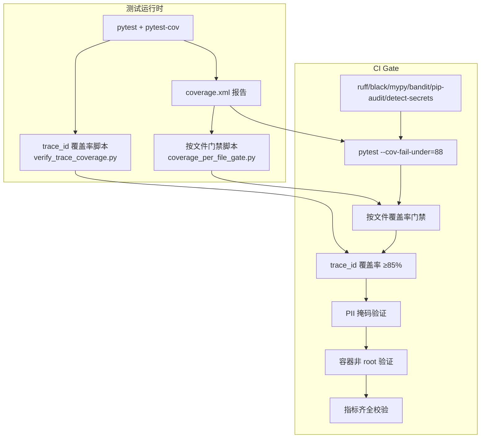
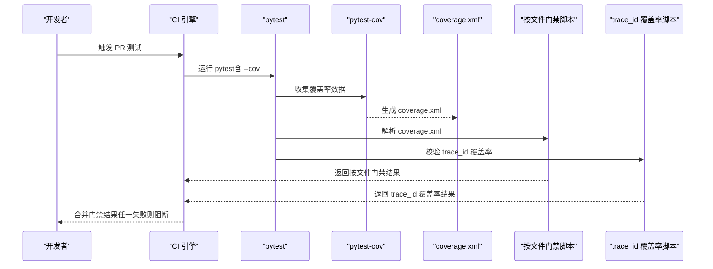
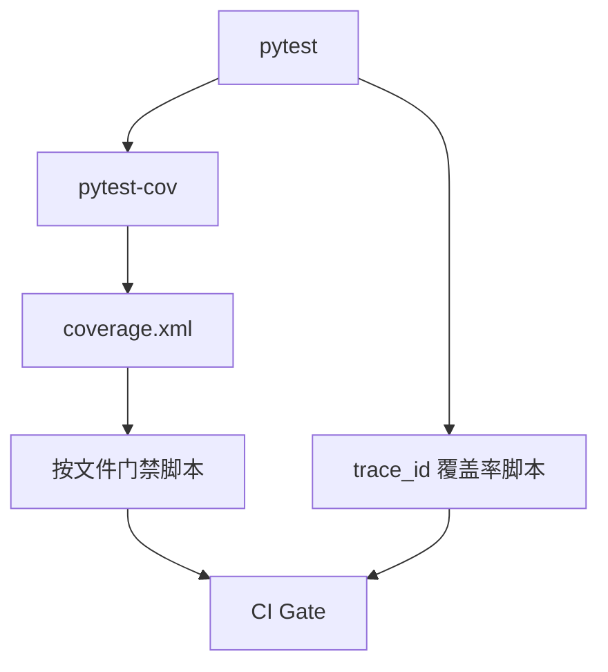

# 覆盖率策略

<cite>
**本文引用的文件**
- [pyproject.toml](file://pyproject.toml)
- [DESIGN.md](file://DESIGN.md)
- [docs/10-testing.md](file://docs/10-testing.md)
- [docs/13-test-design-hook-hardening.md](file://docs/13-test-design-hook-hardening.md)
- [tests/conftest.py](file://tests/conftest.py)
</cite>

## 目录
1. [简介](#简介)
2. [项目结构](#项目结构)
3. [核心组件](#核心组件)
4. [架构总览](#架构总览)
5. [详细组件分析](#详细组件分析)
6. [依赖分析](#依赖分析)
7. [性能考量](#性能考量)
8. [故障排查指南](#故障排查指南)
9. [结论](#结论)
10. [附录](#附录)

## 简介
本文件面向 XiaoPaw v2 的测试覆盖率策略，系统阐述覆盖率目标、计算方法、报告生成与门禁机制，以及实现路径与优化策略。v2 的覆盖率目标为：全局覆盖率不低于 88%，核心模块不低于 90%，个别严格模块（如 Runner、SessionManager、SkillLoader）不低于 95%；同时引入 trace_id 覆盖率门（≥85%）与按文件 fail-under 的精细化门禁，确保关键路径与安全关键模块得到充分验证。

## 项目结构
- 测试框架与工具链由 pytest + pytest-cov 驱动，配合 pytest-timeout、pytest-asyncio、pytest-xdist 等提升稳定性与并行效率。
- 覆盖率配置集中在 pyproject.toml 的 [tool.coverage.*] 段落，指定源码目录与排除项。
- 测试分层：单元（mock 为主）、集成（真实外部服务可选）、故障注入（破坏性测试）、安全对抗、性能基准。
- 覆盖率门禁：全局 fail-under=88，结合按文件 fail-under 脚本与 trace_id 覆盖率脚本共同构成 CI gate。

图表来源
- [pyproject.toml:57-63](file://pyproject.toml#L57-L63)
- [docs/10-testing.md:132-136](file://docs/10-testing.md#L132-L136)
- [docs/10-testing.md:945-987](file://docs/10-testing.md#L945-L987)

章节来源
- [pyproject.toml:40-63](file://pyproject.toml#L40-L63)
- [docs/10-testing.md:120-148](file://docs/10-testing.md#L120-L148)

## 核心组件
- 全局覆盖率门：pytest-cov 的全局 fail-under=88，作为 PR 必经门。
- 模块级覆盖率门：通过 coverage.xml 与按文件门禁脚本实现 per-file fail_under，覆盖核心模块与严格模块。
- trace_id 覆盖率门：verify_trace_coverage.py 校验 LLM/Skill 入口是否获得 trace_id，整体 ≥85%。
- 覆盖率报告：pytest 生成 term-missing 与 xml 报告，xml 供按文件门禁脚本解析。
- 覆盖率豁免：通过 .coveragerc 的 omit/exclude_lines 对纯数据类、薄封装等进行合理豁免。

章节来源
- [docs/10-testing.md:919-1040](file://docs/10-testing.md#L919-L1040)
- [pyproject.toml:57-63](file://pyproject.toml#L57-L63)

## 架构总览
覆盖率策略的执行链路如下：pytest 启动测试，pytest-cov 收集覆盖率数据，生成 coverage.xml；随后按文件门禁脚本解析 xml，校验每个文件的行覆盖率是否达到阈值；同时 verify_trace_coverage.py 校验 trace_id 覆盖率；CI Gate 将上述结果汇总，任一失败即阻止合并。

图表来源
- [docs/10-testing.md:132-136](file://docs/10-testing.md#L132-L136)
- [docs/10-testing.md:945-987](file://docs/10-testing.md#L945-L987)
- [docs/10-testing.md:1014-1040](file://docs/10-testing.md#L1014-L1040)

## 详细组件分析

### 全局覆盖率目标与计算
- 目标：全局覆盖率 ≥88%。
- 计算方式：pytest-cov 基于源码目录与 omit 规则统计行覆盖率，生成 coverage.xml。
- 配置入口：pyproject.toml 的 [tool.coverage.run] 指定 source 与 omit；pytest addopts 设置 --cov 与 --cov-fail-under=88。
- 报告生成：pytest 输出 term-missing 与 xml 报告，xml 供后续门禁脚本解析。

章节来源
- [pyproject.toml:57-63](file://pyproject.toml#L57-L63)
- [docs/10-testing.md:132-136](file://docs/10-testing.md#L132-L136)

### 核心模块覆盖率目标与实现
- 目标：核心模块 ≥90%，个别严格模块（Runner、SessionManager、SkillLoader）≥95%。
- 核心模块清单：runner.py、session/manager.py、memory/*、agents/main_crew.py、tools/skill_loader.py、feishu/*、observability/*。
- 实现策略：
  - 使用 coverage.xml 与按文件门禁脚本（coverage_per_file_gate.py）对关键文件设置 fail_under。
  - 通过 pytest --cov 生成 per-module 报告，结合 tests/unit/* 的针对性用例提升覆盖率。
  - 对安全关键模块（sandbox_guard、permission_gate）单独设置 95% 门槛，确保输入消毒与权限控制路径全覆盖。

章节来源
- [docs/10-testing.md:920-944](file://docs/10-testing.md#L920-L944)
- [docs/10-testing.md:945-987](file://docs/10-testing.md#L945-L987)
- [docs/13-test-design-hook-hardening.md:558-573](file://docs/13-test-design-hook-hardening.md#L558-L573)

### trace_id 覆盖率目标与实现
- 目标：trace_id 覆盖率 ≥85%。
- 实现：verify_trace_coverage.py 解析 JSON 日志，统计 LLM/Skill 入口是否获得 trace_id，整体与关键模块（runner、llm、feishu.sender）均需满足。
- CI 集成：作为独立 gate，与 pytest 覆盖率门并行执行，任一失败即阻断。

章节来源
- [docs/10-testing.md:919-929](file://docs/10-testing.md#L919-L929)
- [DESIGN.md:1014-1040](file://DESIGN.md#L1014-L1040)

### 覆盖率报告生成与解析
- 报告格式：pytest 生成 xml 报告，供按文件门禁脚本解析。
- 解析逻辑：脚本读取 coverage.xml，遍历 class 节点，提取 filename 与 line-rate，与预设阈值比较，输出失败项。
- 输出：若存在低于阈值的文件，脚本返回非零退出码，触发 CI 失败。

章节来源
- [docs/10-testing.md:945-987](file://docs/10-testing.md#L945-L987)

### 覆盖率配置与阈值设置
- 全局阈值：pytest addopts 中 --cov-fail-under=88。
- 模块阈值：coverage_per_file_gate.py 中对关键文件设置 fail_under（如 runner.py=95、session/manager.py=95、tools/skill_loader.py=95、agents/main_crew.py=90 等）。
- 豁免清单：.coveragerc 的 omit/exclude_lines 对纯数据类、薄封装、启动脚本等进行合理豁免，避免“虚假高覆盖率”。

章节来源
- [docs/10-testing.md:132-136](file://docs/10-testing.md#L132-L136)
- [docs/10-testing.md:945-987](file://docs/10-testing.md#L945-L987)
- [docs/10-testing.md:989-1011](file://docs/10-testing.md#L989-L1011)

### 覆盖率失败处理与回归控制
- 失败处理：任一 gate 失败即阻止合并；若覆盖率下降超过 1% 或核心模块覆盖率低于 90%，同样阻断。
- 回归控制：通过 pytest-benchmark、pytest-memray、72h canary 等手段，确保性能与内存回归不恶化。
- 例外与评审：若确需放宽阈值，需在设计文档与 CI 脚本中明确说明并评审。

章节来源
- [docs/10-testing.md:1039-1040](file://docs/10-testing.md#L1039-L1040)

### 覆盖率数据收集、分析与可视化
- 数据收集：pytest-cov 在测试执行期间收集行执行信息，生成 coverage.xml。
- 数据分析：按文件门禁脚本解析 xml，输出每个文件的覆盖率与阈值对比；verify_trace_coverage.py 分析 trace_id 覆盖情况。
- 可视化建议：可将 coverage.xml 上传为 CI artifact，结合第三方工具（如 codecov）进行趋势可视化与 PR 评论展示。

章节来源
- [docs/10-testing.md:945-987](file://docs/10-testing.md#L945-L987)
- [docs/10-testing.md:1027-1028](file://docs/10-testing.md#L1027-L1028)

### 覆盖率优化策略
- 用例密度优先：优先编写高 ROI 的用例，覆盖关键分支与异常路径。
- 并发与竞态：针对并发正确性测试（如 JSONL 并发 append、queue_gen 竞态、pending_index_tasks GC）提升并发路径覆盖率。
- 安全关键模块强化：对 sandbox_guard、permission_gate 等模块增加边界用例与对抗测试，确保 95% 覆盖。
- trace_id 覆盖：确保 LLM/Skill 入口均能生成 trace_id，必要时在测试中显式断言 trace_id 存在与传递。

章节来源
- [docs/10-testing.md:687-784](file://docs/10-testing.md#L687-L784)
- [docs/10-testing.md:841-898](file://docs/10-testing.md#L841-L898)
- [docs/13-test-design-hook-hardening.md:558-583](file://docs/13-test-design-hook-hardening.md#L558-L583)

### 热点代码保护与回归测试
- 热点模块：runner.py、session/manager.py、tools/skill_loader.py、feishu/listener.py、feishu/sender.py、observability/trace.py、observability/security.py。
- 保护策略：
  - 为每个热点模块建立“最小可运行”用例，确保关键路径 100% 覆盖。
  - 对异常路径（如 ENOSPC、LLM 5xx、pgvector down、Skill 超时、飞书 429）进行故障注入测试，验证系统韧性。
  - 使用 pytest-memray 与 72h canary 监控内存与性能回归。

章节来源
- [docs/10-testing.md:930-944](file://docs/10-testing.md#L930-L944)
- [docs/10-testing.md:382-607](file://docs/10-testing.md#L382-L607)

## 依赖分析
覆盖率策略依赖以下组件：
- pytest 与 pytest-cov：覆盖率收集与报告生成。
- 按文件门禁脚本：解析 coverage.xml，执行 per-file fail_under。
- trace_id 覆盖率脚本：解析 JSON 日志，统计 trace_id 覆盖。
- CI Gate：整合多维度门禁，形成最终合并决策。

图表来源
- [docs/10-testing.md:132-136](file://docs/10-testing.md#L132-L136)
- [docs/10-testing.md:945-987](file://docs/10-testing.md#L945-L987)
- [docs/10-testing.md:1014-1040](file://docs/10-testing.md#L1014-L1040)

章节来源
- [docs/10-testing.md:1014-1040](file://docs/10-testing.md#L1014-L1040)

## 性能考量
- 覆盖率与性能的平衡：在保证覆盖率的前提下，尽量减少真实外部依赖的测试开销，优先使用 mock 与 respx。
- 并行执行：利用 pytest-xdist 提升单元测试并行度，缩短 CI 时间。
- 压测与回归：通过 scripts/load_test.py 的 stub/real 两档 SLO，确保性能回归不恶化。

章节来源
- [docs/10-testing.md:1110-1176](file://docs/10-testing.md#L1110-L1176)
- [docs/10-testing.md:1179-1271](file://docs/10-testing.md#L1179-L1271)

## 故障排查指南
- 覆盖率门失败：
  - 检查 pytest addopts 是否包含 --cov 与 --cov-fail-under=88。
  - 检查 coverage.xml 是否生成，按文件门禁脚本是否正确解析。
  - 确认关键模块用例是否覆盖异常路径与边界条件。
- trace_id 覆盖率不足：
  - 检查 verify_trace_coverage.py 的输入日志路径与最小覆盖率阈值。
  - 确保 LLM/Skill 入口均能生成 trace_id，必要时在测试中断言 trace_id。
- CI Gate 失败：
  - 按照 10.10 节门禁清单逐一排查，确认 ruff、mypy、bandit、pip-audit、detect-secrets 是否通过。

章节来源
- [docs/10-testing.md:1014-1040](file://docs/10-testing.md#L1014-L1040)

## 结论
XiaoPaw v2 的覆盖率策略以“全局 ≥88%、核心模块 ≥90%、个别严格模块 ≥95%、trace_id 覆盖率 ≥85%”为目标，通过 pytest-cov 与按文件门禁脚本实现精细化门禁，并辅以 trace_id 覆盖率脚本与多项 CI Gate，确保关键路径与安全模块得到充分验证。配合并发正确性、故障注入与安全对抗测试，形成完整的质量保障闭环。

## 附录
- 快速命令参考（来自附录 A）：
  - 本地快通道：pytest -m "not (llm or sandbox or pgvector or feishu or chaos)" -n auto
  - 单模块覆盖率快查：pytest --cov=xiaopaw.runner --cov-report=term-missing tests/unit/runner/
  - 按文件门禁：python scripts/coverage_per_file_gate.py coverage.xml
  - trace_id 覆盖率：python scripts/verify_trace_coverage.py --min 0.85

章节来源
- [docs/10-testing.md:1377-1416](file://docs/10-testing.md#L1377-L1416)