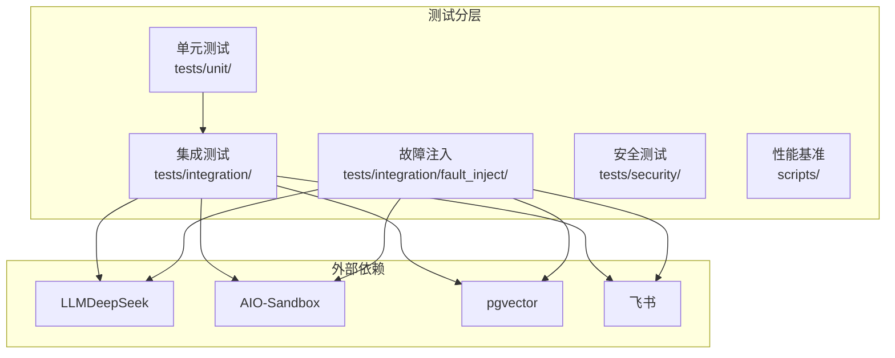
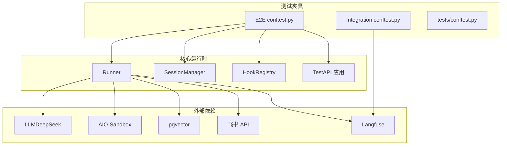
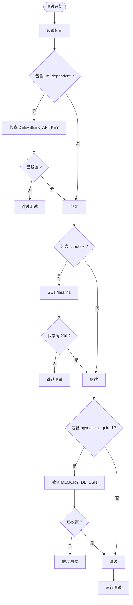
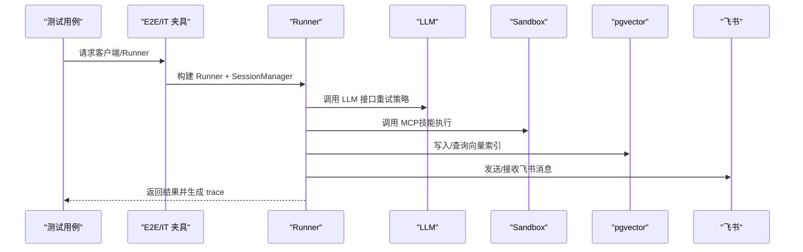
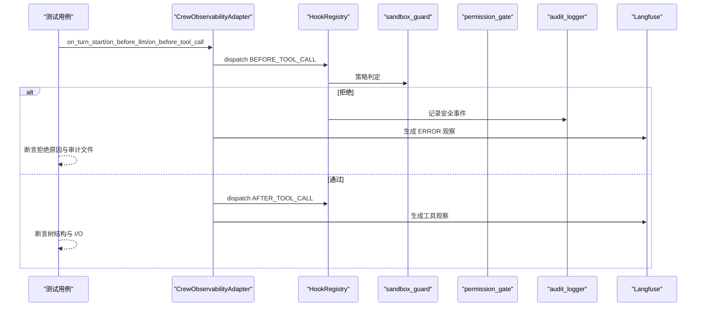
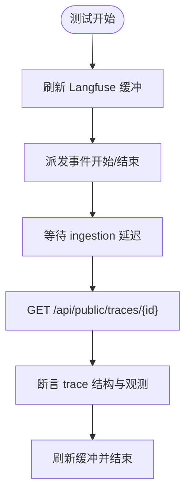
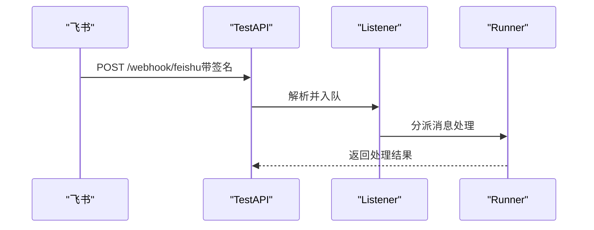
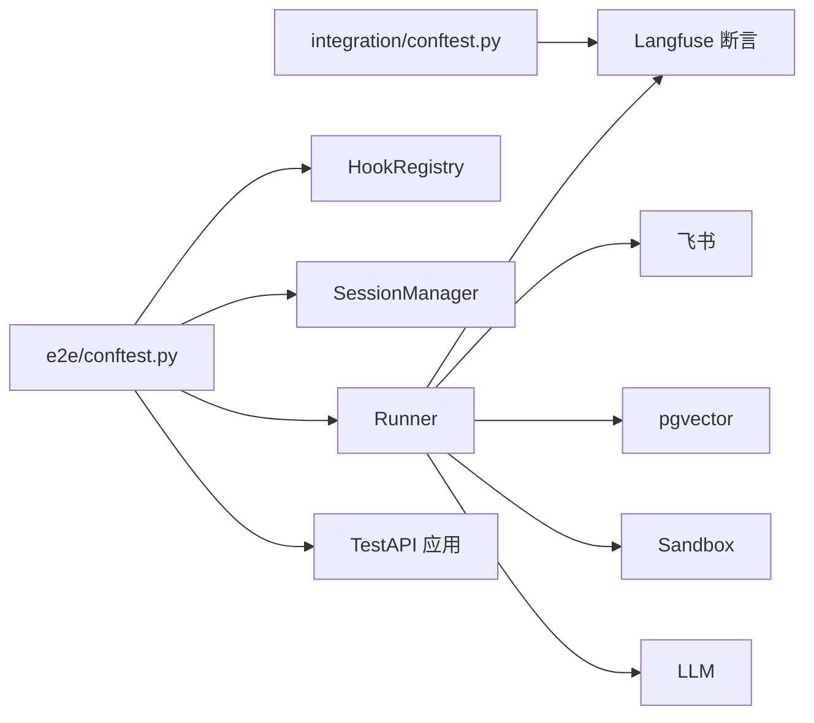
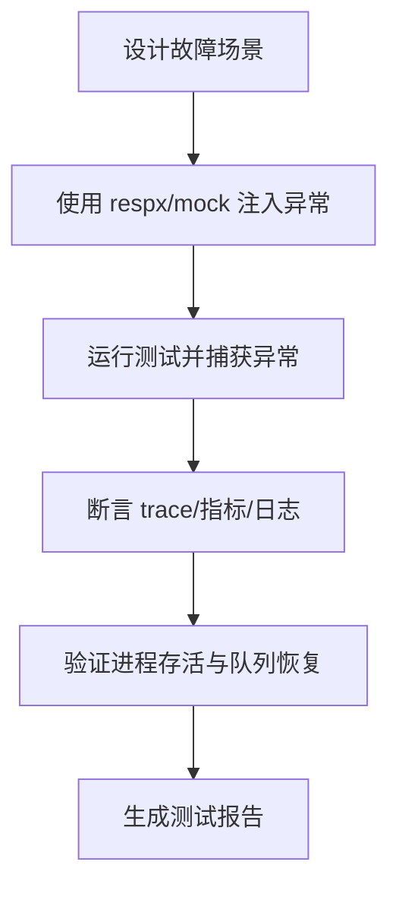

# 集成测试策略

<cite>
**本文档引用的文件**
- [tests/conftest.py](file://tests/conftest.py)
- [tests/integration/conftest.py](file://tests/integration/conftest.py)
- [tests/e2e/conftest.py](file://tests/e2e/conftest.py)
- [docs/10-testing.md](file://docs/10-testing.md)
- [pyproject.toml](file://pyproject.toml)
- [sandbox-docker-compose.yaml](file://sandbox-docker-compose.yaml)
- [schema.sql](file://schema.sql)
- [verify_setup.py](file://verify_setup.py)
- [tests/integration/test_adapter_integration.py](file://tests/integration/test_adapter_integration.py)
- [tests/integration/test_guardrail_deny_flow.py](file://tests/integration/test_guardrail_deny_flow.py)
- [tests/integration/test_security_chain.py](file://tests/integration/test_security_chain.py)
- [tests/e2e/test_e2e_01_slash.py](file://tests/e2e/test_e2e_01_slash.py)
- [tests/e2e/test_e2e_02_routing.py](file://tests/e2e/test_e2e_02_routing.py)
- [xiaopaw/api/test_server.py](file://xiaopaw/api/test_server.py)
- [xiaopaw/feishu/listener.py](file://xiaopaw/feishu/listener.py)
- [xiaopaw/skills/feishu_ops/scripts/send_file.py](file://xiaopaw/skills/feishu_ops/scripts/send_file.py)
- [xiaopaw/skills/feishu_ops/scripts/create_bitable_table.py](file://xiaopaw/skills/feishu_ops/scripts/create_bitable_table.py)
</cite>

## 目录
1. [简介](#简介)
2. [项目结构](#项目结构)
3. [核心组件](#核心组件)
4. [架构总览](#架构总览)
5. [详细组件分析](#详细组件分析)
6. [依赖分析](#依赖分析)
7. [性能考虑](#性能考虑)
8. [故障注入测试指南](#故障注入测试指南)
9. [测试数据与环境配置最佳实践](#测试数据与环境配置最佳实践)
10. [结论](#结论)

## 简介
本文件面向 XiaoPaw v2 的集成测试策略，系统阐述标记策略、前置检查机制、外部依赖管理、容器化与动态依赖管理、环境隔离、故障注入设计与实现、测试数据准备与验证流程。文档结合仓库中的测试夹具、标记体系、端到端与集成测试样例，以及外部服务（LLM、AIO-Sandbox、pgvector、飞书）的实际集成方式，提供可落地的实施建议与可视化图示。

## 项目结构
XiaoPaw v2 的测试分层清晰：单元测试为主，集成测试覆盖真实外部依赖，故障注入测试聚焦稳定性与韧性，安全测试覆盖对抗场景，性能基准用于发布前评估。集成测试通过 pytest 标记控制启用范围，配合会话隔离与 Langfuse 质量断言，确保可观测性与可验证性。

**图表来源**
- [docs/10-testing.md:48-80](file://docs/10-testing.md#L48-L80)

**章节来源**
- [docs/10-testing.md:48-80](file://docs/10-testing.md#L48-L80)

## 核心组件
- 标记体系与前置检查
  - 集成测试使用自定义标记控制外部依赖启用：`@pytest.mark.llm_dependent`、`@pytest.mark.sandbox`、`@pytest.mark.pgvector_required`、`@pytest.mark.feishu`、`@pytest.mark.observability` 等。
  - 前置检查通过 autouse fixture 在运行前探测依赖可用性，缺失时跳过测试，避免失败污染报告。
- 会话隔离与 Langfuse 质量断言
  - 每个集成测试生成唯一 session_id，确保 trace 隔离；提供断言工具链验证 trace 结构、根 span、生成观察、工具观察、拒绝观察等。
- 端到端测试与 TestAPI
  - 通过 TestAPI 模拟飞书事件，构建真实 Runner、SessionManager、HookRegistry 场景，验证路由隔离、并发安全、slash 命令生命周期等。

**章节来源**
- [pyproject.toml:44-55](file://pyproject.toml#L44-L55)
- [tests/integration/conftest.py:12-135](file://tests/integration/conftest.py#L12-L135)
- [tests/e2e/conftest.py:29-196](file://tests/e2e/conftest.py#L29-L196)

## 架构总览
下图展示集成测试中关键组件的交互关系：测试夹具负责构建 Runner、SessionManager、HookRegistry 与 TestAPI；Langfuse 提供 trace 查询与断言；外部依赖（LLM、Sandbox、pgvector、飞书）通过环境变量与健康检查进行前置验证。

**图表来源**
- [tests/e2e/conftest.py:241-321](file://tests/e2e/conftest.py#L241-L321)
- [tests/integration/conftest.py:98-135](file://tests/integration/conftest.py#L98-L135)
- [xiaopaw/api/test_server.py:19-34](file://xiaopaw/api/test_server.py#L19-L34)

**章节来源**
- [tests/e2e/conftest.py:241-321](file://tests/e2e/conftest.py#L241-L321)
- [tests/integration/conftest.py:98-135](file://tests/integration/conftest.py#L98-L135)
- [xiaopaw/api/test_server.py:19-34](file://xiaopaw/api/test_server.py#L19-L34)

## 详细组件分析

### 标记策略与前置检查机制
- 标记矩阵与行为
  - llm_dependent：依赖真实 LLM，需设置密钥；默认 PR 跳过，夜间全量运行。
  - sandbox：依赖 AIO-Sandbox，本地 8030 端口；CI 可通过容器编排拉起。
  - pgvector_required：依赖数据库；可由 testcontainers 动态拉起，避免共享状态。
  - feishu：依赖飞书应用凭证与测试群；release PR 必跑。
  - observability：验证 Langfuse trace 质量与树结构完整性。
- 前置检查
  - 通过 autouse fixture 在测试开始前检查环境变量与健康端点，不满足条件时跳过，避免误报。

**图表来源**
- [pyproject.toml:44-55](file://pyproject.toml#L44-L55)
- [tests/integration/conftest.py:350-374](file://tests/integration/conftest.py#L350-L374)

**章节来源**
- [pyproject.toml:44-55](file://pyproject.toml#L44-L55)
- [tests/integration/conftest.py:350-374](file://tests/integration/conftest.py#L350-L374)

### 外部依赖管理：LLM（DeepSeek）、AIO-Sandbox、pgvector、飞书
- LLM（DeepSeek）
  - 通过环境变量注入密钥；集成测试通过 LLM-as-Judge 判定回复质量。
  - 重试策略统一由 retry 工具实现，确保超时/5xx/429 场景下的韧性。
- AIO-Sandbox
  - 通过 docker compose 提供 MCP 服务；测试夹具提供健康检查与工作区挂载策略，确保跨会话持久化。
- pgvector
  - 使用 testcontainers 动态拉起容器，避免共享状态；提供独立路由键隔离数据。
  - 提供 SQL 索引与向量字段定义，支撑检索与全文检索。
- 飞书
  - 通过 TestAPI 模拟飞书事件；监听器解析消息并入队；飞书技能脚本调用飞书 OpenAPI。

**图表来源**
- [tests/e2e/conftest.py:283-321](file://tests/e2e/conftest.py#L283-L321)
- [sandbox-docker-compose.yaml:13-32](file://sandbox-docker-compose.yaml#L13-L32)
- [schema.sql:1-44](file://schema.sql#L1-L44)
- [xiaopaw/feishu/listener.py:113-147](file://xiaopaw/feishu/listener.py#L113-L147)

**章节来源**
- [tests/e2e/conftest.py:283-321](file://tests/e2e/conftest.py#L283-L321)
- [sandbox-docker-compose.yaml:13-32](file://sandbox-docker-compose.yaml#L13-L32)
- [schema.sql:1-44](file://schema.sql#L1-L44)
- [xiaopaw/feishu/listener.py:113-147](file://xiaopaw/feishu/listener.py#L113-L147)

### 测试容器化策略与动态依赖管理
- AIO-Sandbox 容器编排
  - 通过 compose 文件暴露 8030 端口，挂载技能目录与工作区；健康检查确保可用性。
- pgvector 动态拉起
  - 使用 testcontainers 在会话作用域内拉起容器，避免共享状态；每个用例使用独立路由键隔离数据。
- 环境隔离
  - 使用 tmp_path 与独立 data/ctx/workspace 目录，避免跨用例干扰；workspace-init 模板复制到临时目录，确保可重复性。

**章节来源**
- [sandbox-docker-compose.yaml:13-32](file://sandbox-docker-compose.yaml#L13-L32)
- [tests/e2e/conftest.py:267-281](file://tests/e2e/conftest.py#L267-L281)
- [docs/10-testing.md:1322-1344](file://docs/10-testing.md#L1322-L1344)

### 集成测试示例与配置方法
- 适配器与注册表集成
  - 使用 CrewObservabilityAdapter 与 HookRegistry，验证事件流转、拒绝传播、审计日志与成本度量。
- 安全链路集成
  - 验证沙箱守卫、权限门禁、审计日志在工具调用前后的协同与拒绝传播。
- 端到端示例
  - slash 命令与路由隔离：验证会话生命周期、状态查询、并发无交叉。

**图表来源**
- [tests/integration/test_adapter_integration.py:38-138](file://tests/integration/test_adapter_integration.py#L38-L138)
- [tests/integration/test_guardrail_deny_flow.py:20-79](file://tests/integration/test_guardrail_deny_flow.py#L20-L79)
- [tests/integration/test_security_chain.py:70-214](file://tests/integration/test_security_chain.py#L70-L214)

**章节来源**
- [tests/integration/test_adapter_integration.py:38-138](file://tests/integration/test_adapter_integration.py#L38-L138)
- [tests/integration/test_guardrail_deny_flow.py:20-79](file://tests/integration/test_guardrail_deny_flow.py#L20-L79)
- [tests/integration/test_security_chain.py:70-214](file://tests/integration/test_security_chain.py#L70-L214)

### Langfuse 质量断言与 Trace 验证
- 会话隔离
  - 为每个测试生成 unique_session_id，避免 trace 混淆。
- Trace 断言
  - 校验 sessionId/name、根 span（session-*）、生成观察（GENERATION）、工具观察、树结构完整性、拒绝观察（ERROR 级别与 deny_reason）。
- 异步刷新与重试
  - 在测试前后刷新缓冲，查询 trace 时按延迟重试，等待异步入库完成。

**图表来源**
- [tests/integration/conftest.py:38-135](file://tests/integration/conftest.py#L38-L135)
- [tests/e2e/conftest.py:113-196](file://tests/e2e/conftest.py#L113-L196)

**章节来源**
- [tests/integration/conftest.py:38-135](file://tests/integration/conftest.py#L38-L135)
- [tests/e2e/conftest.py:113-196](file://tests/e2e/conftest.py#L113-L196)

### 飞书集成测试方法
- 事件模拟
  - 通过 TestAPI 接收飞书事件，监听器解析消息并入队处理。
- 技能脚本调用
  - 飞书技能脚本直接调用飞书 OpenAPI，上传文件/发送消息等。
- 路由键与重放防护
  - 通过路由键隔离不同用户；重放防护通过时间戳与签名校验，避免重复入队。

**图表来源**
- [xiaopaw/api/test_server.py:19-34](file://xiaopaw/api/test_server.py#L19-L34)
- [xiaopaw/feishu/listener.py:113-147](file://xiaopaw/feishu/listener.py#L113-L147)
- [xiaopaw/skills/feishu_ops/scripts/send_file.py:49-104](file://xiaopaw/skills/feishu_ops/scripts/send_file.py#L49-L104)

**章节来源**
- [xiaopaw/api/test_server.py:19-34](file://xiaopaw/api/test_server.py#L19-L34)
- [xiaopaw/feishu/listener.py:113-147](file://xiaopaw/feishu/listener.py#L113-L147)
- [xiaopaw/skills/feishu_ops/scripts/send_file.py:49-104](file://xiaopaw/skills/feishu_ops/scripts/send_file.py#L49-L104)

## 依赖分析
- 组件耦合
  - 测试夹具与 Runner、SessionManager、HookRegistry 高内聚；Langfuse 断言工具与动态模块解耦。
  - 外部依赖通过环境变量与健康检查注入，降低硬编码耦合。
- 外部依赖关系
  - Runner 依赖 LLM/Sandbox/pgvector/飞书；Langfuse 作为观测性后端参与断言。
- 潜在环依赖
  - 测试夹具之间通过共享工具函数与断言方法协作，未发现直接环依赖。

**图表来源**
- [tests/integration/conftest.py:98-135](file://tests/integration/conftest.py#L98-L135)
- [tests/e2e/conftest.py:241-321](file://tests/e2e/conftest.py#L241-L321)
- [xiaopaw/api/test_server.py:19-34](file://xiaopaw/api/test_server.py#L19-L34)

**章节来源**
- [tests/integration/conftest.py:98-135](file://tests/integration/conftest.py#L98-L135)
- [tests/e2e/conftest.py:241-321](file://tests/e2e/conftest.py#L241-L321)
- [xiaopaw/api/test_server.py:19-34](file://xiaopaw/api/test_server.py#L19-L34)

## 性能考虑
- 测试超时与并发
  - 默认超时 600 秒；故障注入测试使用更严格超时（如 20 秒）防止卡死。
  - 单元测试可并行执行（pytest -n auto），集成测试按标记选择性启用。
- I/O 与资源
  - 临时目录与工作区隔离减少磁盘争用；pgvector 使用 testcontainers 避免共享状态。
- 观测性
  - Langfuse 断言包含树结构与生成观察校验，有助于定位性能瓶颈与异常路径。

**章节来源**
- [pyproject.toml:40-44](file://pyproject.toml#L40-L44)
- [docs/10-testing.md:66-79](file://docs/10-testing.md#L66-L79)

## 故障注入测试指南
- 设计思路
  - 以“进程存活 + 恢复后队列继续消费”为目标，覆盖磁盘满、LLM 5xx/超时/限流、pgvector 不可用、子 Crew 卡死、飞书 429 等典型故障。
- 实现要点
  - 使用 respx/mock 模拟外部服务异常；使用 asyncio.wait_for 控制超时；验证指标与日志输出。
  - 对象级故障注入（如 OSError/ConnectionError）与策略级拒绝（GuardrailDeny）双通道验证。
- 关键断言
  - trace 中拒绝观察（ERROR 级别与 deny_reason）、工具观察闭合、根 span 与树结构完整。

**图表来源**
- [docs/10-testing.md:382-607](file://docs/10-testing.md#L382-L607)

**章节来源**
- [docs/10-testing.md:382-607](file://docs/10-testing.md#L382-L607)

## 测试数据与环境配置最佳实践
- 环境变量
  - LLM：DEEPSEEK_API_KEY；飞书：应用凭证；pgvector：MEMORY_DB_DSN；Langfuse：LANGFUSE_BASE_URL/LANGFUSE_PUBLIC_KEY/LANGFUSE_SECRET_KEY。
- 配置验证
  - 使用 verify_setup.py 校验环境变量、配置文件、模块导入与 LLM 初始化参数。
- 数据隔离
  - 使用 tmp_path 与 workspace-init 模板复制，确保每例独立工作区；pgvector 用例使用独立路由键过滤。
- 健康检查
  - AIO-Sandbox 通过健康检查端点；飞书发送前检查基础连通性。

**章节来源**
- [verify_setup.py:23-140](file://verify_setup.py#L23-L140)
- [tests/e2e/conftest.py:267-378](file://tests/e2e/conftest.py#L267-L378)
- [docs/10-testing.md:1322-1344](file://docs/10-testing.md#L1322-L1344)

## 结论
XiaoPaw v2 的集成测试策略以标记驱动、前置检查、外部依赖隔离与 Langfuse 质量断言为核心，结合容器化与动态依赖管理，形成可扩展、可维护、可验证的测试体系。通过故障注入测试强化系统韧性，通过端到端与集成测试覆盖真实业务路径，确保在引入真实外部依赖的同时保持测试的稳定性与可重复性。