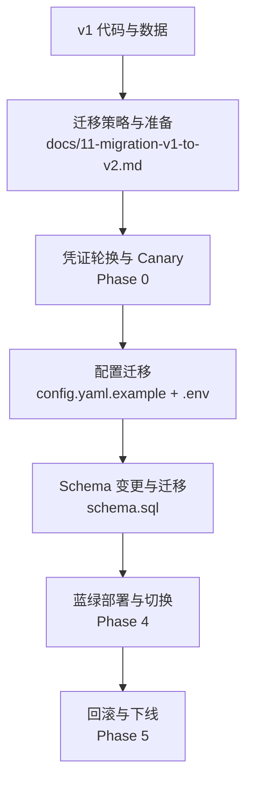
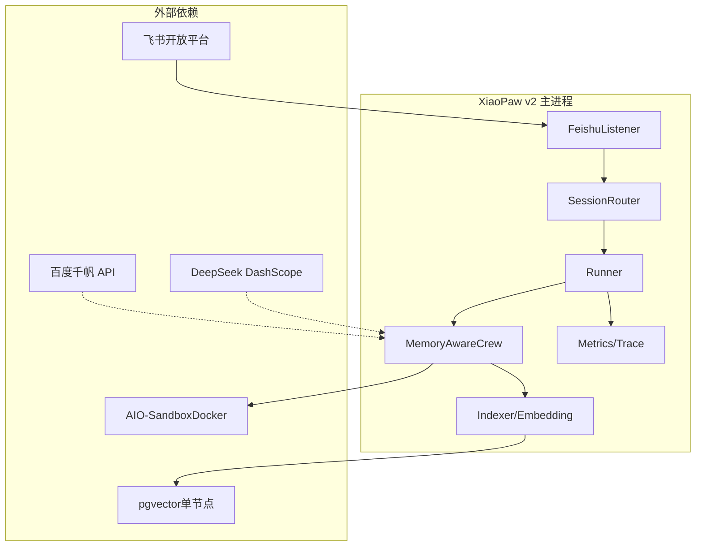
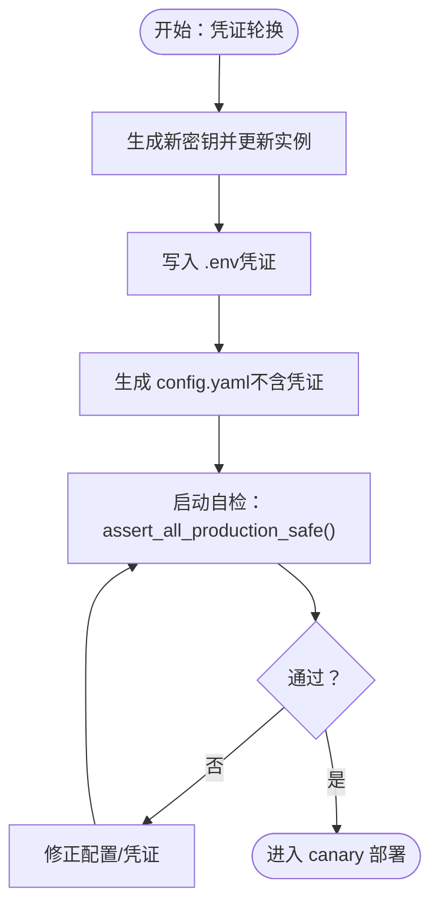
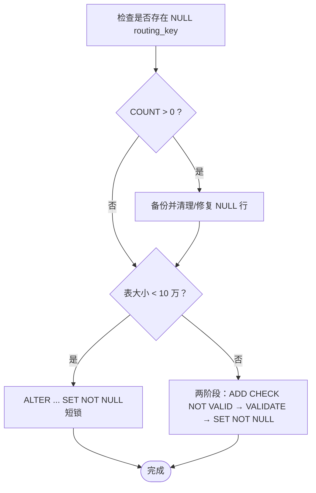
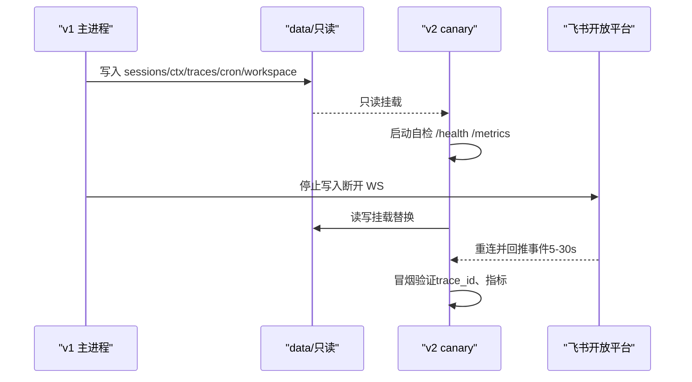
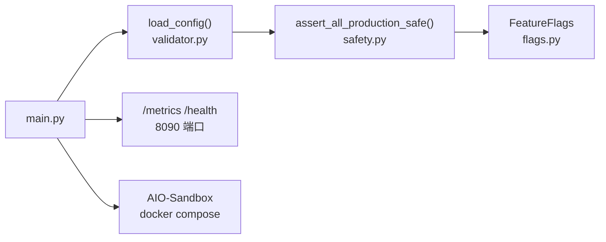

# 迁移指南

<cite>
**本文引用的文件**
- [docs/11-migration-v1-to-v2.md](file://docs/11-migration-v1-to-v2.md)
- [DESIGN.md](file://DESIGN.md)
- [docs/03-data.md](file://docs/03-data.md)
- [docs/09-config.md](file://docs/09-config.md)
- [docs/07-security.md](file://docs/07-security.md)
- [config.yaml.example](file://config.yaml.example)
- [schema.sql](file://schema.sql)
- [pyproject.toml](file://pyproject.toml)
- [sandbox-docker-compose.yaml](file://sandbox-docker-compose.yaml)
- [xiaopaw/config/validator.py](file://xiaopaw/config/validator.py)
- [xiaopaw/config/safety.py](file://xiaopaw/config/safety.py)
- [xiaopaw/config/flags.py](file://xiaopaw/config/flags.py)
</cite>

## 目录
1. [简介](#简介)
2. [项目结构](#项目结构)
3. [核心组件](#核心组件)
4. [架构总览](#架构总览)
5. [详细组件分析](#详细组件分析)
6. [依赖关系分析](#依赖关系分析)
7. [性能考量](#性能考量)
8. [故障排查指南](#故障排查指南)
9. [结论](#结论)
10. [附录](#附录)

## 简介
本指南面向已部署 v1（xiaopaw-with-memory）并计划升级到 v2（xiaopaw-v2）的运维与实施工程师，提供一份可执行的升级 SOP。v2 在凭证管理、配置结构、Schema 约束、可观测与安全加固等方面进行了系统性升级，同时保持与 v1 数据的完全向前兼容。迁移策略包括蓝绿部署（推荐）、停机升级与原地升级三种路径，分别对应不同的停机时间、数据迁移复杂度与回滚难度。

## 项目结构
- 文档与设计
  - 迁移指南：docs/11-migration-v1-to-v2.md
  - 设计总纲：DESIGN.md
  - 数据设计：docs/03-data.md
  - 配置规范：docs/09-config.md
  - 安全与威胁模型：docs/07-security.md
- 配置与 Schema
  - 示例配置：config.yaml.example
  - pgvector Schema：schema.sql
  - 依赖与构建：pyproject.toml
  - Sandbox Compose（开发/测试）：sandbox-docker-compose.yaml
- 配置与安全校验（v2 核心）
  - 配置校验与加载：xiaopaw/config/validator.py
  - 启动安全校验：xiaopaw/config/safety.py
  - Feature Flags：xiaopaw/config/flags.py

**章节来源**
- [docs/11-migration-v1-to-v2.md:1-800](file://docs/11-migration-v1-to-v2.md#L1-L800)
- [DESIGN.md:129-190](file://DESIGN.md#L129-L190)

## 核心组件
- 凭证与配置
  - v1 凭证混入 config.yaml，v2 强制凭证放入 .env，并进行启动自检（弱口令、端口绑定等）。
  - config.yaml 新增 feature_flags、observability.metrics_port、sender.max_concurrent 等字段。
- 数据与 Schema
  - data/ 目录（sessions、ctx、traces、cron、workspace、pgvector）v2 兼容 v1。
  - pgvector 新增 routing_key NOT NULL 约束，需两阶段 ALTER 避免锁表。
- 安全与可观测
  - 启动自检 assert_all_production_safe()；/metrics 与 /health 统一端口 8090；trace_id 贯穿；PII 脱敏；MCP 白名单；入站速率限制；Webhook ReplayCache。
- 运行时与并发
  - SessionManager 使用 LRUCache(1000) + dispatch_lock；Skill 超时与 sandbox 主动 kill；Indexer 连接池 ThreadedConnectionPool；Cron 使用 filelock 与 DLQ。

**章节来源**
- [docs/09-config.md:35-78](file://docs/09-config.md#L35-L78)
- [docs/07-security.md:108-148](file://docs/07-security.md#L108-L148)
- [docs/11-migration-v1-to-v2.md:266-437](file://docs/11-migration-v1-to-v2.md#L266-L437)

## 架构总览
v2 单节点部署，核心数据与外部依赖如下：
- 飞书 WebSocket（长连）→ FeishuListener → SessionRouter → Runner → MemoryAwareCrew
- Agent 推理 → Skill 执行 → AIO-Sandbox MCP
- 三层记忆：上下文（ctx）、文件（workspace）、搜索（pgvector）
- 可观测：/metrics（Bearer Token）+ trace_id + 日志 JSON + Langfuse

**图表来源**
- [DESIGN.md:192-200](file://DESIGN.md#L192-L200)

**章节来源**
- [DESIGN.md:158-177](file://DESIGN.md#L158-L177)

## 详细组件分析

### 凭证轮换与配置迁移
- 凭证轮换清单（v1 凭证视为已泄露）
  - PostgreSQL 数据库用户：新建 xiaopaw_v2 用户，保留旧用户灰度期回滚使用。
  - 飞书 App Secret：重新生成并在 v1 与 canary 实例同步更新。
  - DeepSeek API Key：新建 key，旧 key 灰度期保留。
  - 百度千帆 API Key：同上。
  - XIAOPAW_METRICS_TOKEN：生成 ≥32 字符随机 token。
- .env 字段清单（最小集合）
  - FEISHU_APP_ID / FEISHU_APP_SECRET / FEISHU_ENCRYPT_KEY / FEISHU_VERIFICATION_TOKEN
  - DEEPSEEK_API_KEY
  - MEMORY_DB_DSN
  - BAIDU_API_KEY（可选）
  - XIAOPAW_METRICS_TOKEN / XIAOPAW_TESTAPI_TOKEN
  - XIAOPAW_ENV=prod/dev/canary
- config.yaml 新增字段与变更
  - 新增 feature_flags、observability.metrics_port（统一 8090）、sender.max_concurrent、session.max_active_sessions、sandbox.url（容器内 8080）、debug.test_api_host（强制 loopback）、cron.file_lock_timeout_s 等。
  - 删除 health_port（与 metrics_port 同端口）。
- 启动前自检
  - assert_all_production_safe：prod 环境禁止开启 test_api，端口绑定 127.0.0.1，DSN 密码与飞书 secret 强度校验，/metrics Bearer Token ≥32 字符。

**图表来源**
- [docs/11-migration-v1-to-v2.md:54-127](file://docs/11-migration-v1-to-v2.md#L54-L127)
- [docs/09-config.md:21-78](file://docs/09-config.md#L21-L78)
- [xiaopaw/config/safety.py:27-47](file://xiaopaw/config/safety.py#L27-L47)

**章节来源**
- [docs/11-migration-v1-to-v2.md:54-127](file://docs/11-migration-v1-to-v2.md#L54-L127)
- [docs/09-config.md:35-78](file://docs/09-config.md#L35-L78)
- [xiaopaw/config/safety.py:27-47](file://xiaopaw/config/safety.py#L27-L47)

### Schema 变更与迁移
- 幂等创建
  - schema.sql 新增 routing_key NOT NULL 约束；使用 CREATE TABLE IF NOT EXISTS 对新 DB 生效。
- NOT NULL 约束两阶段迁移（大表）
  - 步骤 1：添加 CHECK NOT VALID（不扫描全表，ShareUpdateExclusiveLock）。
  - 步骤 2：VALIDATE CONSTRAINT（顺序扫描全表，允许 DML，ShareUpdateExclusiveLock）。
  - 步骤 3（可选）：ALTER COLUMN ... SET NOT NULL（PG12+ 跳过全表扫描，仅元数据变更）。
- RLS（可选，多租户）
  - ENABLE ROW LEVEL SECURITY；策略 USING (routing_key = current_setting('xiaopaw.current_routing_key', true))；应用侧每次查询前 SET LOCAL。
- 索引复查
  - REINDEX TABLE CONCURRENTLY memories（不阻塞读写）。

**图表来源**
- [docs/11-migration-v1-to-v2.md:179-234](file://docs/11-migration-v1-to-v2.md#L179-L234)
- [schema.sql:4-18](file://schema.sql#L4-L18)

**章节来源**
- [docs/11-migration-v1-to-v2.md:164-263](file://docs/11-migration-v1-to-v2.md#L164-L263)
- [schema.sql:1-44](file://schema.sql#L1-L44)

### 数据兼容性矩阵与迁移步骤
- 兼容性结论
  - sessions/index.json、sessions/{sid}.jsonl、ctx/{sid}_ctx.json、ctx/{sid}_raw.jsonl、traces、cron/tasks.json、workspace/sessions、workspace/memory.md 完全兼容，可直接复制。
  - pgvector memories 表兼容，但需补充 routing_key NOT NULL（两阶段）。
  - workspace/.config/{feishu,baidu}.json 兼容，v2 启动时从 docker secrets 重写。
  - SKILL.md frontmatter v2 会覆盖部分核心 Skill 的上游变更，需用户自定义补齐 allowed_tools。
  - config.yaml 需改造；代码目录替换为 v2。
- 迁移步骤
  - 复制 data/ 到 canary（只读挂载），启动 v2 canary。
  - 验证 /health（8090）、/metrics（Bearer Token）、trace_id 贯穿、LRUCache 正确性、Cron filelock、pgvector 连接池等。
  - 蓝绿切换：停止 v1 写入 → v2 读写挂载 → 飞书重连窗口（5-30s）→ 冒烟验证。
  - 下线 v1：备份最终状态、清理旧 DB 用户、作废旧凭证、归档 v1 代码。

**图表来源**
- [docs/11-migration-v1-to-v2.md:582-603](file://docs/11-migration-v1-to-v2.md#L582-L603)

**章节来源**
- [docs/11-migration-v1-to-v2.md:139-161](file://docs/11-migration-v1-to-v2.md#L139-L161)
- [docs/11-migration-v1-to-v2.md:582-632](file://docs/11-migration-v1-to-v2.md#L582-L632)

### 零停机升级与蓝绿部署策略
- 策略对比
  - 蓝绿部署（推荐）：停机时间 ≤30s（飞书 WS 重连窗口），低数据迁移复杂度（只读挂载 data/，切换后转主）。
  - 停机升级：5-15 分钟（数据复制 + 启动），中等复杂度。
  - 原地升级：≤2 分钟（重启），高复杂度（v1 stop → 改 config → v2 start）。
- 关键前提
  - v2 不支持多节点（单节点部署）。
  - v1 凭证视为已泄露，Phase 0 必须先轮换。
  - data/ 格式兼容，v2 读 v1 数据无需转换。
- 切换窗口
  - 飞书客户端断连后服务端缓存事件（通常 ≥5 分钟），v2 重连后事件回推。
  - 切换后 RTO 目标 ≤5 分钟（含冒烟验证）。

**章节来源**
- [docs/11-migration-v1-to-v2.md:29-47](file://docs/11-migration-v1-to-v2.md#L29-L47)
- [docs/11-migration-v1-to-v2.md:582-610](file://docs/11-migration-v1-to-v2.md#L582-L610)

### 配置变更对照表与 Feature Flags
- 配置变更要点
  - 凭证全部移至 .env；config.yaml 新增 feature_flags、observability.metrics_port、sender.max_concurrent、session.max_active_sessions、sandbox.url、debug.test_api_host、cron.file_lock_timeout_s 等。
  - 删除 health_port（与 metrics_port 同端口）。
- Feature Flags（v2.1）
  - token_counter_mode（qwen_official/hf_deepseek/rough）、enable_skill_timeout、enable_cron_filelock、enable_memory_save_filelock、enable_feishu_rate_limit_aware、enable_trace_id、enable_mcp_whitelist、enable_memory_save_filter、enable_webhook_replay_cache、enable_inbound_rate_limit、enable_pgvector_rls、enable_pgvector_connection_pool。
- 启动校验
  - assert_all_production_safe()：prod 环境禁止 test_api、端口绑定 127.0.0.1、凭证强度校验、/metrics Bearer Token 校验。

**章节来源**
- [docs/11-migration-v1-to-v2.md:298-401](file://docs/11-migration-v1-to-v2.md#L298-L401)
- [xiaopaw/config/flags.py:9-23](file://xiaopaw/config/flags.py#L9-L23)
- [xiaopaw/config/safety.py:27-47](file://xiaopaw/config/safety.py#L27-L47)

### 测试回归清单与 72h Canary 观测
- 基础冒烟
  - --check-only 通过；/health 200；/metrics 需 Bearer Token；prod 环境拒绝 TestAPI。
- 数据连续性
  - /status 能读取 v1 保存的 session；历史消息可读；ctx.json 可还原；cron tasks 可加载；search_memory 可查询；workspace 文件可读。
- v2 新增能力
  - Webhook ReplayCache、入站速率限制、memory-save 过滤、MCP 白名单、Skill 超时、飞书限流识别、raw_response 属性改名、trace_id 贯穿、PII mask、LRUCache 互斥正确性、Cron filelock、sandbox 端口封闭、pgvector 连接池。
- 72h Canary 观测
  - runner_alive=1；内存增长斜率 < 1MB/h；延迟 p95 与 baseline 对比；技能超时与 Cron DLQ 指标符合预期；日志无 ERROR 级未处理异常。

**章节来源**
- [docs/11-migration-v1-to-v2.md:440-517](file://docs/11-migration-v1-to-v2.md#L440-L517)

### 回滚方案
- Phase 0/1 回滚（凭证过渡窗口）
  - 凭证轮换为单向；v2.1 凭证过渡窗口 24h；canary 用新凭证，prod v1 用旧凭证，允许短暂并存。
- Phase 1-2 回滚（canary 启动失败）
  - 直接 down canary compose，恢复配置即可。
- Phase 3 回滚（canary 观察期发现问题）
  - 改 config.yaml.feature_flags → SIGHUP 重载；代码 bug 修复 → 重新部署 canary → 延长观察。
- Phase 4 回滚（蓝绿切换失败）
  - data/ 已被 v2 写入若干分钟；如涉及 RLS 或 v2-only 约束，v1 回滚需先 DISABLE ROW LEVEL SECURITY。
- Phase 5 回滚（v1 已下线）
  - 不建议；如必须回滚，恢复旧凭证、从归档恢复 v1 代码、恢复凭证到 v1 config.yaml、启动 v1。

**章节来源**
- [docs/11-migration-v1-to-v2.md:636-714](file://docs/11-migration-v1-to-v2.md#L636-L714)

### 常见迁移问题 FAQ
- 为什么 v1 data/ 能直接被 v2 读？
  - v2 数据设计是 v1 的严格超集；唯一例外是 config.yaml 结构变更与 .env（v1 无）。
- pgvector 的 routing_key NOT NULL 约束，v1 运行期间会被触发吗？
  - 不会；v1 upsert_memory 时必然填充 routing_key，约束为兜底校验。
- 切换窗口用户发的消息会丢吗？
  - 飞书 WS 缓存事件（通常 ≥5 分钟），v2 重连后回推；若失败多为 v2 启动失败导致超出缓冲窗口。
- 教学 demo 环境要不要改成 v2？
  - 不建议；v2 多了凭证自检、验签、MCP 白名单等机制，教学场景会徒增门槛。
- SKILL.md 是否必须补齐 allowed_tools？
  - 取决于 feature_flags.enable_mcp_whitelist：true 时必须补，否则会降级为“无 MCP 工具”。
- 凭证从 config.yaml 移到 .env/docker secrets，历史仓库里的凭证怎么办？
  - 必须做 git filter-repo 清除历史；不可回滚；需强制 48h 通告并重写推送。
- LRUCache(1000) 对高活跃场景会误驱逐吗？
  - 日活 1000 以下无影响；可调大 session.max_active_sessions 并监控 evicted 指标。
- v2 的 DeepSeek 官方 tokenizer 找不到怎么办？
  - 自动降级到 rough（len//2）；校准报告会给出偏差范围。
- 回滚到 v1 后 pgvector 里的 v2 新数据会有问题吗？
  - 不会；约束为加法，v2 写入 v1 能正常读；RLS 需先 DISABLE ROW LEVEL SECURITY。
- 如何验证切换过程中没丢消息？
  - 切换前后 5 分钟对比 xiaopaw_inbound_total 指标与飞书后台“事件推送成功数”。

**章节来源**
- [docs/11-migration-v1-to-v2.md:717-800](file://docs/11-migration-v1-to-v2.md#L717-L800)

## 依赖关系分析
- 配置加载与校验
  - main.py 加载 config.yaml → 环境变量替换 → Pydantic 校验 → assert_all_production_safe。
- 依赖与构建
  - pyproject.toml 定义核心依赖（aiohttp、lark-oapi、pydantic、crewai 等）与可选依赖（psycopg2、prometheus_client、langfuse 等）。
- Sandbox 与 Workspace
  - sandbox-docker-compose.yaml 挂载 ./data/workspace 为 /workspace，确保跨会话持久化。

**图表来源**
- [docs/09-config.md:60-78](file://docs/09-config.md#L60-L78)
- [pyproject.toml:6-31](file://pyproject.toml#L6-L31)
- [sandbox-docker-compose.yaml:8-23](file://sandbox-docker-compose.yaml#L8-L23)

**章节来源**
- [docs/09-config.md:60-78](file://docs/09-config.md#L60-L78)
- [pyproject.toml:1-63](file://pyproject.toml#L1-L63)
- [sandbox-docker-compose.yaml:1-32](file://sandbox-docker-compose.yaml#L1-L32)

## 性能考量
- 并发与资源治理
  - SessionManager 使用 LRUCache(1000) + dispatch_lock，避免 OOM；sender.max_concurrent 控制并发；Indexer 使用 ThreadedConnectionPool。
- 指标与观测
  - /metrics 暴露 8 核心指标；trace_id 贯穿；Langfuse 可选；Prometheus 拉取。
- 索引与查询抖动
  - 可选 REINDEX TABLE CONCURRENTLY 减少升级后查询抖动。

**章节来源**
- [docs/11-migration-v1-to-v2.md:477-507](file://docs/11-migration-v1-to-v2.md#L477-L507)
- [schema.sql:20-44](file://schema.sql#L20-L44)

## 故障排查指南
- 启动失败
  - 检查 .env 凭证长度与强度；prod 环境禁止开启 test_api；/metrics Bearer Token ≥32 字符。
- /metrics 401
  - 确认 Authorization: Bearer $XIAOPAW_METRICS_TOKEN；端口 8090。
- 切换后消息丢失
  - 对比 xiaopaw_inbound_total 与飞书后台“事件推送成功数”，超出预期需查“推送失败重试”记录。
- RLS 导致 v1 无法写入
  - 临时 DISABLE ROW LEVEL SECURITY；回滚后视情况重开。
- Sandbox 端口映射
  - docker compose config 应无 aio-sandbox host ports 映射（容器间走 8080）。

**章节来源**
- [docs/11-migration-v1-to-v2.md:440-462](file://docs/11-migration-v1-to-v2.md#L440-L462)
- [docs/11-migration-v1-to-v2.md:786-793](file://docs/11-migration-v1-to-v2.md#L786-L793)
- [sandbox-docker-compose.yaml:16-17](file://sandbox-docker-compose.yaml#L16-L17)

## 结论
v2 的升级在凭证、配置、Schema 与安全可观测方面进行了系统性加固，同时保持与 v1 数据的完全兼容。推荐采用蓝绿部署策略，结合 Canary 72h 观测与严格的回滚预案，确保生产环境零停机或极短停机时间内的平滑迁移。迁移过程中务必遵循凭证轮换、配置校验与 Schema 两阶段迁移的关键步骤，以规避潜在风险。

## 附录
- Phase 0 交付物
  - docs/phase0-checklist.md 全部勾完；tokenizer 校准报告；Canary 24h smoke 监控截图；凭证轮换完成清单；v1 数据与 pgvector dump 归档。
- 代码与镜像
  - 镜像使用 tag + digest 锁版本，避免漂移。
- 强制 48h 通告与 force-push
  - 执行 git filter-repo 清理 config.yaml 历史；强制推送分支与 tag；通告下游重新 clone。

**章节来源**
- [docs/11-migration-v1-to-v2.md:129-136](file://docs/11-migration-v1-to-v2.md#L129-L136)
- [docs/11-migration-v1-to-v2.md:752-774](file://docs/11-migration-v1-to-v2.md#L752-L774)