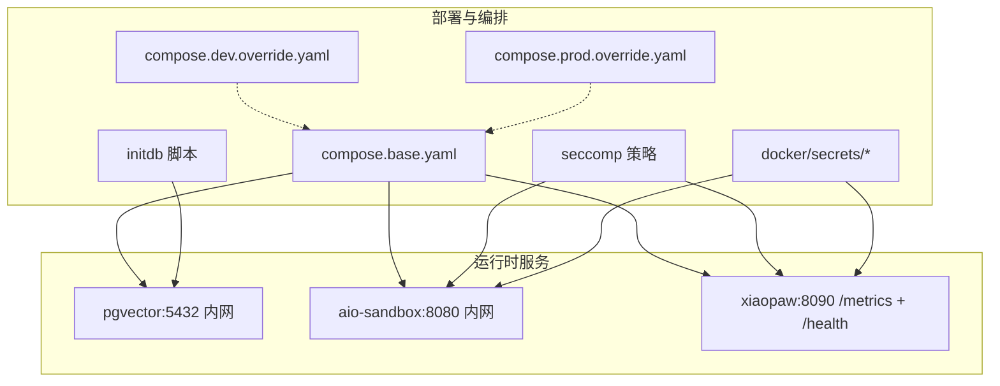
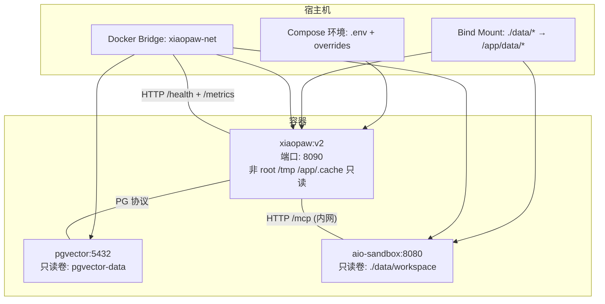
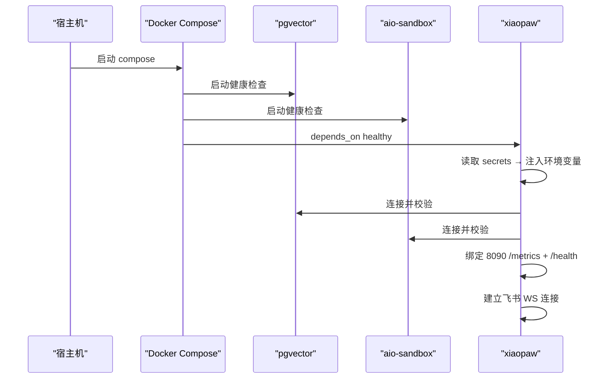

# Docker 部署

<cite>
**本文引用的文件**
- [docs/08-deployment.md](file://docs/08-deployment.md)
- [docs/01-architecture.md](file://docs/01-architecture.md)
- [docs/09-config.md](file://docs/09-config.md)
- [DESIGN.md](file://DESIGN.md)
- [sandbox-docker-compose.yaml](file://sandbox-docker-compose.yaml)
- [config.yaml.example](file://config.yaml.example)
</cite>

## 目录
1. [简介](#简介)
2. [项目结构](#项目结构)
3. [核心组件](#核心组件)
4. [架构总览](#架构总览)
5. [详细组件分析](#详细组件分析)
6. [依赖关系分析](#依赖关系分析)
7. [性能考量](#性能考量)
8. [故障排查指南](#故障排查指南)
9. [结论](#结论)
10. [附录](#附录)

## 简介
本文件面向 XiaoPaw v2 的 Docker 部署，围绕镜像构建、容器编排、网络与卷挂载、环境差异化配置、容器间通信、端口映射与健康检查、镜像构建/推送/拉取最佳实践进行系统化说明。内容来源于仓库内的部署设计文档、架构文档、配置文档与沙箱 compose 示例，并结合 v2 生产加固的设计理念（单节点、非 root 运行、seccomp 硬化、凭据注入、健康检查与资源约束等）。

## 项目结构
XiaoPaw v2 的部署相关文件主要分布在以下位置：
- 部署设计与 Compose：docs/08-deployment.md、docker/compose.base.yaml、docker/compose.dev.override.yaml、docker/compose.prod.override.yaml
- Dockerfile 与忽略规则：Dockerfile、.dockerignore
- 沙箱 Compose 示例：sandbox-docker-compose.yaml
- 配置模板：config.yaml.example
- 架构与端口契约：docs/01-architecture.md、docs/ssot/ports.md
- 环境变量与凭证分层：docs/08-deployment.md、docs/09-config.md

图表来源
- [docs/08-deployment.md:117-360](file://docs/08-deployment.md#L117-L360)

章节来源
- [docs/08-deployment.md:75-116](file://docs/08-deployment.md#L75-L116)
- [docs/01-architecture.md:349-395](file://docs/01-architecture.md#L349-L395)

## 核心组件
- xiaopaw 主服务：对外暴露统一端口 8090（/health 与 /metrics 同端口），容器内以非 root 运行，具备健康检查与资源限制。
- pgvector 数据库：容器内 5432，仅通过 xiaopaw-net 内网访问，不向宿主机暴露。
- aio-sandbox：容器内 8080，仅通过 xiaopaw-net 内网访问，不向宿主机暴露，内置健康检查。
- 凭证与配置注入：通过 docker secrets 文件注入（L2），配合 entrypoint 将 FILE 变量转换为同名环境变量；.env 仅保留非敏感变量。
- 网络：自定义桥接网络 xiaopaw-net，内部互通，外部只暴露必要的端口。

章节来源
- [docs/08-deployment.md:117-360](file://docs/08-deployment.md#L117-L360)
- [docs/01-architecture.md:349-395](file://docs/01-architecture.md#L349-L395)

## 架构总览
下图展示 XiaoPaw v2 在单节点生产/灰度/开发三种形态下的容器化部署视图与数据流：

图表来源
- [docs/01-architecture.md:349-395](file://docs/01-architecture.md#L349-L395)
- [docs/08-deployment.md:117-360](file://docs/08-deployment.md#L117-L360)

## 详细组件分析

### Dockerfile 多阶段构建与安全配置
- 多阶段构建：builder 阶段安装编译依赖与 pip 依赖至独立目录，runtime 阶段仅保留精简基础镜像与运行时依赖，最终镜像体积显著降低。
- ARG 注入：GIT_SHA、BUILD_DATE、XIAOPAW_VERSION 通过构建参数注入，固化到镜像 LABEL 中，供 /health 与指标返回。
- 非 root 运行：runtime 使用数字 uid/gid 的 nobody 用户，避免名称差异导致的可移植性问题；ENTRYPOINT 使用 tini 作为 PID 1，负责回收僵尸进程与信号转发。
- 健康检查：容器级 HEALTHCHECK 与 Compose 层 healthcheck 双重保障，start_period 放宽冷启动开销。
- 最小依赖：仅安装运行所需包（libpq5、ca-certificates、curl），减少攻击面。
- .dockerignore：严格排除 .env*、data/、tests/、docs/ 等，避免敏感与无关内容进入镜像层。

章节来源
- [docs/08-deployment.md:426-575](file://docs/08-deployment.md#L426-L575)

### docker-compose.yml 服务编排、网络与卷挂载
- 基础编排（compose.base.yaml）：
  - 三服务：pgvector、aio-sandbox、xiaopaw，均置于 xiaopaw-net 网络。
  - 端口契约：8090（/health + /metrics）、9090（TestAPI，仅 dev）、5432（pgvector，仅容器间）、8080（sandbox，仅容器间）。
  - 依赖：xiaopaw depends_on pgvector 与 aio-sandbox，条件为 healthy。
  - 资源限制：各服务 deploy.resources 限制 CPU 与内存。
  - 安全：no-new-privileges、cap_drop ALL、seccomp 策略、只读根文件系统（xiaopaw）、tmpfs 与受限用户。
- 开发形态（compose.dev.override.yaml）：
  - 允许 dev 使用 tag，放宽 read_only，暴露 9090（127.0.0.1 loopback）。
  - xiaopaw user 回退为 root，便于调试。
- 生产/金丝雀形态（compose.prod.override.yaml）：
  - 仅暴露 8090；TestAPI 不映射；日志级别 INFO；严格镜像钉版本（digest）。

章节来源
- [docs/08-deployment.md:117-401](file://docs/08-deployment.md#L117-L401)

### 环境变量与凭证分层
- 分层模型：.env.example（仅键名）、.env（本机，mode 0400）、docker secrets（L2，mode 0400）、外部密管（L3）。
- 注入方式：.env 通过 env_file 注入；secrets 通过 /run/secrets/<name> 挂载，entrypoint 将带 _FILE 的路径读取为同名变量。
- 飞书凭证迁移：v2.1 起从 .env/env_file 迁移至 docker secrets，entrypoint 从 /run/secrets/feishu_* 读取。
- 禁止项：不在 config.yaml 硬编码敏感值；不在 Dockerfile ENV 注入 token；不在日志打印 secret。

章节来源
- [docs/08-deployment.md:578-646](file://docs/08-deployment.md#L578-L646)

### 容器间通信机制、端口映射与健康检查
- 容器间通信：
  - xiaopaw 通过 aio-sandbox:8080/mcp 访问沙盒（仅 xiaopaw-net 内网）。
  - xiaopaw 通过 PG DSN 连接 pgvector:5432（仅 xiaopaw-net 内网）。
- 端口映射：
  - 8090：/health 与 /metrics（同一应用，/metrics 带 Bearer 鉴权）。
  - 9090：TestAPI（仅 dev，127.0.0.1 绑定）。
  - 5432、8080：仅容器间访问，不映射到宿主机。
- 健康检查：
  - xiaopaw：/health 无鉴权、快速返回；compose 层 healthcheck 与容器级 HEALTHCHECK 双重保障。
  - pgvector：pg_isready；sandbox：/healthz。
  - 失败重启策略：unless-stopped，配合 Prometheus 监控重启频率。

章节来源
- [docs/08-deployment.md:717-766](file://docs/08-deployment.md#L717-L766)
- [docs/01-architecture.md:349-395](file://docs/01-architecture.md#L349-L395)

### 开发、金丝雀与生产环境差异化配置
- 环境变量 XIAOPAW_ENV：dev/canary/prod，决定 TestAPI 可用性、/metrics Bearer 强度、日志级别、Feature Flags 默认值与供应链钉版本策略。
- 开发（dev）：TestAPI 开启（127.0.0.1:9090），日志 DEBUG，允许 dev 用 tag（不钉 digest）。
- 金丝雀（canary）：与 prod 一致的 Feature Flags 与安全策略，镜像钉 digest，独立 host。
- 生产（prod）：TestAPI 关闭，/metrics 强制 Bearer，日志 INFO，镜像钉 digest，独立实例与密管。

章节来源
- [docs/08-deployment.md:34-72](file://docs/08-deployment.md#L34-L72)
- [docs/09-config.md:748-794](file://docs/09-config.md#L748-L794)

### 镜像构建、推送与拉取最佳实践
- 构建：使用 Dockerfile 多阶段构建，传递 GIT_SHA/BUILD_DATE/XIAOPAW_VERSION，避免在运行时读取源码。
- 推送：将镜像推送到私有 registry，同时记录并固化 digest。
- 拉取：在 compose 中使用 image:tag@sha256:digest，确保镜像来源可信且不可篡改。
- 供应链安全：生产与金丝雀强制钉 digest；secrets 文件 mode 0400，uid/gid 与容器用户一致。

章节来源
- [docs/08-deployment.md:426-575](file://docs/08-deployment.md#L426-L575)
- [docs/08-deployment.md:578-646](file://docs/08-deployment.md#L578-L646)

## 依赖关系分析
- 启动顺序：pgvector → aio-sandbox → xiaopaw（depends_on healthy）。
- 凭证注入时序：xiaopaw 启动后约 1s，CleanupService 写入沙盒凭证文件，随后首次 Skill 调用前凭证就绪。
- 关机顺序：逆序发送 SIGTERM（xiaopaw → aio-sandbox → pgvector），pgvector 执行 smart shutdown。

图表来源
- [docs/08-deployment.md:649-714](file://docs/08-deployment.md#L649-L714)

章节来源
- [docs/08-deployment.md:649-714](file://docs/08-deployment.md#L649-L714)

## 性能考量
- 资源限制：各服务在 compose 中设置 CPU 与内存上限与预留，避免资源争用。
- 冷启动：xiaopaw HEALTHCHECK start_period 放宽至 30s，覆盖 aiohttp 与惰性初始化开销。
- I/O 与缓存：tmpfs 用于 /tmp 与 /app/.cache，减少磁盘写入；pgvector 使用只读卷与 WAL 目录，保证数据一致性。
- 端口与网络：仅暴露必要端口，减少网络面与潜在攻击面。

章节来源
- [docs/08-deployment.md:117-360](file://docs/08-deployment.md#L117-L360)

## 故障排查指南
- /health 与 /metrics：
  - /health 无鉴权、快速返回，不查询下游；/metrics 与 /health 同端口，但受 Bearer 中间件保护。
  - 若 /health 一直失败，检查容器级 HEALTHCHECK 与 compose 层 healthcheck 配置。
- 健康检查失败重启：
  - unless-stopped 策略会自动重启；若频繁重启，使用 Prometheus 监控 restart_count_total 并定位根因。
- 端口映射与网络：
  - 确认 8090 是否映射；5432/8080 是否仅容器间访问；网络 xiaopaw-net 是否创建成功。
- 凭证注入：
  - 检查 secrets 文件是否 mode 0400、uid/gid 与容器用户一致；entrypoint 是否正确读取 _FILE 路径。
- 关机与回滚：
  - 关机顺序为逆序 SIGTERM；若多次触发 SIGKILL，检查关机逻辑是否存在死锁。

章节来源
- [docs/08-deployment.md:717-766](file://docs/08-deployment.md#L717-L766)

## 结论
XiaoPaw v2 的 Docker 部署以“单节点、非 root、最小暴露面”为核心原则，通过多阶段构建、seccomp 策略、钉版本镜像、容器内健康检查与严格的凭证注入机制，形成可演进、可审计、可回滚的生产级部署方案。开发、金丝雀与生产三形态通过环境变量与覆盖文件实现差异化配置，满足不同阶段的安全与可用性需求。

## 附录

### 端口与契约（SSOT）
- 8090：/health + /metrics（同一应用，/metrics 带 Bearer）
- 9090：TestAPI（仅 dev，127.0.0.1）
- 5432：pgvector（仅 xiaopaw-net 容器间）
- 8080：aio-sandbox（仅 xiaopaw-net 容器间）

章节来源
- [docs/01-architecture.md:349-395](file://docs/01-architecture.md#L349-L395)
- [docs/08-deployment.md:60-65](file://docs/08-deployment.md#L60-L65)

### 配置文件模板与示例
- config.yaml.example：包含工作空间、飞书、Agent、Sandbox、Memory、Session、Runner、Sender、Debug/TestAPI、可观测性、限流、重放缓存、清理、定时任务、Feature Flags 等字段示例。
- .env.example：仅列出键名，无值；生产通过 docker secrets 注入。

章节来源
- [config.yaml.example:1-90](file://config.yaml.example#L1-L90)
- [docs/09-config.md:81-260](file://docs/09-config.md#L81-L260)

### 沙箱 Compose 示例（开发/测试沙盒）
- 用途：本地开发/测试的沙盒环境，端口映射到宿主机 8030:8080，挂载技能与工作区目录，健康检查基于 wget。
- 注意：生产环境沙盒不应映射到宿主机，仅容器间访问。

章节来源
- [sandbox-docker-compose.yaml:1-32](file://sandbox-docker-compose.yaml#L1-L32)