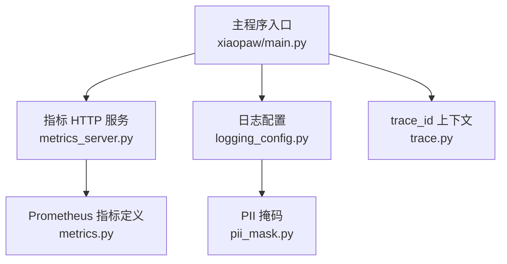
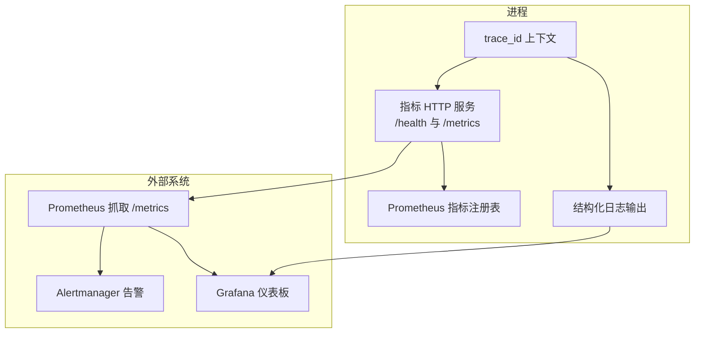
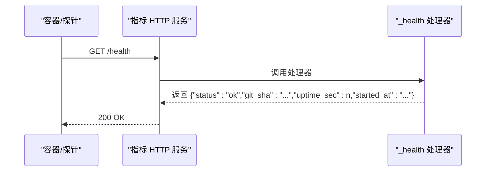
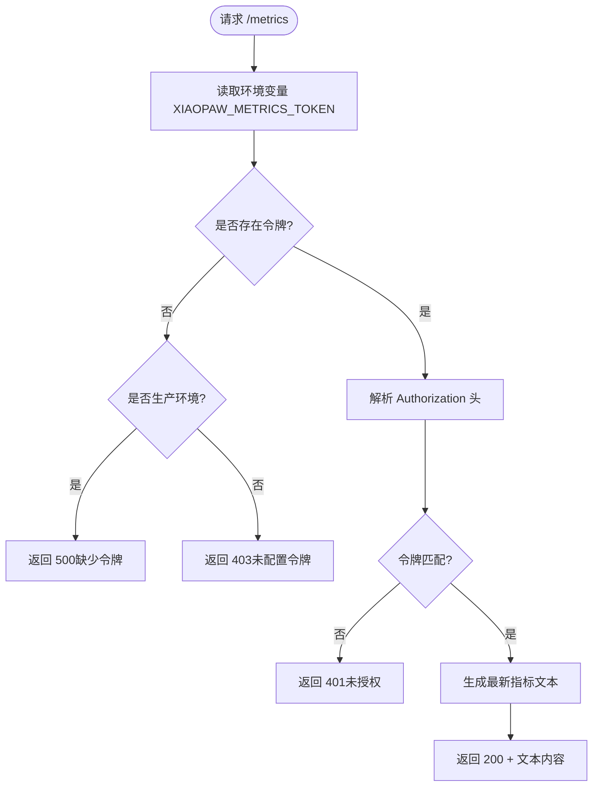
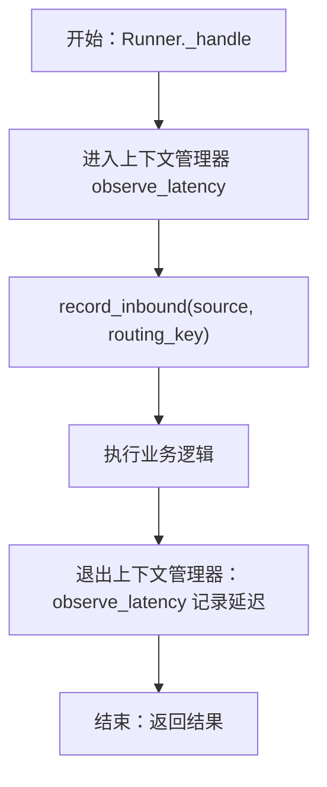
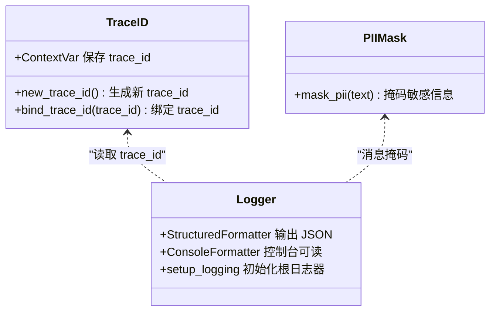
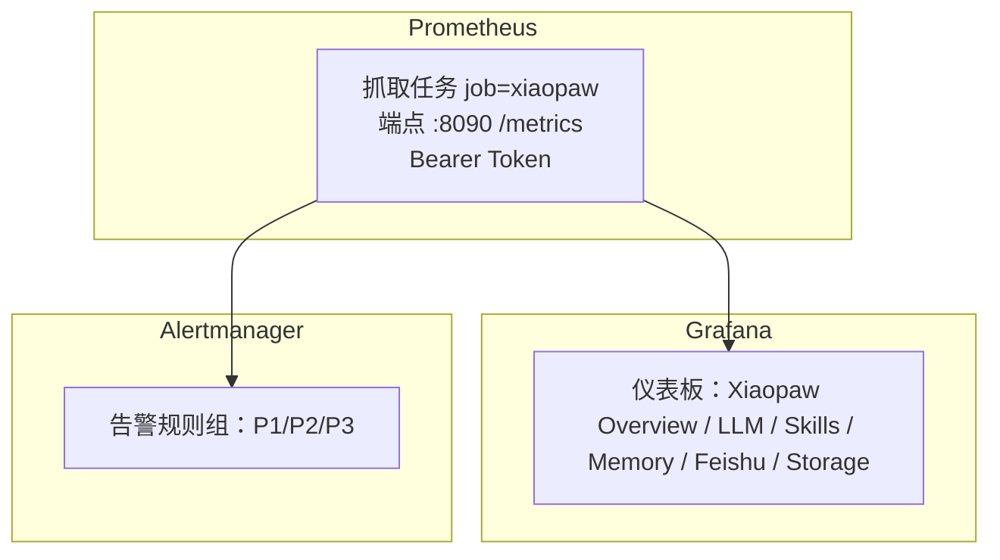
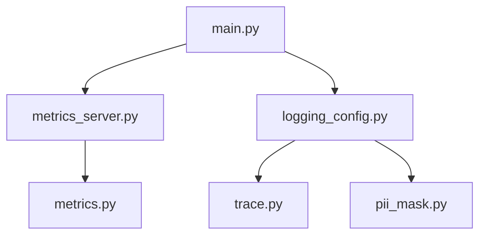

# 健康检查与监控

<cite>
**本文档引用的文件**
- [metrics_server.py](file://xiaopaw/observability/metrics_server.py)
- [metrics.py](file://xiaopaw/observability/metrics.py)
- [logging_config.py](file://xiaopaw/observability/logging_config.py)
- [trace.py](file://xiaopaw/observability/trace.py)
- [pii_mask.py](file://xiaopaw/observability/pii_mask.py)
- [main.py](file://xiaopaw/main.py)
- [06-observability.md](file://docs/06-observability.md)
- [04-api.md](file://docs/04-api.md)
- [config.yaml.example](file://config.yaml.example)
- [pyproject.toml](file://pyproject.toml)
- [hooks.yaml](file://shared_hooks/hooks.yaml)
</cite>

## 目录
1. [简介](#简介)
2. [项目结构](#项目结构)
3. [核心组件](#核心组件)
4. [架构总览](#架构总览)
5. [详细组件分析](#详细组件分析)
6. [依赖关系分析](#依赖关系分析)
7. [性能考量](#性能考量)
8. [故障排查指南](#故障排查指南)
9. [结论](#结论)
10. [附录](#附录)

## 简介
本文件面向 XiaoPaw v2 的健康检查与监控体系，围绕以下目标展开：
- 深入解析 /health 与 /metrics 接口的实现原理与响应格式
- 详解 Prometheus 8 个核心指标的业务含义、标签与采集方式
- 提供 Prometheus 抓取配置、Grafana 仪表板模板建议与告警规则设置
- 给出健康检查脚本使用方法、trace_id 覆盖率验证与日志监控最佳实践
- 覆盖容器健康检查、服务可用性监控与性能指标分析

## 项目结构
与健康检查和监控密切相关的模块主要集中在 xiaopaw/observability 目录，并在主程序入口中统一启动。

**图表来源**
- [main.py:125-129](file://xiaopaw/main.py#L125-L129)
- [metrics_server.py:40-44](file://xiaopaw/observability/metrics_server.py#L40-L44)
- [logging_config.py:40-61](file://xiaopaw/observability/logging_config.py#L40-L61)
- [trace.py:13-23](file://xiaopaw/observability/trace.py#L13-L23)
- [pii_mask.py:14-18](file://xiaopaw/observability/pii_mask.py#L14-L18)
- [metrics.py:8-47](file://xiaopaw/observability/metrics.py#L8-L47)

**章节来源**
- [main.py:125-129](file://xiaopaw/main.py#L125-L129)
- [metrics_server.py:40-44](file://xiaopaw/observability/metrics_server.py#L40-L44)
- [logging_config.py:40-61](file://xiaopaw/observability/logging_config.py#L40-L61)
- [trace.py:13-23](file://xiaopaw/observability/trace.py#L13-L23)
- [pii_mask.py:14-18](file://xiaopaw/observability/pii_mask.py#L14-L18)
- [metrics.py:8-47](file://xiaopaw/observability/metrics.py#L8-L47)

## 核心组件
- 指标 HTTP 服务：提供 /health 与 /metrics 两个端点，统一监听 8090 端口，/metrics 采用 Bearer Token 鉴权
- Prometheus 指标定义：定义 8 个核心指标，覆盖服务可用性、成本、延迟与外部依赖健康
- 结构化日志：统一 JSON 输出、trace_id 透传、PII 掩码
- trace_id 上下文：基于 ContextVar 的跨模块传播，确保日志、指标、追踪一致关联
- 主程序集成：在启动阶段创建并启动指标 HTTP 服务

**章节来源**
- [metrics_server.py:18-38](file://xiaopaw/observability/metrics_server.py#L18-L38)
- [metrics.py:8-47](file://xiaopaw/observability/metrics.py#L8-L47)
- [logging_config.py:15-28](file://xiaopaw/observability/logging_config.py#L15-L28)
- [trace.py:13-23](file://xiaopaw/observability/trace.py#L13-L23)
- [main.py:125-129](file://xiaopaw/main.py#L125-L129)

## 架构总览
XiaoPaw v2 将健康检查与监控以“轻量 HTTP 服务 + Prometheus + 结构化日志 + 分布式追踪”的三支柱组织，/metrics 与 /health 共用同一应用实例，通过子路由与中间件实现差异化鉴权。

**图表来源**
- [metrics_server.py:40-44](file://xiaopaw/observability/metrics_server.py#L40-L44)
- [metrics.py:8-47](file://xiaopaw/observability/metrics.py#L8-L47)
- [logging_config.py:15-28](file://xiaopaw/observability/logging_config.py#L15-L28)
- [trace.py:13-23](file://xiaopaw/observability/trace.py#L13-L23)

## 详细组件分析

### /health 接口
- 端点：GET /health
- 鉴权：无
- 响应：包含状态、git 版本、启动时间与运行时长
- 用途：容器健康检查与进程存活探测
- 实现要点：使用常量时间比较进行鉴权（/metrics 专用）、防时序攻击；生产环境建议通过容器编排的健康检查调用该端点

**图表来源**
- [metrics_server.py:18-19](file://xiaopaw/observability/metrics_server.py#L18-L19)
- [metrics_server.py:40-44](file://xiaopaw/observability/metrics_server.py#L40-L44)

**章节来源**
- [metrics_server.py:18-19](file://xiaopaw/observability/metrics_server.py#L18-L19)
- [04-api.md:692-701](file://docs/04-api.md#L692-L701)
- [06-observability.md:588-618](file://docs/06-observability.md#L588-L618)

### /metrics 接口与鉴权
- 端点：GET /metrics
- 鉴权：Bearer Token（Authorization: Bearer <token>）
- 响应：Prometheus 文本格式
- 实现要点：使用常量时间比较防止时序攻击；生产环境强制要求令牌存在；/metrics 与 /health 共用 8090 端口，通过子应用与中间件区分鉴权

**图表来源**
- [metrics_server.py:22-37](file://xiaopaw/observability/metrics_server.py#L22-L37)
- [06-observability.md:532-586](file://docs/06-observability.md#L532-L586)

**章节来源**
- [metrics_server.py:22-37](file://xiaopaw/observability/metrics_server.py#L22-L37)
- [04-api.md:670-721](file://docs/04-api.md#L670-L721)
- [06-observability.md:532-586](file://docs/06-observability.md#L532-L586)

### Prometheus 8 个核心指标
- 指标命名与标签规范：统一前缀、单位后缀、标签基数控制
- 8 个指标及其业务含义、标签与埋点位置详见下表

| 指标名称 | 类型 | 标签 | 业务含义 | 埋点位置 |
| --- | --- | --- | --- | --- |
| xiaopaw_inbound_total | Counter | source ∈ {feishu, test_api, cron} routing_type ∈ {p2p, group, thread} | 分 routing_type 统计真实流量，用于容量规划 | Runner.dispatch 入口 |
| xiaopaw_llm_calls_total | Counter | model ∈ {deepseek-v4-flash, deepseek-chat, text-embedding-v3} status ∈ {ok, timeout, rate_limited, 4xx, 5xx, cancelled, network_error} | 成本估算与告警依据（status!=ok） | AliyunLLM._request finally 分支 |
| xiaopaw_agent_latency_seconds | Histogram | routing_type ∈ {p2p, group, thread} | 端到端 Runner._handle 延迟（汇总 p95） | Runner._handle try/finally |
| xiaopaw_llm_latency_seconds | Histogram | model | 区分 LLM 慢/技能慢/网络慢 | AliyunLLM._request |
| xiaopaw_external_api_retry_total | Counter | api ∈ {dashscope, feishu, baidu, pgvector} | 外部 API 失败触发的重试次数 | tenacity before_sleep 回调 |
| xiaopaw_skill_timeout_total | Counter | skill | 技能执行超时次数 | SkillLoader 捕获 asyncio.TimeoutError |
| xiaopaw_feishu_rate_limit_total | Counter | 无 | 飞书 API 限流次数 | FeishuSender._request 识别限流 |
| xiaopaw_cron_dlq_total | Counter | 无 | 定时任务死信队列数量 | CronService._on_task_fail 入 DLQ |

**章节来源**
- [metrics.py:8-47](file://xiaopaw/observability/metrics.py#L8-L47)
- [06-observability.md:342-467](file://docs/06-observability.md#L342-L467)

### 指标采集方式与使用模板
- latency 观察：使用上下文管理器在关键路径包裹，自动计算耗时并上报直方图
- LLM 调用记录：在成功/失败分支分别记录调用总数与延迟
- 入站消息记录：在通过限流与去重后的入队前记录来源与路由类型

**图表来源**
- [06-observability.md:469-522](file://docs/06-observability.md#L469-L522)

**章节来源**
- [06-observability.md:469-522](file://docs/06-observability.md#L469-L522)

### 结构化日志与 trace_id 覆盖率
- 日志格式：JSON 行格式，包含时间戳、级别、logger 名、trace_id、消息、调用者、堆栈等字段
- trace_id 传播：通过 ContextVar 在协程间自动传递，避免参数穿透
- PII 掩码：在日志输出层统一掩码，保护敏感信息
- 覆盖率目标：强校验点（Runner 入口、出站 HTTP 头、LLM 请求日志）100%；整体 ≥85%

**图表来源**
- [trace.py:13-23](file://xiaopaw/observability/trace.py#L13-L23)
- [logging_config.py:15-28](file://xiaopaw/observability/logging_config.py#L15-L28)
- [pii_mask.py:14-18](file://xiaopaw/observability/pii_mask.py#L14-L18)

**章节来源**
- [logging_config.py:15-28](file://xiaopaw/observability/logging_config.py#L15-L28)
- [trace.py:13-23](file://xiaopaw/observability/trace.py#L13-L23)
- [pii_mask.py:14-18](file://xiaopaw/observability/pii_mask.py#L14-L18)
- [06-observability.md:162-172](file://docs/06-observability.md#L162-L172)

### Prometheus 监控配置、Grafana 仪表板与告警规则
- 抓取配置：Prometheus 以 8090 端口抓取 /metrics，使用 Bearer Token 认证
- 仪表板建议：按 Overview、LLM、Skills、Memory、飞书、存储六个面板组组织
- 告警规则：包含服务下线、Cron DLQ、P95 延迟、LLM 错误率、Skill 超时、飞书限流、入站流量下降等

**图表来源**
- [06-observability.md:622-700](file://docs/06-observability.md#L622-L700)

**章节来源**
- [06-observability.md:622-700](file://docs/06-observability.md#L622-L700)

### 健康检查脚本与容器健康检查
- 健康检查脚本：可直接调用 /health 端点，验证进程存活与基本运行状态
- 容器健康检查：Dockerfile 中 EXPOSE 8090 并配置 HEALTHCHECK 使用 /health
- 生产环境：/metrics 需要 Bearer Token，/health 无需鉴权

**章节来源**
- [04-api.md:666-721](file://docs/04-api.md#L666-L721)
- [06-observability.md:612-618](file://docs/06-observability.md#L612-L618)

### 自定义监控项添加方式
- 新增指标：在 metrics.py 中定义 Counter/Histogram，并在业务关键路径调用 inc/observe
- 标签设计：遵循基数控制原则，避免将高基数字段放入 label
- 采集辅助：使用 observe_latency 上下文管理器与 record_* 辅助函数
- 鉴权与安全：/metrics 保持 Bearer Token 鉴权，/health 保持无鉴权

**章节来源**
- [metrics.py:8-47](file://xiaopaw/observability/metrics.py#L8-L47)
- [06-observability.md:469-522](file://docs/06-observability.md#L469-L522)
- [06-observability.md:532-586](file://docs/06-observability.md#L532-L586)

## 依赖关系分析
- 指标 HTTP 服务依赖 Prometheus 客户端库生成指标文本
- 日志系统依赖 trace_id 上下文与 PII 掩码
- 主程序在启动阶段创建并启动指标 HTTP 服务

**图表来源**
- [main.py:125-129](file://xiaopaw/main.py#L125-L129)
- [metrics_server.py:40-44](file://xiaopaw/observability/metrics_server.py#L40-L44)
- [metrics.py:8-47](file://xiaopaw/observability/metrics.py#L8-L47)
- [logging_config.py:40-61](file://xiaopaw/observability/logging_config.py#L40-L61)
- [trace.py:13-23](file://xiaopaw/observability/trace.py#L13-L23)
- [pii_mask.py:14-18](file://xiaopaw/observability/pii_mask.py#L14-L18)

**章节来源**
- [main.py:125-129](file://xiaopaw/main.py#L125-L129)
- [metrics_server.py:40-44](file://xiaopaw/observability/metrics_server.py#L40-L44)
- [metrics.py:8-47](file://xiaopaw/observability/metrics.py#L8-L47)
- [logging_config.py:40-61](file://xiaopaw/observability/logging_config.py#L40-L61)
- [trace.py:13-23](file://xiaopaw/observability/trace.py#L13-L23)
- [pii_mask.py:14-18](file://xiaopaw/observability/pii_mask.py#L14-L18)

## 性能考量
- 指标生成：Prometheus 客户端在内存中累积指标，生成文本时一次性输出，开销极小
- 日志落盘：JSON 行格式与轮转策略降低磁盘压力，PII 掩码在输出层统一处理
- trace_id 传播：ContextVar 随 Task 自动拷贝，避免参数穿透带来的性能与侵入性问题
- 延迟观测：Histogram 采用分桶计数，p95 等聚合查询在 Prometheus 侧完成

[本节为通用性能讨论，不直接分析具体文件]

## 故障排查指南
- /metrics 401 未授权：确认 Authorization 头与 XIAOPAW_METRICS_TOKEN 一致，生产环境缺失令牌将返回 500
- /metrics 501 未安装 prometheus_client：确认可选依赖已安装
- /health 200 仅表示进程存活：结合指标与告警判断业务健康
- trace_id 覆盖率不足：检查 Runner 入口、出站 HTTP 头、LLM 请求日志是否包含 trace_id
- 日志中 PII 未掩码：确认 mask_pii 在日志输出层生效

**章节来源**
- [metrics_server.py:22-37](file://xiaopaw/observability/metrics_server.py#L22-L37)
- [06-observability.md:532-586](file://docs/06-observability.md#L532-L586)
- [06-observability.md:162-172](file://docs/06-observability.md#L162-L172)

## 结论
XiaoPaw v2 的健康检查与监控体系以“轻量 HTTP 服务 + Prometheus + 结构化日志 + 分布式追踪”为核心，通过统一端口与差异化鉴权实现 /health 与 /metrics 的安全与高效共存；8 个核心指标覆盖服务可用性、成本、延迟与外部依赖健康，配合 Grafana 仪表板与告警规则，形成完整的可观测闭环。

[本节为总结性内容，不直接分析具体文件]

## 附录

### 配置与依赖
- 观测性配置：metrics_host、metrics_port、log_json、Langfuse 开关等
- 可选依赖：prometheus_client、langfuse 等
- 钩子层：结构化日志与 Langfuse 追踪钩子在 hooks.yaml 中注册

**章节来源**
- [config.yaml.example:51-59](file://config.yaml.example#L51-L59)
- [pyproject.toml:22-31](file://pyproject.toml#L22-L31)
- [hooks.yaml:4-25](file://shared_hooks/hooks.yaml#L4-L25)