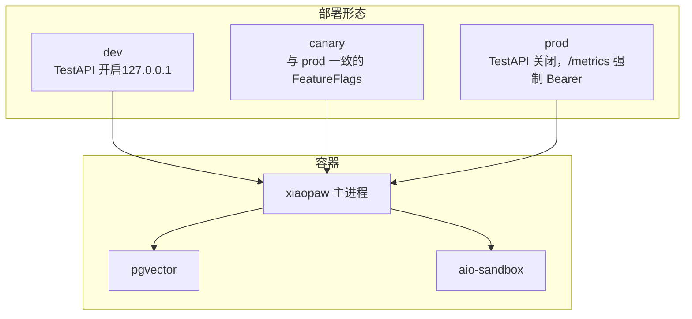
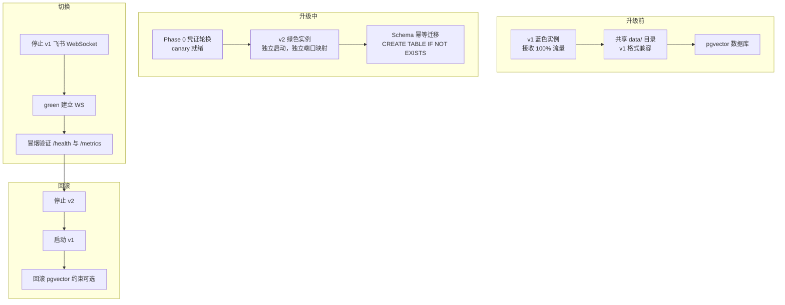
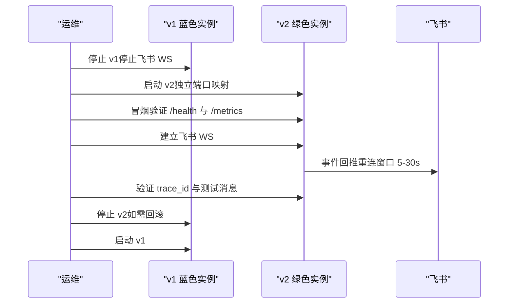
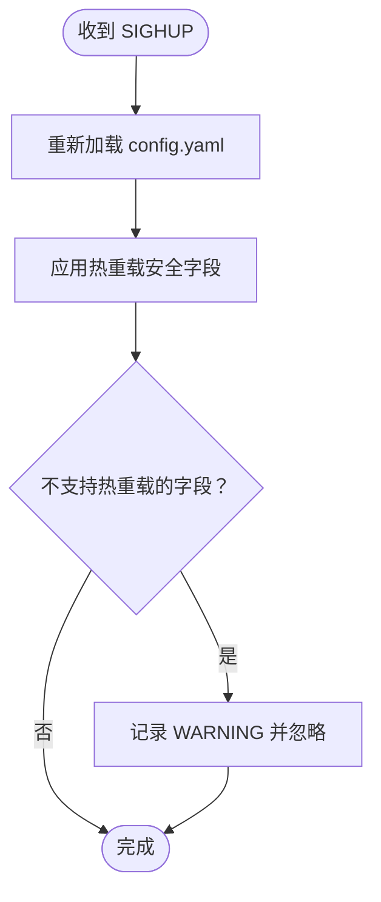
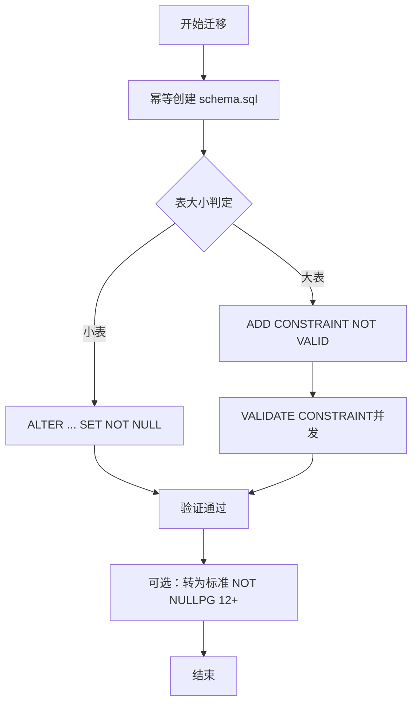
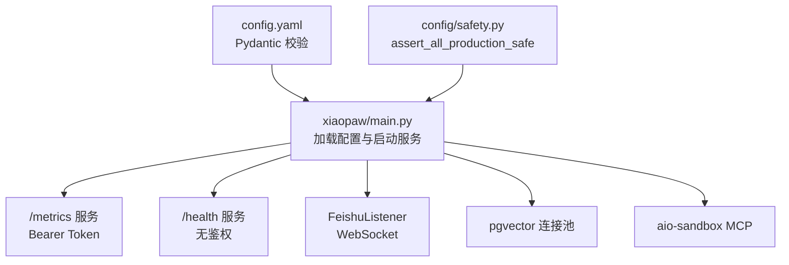

# 升级与回滚

<cite>
**本文引用的文件**
- [docs/11-migration-v1-to-v2.md](file://docs/11-migration-v1-to-v2.md)
- [DESIGN.md](file://DESIGN.md)
- [docs/08-deployment.md](file://docs/08-deployment.md)
- [docs/09-config.md](file://docs/09-config.md)
- [docs/06-observability.md](file://docs/06-observability.md)
- [schema.sql](file://schema.sql)
- [pyproject.toml](file://pyproject.toml)
- [xiaopaw/main.py](file://xiaopaw/main.py)
- [xiaopaw/config/validator.py](file://xiaopaw/config/validator.py)
- [xiaopaw/config/safety.py](file://xiaopaw/config/safety.py)
</cite>

## 目录
1. [简介](#简介)
2. [项目结构](#项目结构)
3. [核心组件](#核心组件)
4. [架构总览](#架构总览)
5. [详细组件分析](#详细组件分析)
6. [依赖分析](#依赖分析)
7. [性能考虑](#性能考虑)
8. [故障排查指南](#故障排查指南)
9. [结论](#结论)
10. [附录](#附录)

## 简介
本文件面向从 XiaoPaw v1 到 v2 的升级与回滚实践，聚焦零停机的蓝绿部署策略、流量切换机制、配置热更新（SIGHUP）与代码变更的滚动重启流程，并覆盖从 v1 到 v2 的迁移步骤、数据迁移与兼容性处理、Schema 变更与迁移脚本、升级前准备、升级过程监控与升级后验证，以及回滚操作与风险控制。

## 项目结构
- v2 采用单节点部署形态，进程外数据（sessions、ctx、traces、cron、workspace、pgvector）与 v1 前向兼容，核心变更集中在凭证管理、config.yaml 新节点、SKILL.md frontmatter 可选字段、pgvector 的可选 NOT NULL 约束。
- 部署形态分为 dev/canary/prod，统一通过 Docker Compose 管理，端口契约统一到 8090（/health 与 /metrics 同端口），TestAPI 仅 dev 暴露。
- 升级路径包括：配置变更（SIGHUP）、代码变更（蓝绿）、Schema 变更（幂等 DDL + 两阶段 ALTER）。

图表来源
- [docs/08-deployment.md](file://docs/08-deployment.md)

章节来源
- [DESIGN.md](file://DESIGN.md)
- [docs/08-deployment.md](file://docs/08-deployment.md)

## 核心组件
- 蓝绿部署：v2 独立启动 green 实例，先冒烟验证，再停止 blue 的飞书 WebSocket，建立 green 的 WS，完成流量切换。
- 配置热更新（SIGHUP）：支持 rate_limit、observability.log_level、feature_flags（多数）、cleanup 等热重载；不支持热重载的字段会静默忽略并记录警告。
- 代码变更滚动重启：通过镜像 digest 变更触发滚动重启，飞书 WebSocket 会重连，队列中消息因 _dispatch_lock 不丢失。
- Schema 变更：幂等 DDL（CREATE TABLE IF NOT EXISTS）与两阶段 ALTER（NOT VALID + VALIDATE CONSTRAINT）避免锁表。
- 回滚路径：按 Phase 提供回滚窗口与步骤，切换后 72h 内可回滚；超过则需评估 v1 代码与 data/ 的漂移。

章节来源
- [docs/11-migration-v1-to-v2.md](file://docs/11-migration-v1-to-v2.md)
- [docs/09-config.md](file://docs/09-config.md)
- [docs/08-deployment.md](file://docs/08-deployment.md)

## 架构总览
下图展示 v2 的升级与回滚在部署与数据层面的关键交互。

图表来源
- [docs/11-migration-v1-to-v2.md](file://docs/11-migration-v1-to-v2.md)
- [docs/08-deployment.md](file://docs/08-deployment.md)

## 详细组件分析

### 蓝绿部署与流量切换
- 策略选择：推荐蓝绿部署，停机时间 ≤ 30s（飞书 WebSocket 重连窗口），数据迁移复杂度低（只读挂载 data/，切换后转主）。
- 切换步骤：
  - 停止 v1 向 data/ 写入（停止 v1 容器）。
  - 将 v2 data/ 改为读写挂载（或直接复用同一 data/ 目录）。
  - 启动 v2（green）并冒烟验证 /health 与 /metrics。
  - 停止 v1 的飞书 WebSocket，建立 v2 的 WS（客户端重连窗口 5-30s）。
  - 验证 trace_id 进入日志，发送一条测试消息确认回复。
- 切换窗口关键点：
  - 飞书客户端重连窗口 5-30s（取决于心跳超时 + app_secret 握手 + 订阅恢复）。
  - 切换期间用户消息由飞书侧队列暂存（通常 ≥ 5 分钟），v2 上线后推送。
  - 用户可感知停机含冒烟验证 → RTO 目标 ≤ 5 min。

图表来源
- [docs/11-migration-v1-to-v2.md](file://docs/11-migration-v1-to-v2.md)

章节来源
- [docs/11-migration-v1-to-v2.md](file://docs/11-migration-v1-to-v2.md)

### 配置热更新（SIGHUP）
- 支持热重载的配置：
  - rate_limit.*（下次 check 生效）
  - sender.max_concurrent（需重建 Semaphore；老请求仍用旧值）
  - observability.log_level（root logger.setLevel()）
  - observability.trace.sample_rate（下次采样判断）
  - feature_flags.enable_*（多数）（下次执行分支生效）
  - feature_flags.enable_webhook_replay_cache（ReplayCache 实例热替换）
  - cleanup.*（下次 daily sweep 生效）
- 不支持热重载的配置：
  - feature_flags.enable_mcp_whitelist（SkillLoaderTool 初始化时固化，需重启）
  - feature_flags.enable_cron_filelock（CronService 启动时固化，需重启）
  - feature_flags.enable_pgvector_connection_pool（Indexer 启动时固化，需重启）
  - agent.model（MemoryAwareCrew 初始化时固化，需重启）
  - 凭证（.env）（必须重启）
- 触发方式：修改 config.yaml 后，通过 docker compose exec xiaopaw kill -HUP 1 触发。

图表来源
- [docs/09-config.md](file://docs/09-config.md)

章节来源
- [docs/09-config.md](file://docs/09-config.md)

### 代码变更的滚动重启
- 触发条件：镜像 digest 变更。
- 影响范围：飞书 WebSocket 会重连，队列中消息因 _dispatch_lock 不丢失。
- 建议：在 canary 72h baseline 通过后再进行 prod 滚动重启。

章节来源
- [docs/08-deployment.md](file://docs/08-deployment.md)

### Schema 变更与迁移脚本
- 幂等创建：使用 schema.sql（CREATE TABLE IF NOT EXISTS）对新 DB 生效；已有表无副作用。
- 补强 routing_key NOT NULL 约束：
  - 小表：直接 ALTER TABLE ... ALTER COLUMN ... SET NOT NULL（AccessExclusiveLock 持有 < 1s）。
  - 大表：两阶段 ALTER（ADD CONSTRAINT NOT VALID + VALIDATE CONSTRAINT），避免锁表；验证约 30-60s，可与业务并发。
  - 回滚：DROP CONSTRAINT + DROP NOT NULL 两步，DDL 毫秒级。
- RLS（可选）：启用后需在每次查询前 SET LOCAL xiaopaw.current_routing_key = 'p2p:ou_abc123'。
- 索引复查：可选 REINDEX TABLE CONCURRENTLY memories。

图表来源
- [schema.sql](file://schema.sql)
- [docs/11-migration-v1-to-v2.md](file://docs/11-migration-v1-to-v2.md)

章节来源
- [schema.sql](file://schema.sql)
- [docs/11-migration-v1-to-v2.md](file://docs/11-migration-v1-to-v2.md)

### 从 v1 到 v2 的迁移步骤
- Phase 0 预准备：
  - 凭证轮换：PostgreSQL 用户、飞书 App Secret、DeepSeek API Key、XIAOPAW_METRICS_TOKEN。
  - Canary 环境就绪：独立 pgvector 副本、独立 AIO-Sandbox、Prometheus + pytest-memray 采集。
  - Tokenizer 校准：产出 tokenizer-calibration.md，决定 token_counter_mode。
  - 备份与 force-push 通告：对 v1 代码仓打标签、备份 data/ 与 pgvector dump。
- 配置变更：
  - 凭证全部移到 .env；config.yaml 增量字段见迁移文档。
  - 启动前自检：assert_all_production_safe（prod 强制校验）。
- 代码变更：
  - v2 代码目录与 v1 平行，不要原地改 v1；共享 data/ 目录时保证同一时刻只有一个进程写（蓝绿切换时用只读挂载防双写）。
- 数据迁移：
  - data/ 目录格式向前兼容，v2 读 v1 数据无需转换；workspace .config/ 子目录挂载策略见迁移文档。
- 测试回归：
  - 基础冒烟、数据连续性、v2 新增能力、72h Canary 观测、故障注入。

章节来源
- [docs/11-migration-v1-to-v2.md](file://docs/11-migration-v1-to-v2.md)
- [xiaopaw/config/safety.py](file://xiaopaw/config/safety.py)

### 回滚操作与风险控制
- 回滚窗口：切换后 72h 内。
- 各 Phase 回滚路径：
  - Phase 0/1：凭证轮换是单向操作；v2.1 凭证过渡窗口 24h；Tokenizer 校准无副作用。
  - Phase 1-2：canary 独立环境，down 掉容器与 data/，恢复配置即可。
  - Phase 3：不切流量，v1 继续服务；FeatureFlag 可关的行为改 config.yaml → SIGHUP 重载；代码 bug 修复后重新部署 canary。
  - Phase 4：关键：data/ 已被 v2 写了若干分钟。特殊处理：DLQ 文件（v1 不识别）v1 忽略；config.yaml 被改过还原备份；pgvector schema 回滚（DROP CONSTRAINT + DROP NOT NULL）。
  - Phase 5：v1 下线后不建议回滚，如必须回滚需恢复旧凭证、恢复 v1 代码与 config.yaml、启动 v1。
- 风险控制：
  - 切换窗口 > 5 min 仍未恢复，立刻回滚。
  - 若 v2 已写入 pgvector 且启用了 RLS 或其他 v2-only 约束，v1 可能无法写入，需临时关闭 RLS。

章节来源
- [docs/11-migration-v1-to-v2.md](file://docs/11-migration-v1-to-v2.md)

### 升级前准备、监控与验证
- 升级前准备：
  - 凭证轮换、canary 就绪、Tokenizer 校准、备份与 force-push 通告。
- 升级过程监控：
  - /health 与 /metrics（Bearer Token）验证；runner_alive=1；内存增长斜率 < 1MB/h；trace_id 覆盖率 ≥85%。
- 升级后验证：
  - 冒烟：/health 200、/metrics 指标输出、TestAPI prod 环境被拒绝。
  - 数据连续性：session index、历史消息、ctx.json、cron tasks、pgvector 查询、workspace 文件。
  - v2 新增能力：Webhook ReplayCache、入站速率限制、memory-save 过滤、MCP 白名单、Skill 超时、飞书限流识别、trace_id 贯穿、PII mask、LRUCache 互斥正确性、Cron filelock、sandbox 端口封闭、pgvector 连接池。

章节来源
- [docs/11-migration-v1-to-v2.md](file://docs/11-migration-v1-to-v2.md)
- [docs/06-observability.md](file://docs/06-observability.md)

## 依赖分析
- 配置加载与校验：
  - config.yaml 通过 Pydantic 校验，支持环境变量替换与启动安全校验（assert_all_production_safe）。
  - FeatureFlags 注册表对未知字段拒绝，防止拼写错误或历史字段残留。
- 运行时依赖：
  - aiohttp（/metrics 与 /health 同端口）、psycopg2（pgvector 连接池）、lark-oapi（飞书 WebSocket）、CrewAI（Agent）。
- 容器与健康检查：
  - xiaopaw 容器健康检查 /health；pgvector 与 aio-sandbox 健康检查；compose 依赖门控与自动重启策略。

图表来源
- [xiaopaw/main.py](file://xiaopaw/main.py)
- [xiaopaw/config/validator.py](file://xiaopaw/config/validator.py)
- [xiaopaw/config/safety.py](file://xiaopaw/config/safety.py)
- [pyproject.toml](file://pyproject.toml)

章节来源
- [xiaopaw/main.py](file://xiaopaw/main.py)
- [xiaopaw/config/validator.py](file://xiaopaw/config/validator.py)
- [xiaopaw/config/safety.py](file://xiaopaw/config/safety.py)
- [pyproject.toml](file://pyproject.toml)

## 性能考虑
- 资源开销：相比 v1，容器内存稳态/峰值分别增加 ~150MB/~100MB，镜像大小 +200MB，冷启动时间 +1s。
- pgvector 写入与 LLM 调用延迟基本不变。
- 连接池：启用 psycop2.pool.ThreadedConnectionPool 提升性能（FeatureFlag）。

章节来源
- [docs/11-migration-v1-to-v2.md](file://docs/11-migration-v1-to-v2.md)
- [docs/09-config.md](file://docs/09-config.md)

## 故障排查指南
- 启动失败：
  - 生产环境未满足 assert_all_production_safe（TestAPI 未禁用、metrics token 未配置、sandbox.url 指向宿主 loopback 等）。
- 配置热重载无效：
  - 不支持热重载的字段会记录 WARNING；需重启生效。
- 蓝绿切换失败：
  - 检查 /health 与 /metrics；确认飞书 WS 重连窗口；如 > 5min 仍未恢复，立刻回滚。
- 数据兼容性：
  - v2 可直接读 v1 data/（格式兼容）；若启用 RLS，v1 回滚后需临时关闭 RLS。

章节来源
- [xiaopaw/config/safety.py](file://xiaopaw/config/safety.py)
- [docs/09-config.md](file://docs/09-config.md)
- [docs/11-migration-v1-to-v2.md](file://docs/11-migration-v1-to-v2.md)

## 结论
XiaoPaw v2 的升级与回滚遵循“零停机蓝绿 + 热重载 + 两阶段 Schema 迁移”的组合拳。通过凭证轮换、canary 基线、72h 观测与严格的回滚窗口，可在生产环境安全地完成从 v1 到 v2 的迁移。配置热更新（SIGHUP）与代码变更的滚动重启提供了灵活的运维手段，结合完善的监控与验证清单，确保升级过程可控、可观测、可回滚。

## 附录
- 相关文档导航：迁移指南、部署设计、配置规范、可观测性设计、威胁模型与合规基线。

章节来源
- [DESIGN.md](file://DESIGN.md)
- [docs/11-migration-v1-to-v2.md](file://docs/11-migration-v1-to-v2.md)
- [docs/08-deployment.md](file://docs/08-deployment.md)
- [docs/09-config.md](file://docs/09-config.md)
- [docs/06-observability.md](file://docs/06-observability.md)