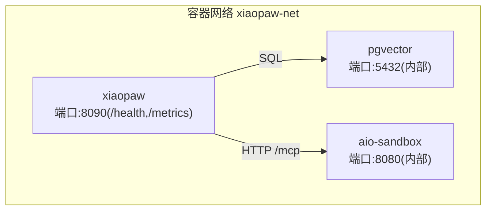
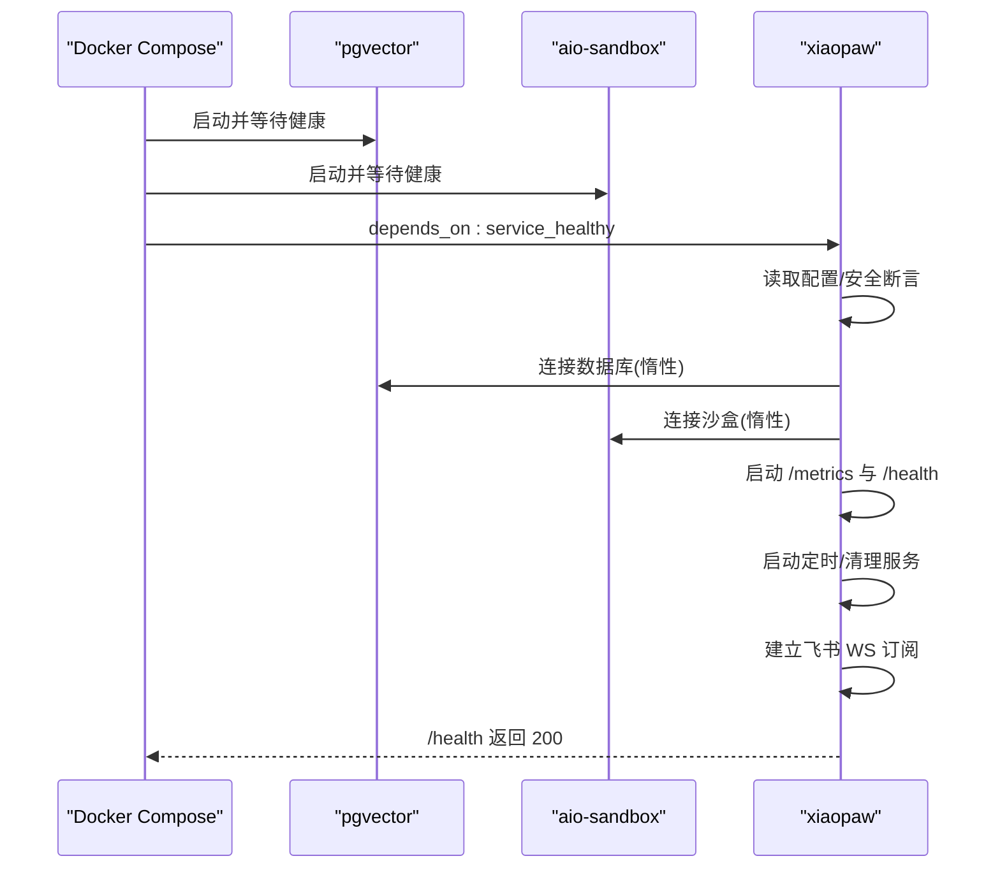
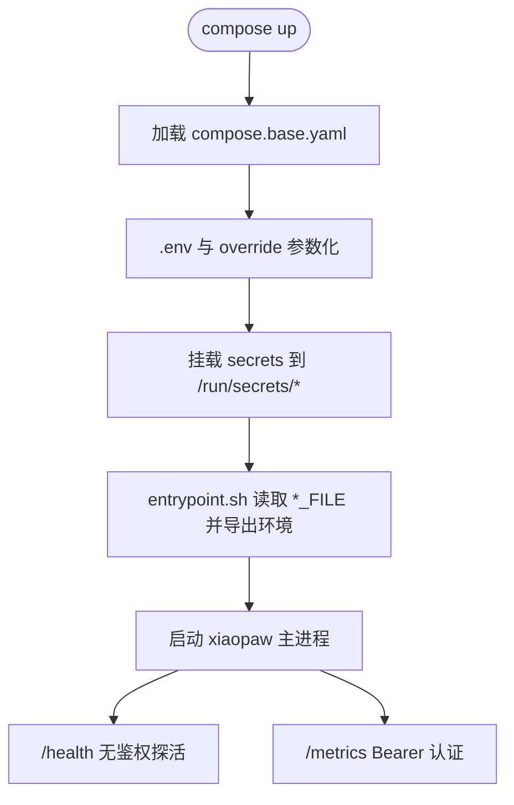
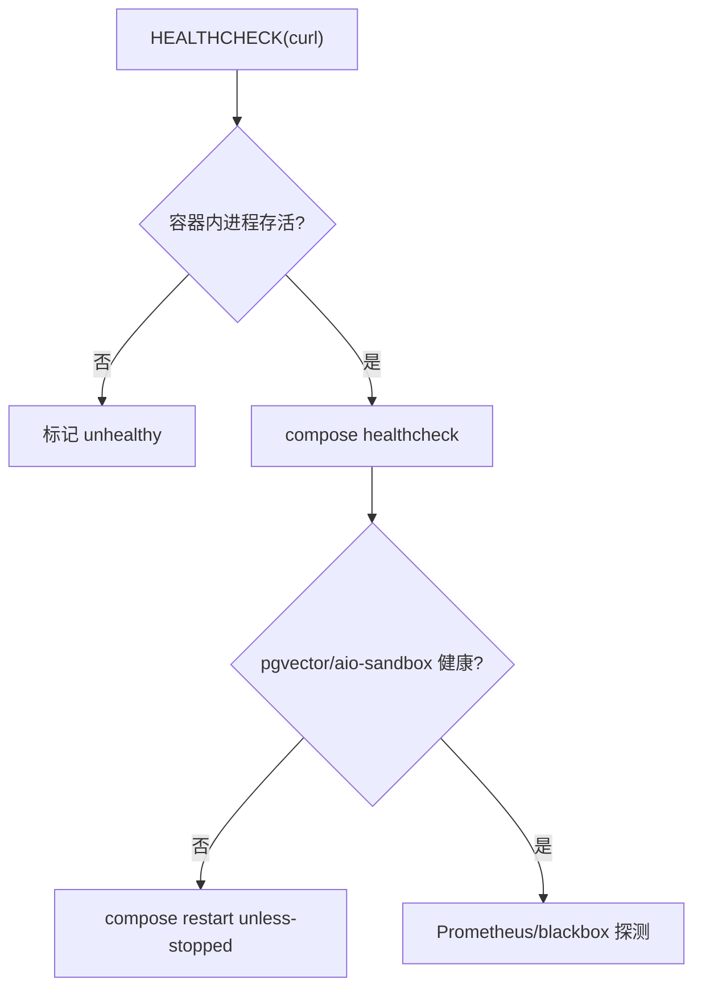
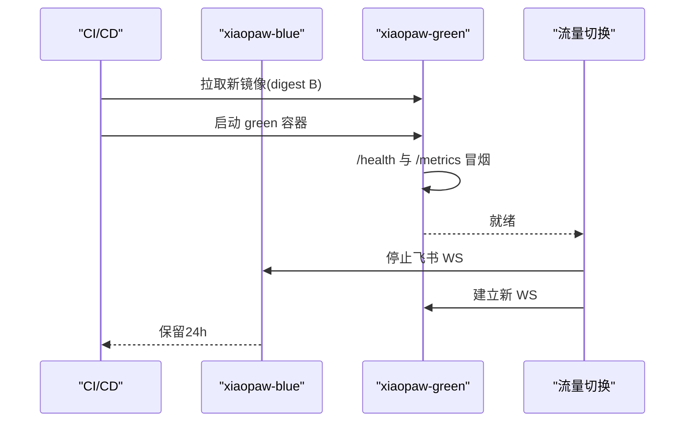
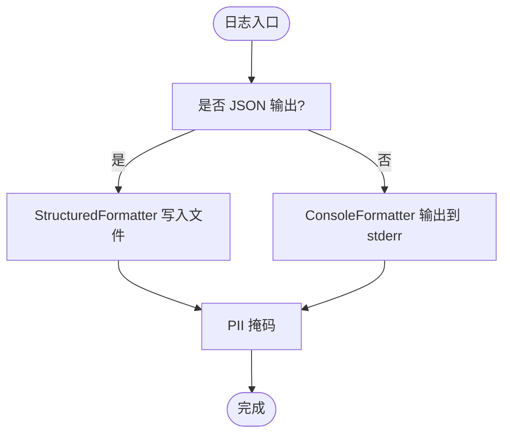
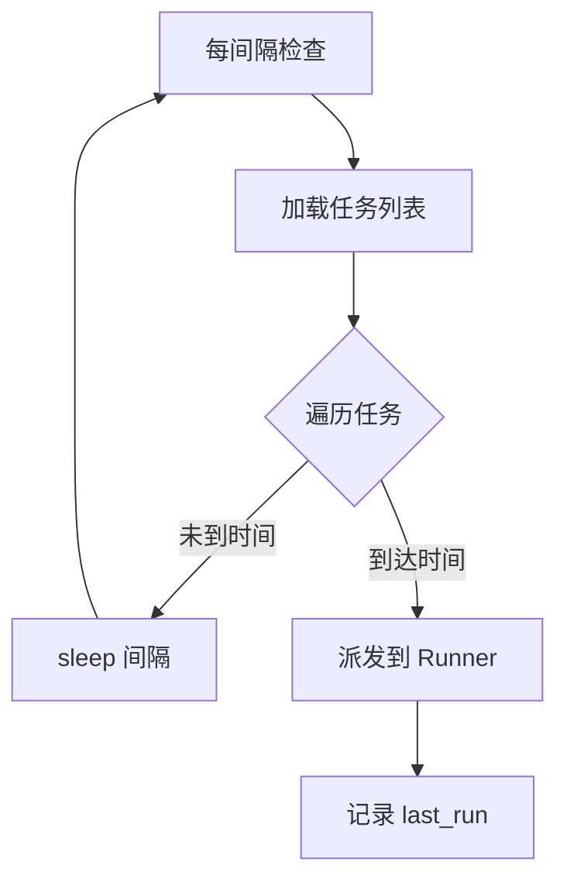
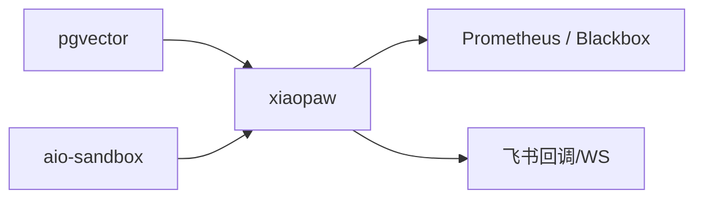

# 部署与运维

<cite>
**本文引用的文件**   
- [config.yaml.example](file://config.yaml.example)
- [pyproject.toml](file://pyproject.toml)
- [sandbox-docker-compose.yaml](file://sandbox-docker-compose.yaml)
- [xiaopaw/main.py](file://xiaopaw/main.py)
- [xiaopaw/observability/logging_config.py](file://xiaopaw/observability/logging_config.py)
- [xiaopaw/observability/metrics_server.py](file://xiaopaw/observability/metrics_server.py)
- [xiaopaw/config/safety.py](file://xiaopaw/config/safety.py)
- [xiaopaw/cleanup/service.py](file://xiaopaw/cleanup/service.py)
- [xiaopaw/cron/service.py](file://xiaopaw/cron/service.py)
- [xiaopaw/config/validator.py](file://xiaopaw/config/validator.py)
- [shared_hooks/hooks.yaml](file://shared_hooks/hooks.yaml)
- [verify_setup.py](file://verify_setup.py)
- [docs/08-deployment.md](file://docs/08-deployment.md)
- [DEEPSEEK_CONFIG.md](file://DEEPSEEK_CONFIG.md)
</cite>

## 目录
1. [简介](#简介)
2. [项目结构](#项目结构)
3. [核心组件](#核心组件)
4. [架构总览](#架构总览)
5. [详细组件分析](#详细组件分析)
6. [依赖分析](#依赖分析)
7. [性能考虑](#性能考虑)
8. [故障排除指南](#故障排除指南)
9. [结论](#结论)
10. [附录](#附录)

## 简介
本文件面向 XiaoPaw v2 的部署与运维团队，提供从开发、金丝雀到生产的三形态部署方案，涵盖 Docker Compose 编排、健康检查、升级回滚、监控告警、日志管理、性能观测与故障排查。内容基于仓库中的实际实现与文档，强调可落地的操作步骤与最佳实践。

## 项目结构
XiaoPaw v2 采用“单节点”部署前提，核心由三类服务组成：应用容器（xiaopaw）、内存向量化数据库（pgvector）、沙盒（aio-sandbox）。容器间通过内部网络通信，生产环境严格限制对外暴露端口，凭证通过 Docker secrets 注入，健康检查分三层协同保障。

**图表来源**
- [docs/08-deployment.md:129-287](file://docs/08-deployment.md#L129-L287)

**章节来源**
- [docs/08-deployment.md:34-72](file://docs/08-deployment.md#L34-L72)
- [docs/08-deployment.md:117-401](file://docs/08-deployment.md#L117-L401)

## 核心组件
- 应用主进程：负责配置加载、日志初始化、安全断言、Feishu 监听、任务调度、清理与指标服务。
- 指标与健康：内置 aiohttp 服务提供 /health 与 /metrics，/metrics 支持 Bearer 认证。
- 安全断言：生产环境启动前进行凭据强度与配置合规性检查。
- 定时任务：基于 cron 表达式的计划任务调度，失败进入死信队列。
- 清理服务：按 TTL 清理过期会话、追踪与原始日志。
- 钩子框架：可观测与策略层的可插拔扩展，贯穿对话生命周期。

**章节来源**
- [xiaopaw/main.py:18-218](file://xiaopaw/main.py#L18-L218)
- [xiaopaw/observability/metrics_server.py:14-55](file://xiaopaw/observability/metrics_server.py#L14-L55)
- [xiaopaw/config/safety.py:14-48](file://xiaopaw/config/safety.py#L14-L48)
- [xiaopaw/cron/service.py:19-97](file://xiaopaw/cron/service.py#L19-L97)
- [xiaopaw/cleanup/service.py:14-77](file://xiaopaw/cleanup/service.py#L14-L77)
- [shared_hooks/hooks.yaml:1-73](file://shared_hooks/hooks.yaml#L1-73)

## 架构总览
XiaoPaw v2 的部署形态通过环境变量与配置文件参数化，三形态差异体现在 TestAPI 开关、/metrics 认证强度、日志级别、Feature Flags 与镜像钉版本策略。容器健康检查与启动顺序严格约束，确保依赖就绪后再对外提供服务。

**图表来源**
- [docs/08-deployment.md:649-714](file://docs/08-deployment.md#L649-L714)
- [docs/08-deployment.md:717-766](file://docs/08-deployment.md#L717-L766)

**章节来源**
- [docs/08-deployment.md:34-72](file://docs/08-deployment.md#L34-L72)
- [docs/08-deployment.md:717-766](file://docs/08-deployment.md#L717-L766)

## 详细组件分析

### Docker Compose 与镜像构建
- 三环境共用基础编排，差异通过 .env 与 override 文件叠加。
- 镜像构建采用多阶段，运行时以非 root 用户、最小依赖、固定标签注入，健康检查与启动顺序明确。
- 凭证通过 secrets 注入，飞书四件套统一迁至 secrets，entrypoint 负责从文件读取并注入环境。

**图表来源**
- [docs/08-deployment.md:117-401](file://docs/08-deployment.md#L117-L401)
- [docs/08-deployment.md:527-555](file://docs/08-deployment.md#L527-L555)

**章节来源**
- [docs/08-deployment.md:426-575](file://docs/08-deployment.md#L426-L575)
- [docs/08-deployment.md:578-646](file://docs/08-deployment.md#L578-L646)

### 健康检查设计
- 容器内 HEALTHCHECK：仅检查进程存活与基本可用性，不查询下游。
- Compose 层 healthcheck：作为 depends_on 条件，触发自动重启。
- 外部巡检：Prometheus 黑盒探测与 SRE 脚本，结合告警策略。
- /health 无鉴权且不查下游，/metrics 通过 Bearer 认证，生产环境令牌长度≥32字符。

**图表来源**
- [docs/08-deployment.md:717-766](file://docs/08-deployment.md#L717-L766)
- [xiaopaw/observability/metrics_server.py:18-38](file://xiaopaw/observability/metrics_server.py#L18-L38)

**章节来源**
- [docs/08-deployment.md:717-766](file://docs/08-deployment.md#L717-L766)
- [xiaopaw/observability/metrics_server.py:14-55](file://xiaopaw/observability/metrics_server.py#L14-L55)

### 升级与回滚路径
- 配置变更：通过 SIGHUP 热重载（feature flags/非 schema），零宕机。
- 代码变更：蓝绿切换，新容器先冒烟验证，再切流量，保留旧容器24小时以便快速回滚。
- Schema 变更：先幂等迁移，再蓝绿；破坏性变更采用两阶段。
- 安全补丁与依赖大版本：canary 72小时验证后 prod 蓝绿。

**图表来源**
- [docs/08-deployment.md:769-800](file://docs/08-deployment.md#L769-L800)

**章节来源**
- [docs/08-deployment.md:769-800](file://docs/08-deployment.md#L769-L800)

### 监控与告警
- 指标端点：/metrics 仅支持 Bearer 认证，Prometheus 抓取。
- 健康端点：/health 无鉴权，返回版本、SHA、运行时长等信息。
- 告警建议：重启频率、下游可用性（pgvector/sandbox）、队列积压、错误率、延迟等（参考文档中的规则）。

**章节来源**
- [docs/08-deployment.md:717-766](file://docs/08-deployment.md#L717-L766)
- [xiaopaw/observability/metrics_server.py:14-55](file://xiaopaw/observability/metrics_server.py#L14-L55)

### 日志与可观测性
- 结构化日志：JSON 行格式，包含时间戳、级别、trace_id、消息与异常，PII 掩码。
- 控制台格式：人类可读，带 trace_id。
- 钩子框架：在对话生命周期的关键节点输出可观测事件，支持审计、成本、回环检测等策略。

**图表来源**
- [xiaopaw/observability/logging_config.py:15-61](file://xiaopaw/observability/logging_config.py#L15-L61)
- [shared_hooks/hooks.yaml:1-73](file://shared_hooks/hooks.yaml#L1-73)

**章节来源**
- [xiaopaw/observability/logging_config.py:15-61](file://xiaopaw/observability/logging_config.py#L15-L61)
- [shared_hooks/hooks.yaml:1-73](file://shared_hooks/hooks.yaml#L1-73)

### 安全断言与生产合规
- 生产环境禁止开启 TestAPI，禁止弱口令，要求 /metrics 令牌长度≥32字符。
- 启动前执行断言，失败则拒绝启动，避免错误配置进入生产。

**章节来源**
- [xiaopaw/config/safety.py:14-48](file://xiaopaw/config/safety.py#L14-L48)
- [docs/08-deployment.md:34-72](file://docs/08-deployment.md#L34-L72)

### 定时任务与清理
- CronService：周期扫描任务，命中即派发；失败进入死信队列并计数。
- CleanupService：按 TTL 清理 traces 与 raw 日志，UTC 小时阈值控制执行节奏。

**图表来源**
- [xiaopaw/cron/service.py:45-74](file://xiaopaw/cron/service.py#L45-L74)

**章节来源**
- [xiaopaw/cron/service.py:19-97](file://xiaopaw/cron/service.py#L19-L97)
- [xiaopaw/cleanup/service.py:14-77](file://xiaopaw/cleanup/service.py#L14-L77)

### 配置与环境变量
- 配置文件：config.yaml.example 提供默认项，包括飞书、Agent、Sandbox、Memory、Session、Runner、Sender、Debug、Observability、RateLimit、ReplayCache、Cron、Cleanup、FeatureFlags。
- 环境变量：XIAOPAW_ENV 控制形态；XIAOPAW_METRICS_TOKEN 控制 /metrics 认证；飞书四件套迁至 secrets；DeepSeek 配置与模型选择见专用文档。

**章节来源**
- [config.yaml.example:1-90](file://config.yaml.example#L1-L90)
- [docs/08-deployment.md:578-646](file://docs/08-deployment.md#L578-L646)
- [DEEPSEEK_CONFIG.md:1-149](file://DEEPSEEK_CONFIG.md#L1-L149)

## 依赖分析
- 进程依赖：pgvector → aio-sandbox → xiaopaw（健康检查门控）。
- 运行时依赖：PostgreSQL 连接池、沙盒 MCP、Feishu WebSocket、定时/清理服务。
- 外部依赖：Prometheus、黑盒探测、SRE 脚本、Secrets 管理器。

**图表来源**
- [docs/08-deployment.md:649-714](file://docs/08-deployment.md#L649-L714)

**章节来源**
- [docs/08-deployment.md:649-714](file://docs/08-deployment.md#L649-L714)

## 性能考虑
- 资源预算：容器 CPU/内存上限与预留按文档设定，避免资源争用。
- 冷启动：aiohttp 与分词器惰性加载导致 xiaopaw start_period 放宽至 30s。
- I/O 与并发：Sender 并发、Runner 队列大小、Cron 文件锁、Cleanup TTL 均影响吞吐与稳定性。
- 指标采集：/metrics 仅在必要时抓取，避免对主业务造成额外压力。

**章节来源**
- [docs/08-deployment.md:12-31](file://docs/08-deployment.md#L12-L31)
- [docs/08-deployment.md:717-766](file://docs/08-deployment.md#L717-L766)

## 故障排除指南
- 启动失败（生产断言）：检查 XIAOPAW_ENV、TestAPI 是否禁用、/metrics 令牌长度、飞书密钥强度。
- /health 间歇失败：确认不查询下游；检查容器内健康检查与 compose 层健康检查。
- /metrics 401：核对 Bearer 令牌长度与注入方式；生产环境必须 ≥32 字符。
- 容器反复重启：关注 Prometheus 的 restart_count_total 告警，排查上游依赖抖动。
- 配置变更未生效：确认 feature flags 是否支持热重载；否则采用蓝绿切换。
- 飞书 WS 重连慢：lark-oapi 重连窗口实测 5-30s，属于预期范围。
- 日志缺失：检查 JSON 输出开关与日志目录权限；确认结构化日志格式与 PII 掩码。

**章节来源**
- [xiaopaw/config/safety.py:14-48](file://xiaopaw/config/safety.py#L14-L48)
- [xiaopaw/observability/metrics_server.py:14-55](file://xiaopaw/observability/metrics_server.py#L14-L55)
- [docs/08-deployment.md:717-766](file://docs/08-deployment.md#L717-L766)
- [docs/08-deployment.md:769-800](file://docs/08-deployment.md#L769-L800)

## 结论
XiaoPaw v2 的部署与运维围绕“单节点、强隔离、三层健康检查、蓝绿与热重载”的原则设计。通过严格的凭证分层、生产安全断言、可观测性与告警体系，以及清晰的升级回滚流程，可在开发、金丝雀与生产环境中稳定交付。建议在每次变更前进行冒烟验证，并持续完善监控与演练清单。

## 附录

### 开发、金丝雀、生产形态对照
- TestAPI：dev 开启；canary 可用；prod 关闭。
- /metrics 认证：dev 宽松；canary/ prod 严格（≥32 字符）。
- 日志级别：dev DEBUG；canary/ prod INFO（含 trace_id）。
- 镜像钉版本：dev 允许 tag；canary/prod 强制 digest。
- 数据目录：bind mount 一致，便于复盘。

**章节来源**
- [docs/08-deployment.md:34-72](file://docs/08-deployment.md#L34-L72)

### 配置验证脚本
- verify_setup.py 提供环境变量、模块导入、LLM 配置、配置文件加载与目录结构的自动化验证，建议在部署前后运行。

**章节来源**
- [verify_setup.py:1-140](file://verify_setup.py#L1-L140)

### 沙盒本地开发
- sandbox-docker-compose.yaml 提供本地沙盒开发环境，包含健康检查与工作空间挂载，注意 host 与容器内工作空间一致性。

**章节来源**
- [sandbox-docker-compose.yaml:1-32](file://sandbox-docker-compose.yaml#L1-L32)