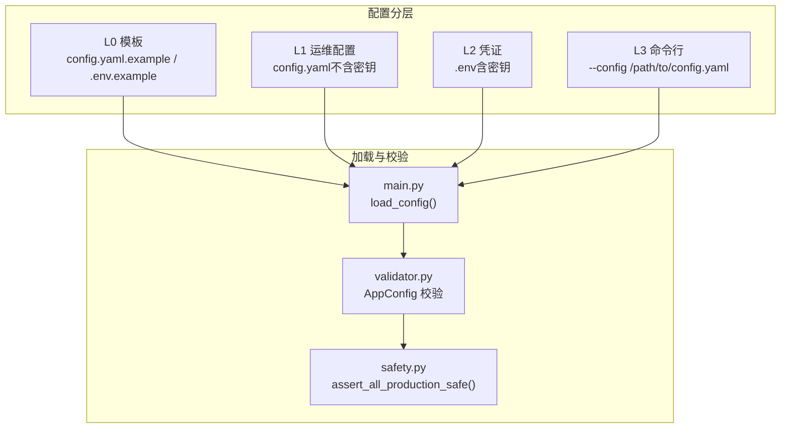
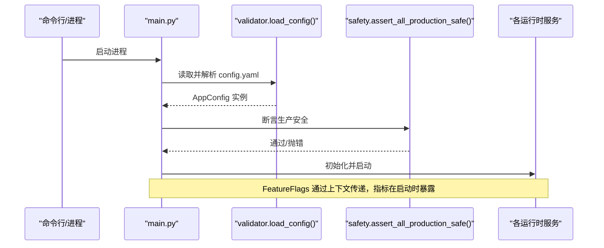
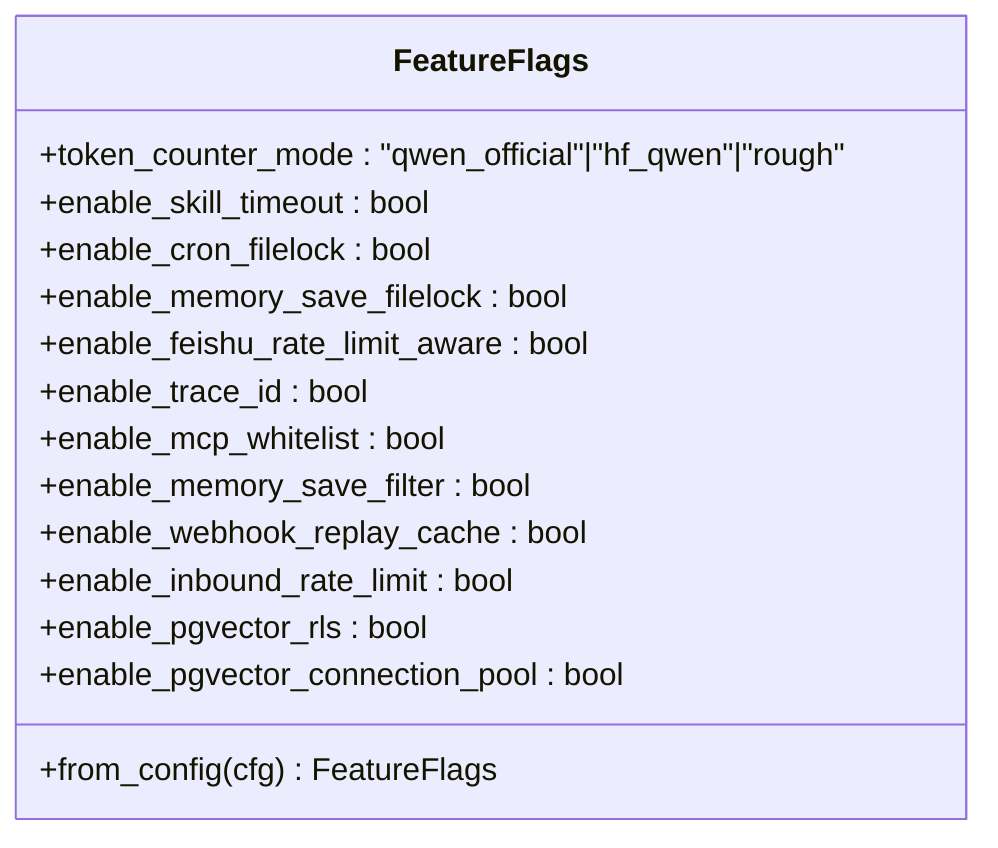
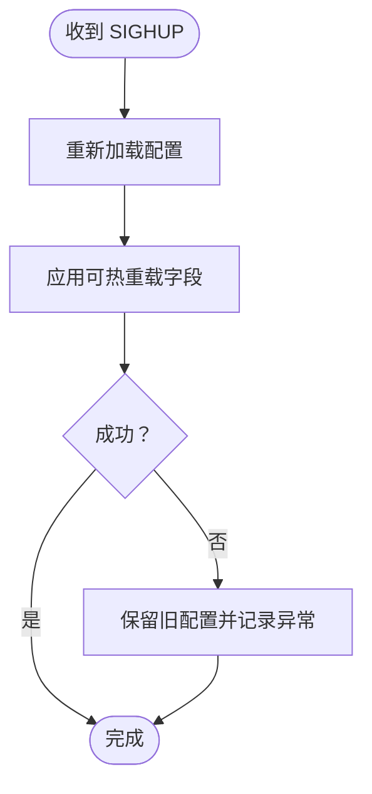
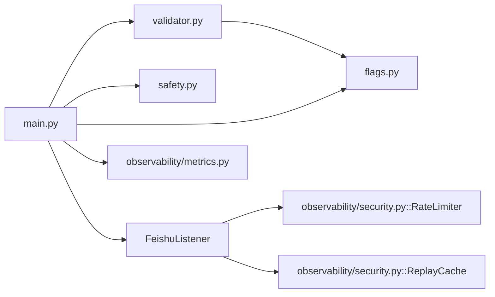

# 配置管理

<cite>
**本文引用的文件**   
- [config.yaml.example](file://config.yaml.example)
- [docs/09-config.md](file://docs/09-config.md)
- [docs/ssot/feature-flags.md](file://docs/ssot/feature-flags.md)
- [docs/ssot/ports.md](file://docs/ssot/ports.md)
- [xiaopaw/config/flags.py](file://xiaopaw/config/flags.py)
- [xiaopaw/config/safety.py](file://xiaopaw/config/safety.py)
- [xiaopaw/config/validator.py](file://xiaopaw/config/validator.py)
- [xiaopaw/main.py](file://xiaopaw/main.py)
- [xiaopaw/observability/security.py](file://xiaopaw/observability/security.py)
- [xiaopaw/observability/metrics.py](file://xiaopaw/observability/metrics.py)
</cite>

## 目录
1. [简介](#简介)
2. [项目结构](#项目结构)
3. [核心组件](#核心组件)
4. [架构总览](#架构总览)
5. [详细组件分析](#详细组件分析)
6. [依赖关系分析](#依赖关系分析)
7. [性能考量](#性能考量)
8. [故障排查指南](#故障排查指南)
9. [结论](#结论)
10. [附录](#附录)

## 简介
本文件系统化阐述 XiaoPaw v2 的配置管理方案，覆盖配置分层与优先级、config.yaml 字段说明、环境变量覆盖、FeatureFlags 动态开关、凭证安全管理、.env 配置与轮换、不同环境模板与最佳实践、配置验证与启动校验、热重载与热备份策略、以及配置变更影响分析与回滚建议。目标是帮助运维与实现工程师在 dev/canary/prod 环境中安全、可控地交付与演进系统。

## 项目结构
XiaoPaw v2 的配置体系围绕“模板/运维配置/凭证/命令行”四层分层设计，配合严格的加载顺序与启动校验，确保生产安全与可观察性。

**图表来源**
- [docs/09-config.md:35-77](file://docs/09-config.md#L35-L77)
- [xiaopaw/main.py:18-31](file://xiaopaw/main.py#L18-L31)
- [xiaopaw/config/validator.py:97-122](file://xiaopaw/config/validator.py#L97-L122)
- [xiaopaw/config/safety.py:27-48](file://xiaopaw/config/safety.py#L27-L48)

**章节来源**
- [docs/09-config.md:35-77](file://docs/09-config.md#L35-L77)

## 核心组件
- 配置加载与校验链路：命令行参数 → 环境变量 → config.yaml → 代码默认值；随后进行 Pydantic 校验与生产安全断言。
- FeatureFlags 注册表：集中定义与校验，支持热重载与可观测性指标暴露。
- 安全与可观测：速率限制、去重缓存、日志级别与 JSON 输出、指标端口与令牌、TestAPI 仅 dev 可用等。

**章节来源**
- [docs/09-config.md:35-77](file://docs/09-config.md#L35-L77)
- [xiaopaw/config/flags.py:9-23](file://xiaopaw/config/flags.py#L9-L23)
- [xiaopaw/config/validator.py:97-122](file://xiaopaw/config/validator.py#L97-L122)
- [xiaopaw/config/safety.py:27-48](file://xiaopaw/config/safety.py#L27-L48)

## 架构总览
配置从文件与环境变量加载，经 Pydantic Schema 校验与生产安全断言，最终注入到运行时服务（监听器、调度器、清理器、指标服务器等）。FeatureFlags 通过上下文传递并在启动时暴露为指标。

**图表来源**
- [xiaopaw/main.py:18-31](file://xiaopaw/main.py#L18-L31)
- [xiaopaw/config/validator.py:116-122](file://xiaopaw/config/validator.py#L116-L122)
- [xiaopaw/config/safety.py:27-48](file://xiaopaw/config/safety.py#L27-L48)

## 详细组件分析

### 配置分层与优先级
- 分层
  - L0 模板：config.yaml.example 与 .env.example，用于生成与演进。
  - L1 运维配置：config.yaml（不含密钥），随环境生命周期变化。
  - L2 凭证：.env（含密钥），提交到 .gitignore，权限 0400，轮换周期 90 天。
  - L3 命令行：--config 指定路径，单次运行有效。
- 优先级（高 → 低）
  - 命令行参数 --config
  - 环境变量 XIAOPAW_*
  - config.yaml
  - 代码默认值（Pydantic Field 默认）
- 加载顺序
  - 解析命令行 → 选择 config.yaml 路径 → 读取 YAML → 环境变量替换 → Pydantic 校验 → 生产安全断言

**章节来源**
- [docs/09-config.md:35-77](file://docs/09-config.md#L35-L77)

### config.yaml 字段与示例
- 关键节与要点
  - workspace / data_dir：工作区与数据目录
  - feishu：飞书应用凭据（v2 要求 encrypt_key 与 verification_token）、allowed_chats 白名单
  - agent：模型、迭代次数、输入 token 上限、子代理配置、超时
  - sandbox：容器内 MCP 地址与超时
  - memory：工作区目录、上下文目录、DB DSN、行数阈值与压缩阈值
  - session：最大活跃会话、历史回合数
  - runner：队列大小、空闲超时
  - sender：重试次数、退避序列、并发上限
  - debug：TestAPI 开关、绑定地址、端口、令牌
  - observability：指标主机/端口、日志 JSON、Langfuse 主机/密钥/开关
  - rate_limit：每用户每分钟限额
  - replay_cache：去重缓存容量与 TTL
  - cron：开关、检查间隔、文件锁超时、DLQ 重试
  - cleanup：保留天数、扫描小时
  - feature_flags：功能开关注册表（见下节）

**章节来源**
- [config.yaml.example:1-90](file://config.yaml.example#L1-L90)
- [docs/09-config.md:81-260](file://docs/09-config.md#L81-L260)

### FeatureFlags 系统
- 注册表与校验
  - FeatureFlags 以 dataclass 定义，包含 token_counter_mode、并发容错、观测、安全、pgvector 等开关。
  - from_config 对 feature_flags 节进行“未知字段拒绝”，防止历史字段残留与拼写错误。
- 启动校验（prod）
  - REQUIRED_ON_IN_PROD 列表在生产环境强制开启，关闭将导致启动失败。
- 热重载支持
  - 多数 enable_* 可热重载；部分初始化时固化的字段需重启。
- 指标暴露
  - 启动时将所有 flag 暴露为 xiaopaw_feature_flag 指标，便于 Grafana 监控。

**图表来源**
- [xiaopaw/config/flags.py:9-23](file://xiaopaw/config/flags.py#L9-L23)
- [docs/ssot/feature-flags.md:67-107](file://docs/ssot/feature-flags.md#L67-L107)

**章节来源**
- [xiaopaw/config/flags.py:9-23](file://xiaopaw/config/flags.py#L9-L23)
- [docs/ssot/feature-flags.md:41-63](file://docs/ssot/feature-flags.md#L41-L63)
- [docs/09-config.md:401-447](file://docs/09-config.md#L401-L447)

### 凭证安全管理与 .env
- .env 字段清单与强度要求
  - XIAOPAW_ENV、XIAOPAW_GIT_SHA、飞书、DeepSeek、pgvector、百度搜索、TestAPI、Metrics、Sentry 等。
  - 强度要求：TestAPI 令牌与 Metrics 令牌 ≥32 字符；飞书 encrypt_key ≥16；DB 密码强口令。
- 弱凭证检测
  - is_weak_credential 双层检测（长度、重复、字典词等），生产环境禁止弱值。
- 轮换与落盘
  - .env 权限 0400，建议通过 Secret Manager 托管，避免明文落盘。

**章节来源**
- [docs/09-config.md:321-396](file://docs/09-config.md#L321-L396)
- [docs/09-config.md:502-598](file://docs/09-config.md#L502-L598)

### 不同环境模板与最佳实践
- dev
  - 允许 TestAPI（loopback 绑定），可关闭速率限制与白名单以便教学探索；日志级别 DEBUG。
- canary
  - 与 prod 一致的严格开关集合，日志可关闭人类可读输出，统一指标端口。
- prod
  - 强制关闭 TestAPI；REQUIRED_ON_IN_PROD 全开；metrics 端口 8090；必要时可临时关闭 enable_trace_id 或 pgvector RLS。

**章节来源**
- [docs/09-config.md:700-791](file://docs/09-config.md#L700-L791)
- [docs/ssot/feature-flags.md:41-63](file://docs/ssot/feature-flags.md#L41-L63)

### 配置验证与启动校验
- Pydantic 校验：字段类型、范围、必填项。
- 生产安全断言（assert_all_production_safe）
  - 飞书密钥强度、TestAPI 仅 dev、metrics 令牌（prod 必填）、sandbox.url 内网约束等。
- 单入口断言：v2.1 合并为 assert_all_production_safe，避免遗漏。

**章节来源**
- [xiaopaw/config/validator.py:97-122](file://xiaopaw/config/validator.py#L97-L122)
- [xiaopaw/config/safety.py:27-48](file://xiaopaw/config/safety.py#L27-L48)
- [docs/09-config.md:502-576](file://docs/09-config.md#L502-L576)

### 热重载（SIGHUP）与热备份
- 支持热重载的配置
  - rate_limit.*、sender.max_concurrent（需重建信号量）、observability.log_level、observability.trace.sample_rate、多数 feature_flags.*、cleanup.*。
  - 部分字段（如 agent.model、feature_flags.enable_mcp_whitelist 等）初始化时固化，需重启。
- 实现机制
  - 主进程捕获 SIGHUP，重新加载配置并应用可热重载字段，失败时保留旧配置。
- 热备份建议
  - 迁移前保留 config.yaml 原始版本与 .env；变更前在 dev/canary 验证；生产采用蓝绿或滚动发布 + SIGHUP。

**图表来源**
- [docs/09-config.md:601-660](file://docs/09-config.md#L601-L660)

**章节来源**
- [docs/09-config.md:601-660](file://docs/09-config.md#L601-L660)

### 配置变更管理与回滚策略
- 变更流程
  - 修改 config.yaml → 本地启动校验 → dev 集成测试 → PR 审核 → 生产蓝绿/滚动发布 + SIGHUP。
- 关键字段影响
  - feishu.allowed_chats：立即生效（SIGHUP）。
  - agent.model：需重启（MemoryAwareCrew 初始化时固化）。
  - memory.db_dsn：需重启（数据库连接）。
  - feature_flags.enable_mcp_whitelist / enable_cron_filelock / enable_pgvector_connection_pool：需重启。
- 历史改名与迁移
  - observability.health_port 删除；feature_flags.enable_webhook_signature → enable_webhook_replay_cache；sandbox.url 端口 8022→8080。

**章节来源**
- [docs/09-config.md:663-697](file://docs/09-config.md#L663-L697)
- [docs/09-config.md:818-876](file://docs/09-config.md#L818-L876)

## 依赖关系分析
- 配置加载依赖
  - main.py 依赖 validator.load_config 与 safety.assert_all_production_safe。
  - validator.py 定义 AppConfig 与各子配置模型。
  - flags.py 定义 FeatureFlags 注册表。
- 运行时依赖
  - FeishuListener 使用 rate_limiter 与 replay_cache。
  - 观测性组件使用 log_json、metrics_port、trace.sample_rate。
  - FeatureFlags 通过上下文在各模块生效。

**图表来源**
- [xiaopaw/main.py:18-31](file://xiaopaw/main.py#L18-L31)
- [xiaopaw/config/validator.py:97-122](file://xiaopaw/config/validator.py#L97-L122)
- [xiaopaw/config/flags.py:9-23](file://xiaopaw/config/flags.py#L9-L23)
- [xiaopaw/observability/security.py:11-73](file://xiaopaw/observability/security.py#L11-L73)
- [xiaopaw/observability/metrics.py:1-65](file://xiaopaw/observability/metrics.py#L1-L65)

**章节来源**
- [xiaopaw/main.py:18-31](file://xiaopaw/main.py#L18-L31)
- [xiaopaw/observability/security.py:11-73](file://xiaopaw/observability/security.py#L11-L73)

## 性能考量
- 连接池与资源复用
  - enable_pgvector_connection_pool：提升查询性能，需重启生效。
- 日志与追踪
  - log_json 与 trace.sample_rate 影响可观测性成本与性能。
- 并发与限流
  - sender.max_concurrent 与 rate_limit.per_user_per_minute 影响吞吐与资源占用。
- Token 计数
  - token_counter_mode=rough 可在无网环境降低计算开销，但精度下降。

**章节来源**
- [docs/09-config.md:601-620](file://docs/09-config.md#L601-L620)
- [docs/ssot/feature-flags.md:10-24](file://docs/ssot/feature-flags.md#L10-L24)

## 故障排查指南
- 启动失败
  - 生产环境 TestAPI 开启、metrics 令牌缺失、sandbox.url 指向 loopback、飞书密钥过弱等均会导致断言失败。
- 配置热重载无效
  - 某些字段初始化时固化，需重启；或新配置与当前状态冲突。
- 观测性问题
  - /metrics 需 Bearer Token；/health 无需鉴权；端口 8090。
- 安全告警
  - ReplayCache 命中表示事件去重生效；RateLimiter 命中表示入站限流触发。

**章节来源**
- [docs/09-config.md:502-576](file://docs/09-config.md#L502-L576)
- [docs/ssot/ports.md:19-55](file://docs/ssot/ports.md#L19-L55)
- [xiaopaw/observability/security.py:47-73](file://xiaopaw/observability/security.py#L47-L73)

## 结论
XiaoPaw v2 的配置管理以“模板-运维配置-凭证-命令行”的分层与严格的加载优先级为基础，结合 FeatureFlags 注册表与生产安全断言，实现了可演进、可观测、可回滚的配置体系。通过热重载与端口/鉴权策略，系统在 dev/canary/prod 环境中具备明确的差异化能力与安全边界。建议在生产中遵循 REQUIRED_ON_IN_PROD、凭证轮换与最小暴露原则，并以蓝绿/滚动发布与 SIGHUP 的组合保障变更安全。

## 附录

### 端口与服务总览（v2.1）
- 8090：/metrics 与 /health（Bearer 鉴权仅作用于 /metrics）
- 9090：TestAPI（仅 dev loopback）
- 8080：AIO-Sandbox MCP（容器内网络）
- 5432：pgvector（容器内网络）

**章节来源**
- [docs/ssot/ports.md:8-122](file://docs/ssot/ports.md#L8-L122)