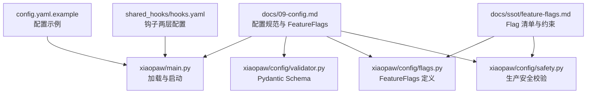
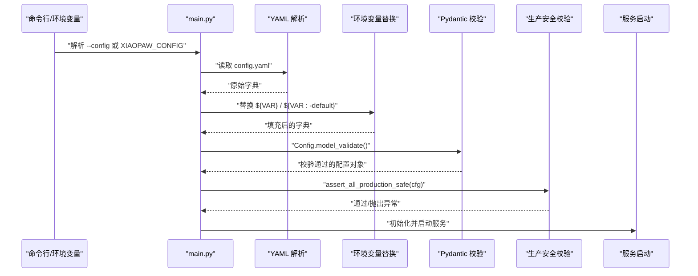
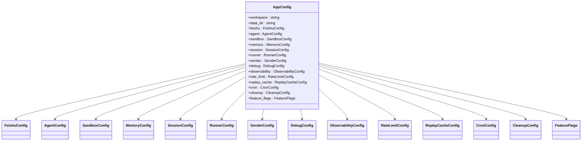
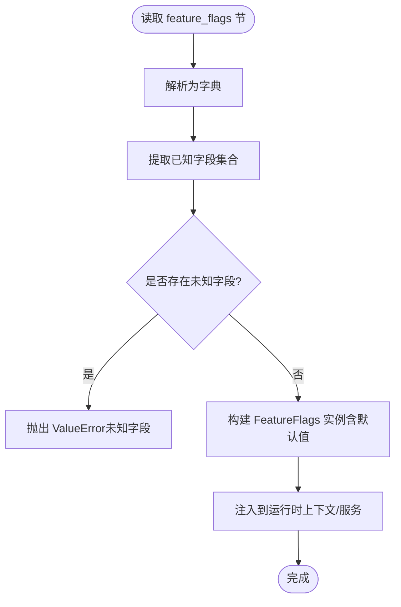
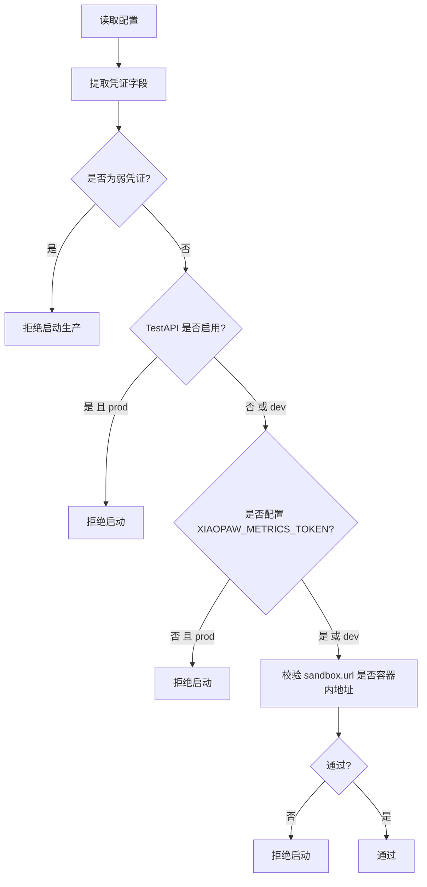
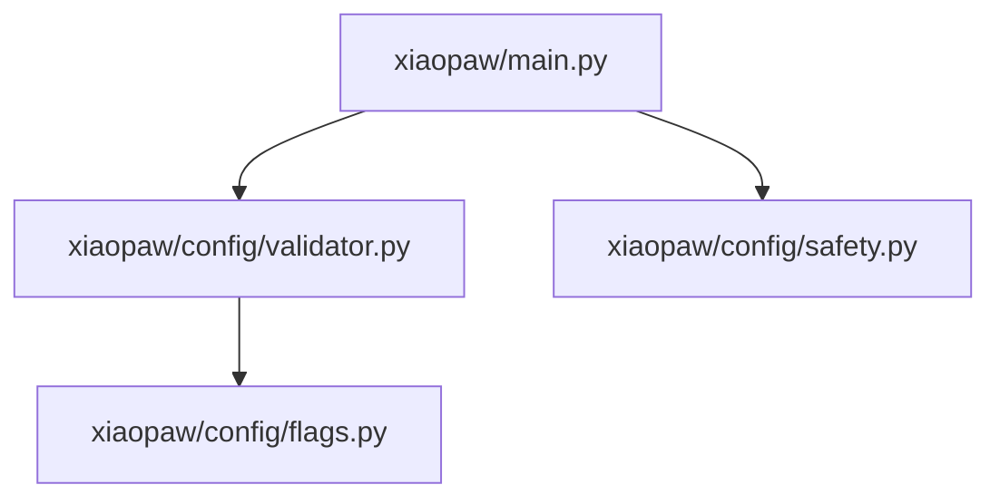

# 配置管理

<cite>
**本文引用的文件**
- [docs/09-config.md](file://docs/09-config.md)
- [docs/ssot/feature-flags.md](file://docs/ssot/feature-flags.md)
- [config.yaml.example](file://config.yaml.example)
- [xiaopaw/main.py](file://xiaopaw/main.py)
- [xiaopaw/config/validator.py](file://xiaopaw/config/validator.py)
- [xiaopaw/config/flags.py](file://xiaopaw/config/flags.py)
- [xiaopaw/config/safety.py](file://xiaopaw/config/safety.py)
- [shared_hooks/hooks.yaml](file://shared_hooks/hooks.yaml)
- [tests/integration/test_two_layer_config.py](file://tests/integration/test_two_layer_config.py)
</cite>

## 目录
1. [简介](#简介)
2. [项目结构](#项目结构)
3. [核心组件](#核心组件)
4. [架构总览](#架构总览)
5. [详细组件分析](#详细组件分析)
6. [依赖分析](#依赖分析)
7. [性能考虑](#性能考虑)
8. [故障排除指南](#故障排除指南)
9. [结论](#结论)
10. [附录](#附录)

## 简介
本文件系统化阐述 XiaoPaw v2 的配置管理体系，覆盖配置分层与优先级、环境变量替换、凭证安全校验、FeatureFlags 注册表与热重载、以及配置变更与回滚策略。文档基于仓库内的设计文档与源码实现，提供可操作的最佳实践与排障指引。

## 项目结构
围绕配置管理的关键文件与职责如下：
- 文档层
  - 配置规范与 FeatureFlags：docs/09-config.md
  - FeatureFlags 单一真相源：docs/ssot/feature-flags.md
- 示例与模板
  - 配置示例：config.yaml.example
- 应用层
  - 主入口与加载流程：xiaopaw/main.py
  - 配置模型与校验：xiaopaw/config/validator.py
  - FeatureFlags 定义与校验：xiaopaw/config/flags.py、xiaopaw/config/safety.py
- 钩子框架（与配置合并相关）
  - 两层钩子配置：shared_hooks/hooks.yaml
  - 两层配置合并集成测试：tests/integration/test_two_layer_config.py

**图表来源**
- [docs/09-config.md:1-939](file://docs/09-config.md#L1-L939)
- [xiaopaw/main.py:1-218](file://xiaopaw/main.py#L1-L218)
- [xiaopaw/config/validator.py:1-122](file://xiaopaw/config/validator.py#L1-L122)
- [xiaopaw/config/flags.py:1-23](file://xiaopaw/config/flags.py#L1-L23)
- [xiaopaw/config/safety.py:1-48](file://xiaopaw/config/safety.py#L1-L48)
- [config.yaml.example:1-90](file://config.yaml.example#L1-L90)
- [shared_hooks/hooks.yaml:1-73](file://shared_hooks/hooks.yaml#L1-L73)
- [docs/ssot/feature-flags.md:1-170](file://docs/ssot/feature-flags.md#L1-L170)

**章节来源**
- [docs/09-config.md:35-80](file://docs/09-config.md#L35-L80)
- [docs/09-config.md:81-318](file://docs/09-config.md#L81-L318)
- [docs/09-config.md:321-396](file://docs/09-config.md#L321-L396)
- [docs/09-config.md:400-576](file://docs/09-config.md#L400-L576)
- [docs/09-config.md:601-671](file://docs/09-config.md#L601-L671)
- [docs/09-config.md:699-792](file://docs/09-config.md#L699-L792)
- [docs/09-config.md:795-800](file://docs/09-config.md#L795-L800)

## 核心组件
- 配置分层与优先级
  - 分层：L0 模板（config.yaml.example/.env.example）、L1 运维配置（config.yaml）、L2 凭证（.env）、L3 命令行（--config）
  - 优先级：命令行 > 环境变量 > config.yaml > 代码默认值
- 配置加载与校验
  - 主入口加载：读取配置路径（命令行/XIAOPAW_CONFIG/config.yaml），进行环境变量替换，Pydantic 校验，再执行生产安全校验
- FeatureFlags 注册表
  - 使用 dataclass 定义，提供默认值与“未知字段拒绝”逻辑，确保字段一致性与可审计性
- 环境变量与凭证
  - .env 字段清单与强度要求；生产环境禁止 TestAPI；Metrics Token 必填；弱凭证检测
- 热重载与变更管理
  - 仅部分配置支持热重载；变更流程包含本地校验、PR 审核与蓝绿发布/SIGHUP

**章节来源**
- [docs/09-config.md:35-80](file://docs/09-config.md#L35-L80)
- [docs/09-config.md:262-318](file://docs/09-config.md#L262-L318)
- [docs/09-config.md:400-576](file://docs/09-config.md#L400-L576)
- [docs/09-config.md:601-671](file://docs/09-config.md#L601-L671)
- [docs/09-config.md:699-792](file://docs/09-config.md#L699-L792)

## 架构总览
下图展示配置从加载到应用的总体流程与关键校验点：

**图表来源**
- [docs/09-config.md:60-77](file://docs/09-config.md#L60-L77)
- [xiaopaw/main.py:18-32](file://xiaopaw/main.py#L18-L32)
- [xiaopaw/config/validator.py:116-122](file://xiaopaw/config/validator.py#L116-L122)
- [xiaopaw/config/safety.py:27-48](file://xiaopaw/config/safety.py#L27-L48)

## 详细组件分析

### 配置分层与优先级
- 分层策略
  - L0：模板文件，用于指导运维复制与审阅
  - L1：非密配置，按环境维护
  - L2：密钥与敏感信息，严格权限控制
  - L3：一次性运行参数，覆盖范围最小
- 优先级与加载顺序
  - 命令行参数优先
  - 环境变量次之（如 XIAOPAW_*）
  - config.yaml 其次
  - 代码默认值兜底
- 环境变量替换
  - 支持 ${VAR} 与 ${VAR:-default} 语法，便于在 YAML 中引用 .env

**章节来源**
- [docs/09-config.md:35-80](file://docs/09-config.md#L35-L80)
- [docs/09-config.md:60-77](file://docs/09-config.md#L60-L77)

### 配置模型与校验（Pydantic）
- 模型结构
  - 分层配置类：FeishuConfig、AgentConfig、SandboxConfig、MemoryConfig、SessionConfig、RunnerConfig、SenderConfig、DebugConfig、ObservabilityConfig、RateLimitConfig、ReplayCacheConfig、CronConfig、CleanupConfig
  - 主配置类：AppConfig 聚合上述子配置，并包含 FeatureFlags
- 校验规则
  - 字段范围与必填约束
  - 自定义校验器（如内存阈值关系）
- 加载函数
  - 从 YAML 文件读取并构造配置对象

**图表来源**
- [xiaopaw/config/validator.py:14-122](file://xiaopaw/config/validator.py#L14-L122)
- [xiaopaw/config/flags.py:9-23](file://xiaopaw/config/flags.py#L9-L23)

**章节来源**
- [xiaopaw/config/validator.py:14-122](file://xiaopaw/config/validator.py#L14-L122)

### FeatureFlags 注册表与使用模式
- 注册表定义
  - 使用 dataclass 定义，包含默认值与类型约束
  - 提供 from_config 方法，拒绝未知字段，防止拼写错误与历史字段残留
- 与单一真相源对齐
  - 与 docs/ssot/feature-flags.md 的 Flag 清单、默认值、热重载与回滚风险矩阵保持一致
- 使用模式
  - 作为 AppConfig 的一部分注入到各模块（如技能、监听器、清理服务等）
  - 通过热重载或重启生效

**图表来源**
- [xiaopaw/config/flags.py:9-23](file://xiaopaw/config/flags.py#L9-L23)
- [docs/ssot/feature-flags.md:67-107](file://docs/ssot/feature-flags.md#L67-L107)

**章节来源**
- [xiaopaw/config/flags.py:9-23](file://xiaopaw/config/flags.py#L9-L23)
- [docs/ssot/feature-flags.md:8-24](file://docs/ssot/feature-flags.md#L8-L24)
- [docs/ssot/feature-flags.md:41-63](file://docs/ssot/feature-flags.md#L41-L63)

### 环境变量管理与凭证安全
- 环境变量清单
  - 包括 XIAOPAW_ENV、XIAOPAW_GIT_SHA、飞书、DeepSeek、pgvector、百度搜索、TestAPI、Metrics、Sentry 等
- 凭证强度与禁止值
  - 强度要求与禁止值检测（弱密码正则 + 哈希校验）
- 生产安全校验
  - TestAPI 必须禁用（或仅 dev 允许）
  - Metrics Token 必填（prod）
  - sandbox.url 必须为容器内地址（避免指向宿主 loopback）
  - prod 环境对若干 FeatureFlags 强制开启

**图表来源**
- [docs/09-config.md:548-576](file://docs/09-config.md#L548-L576)
- [xiaopaw/config/safety.py:18-48](file://xiaopaw/config/safety.py#L18-L48)

**章节来源**
- [docs/09-config.md:321-396](file://docs/09-config.md#L321-L396)
- [docs/09-config.md:502-576](file://docs/09-config.md#L502-L576)
- [xiaopaw/config/safety.py:18-48](file://xiaopaw/config/safety.py#L18-L48)

### 配置验证与加载机制
- 加载步骤
  - 解析命令行与环境变量确定配置路径
  - 读取 YAML，执行环境变量替换
  - Pydantic 校验
  - 生产安全校验（单入口）
- 验证要点
  - 字段类型、范围、必填
  - 自定义业务约束（如阈值关系）
  - 环境敏感性与网络约束

**章节来源**
- [docs/09-config.md:60-77](file://docs/09-config.md#L60-L77)
- [xiaopaw/config/validator.py:116-122](file://xiaopaw/config/validator.py#L116-L122)

### 热重载（SIGHUP）与变更影响
- 支持热重载的配置
  - rate_limit.*、observability.log_level、observability.trace.sample_rate、feature_flags.enable_*（多数）、cleanup.* 等
- 不支持热重载的配置
  - agent.model、feature_flags.enable_mcp_whitelist、feature_flags.enable_cron_filelock、feature_flags.enable_pgvector_connection_pool 等
- 实现要点
  - 接收 SIGHUP 后重新加载配置并应用可热重载字段
  - 对不可热重载字段发出警告并保持现状

**章节来源**
- [docs/09-config.md:601-671](file://docs/09-config.md#L601-L671)
- [xiaopaw/main.py:624-652](file://xiaopaw/main.py#L624-L652)

### 配置变更管理与回滚策略
- 变更流程
  - 修改 config.yaml（不提交到 Git）
  - 本地启动校验
  - dev 环境测试
  - PR 审核（config.yaml.example 变更需审）
  - 生产发布（蓝绿部署 / SIGHUP 热重载）
- 回滚策略
  - 对支持热重载的配置，可通过再次下发相同/回退值快速恢复
  - 对不支持热重载的配置，采用蓝绿切换或重启恢复

**章节来源**
- [docs/09-config.md:663-697](file://docs/09-config.md#L663-L697)

### 不同环境的配置差异
- dev：允许 TestAPI、宽松日志级别、可关闭安全开关、允许弱网降级
- canary：与 prod 一致的严格配置
- prod：强制开启多项安全与稳定性开关，禁止 TestAPI，Metrics Token 必填

**章节来源**
- [docs/09-config.md:700-792](file://docs/09-config.md#L700-L792)

### 钩子框架的两层配置合并（扩展阅读）
- 两层配置：global 与 workspace 层，后者覆盖前者
- 合并顺序与策略：global 先于 workspace 执行，策略可叠加
- 集成测试验证合并行为与策略加载

**章节来源**
- [shared_hooks/hooks.yaml:1-73](file://shared_hooks/hooks.yaml#L1-L73)
- [tests/integration/test_two_layer_config.py:23-106](file://tests/integration/test_two_layer_config.py#L23-L106)

## 依赖分析
- 组件耦合
  - main.py 依赖 validator.py 与 safety.py 完成加载与校验
  - validator.py 依赖 flags.py 提供 FeatureFlags 类型
  - safety.py 依赖 validator.py 中的配置模型
- 外部依赖
  - YAML 解析、Pydantic 校验、信号处理（SIGHUP）

**图表来源**
- [xiaopaw/main.py:11-13](file://xiaopaw/main.py#L11-L13)
- [xiaopaw/config/validator.py:11](file://xiaopaw/config/validator.py#L11)
- [xiaopaw/config/safety.py:7](file://xiaopaw/config/safety.py#L7)

**章节来源**
- [xiaopaw/main.py:11-13](file://xiaopaw/main.py#L11-L13)
- [xiaopaw/config/validator.py:11](file://xiaopaw/config/validator.py#L11)
- [xiaopaw/config/safety.py:7](file://xiaopaw/config/safety.py#L7)

## 性能考虑
- FeatureFlags 的热重载与指标暴露，便于在生产中动态评估变更影响
- 连接池与缓存策略（如 pgvector 连接池、ReplayCache）对性能与稳定性有直接影响，建议结合监控与压测制定阈值

## 故障排除指南
- 启动失败：凭证过弱或占位符
  - 检查 .env 中的密钥强度与禁止值
- 启动失败：TestAPI 在 prod 启用
  - 确认 XIAOPAW_ENV=prod 时禁用 TestAPI
- 启动失败：Metrics Token 未配置
  - prod 环境必须设置 XIAOPAW_METRICS_TOKEN
- 启动失败：sandbox.url 指向宿主 loopback
  - 使用容器内 DNS 地址（如 aio-sandbox:8080）
- 热重载无效
  - 检查是否为支持热重载的字段；对不支持的字段需蓝绿或重启
- FeatureFlags 未知字段
  - 清单以 docs/ssot/feature-flags.md 为准，避免拼写错误或历史字段残留

**章节来源**
- [docs/09-config.md:548-576](file://docs/09-config.md#L548-L576)
- [docs/09-config.md:601-671](file://docs/09-config.md#L601-L671)
- [docs/ssot/feature-flags.md:8-24](file://docs/ssot/feature-flags.md#L8-L24)

## 结论
XiaoPaw v2 的配置体系通过清晰的分层与严格的优先级、完善的 Pydantic 校验与生产安全校验、以及可审计的 FeatureFlags 注册表，实现了高可靠与可演进的配置管理。配合热重载与变更流程，可在保障安全的前提下实现平滑的配置演进与回滚。

## 附录
- 配置示例参考：config.yaml.example
- FeatureFlags 单一真相源：docs/ssot/feature-flags.md
- 两层钩子配置参考：shared_hooks/hooks.yaml 与集成测试：tests/integration/test_two_layer_config.py