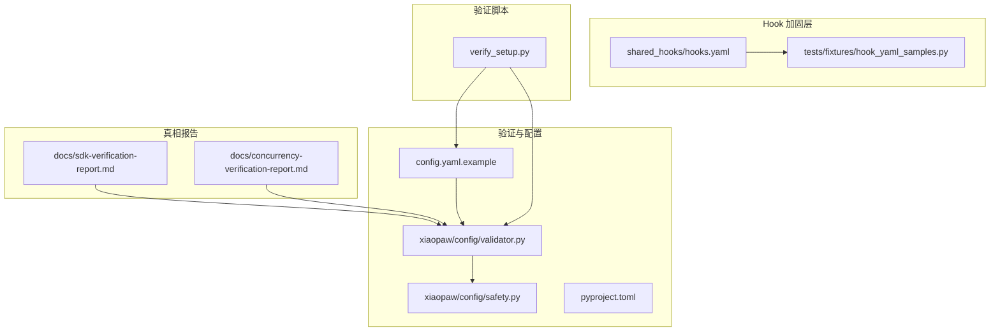
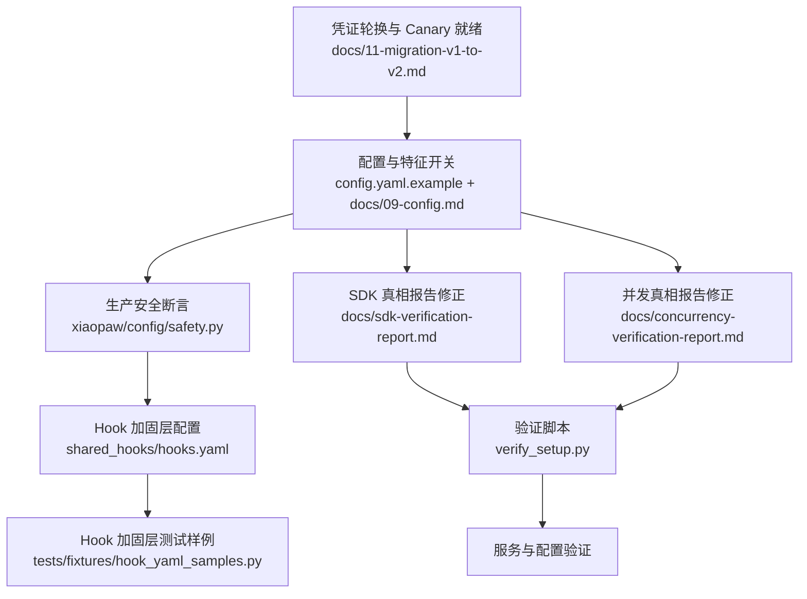
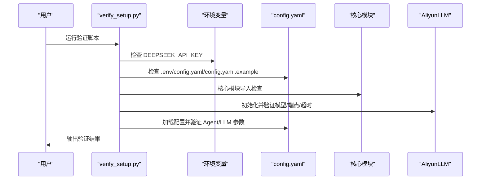
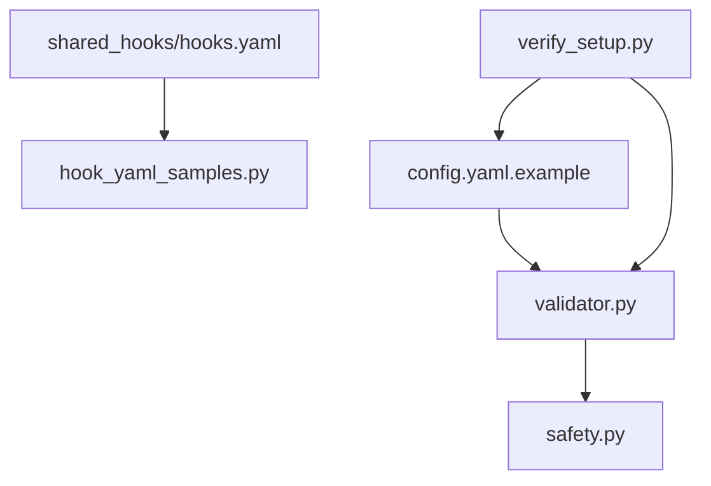

# Phase 0 清单

<cite>
**本文档引用的文件**
- [DESIGN.md](file://DESIGN.md)
- [verify_setup.py](file://verify_setup.py)
- [config.yaml.example](file://config.yaml.example)
- [pyproject.toml](file://pyproject.toml)
- [docs/sdk-verification-report.md](file://docs/sdk-verification-report.md)
- [docs/concurrency-verification-report.md](file://docs/concurrency-verification-report.md)
- [docs/09-config.md](file://docs/09-config.md)
- [docs/11-migration-v1-to-v2.md](file://docs/11-migration-v1-to-v2.md)
- [xiaopaw/config/validator.py](file://xiaopaw/config/validator.py)
- [xiaopaw/config/safety.py](file://xiaopaw/config/safety.py)
- [shared_hooks/hooks.yaml](file://shared_hooks/hooks.yaml)
- [tests/fixtures/hook_yaml_samples.py](file://tests/fixtures/hook_yaml_samples.py)
- [docs/06-observability.md](file://docs/06-observability.md)
</cite>

## 目录
1. [简介](#简介)
2. [项目结构](#项目结构)
3. [核心组件](#核心组件)
4. [架构总览](#架构总览)
5. [详细组件分析](#详细组件分析)
6. [依赖关系分析](#依赖关系分析)
7. [性能考量](#性能考量)
8. [故障排除指南](#故障排除指南)
9. [结论](#结论)
10. [附录](#附录)

## 简介
Phase 0 是 XiaoPaw v2 生产加固过程中的前置验证阶段，旨在通过系统化的清单与验证流程，确保以下目标达成：
- 凭证轮换与安全基线就绪
- Canary 环境稳定运行 72 小时，内存增长斜率 <1MB/h
- Tokenizer 校准完成，确保上下文计数准确
- SDK 与并发真相报告中的关键假设得到修正，避免上线后出现重大回归
- 配置与特征开关满足生产环境强制要求，启动即通过安全断言

本清单将提供可执行的检查项目、验证步骤、完成标准与最佳实践，并结合仓库中的实际文件给出可溯源的参考路径。

## 项目结构
XiaoPaw v2 的 Phase 0 关注以下关键目录与文件：
- docs/：包含 SDK 真相报告、并发真相报告、配置与迁移文档
- xiaopaw/config/：配置校验与生产安全断言
- shared_hooks/：Hook 框架与加固层配置
- tests/fixtures/：Hook 配置样例，用于验证加载与依赖注入
- verify_setup.py：服务与配置验证脚本
- config.yaml.example：配置模板
- pyproject.toml：依赖与测试标记

**图表来源**
- [config.yaml.example:1-90](file://config.yaml.example#L1-L90)
- [xiaopaw/config/validator.py:1-122](file://xiaopaw/config/validator.py#L1-L122)
- [xiaopaw/config/safety.py:1-48](file://xiaopaw/config/safety.py#L1-L48)
- [docs/sdk-verification-report.md:1-173](file://docs/sdk-verification-report.md#L1-L173)
- [docs/concurrency-verification-report.md:1-97](file://docs/concurrency-verification-report.md#L1-L97)
- [shared_hooks/hooks.yaml:1-73](file://shared_hooks/hooks.yaml#L1-L73)
- [tests/fixtures/hook_yaml_samples.py:1-91](file://tests/fixtures/hook_yaml_samples.py#L1-L91)
- [verify_setup.py:1-140](file://verify_setup.py#L1-L140)

**章节来源**
- [DESIGN.md:1-753](file://DESIGN.md#L1-L753)
- [pyproject.toml:1-63](file://pyproject.toml#L1-L63)

## 核心组件
- 配置与安全断言：通过 Pydantic Schema 校验配置合法性，并在生产环境强制执行安全断言，包括凭证强度、TestAPI 限制、网络约束与特征开关。
- SDK 真相报告：对 lark-oapi、CrewAI、psycopg 生态、Response 对象等关键假设进行验证与修正，避免设计与实现不一致导致的线上问题。
- 并发真相报告：对 LRUCache 并发、to_thread/run_in_executor 的 ContextVar 行为、executor shutdown、跨 loop 锁等进行验证，指导锁模型与线程池使用。
- Hook 加固层：通过 hooks.yaml 声明事件与策略，实现零业务代码修改的可观测、安全与可靠性加固。
- 验证脚本：verify_setup.py 提供一键验证服务、配置、模块导入与 LLM 配置的关键路径。

**章节来源**
- [xiaopaw/config/validator.py:1-122](file://xiaopaw/config/validator.py#L1-L122)
- [xiaopaw/config/safety.py:1-48](file://xiaopaw/config/safety.py#L1-L48)
- [docs/sdk-verification-report.md:1-173](file://docs/sdk-verification-report.md#L1-L173)
- [docs/concurrency-verification-report.md:1-97](file://docs/concurrency-verification-report.md#L1-L97)
- [shared_hooks/hooks.yaml:1-73](file://shared_hooks/hooks.yaml#L1-L73)
- [verify_setup.py:1-140](file://verify_setup.py#L1-L140)

## 架构总览
Phase 0 的目标是为 v2.1 的生产加固与 v3 的 Hook 框架落地打下坚实基础。下图展示了 Phase 0 关键验证点与系统的关系：

**图表来源**
- [docs/11-migration-v1-to-v2.md:54-557](file://docs/11-migration-v1-to-v2.md#L54-L557)
- [docs/09-config.md:321-794](file://docs/09-config.md#L321-L794)
- [xiaopaw/config/safety.py:1-48](file://xiaopaw/config/safety.py#L1-L48)
- [shared_hooks/hooks.yaml:1-73](file://shared_hooks/hooks.yaml#L1-L73)
- [tests/fixtures/hook_yaml_samples.py:1-91](file://tests/fixtures/hook_yaml_samples.py#L1-L91)
- [docs/sdk-verification-report.md:1-173](file://docs/sdk-verification-report.md#L1-L173)
- [docs/concurrency-verification-report.md:1-97](file://docs/concurrency-verification-report.md#L1-L97)
- [verify_setup.py:1-140](file://verify_setup.py#L1-L140)

## 详细组件分析

### 凭证轮换与 Canary 就绪
- 目标：所有“已入库的凭证”视为已泄露，必须在 Phase 1 启动前全部轮换；Canary 环境独立部署，运行 72 小时 baseline。
- 检查要点：
  - PostgreSQL 用户创建与授权
  - 飞书 App Secret 重新生成并更新所有实例
  - DeepSeek API Key 新建并替换旧 Key
  - XIAOPAW_METRICS_TOKEN ≥32 字符
  - Canary 独立部署 pgvector 与 AIO-Sandbox，挂载 Prometheus 与内存采样
- 完成标准：
  - 连续 24h smoke test runner_alive=1
  - 内存增长斜率 <1MB/h

**章节来源**
- [docs/11-migration-v1-to-v2.md:54-92](file://docs/11-migration-v1-to-v2.md#L54-L92)
- [docs/11-migration-v1-to-v2.md:536-557](file://docs/11-migration-v1-to-v2.md#L536-L557)

### Tokenizer 校准
- 目标：v2 的 memory/token_counter.py 优先使用 DeepSeek 官方 tokenizer，不同 SDK 版本支持情况不一，需先校准。
- 检查要点：
  - 使用脚本生成 docs/tokenizer-calibration.md
  - 对比 qwen-max、tiktoken、rough 等 fallback
- 完成标准：校准报告输出，配置 feature_flags.token_counter_mode 指向 qwen_official 或 rough

**章节来源**
- [docs/11-migration-v1-to-v2.md:96-107](file://docs/11-migration-v1-to-v2.md#L96-L107)

### 配置与特征开关
- 目标：确保 config.yaml 与环境变量符合生产要求，特征开关在 prod 环境强制开启。
- 检查要点：
  - config.yaml.example 字段齐全（feishu、agent、sandbox、memory、session、runner、sender、debug、observability、rate_limit、replay_cache、cron、cleanup、feature_flags）
  - 生产环境 XIAOPAW_ENV=prod，TestAPI 禁用，Metrics Token 必填
  - REQUIRED_ON_IN_PROD 特征开关必须开启
- 完成标准：
  - 启动通过 xiaopaw/config/safety.py 的 assert_all_production_safe
  - feature_flags 与 docs/09-config.md 一致

**章节来源**
- [config.yaml.example:1-90](file://config.yaml.example#L1-L90)
- [docs/09-config.md:321-794](file://docs/09-config.md#L321-L794)
- [xiaopaw/config/safety.py:27-47](file://xiaopaw/config/safety.py#L27-L47)

### SDK 真相报告修正
- 目标：修正 lark-oapi、CrewAI、psycopg 生态、Response 对象等关键假设。
- 检查要点：
  - lark-oapi ws.Client 不支持 encrypt_key/verification_token；重放防护必须应用层实现
  - @before_llm_call 必须 in-place 修改 messages；context.llm.context_window_size 不保证存在
  - lark-oapi Response 对象属性为 .raw 而非 .raw_response
  - psycopg_pool 属于 psycopg3 生态，与 psycopg2 不兼容
- 完成标准：设计文档与实现按真相报告修订，避免硬编码假设

**章节来源**
- [docs/sdk-verification-report.md:1-173](file://docs/sdk-verification-report.md#L1-L173)

### 并发真相报告修正
- 目标：修正 LRUCache 并发双锁、to_thread 与 run_in_executor 的 ContextVar 行为、executor shutdown、跨 loop 锁等问题。
- 检查要点：
  - LRUCache 驱逐+重建会产生双锁，需用 WeakValueDictionary + 全局 dispatch_lock 或 LRU + dispatch_lock 组合
  - run_in_executor 任何版本都不 copy_context，to_thread 自 3.9+ 即自动
  - shutdown_default_executor 同步阻塞，推荐使用 loop.shutdown_default_executor
  - asyncio.Lock 跨 loop 绑定会报错
- 完成标准：设计文档与实现按真相报告修订，补充测试覆盖

**章节来源**
- [docs/concurrency-verification-report.md:1-97](file://docs/concurrency-verification-report.md#L1-L97)

### Hook 加固层配置与测试
- 目标：通过 hooks.yaml 声明事件与策略，实现零业务代码修改的可观测、安全与可靠性加固。
- 检查要点：
  - hooks.yaml 声明 BEFORE_TURN/AFTER_TURN/TASK_COMPLETE/SESSION_END 等事件
  - 策略层包含 audit_logger、sandbox_guard、permission_gate、cost_guard、loop_detector、retry_tracker
  - tests/fixtures/hook_yaml_samples.py 提供有效/无效/路径穿越等 YAML 样例
- 完成标准：HookLoader 能正确解析 hooks.yaml，策略按声明顺序实例化，依赖注入正确

**章节来源**
- [shared_hooks/hooks.yaml:1-73](file://shared_hooks/hooks.yaml#L1-L73)
- [tests/fixtures/hook_yaml_samples.py:1-91](file://tests/fixtures/hook_yaml_samples.py#L1-L91)

### 服务与配置验证脚本
- 目标：一键验证环境变量、配置文件、核心模块导入、LLM 配置与目录结构。
- 检查要点：
  - DEEPSEEK_API_KEY 设置
  - .env、config.yaml、config.yaml.example 存在
  - xiaopaw 模块导入成功
  - AliyunLLM 初始化与端点、超时等配置正确
  - 配置文件加载成功，Agent/LLM 参数符合预期
  - 目录结构存在
- 完成标准：verify_setup.py 返回 0，输出“所有验证通过”

**图表来源**
- [verify_setup.py:1-140](file://verify_setup.py#L1-L140)
- [config.yaml.example:1-90](file://config.yaml.example#L1-L90)

**章节来源**
- [verify_setup.py:1-140](file://verify_setup.py#L1-L140)

## 依赖关系分析
- 配置依赖：config.yaml.example 与 xiaopaw/config/validator.py 的 Pydantic Schema 相互约束，确保字段合法与默认值合理。
- 安全依赖：xiaopaw/config/safety.py 在生产环境强制执行，依赖环境变量与 feature_flags。
- Hook 依赖：shared_hooks/hooks.yaml 与 tests/fixtures/hook_yaml_samples.py 共同保证 HookLoader 的正确解析与依赖注入。
- 验证依赖：verify_setup.py 依赖 config.yaml 与核心模块，形成端到端验证闭环。

**图表来源**
- [config.yaml.example:1-90](file://config.yaml.example#L1-L90)
- [xiaopaw/config/validator.py:1-122](file://xiaopaw/config/validator.py#L1-L122)
- [xiaopaw/config/safety.py:1-48](file://xiaopaw/config/safety.py#L1-L48)
- [shared_hooks/hooks.yaml:1-73](file://shared_hooks/hooks.yaml#L1-L73)
- [tests/fixtures/hook_yaml_samples.py:1-91](file://tests/fixtures/hook_yaml_samples.py#L1-L91)
- [verify_setup.py:1-140](file://verify_setup.py#L1-L140)

**章节来源**
- [pyproject.toml:1-63](file://pyproject.toml#L1-L63)

## 性能考量
- 内存增长斜率：Canary 72h 内存增长斜率 <1MB/h，确保无泄漏与锁模型正确。
- 并发与锁：LRUCache 并发双锁问题需通过 dispatch_lock 或 WeakValueDictionary 解决；executor shutdown 使用 loop.shutdown_default_executor。
- Tokenizer：优先使用官方 tokenizer，fallback 与校准减少误差与重复初始化。

[本节为通用指导，无需特定文件分析]

## 故障排除指南
- 启动失败（生产环境）：
  - 检查 XIAOPAW_ENV=prod 时的安全断言，确保 TestAPI 禁用、Metrics Token ≥32、sandbox.url 为容器间地址
  - 核对 REQUIRED_ON_IN_PROD 特征开关是否开启
- 配置加载失败：
  - 确认 config.yaml 存在且字段合法；参考 config.yaml.example 与 xiaopaw/config/validator.py 的 Schema
- Hook 加载异常：
  - 检查 shared_hooks/hooks.yaml 语法与 handler 路径；参考 tests/fixtures/hook_yaml_samples.py 的样例
- SDK 假设错误：
  - lark-oapi ws.Client 不支持 encrypt_key/verification_token；Response 对象属性为 .raw；psycopg_pool 与 psycopg2 不兼容
- 并发问题：
  - LRUCache 驱逐后重入产生双锁；run_in_executor 不 copy_context；executor shutdown 阻塞；跨 loop 锁绑定报错

**章节来源**
- [xiaopaw/config/safety.py:27-47](file://xiaopaw/config/safety.py#L27-L47)
- [docs/09-config.md:508-576](file://docs/09-config.md#L508-L576)
- [shared_hooks/hooks.yaml:1-73](file://shared_hooks/hooks.yaml#L1-L73)
- [tests/fixtures/hook_yaml_samples.py:1-91](file://tests/fixtures/hook_yaml_samples.py#L1-L91)
- [docs/sdk-verification-report.md:1-173](file://docs/sdk-verification-report.md#L1-L173)
- [docs/concurrency-verification-report.md:1-97](file://docs/concurrency-verification-report.md#L1-L97)

## 结论
Phase 0 的核心在于“以真相报告为准绳，以配置与安全断言为底线”，确保 XiaoPaw v2 在生产环境具备可预期的稳定性与安全性。通过凭证轮换、Canary 基线、Tokenizer 校准、SDK 与并发真相修正、Hook 加固层配置与验证脚本，可以有效降低上线风险，保障 v2.1 与 v3 的顺利交付。

[本节为总结性内容，无需特定文件分析]

## 附录
- 验收标准（G1-G7）：消除 4 个 Blocker；canary 72h 内存增长斜率 <1MB/h；10 个 HIGH 缺陷清零；trace_id 覆盖 ≥85%；8 核心指标齐全；单元 ≥720，全局 cov ≥88%；威胁模型文档完成；PII 脱敏覆盖；数据本地化披露；日志留存策略明确；飞书入站速率限制生效。

**章节来源**
- [DESIGN.md:691-698](file://DESIGN.md#L691-L698)
- [docs/06-observability.md:904-914](file://docs/06-observability.md#L904-L914)