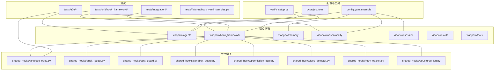
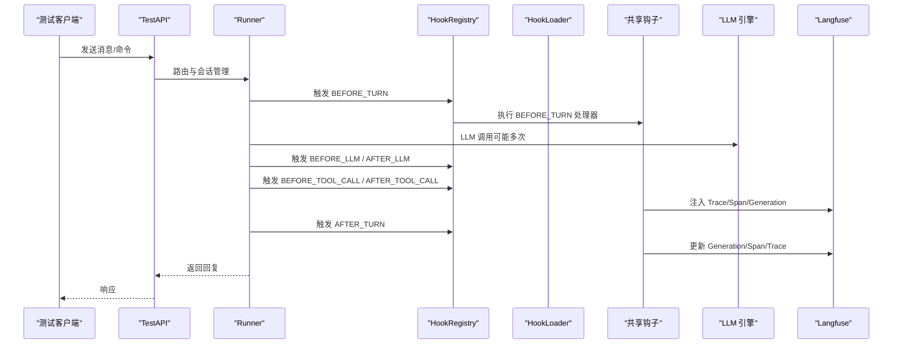
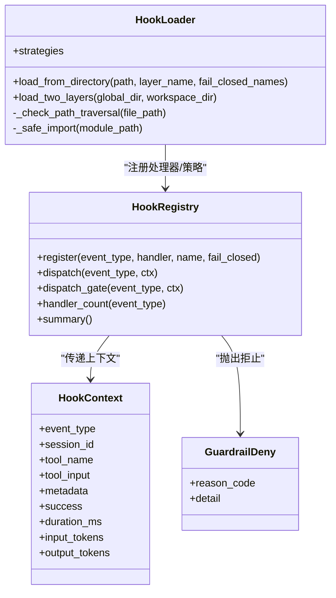
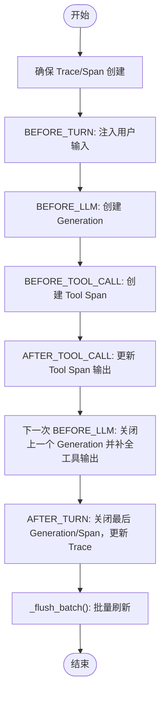
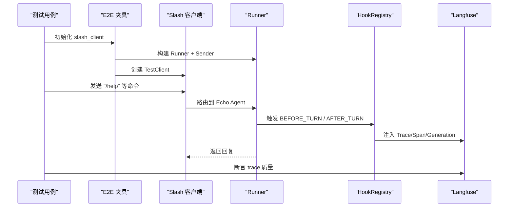
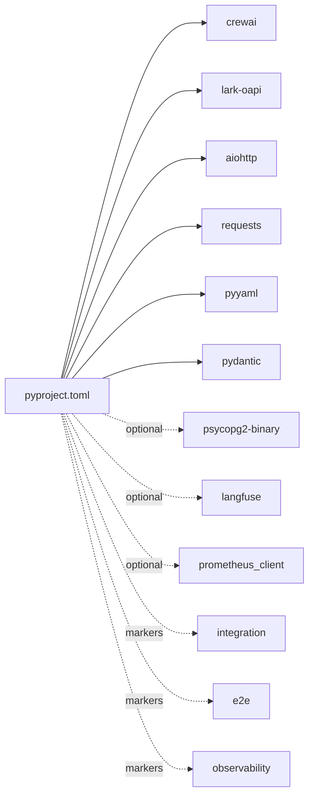

# SDK 验证报告

<cite>
**本文引用的文件**
- [sdk-verification-report.md](file://docs/sdk-verification-report.md)
- [verify_setup.py](file://verify_setup.py)
- [conftest.py](file://tests/conftest.py)
- [test_e2e_01_slash.py](file://tests/e2e/test_e2e_01_slash.py)
- [hook_yaml_samples.py](file://tests/fixtures/hook_yaml_samples.py)
- [test_hook_loader.py](file://tests/unit/hook_framework/test_hook_loader.py)
- [test_hook_registry.py](file://tests/unit/hook_framework/test_hook_registry.py)
- [test_hook_chain.py](file://tests/integration/test_hook_chain.py)
- [conftest.py](file://tests/e2e/conftest.py)
- [config.yaml.example](file://config.yaml.example)
- [pyproject.toml](file://pyproject.toml)
- [langfuse_trace.py](file://shared_hooks/langfuse_trace.py)
</cite>

## 目录
1. [引言](#引言)
2. [项目结构](#项目结构)
3. [核心组件](#核心组件)
4. [架构总览](#架构总览)
5. [详细组件分析](#详细组件分析)
6. [依赖分析](#依赖分析)
7. [性能考虑](#性能考虑)
8. [故障排查指南](#故障排查指南)
9. [结论](#结论)
10. [附录](#附录)

## 引言
本报告面向 XiaoPaw v2 的 SDK 验证，旨在系统化说明验证目的、范围、方法与测试用例，给出可复现的验证结果与性能指标，提供来自实际代码库的验证示例与测试数据，帮助读者正确解读验证报告并识别潜在问题，同时给出集成最佳实践与优化建议。

验证覆盖以下方面：
- SDK 假设与真实签名/行为的对比验证
- Hook 框架加载与注册、链式执行与守卫拒止流程
- E2E 场景与可观测性（Langfuse）验证
- 配置与环境变量校验
- 测试设计与断言策略

## 项目结构
XiaoPaw v2 采用模块化组织，围绕“Hook 框架 + LLM 引擎 + 技能工具 + 可观测性”构建。关键目录与职责概览：
- xiaopaw：核心业务模块（agents、api、config、hook_framework、memory、observability、session、skills、tools 等）
- shared_hooks：通用 Hook 实现（审计、成本、Langfuse、沙箱、权限、重试、回环检测等）
- tests：单元/集成/E2E 测试，含测试夹具与断言工具
- docs：设计文档与验证报告
- config.yaml.example：示例配置，包含 LLM、内存、会话、发送器、可观测性等参数
- pyproject.toml：依赖与测试标记定义

图表来源
- [pyproject.toml:1-63](file://pyproject.toml#L1-L63)
- [config.yaml.example:1-90](file://config.yaml.example#L1-L90)
- [langfuse_trace.py:1-800](file://shared_hooks/langfuse_trace.py#L1-L800)

章节来源
- [pyproject.toml:1-63](file://pyproject.toml#L1-L63)
- [config.yaml.example:1-90](file://config.yaml.example#L1-L90)

## 核心组件
- SDK 假设验证：基于真实 SDK 源码与签名，核对 v2 设计文档中的假设（如 lark-oapi ws.Client 参数、CrewAI 装饰器语义、BaseTool 异步执行路径、响应对象属性、psycopg 生态选择等），形成“真相清单”与修订建议。
- Hook 框架：包括 HookLoader（YAML 加载与依赖注入）、HookRegistry（注册与调度）、守卫拒止（dispatch_gate）与策略（AuditLogger、CostGuard、SandboxGuard、PermissionGate、LoopDetector、RetryTracker）。
- 可观测性：Langfuse Trace 树生成与批处理刷新，结合 ContextVar 与不可变元组栈保障线程安全与跨子线程传播。
- E2E 测试：覆盖 Slash 命令、会话生命周期、Langfuse 质量断言、Hook 链式执行与守卫拒止、安全审计与成本控制等。

章节来源
- [sdk-verification-report.md:1-173](file://docs/sdk-verification-report.md#L1-L173)
- [langfuse_trace.py:1-800](file://shared_hooks/langfuse_trace.py#L1-L800)

## 架构总览
下图展示 SDK 验证与 Hook 链路在端到端流程中的交互关系，以及 Langfuse 可观测性注入点。

图表来源
- [conftest.py:241-341](file://tests/e2e/conftest.py#L241-L341)
- [test_hook_chain.py:57-168](file://tests/integration/test_hook_chain.py#L57-L168)
- [langfuse_trace.py:297-710](file://shared_hooks/langfuse_trace.py#L297-L710)

## 详细组件分析

### 组件 A：SDK 假设与真相核对
本节依据真实 SDK 源码与签名，逐条比对 v2 设计文档中的假设，给出结论与修订建议。

- lark-oapi ws.Client
  - 真相：构造函数签名不含 encrypt_key 与 verification_token；WebSocket 长连鉴权由飞书服务端完成，客户端仅提供 app_id/app_secret/log_level/event_handler/domain/auto_reconnect。
  - 影响：v2 中“T3 验签加固”描述需重写，强调 WS 模式下由服务端鉴权，应用层仅做 event_id 去重；若需 HMAC 校验需改走 HTTP 回调路径。
  - 参考：[sdk-verification-report.md:9-31](file://docs/sdk-verification-report.md#L9-L31)

- CrewAI @before_llm_call
  - 真相：装饰器存在且支持裸用与绑定特定 agents；LLMCallHookContext.messages 可变、in-place 修改；context.llm 可能为字符串别名，无 context_window_size 属性。
  - 影响：v2 文档中“替换 messages 列表”的描述应改为“原地清空后追加/扩展”；context.llm 访问需防御式处理。
  - 参考：[sdk-verification-report.md:35-59](file://docs/sdk-verification-report.md#L35-L59)

- BaseTool _run 与 _arun
  - 真相：_run 为同步方法；_arun 为 async，未覆盖会抛 NotImplementedError；akickoff 通过 asyncio.to_thread 调用同步栈，当前线程无运行事件循环，asyncio.run(coro) 可正常工作。
  - 影响：v2 建议首选实现 _arun；_run 用 ThreadPoolExecutor 包一层 asyncio.run(coro)，避免直接裸调 asyncio.run。
  - 参考：[sdk-verification-report.md:62-78](file://docs/sdk-verification-report.md#L62-L78)

- 飞书限流错误码
  - 真相：SDK 源码未发现 99991663/72/71/99991400 等限流码；SDK 常量中无 Retry-After 与 X-Lark-Request-RateLimit-Reset。
  - 影响：v2 文档不应将这些码写死为白名单；建议基于“非 0 业务码 + 日志关键词（rate limit/限流/too many）”+ 退避策略。
  - 参考：[sdk-verification-report.md:81-97](file://docs/sdk-verification-report.md#L81-L97)

- psycopg 生态
  - 真相：本机仅安装 psycopg2-binary；psycopg_pool 属于 psycopg3 生态，与 psycopg2 不兼容。
  - 影响：v2 需二选一：①保持 psycopg2 + ThreadedConnectionPool + pgvector.psycopg2；②升级至 psycopg3（AsyncConnection/AsyncConnectionPool）。
  - 参考：[sdk-verification-report.md:100-120](file://docs/sdk-verification-report.md#L100-L120)

- lark-oapi Response 对象
  - 真相：属性名为 response.raw，非 raw_response；response.raw.status_code 为 HTTP 状态码；response.raw.headers 为字典，可取 Retry-After。
  - 影响：v2 中所有 .raw_response 必须改为 .raw。
  - 参考：[sdk-verification-report.md:123-156](file://docs/sdk-verification-report.md#L123-L156)

- 总结与修订清单
  - 设计文档受影响位置与必须修改项详见“真相报告”表格。
  - 参考：[sdk-verification-report.md:159-173](file://docs/sdk-verification-report.md#L159-L173)

章节来源
- [sdk-verification-report.md:1-173](file://docs/sdk-verification-report.md#L1-L173)

### 组件 B：Hook 框架加载与注册
HookLoader 支持：
- 从 hooks.yaml 加载处理器与策略
- 两层加载（全局与工作区）合并
- 依赖注入（deps），缺失依赖注入 None
- 路径穿越防护
- 策略类实例化与钩子绑定

HookRegistry 支持：
- 事件注册与顺序调度
- 守卫拒止（dispatch_gate）：遇到 GuardrailDeny 即停止后续处理器
- 异常处理：非 Guardrail 错误吞掉并继续，fail_closed 可切换为拒止策略

图表来源
- [test_hook_loader.py:1-287](file://tests/unit/hook_framework/test_hook_loader.py#L1-L287)
- [test_hook_registry.py:1-174](file://tests/unit/hook_framework/test_hook_registry.py#L1-L174)

章节来源
- [test_hook_loader.py:1-287](file://tests/unit/hook_framework/test_hook_loader.py#L1-L287)
- [test_hook_registry.py:1-174](file://tests/unit/hook_framework/test_hook_registry.py#L1-L174)
- [hook_yaml_samples.py:1-91](file://tests/fixtures/hook_yaml_samples.py#L1-L91)

### 组件 C：Langfuse 全链路追踪
LangfuseTrace 通过 ContextVar 与不可变元组栈维护 Trace 树，实现：
- 多轮对话同一棵树（trace_id = session_id）
- Generation 先写后更新（先创建，再根据消息历史补全输出）
- Span 栈管理父子关系（LIFO）
- 批量刷新（batch ingestion，chunk=50）

图表来源
- [langfuse_trace.py:297-710](file://shared_hooks/langfuse_trace.py#L297-L710)

章节来源
- [langfuse_trace.py:1-800](file://shared_hooks/langfuse_trace.py#L1-L800)

### 组件 D：E2E 验证与测试用例
- Slash 命令全流程（T0，无 LLM）：验证 /help、/status、/verbose、/new 等命令行为与会话状态变化。
- Langfuse 质量断言：trace 存在、根 Span 存在、source 元数据、树结构无孤儿节点、GENERATION 模型存在。
- Hook 链式执行：策略加载、守卫拒止、工具调用、重试与回环检测、审计日志落盘。
- 安全与成本：权限门禁拒止路径遍历攻击、成本守卫预算耗尽。

图表来源
- [test_e2e_01_slash.py:22-67](file://tests/e2e/test_e2e_01_slash.py#L22-L67)
- [conftest.py:241-341](file://tests/e2e/conftest.py#L241-L341)

章节来源
- [test_e2e_01_slash.py:1-67](file://tests/e2e/test_e2e_01_slash.py#L1-L67)
- [conftest.py:1-424](file://tests/e2e/conftest.py#L1-L424)

## 依赖分析
- 依赖来源与版本要求：crewai、lark-oapi、aiohttp、requests、pyyaml、pydantic 等。
- 可选依赖：psycopg2-binary、openai、croniter、filelock、prometheus_client、cachetools、langfuse。
- 测试标记：integration、llm_dependent、sandbox、sandbox_required、pgvector_required、security、observability、no_llm、e2e、full。

图表来源
- [pyproject.toml:1-63](file://pyproject.toml#L1-L63)

章节来源
- [pyproject.toml:1-63](file://pyproject.toml#L1-L63)

## 性能考虑
- Langfuse 批量刷新：每批 50 条事件，降低网络开销与延迟抖动。
- Trace 树结构：使用不可变元组栈与 ContextVar，避免线程共享导致的数据竞争，保障子线程 copy_context() 安全传播。
- Hook 链路：守卫拒止在首个拒止点停止后续处理器，减少无效计算。
- LLM 调用：Kickoff 在线程池中执行，避免阻塞事件循环；工具调用优先实现 _arun，必要时 _run 用线程池包装 asyncio.run。

章节来源
- [langfuse_trace.py:116-135](file://shared_hooks/langfuse_trace.py#L116-L135)
- [sdk-verification-report.md:58-78](file://docs/sdk-verification-report.md#L58-L78)

## 故障排查指南
- SDK 假设错误定位
  - ws.Client 参数：确认仅传 app_id/app_secret/log_level/event_handler/domain/auto_reconnect，删除 encrypt_key/verification_token。
  - CrewAI 装饰器：确保 @before_llm_call 绑定在 @CrewBase 类上；messages 必须 in-place 修改；llm 属性访问需防御式处理。
  - BaseTool 异步：_arun 优先；_run 用线程池包装 asyncio.run。
  - 飞书响应对象：使用 response.raw.status_code 与 response.raw.headers；避免使用 raw_response。
  - 限流判定：基于非 0 业务码 + 关键词匹配 + 退避，不绑定具体错误码。
  - 连接池：psycopg_pool 与 psycopg2 不兼容；二选一方案明确。
  - 参考：[sdk-verification-report.md:159-173](file://docs/sdk-verification-report.md#L159-L173)

- Hook 框架问题
  - 路径穿越：HookLoader 已内置防护，检查 hooks.yaml 中 handler 路径是否包含 ../。
  - 依赖缺失：deps 中引用的策略不存在时注入 None；可通过 summary() 检查已加载策略。
  - 守卫拒止：fail_closed 可切换为拒止策略；非 Guardrail 异常会被吞掉。
  - 参考：[test_hook_loader.py:76-84](file://tests/unit/hook_framework/test_hook_loader.py#L76-L84)、[test_hook_registry.py:119-144](file://tests/unit/hook_framework/test_hook_registry.py#L119-L144)

- E2E 与可观测性
  - Langfuse 可用性：通过 /api/public/health 检查；查询 trace 使用 /api/public/traces/{id}。
  - trace 质量断言：根 Span 名称、source 元数据、无孤儿节点、GENERATION 模型存在。
  - 参考：[conftest.py:216-229](file://tests/e2e/conftest.py#L216-L229)、[conftest.py:113-140](file://tests/e2e/conftest.py#L113-L140)

章节来源
- [sdk-verification-report.md:159-173](file://docs/sdk-verification-report.md#L159-L173)
- [test_hook_loader.py:76-84](file://tests/unit/hook_framework/test_hook_loader.py#L76-L84)
- [test_hook_registry.py:119-144](file://tests/unit/hook_framework/test_hook_registry.py#L119-L144)
- [conftest.py:113-140](file://tests/e2e/conftest.py#L113-L140)

## 结论
- SDK 假设层面：v2 设计文档至少 4 项确认错误，2 项部分错误，1 项表达不精确但结论正确；需按真相报告修订。
- Hook 框架：加载、注册、守卫拒止与策略注入能力完备，具备良好的安全性与可观测性。
- E2E 与可观测性：Slash 命令与 Langfuse 质量断言覆盖良好，可作为持续集成基线。
- 建议：在进入 Phase 1 编码前，优先修正 SDK 假设错误项，完善测试用例与断言策略，确保与真实 SDK 行为一致。

## 附录
- 配置示例：参考 config.yaml.example，关注 agent、memory、session、sender、observability、rate_limit、replay_cache、cron、cleanup、feature_flags 等关键项。
- 验证脚本：verify_setup.py 提供环境变量、配置文件、核心模块导入、LLM 配置与目录结构检查，可作为本地部署验证的起点。
- 测试标记：pytest.ini_options 中定义了丰富的标记，便于按场景选择性运行测试。

章节来源
- [config.yaml.example:1-90](file://config.yaml.example#L1-L90)
- [verify_setup.py:1-140](file://verify_setup.py#L1-L140)
- [pyproject.toml:40-55](file://pyproject.toml#L40-L55)