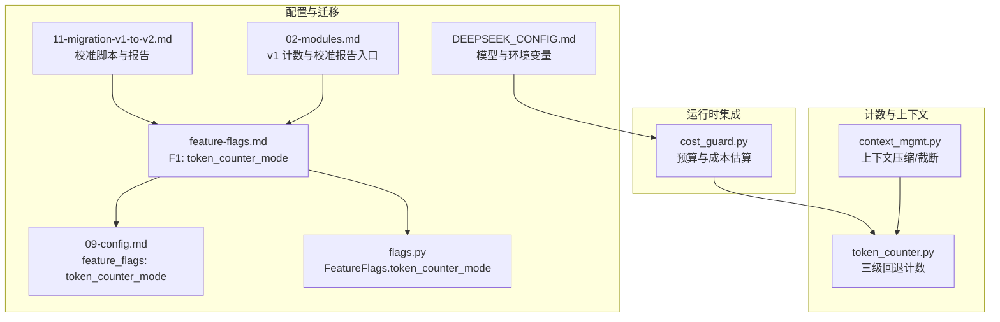
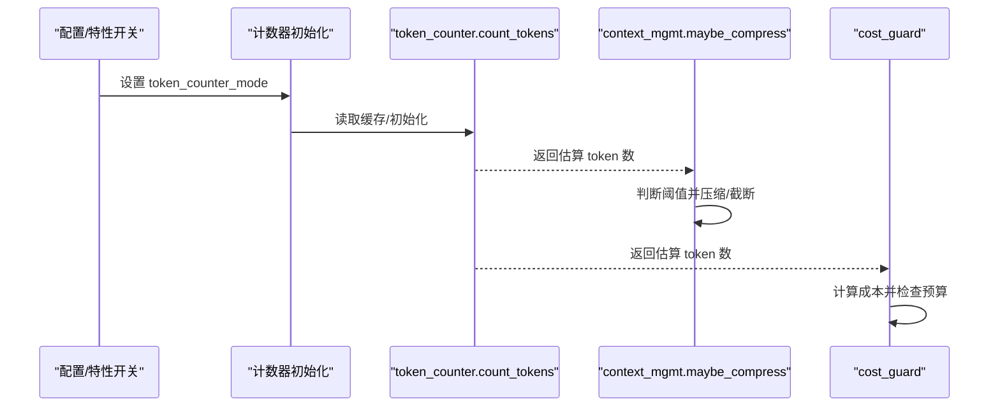
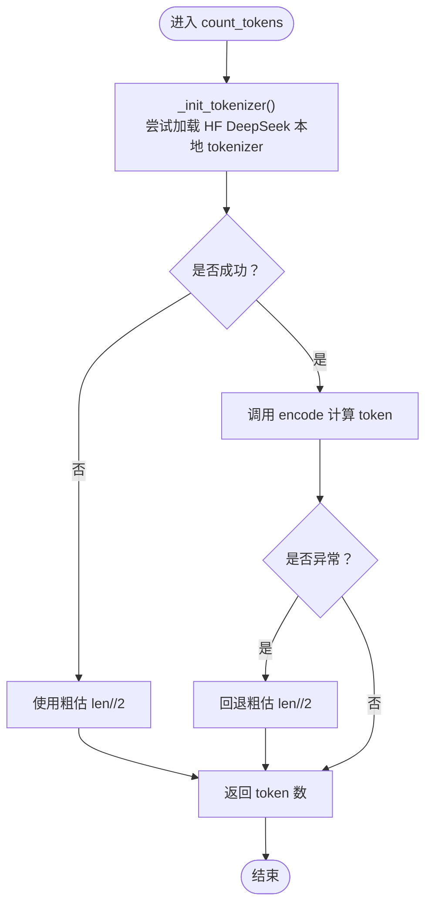
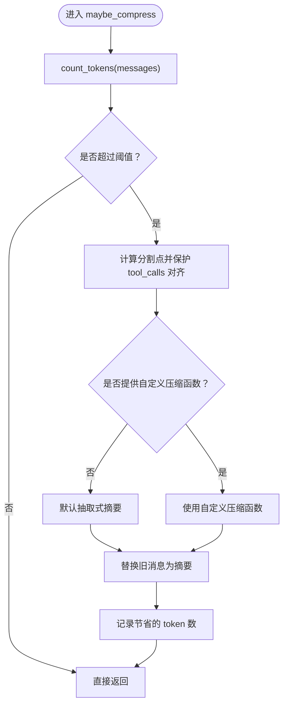
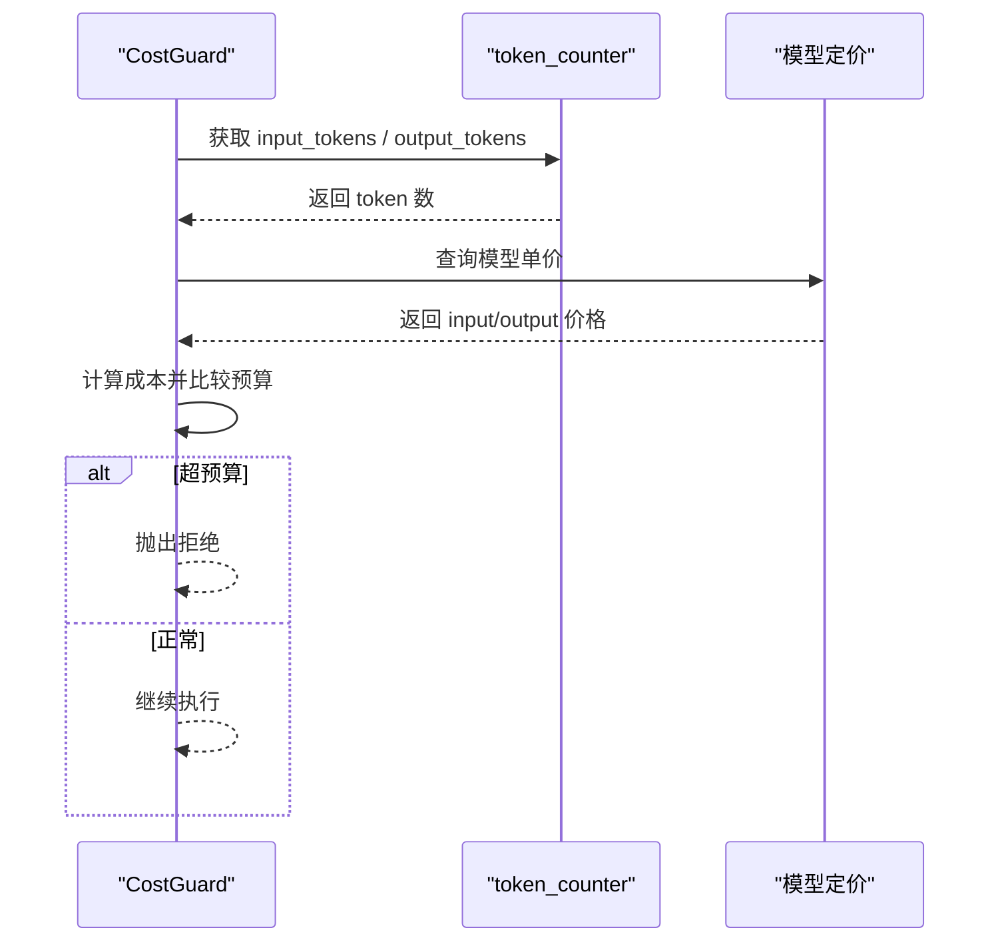
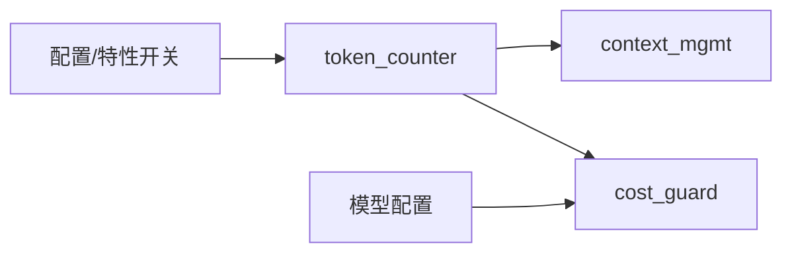

# Tokenizer 校准

<cite>
**本文引用的文件**   
- [token_counter.py](file://xiaopaw/memory/token_counter.py)
- [context_mgmt.py](file://xiaopaw/memory/context_mgmt.py)
- [cost_guard.py](file://shared_hooks/cost_guard.py)
- [feature-flags.md](file://docs/ssot/feature-flags.md)
- [09-config.md](file://docs/09-config.md)
- [11-migration-v1-to-v2.md](file://docs/11-migration-v1-to-v2.md)
- [02-modules.md](file://docs/02-modules.md)
- [flags.py](file://xiaopaw/config/flags.py)
- [DEEPSEEK_CONFIG.md](file://DEEPSEEK_CONFIG.md)
</cite>

## 目录
1. [简介](#简介)
2. [项目结构](#项目结构)
3. [核心组件](#核心组件)
4. [架构总览](#架构总览)
5. [详细组件分析](#详细组件分析)
6. [依赖分析](#依赖分析)
7. [性能考量](#性能考量)
8. [故障排查指南](#故障排查指南)
9. [结论](#结论)
10. [附录](#附录)

## 简介
本文件面向 XiaoPaw v2 的 Tokenizer 校准与验证，系统阐述以下内容：
- 校准目的与重要性：确保上下文长度估算准确，避免因过度压缩或预算误判导致的性能退化与成本失控。
- 校准流程与验证方法：基于样本集对比不同 Tokenizer 的偏差，确定最优模式并纳入 Feature Flag 管理。
- 具体步骤与参数调整：包括配置项、运行参数、回滚策略与热重载注意事项。
- 实战示例与性能测试：结合迁移文档中的校准命令与测试用例，给出可操作的实践路径。
- 场景化建议：针对不同模型与部署环境选择合适的校准模式。
- 故障诊断与解决方案：常见初始化失败、降级路径与性能异常的定位与修复。

## 项目结构
围绕 Tokenizer 校准的关键文件与模块如下：
- 计数模块：xiaopaw/memory/token_counter.py（v2 新增，三级回退）
- 上下文管理：xiaopaw/memory/context_mgmt.py（使用 token_counter 进行压缩阈值判断）
- 成本守卫：shared_hooks/cost_guard.py（依赖 token_counter 进行预算估算）
- 配置与特性开关：docs/ssot/feature-flags.md、docs/09-config.md、xiaopaw/config/flags.py
- 迁移与校准：docs/11-migration-v1-to-v2.md（包含校准脚本与报告生成）
- 模块说明：docs/02-modules.md（包含 v1 的计数实现与校准报告入口）
- 模型配置：DEEPSEEK_CONFIG.md（模型与环境变量）

图表来源
- [token_counter.py:1-44](file://xiaopaw/memory/token_counter.py#L1-L44)
- [context_mgmt.py:1-99](file://xiaopaw/memory/context_mgmt.py#L1-L99)
- [cost_guard.py:1-100](file://shared_hooks/cost_guard.py#L1-L100)
- [feature-flags.md:112-116](file://docs/ssot/feature-flags.md#L112-L116)
- [09-config.md:241-243](file://docs/09-config.md#L241-L243)
- [flags.py:9-22](file://xiaopaw/config/flags.py#L9-L22)
- [11-migration-v1-to-v2.md:100-112](file://docs/11-migration-v1-to-v2.md#L100-L112)
- [02-modules.md:895-942](file://docs/02-modules.md#L895-L942)
- [DEEPSEEK_CONFIG.md:1-149](file://DEEPSEEK_CONFIG.md#L1-L149)

章节来源
- [token_counter.py:1-44](file://xiaopaw/memory/token_counter.py#L1-L44)
- [context_mgmt.py:1-99](file://xiaopaw/memory/context_mgmt.py#L1-L99)
- [cost_guard.py:1-100](file://shared_hooks/cost_guard.py#L1-L100)
- [feature-flags.md:112-116](file://docs/ssot/feature-flags.md#L112-L116)
- [09-config.md:241-243](file://docs/09-config.md#L241-L243)
- [flags.py:9-22](file://xiaopaw/config/flags.py#L9-L22)
- [11-migration-v1-to-v2.md:100-112](file://docs/11-migration-v1-to-v2.md#L100-L112)
- [02-modules.md:895-942](file://docs/02-modules.md#L895-L942)
- [DEEPSEEK_CONFIG.md:1-149](file://DEEPSEEK_CONFIG.md#L1-L149)

## 核心组件
- Token 计数器（token_counter.py）
  - 三级回退：HuggingFace DeepSeek 本地 → 粗估（len//2）→ 缓存初始化
  - 作用：为上下文压缩与成本估算提供准确的 token 估算
- 上下文管理（context_mgmt.py）
  - 使用计数器估算总 token，按阈值触发压缩或截断
  - 保护 tool_calls 对齐，避免破坏对话结构
- 成本守卫（cost_guard.py）
  - 依赖 token_counter 获取输入/输出 token，按模型定价估算成本
  - 在回合结束与工具调用前双重检查预算，防止超支

章节来源
- [token_counter.py:15-43](file://xiaopaw/memory/token_counter.py#L15-L43)
- [context_mgmt.py:27-60](file://xiaopaw/memory/context_mgmt.py#L27-L60)
- [cost_guard.py:34-100](file://shared_hooks/cost_guard.py#L34-L100)

## 架构总览
Tokenizer 校准贯穿“配置—初始化—计数—决策—回退”的闭环：

图表来源
- [feature-flags.md:112-116](file://docs/ssot/feature-flags.md#L112-L116)
- [token_counter.py:15-43](file://xiaopaw/memory/token_counter.py#L15-L43)
- [context_mgmt.py:27-60](file://xiaopaw/memory/context_mgmt.py#L27-L60)
- [cost_guard.py:34-100](file://shared_hooks/cost_guard.py#L34-L100)

## 详细组件分析

### 组件一：Token 计数器（三级回退）
- 设计要点
  - 惰性初始化，避免 import 阶段网络 IO 导致崩溃
  - 优先使用 HuggingFace DeepSeek 本地 tokenizer，失败则回退至粗估
  - 使用缓存保持初始化结果稳定，降低重复初始化开销
- 关键行为
  - 输入：消息数组（JSON 序列化后编码）
  - 输出：token 数（失败时回退为 len//2）
- 适用场景
  - 上下文压缩阈值判断
  - 成本守卫预算估算

图表来源
- [token_counter.py:15-43](file://xiaopaw/memory/token_counter.py#L15-L43)

章节来源
- [token_counter.py:1-44](file://xiaopaw/memory/token_counter.py#L1-L44)

### 组件二：上下文管理（基于计数器的压缩与截断）
- 设计要点
  - 通过计数器估算总 token，超过阈值时进行压缩
  - 保护 tool_calls 对齐，避免破坏对话结构
  - 支持自定义压缩函数与摘要生成
- 关键行为
  - 输入：消息数组、模型限制、阈值、保留轮次
  - 输出：原地修改消息数组（压缩/截断）

图表来源
- [context_mgmt.py:27-60](file://xiaopaw/memory/context_mgmt.py#L27-L60)
- [token_counter.py:35-43](file://xiaopaw/memory/token_counter.py#L35-L43)

章节来源
- [context_mgmt.py:1-99](file://xiaopaw/memory/context_mgmt.py#L1-L99)

### 组件三：成本守卫（预算与成本估算）
- 设计要点
  - 依赖 token_counter 获取输入/输出 token
  - 支持模型定价映射与默认保守定价
  - 回合结束后与工具调用前双重检查预算
- 关键行为
  - 输入：预算（美元）、模型、token 计数器
  - 输出：累计 token 与成本，超预算抛出拒绝

图表来源
- [cost_guard.py:34-100](file://shared_hooks/cost_guard.py#L34-L100)
- [token_counter.py:35-43](file://xiaopaw/memory/token_counter.py#L35-L43)

章节来源
- [cost_guard.py:1-100](file://shared_hooks/cost_guard.py#L1-L100)

### 组件四：特性开关与配置
- 特性开关（F1）
  - 名称：token_counter_mode
  - 取值：hf_deepseek / rough
  - 默认：rough（教学 demo）
  - 影响：控制计数器初始化模式与热重载时的缓存清理
- 配置文件
  - config.yaml 中 feature_flags.token_counter_mode 指定默认模式
- 运行时热重载
  - 切换 token_counter_mode 会清空计数器缓存，避免旧模式残留

章节来源
- [feature-flags.md:112-116](file://docs/ssot/feature-flags.md#L112-L116)
- [09-config.md:241-243](file://docs/09-config.md#L241-L243)
- [flags.py:9-22](file://xiaopaw/config/flags.py#L9-L22)

### 组件五：迁移与校准（v1→v2）
- 校准脚本与报告
  - 使用 scripts/calibrate_tokenizer.py 对样本集进行校准，生成 docs/tokenizer-calibration.md
  - 命令示例：指定样本、模型与回退策略，输出校准报告
- 校准决策
  - 优先：dashscope.qwen-max（如可用）
  - 次选：HuggingFace DeepSeek 本地
  - 兜底：粗估 len//2
- v1 计数实现与校准报告入口
  - v1 提供了基于官方与 HF 的计数实现与测试用例入口

章节来源
- [11-migration-v1-to-v2.md:100-112](file://docs/11-migration-v1-to-v2.md#L100-L112)
- [02-modules.md:895-942](file://docs/02-modules.md#L895-L942)

## 依赖分析
- 组件耦合
  - context_mgmt 依赖 token_counter 进行估算
  - cost_guard 依赖 token_counter 进行 token 统计
  - 配置层通过特性开关控制计数器初始化模式
- 外部依赖
  - HuggingFace AutoTokenizer（本地加载 DeepSeek 模型）
  - 日志系统（记录初始化与降级信息）
- 潜在环路
  - 当前模块间为单向依赖，无循环导入风险

图表来源
- [token_counter.py:1-44](file://xiaopaw/memory/token_counter.py#L1-L44)
- [context_mgmt.py:1-99](file://xiaopaw/memory/context_mgmt.py#L1-L99)
- [cost_guard.py:1-100](file://shared_hooks/cost_guard.py#L1-L100)
- [DEEPSEEK_CONFIG.md:1-149](file://DEEPSEEK_CONFIG.md#L1-L149)

章节来源
- [token_counter.py:1-44](file://xiaopaw/memory/token_counter.py#L1-L44)
- [context_mgmt.py:1-99](file://xiaopaw/memory/context_mgmt.py#L1-L99)
- [cost_guard.py:1-100](file://shared_hooks/cost_guard.py#L1-L100)
- [DEEPSEEK_CONFIG.md:1-149](file://DEEPSEEK_CONFIG.md#L1-L149)

## 性能考量
- 初始化与缓存
  - 计数器采用缓存避免重复初始化，提升稳定性
  - 切换 token_counter_mode 会清空缓存，注意在高并发场景下的抖动
- 计算复杂度
  - count_tokens 对消息数组进行 JSON 序列化与编码，整体近似 O(n)（n 为消息条数）
- 压缩与截断
  - 压缩阈值与保留轮次直接影响上下文大小与推理延迟
- 成本估算
  - 成本计算为常数时间，但 token 数波动会影响预算判定频率

## 故障排查指南
- 计数器初始化失败
  - 现象：日志提示降级为粗估
  - 排查：确认本地模型权重是否存在、网络访问是否受限
  - 解决：安装本地模型权重或切换到粗估模式
- 压缩异常或对话结构被破坏
  - 现象：tool_calls 未对齐导致摘要缺失
  - 排查：检查分割点是否命中 user 边界
  - 解决：确保分割点向前扩展至完整 user 边界
- 预算误判或频繁拒绝
  - 现象：成本估算与实际偏差较大
  - 排查：核对模型定价、token 数统计与计数器模式
  - 解决：切换到更精确的计数器模式或调整预算
- 热重载后计数异常
  - 现象：切换 token_counter_mode 后计数不一致
  - 排查：确认缓存是否被清空
  - 解决：等待下次请求触发重新初始化

章节来源
- [token_counter.py:15-43](file://xiaopaw/memory/token_counter.py#L15-L43)
- [context_mgmt.py:27-60](file://xiaopaw/memory/context_mgmt.py#L27-L60)
- [cost_guard.py:34-100](file://shared_hooks/cost_guard.py#L34-L100)

## 结论
- Tokenizer 校准的核心在于：以样本驱动的对比实验确定最佳计数模式，并通过特性开关与配置文件进行可控的上线与回滚。
- XiaoPaw v2 的计数器采用三级回退策略，兼顾准确性与鲁棒性；上下文管理与成本守卫均依赖其提供的估算结果，形成闭环保障。
- 建议在生产环境中优先使用更精确的计数器模式，并结合监控与压测持续验证校准效果。

## 附录

### 校准步骤与参数调整指南
- 步骤
  1) 准备样本集（参考迁移文档中的样本路径）
  2) 运行校准脚本，生成校准报告
  3) 在配置中设置 token_counter_mode
  4) 部署并观察上下文压缩与成本估算表现
  5) 如需回滚，切换回粗估模式或恢复旧配置
- 参数
  - 样本文件：数据样本路径
  - 模型：目标模型名称
  - 回退策略：tiktoken, rough 等
  - 输出：校准报告路径

章节来源
- [11-migration-v1-to-v2.md:100-112](file://docs/11-migration-v1-to-v2.md#L100-L112)

### 场景化建议
- 高精度需求（生产）：优先使用 HF DeepSeek 本地计数器
- 教学/演示：可使用粗估模式以简化部署
- 模型切换：根据 DEEPSEEK_CONFIG.md 中的模型配置与环境变量进行统一管理

章节来源
- [DEEPSEEK_CONFIG.md:26-31](file://DEEPSEEK_CONFIG.md#L26-L31)
- [feature-flags.md:112-116](file://docs/ssot/feature-flags.md#L112-L116)