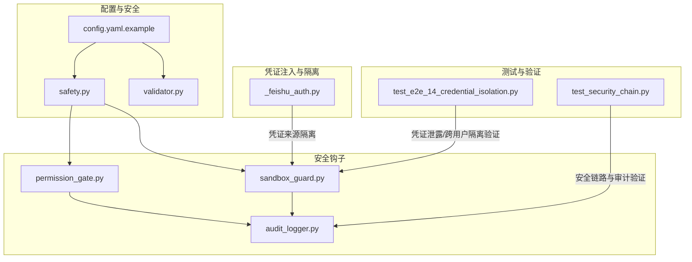
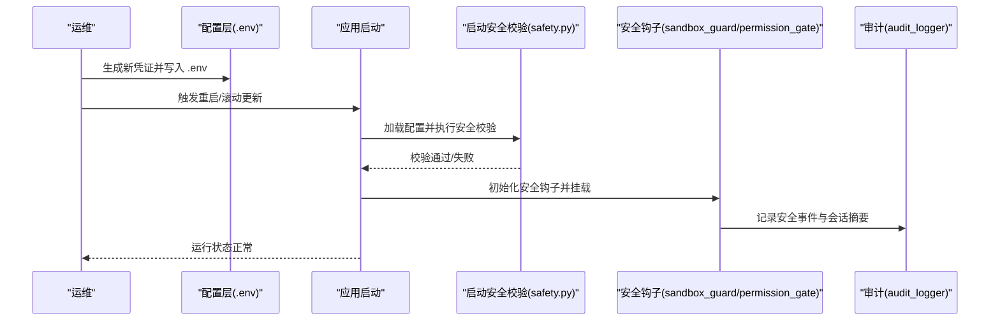
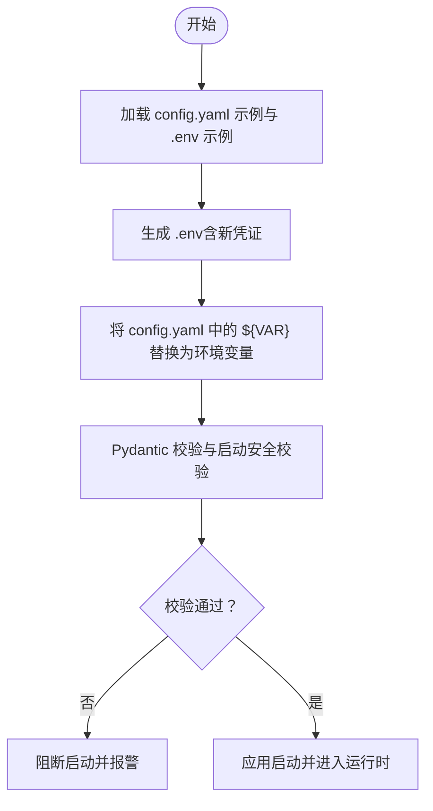
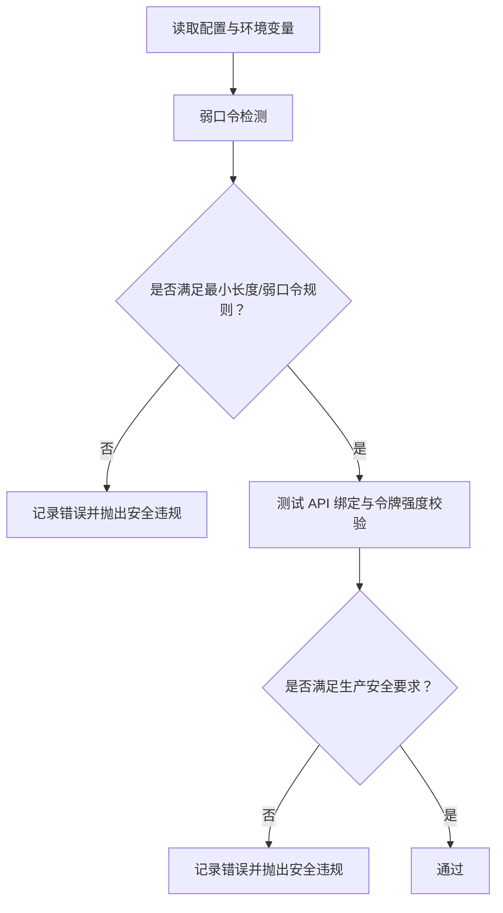
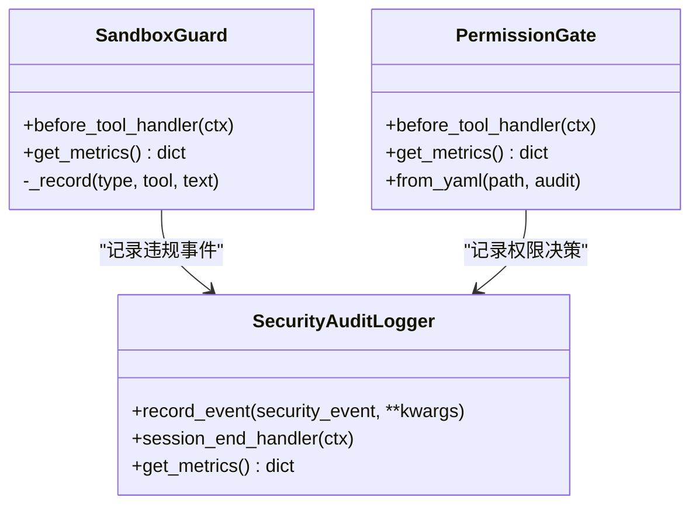
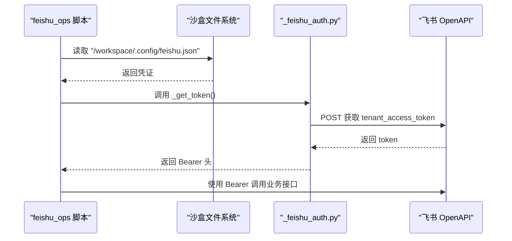
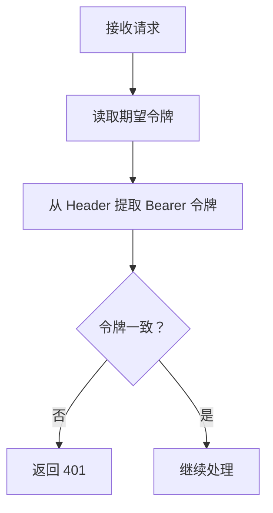
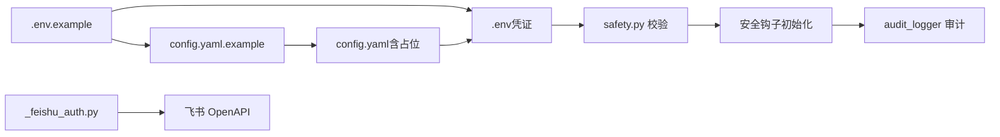

# 凭证轮换手册

<cite>
**本文引用的文件**
- [config.yaml.example](file://config.yaml.example)
- [09-config.md](file://docs/09-config.md)
- [12-hook-hardening.md](file://docs/12-hook-hardening.md)
- [_feishu_auth.py](file://xiaopaw/skills/feishu_ops/scripts/_feishu_auth.py)
- [safety.py](file://xiaopaw/config/safety.py)
- [validator.py](file://xiaopaw/config/validator.py)
- [permission_gate.py](file://shared_hooks/permission_gate.py)
- [audit_logger.py](file://shared_hooks/audit_logger.py)
- [sandbox_guard.py](file://shared_hooks/sandbox_guard.py)
- [test_e2e_14_credential_isolation.py](file://tests/e2e/test_e2e_14_credential_isolation.py)
- [test_security_chain.py](file://tests/integration/test_security_chain.py)
- [04-api.md](file://docs/04-api.md)
</cite>

## 目录
1. [简介](#简介)
2. [项目结构](#项目结构)
3. [核心组件](#核心组件)
4. [架构总览](#架构总览)
5. [详细组件分析](#详细组件分析)
6. [依赖分析](#依赖分析)
7. [性能考量](#性能考量)
8. [故障排除指南](#故障排除指南)
9. [结论](#结论)
10. [附录](#附录)

## 简介
本手册面向 XiaoPaw v2 的运维与安全部署团队，提供一套系统化的凭证轮换操作指南。内容涵盖轮换的重要性与安全考虑、轮换流程与最佳实践、具体步骤与时程安排、风险控制与回滚策略，以及轮换失败的应急响应与故障排除方法。为保证可操作性，手册结合仓库内现有配置、安全策略与测试用例，给出可落地的实施路径与参考脚本。

## 项目结构
围绕凭证轮换的关键目录与文件包括：
- 配置模板与示例：config.yaml.example、docs/09-config.md
- 安全与启动校验：xiaopaw/config/safety.py、xiaopaw/config/validator.py
- 安全钩子与审计：shared_hooks/permission_gate.py、shared_hooks/audit_logger.py、shared_hooks/sandbox_guard.py
- 飞书凭证注入与隔离：xiaopaw/skills/feishu_ops/scripts/_feishu_auth.py
- E2E 与集成测试：tests/e2e/test_e2e_14_credential_isolation.py、tests/integration/test_security_chain.py
- API 鉴权与绑定：docs/04-api.md

**图示来源**
- [config.yaml.example:1-90](file://config.yaml.example#L1-L90)
- [safety.py:1-48](file://xiaopaw/config/safety.py#L1-L48)
- [validator.py:1-122](file://xiaopaw/config/validator.py#L1-L122)
- [sandbox_guard.py:1-168](file://shared_hooks/sandbox_guard.py#L1-L168)
- [permission_gate.py:1-107](file://shared_hooks/permission_gate.py#L1-L107)
- [audit_logger.py:1-90](file://shared_hooks/audit_logger.py#L1-L90)
- [_feishu_auth.py:1-145](file://xiaopaw/skills/feishu_ops/scripts/_feishu_auth.py#L1-L145)
- [test_e2e_14_credential_isolation.py:41-81](file://tests/e2e/test_e2e_14_credential_isolation.py#L41-L81)
- [test_security_chain.py:70-181](file://tests/integration/test_security_chain.py#L70-L181)

**章节来源**
- [config.yaml.example:1-90](file://config.yaml.example#L1-L90)
- [09-config.md:35-876](file://docs/09-config.md#L35-L876)

## 核心组件
- 配置与凭证分层：v2 采用“模板/运维配置/凭证/命令行”四层，凭证层（.env）严格隔离，生命周期与轮换周期绑定。
- 启动安全校验：safety.py 对生产环境进行弱口令、测试 API 绑定与令牌强度等强制校验。
- 运行时安全策略：sandbox_guard 与 permission_gate 在 BEFORE_TOOL_CALL 阶段拦截危险输入与越权调用，并通过 audit_logger 统一审计。
- 凭证注入与隔离：飞书凭证通过沙盒路径文件读取，不暴露给 LLM；SecureToolWrapper 将凭证以运行时注入方式传递给工具，避免经由 LLM 上下文传播。

**章节来源**
- [09-config.md:35-876](file://docs/09-config.md#L35-L876)
- [safety.py:1-48](file://xiaopaw/config/safety.py#L1-L48)
- [sandbox_guard.py:1-168](file://shared_hooks/sandbox_guard.py#L1-L168)
- [permission_gate.py:1-107](file://shared_hooks/permission_gate.py#L1-L107)
- [audit_logger.py:1-90](file://shared_hooks/audit_logger.py#L1-L90)
- [12-hook-hardening.md:432-475](file://docs/12-hook-hardening.md#L432-L475)

## 架构总览
凭证轮换涉及“准备—注入—验证—切换—监控—回滚”的闭环流程。下图展示关键交互：

**图示来源**
- [safety.py:27-48](file://xiaopaw/config/safety.py#L27-L48)
- [sandbox_guard.py:93-168](file://shared_hooks/sandbox_guard.py#L93-L168)
- [permission_gate.py:32-107](file://shared_hooks/permission_gate.py#L32-L107)
- [audit_logger.py:30-90](file://shared_hooks/audit_logger.py#L30-L90)

## 详细组件分析

### 配置与凭证分层（L0–L2）
- L0 模板：config.yaml.example 与 .env.example 提供字段清单与占位，不包含真实值。
- L1 运维配置：config.yaml 仅包含非敏感参数，凭证通过环境变量注入。
- L2 凭证：.env 存放所有密钥，需受控访问与定期轮换。
- 加载顺序：命令行参数 > 环境变量 > config.yaml > 默认值；启动时执行安全校验。

**图示来源**
- [09-config.md:35-876](file://docs/09-config.md#L35-L876)
- [config.yaml.example:1-90](file://config.yaml.example#L1-L90)

**章节来源**
- [09-config.md:35-876](file://docs/09-config.md#L35-L876)
- [config.yaml.example:1-90](file://config.yaml.example#L1-L90)

### 启动安全校验（safety.py）
- 强制规则：
  - 生产环境禁止开启测试 API；
  - 测试 API 绑定地址必须为本地回环；
  - 关键令牌长度≥32；
  - 弱口令与占位符检测。
- 违规将导致启动失败，保障生产安全基线。

**图示来源**
- [safety.py:18-48](file://xiaopaw/config/safety.py#L18-L48)

**章节来源**
- [safety.py:1-48](file://xiaopaw/config/safety.py#L1-L48)

### 运行时安全策略（sandbox_guard / permission_gate / audit_logger）
- sandbox_guard：在 BEFORE_TOOL_CALL 阶段对路径穿越、危险命令、Shell 注入与 Prompt 注入进行硬编码正则拦截，fail closed。
- permission_gate：基于工具权限矩阵（deny > warn > allow）进行越权拦截，支持默认 deny 原则与策略来源追踪。
- audit_logger：统一审计输出，append-only JSONL，会话结束写入汇总，便于事后分析与合规审计。

**图示来源**
- [sandbox_guard.py:93-168](file://shared_hooks/sandbox_guard.py#L93-L168)
- [permission_gate.py:32-107](file://shared_hooks/permission_gate.py#L32-L107)
- [audit_logger.py:30-90](file://shared_hooks/audit_logger.py#L30-L90)

**章节来源**
- [sandbox_guard.py:1-168](file://shared_hooks/sandbox_guard.py#L1-L168)
- [permission_gate.py:1-107](file://shared_hooks/permission_gate.py#L1-L107)
- [audit_logger.py:1-90](file://shared_hooks/audit_logger.py#L1-L90)

### 凭证注入与隔离（飞书场景）
- 凭证文件位于沙盒路径 /workspace/.config/feishu.json，不暴露给 LLM；
- 通过 _feishu_auth.py 读取凭证并换取 tenant_access_token，再以 Bearer 方式调用飞书 API；
- E2E 测试覆盖凭证泄露与跨用户隔离，确保凭证实战安全。

**图示来源**
- [_feishu_auth.py:16-45](file://xiaopaw/skills/feishu_ops/scripts/_feishu_auth.py#L16-L45)

**章节来源**
- [_feishu_auth.py:1-145](file://xiaopaw/skills/feishu_ops/scripts/_feishu_auth.py#L1-L145)
- [test_e2e_14_credential_isolation.py:41-81](file://tests/e2e/test_e2e_14_credential_isolation.py#L41-L81)

### API 鉴权与绑定（TestAPI）
- TestAPI 仅在开发环境启用，生产环境禁用；
- 绑定地址必须为 127.0.0.1；
- 令牌长度≥32，使用 HMAC 比较进行鉴权。

**图示来源**
- [04-api.md:234-264](file://docs/04-api.md#L234-L264)

**章节来源**
- [04-api.md:234-264](file://docs/04-api.md#L234-L264)

## 依赖分析
- 配置加载链：config.yaml.example → config.yaml（含环境变量占位）→ .env（凭证）→ 启动校验 → 运行时安全钩子。
- 安全钩子耦合：sandbox_guard 与 permission_gate 共享 audit_logger，形成统一审计入口，降低耦合与重复。
- 飞书凭证链：沙盒文件 → _feishu_auth.py → OpenAPI，避免凭证进入 LLM 上下文。

**图示来源**
- [09-config.md:35-876](file://docs/09-config.md#L35-L876)
- [safety.py:27-48](file://xiaopaw/config/safety.py#L27-L48)
- [audit_logger.py:30-90](file://shared_hooks/audit_logger.py#L30-L90)
- [_feishu_auth.py:16-45](file://xiaopaw/skills/feishu_ops/scripts/_feishu_auth.py#L16-L45)

**章节来源**
- [09-config.md:35-876](file://docs/09-config.md#L35-L876)
- [safety.py:1-48](file://xiaopaw/config/safety.py#L1-L48)
- [audit_logger.py:1-90](file://shared_hooks/audit_logger.py#L1-L90)
- [_feishu_auth.py:1-145](file://xiaopaw/skills/feishu_ops/scripts/_feishu_auth.py#L1-L145)

## 性能考量
- 正则检测与输入归一化：sandbox_guard 对输入进行 NFKC 归一化与最多 3 轮 URL 解码，兼顾安全性与性能。
- 审计日志：append-only JSONL，避免频繁重写；会话结束写入汇总，便于巡检。
- 权限矩阵：permission_gate 使用字典查找与固定长度队列，避免长会话内存膨胀。

[本节为通用指导，不直接分析具体文件]

## 故障排除指南

### 启动失败（安全校验）
- 现象：启动时报错，提示生产安全违规。
- 排查：
  - 检查 .env 中令牌长度与强度；
  - 确认 config.yaml 未开启测试 API；
  - 确认测试 API 绑定地址为 127.0.0.1。
- 处置：修复后重新启动。

**章节来源**
- [safety.py:27-48](file://xiaopaw/config/safety.py#L27-L48)
- [04-api.md:234-264](file://docs/04-api.md#L234-L264)

### 凭证泄露/越权调用
- 现象：审计日志出现 sandbox 或 permission 相关事件。
- 排查：
  - 检查 audit_logger 输出与会话摘要；
  - 结合 permission_gate 的策略来源（explicit/default）定位问题。
- 处置：收紧权限矩阵或修复输入。

**章节来源**
- [audit_logger.py:50-70](file://shared_hooks/audit_logger.py#L50-L70)
- [permission_gate.py:57-94](file://shared_hooks/permission_gate.py#L57-L94)
- [test_security_chain.py:70-181](file://tests/integration/test_security_chain.py#L70-L181)

### 飞书凭证不可用
- 现象：飞书 API 返回错误或无法获取 token。
- 排查：
  - 检查沙盒路径 /workspace/.config/feishu.json 是否存在；
  - 核对凭证字段与有效期。
- 处置：补充/轮换凭证后重启服务。

**章节来源**
- [_feishu_auth.py:16-45](file://xiaopaw/skills/feishu_ops/scripts/_feishu_auth.py#L16-L45)

### 轮换中断与回滚
- 中断场景：新凭证尚未生效，旧凭证已失效。
- 回滚策略：
  - 保留旧 .env 与 config.yaml 的备份；
  - 通过版本控制系统快速恢复；
  - 临时启用测试 API（仅开发环境）以便快速验证。
- 风险控制：
  - 分阶段滚动更新，避免全量中断；
  - 预留备用凭证窗口期（例如双周轮换）。

[本节为通用指导，不直接分析具体文件]

## 结论
XiaoPaw v2 的凭证轮换应遵循“最小暴露、强校验、可审计、可回滚”的原则。通过配置分层与启动安全校验，结合运行时安全钩子与审计日志，可在生产环境中实现高可靠、低风险的轮换。配合 E2E 与集成测试，可有效验证凭证隔离与权限控制的实战效果。

[本节为总结，不直接分析具体文件]

## 附录

### 凭证轮换流程与最佳实践
- 准备阶段
  - 生成新密钥并写入 .env；
  - 更新 config.yaml 中的环境变量占位；
  - 运行启动安全校验，确保通过。
- 注入与验证
  - 启动应用，观察审计日志与指标；
  - 执行 E2E 与集成测试，验证凭证隔离与权限控制。
- 切换与监控
  - 滚动更新至新凭证；
  - 持续监控安全事件与会话摘要。
- 回滚
  - 若异常，立即回滚至旧 .env 与 config.yaml；
  - 保留审计证据以便复盘。

**章节来源**
- [09-config.md:35-876](file://docs/09-config.md#L35-L876)
- [safety.py:27-48](file://xiaopaw/config/safety.py#L27-L48)
- [test_e2e_14_credential_isolation.py:41-81](file://tests/e2e/test_e2e_14_credential_isolation.py#L41-L81)
- [test_security_chain.py:70-181](file://tests/integration/test_security_chain.py#L70-L181)

### 自动化脚本与参考
- 迁移与生成 .env 的脚本片段（v2.1）可用于凭证生成与配置迁移：
  - 参考路径：docs/09-config.md 中的“迁移脚本片段”。

**章节来源**
- [09-config.md:818-876](file://docs/09-config.md#L818-L876)