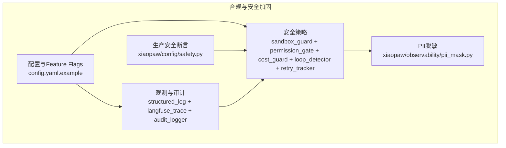
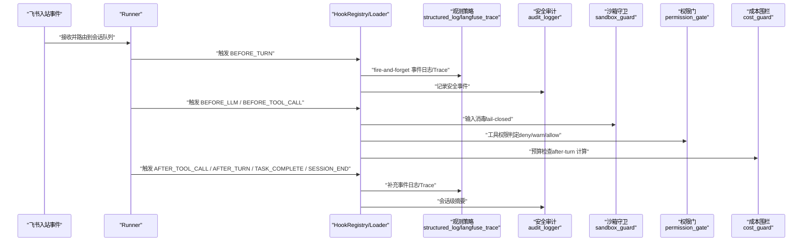
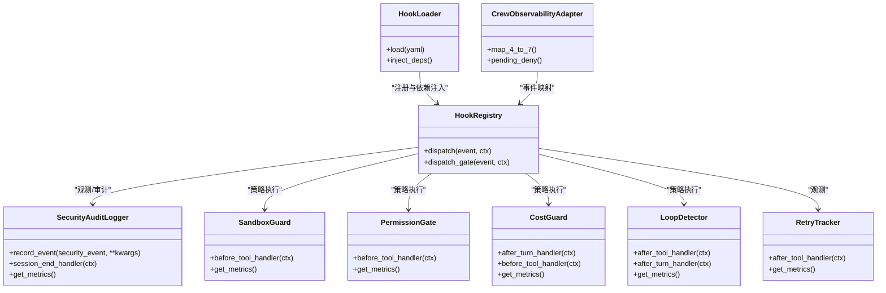
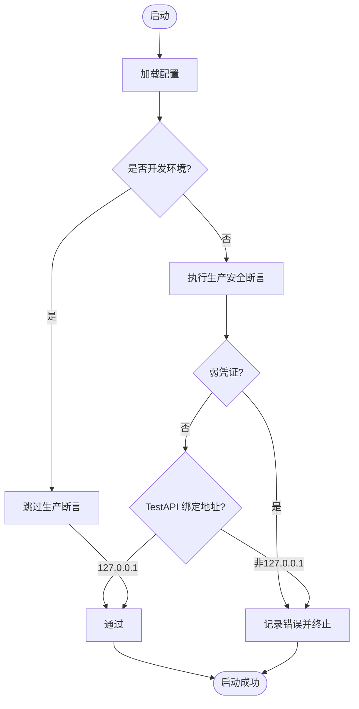
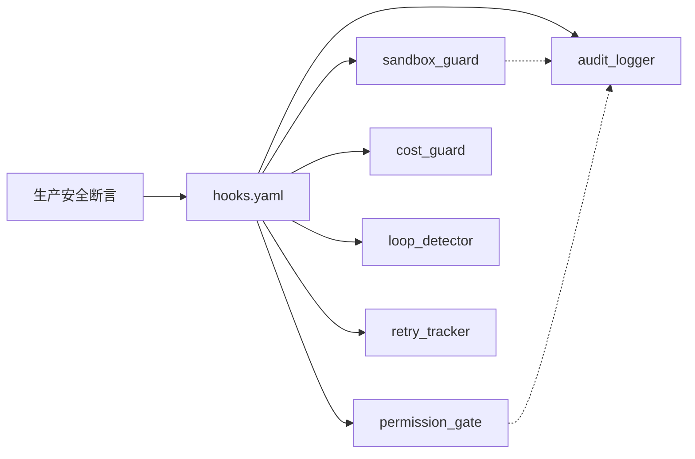

# 合规基线

<cite>
**本文引用的文件**
- [DESIGN.md](file://DESIGN.md)
- [config.yaml.example](file://config.yaml.example)
- [shared_hooks/hooks.yaml](file://shared_hooks/hooks.yaml)
- [shared_hooks/audit_logger.py](file://shared_hooks/audit_logger.py)
- [shared_hooks/sandbox_guard.py](file://shared_hooks/sandbox_guard.py)
- [xiaopaw/config/safety.py](file://xiaopaw/config/safety.py)
- [xiaopaw/observability/pii_mask.py](file://xiaopaw/observability/pii_mask.py)
- [tests/fixtures/security_policy_samples.py](file://tests/fixtures/security_policy_samples.py)
- [tests/fixtures/hook_yaml_samples.py](file://tests/fixtures/hook_yaml_samples.py)
</cite>

## 目录
1. [简介](#简介)
2. [项目结构](#项目结构)
3. [核心组件](#核心组件)
4. [架构总览](#架构总览)
5. [详细组件分析](#详细组件分析)
6. [依赖分析](#依赖分析)
7. [性能考量](#性能考量)
8. [故障排查指南](#故障排查指南)
9. [结论](#结论)
10. [附录](#附录)

## 简介
本文件面向 XiaoPaw v2 的合规基线，系统化阐述合规要求与标准、基线制定依据与覆盖范围，并提供可落地的检查清单、验证方法与审计记录示例。XiaoPaw v2 在生产加固版本中引入了“Hook 框架 + shared_hooks 加固层”，围绕“观测/可靠性/安全”三个维度构建横切能力，形成可配置、可测试、可审计的合规执行链路。

合规基线聚焦以下方面：
- PII 脱敏与数据最小化
- 数据本地化披露与跨境传输限制
- 日志留存与可追溯性
- 凭证安全与轮换流程
- 容器非 root 运行
- 安全策略的声明式配置与执行
- 事件驱动的审计与度量

## 项目结构
XiaoPaw v2 的合规相关能力主要分布在如下区域：
- 设计与配置：总体设计文档、配置样例、Feature Flags
- 观测与审计：结构化日志、Langfuse Trace、安全审计日志
- 安全策略：沙箱守卫、权限门、成本围栏、循环检测、重试追踪
- 运行时安全断言：生产部署安全断言
- 数据处理：PII 脱敏
- 测试夹具：安全策略与 Hook 配置样例

图表来源
- [DESIGN.md](file://DESIGN.md)
- [config.yaml.example](file://config.yaml.example)
- [shared_hooks/hooks.yaml](file://shared_hooks/hooks.yaml)
- [shared_hooks/audit_logger.py](file://shared_hooks/audit_logger.py)
- [shared_hooks/sandbox_guard.py](file://shared_hooks/sandbox_guard.py)
- [xiaopaw/config/safety.py](file://xiaopaw/config/safety.py)
- [xiaopaw/observability/pii_mask.py](file://xiaopaw/observability/pii_mask.py)

章节来源
- [DESIGN.md](file://DESIGN.md)
- [config.yaml.example](file://config.yaml.example)

## 核心组件
- Hook 框架与加固层
  - Hooks 事件：BEFORE_TURN / BEFORE_LLM / BEFORE_TOOL_CALL / AFTER_TOOL_CALL / AFTER_TURN / TASK_COMPLETE / SESSION_END
  - 观测层：structured_log、langfuse_trace（dispatch fire-and-forget）
  - 策略层：audit_logger、sandbox_guard、permission_gate、cost_guard、loop_detector、retry_tracker（dispatch_gate 可阻断）
- 生产安全断言：禁止弱凭证、禁止生产开启 TestAPI、限定 TestAPI 绑定地址
- PII 脱敏：手机号、邮箱、身份证号的正则掩码
- 配置与 Feature Flags：统一配置优先级、凭证分层、开关控制

章节来源
- [DESIGN.md](file://DESIGN.md)
- [shared_hooks/hooks.yaml](file://shared_hooks/hooks.yaml)
- [shared_hooks/audit_logger.py](file://shared_hooks/audit_logger.py)
- [shared_hooks/sandbox_guard.py](file://shared_hooks/sandbox_guard.py)
- [xiaopaw/config/safety.py](file://xiaopaw/config/safety.py)
- [xiaopaw/observability/pii_mask.py](file://xiaopaw/observability/pii_mask.py)

## 架构总览
合规执行链路由“事件驱动 + 策略层 + 审计与度量”构成，贯穿会话生命周期，确保在每个关键节点均具备可观测、可审计、可阻断的能力。

图表来源
- [DESIGN.md](file://DESIGN.md)
- [shared_hooks/hooks.yaml](file://shared_hooks/hooks.yaml)
- [shared_hooks/audit_logger.py](file://shared_hooks/audit_logger.py)
- [shared_hooks/sandbox_guard.py](file://shared_hooks/sandbox_guard.py)

## 详细组件分析

### 组件一：Hook 框架与加固层
- 事件与调度
  - hooks.yaml 定义事件到处理器的映射，观测层先于策略层执行，确保 deny 也能留痕
  - dispatch_gate 支持可阻断策略，fail-closed 行为保证安全优先
- 策略层
  - audit_logger：append-only JSONL，支持 SESSION_END 汇总
  - sandbox_guard：确定性输入消毒（路径穿越、危险命令、Shell 注入、Prompt 注入）
  - permission_gate：工具权限三级控制（deny > ask > allow），策略样例见测试夹具
  - cost_guard：成本围栏（默认 $1），after-turn 计算，before-tool-call 拦截
  - loop_detector：循环检测（阈值 3），MD5 双路径去重
  - retry_tracker：重试追踪（最大 5 次），纯观测不阻断

图表来源
- [shared_hooks/hooks.yaml](file://shared_hooks/hooks.yaml)
- [shared_hooks/audit_logger.py](file://shared_hooks/audit_logger.py)
- [shared_hooks/sandbox_guard.py](file://shared_hooks/sandbox_guard.py)

章节来源
- [shared_hooks/hooks.yaml](file://shared_hooks/hooks.yaml)
- [shared_hooks/audit_logger.py](file://shared_hooks/audit_logger.py)
- [shared_hooks/sandbox_guard.py](file://shared_hooks/sandbox_guard.py)
- [tests/fixtures/security_policy_samples.py](file://tests/fixtures/security_policy_samples.py)

### 组件二：生产安全断言
- 强制断言
  - 生产环境禁止弱凭证（长度、重复、占位符）
  - 禁止生产开启 TestAPI
  - TestAPI 绑定地址必须为 127.0.0.1
- 违规处理：记录错误并抛出安全违规异常，阻止启动

图表来源
- [xiaopaw/config/safety.py](file://xiaopaw/config/safety.py)

章节来源
- [xiaopaw/config/safety.py](file://xiaopaw/config/safety.py)

### 组件三：PII 脱敏
- 脱敏规则
  - 手机号：保留前 3 与后 4
  - 邮箱：掩码为 “***@***”
  - 身份证：保留前 6 与后 4
- 应用范围：所有 user_message 日志在落盘前进行正则掩码

章节来源
- [xiaopaw/observability/pii_mask.py](file://xiaopaw/observability/pii_mask.py)

### 组件四：配置与 Feature Flags
- 配置优先级：命令行参数 > 环境变量 > config.yaml > 示例模板
- 凭证分层：明文不入库；示例文件仅作键名清单；生产通过密钥管理注入
- Feature Flags：统一开关控制，配套指标 xiaopaw_feature_flag{name, enabled}

章节来源
- [config.yaml.example](file://config.yaml.example)
- [DESIGN.md](file://DESIGN.md)

## 依赖分析
- Hook 配置依赖
  - hooks.yaml 中 strategies 段首位必须为 audit_logger，否则依赖注入缺失会导致 fail-closed 时系统被拒
  - sandbox_guard 与 permission_gate 通过 deps 共享同一审计实例，确保事件集中
- 事件顺序
  - 观测 handler 在 dispatch_gate 之前执行，确保 deny 事件仍被记录
- 运行时安全
  - 生产断言前置，保障启动阶段即符合安全基线

图表来源
- [shared_hooks/hooks.yaml](file://shared_hooks/hooks.yaml)
- [shared_hooks/audit_logger.py](file://shared_hooks/audit_logger.py)
- [shared_hooks/sandbox_guard.py](file://shared_hooks/sandbox_guard.py)
- [xiaopaw/config/safety.py](file://xiaopaw/config/safety.py)

章节来源
- [shared_hooks/hooks.yaml](file://shared_hooks/hooks.yaml)
- [shared_hooks/audit_logger.py](file://shared_hooks/audit_logger.py)
- [shared_hooks/sandbox_guard.py](file://shared_hooks/sandbox_guard.py)
- [xiaopaw/config/safety.py](file://xiaopaw/config/safety.py)

## 性能考量
- 策略层采用 fire-and-forget 观测与可阻断策略分离，降低主链路延迟
- SandboxGuard 的输入预处理（NFKC 归一化、多轮 URL 解码）在性能与安全性之间取得平衡
- deque 限制内存中违规/事件数量，避免长期会话导致内存膨胀
- 重试追踪与循环检测提供纯观测能力，不阻断主流程

## 故障排查指南
- 启动被拒绝（安全断言）
  - 检查凭证长度与强度、是否使用占位符
  - 确认生产环境未开启 TestAPI，且绑定地址为 127.0.0.1
  - 参考：[xiaopaw/config/safety.py](file://xiaopaw/config/safety.py)
- Hook 注册顺序问题
  - 确认 strategies 段首位为 audit_logger，避免依赖注入缺失导致 fail-closed
  - 参考：[shared_hooks/hooks.yaml](file://shared_hooks/hooks.yaml)
- 审计日志未写入
  - 检查 SECURITY_AUDIT_FILE 环境变量或构造参数传入
  - 参考：[shared_hooks/audit_logger.py](file://shared_hooks/audit_logger.py)
- 输入被拦截（沙箱守卫）
  - 检查输入是否命中路径穿越、危险命令、Shell 注入或 Prompt 注入
  - 参考：[shared_hooks/sandbox_guard.py](file://shared_hooks/sandbox_guard.py)
- 权限策略误判
  - 检查策略 YAML 配置与工具名匹配，确认 default 与具体工具项
  - 参考：[tests/fixtures/security_policy_samples.py](file://tests/fixtures/security_policy_samples.py)
- Hook 配置无效
  - 检查 hooks.yaml 语法、模块导入路径、函数存在性
  - 参考：[tests/fixtures/hook_yaml_samples.py](file://tests/fixtures/hook_yaml_samples.py)

章节来源
- [xiaopaw/config/safety.py](file://xiaopaw/config/safety.py)
- [shared_hooks/hooks.yaml](file://shared_hooks/hooks.yaml)
- [shared_hooks/audit_logger.py](file://shared_hooks/audit_logger.py)
- [shared_hooks/sandbox_guard.py](file://shared_hooks/sandbox_guard.py)
- [tests/fixtures/security_policy_samples.py](file://tests/fixtures/security_policy_samples.py)
- [tests/fixtures/hook_yaml_samples.py](file://tests/fixtures/hook_yaml_samples.py)

## 结论
XiaoPaw v2 的合规基线通过“Hook 框架 + shared_hooks 加固层”实现了可观测、可审计、可阻断的闭环。结合生产安全断言、PII 脱敏、配置与 Feature Flags 管理，以及完善的测试夹具与事件样例，能够满足数据最小化、日志留存、凭证轮换、容器非 root 等合规要求。建议在生产部署前完成基线检查清单与验证流程，并持续通过指标与审计日志进行监督。

## 附录

### 合规基线检查清单（建议）
- 凭证与密钥
  - 是否使用强凭证（长度 ≥16、非重复、非占位符）
  - 是否通过密钥管理注入，未入库明文
  - 是否建立轮换 runbook（每 90 天 + 事件驱动 + 人员变动）
- 配置与 Feature Flags
  - 配置优先级是否符合要求
  - Feature Flags 是否按需开启，配套指标是否可用
- 安全策略
  - hooks.yaml 策略顺序是否正确（audit_logger 在首位）
  - sandbox_guard、permission_gate、cost_guard 是否按需启用
  - 审计日志是否落盘、是否支持会话级摘要
- 观测与审计
  - 结构化日志与 Langfuse Trace 是否启用
  - PII 脱敏是否生效（手机号/邮箱/身份证）
- 运行时安全
  - 生产断言是否通过
  - TestAPI 是否禁用（生产）
  - 容器是否以非 root 运行

### 合规验证方法
- 启动验证：执行生产安全断言，确保无弱凭证与不当配置
- Hook 验证：通过测试夹具验证 hooks.yaml 语法、依赖注入与事件映射
- 审计验证：检查 security_audit.jsonl 是否写入、会话摘要是否存在
- 安全策略验证：构造路径穿越、危险命令、Prompt 注入等输入，确认被拦截
- PII 脱敏验证：构造包含敏感信息的日志文本，确认掩码生效

### 审计记录示例（参考）
- 安全事件记录：包含时间戳、事件类型、工具名、输入预览
- 会话级摘要：包含会话 ID、总事件数、按类型统计
- 参考文件：[shared_hooks/audit_logger.py](file://shared_hooks/audit_logger.py)