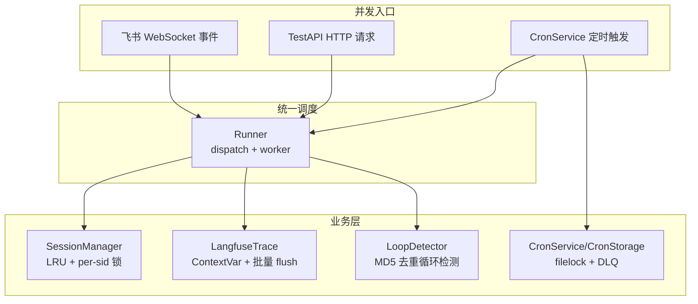
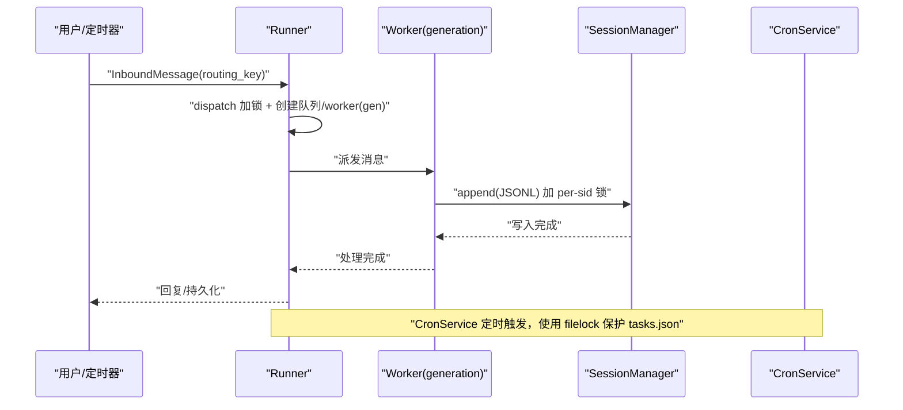
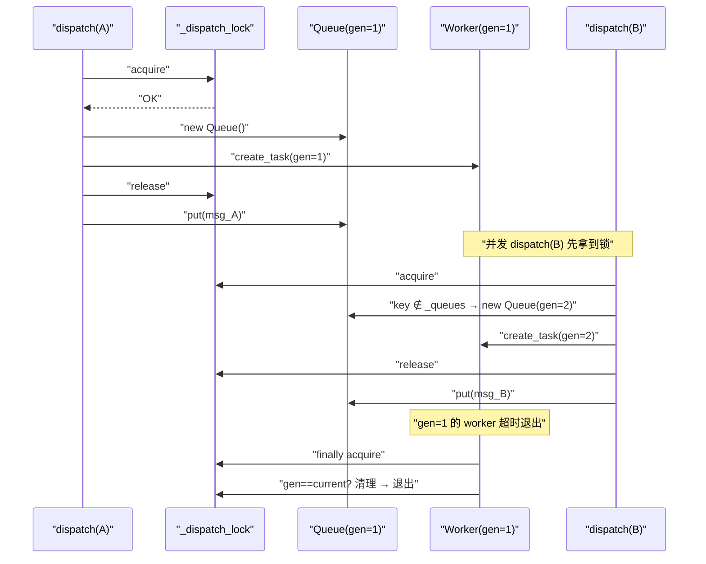
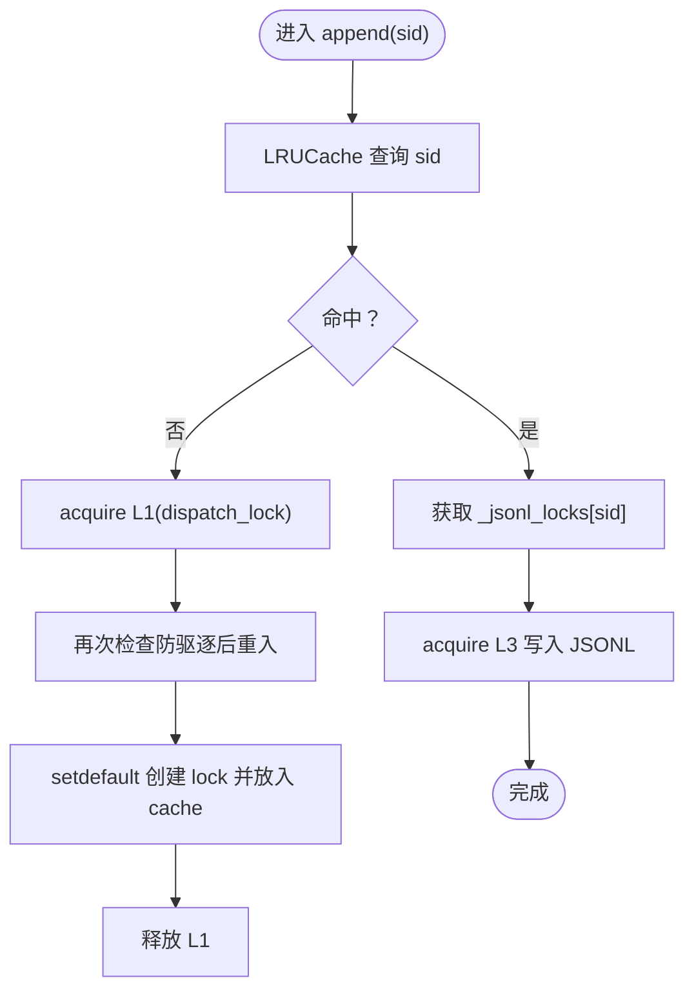
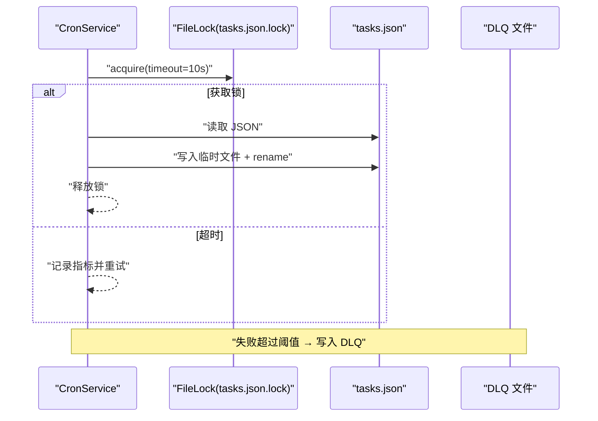
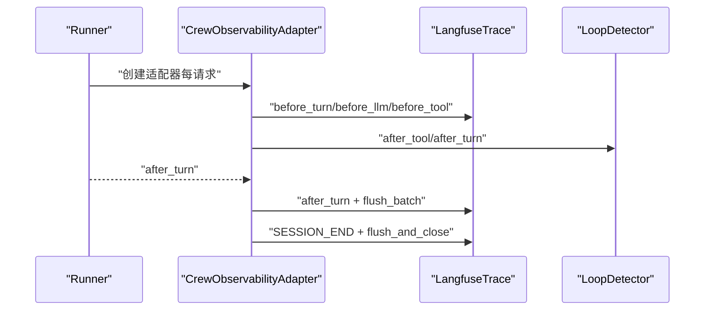
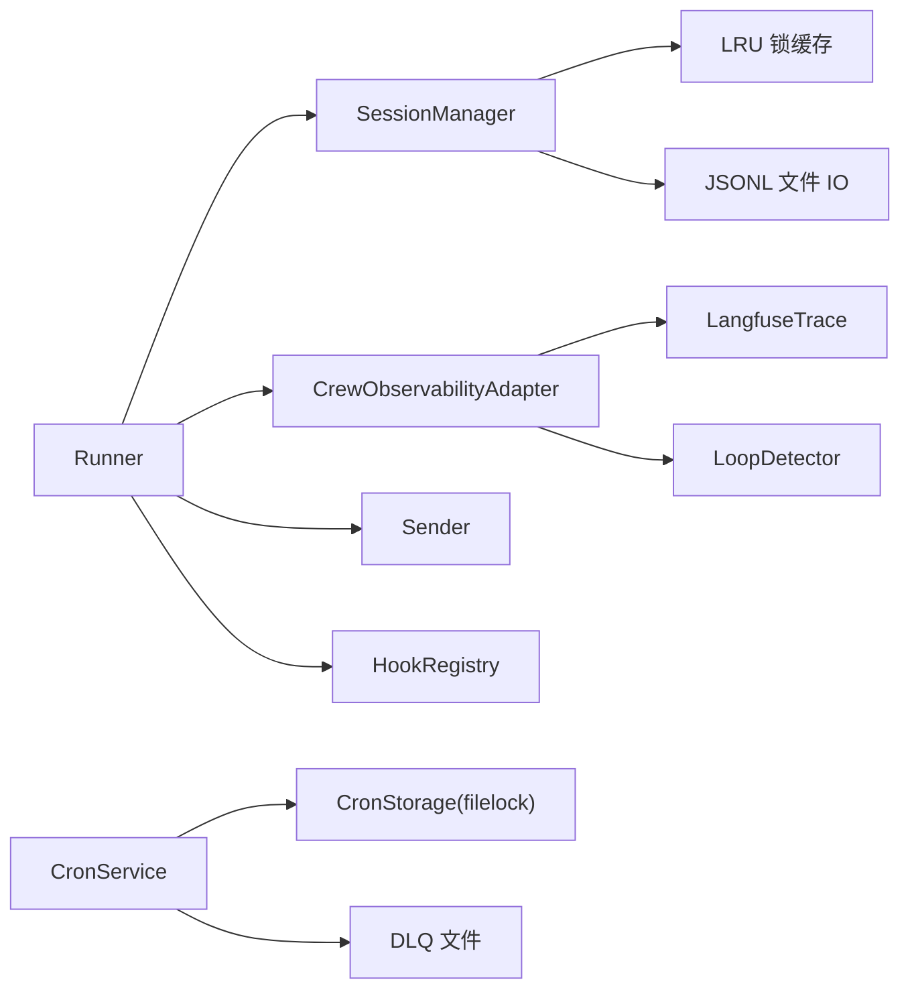

# 并发验证报告

<cite>
**本文引用的文件**
- [concurrency-verification-report.md](file://docs/concurrency-verification-report.md)
- [05-concurrency.md](file://docs/05-concurrency.md)
- [runner.py](file://xiaopaw/runner.py)
- [session/manager.py](file://xiaopaw/session/manager.py)
- [cron/service.py](file://xiaopaw/cron/service.py)
- [cron/storage.py](file://xiaopaw/cron/storage.py)
- [metrics.py](file://xiaopaw/observability/metrics.py)
- [metrics_server.py](file://xiaopaw/observability/metrics_server.py)
- [langfuse_trace.py](file://shared_hooks/langfuse_trace.py)
- [loop_detector.py](file://shared_hooks/loop_detector.py)
- [hooks.yaml](file://shared_hooks/hooks.yaml)
- [test_e2e_12_reliability.py](file://tests/e2e/test_e2e_12_reliability.py)
- [test_loop_detector.py](file://tests/unit/shared_hooks/test_loop_detector.py)
- [test_langfuse_init.py](file://tests/unit/shared_hooks/test_langfuse_init.py)
- [test_v3_fixes.py](file://tests/unit/test_v3_fixes.py)
</cite>

## 目录
1. [简介](#简介)
2. [项目结构](#项目结构)
3. [核心组件](#核心组件)
4. [架构总览](#架构总览)
5. [详细组件分析](#详细组件分析)
6. [依赖分析](#依赖分析)
7. [性能考量](#性能考量)
8. [故障排查指南](#故障排查指南)
9. [结论](#结论)
10. [附录](#附录)

## 简介
本报告面向 XiaoPaw v2 的并发验证，聚焦以下目标：
- 解释并发验证的重要性与方法
- 说明并发测试方法与工具
- 提供具体并发场景测试结果与性能数据
- 基于实际代码库展示并发示例与瓶颈分析
- 识别与解决并发问题的策略
- 总结并发优化最佳实践与监控建议

## 项目结构
XiaoPaw v2 采用“单事件循环、单进程、单节点”的 asyncio 应用模型，围绕路由键（routing_key）进行 per-rk 并行、per-sid 互斥的并发控制。核心并发路径包括：
- Runner：基于 routing_key 的队列与 worker 生命周期管理
- SessionManager：基于 LRU 的 per-session 锁缓存与 JSONL 写入
- CronService：定时任务调度与跨进程文件锁
- 观测与策略钩子：Langfuse 全链路追踪与循环检测、成本控制等

图表来源
- [runner.py:60-84](file://xiaopaw/runner.py#L60-L84)
- [session/manager.py:132-154](file://xiaopaw/session/manager.py#L132-L154)
- [cron/service.py:75-96](file://xiaopaw/cron/service.py#L75-L96)
- [langfuse_trace.py:28-57](file://shared_hooks/langfuse_trace.py#L28-L57)
- [loop_detector.py:28-36](file://shared_hooks/loop_detector.py#L28-L36)

章节来源
- [05-concurrency.md:44-70](file://docs/05-concurrency.md#L44-L70)
- [runner.py:60-84](file://xiaopaw/runner.py#L60-L84)

## 核心组件
- Runner：按 routing_key 维度串行化消息，使用队列与 worker 生命周期计数器（gen）避免竞态与资源泄漏
- SessionManager：LRU + per-session 锁缓存，结合两级锁（dispatch_lock + per-sid lock）防止驱逐后并发写入
- CronService：定时任务调度，结合 filelock 与 DLQ，保障跨进程一致性
- 观测与策略：LangfuseTrace 通过 ContextVar 与批量 flush 保证 trace 可见性；LoopDetector 基于 MD5 去重检测循环

章节来源
- [runner.py:33-59](file://xiaopaw/runner.py#L33-L59)
- [session/manager.py:38-47](file://xiaopaw/session/manager.py#L38-L47)
- [cron/service.py:19-31](file://xiaopaw/cron/service.py#L19-L31)
- [langfuse_trace.py:28-57](file://shared_hooks/langfuse_trace.py#L28-L57)
- [loop_detector.py:28-36](file://shared_hooks/loop_detector.py#L28-L36)

## 架构总览
XiaoPaw v2 的并发模型以“路由键串行 + 资源粒度互斥”为核心原则：
- 单事件循环：asyncio primitives 仅在主 loop 内有效
- 单进程：跨进程互斥通过 filelock 保护共享文件
- 单节点：多节点扩展通过 PG advisory lock 或外部消息队列

图表来源
- [runner.py:60-108](file://xiaopaw/runner.py#L60-L108)
- [session/manager.py:132-154](file://xiaopaw/session/manager.py#L132-L154)
- [cron/service.py:75-96](file://xiaopaw/cron/service.py#L75-L96)

## 详细组件分析

### Runner 并发队列与生命周期
- 设计目标：同一 routing_key 严格串行，不同 routing_key 并行；worker 空闲超时自动退出，gen 计数器避免清理竞态
- 关键点：
  - dispatch 加锁保护队列/worker/gen 的同时修改
  - worker 使用 wait_for + 超时退出，finally 中按 gen 清理
  - 队列满时拒绝新消息并记录告警
- 竞态修复：v1 存在“worker 未完全退出即清理”的竞态，v2 引入 gen 计数器，确保仅清理对应代的队列与 worker

图表来源
- [runner.py:60-108](file://xiaopaw/runner.py#L60-L108)

章节来源
- [runner.py:60-108](file://xiaopaw/runner.py#L60-L108)
- [05-concurrency.md:104-177](file://docs/05-concurrency.md#L104-L177)

### SessionManager 并发锁模型
- 问题背景：v1 的无界 dict 会导致长期运行 OOM；LRU 虽可防 OOM，但“check + setdefault + get”非原子，驱逐后并发会创建双锁
- v2 方案：两级锁
  - L1：dispatch_lock 保护“check + create + get”
  - L3：per-session lock 保护 JSONL 写入
- LRU 上限：默认 1000，峰值活跃会话数需小于 1000，否则会出现并发写入风险

图表来源
- [session/manager.py:132-154](file://xiaopaw/session/manager.py#L132-L154)

章节来源
- [session/manager.py:38-47](file://xiaopaw/session/manager.py#L38-L47)
- [session/manager.py:132-154](file://xiaopaw/session/manager.py#L132-L154)
- [05-concurrency.md:339-400](file://docs/05-concurrency.md#L339-L400)

### CronService 跨进程锁与 DLQ
- 跨进程场景：主进程 CronService 与沙盒进程中的 scheduler_mgr 可能同时写 tasks.json
- v2 方案：filelock + write-then-rename；失败时记录指标并重试
- DLQ：超过最大重试次数的任务写入死信队列，避免无限重试

图表来源
- [cron/storage.py:582-596](file://xiaopaw/cron/storage.py#L582-L596)
- [cron/service.py:75-96](file://xiaopaw/cron/service.py#L75-L96)

章节来源
- [cron/service.py:19-31](file://xiaopaw/cron/service.py#L19-L31)
- [cron/storage.py:582-596](file://xiaopaw/cron/storage.py#L582-L596)
- [05-concurrency.md:566-642](file://docs/05-concurrency.md#L566-L642)

### 观测与策略：LangfuseTrace 与 LoopDetector
- LangfuseTrace：通过 ContextVar 与 copy_context 保证 trace 在子线程可见；批量 flush 保证可见性
- LoopDetector：基于 MD5 前缀去重检测循环，支持工具维度与对话维度，阈值默认 3

图表来源
- [runner.py:109-281](file://xiaopaw/runner.py#L109-L281)
- [langfuse_trace.py:297-710](file://shared_hooks/langfuse_trace.py#L297-L710)
- [loop_detector.py:38-72](file://shared_hooks/loop_detector.py#L38-L72)
- [hooks.yaml:5-25](file://shared_hooks/hooks.yaml#L5-L25)

章节来源
- [langfuse_trace.py:28-57](file://shared_hooks/langfuse_trace.py#L28-L57)
- [loop_detector.py:28-36](file://shared_hooks/loop_detector.py#L28-L36)
- [hooks.yaml:5-25](file://shared_hooks/hooks.yaml#L5-L25)

## 依赖分析
- Runner 依赖 SessionManager、Sender、HookRegistry；通过 ContextVar 传递 trace_id 与适配器
- SessionManager 依赖 asyncio.Lock 与 LRU 缓存；append 与 load_history 分别在事件循环与线程池执行
- CronService 依赖 CronStorage 与 filelock；DLQ 仅写入，无需锁
- 观测与策略通过 hooks.yaml 组织，遵循“观测 fire-and-forget、策略可阻断”的顺序

图表来源
- [runner.py:33-59](file://xiaopaw/runner.py#L33-L59)
- [session/manager.py:38-47](file://xiaopaw/session/manager.py#L38-L47)
- [cron/service.py:19-31](file://xiaopaw/cron/service.py#L19-L31)
- [langfuse_trace.py:28-57](file://shared_hooks/langfuse_trace.py#L28-L57)
- [loop_detector.py:28-36](file://shared_hooks/loop_detector.py#L28-L36)

章节来源
- [runner.py:33-59](file://xiaopaw/runner.py#L33-L59)
- [session/manager.py:38-47](file://xiaopaw/session/manager.py#L38-L47)
- [cron/service.py:19-31](file://xiaopaw/cron/service.py#L19-L31)
- [hooks.yaml:5-25](file://shared_hooks/hooks.yaml#L5-L25)

## 性能考量
- 事件循环与阻塞 IO：使用 asyncio.to_thread 将阻塞 IO 放在线程池，避免阻塞事件循环
- 线程池与 ContextVar：to_thread 从 Python 3.9 起自动 copy_context，run_in_executor 任何版本不 copy_context
- LRU 上限与内存：LRU 上限 1000，峰值活跃会话数需小于 1000，否则会出现并发写入风险
- 执行器关闭：gather + wait_for 取消仅对 Task 生效，底层线程同步任务不可取消，需使用公开 async API

章节来源
- [05-concurrency.md:423-431](file://docs/05-concurrency.md#L423-L431)
- [session/manager.py:111-130](file://xiaopaw/session/manager.py#L111-L130)
- [runner.py:318-334](file://xiaopaw/runner.py#L318-L334)

## 故障排查指南
- LRU 驱逐后并发写入：出现双锁并存导致 JSONL 交叉写入
  - 现象：并发 append 同 sid 导致互斥失效
  - 处理：确保 maxsize > 峰值活跃会话数；必要时调大配置
- run_in_executor 与 ContextVar：跨线程 ContextVar 未传播
  - 现象：线程池中 trace_id 为空
  - 处理：使用 to_thread 或在线程中显式 copy_context.run
- 线程池同步阻塞任务无法取消：executor.shutdown(wait=True) 导致阻塞
  - 现象：进程退出时僵尸线程
  - 处理：使用公开 async API 替代私有属性；记录指标以便 SRE 观察
- Cron 跨进程锁失败：tasks.json 被半写损坏
  - 现象：JSONDecodeError 或数据损坏
  - 处理：捕获 Timeout 并重试；DLQ 记录失败任务

章节来源
- [concurrency-verification-report.md:6-77](file://docs/concurrency-verification-report.md#L6-L77)
- [05-concurrency.md:497-530](file://docs/05-concurrency.md#L497-L530)
- [cron/storage.py:582-596](file://xiaopaw/cron/storage.py#L582-L596)

## 结论
XiaoPaw v2 的并发模型通过“路由键串行 + 资源粒度互斥 + 跨进程文件锁 + 观测与策略钩子”实现了高可靠与可观测性。关键改进包括：
- Runner 的 gen 计数器避免 worker 清理竞态
- SessionManager 的两级锁与 LRU 防护并发写入
- CronService 的 filelock 与 DLQ 保障跨进程一致性
- LangfuseTrace 的 ContextVar 与批量 flush 提升 trace 可见性
- LoopDetector 的 MD5 去重检测循环

建议在生产环境中：
- 监控 LRU 使用率与并发写入指标
- 使用 to_thread 处理阻塞 IO
- 采用公开 async API 关闭线程池
- 对跨节点场景考虑 PG advisory lock

## 附录

### 并发测试方法与工具
- E2E 测试：覆盖循环检测与成本控制
  - [test_e2e_12_reliability.py:24-50](file://tests/e2e/test_e2e_12_reliability.py#L24-L50)
- 单元测试：LoopDetector 行为验证
  - [test_loop_detector.py:28-84](file://tests/unit/shared_hooks/test_loop_detector.py#L28-L84)
- 初始化测试：Langfuse 客户端初始化警告
  - [test_langfuse_init.py:11-38](file://tests/unit/shared_hooks/test_langfuse_init.py#L11-L38)
- v3 设计修复：钩子事件与工具输入规范化
  - [test_v3_fixes.py:44-112](file://tests/unit/test_v3_fixes.py#L44-L112)

章节来源
- [test_e2e_12_reliability.py:24-50](file://tests/e2e/test_e2e_12_reliability.py#L24-L50)
- [test_loop_detector.py:28-84](file://tests/unit/shared_hooks/test_loop_detector.py#L28-L84)
- [test_langfuse_init.py:11-38](file://tests/unit/shared_hooks/test_langfuse_init.py#L11-L38)
- [test_v3_fixes.py:44-112](file://tests/unit/test_v3_fixes.py#L44-L112)

### 监控与指标
- Prometheus 指标定义与导出服务
  - [metrics.py:8-64](file://xiaopaw/observability/metrics.py#L8-L64)
  - [metrics_server.py:18-54](file://xiaopaw/observability/metrics_server.py#L18-L54)

章节来源
- [metrics.py:8-64](file://xiaopaw/observability/metrics.py#L8-L64)
- [metrics_server.py:18-54](file://xiaopaw/observability/metrics_server.py#L18-L54)