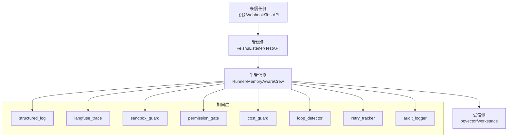
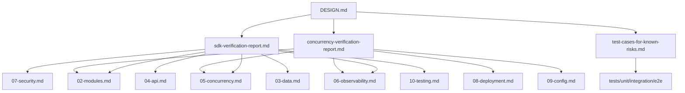

# 附录

<cite>
**本文引用的文件**   
- [DESIGN.md](file://DESIGN.md)
- [docs/sdk-verification-report.md](file://docs/sdk-verification-report.md)
- [docs/concurrency-verification-report.md](file://docs/concurrency-verification-report.md)
- [docs/test-cases-for-known-risks.md](file://docs/test-cases-for-known-risks.md)
- [docs/01-architecture.md](file://docs/01-architecture.md)
- [docs/02-modules.md](file://docs/02-modules.md)
- [docs/05-concurrency.md](file://docs/05-concurrency.md)
- [docs/06-observability.md](file://docs/06-observability.md)
- [docs/07-security.md](file://docs/07-security.md)
- [docs/08-deployment.md](file://docs/08-deployment.md)
- [docs/09-config.md](file://docs/09-config.md)
- [docs/10-testing.md](file://docs/10-testing.md)
- [docs/12-hook-hardening.md](file://docs/12-hook-hardening.md)
- [docs/13-test-design-hook-hardening.md](file://docs/13-test-design-hook-hardening.md)
- [docs/14-e2e-test-design.md](file://docs/14-e2e-test-design.md)
- [docs/15-e2e-fix-structured-log-and-timing.md](file://docs/15-e2e-fix-structured-log-and-timing.md)
- [docs/langfuse-trace-fix-design.md](file://docs/langfuse-trace-fix-design.md)
- [docs/e2e-05-search-regression-report.md](file://docs/e2e-05-search-regression-report.md)
- [docs/e2e-05-langfuse-trace-deep-analysis.md](file://docs/e2e-05-langfuse-trace-deep-analysis.md)
- [DEEPSEEK_CONFIG.md](file://DEEPSEEK_CONFIG.md)
</cite>

## 目录
1. [简介](#简介)
2. [项目结构](#项目结构)
3. [核心组件](#核心组件)
4. [架构总览](#架构总览)
5. [详细组件分析](#详细组件分析)
6. [依赖关系分析](#依赖关系分析)
7. [性能考量](#性能考量)
8. [故障排除指南](#故障排除指南)
9. [结论](#结论)
10. [附录](#附录)

## 简介
本附录面向 XiaoPaw v2 的 Phase 0 验证与上线准备，系统性整理以下辅助材料与配套流程：
- Phase 0 清单：上线前必须完成的检查项与验证步骤
- Tokenizer 校准：基于实际代码与测试的 Token 计数策略与校准依据
- 合规基线：数据本地化、PII 脱敏、日志留存、凭证轮换等合规要求
- 凭证轮换手册：轮换策略、触发条件、操作步骤与回滚预案
- SDK 验证报告：lark-oapi/CrewAI/psycopg/飞书错误码等关键 SDK 行为真相
- 并发验证报告：cachetools/LRU/ContextVar/Executor/Shutdown/跨 Loop 等并发真相
- 已知风险测试用例：覆盖 P0/P1/P2/P3 风险的契约测试清单与实施指引

上述材料共同构成 XiaoPaw v2 的“真相清单”，用于在 Phase 0 与后续迭代中消除假设、固化正确实现，并通过测试与文档形成可追溯的 SSOT。

## 项目结构
附录相关产出主要分布在 docs/ 与 DESIGN.md 中，形成“设计文档 + 专题报告 + 测试用例”的闭环：
- 设计总纲：DESIGN.md 提供顶层导航与交叉索引，明确各专题定位与影响面
- 专题报告：SDK/并发/已知风险测试用例等以独立文档形式沉淀
- 专题文档：01-09、12-15 等文档与附录相互引用，形成权威来源
- 测试用例：test-cases-for-known-risks.md 与 tests/ 单元/集成/E2E 测试共同构成质量门

```mermaid
graph TB
A["DESIGN.md<br/>设计总纲"] --> B["docs/sdk-verification-report.md<br/>SDK 真相报告"]
A --> C["docs/concurrency-verification-report.md<br/>并发真相报告"]
A --> D["docs/test-cases-for-known-risks.md<br/>已知风险测试用例"]
A --> E["docs/01-architecture.md<br/>架构"]
A --> F["docs/02-modules.md<br/>模块"]
A --> G["docs/05-concurrency.md<br/>并发"]
A --> H["docs/06-observability.md<br/>可观测"]
A --> I["docs/07-security.md<br/>安全"]
A --> J["docs/08-deployment.md<br/>部署"]
A --> K["docs/09-config.md<br/>配置"]
A --> L["docs/10-testing.md<br/>测试"]
A --> M["docs/12-hook-hardening.md<br/>Hook 加固"]
A --> N["docs/13-test-design-hook-hardening.md<br/>加固测试设计"]
A --> O["docs/14-e2e-test-design.md<br/>E2E 设计"]
A --> P["docs/15-e2e-fix-structured-log-and-timing.md<br/>E2E 修复记录"]
A --> Q["docs/langfuse-trace-fix-design.md<br/>Langfuse Trace 修复"]
A --> R["docs/e2e-05-search-regression-report.md<br/>E2E 搜索回归"]
A --> S["docs/e2e-05-langfuse-trace-deep-analysis.md<br/>E2E Trace 深入分析"]
```

图表来源
- [DESIGN.md:722-730](file://DESIGN.md#L722-L730)

章节来源
- [DESIGN.md:722-730](file://DESIGN.md#L722-L730)

## 核心组件
- Phase 0 清单：用于上线前的“必须完成”清单，涵盖凭证轮换、canary 基线、Tokenizer 校准、并发与 SDK 验证等关键项
- Tokenizer 校准：结合 memory/token_counter.py 与 Phase 0 报告，确保 Token 计数策略可复现、可验证
- 合规基线：PII 脱敏、数据本地化披露、日志留存、凭证轮换等合规要求与落地措施
- 凭证轮换手册：轮换周期、触发条件、操作步骤、回滚预案与审计要点
- SDK 验证报告：lark-oapi/ws.Client、CrewAI 钩子、BaseTool 执行路径、psycopg 生态、飞书错误码等真相
- 并发验证报告：cachetools LRU 驱逐+重建双锁、to_thread vs run_in_executor 的 ContextVar、functools.lru_cache 并发首启重复、executor shutdown、跨 loop Lock、ReplayCache 与 monotonic、filelock 跨容器 bind mount
- 已知风险测试用例：P0/P1/P2/P3 风险的契约测试清单，覆盖飞书验签、SkillLoader 同步边界、DB 并发、LRU 竞态、双写检测、Docker secrets、pgvector 初始化、sandbox 配置挂载、凭证不泄露等

章节来源
- [DESIGN.md:118-126](file://DESIGN.md#L118-L126)
- [DESIGN.md:579-590](file://DESIGN.md#L579-L590)
- [DESIGN.md:687-699](file://DESIGN.md#L687-L699)

## 架构总览
附录材料与系统架构的关系体现在“可信边界”与“加固层”两大维度：
- 可信边界：飞书 Webhook → Listener → Runner；TestAPI → TestServer；内部仅允许经鉴权访问 pgvector/workspace
- 加固层：Hook 框架 + shared_hooks（观测/可靠性/安全）贯穿消息流，形成“零业务代码修改”的策略叠加

图表来源
- [DESIGN.md:250-272](file://DESIGN.md#L250-L272)
- [DESIGN.md:458-468](file://DESIGN.md#L458-L468)

## 详细组件分析

### Phase 0 清单
- 目标：在 Phase 0 结束前完成所有“必须改”项，确保设计文档与实现一致
- 关键检查项（示例）
  - SDK 假设修正：lark-oapi ws.Client 参数、Response.raw 属性、psycopg_pool 兼容性、@before_llm_call messages/in-place 修改、ContextVar 版本说明、shutdown 改用 loop.shutdown_default_executor
  - 并发真相修正：LRUCache 驱逐后双锁、to_thread 自 3.9 起 copy_context、executor shutdown 不可取消、跨 loop Lock 绑定、ReplayCache monotonic 重置、filelock bind mount 前提
  - 测试补强：新增 LRU 驱逐后重入用例、BaseTool 在已有 loop 的同步调用、DB 并发 upsert、Docker secrets 权限验证
- 实施步骤（示例）
  - 逐条对照“必须改”清单修订相关文档与实现
  - 运行对应测试用例，确保修复生效
  - 在 canary 环境验证 72h 内存增长斜率 <1MB/h
  - 完成 Tokenizer 校准报告并纳入 Phase 0

章节来源
- [docs/concurrency-verification-report.md:80-97](file://docs/concurrency-verification-report.md#L80-L97)
- [docs/sdk-verification-report.md:159-173](file://docs/sdk-verification-report.md#L159-L173)
- [DESIGN.md:17-31](file://DESIGN.md#L17-L31)

### Tokenizer 校准
- 背景：v2 引入 Qwen 官方 tokenizer（惰性加载），需通过 Phase 0 校准报告固化策略
- 关键点
  - 选择“official”作为首选，降级为 rough
  - 与 memory/token_counter.py 的实现对齐
  - 通过测试用例验证 tokenization 行为一致性
- 实施步骤
  - 在 Phase 0 环境中运行 tokenization 基准测试
  - 记录偏差与边界条件，形成校准报告
  - 在 config.yaml 中固化默认策略

章节来源
- [DESIGN.md:447](file://DESIGN.md#L447)
- [DESIGN.md:655-667](file://DESIGN.md#L655-L667)

### 合规基线
- PII 脱敏：日志落盘前正则 mask（手机号/邮箱/身份证）
- 数据本地化披露：Qwen API/百度搜索外发，README 明示合规评估要求
- 日志留存：session JSONL 180 天 → 冷存储；trace 30 天；raw audit 30 天
- 数据主体权利：提供导出/删除接口（PIPL）
- 容器非 root：USER nobody
- 凭证轮换：每 90 天 + 事件驱动 + 人员变动

章节来源
- [DESIGN.md:579-590](file://DESIGN.md#L579-L590)

### 凭证轮换手册
- 轮换周期：每 90 天
- 触发条件：事件驱动（如密钥泄露）、人员变动
- 操作步骤（示例）
  - 生成新凭证并注入到 secret manager
  - 通过配置热加载或滚动重启生效
  - 验证飞书签名与 API 调用
  - 记录轮换日志与审计
- 回滚预案：回退到上一版本凭证，通知相关服务恢复

章节来源
- [DESIGN.md:588](file://DESIGN.md#L588)

### SDK 验证报告
- lark-oapi ws.Client
  - 不存在 encrypt_key/verification_token 参数；WebSocket 长连由飞书服务端完成鉴权
  - 应用层实现 event_id LRU 去重（TTL~5min）
- CrewAI @before_llm_call
  - messages 必须 in-place 修改；llm.context_window_size 不保证存在，需防御式访问
  - 必须绑定在 @CrewBase 类上
- BaseTool _run/_arun
  - _run 在 async 线程中调用，建议用 ThreadPoolExecutor 包裹 asyncio.run
- 飞书限流错误码
  - 未在 SDK/官方文档中找到 99991663/99991672/99991671/99991400 的证据；建议基于 resp.code != 0 + msg 关键词匹配
- psycopg 生态
  - psycopg_pool 属 psycopg3 生态，与 psycopg2 不兼容；可选路径：psycopg2 + ThreadedConnectionPool 或升级到 psycopg3

章节来源
- [docs/sdk-verification-report.md:9-32](file://docs/sdk-verification-report.md#L9-L32)
- [docs/sdk-verification-report.md:35-60](file://docs/sdk-verification-report.md#L35-L60)
- [docs/sdk-verification-report.md:62-78](file://docs/sdk-verification-report.md#L62-L78)
- [docs/sdk-verification-report.md:81-97](file://docs/sdk-verification-report.md#L81-L97)
- [docs/sdk-verification-report.md:100-120](file://docs/sdk-verification-report.md#L100-L120)
- [docs/sdk-verification-report.md:123-156](file://docs/sdk-verification-report.md#L123-L156)

### 并发验证报告
- cachetools.LRUCache 并发
  - 驱逐+重建会产生双锁，需采用 WeakValueDictionary + 全局 dispatch_lock 或 LRU + dispatch_lock 组合
- to_thread vs run_in_executor 的 ContextVar
  - to_thread 自 3.9 起自动 copy_context；run_in_executor 任何版本都不 copy_context
- functools.lru_cache 线程安全
  - 用 _thread.RLock 保护链表；并发 miss 时 user_function 会在锁外执行，导致重复执行
- asyncio.Lock shutdown 场景
  - gather+wait_for 取消无法取消同步阻塞任务；推荐使用 loop.shutdown_default_executor()
- asyncio.Lock 跨 loop
  - 首次使用绑定 loop，后续跨 loop 使用会报错；规范：所有 Lock 放 __init__ 创建
- ReplayCache 与 monotonic
  - 进程重启重置 monotonic，跨重启防护需改用 Redis SET event_id 1 EX 300 NX
- filelock.FileLock 跨容器 bind mount
  - 同一宿主机 inode 生效；NFS/CIFS/overlayfs 历史上有坑；bind mount + 本地 FS OK

章节来源
- [docs/concurrency-verification-report.md:6-22](file://docs/concurrency-verification-report.md#L6-L22)
- [docs/concurrency-verification-report.md:23-40](file://docs/concurrency-verification-report.md#L23-L40)
- [docs/concurrency-verification-report.md:41-46](file://docs/concurrency-verification-report.md#L41-L46)
- [docs/concurrency-verification-report.md:47-59](file://docs/concurrency-verification-report.md#L47-L59)
- [docs/concurrency-verification-report.md:60-65](file://docs/concurrency-verification-report.md#L60-L65)
- [docs/concurrency-verification-report.md:66-71](file://docs/concurrency-verification-report.md#L66-L71)
- [docs/concurrency-verification-report.md:72-77](file://docs/concurrency-verification-report.md#L72-L77)

### 已知风险测试用例
- P0 致命风险
  - 飞书 webhook 无签名事件被拒、重放 event_id 拒绝、timestamp 超期拒绝
  - SkillLoaderTool._run 在 asyncio 事件循环内不崩溃
  - DB 并发 upsert 正确性与连接不泄漏
  - LRU 并发竞态：同 sid 无交叉写入 + 驱逐后锁复用
  - save_session_ctx 双写检测
  - Docker secrets 权限验证、pgvector initdb schema 执行与权限验证
  - sandbox 精确 mount .config 注入验证、飞书凭证统一走 docker secrets
- P1 一致性硬错
  - allowed_chats 空列表语义、assert_production_safe 启动门禁、健康端口可达性
  - Cron payload 注入检测、MCP endpoint 不外暴露、Cron Job schema 校验 + shell 字符拒绝
  - FeatureFlags 字段完整性与 config.yaml.example 对齐、SenderProtocol v2 完整实现 + 残留清理
- P2/P3 安全/数据加固与测试自身错误（详见 test-cases-for-known-risks.md）

章节来源
- [docs/test-cases-for-known-risks.md:22-48](file://docs/test-cases-for-known-risks.md#L22-L48)
- [docs/test-cases-for-known-risks.md:79-117](file://docs/test-cases-for-known-risks.md#L79-L117)
- [docs/test-cases-for-known-risks.md:120-164](file://docs/test-cases-for-known-risks.md#L120-L164)
- [docs/test-cases-for-known-risks.md:167-222](file://docs/test-cases-for-known-risks.md#L167-L222)
- [docs/test-cases-for-known-risks.md:225-270](file://docs/test-cases-for-known-risks.md#L225-L270)
- [docs/test-cases-for-known-risks.md:273-325](file://docs/test-cases-for-known-risks.md#L273-L325)
- [docs/test-cases-for-known-risks.md:328-370](file://docs/test-cases-for-known-risks.md#L328-L370)
- [docs/test-cases-for-known-risks.md:373-407](file://docs/test-cases-for-known-risks.md#L373-L407)
- [docs/test-cases-for-known-risks.md:410-454](file://docs/test-cases-for-known-risks.md#L410-L454)
- [docs/test-cases-for-known-risks.md:457-514](file://docs/test-cases-for-known-risks.md#L457-L514)
- [docs/test-cases-for-known-risks.md:517-537](file://docs/test-cases-for-known-risks.md#L517-L537)
- [docs/test-cases-for-known-risks.md:540-570](file://docs/test-cases-for-known-risks.md#L540-L570)
- [docs/test-cases-for-known-risks.md:573-596](file://docs/test-cases-for-known-risks.md#L573-L596)
- [docs/test-cases-for-known-risks.md:599-628](file://docs/test-cases-for-known-risks.md#L599-L628)
- [docs/test-cases-for-known-risks.md:631-659](file://docs/test-cases-for-known-risks.md#L631-L659)
- [docs/test-cases-for-known-risks.md:662-694](file://docs/test-cases-for-known-risks.md#L662-L694)

## 依赖关系分析
- 设计文档与专题报告的交叉引用
  - DESIGN.md 作为总纲，链接 01-15 专题文档与附录
  - SDK/并发报告对 02/05/06/07/09 等文档提出修正要求
- 测试用例与实现的耦合
  - test-cases-for-known-risks.md 与 tests/unit/integration/e2e 形成契约测试闭环
  - 部分测试用例直接引用源码路径，便于追溯

图表来源
- [DESIGN.md:722-730](file://DESIGN.md#L722-L730)
- [docs/sdk-verification-report.md:159-173](file://docs/sdk-verification-report.md#L159-L173)
- [docs/concurrency-verification-report.md:80-97](file://docs/concurrency-verification-report.md#L80-L97)

章节来源
- [DESIGN.md:722-730](file://DESIGN.md#L722-L730)
- [docs/sdk-verification-report.md:159-173](file://docs/sdk-verification-report.md#L159-L173)
- [docs/concurrency-verification-report.md:80-97](file://docs/concurrency-verification-report.md#L80-L97)

## 性能考量
- Tokenizer 性能与准确性
  - 官方 tokenizer 优先，降级策略与边界条件需在 Phase 0 校准
- 并发与锁
  - LRUCache 驱逐后双锁问题会导致竞争与数据交叉写入风险
  - run_in_executor 不 copy_context 导致上下文丢失，to_thread 自 3.9 起自动 copy
- DB 连接池
  - psycopg2 与 psycopg-pool 不兼容；可选 ThreadedConnectionPool 或升级到 psycopg3
- Shutdown 与 Executor
  - 同步阻塞任务无法取消；推荐使用 loop.shutdown_default_executor()

章节来源
- [docs/sdk-verification-report.md:117-120](file://docs/sdk-verification-report.md#L117-L120)
- [docs/concurrency-verification-report.md:6-22](file://docs/concurrency-verification-report.md#L6-L22)
- [docs/concurrency-verification-report.md:47-59](file://docs/concurrency-verification-report.md#L47-L59)

## 故障排除指南
- 飞书验签/重放问题
  - 现象：无签名事件被拒、重放 event_id 仍进入 Runner
  - 处理：确保 ws.Client 仅传 app_id/app_secret/log_level/event_handler；应用层实现 event_id LRU 去重（TTL~5min）
- BaseTool 同步调用崩溃
  - 现象：在已有事件循环线程内调用 _run 抛 RuntimeError
  - 处理：用 ThreadPoolExecutor 包裹 asyncio.run，或优先实现 _arun
- DB 并发 upsert 交叉写入
  - 现象：高并发下数据交叉写入、连接泄漏
  - 处理：使用连接池并在事务中执行；测试用例验证并发正确性
- LRU 驱逐后锁复用错误
  - 现象：同一 sid 被驱逐后重新写入出现竞态
  - 处理：采用 dispatch_lock + LRU 两级锁模型
- Docker secrets 权限问题
  - 现象：nobody 无法读取 /run/secrets/* 或权限不正确
  - 处理：检查 compose secrets uid=65534，文件权限 0400，owner nobody
- pgvector 初始化失败
  - 现象：首次启动 schema.sql 未执行或权限不足
  - 处理：验证 extension vector 安装、xiaopaw_app 用户具备 SELECT/INSERT 权限
- Sandbox 配置挂载错误
  - 现象：feishu.json 权限/owner 不正确，feishu_ops Skill 无法读取
  - 处理：检查 mount 权限 0400、owner nobody，验证 stub API 调用成功
- 飞书凭证泄露风险
  - 现象：compose environment 中暴露飞书凭证
  - 处理：凭证必须通过 secrets 注入，禁止出现在 environment 节

章节来源
- [docs/sdk-verification-report.md:28-32](file://docs/sdk-verification-report.md#L28-L32)
- [docs/sdk-verification-report.md:74-78](file://docs/sdk-verification-report.md#L74-L78)
- [docs/test-cases-for-known-risks.md:120-164](file://docs/test-cases-for-known-risks.md#L120-L164)
- [docs/concurrency-verification-report.md:19-22](file://docs/concurrency-verification-report.md#L19-L22)
- [docs/test-cases-for-known-risks.md:273-325](file://docs/test-cases-for-known-risks.md#L273-L325)
- [docs/test-cases-for-known-risks.md:328-370](file://docs/test-cases-for-known-risks.md#L328-L370)
- [docs/test-cases-for-known-risks.md:373-407](file://docs/test-cases-for-known-risks.md#L373-L407)
- [docs/test-cases-for-known-risks.md:410-454](file://docs/test-cases-for-known-risks.md#L410-L454)

## 结论
附录材料为 XiaoPaw v2 的 Phase 0 提供了“真相清单”与“行动清单”。通过 SDK/并发真相报告、已知风险测试用例与合规基线，可以：
- 消除设计与实现之间的假设偏差
- 以测试为依据的质量门，确保关键风险可控
- 以文档为依据的合规与运维流程，降低运营风险
- 为后续 v3 的 Hook 加固与 E2E 深入分析奠定基础

## 附录

### 附录 A：Phase 0 清单（检查清单）
- 必须完成项
  - 修订 02/05/06/07/09 文档中与 SDK/并发报告不符的描述
  - 新增 LRU 驱逐后重入用例与 BaseTool 在已有 loop 的同步调用测试
  - 完成 Tokenizer 校准报告并固化默认策略
  - 在 canary 环境验证 72h 内存增长斜率 <1MB/h
- 建议完成项
  - 补充 filelock bind mount 前提说明与跨 NFS/CIFS/overlayfs 风险提示
  - 补充 Redis 跨重启 ReplayCache 防护方案

章节来源
- [docs/concurrency-verification-report.md:80-97](file://docs/concurrency-verification-report.md#L80-L97)
- [docs/sdk-verification-report.md:159-173](file://docs/sdk-verification-report.md#L159-L173)
- [DESIGN.md:17-31](file://DESIGN.md#L17-L31)

### 附录 B：Tokenizer 校准（实施步骤）
- 选择策略：feature_flags.token_counter_mode = qwen_official 或 rough
- 运行基准测试：对比官方 tokenizer 与 rough 估算的偏差
- 记录边界条件：特殊字符、多语言混合、长文本等
- 在 config.yaml 中固化默认值，并在测试中覆盖

章节来源
- [DESIGN.md:655-667](file://DESIGN.md#L655-L667)
- [DESIGN.md:447](file://DESIGN.md#L447)

### 附录 C：合规基线（落地要点）
- PII 脱敏：日志落盘前 mask（手机号/邮箱/身份证）
- 数据本地化披露：README 明示外发服务与合规评估要求
- 日志留存：session JSONL 180 天、trace 30 天、raw audit 30 天
- 数据主体权利：提供导出/删除接口（PIPL）
- 容器非 root：USER nobody
- 凭证轮换：每 90 天 + 事件驱动 + 人员变动

章节来源
- [DESIGN.md:579-590](file://DESIGN.md#L579-L590)

### 附录 D：凭证轮换手册（操作步骤）
- 生成新凭证并注入到 secret manager
- 通过配置热加载或滚动重启生效
- 验证飞书签名与 API 调用
- 记录轮换日志与审计
- 回滚预案：回退到上一版本凭证，通知相关服务恢复

章节来源
- [DESIGN.md:588](file://DESIGN.md#L588)

### 附录 E：SDK 验证报告（关键真相）
- ws.Client 参数：仅 app_id/app_secret/log_level/event_handler/domain/auto_reconnect
- Response 属性：response.raw.status_code / headers；response.code/msg/business code
- @before_llm_call：messages 必须 in-place 修改；llm.context_window_size 需防御式访问
- BaseTool：优先 _arun；_run 用 ThreadPoolExecutor 包裹 asyncio.run
- 飞书限流：基于 resp.code != 0 + msg 关键词匹配，不绑定具体 code
- psycopg：psycopg_pool 属 psycopg3 生态，与 psycopg2 不兼容

章节来源
- [docs/sdk-verification-report.md:9-32](file://docs/sdk-verification-report.md#L9-L32)
- [docs/sdk-verification-report.md:123-156](file://docs/sdk-verification-report.md#L123-L156)
- [docs/sdk-verification-report.md:35-60](file://docs/sdk-verification-report.md#L35-L60)
- [docs/sdk-verification-report.md:62-78](file://docs/sdk-verification-report.md#L62-L78)
- [docs/sdk-verification-report.md:81-97](file://docs/sdk-verification-report.md#L81-L97)
- [docs/sdk-verification-report.md:100-120](file://docs/sdk-verification-report.md#L100-L120)

### 附录 F：并发验证报告（关键真相）
- LRUCache：驱逐+重建会产生双锁，需 WeakValueDictionary + dispatch_lock
- ContextVar：to_thread 自 3.9 起自动 copy_context；run_in_executor 任何版本都不 copy
- lru_cache：并发 miss 时 user_function 会在锁外执行，导致重复
- shutdown：同步阻塞任务无法取消；推荐 loop.shutdown_default_executor()
- 跨 loop Lock：首次绑定 loop，后续跨 loop 使用报错
- ReplayCache：monotonic 进程重启重置；跨重启防护改用 Redis
- filelock：bind mount + 本地 FS OK；NFS/CIFS/overlayfs 历史上有坑

章节来源
- [docs/concurrency-verification-report.md:6-22](file://docs/concurrency-verification-report.md#L6-L22)
- [docs/concurrency-verification-report.md:23-40](file://docs/concurrency-verification-report.md#L23-L40)
- [docs/concurrency-verification-report.md:41-46](file://docs/concurrency-verification-report.md#L41-L46)
- [docs/concurrency-verification-report.md:47-59](file://docs/concurrency-verification-report.md#L47-L59)
- [docs/concurrency-verification-report.md:60-65](file://docs/concurrency-verification-report.md#L60-L65)
- [docs/concurrency-verification-report.md:66-71](file://docs/concurrency-verification-report.md#L66-L71)
- [docs/concurrency-verification-report.md:72-77](file://docs/concurrency-verification-report.md#L72-L77)

### 附录 G：已知风险测试用例（实施指引）
- P0 致命风险：飞书验签/重放、SkillLoader 同步边界、DB 并发、LRU 竞态、双写检测、Docker secrets、pgvector 初始化、sandbox 配置挂载、凭证不泄露
- P1 一致性硬错：allowed_chats 语义、assert_production_safe、健康端口、Cron payload 注入、MCP 不外露、Cron schema 校验、FeatureFlags 字段完整性、SenderProtocol v2 实现
- P2/P3：安全/数据加固与测试自身错误（详见 test-cases-for-known-risks.md）

章节来源
- [docs/test-cases-for-known-risks.md:22-48](file://docs/test-cases-for-known-risks.md#L22-L48)
- [docs/test-cases-for-known-risks.md:79-117](file://docs/test-cases-for-known-risks.md#L79-L117)
- [docs/test-cases-for-known-risks.md:120-164](file://docs/test-cases-for-known-risks.md#L120-L164)
- [docs/test-cases-for-known-risks.md:167-222](file://docs/test-cases-for-known-risks.md#L167-L222)
- [docs/test-cases-for-known-risks.md:225-270](file://docs/test-cases-for-known-risks.md#L225-L270)
- [docs/test-cases-for-known-risks.md:273-325](file://docs/test-cases-for-known-risks.md#L273-L325)
- [docs/test-cases-for-known-risks.md:328-370](file://docs/test-cases-for-known-risks.md#L328-L370)
- [docs/test-cases-for-known-risks.md:373-407](file://docs/test-cases-for-known-risks.md#L373-L407)
- [docs/test-cases-for-known-risks.md:410-454](file://docs/test-cases-for-known-risks.md#L410-L454)
- [docs/test-cases-for-known-risks.md:457-514](file://docs/test-cases-for-known-risks.md#L457-L514)
- [docs/test-cases-for-known-risks.md:517-537](file://docs/test-cases-for-known-risks.md#L517-L537)
- [docs/test-cases-for-known-risks.md:540-570](file://docs/test-cases-for-known-risks.md#L540-L570)
- [docs/test-cases-for-known-risks.md:573-596](file://docs/test-cases-for-known-risks.md#L573-L596)
- [docs/test-cases-for-known-risks.md:599-628](file://docs/test-cases-for-known-risks.md#L599-L628)
- [docs/test-cases-for-known-risks.md:631-659](file://docs/test-cases-for-known-risks.md#L631-L659)
- [docs/test-cases-for-known-risks.md:662-694](file://docs/test-cases-for-known-risks.md#L662-L694)