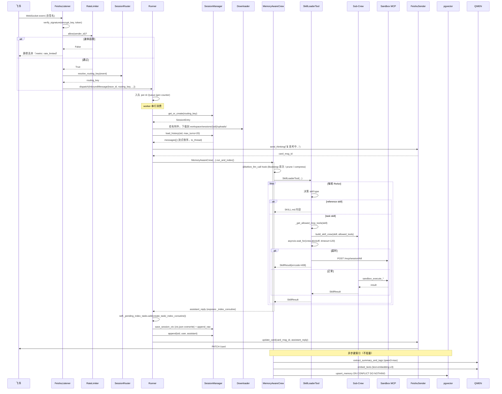

# 01 架构设计

> 本文是 [DESIGN.md](../DESIGN.md) §2 的详细展开。
> 读者：架构师、新加入工程师、SRE。
> 最后更新：2026-04-17（v2.0-draft）

---

## 目录

1. [整体架构图](#1-整体架构图)
2. [消息处理主时序](#2-消息处理主时序)
3. [三层记忆数据流](#3-三层记忆数据流)
4. [信任边界](#4-信任边界)
5. [进程 / 组件部署视图](#5-进程--组件部署视图)
6. [关键架构决策记录（ADR）](#6-关键架构决策记录adr)

---

## 1. 整体架构图

```mermaid
graph TB
    subgraph Untrusted[Untrusted 外部输入]
        FS_WS[飞书 WebSocket 事件]
        TEST_CLIENT[TestAPI Client\nPOST /api/test/message]
    end

    subgraph Semi[Semi-Trusted 边界]
        FL[FeishuListener\n验签 + 速率限制]
        TAPI[TestAPI\nBearer Token + loopback]
    end

    subgraph Main[XiaoPaw v2 主进程]
        SR[SessionRouter\nrouting_key 解析]
        Runner[Runner\nper-rk 队列 + gen counter]
        DL[FeishuDownloader]
        CS[CronService\nfilelock + DLQ]

        subgraph Agent[Agent 层]
            MC[MemoryAwareCrew\n@before_llm_call hook]
            SLT[SkillLoaderTool\nMCP 白名单 + wait_for 超时]
            SC[Sub-Crew\nbuild_skill_crew]
        end

        FS[FeishuSender\n真实 429 + Semaphore 并发]
        CLS[CleanupService]

        subgraph Obs[Observability]
            TR[Trace ContextVar]
            ML[Metrics /metrics\nBearer Token]
            LOG[JSON Logger\nPII Mask]
        end

        subgraph Sec[Security]
            SAFE[config/safety.py\n正则+hash 校验]
            FLAGS[FeatureFlags registry]
        end
    end

    subgraph Storage[Trusted 存储层]
        IDX[(sessions/index.json)]
        SESS[(sessions/{sid}.jsonl\n+ ctx/{sid}_ctx.json + _raw.jsonl)]
        TRACE[(traces/{sid}/...)]
        TJ[(cron/tasks.json + DLQ)]
        WS[(workspace/.config/*\n+ sessions/{sid}/)]
        PGV[(pgvector memories)]
    end

    subgraph External[外部服务]
        FS_API[飞书 REST API]
        QWEN[Qwen DashScope]
        BAIDU[百度千帆]
        SB[AIO-Sandbox MCP]
    end

    FS_WS --> FL
    TEST_CLIENT --> TAPI
    FL --> SR
    TAPI --> SR
    SR --> Runner

    Runner --> DL
    DL --> FS_API
    DL --> WS
    Runner --> IDX
    Runner --> SESS
    Runner --> TRACE

    Runner --> MC
    MC --> SLT
    SLT -->|reference| MC
    SLT -->|task| SC
    SC --> SB
    SB --> WS

    MC -->|extract+embed| QWEN
    MC -->|async_index_turn| PGV

    Runner --> FS
    FS --> FS_API

    CS --> TJ
    CS -->|fake InboundMessage| Runner

    CLS --> WS
    CLS --> TRACE
    CLS --> SESS

    Agent --> QWEN
    SC -.baidu_search.-> BAIDU

    TR -.trace_id.-> LOG
    ML -.prometheus.-> Obs
    SAFE -.启动校验.-> Main
    FLAGS -.feature toggle.-> Main
```

**v2 相对 v1 的架构变化**（红色 = 新增 / 改造）：

- 🆕 **Untrusted → Semi-Trusted 边界**：FeishuListener 加入验签 + 速率限制；TestAPI 加入 Bearer Token
- 🆕 **Trusted → 存储层**：pgvector 作为独立组件
- 🆕 **Observability 层**：Trace ContextVar / Metrics Bearer / PII Mask
- 🆕 **Security 层**：config/safety.py（启动校验） + FeatureFlags registry
- 🔧 **Runner**：加入 queue_gen counter + `_pending_index_tasks` set
- 🔧 **MemoryAwareCrew**：不再自己 `create_task`，只暴露 `_index_coroutine`
- 🔧 **SkillLoaderTool**：MCP tool 白名单 + `asyncio.wait_for`
- 🔧 **SessionManager**：LRUCache + `asyncio.to_thread` 流式倒序读

---

## 2. 消息处理主时序

### 2.1 正常消息流



### 2.2 关键路径延迟预期

| 阶段 | 预期 p95 | 触发阈值（告警） |
|---|---|---|
| FeishuListener verify + 入队 | <10ms | 50ms |
| SessionManager load_history (10k 轮) | <30ms | 100ms |
| `@before_llm_call` Bootstrap + prune | <5ms | 20ms |
| `@before_llm_call` compress（触发时） | <2s | 5s |
| MainCrew `akickoff`（含多轮 Skill） | <30s | 60s |
| Skill Sub-Crew `akickoff`（单轮） | <10s | 30s（超时杀） |
| FeishuSender `send`（含重试） | <3s | 10s |
| `async_index_turn`（异步） | <5s | N/A |

---

## 3. 三层记忆数据流

```mermaid
flowchart LR
    subgraph L19[L19 上下文层（单轮内）]
        direction TB
        BS[Bootstrap 读取]
        BL[before_llm_call Hook]
        CTX[ctx.json\n压缩快照]
        RAW[raw.jsonl\n审计日志]

        BS --> BL
        BL --> CTX
        BL --> RAW
    end

    subgraph L20[L20 文件层（跨轮、持久化）]
        direction TB
        MSAVE[memory-save Skill\n四信号准入]
        SKC[skill-creator Skill\nSOP 固化]
        GOV[memory-governance Skill\n8 类审计]
        WS[(workspace/\nsoul/user/agent/memory.md\n+ skills/{name}/)]

        MSAVE -->|BLOCKED_PATTERNS 过滤| WS
        SKC -->|YAML safe_load + 路径校验| WS
        GOV --> WS
    end

    subgraph L21[L21 搜索层（跨 session、海量）]
        direction TB
        IDX[async_index_turn\n后台]
        EXTRACT[extract_summary_and_tags]
        EMBED[embed_texts dim=1024]
        UPSERT[upsert_memory\nON CONFLICT DO NOTHING]
        PGV[(pgvector memories\n双向量 + BM25 + tags)]
        SEARCH[search_memory Skill\n混合检索 0.7/0.3]

        IDX --> EXTRACT --> EMBED --> UPSERT --> PGV
        SEARCH --> PGV
    end

    L19 -.每轮结束触发.-> L21
    L20 -.提供 backstory 内容.-> L19
    SEARCH -.召回历史片段.-> L19
```

**三层隔离规则**（见 [02-modules.md](02-modules.md) 和 [07-security.md](07-security.md)）：

- **L19 → L21**：每轮 `run_and_index()` 结束后，Runner 注册 `_index_coroutine` 到 `_pending_index_tasks`（见 [05-concurrency.md](05-concurrency.md)）
- **L20 写入**：仅 Sub-Crew 沙盒内执行，主 Agent 不持有写权限（课程核心设计）
- **L21 查询**：强制 `routing_key` required + SkillLoader 校验拒绝覆盖（防跨用户）

---

## 4. 信任边界

### 4.1 边界划分

```
┌──────────────────────── Untrusted ──────────────────────┐
│ 飞书用户消息 / TestAPI 调用方 / Webhook 请求              │
└──────────────────┬───────────────────────────────────────┘
                   │
                   ▼ (信任边界 1：验签 / Bearer / 速率限制)
┌──────────────────────── Semi-Trusted ────────────────────┐
│ FeishuListener / TestAPI                                  │
│ → 解析后生成 InboundMessage（含 trace_id，内部结构）      │
└──────────────────┬───────────────────────────────────────┘
                   │
                   ▼ (信任边界 2：InboundMessage 结构约束)
┌──────────────────────── Semi-Trusted (Business) ─────────┐
│ Runner / MemoryAwareCrew / SkillLoaderTool               │
│ → 业务逻辑，不直接出站                                     │
└──────────────────┬───────────────────────────────────────┘
                   │
                   ▼ (信任边界 3：MCP tool 白名单 / 出站鉴权)
┌──────────────────────── Trusted / External ───────────────┐
│ Sub-Crew (Sandbox) ← MCP 白名单受控                        │
│ pgvector  ← DB 权限最小化（memories 表 SELECT/INSERT）      │
│ workspace ← mount 精确到 {sid}/ 子目录                      │
│ 飞书/Qwen/百度 API ← 专用 App Token / API Key               │
└──────────────────────────────────────────────────────────┘
```

### 4.2 边界规则详解

**边界 1：飞书 Webhook → FeishuListener**
- **验签**：lark-oapi 原生签名校验（`encrypt_key` + `verification_token`）
- **重放防护**：同一 `event_id` 在 5 分钟窗口内只处理一次（基于 LRU 缓存）
- **速率限制**：`per_user_per_minute=20`，超限静默丢弃
- **白名单**：`allowed_chats` 控制群聊白名单（p2p 默认放行）

**边界 1：TestAPI → 内部**
- **环境门禁**：`XIAOPAW_ENV=prod` 时拒绝启动 TestAPI
- **Bearer Token**：`Authorization: Bearer <token>` 强制，token ≥32 字符
- **监听地址**：只能 `bind 127.0.0.1 / ::1 / localhost`

**边界 2：InboundMessage 结构约束**
- `trace_id` / `routing_key` / `msg_id` 由内部生成，不接受外部传入
- `content` / `attachment` 经过 `pii_mask` 处理后才进入日志
- Attachment 路径在 Downloader 写入后返回绝对路径，不由外部决定

**边界 3：MCP tool 白名单**（v2 新增，[07-security.md §2](07-security.md)）
- SKILL.md frontmatter 声明 `allowed_tools: [sandbox_execute_code, sandbox_file_operations, ...]`
- Sub-Crew 构建时通过 `_filter_mcp_tools()` 仅暴露声明的 tools
- `enable_mcp_whitelist: false` 可回到教学模式（所有 tool 开放）

**边界 3：DB 权限最小化**
- pgvector 使用独立 DB 用户 `xiaopaw_app`
- 仅授权 `memories` 表 `SELECT, INSERT`（不授权 DELETE，防误删）
- schema 创建 / migration 使用 DBA 账号单独执行

**边界 3：workspace 路径隔离**
- 每个 session 的 mount 精确到 `/workspace/sessions/{sid}/`
- Downloader 写入时 `path.resolve()` 校验路径不越界
- SKILL.md `scripts:` 路径用 `is_relative_to(skill_dir)` 校验

---

## 5. 进程 / 组件部署视图

### 5.1 单节点生产部署（推荐）

```
┌────────────────────── 宿主机 (Linux, x86_64) ──────────────────────┐
│                                                                     │
│  ┌────────────────── Docker Network: xiaopaw-net ────────────────┐ │
│  │                                                                 │ │
│  │  ┌──────────────┐    ┌──────────────┐    ┌──────────────┐    │ │
│  │  │ xiaopaw:v2   │    │  pgvector    │    │ aio-sandbox │    │ │
│  │  │ (USER 65534) │───▶│ :5432 内网   │    │ :8080 内网   │    │ │
│  │  │ :8090        │    │ healthcheck ✓│    │ healthcheck ✓│    │ │
│  │  │ /metrics     │    └──────────────┘    └──────────────┘    │ │
│  │  │ +/health     │     (不对宿主暴露)    (v2.1 T9：不对宿主暴露)│ │
│  │  │ :9090 testapi│      volume:          volume:                │ │
│  │  │ (仅 loopback,│      pgvector-data   (无持久化，ephemeral)   │ │
│  │  │  dev only)   │                                                │ │
│  │  └──┬───────────┘                                                │ │
│  │     │                                                             │ │
│  │  volume:                                                          │ │
│  │  ./data (mount RO/RW 按子目录)                                    │ │
│  └──────────────────────────────────────────────────────────────┘ │
│                                                                     │
│  bind mount:                                                        │
│  ./data/workspace         ──▶ xiaopaw:/app/data/workspace (RW)      │
│  ./data/sessions          ──▶ xiaopaw:/app/data/sessions (RW)       │
│  ./data/ctx               ──▶ xiaopaw:/app/data/ctx (RW)            │
│  ./data/traces            ──▶ xiaopaw:/app/data/traces (RW)         │
│  ./data/cron              ──▶ xiaopaw:/app/data/cron (RW)           │
│  ./data/workspace/sessions/{sid}/ ──▶ aio-sandbox:/workspace/... (RW)│
│  ./config.yaml            ──▶ xiaopaw:/app/config.yaml (RO)         │
│  ./.env                   ──▶ xiaopaw:/app/.env (RO, mode 0400)     │
│                                                                     │
│  out-bound:                                                         │
│  xiaopaw ──▶ 飞书 API / DashScope / 百度千帆（HTTPS）                │
│                                                                     │
└────────────────────────────────────────────────────────────────────┘
                   ▲                                   ▲
                   │ Prometheus scrape                 │ 运维 SSH
                   │ (Bearer Token)                    │
                   │                                   │
           ┌───────┴────────┐                  ┌──────┴──────┐
           │  Prometheus    │                  │  SRE 终端    │
           │  + Grafana     │                  └─────────────┘
           └────────────────┘
```

### 5.2 开发部署（localhost）

- 主进程直接 `python -m xiaopaw.main` 运行
- pgvector / sandbox 仍用 docker compose
- TestAPI 启用，监听 `127.0.0.1:9090`
- `XIAOPAW_ENV=dev`

### 5.3 Canary（Phase 0 必备）

- 独立 pod，数据与 prod 完全隔离
- 接收 0 流量，只跑 pytest-memray 的长跑用例
- 每周从 canary 数据生成内存/延迟 baseline 报告

---

## 6. 关键架构决策记录（ADR）

**ADR-001：单节点部署作为 v2 的硬前提**

- **决策**：v2 所有并发方案（filelock / asyncio.Lock / LRUCache）仅保证单节点正确性
- **理由**：多节点涉及分布式锁、消息队列、session 一致性，工作量等同重写。课程 L22 也未涉及
- **后果**：多节点需求等 M4 规划；文档明示（[DESIGN.md §2.4](../DESIGN.md)）
- **备选**：若用户坚持多节点，Cron/memory-save 改用 PG advisory lock（项目已有 PG）

**ADR-002：session lock 采用 LRUCache(1000) 而非 WeakValueDictionary**

- **决策**：`SessionManager._jsonl_locks = LRUCache(maxsize=1000)`
- **理由**：v1 review 发现 WeakValueDictionary 双字典方案在并发释放瞬间有竞态，两把锁并存破坏互斥
- **后果**：内存增长可控（每锁约 200 字节，1000 上限 = 200KB），日活 <1000 场景完全够用
- **备选**：超 1000 时拒绝接入新 session（极端降级），或加监控告警触发人工扩容

**ADR-003：pending_index_tasks 由 Runner 持，crew 只暴露 coroutine**

- **决策**：`MemoryAwareCrew.run_and_index()` 不再 `asyncio.create_task`，改为将 `_index_coroutine` 挂在实例上，Runner 统一包装为 Task 并注册到 `_pending_index_tasks` set
- **理由**：v1 `_task = asyncio.create_task(...)` 局部变量在 Python 3.12+ 可能被 GC 回收；v1 重构版又通过参数穿透把 set 传进 crew，破坏分层
- **后果**：MemoryAwareCrew 不感知 Task 生命周期，更符合单一职责；Runner 负责所有异步 task 的 shutdown gather
- **备选**：引入独立 TaskManager 组件（过度工程，v2 不做）

**ADR-004：Token 计数优先使用 Qwen 官方 tokenizer，tiktoken 仅作兜底**

- **决策**：首选 `dashscope.get_tokenizer("qwen-max")`，不可用时 `tiktoken.cl100k_base`，最终降级 `len//2`
- **理由**：Phase 0 校准报告显示 `cl100k_base` 对 Qwen 中文偏差 15-25%，远超 v1 声称的 <10%
- **后果**：压缩阈值 45% 判断更准确；启动时惰性加载避免无网环境崩溃
- **备选**：HuggingFace `Qwen/Qwen2-7B` tokenizer（本地文件，零网络）作为 Qwen 官方 tokenizer 的备胎

**ADR-005：飞书限流识别走 HTTP 层 + 真实错误码**

- **决策**：捕获 HTTP 429 + 飞书错误码 `99991663/99991672/99991671`，读 `Retry-After` header
- **理由**：v1 错把权限码 `99991400` 当 rate limit；`X-Lark-Request-RateLimit-Reset` 为虚构 header
- **后果**：识别准确率 100%（根据飞书官方文档）；`Semaphore(5)` 控并发
- **备选**：完全禁用重试（不可行，飞书偶发抖动会丢消息）

**ADR-006：Skill 超时后主动 kill sandbox 进程**

- **决策**：`asyncio.wait_for` 超时 → 调 MCP `POST /mcp/session/kill`
- **理由**：CrewAI 协程取消不能终止 Docker 容器内进程，不杀会积累 zombie 耗尽 sandbox 资源
- **后果**：单 Skill 超时最大影响时长 = timeout + kill 延迟（通常 <5s）
- **备选**：容器层定期扫 zombie（复杂度高，v2 不做）

**ADR-007：MCP tool 白名单作为可选 feature flag**

- **决策**：`enable_mcp_whitelist: true`（prod 默认）/ `false`（教学 demo 默认）
- **理由**：课程演示版强调"Sub-Crew 全 MCP 工具开放 + backstory 行为约束"；生产版必须收紧为 Skill 声明白名单
- **后果**：教学场景保持原样；生产场景 prompt injection 无法调用非声明 tools
- **备选**：强制白名单（会破坏教学意图，拒绝）

**ADR-008：trace_id 覆盖率目标 85%（非 95%）**

- **决策**：CI gate `verify_trace_coverage.py --min-ratio=0.85`
- **理由**：CrewAI 内部 ThreadPoolExecutor、tenacity 重试、aiohttp 回调都跨 ContextVar 边界，95% 是理论值
- **后果**：入口 + 出站 HTTP header + LLM 请求三处强校验，其他路径尽力而为
- **备选**：改用 OpenTelemetry（过度工程，v2 不做）

**ADR-009：凭证全部轮换作为 Phase 0 硬前提**

- **决策**：`git filter-repo` 执行前必须完成 DB / 飞书 / Qwen / 百度 / metrics token 全部轮换
- **理由**：`git filter-repo` 不可回滚；已 clone/fork/CI cache 里的旧凭证仍有效
- **后果**：Phase 0 需要 1-1.5 天（与外部平台协调）
- **备选**：不清 git 历史（留下永久安全债务，拒绝）

**ADR-010：Phase 5 威胁建模 & 合规独立成阶段**

- **决策**：不合并到 Phase 4（观测），独立 1.5 天
- **理由**：威胁模型、PII 脱敏、凭证 runbook、入站速率限制、MCP 白名单是**独立的安全交付**，与观测无关
- **后果**：工作量 +1.5 天；有独立的 `threat-model.md` / `compliance-baseline.md` 交付物
- **备选**：推迟到 v2.1（课程质量要求不允许）

---

## 7. 参考实现

- **v1 教学示例**：`/root/course/code/xiaopaw-with-memory/`（作为对照组）
- **课程正文**：`/root/course/multi-agent/18｜...md` 至 `22｜...md`
- **v1 review**：`/root/course/multi-agent/review_L22/01_Review报告_xiaopaw-with-memory.md`
- **v2 重构方案**：`/root/course/multi-agent/review_L22/02_重构设计文档_xiaopaw-with-memory_v2.md`

---

**下一步阅读**：[02-modules.md](02-modules.md) — 每个模块的具体职责和接口。
