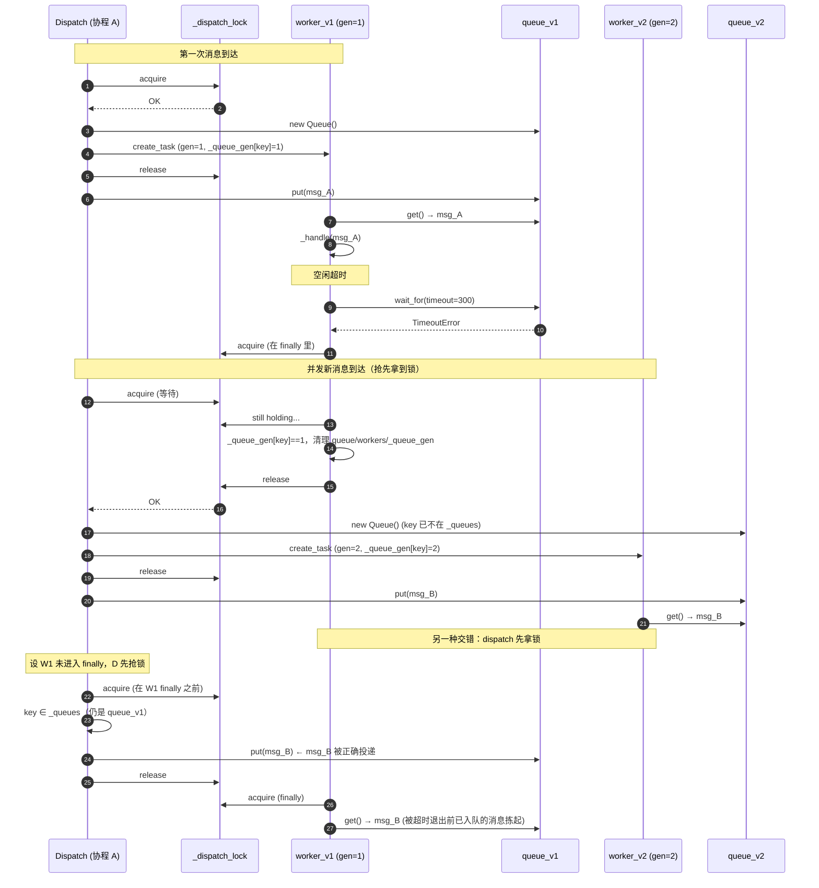
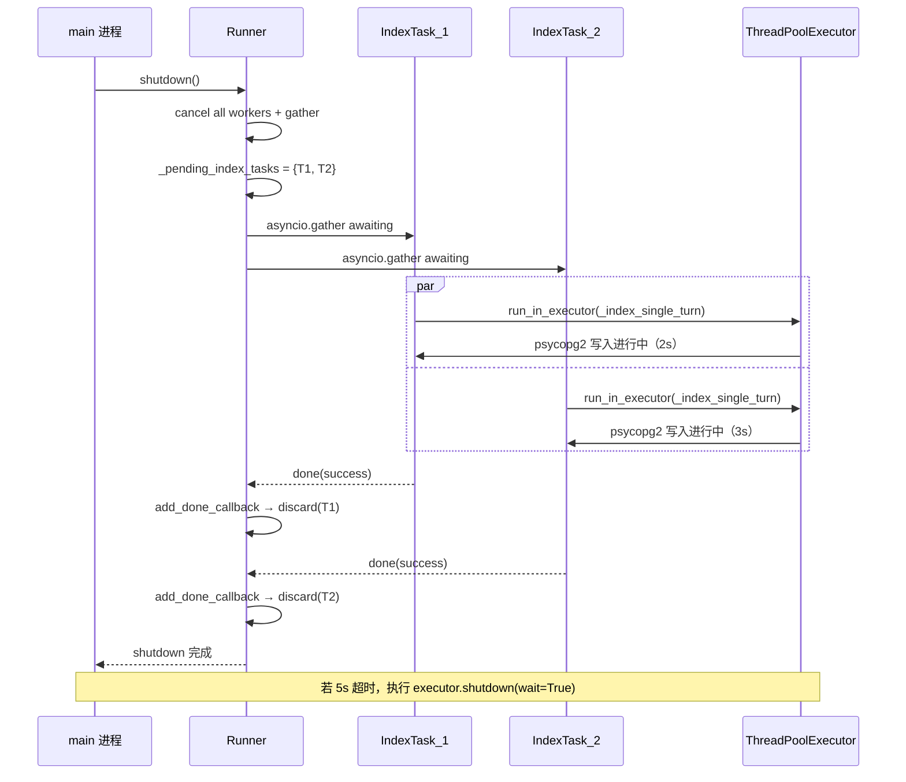

# 05 并发与锁模型（v2 核心加固）

> 本文是 [DESIGN.md](../DESIGN.md) §7 的详细展开。
> 读者：所有实施工程师（**必读**）。
> 最后更新：2026-04-19（v2.1）——修正 LRUCache 驱逐竞态、`shutdown_default_executor` 公开 API、`to_thread` 3.9+ copy_context 事实；权威锁清单见 [ssot/locks.md](ssot/locks.md)。
>
> v1 review 结论：并发模型是整个系统最大的雷区。v1 共有 5 个与并发/GC 相关的 BUG
> （`_jsonl_locks` 泄漏、局部 `create_task` 被 GC、queue 清理竞态、`load_history` 阻塞事件循环、
> `ctx.json` 并发覆盖）。本文档给出 v2 的完整并发方案，一次讲清，避免实施时歧义。

---

## 目录

- [1. 并发模型总览](#1-并发模型总览)
- [2. Runner per-routing_key 队列](#2-runner-per-routing_key-队列)
- [3. Session 锁模型](#3-session-锁模型)
- [4. Async Task 生命周期管理](#4-async-task-生命周期管理)
- [5. Cron 跨进程锁 filelock + DLQ](#5-cron-跨进程锁-filelock--dlq)
- [6. memory-save 文件锁](#6-memory-save-文件锁)
- [7. LLM client 单例（@cache）](#7-llm-client-单例cache)
- [8. Semaphore 限流（FeishuSender）](#8-semaphore-限流feishusender)
- [9. run_in_executor 与 ContextVar](#9-run_in_executor-与-contextvar)
- [10. 常见竞态陷阱与避免](#10-常见竞态陷阱与避免)
- [11. 压测预期](#11-压测预期)
- [12. 调试工具与复现方法](#12-调试工具与复现方法)
- [附录 A. v1 vs v2 差异速查](#附录-a-v1-vs-v2-差异速查)

---

## 1. 并发模型总览

### 1.1 核心假设

XiaoPaw v2 是**单事件循环、单进程、单节点**的 Python asyncio 应用。所有并发设计建立在三条底线上：

1. **单事件循环**：所有 `asyncio.Lock` / `asyncio.Queue` / `asyncio.Semaphore` 仅在主 loop 内有效。
   禁止跨 loop 使用同一把锁。
2. **单进程**：process 内共享 Python 对象天然可用；跨进程隔离**唯一**由 `filelock`
   （`cron/tasks.json` 与 `memory-save`）实现。
3. **单节点**：本文描述的所有方案**不保证**多节点语义。多节点需求走 PG advisory lock
   或独立消息队列（见 [§5.5](#55-多节点备选方案pg-advisory-lock)），属于 M4 范畴。

### 1.2 并发维度

XiaoPaw v2 存在三类并发入口：

| 入口 | 并发来源 | 粒度约束 |
|---|---|---|
| 飞书 WebSocket 事件 | lark-oapi 底层异步回调 | 不同 routing_key 并行；同 routing_key 串行 |
| TestAPI HTTP 请求 | aiohttp 并发请求 | 同上，入 `Runner.dispatch` |
| CronService 触发 | asyncio 定时器 | 转为 `InboundMessage` 入 `Runner.dispatch` |

**关键规则**：所有入口最终都走 `Runner.dispatch(inbound)`，**由 Runner 统一做 routing_key 维度的串行化**。
后续业务层（SessionManager/MemoryAwareCrew/SkillLoaderTool）在同一 routing_key 的调用顺序被 Runner 保证，
**不需要**自己维护 per-session 锁。

但 SessionManager/Cron/memory-save 各自保护的是**文件资源**，这些文件可被 Cron 触发 + 用户消息并发写到，
或被 Sub-Crew 容器内 Skill 脚本写到，因此仍需独立锁：

| 资源 | 并发写入来源 | 保护机制 |
|---|---|---|
| `sessions/index.json` | 不同 rk 并发 `get_or_create` / `create_new_session` | `SessionManager._index_lock` |
| `sessions/{sid}.jsonl` | 同 sid 的 Runner append（串行被 Runner 保证）+ CleanupService 读 | `SessionManager._jsonl_locks[sid]` |
| `ctx/{sid}_ctx.json` | 单 rk 内 Runner 串行 → 无需锁；CleanupService 只删不写 | write-then-rename 原子性 |
| `cron/tasks.json` | CronService + scheduler_mgr Skill（Sub-Crew，独立子进程） | `filelock.FileLock` |
| `workspace/*/memory.md` | 多个 Sub-Crew 并行调用 `memory-save` 写同 topic | `filelock.FileLock`（topic 粒度） |
| 飞书 API 调用 | 多 rk 并发回复 | `asyncio.Semaphore(5)` |

### 1.3 锁清单（一图总览）

```
┌──────────────────────────────── Asyncio Primitives (单进程) ────────────────────────────────┐
│ Runner._dispatch_lock          : asyncio.Lock          保护 _queues/_workers/_queue_gen       │
│                                                        + _jsonl_locks setdefault（L1）        │
│ SessionManager._index_lock     : asyncio.Lock          保护 index.json 读写                  │
│ SessionManager._jsonl_locks    : LRUCache(1000)        per-session append 互斥（值，L3）      │
│     └── 值是 asyncio.Lock；取锁必须包在 _dispatch_lock 内（见 §3.2）                           │
│ FeishuSender._sem              : asyncio.Semaphore(5)  飞书 API 并发上限                      │
└──────────────────────────────────────────────────────────────────────────────────────────┘
┌──────────────────────────────── Cross-Process (filelock) ─────────────────────────────────┐
│ cron/tasks.json.lock           : filelock.FileLock     跨 CronService + Sub-Crew scheduler  │
│ workspace/**/{topic}.md.lock   : filelock.FileLock     memory-save 同 topic 互斥             │
└──────────────────────────────────────────────────────────────────────────────────────────┘
┌──────────────────────────────── Task Registries (GC 防护) ────────────────────────────────┐
│ Runner._workers : dict[str, asyncio.Task]              per-rk worker 强引用                 │
│ Runner._pending_index_tasks : set[asyncio.Task]        index task 强引用（防 3.12+ GC）     │
│ CronService._main_task : asyncio.Task                  主 loop 强引用                        │
└──────────────────────────────────────────────────────────────────────────────────────────┘
```

### 1.4 设计原则

1. **锁粒度越小越好**：per-rk / per-sid / per-topic，避免全局锁阻塞整个 loop。
2. **锁持有时间越短越好**：只在临界区内持锁，IO 和 LLM 调用不持锁。
3. **锁失败要有 metric**：`filelock.Timeout` 转 metric 告警；不静默吞噬。
4. **锁与 task 生命周期绑定**：shutdown 时先 cancel workers，再 gather pending tasks，
   最后关闭 executor。
5. **不要在 async 函数里混用 `threading.Lock`**：asyncio 原生 `Lock` 是协作式，
   threading Lock 会阻塞整个 loop。

---

## 2. Runner per-routing_key 队列

### 2.1 设计目标

- 同一 `routing_key`（同一 p2p / 同一 group / 同一 thread）消息**严格按到达顺序串行**处理
- 不同 `routing_key` **完全并行**（各自独立 worker）
- worker **空闲 300s 自动退出**，释放内存
- **关键**：并发的 dispatch 和 worker timeout 不能造成 queue 丢失 / 双 worker / 消息漏处理

### 2.2 数据结构

```python
from __future__ import annotations

import asyncio
import logging
from dataclasses import dataclass, field
from typing import Protocol

from xiaopaw.models import InboundMessage

logger = logging.getLogger(__name__)


class Runner:
    def __init__(
        self,
        sender: "SenderProtocol",
        session_mgr: "SessionManager",
        agent_fn: "AgentFn",
        queue_idle_timeout_s: int = 300,
        max_queue_size: int = 10,
    ) -> None:
        self._sender = sender
        self._session_mgr = session_mgr
        self._agent_fn = agent_fn
        self._idle_timeout_s = queue_idle_timeout_s
        self._max_queue_size = max_queue_size

        # 核心状态（dispatch_lock 保护）
        self._queues: dict[str, asyncio.Queue[InboundMessage]] = {}
        self._workers: dict[str, asyncio.Task[None]] = {}
        self._queue_gen: dict[str, int] = {}  # v2 新增：每次新建 queue +1
        self._dispatch_lock = asyncio.Lock()

        # async task 强引用集合（见 §4）
        self._pending_index_tasks: set[asyncio.Task[None]] = set()
```

`_queue_gen[key]` 是每个 routing_key 的 "世代计数器"：**每次新建 queue 时 +1**。
worker 退出时必须对比自己启动时记录的 `gen` 与当前 `_queue_gen[key]`，相等才清理。

### 2.3 dispatch 入队

```python
async def dispatch(self, inbound: InboundMessage) -> None:
    key = inbound.routing_key
    async with self._dispatch_lock:
        if key not in self._queues:
            self._queues[key] = asyncio.Queue(maxsize=self._max_queue_size)
            gen = self._queue_gen.get(key, 0) + 1
            self._queue_gen[key] = gen
            self._workers[key] = asyncio.create_task(
                self._worker(key, gen),
                name=f"xp-worker-{key}-gen{gen}",
            )
        queue = self._queues[key]
    # put 放到锁外，避免 queue 满时阻塞其他 rk 的 dispatch
    await queue.put(inbound)
```

**保护什么资源**：`_queues` / `_workers` / `_queue_gen` 三个 dict 的 **同时** 修改。
**持锁时间**：O(1)，仅做字典读写和 `create_task`（不阻塞）。
**失败模式**：无失败路径；`create_task` 在 loop 内必成功。

### 2.4 worker 生命周期（异常 finally 清理 + gen 校验）

```python
async def _worker(self, key: str, gen: int) -> None:
    queue = self._queues[key]  # 启动时必然存在
    try:
        while True:
            try:
                inbound = await asyncio.wait_for(
                    queue.get(), timeout=self._idle_timeout_s
                )
            except asyncio.TimeoutError:
                return  # 走 finally 清理
            try:
                await self._handle(inbound)
            except Exception:
                logger.exception("[%s] handle failed", key)
            finally:
                queue.task_done()
    finally:
        await self._cleanup_on_exit(key, gen)


async def _cleanup_on_exit(self, key: str, gen: int) -> None:
    """关键：对比 gen，防止误删新 queue。"""
    async with self._dispatch_lock:
        current_gen = self._queue_gen.get(key)
        if current_gen == gen:
            # 仍是我这代 worker 负责的 queue，可以清理
            self._queues.pop(key, None)
            self._workers.pop(key, None)
            self._queue_gen.pop(key, None)
        else:
            # dispatch 已经重建了 queue（gen+1），我这代是历史，不动
            logger.info(
                "[%s] worker gen=%d exits; current gen=%s, skip cleanup",
                key, gen, current_gen,
            )
```

**保护什么资源**：worker 退出时对 `_queues/_workers/_queue_gen` 三个 dict 的清理。
**持锁时间**：O(1)。
**失败模式**：`_handle` 内部异常只记日志不传播；`finally` 无条件执行。

### 2.5 竞态分析：v1 的问题

v1 的 `_worker` 清理代码是：

```python
# v1 实现（有 BUG）
async with self._dispatch_lock:
    if self._workers.get(key) is asyncio.current_task():
        self._queues.pop(key, None)
        self._workers.pop(key, None)
```

**竞态序列**：

```
T1  dispatch(msg_A, key)  → 创建 queue_v1 + worker_v1
T2  queue_v1 消费完 msg_A
T3  worker_v1 进入 wait_for（idle 倒计时）
T4  worker_v1 timeout → 进入 finally，尚未拿到 _dispatch_lock
T5  dispatch(msg_B, key) → 抢到 _dispatch_lock，看到 _workers[key] 还在
                         → 以为 worker 还活着，只 put 到 queue_v1
T6  worker_v1 拿到 _dispatch_lock → current_task() 是自己 → 删除 queue_v1 和 worker_v1
T7  msg_B 永远卡在已被丢弃的 queue_v1 里
```

v1 的"是不是 current_task"判断**不足以**防竞态：在 T5 抢锁前 `_workers[key]` 确实还是 worker_v1。

**v2 修复**：引入 `gen counter`，dispatch 时**无条件 +1** 并重建 queue/worker。worker 退出时**对比 gen**。
上面那个序列在 v2 下：

```
T4  worker_v1 timeout（携带 gen=1）
T5  dispatch(msg_B, key) 抢到锁 → 看到 key not in _queues
                                 → 创建 queue_v2 + worker_v2（gen=2）
                                 → _queue_gen[key] = 2
T6  worker_v1 抢到锁 → self._queue_gen[key] == 2 ≠ 1（自己的 gen）
                    → 不清理，直接退出
```

msg_B 进入 queue_v2，由 worker_v2 正常消费。

### 2.6 时序图：Runner 队列生命周期



注：上图展示两种正常交错，均无消息丢失。第 6 步 timeout → finally 清理的代码路径被 `gen` 保护。

### 2.7 测试方法

| 测试 | 构造 | 断言 |
|---|---|---|
| `test_runner_parallel_across_routing_keys` | 并发 dispatch 3 个不同 rk | 三个 worker 同时活；总耗时 ≈ max(单 rk 耗时) |
| `test_runner_serial_within_routing_key` | 同 rk 连续 dispatch 10 条 | 消费顺序严格 = dispatch 顺序 |
| `test_runner_queue_gen_race` | 手动 cancel worker_v1 → 立即 dispatch → 让 worker_v1 再拿锁 | msg_B 最终被消费；`_queues[key]` 非空；`_queue_gen[key]==2` |
| `test_runner_worker_idle_exit` | idle_timeout 设为 0.5s，消息后静默 1s | worker 自动退出，`_workers[key]` 被清理 |
| `test_runner_handle_exception_isolated` | `_handle` 抛异常 | worker 不退出；下一条消息仍能消费 |

**压测用例**：
```python
# 100 个 rk，每个 rk 投 20 条消息，max_queue_size=10
# 预期：部分 dispatch 因 queue 满阻塞，但最终所有消息完成且顺序正确
---

## 3. Session 锁模型

### 3.1 问题回顾

**v1 问题**：`SessionManager._jsonl_locks: dict[str, asyncio.Lock]` 无界；每新增 session 新增一把锁，长跑 OOM。v1 review C3 指出这是 HIGH 级生产 blocker。

简单换成 `LRUCache(1000)` 看似能防 OOM，但会引入新的竞态：LRUCache **不是原子 setdefault**，驱逐后并发 getter 会各自新建锁。下面两节分别给出"怎么取锁"和"为什么必须这么取"。

### 3.2 LRUCache + 两级锁（v2.1 定稿）

```python
# xiaopaw/session/manager.py
from cachetools import LRUCache

class SessionManager:
    def __init__(self, data_dir: Path, max_active_sessions: int = 1000) -> None:
        self._jsonl_locks: LRUCache[str, asyncio.Lock] = LRUCache(
            maxsize=max_active_sessions
        )
        # 注意：_dispatch_lock 由 Runner 持有并注入 / 或 SessionManager 自持一个
        # 全局 _index_lock；本节为示意，实际注入方式见 02-modules.md §2.2
        self._dispatch_lock: asyncio.Lock = asyncio.Lock()

    async def append(self, sid: str, *, user: str,
                     feishu_msg_id: str, assistant: str) -> None:
        # 第一级：保护 "check + create + get" 三步原子
        async with self._dispatch_lock:
            if sid not in self._jsonl_locks:
                self._jsonl_locks[sid] = asyncio.Lock()
            lock = self._jsonl_locks[sid]
        # 第二级：真正的 per-session 互斥（长时间持有时不阻塞 _dispatch_lock）
        async with lock:
            # ... 写 JSONL（含 fsync） ...
            pass
```

**两级锁的职责分工**：

| 层 | 锁 | 范围 | 持有时间 |
|---|---|---|---|
| L1 | `_dispatch_lock` | `check + setdefault + get` 三步 | <1ms（字典操作） |
| L3 | `_jsonl_locks[sid]`（值） | JSONL append + fsync | 5~10ms |

引用：[ssot/locks.md](ssot/locks.md) L1 + L3。

### 3.3 LRUCache 为什么必须配合 _dispatch_lock

**关键事实**：`cachetools.LRUCache` 的 `in` / `__setitem__` / `__getitem__` 序列**不是原子**的，也不等价于 `dict.setdefault`。驱逐后的竞态场景：

```
T0  sid=S 已在 cache；协程 A 已进入 append，持有 lock_A（闭包引用）
T1  cache 满 → 淘汰 sid=S（LRU） ← lock_A 还活着，但 cache 里没有
T2  协程 B 进 append：查 cache，sid=S 不在
T3  协程 B setdefault → 创建 lock_B，存 cache
T4  协程 B `async with lock_B` → 与 A 并发写 JSONL → 破坏互斥
```

**修复**：`async with _dispatch_lock` 保护"check + create + get"。B 在 T2 前会被挡住，等 A 完成后才走 T2/T3。但注意：**这并不能让 B 拿到 A 的锁** —— 如果 cache 里驱逐了，B 在 T3 仍然新建一把；但此时 A 已经 release 了 lock_A，没有并发问题。

**真正的前提假设**：`maxsize` 必须 > 峰值 active session 数。否则 cache **持续驱逐**的情况下：

```
T0  sid=S 在 cache；A 持有 lock_A 并仍在执行（慢）
T1  cache 因其他 session 爆满 → 驱逐 sid=S
T2  B 进来拿 _dispatch_lock → cache 里没有 sid=S → 建新 lock_B
T3  A 仍持有 lock_A，B 持有 lock_B → **两把锁并存，互斥失效**
```

**结论**：LRUCache 的**核心功能是防 OOM**，不是防并发竞态。要保证 per-session 互斥，`maxsize=1000` 必须 > 峰值 active session。实际日活超 800 要告警（见 §3.5 调优指引）；日活超 1000 就可能出现并发写 JSONL。

### 3.4 为什么 1000 上限足够（容量测算）

- **日活估算**：单节点最多 ~500 活跃用户（p2p + 群 + 话题），单用户同时活跃 session ≤3
- **内存预算**：`asyncio.Lock` ~200 字节 × 1000 = 200KB
- **淘汰节奏**：>1000 时 LRU 淘汰最旧 1 把，新来时创建新 1 把，稳态

**调优指引**：若实际日活 >800（接近上限），从 `config.yaml.session.max_active_sessions` 上调到 2000；若上调到 5000 仍不够，说明该做分片（M4）。活跃 session 超过 `maxsize` 是**运维告警项**（而不是靠代码正确性兜底）。

### 3.5 load_history 流式倒序读不阻塞事件循环

**v1 问题**：`path.read_text().strip().split("\n")` 一次全量加载 JSONL 到内存，10MB+ 文件阻塞事件循环 100ms+。

**v2 实现**（[02-modules.md §2.2](02-modules.md)）：

```python
async def load_history(self, sid: str, max_turns: int = 20) -> list[MessageEntry]:
    path = self._jsonl_path(sid)
    if not path.exists():
        return []
    return await asyncio.to_thread(self._read_tail, path, max_turns * 2)
```

**原理**：
1. `asyncio.to_thread(fn, ...)` 把 `fn` 丢到默认 `ThreadPoolExecutor`，Python 3.9+ 内部会 `copy_context().run(fn, ...)`，因此 ContextVar（含 trace_id）自动透传
2. 当前协程被挂起 → 事件循环继续调度其他协程
3. 线程池线程读文件（阻塞 IO）
4. 完成后 Future resolve → 协程恢复

**事件循环延迟**：其他协程感知到的延迟 ≈ 任务切换开销（<1ms），而非文件 IO 时间。

> 注：`asyncio.to_thread` 从 **Python 3.9** 起自带 copy_context（并非 3.11+ 才加的）。直接调 `loop.run_in_executor(None, fn)` 则**任何版本都不自动** copy_context，详见 [§9](#9-run_in_executor-与-contextvar)。

### 3.6 测试方法

| 测试 | 构造 | 断言 |
|---|---|---|
| `test_session_lock_lifecycle` | 创建 1 万 session，GC 后检查 | `len(_jsonl_locks) <= 1000` |
| `test_session_lock_mutex` | 100 协程并发 `append` 同 sid | JSONL 无交叉；每行合法 JSON |
| `test_session_lock_evict_and_reacquire` | `maxsize=2`，A 持锁不释放 → 让 B/C 触发驱逐 → D 并发 append 同 sid | `_dispatch_lock` 挡住"check+setdefault+get"；断言驱逐后无双锁写入（或显式标注 maxsize 不足时的已知限制） |
| `test_load_history_does_not_block_loop` | 10MB JSONL + 并发 heartbeat | heartbeat 响应 <10ms |

---

## 4. Async Task 生命周期管理

### 4.1 v1 问题回顾

v1 `main_crew.py:307-316`：

```python
_task = asyncio.create_task(  # noqa: RUF006
    async_index_turn(...)
)
# 函数返回后，_task 作为局部变量被 GC 回收 → Python 3.12+ 取消任务
```

**后果**：pgvector 写入中断，搜索记忆残缺。CRITICAL 级隐患。

### 4.2 v2 方案：Runner 持集合 + add_done_callback

```python
# xiaopaw/runner.py
class Runner:
    def __init__(self, ...) -> None:
        self._pending_index_tasks: set[asyncio.Task] = set()

    async def _handle(self, inbound: InboundMessage) -> None:
        # ... 业务流程 ...
        assistant_reply = await crew.run_and_index()

        # v2 关键：crew 仅暴露 _index_coroutine，Runner 负责 Task 生命周期
        if hasattr(crew, "_index_coroutine") and crew._index_coroutine is not None:
            task = asyncio.create_task(crew._index_coroutine)
            self._pending_index_tasks.add(task)
            task.add_done_callback(self._pending_index_tasks.discard)
```

### 4.3 add_done_callback(set.discard) 的优雅

相比手写 try/finally：

```python
# 不推荐：侵入性强，每个 create_task 都要包
async def _wrapped():
    try:
        await coro
    finally:
        self._pending_index_tasks.discard(current_task)
task = asyncio.create_task(_wrapped())
```

`add_done_callback` 版本：
- ✅ 无需包装 coroutine
- ✅ Task 完成（含异常、取消）都会触发 callback
- ✅ `set.discard` 对不存在的元素不抛异常，幂等

### 4.4 Shutdown 优雅退出

```python
async def shutdown(self) -> None:
    # 1. 先停 worker（避免新 _handle 启动）
    for w in list(self._workers.values()):
        w.cancel()
    await asyncio.gather(*self._workers.values(), return_exceptions=True)

    # 2. 等 pending index tasks（最多 5s）
    if self._pending_index_tasks:
        try:
            await asyncio.wait_for(
                asyncio.gather(*self._pending_index_tasks, return_exceptions=True),
                timeout=5,
            )
        except asyncio.TimeoutError:
            # gather 只取消 Task；底层 executor 线程（psycopg2 同步调用）不可被强制取消
            # ⇒ 承认"僵尸线程"存在，打 metric 让 SRE 可观测
            XIAOPAW_INDEX_TASK_ZOMBIE.inc(len(self._pending_index_tasks))
            # 用公开 async API 替代私有 loop._default_executor（Python 3.9+）
            await asyncio.get_running_loop().shutdown_default_executor()
```

**为什么必须承认"僵尸线程"**：
- `asyncio.gather(..., timeout=5)` 超时后会对每个未完成 Task 发 CancelledError
- 但 `_index_single_turn` 的真正计算（psycopg2 同步写入、embedding HTTP 阻塞调用）跑在 `ThreadPoolExecutor` 线程里。CPython 不支持从外部强制终止线程，只能等线程自己跑完
- 结果：**Task 被 cancel 了，底层线程可能还在跑**。若进程随即退出，线程被操作系统回收；若 `shutdown_default_executor()` 里还 wait，会继续等下去
- 因此 `XIAOPAW_INDEX_TASK_ZOMBIE` 指标不是可有可无，而是唯一能让 SRE 知道"确实有任务没写完"的信号

**API 选择**：
- 旧写法 `loop._default_executor.shutdown(wait=True)` 用的是**私有属性**，不同 Python 小版本可能变
- 新写法 `await loop.shutdown_default_executor()` 是 **Python 3.9+ 公开 async API**，语义同上且是协程，不阻塞 loop

### 4.5 时序图：pending_tasks shutdown



---

## 5. Cron 跨进程锁 filelock + DLQ

### 5.1 跨进程场景

`data/cron/tasks.json` 有两类写者：
- **CronService**（主进程）：每次 tick 更新 `next_run_at_ms` / `last_run_at_ms`
- **scheduler_mgr Skill**（**沙盒进程**）：LLM 触发创建/删除 job 时在 sandbox 内执行 Python 脚本，直接写宿主 `data/cron/tasks.json`

**v1 问题**：单进程 write-then-rename 不保护跨进程。某个瞬间 CronService 读到半张 JSON → `json.JSONDecodeError` → 吞异常 → **整份调度表丢失**。

### 5.2 v2 方案：filelock.FileLock

```python
# xiaopaw/cron/storage.py
from filelock import FileLock

class CronStorage:
    def __init__(self, path: Path, timeout: float = 10):
        self._path = path
        self._lock = FileLock(str(path) + ".lock", timeout=timeout)

    def read(self) -> dict:
        with self._lock:
            return json.loads(self._path.read_text(encoding="utf-8"))

    def write(self, data: dict) -> None:
        with self._lock:
            tmp = self._path.with_suffix(".json.tmp")
            tmp.write_text(json.dumps(data, ensure_ascii=False, indent=2))
            tmp.rename(self._path)
```

**锁粒度**：单文件级别。`tasks.json.lock` 文件在 `.gitignore` 中忽略。

**超时 10s**：`FileLock.acquire` 默认抛 `Timeout` 异常。v2 捕获后：
- 读失败 → 返回上次缓存
- 写失败 → 记 `xiaopaw_cron_lock_timeout_total` metric + 重试 1 次

### 5.3 DLQ（死信队列）

```python
# xiaopaw/cron/service.py
async def _on_task_fail(self, job: CronJob, exc: Exception) -> None:
    retry_count = job.state.retry_count + 1
    if retry_count >= self._max_retries:
        # 进入 DLQ
        record = {
            "ts": datetime.now(timezone.utc).isoformat(),
            "job_id": job.id,
            "job_name": job.name,
            "payload": asdict(job.payload),
            "error": f"{type(exc).__name__}: {exc}",
            "retry_count": retry_count,
            "trace_id": trace_id_var.get(),
        }
        async with aiofiles.open(self._dlq_path, "a") as f:
            await f.write(json.dumps(record, ensure_ascii=False) + "\n")
            await f.fsync()
        XIAOPAW_CRON_DLQ_TOTAL.inc()
        # 失败但 next_run_at 不推进，等人工处理
    else:
        # 仍在重试窗口内，记录失败状态，下 tick 再试
        job.state.retry_count = retry_count
        job.state.last_error = str(exc)
        self._storage.write_job(job)
```

**DLQ 不需要 filelock**：只有 CronService 写，append-only。

### 5.4 测试

| 测试 | 方式 | 断言 |
|---|---|---|
| `test_cron_filelock_cross_process` | 用 subprocess 模拟两进程并发写 | 无 JSON 损坏；顺序一致 |
| `test_cron_dlq_after_retries` | 注入 3 次失败 | DLQ 文件有 1 条，metric +1 |
| `test_cron_lock_timeout_recovery` | 锁持有 15s 不释放 | 10s 超时报错；重试成功 |

### 5.5 多节点备选方案：PG advisory lock

若未来升级多节点部署，`filelock` 失效（多节点各自操作本机文件系统）。v2 备选：

```python
import psycopg2

def with_pg_advisory_lock(conn, lock_key: int, fn):
    cur = conn.cursor()
    cur.execute("SELECT pg_advisory_lock(%s)", (lock_key,))
    try:
        return fn()
    finally:
        cur.execute("SELECT pg_advisory_unlock(%s)", (lock_key,))
```

项目已有 pgvector 依赖，零新增组件。`lock_key` 用 `hash("xiaopaw:cron:tasks")` 生成。

---

## 6. memory-save 文件锁

### 6.1 问题场景

`memory-save` Skill 可能被并发调用：
- 同一 session 的 Sub-Crew 多次触发 memory-save
- 不同 session 但写入同一 topic 文件（如 `user.md` 被多个用户的 session 同时写）

**v1 问题**：两次并发 save 各自读同一份 `user.md` → 各自 append → 后写覆盖前写 → 信息丢失。

### 6.2 v2 方案：topic 粒度文件锁

```python
# xiaopaw/skills/memory-save/scripts/save.py
from filelock import FileLock
from pathlib import Path

def save_memory(topic: str, content: str, workspace_dir: Path) -> dict:
    topic_path = workspace_dir / f"{topic}.md"
    lock = FileLock(str(topic_path) + ".lock", timeout=10)
    try:
        with lock:
            # 1. BLOCKED_PATTERNS 过滤
            if not is_safe_memory_content(content):
                return {"errcode": 400, "message": "内容被阻断"}
            # 2. 长度限制
            if len(content) > 2000:
                return {"errcode": 400, "message": "内容过长"}
            # 3. 读原文 + append
            existing = topic_path.read_text(encoding="utf-8") if topic_path.exists() else ""
            new_content = existing + "\n\n" + content
            # 4. write-then-rename
            tmp = topic_path.with_suffix(".md.tmp")
            tmp.write_text(new_content, encoding="utf-8")
            tmp.rename(topic_path)
        return {"errcode": 0, "message": "保存成功"}
    except TimeoutError:
        return {"errcode": 408, "message": "memory-save 锁超时"}
```

**锁粒度**：每个 topic 文件一把锁。`user.md` / `memory.md` 独立；互不阻塞。

**为什么不合并写队列**（v1 草案曾讨论）：
- 增加复杂度（需要异步 merge worker）
- 10s 超时已足够覆盖 99% 场景
- 超时报错让 Sub-Crew 决定重试 vs 放弃，对齐业务语义

---

## 7. LLM client 单例（@cache）

### 7.1 v1 问题

```python
# v1 xiaopaw/memory/indexer.py
_llm_client = None

def _get_llm_client():
    global _llm_client
    if _llm_client is None:
        _llm_client = _make_llm_client()
    return _llm_client
```

**并发初始化隐患**：`_index_single_turn` 跑在线程池，两个线程并发首次访问 `_llm_client`：

| 时刻 | 线程 A | 线程 B |
|---|---|---|
| T1 | `if _llm_client is None:` → True | |
| T2 | | `if _llm_client is None:` → True |
| T3 | `_llm_client = Client1` | |
| T4 | | `_llm_client = Client2`（覆盖） |

结果：`Client1` 成孤儿，仍持有 HTTP 连接池；**连接泄漏 + API 计费双份**。

### 7.2 v2 方案：functools.cache

```python
# xiaopaw/memory/indexer.py
from functools import cache

@cache
def _get_llm_client():
    """单例 OpenAI 客户端（指向 DashScope 兼容端点）。
    线程安全注意：CPython lru_cache 对并发首次调用不是严格原子的，
    高并发下可能短暂创建多个实例但最终只保留一个。
    本项目 asyncio 单事件循环调用此函数，无实际竞态。
    """
    from openai import OpenAI
    return OpenAI(api_key=_QWEN_API_KEY, base_url=_QWEN_BASE_URL)


@cache
def _get_embed_client():
    return _get_llm_client()  # 共用一个实例
```

### 7.3 CPython 线程安全边界

`functools.cache` / `lru_cache` 的实现：

```python
# 简化版
def lru_cache(maxsize=128):
    def decorating_function(user_function):
        cache = {}
        lock = threading.RLock()  # CPython 3.2+ 内置
        def wrapper(*args, **kwargs):
            key = _make_key(args, kwargs)
            with lock:
                if key in cache:
                    return cache[key]
                result = user_function(*args, **kwargs)
                cache[key] = result
                return result
        return wrapper
    return decorating_function
```

**CPython 有 RLock 保护**：多线程并发调用同一 cached 函数最终**收敛到单一实例**。但首次并发调用期间，若两个线程**同时**穿过锁边界，仍可能短暂地各自构造一次（取决于 CPython 小版本实现细节）——因此不保证"全局严格只构造一次"，只保证"最终 cache 里只有一个"。对 `OpenAI(...)` 这类构造几十 ms 的对象，最多是**多 1~2 次构造开销**，无功能正确性问题。

另外在 docstring 标注"单事件循环"作为额外保险——某些非标 Python 实现（PyPy、GraalPy）的 cache 可能无锁。

### 7.4 为什么不手写 threading.Lock

```python
# 手写版（不推荐）
_lock = threading.Lock()
_llm_client = None

def _get_llm_client():
    global _llm_client
    if _llm_client is None:
        with _lock:
            if _llm_client is None:  # double-check
                _llm_client = _make_llm_client()
    return _llm_client
```

- 样板代码多
- `@cache` 已是标准库等价实现
- 可读性差

---

## 8. Semaphore 限流（FeishuSender）

### 8.1 为什么飞书需要限流

飞书开放平台对 bot 有 QPS 限制（具体值按账号等级，通常 20-50 QPS）。突发高并发会触发 429。

**v2 方案**：`FeishuSender._sem = asyncio.Semaphore(5)` 限全局并发。

```python
async def send(self, routing_key: str, content: str) -> str:
    async with self._sem:
        # ... 实际 API 调用（含 429 识别 + 重试） ...
        pass
```

### 8.2 为什么上限 5

- 单次 `send` 延迟约 200ms → 5 个并发 = 25 QPS，接近飞书 limit
- 突发超过 5 个请求时，后续请求排队 ≤1s，用户感知不明显
- 若持续超过 5，说明架构上问题（应通过异步卡片更新降低发送压力）

### 8.3 与 cron 大量消息场景的配合

Cron 同时触发 100 个通知 → 100 个协程并发调 `FeishuSender.send`：

1. 前 5 个立即获得 Semaphore 资源
2. 剩余 95 个排队等待
3. 假设单次 send 1s，100 条在 (100/5)*1s = 20s 内完成
4. 不会触发飞书 429（因控制在 5 QPS 内）

---

## 9. run_in_executor 与 ContextVar

### 9.1 事实先行：两个 API 的区别

| API | copy_context 行为 | Python 版本 |
|---|---|---|
| `asyncio.to_thread(fn, *args)` | **自动** copy_context（内部 `copy_context().run(fn, ...)`） | **3.9+** |
| `loop.run_in_executor(None, fn, *args)` | **不自动** copy_context（API 设计如此，非 bug） | 所有版本 |

这不是 "Python ≤3.13 的坑" —— 是两个 API **设计意图不同**：`to_thread` 是 3.9 新加的便捷包装，专门解决 context 透传；`run_in_executor` 是更底层的原语，把是否传 context 交给调用方决定。

### 9.2 什么时候需要 helper

- **用 `asyncio.to_thread`**：✅ 不用做任何事，trace_id 自动透传
- **直接调 `loop.run_in_executor(None, fn)`**：❌ trace_id 丢失（在 executor 里 `trace_id_var.get() == "-"`）
- **需要自定义 executor**（`ProcessPoolExecutor` / 独立 `ThreadPoolExecutor`）：`to_thread` 不支持，只能用 `run_in_executor` + helper

### 9.3 helper 实现

```python
# xiaopaw/observability/trace.py
async def run_in_executor_with_context(fn, *args, **kwargs):
    loop = asyncio.get_running_loop()
    ctx = contextvars.copy_context()  # 必须在事件循环线程调用
    call = partial(fn, *args, **kwargs)
    return await loop.run_in_executor(None, ctx.run, call)
```

**关键**：`copy_context()` 在**事件循环线程**调用才能捕获当前 ContextVar；若放到 executor 内调用，拿到的是 executor 线程的空 context。

### 9.4 项目实际用法

本项目绝大多数阻塞 IO 都走 `asyncio.to_thread`（`load_history` / `tiktoken.encode` / `chunk_by_tokens`），trace_id 自动透传，**不需要** helper。

`run_in_executor_with_context` 只在以下场景保留：
- 历史代码直接调 `run_in_executor`（待逐步替换为 `to_thread`）
- 未来需要 CPU 密集任务走 `ProcessPoolExecutor` 时

---

## 10. 常见竞态陷阱与避免

### 10.1 v1 已踩过的 5 个坑

| # | 坑 | v1 代码 | v2 修复 |
|---|---|---|---|
| 1 | `_jsonl_locks` 无界 dict | `manager.py:27` | LRUCache(1000) |
| 2 | 局部 `create_task` 被 GC | `main_crew.py:307` | Runner 持 set + add_done_callback |
| 3 | Runner queue 清理竞态 | `runner.py:121-131` | queue_gen counter |
| 4 | `load_history` 阻塞事件循环 | `manager.py:97` | asyncio.to_thread |
| 5 | `ctx.json` 并发写（理论） | `context_mgmt.py` | 单写者串行（Runner per-rk 队列已保证） |

### 10.2 其他易踩的陷阱

**陷阱 A：`async with Lock` 内再调异步 I/O**

```python
# 反例：锁持有期间调外部 API，拖慢其他 waiter
async def bad(self, sid):
    async with self._jsonl_locks[sid]:
        await self._http.post(...)  # 10s 外部调用
        f.write(...)

# 正确：锁粒度尽量小
async def good(self, sid):
    data = await self._http.post(...)  # 无锁
    async with self._jsonl_locks[sid]:
        f.write(data)  # 锁内只做 I/O 小操作
```

**陷阱 B：在 event loop 里 `time.sleep`**

```python
# 反例：阻塞整个 loop
time.sleep(1)

# 正确
await asyncio.sleep(1)
```

**陷阱 C：对共享可变对象不加锁**

```python
# 反例
self._session_count += 1  # 非原子（CPython GIL 仅保护字节码级）

# 正确
async with self._index_lock:
    self._session_count += 1
```

**陷阱 D：`asyncio.create_task` 忘记 store reference**

见 §4.1。所有 fire-and-forget task 必须加入集合 + done_callback。

**陷阱 E：跨 event loop 使用同把锁**

```python
# 反例：Lock 绑定到创建时的 loop，跨 loop 使用抛错
lock = asyncio.Lock()  # 在 loop_A 创建
# ...
asyncio.run(...)  # 创建新 loop_B，lock 在 loop_B 里无法用
```

v2 解决：所有锁在 `SessionManager.__init__` 等生命周期绑定到主 loop，不跨 loop 复用。

**陷阱 F：cachetools LRUCache 的非原子 setdefault**

`cachetools.LRUCache` 不等价于 `dict.setdefault` —— 并发 getter 可能各自新建锁。配合驱逐场景，会出现"旧 session 的旧锁被闭包持有 + 新 session 的新锁在 cache 里"两把锁并存。

**修复**：所有对 LRUCache 的 "check + create + get" 必须包在一把 `asyncio.Lock`（本项目是 `_dispatch_lock`）里。详见 §3.3。

**陷阱 G：psycopg2 / 同步阻塞线程任务不可 cancel**

```python
# 反例：以为 cancel 后线程就停了
task = asyncio.create_task(asyncio.to_thread(psycopg2_write))
task.cancel()  # Task 收到 CancelledError，但 psycopg2 仍在执行 INSERT
```

CPython 不支持强制终止线程。shutdown 时必须**承认 zombie** 并打 metric（见 §4.4），而不是假设 cancel 能干净收尾。

---

## 11. 压测预期

### 11.1 单机容量

- **CPU 2 核、8GB 内存、中等磁盘 IO** 的 VM
- **日活 session**：~500（上限 1000）
- **峰值 QPS**：单 routing_key 内 0.5/s（用户思考时间）；全局 ~10/s（50 个 rk 同时活跃）
- **agent p95 延迟**：<60s（SLO）
- **LLM 调用 p95**：<20s（qwen3-max 在 DashScope 的典型值；**实际值取决于外部 API 抖动**，压测时若接真实 Qwen，需单独基线化）

### 11.2 预期瓶颈

| 层 | 瓶颈 | 优化 |
|---|---|---|
| LLM | Qwen QPS 限制 | 降级到 qwen-turbo；或加大 context prune |
| Skill Sub-Crew | sandbox MCP 串行 | 按 Skill 调优 `allowed_tools` 减少调用 |
| pgvector | embedding API 延迟（300ms/call） | 批处理（未来优化） |
| 飞书 | 发消息 QPS 20-50 | Semaphore(5) 已保护 |
| 文件 IO | JSONL append | fsync 最多 10ms，非瓶颈 |

### 11.3 压测工具

```python
# scripts/load_test.py（示例）
import asyncio, aiohttp, time

async def shoot(url: str, token: str, rk: str, msg: str):
    async with aiohttp.ClientSession() as s:
        t0 = time.monotonic()
        async with s.post(
            f"{url}/api/test/message",
            headers={"Authorization": f"Bearer {token}"},
            json={"routing_key": rk, "text": msg},
        ) as resp:
            await resp.json()
        return time.monotonic() - t0


async def main():
    tasks = [
        shoot("http://localhost:9090", "xxx", f"p2p:ou_{i}", "你好")
        for i in range(100)
    ]
    latencies = await asyncio.gather(*tasks)
    latencies.sort()
    print(f"p50: {latencies[50]:.2f}s, p95: {latencies[95]:.2f}s")


asyncio.run(main())
```

**验收**：100 个 rk 并发 1 条消息，p95 <30s（LLM + 各层 latency）。

---

## 12. 调试工具与复现方法

### 12.1 运行时内省

```python
# 所有 pending task
import asyncio
for t in asyncio.all_tasks():
    print(t.get_name(), t.get_coro(), t.done())

# Runner 内部状态
print(runner._queues)
print(runner._workers)
print(runner._queue_gen)
print(len(runner._pending_index_tasks))

# SessionManager
print(len(session_mgr._jsonl_locks))  # LRUCache __len__
```

### 12.2 slow callback 检测

```python
# xiaopaw/main.py
loop = asyncio.get_event_loop()
loop.slow_callback_duration = 0.1  # 100ms 以上的 callback 会 WARNING
```

任何协程中同步阻塞 >100ms 会被日志提示，便于发现"应该用 to_thread 却没用"的地方。

### 12.3 pytest-asyncio + pytest-memray

```python
# tests/unit/test_session_lock_mutex.py
import pytest
from hypothesis import given, strategies as st

@pytest.mark.asyncio
async def test_100_concurrent_append_same_sid(session_mgr, tmp_path):
    sid = "s-test-race"
    await session_mgr.create_new_session("p2p:ou_test")
    async def one(i):
        await session_mgr.append(sid, user=f"msg_{i}", feishu_msg_id=f"om_{i}", assistant="ok")
    await asyncio.gather(*[one(i) for i in range(100)])
    # 断言：JSONL 有 200 行（100 对 user+assistant），每行合法 JSON
    lines = (tmp_path / f"{sid}.jsonl").read_text().strip().split("\n")
    assert len(lines) == 201  # meta + 200 消息
    for line in lines:
        json.loads(line)  # 不抛异常
```

`pytest-memray` 用于检测内存增长：

```bash
pytest --memray tests/unit/test_session_lock_lifecycle.py
```

---

## 附录 A. v1 vs v2 差异速查

| 并发维度 | v1 | v2 |
|---|---|---|
| Session 锁 | `dict` 永驻（OOM 风险） | `LRUCache(1000)` + `_dispatch_lock` 两级锁 |
| Runner queue 清理 | 无 gen counter（竞态） | `_queue_gen` 世代比较 |
| Index Task 引用 | 局部 `create_task`（GC 风险） | `_pending_index_tasks` set + done_callback |
| Shutdown executor | 用私有 `loop._default_executor` | `await loop.shutdown_default_executor()`（公开 API），承认 psycopg2 zombie |
| `load_history` IO | 同步阻塞事件循环 | `asyncio.to_thread`（3.9+ 自动 copy_context） |
| LLM client 初始化 | `global` + `if is None`（竞态） | `@cache` 单例（内置 RLock，可能短暂多实例） |
| Cron tasks.json | 单进程 write-rename | `filelock` 跨进程 + DLQ |
| memory-save 并发 | 无锁（覆盖） | topic 粒度 `filelock` |
| 飞书 API 并发 | 无限制 | `Semaphore(5)` |
| trace_id executor | `to_thread` 已自动透传；`run_in_executor` 需要显式 | 直接用 `to_thread`；特殊场景走 `run_in_executor_with_context` |

---

**下一步阅读**：
- 安全相关锁的合规考量 → [07-security.md](07-security.md)
- 并发测试详细用例 → [10-testing.md](10-testing.md)
- 多节点部署时的锁方案变化 → [08-deployment.md](08-deployment.md) §多节点
