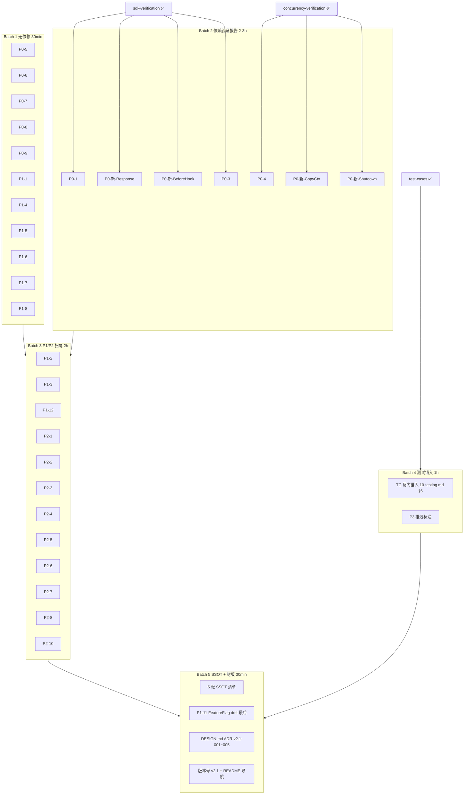

# xiaopaw-v2 文档迭代 v2.1 计划（Playbook）

- **版本**：v2.1-plan.draft
- **日期**：2026-04-19
- **输入**：13 份 v2.0-draft 文档 + 36 个 review 问题 + 3 份 verification / test 报告
- **方案**：A（先验证 SDK → 再一次性修订到 v2.1）

---

## 1. 迭代全景

**目标**：吸收 36 个 review 问题（9 P0 + 12 P1 + 10 P2 + 5 P3）+ SDK / 并发验证结论 + 已知风险测试用例锚点，把 13 份文档整体升级到 v2.1。

**Phase 0 新发现**（SDK 验证后对 review 结论的修订）：
- **原 P0-2（SkillLoaderTool asyncio.run 嵌套）不成立**：BaseTool._run 在 CrewAI `asyncio.to_thread(self.kickoff)` 的 worker 线程里跑，无 running loop，`asyncio.run()` 可用。
- **原 P0-1 加剧**：lark-oapi ws.Client 完全不支持 `encrypt_key` / `verification_token` / `event_id 重放缓存` → 07 §3 T3 整章必须重写，重放防护必须应用层实现。
- **新增硬错**：lark-oapi 响应属性是 `.raw` 不是 `.raw_response`（04 §4.4 / 02 §2.4 全文替换）。
- **修正**：`@before_llm_call` hook 必须 **in-place 修改 messages**（不能 `context.messages = [...]`），`context.llm.context_window_size` 未必存在。
- **修正**：`run_in_executor` 从来不自动 copy_context（任何 Python 版本），不是 "Py ≤3.13 bug"。`to_thread` 自 Python 3.9（引入版本）就 copy_context。
- **修正**：psycopg2 同步线程任务不可被 asyncio 取消 → shutdown gather+wait_for 行为需重写。

**产出物清单**：
- 13 份 v2.1 md（docs/01 ~ 11 + DESIGN.md + README.md）
- 3 份 Phase 0 专题（已产出）：`sdk-verification-report.md` / `concurrency-verification-report.md` / `test-cases-for-known-risks.md`
- DESIGN.md 新增 ADR-v2.1-001 ~ 005（每个 P0 一条）
- 5 张 SSOT 权威清单（新 `docs/ssot/`）：locks / tasks / ports / feature-flags / threats

**不做的事**：代码实施（Phase 1 起）、库版本升级、migration 脚本、PR 合并。

---

## 2. 36 个问题修订任务清单（含 Phase 0 修订）

### P0（9 项，致命，v2.1 必须关闭）

| ID | 影响文档 | 动作 | 依赖 | 行数 |
|----|---------|------|------|------|
| **P0-1** | 07 §3 T3 / 04 §2.4 / 02 §1.1 / 09 §2 / 08 | 整段重写：ws.Client 不做验签 + 应用层 ReplayCache（event_id LRU+TTL）必须实现 | sdk §1 | +120 |
| ~~P0-2~~ | 02 §3.2 | ✅ **取消**：asyncio.run() 在 BaseTool._run 里能用；仅需说明"运行在 worker 线程无 running loop" | sdk §3 | +10 |
| **P0-3** | 04 §7.3 / 09 §4 / 11 §4 | 删除 psycopg_pool 引用；改 `psycopg2.pool.ThreadedConnectionPool`；或升 psycopg3 | sdk §5 | +30 |
| **P0-4** | 02 §2.2 / 05 §3 / 01 ADR-002 | 放弃"LRUCache 驱逐闭包保护"论证；改 `async with _dispatch_lock: lock = cache.setdefault(sid, Lock())` 两级锁 | concurrency §1 | +60 |
| **P0-5** | 02 §2.1 vs §3.1 | 明确职责：`run_and_index` **只返回 reply + 暴露 _index_coroutine**，不写 ctx/raw；写动作统一在 Runner._handle 一处 | 无 | +20 |
| **P0-6** | 08 §2.2 / §3.2 | Docker secrets 声明加 `uid: 65534, gid: 65534, mode: 0400`；或挂载后容器内 chown | 无 | +15 |
| **P0-7** | 08 §9.2 | pgvector initdb 改为 .sh wrapper `psql -v XIAOPAW_APP_DB_PASSWORD="$(cat ...)"` | 无 | +25 |
| **P0-8** | 08 §2.2 / 11 §3 | sandbox compose 补 `./data/workspace/.config:/workspace/.config:ro` mount | 无 | +10 |
| **P0-9** | 08 §2.2 §4.3 | 飞书凭证统一走 docker secrets（不用 .env environment 注入） | 无 | +20 |
| **P0-新** | 06 §2.3 / 05 §9.3 | 改写"to_thread / run_in_executor 与 ContextVar"论断：版本论错；`run_in_executor` 永远不 copy_context | concurrency §2 | +25 |
| **P0-新** | 05 §4.4 / 08 §7 | shutdown 路径修正：psycopg2 线程不可 cancel；改 `loop.shutdown_default_executor()`（async）；明确 gather 超时后进程仍卡 | concurrency §4 | +30 |
| **P0-新** | 04 §4.4 / 02 §2.4 | `resp.raw_response` → `resp.raw`（全文替换 + 确认 `.raw` 类型 `RawResponse` 的字段） | sdk §2 | +15 |
| **P0-新** | 02 §3.1 | `@before_llm_call` hook：改 in-place `messages[:] = [...]`；`context.llm.context_window_size` 改为从 config 读固定值 | sdk §4 | +20 |

**P0 合计改动**：≈ +400 行（v2.0 12400 行的 +3.2%）

### P1（12 项，重要）

| ID | 影响文档 | 动作 | 行数 |
|----|---------|------|------|
| P1-1 | 07 §7.4 / 09 §8.3 / 02 §1.1 | `allowed_chats: []` 语义决策（建议：空 = 允许所有；None = 拒绝非白名单）+ 全文修 | +20 |
| P1-2 | 07 §9.3 / 09 §5.1 | 合并为单入口 `assert_all_production_safe(cfg)` | +15 |
| P1-3 | 08 §6.2 / 09 §2 | 统一 health / metrics 端口到 8090（`ssot/ports.md`）；sandbox url 明确 `http://aio-sandbox:8080/mcp`（容器间） | +20 |
| P1-4 | 08 §2.3 / 09 | dev compose 改 `127.0.0.1:9090:9090`（显式 loopback） | +5 |
| P1-5 | DESIGN §4 / 02 §4.1 / 03 §11.4 | `MEMORY_HARD_LIMIT=250` 统一三处 | +5 |
| P1-6 | 01 §4.2 / 07 威胁 / 02 Runner | 新增 T8 "Cron-via-Skill 注入"；CronService dispatch 前走 BLOCKED_PATTERNS | +35 |
| P1-7 | 07 威胁 / 08 compose | 新增 T9 "MCP endpoint 直接暴露"；compose 强制 sandbox 无 `ports:` 节 | +25 |
| P1-8 | 07 威胁 / 03 / 02 cron | 新增 T10 "Cron Job payload 注入"；CronStorage 写入前做 Pydantic schema 校验 | +30 |
| P1-9 | 05 §4.4 | 私有 API 改公开：`loop.shutdown_default_executor()`（已合并到 P0-新） | - |
| P1-10 | 05 §9.3 / 06 §2.3 | copy_context 版本论修正（已合并到 P0-新） | - |
| P1-11 | 03 §12 / 09 §4 / 02 §4.3 | FeatureFlag 权威清单进 `ssot/feature-flags.md`；token_counter_mode 扩为 3 值；enable_pgvector_connection_pool 补进 09 | +25 |
| P1-12 | 02 §2.4 §3.3 | SenderProtocol root_id 兼容段 + build_skill_crew 参数 diff 表；迁移文档列出调用方清单 | +30 |

**P1 合计**：≈ +210 行

### P2（10 项，加固）

| ID | 动作 | 行数 |
|----|------|------|
| P2-1 | 07 新增 T11 "routing_key 伪造"（T3 下属子威胁） | +15 |
| P2-2 | 07 §4 威胁矩阵 T1 残余风险升 HIGH | +3 |
| P2-3 | 07 §3 T2 补"memory-governance 循环依赖"说明 + 补偿机制 | +15 |
| P2-4 | 07 §16 PIPL 导出接口补 ctx.json / raw.jsonl / traces / workspace 附件 | +25 |
| P2-5 | 03 §7.3 DLQ 字段加 `first_failed_at` / `schedule` 快照 | +10 |
| P2-6 | 06 §4.2 LLM status 枚举补 `cancelled` / `network_error` | +5 |
| P2-7 | 06 §4.2 agent_latency 加 `routing_type` label（低基数） | +10 |
| P2-8 | 03 §10.4 HNSW 参数显式化（m=16, ef_construction=64）+ DDL vs 升级路径注释 | +10 |
| P2-9 | 11 §4.2 ALTER TABLE 大表 SOP（NOT VALID → VALIDATE） | +20 |
| P2-10 | 07 §15 mask_pii 补银行卡 / 车牌 / 嵌套 JSON 处理；测试集覆盖明示 | +30 |

**P2 合计**：≈ +140 行

### P3（5 项，推迟 v2.2）

- P3-1~P3-5 在 10-testing.md 标注 🔄 `推迟 v2.2`（已在 test-cases-for-known-risks.md 提供修复模板）

### 新增专题（3 份已落盘）

- `sdk-verification-report.md`（172 行）
- `concurrency-verification-report.md`（96 行）
- `test-cases-for-known-risks.md`（1087 行）

### 新增 SSOT 清单（5 份，v2.1 新增）

| 文件 | 内容 | 维护责任 |
|---|---|---|
| `ssot/locks.md` | 所有锁（asyncio.Lock / Semaphore / filelock / LRUCache）× 资源 × 粒度 × 持有者 × 失败降级 | 05 + 02 |
| `ssot/tasks.md` | 所有 asyncio.Task / 后台循环 + 取消语义 + shutdown 顺序 | 05 + 08 |
| `ssot/ports.md` | health / metrics / testapi / sandbox / pgvector / 飞书 WS 端口总清单 | 08 + 09 |
| `ssot/feature-flags.md` | 所有 feature flag × 默认值 × 对应缺陷编号 × 回滚风险 × Metric 名 | 09 + 07 |
| `ssot/threats.md` | STRIDE 威胁 T1-T11 × 防御层 × 残余风险 × 对应测试 × 对应 Feature Flag | 07 + 10 |

**修订总预算**：
- P0 ≈ +400 / P1 ≈ +210 / P2 ≈ +140 / SSOT ≈ +400
- 合计 ≈ **+1150 行**，相对 v2.0 12400 行 = **+9.3%**（低于 15% 上限）

---

## 3. 修订顺序 DAG



---

## 4. 分批推进计划

### Batch 1 — 无依赖快改（30 分钟）

**触发**：无，立即可做。
**任务**：P0-5 / P0-6 / P0-7 / P0-8 / P0-9 / P1-1 / P1-4 / P1-5 / P1-6 / P1-7 / P1-8
**涉及文档**：02 / 03 / 08 / 09 / 11
**退出条件**：11 项 merge，cross-ref 未破链。

### Batch 2 — 依赖验证报告（2-3 小时）

**触发**：sdk / concurrency / test-cases 三份报告定稿。已 ✅。
**任务**：P0-1 / P0-3 / P0-4 / P0-新（×4）
**额外动作**：DESIGN.md 起草 ADR-v2.1-001 ~ 005
**退出条件**：所有 P0 ✅，DESIGN.md 新增 ADR 齐全。

### Batch 3 — P1 / P2 扫尾（2 小时）

**触发**：Batch 1 + 2 完成。
**任务**：P1 剩余（除 P1-11） + P2 全部 10 项。
**退出条件**：P1 ≥10 项关闭，P2 ≥8 项关闭。

### Batch 4 — 测试用例锚入（1 小时）

**触发**：test-cases-for-known-risks.md 就绪（✅）。
**任务**：把 TC-P0-x / TC-P1-x 反向锚入 10-testing.md §6 "已知风险测试矩阵"；P3 标注推迟。
**退出条件**：P0-1 ~ P0-新 每项都有 TC 对应。

### Batch 5 — SSOT + 封版（30 分钟）

**任务**：
1. 产出 5 张 SSOT 清单（new `docs/ssot/`）
2. P1-11 FeatureFlag 终表写入 `ssot/feature-flags.md`
3. DESIGN.md 头部版本号改 v2.1，changelog 追加 5 条 ADR
4. README.md 顶部更新文档导航（增 ssot/ 链接）
5. 所有文档顶部补 `Version: v2.1`

---

## 5. 质量校验（每 Batch 末尾）

**跨文档一致性 checklist**（Batch 3 末尾跑）：
- [ ] `MEMORY_HARD_LIMIT=250`（统一 DESIGN §4 / 02 §4.1 / 03 §11.4）
- [ ] `health_port=8090` + `metrics_port=8090`（或选定值，写 ssot/ports.md）
- [ ] sandbox url `http://aio-sandbox:8080/mcp`（容器间）
- [ ] metrics 前缀 `xiaopaw_*` 全局
- [ ] feishu `.raw` 全局替换 `.raw_response`（grep `raw_response` 应为 0 命中）
- [ ] lark-oapi ws.Client 参数仅 `app_id/app_secret/log_level/event_handler/domain/auto_reconnect`

**机械校验脚本**（Batch 5 跑）：
```bash
# cross-ref 链接
grep -rE '\]\(\.?\./' /root/course/code/xiaopaw-v2/docs/ | \
  python3 -c "import sys; [print(l) for l in sys.stdin if 'broken' in l.lower()]"

# 残留旧字段
grep -rn "raw_response" /root/course/code/xiaopaw-v2/docs/ && echo "⚠️ raw_response 残留"
grep -rn "encrypt_key" /root/course/code/xiaopaw-v2/docs/ | grep -v "历史" && echo "⚠️ encrypt_key 残留"

# 版本号
grep -L "Version: v2.1\|v2.0-draft" /root/course/code/xiaopaw-v2/docs/*.md
```

---

## 6. 时间估算

| Batch | 工时 | 可并行 |
|---|---|---|
| Batch 1 | 0.5 h | ✅（与验证报告并行，已完成） |
| Batch 2 | 2.5 h | ❌（串在验证报告后） |
| Batch 3 | 2.0 h | 部分与 Batch 4 可并行 |
| Batch 4 | 1.0 h | 依赖 test-cases（已就绪） |
| Batch 5 | 0.5 h | ❌（最后） |

**一人单日工期**：≈ 6.5 小时。
**并行机会**：Batch 1 + 3 份验证报告已完成（节省 ≈ 1.5 h）；Batch 3 + 4 可 2 人分工。

---

## 7. 变更后验证

1. **精简 5 路 review**：只看 diff（每路 ≤15 分钟）
   - 架构师：ADR 正确性 / SSOT 完整性
   - code-reviewer：SDK 真伪字段全部对齐
   - security-reviewer：T8-T11 威胁闭环
   - planner：Batch 时间估算回看
   - general：数据 / 观测 / 测试一致性
2. **mermaid 渲染**：`mmdc` 所有含 mermaid 的文档 → /tmp/*.svg
3. **cross-ref 零破链**
4. **SSOT 反查**：随机抽 3 个数值（端口 / limit / flag）确认文档引用均指向 `ssot/`
5. **ADR 闭环**：DESIGN.md 每个 ADR 至少被 1 篇文档反向引用

---

## 8. 成败判据

v2.1 合格当且仅当：

- [ ] 36 个问题全部标注 `✅ 已修订` 或 `🔄 推迟 v2.2（附理由）`
- [ ] 4 个原 P0（P0-1/3/4/5）+ 4 个新 P0（Response / CopyCtx / Shutdown / BeforeHook）在 DESIGN.md 有 ADR
- [ ] 文档总行数变化在 **-5% ~ +15%** 范围（预期 +9.3%）
- [ ] 3 份专题报告 ≤ 1500 行（已：172 + 96 + 1087 = 1355 行 ✅）
- [ ] 5 张 SSOT 清单上线，其他文档数值引用均链接到 `ssot/`
- [ ] 所有文档顶部 `Version: v2.1`，README 导航同步
- [ ] 精简 review 无新 P0，新 P1 ≤ 2 个

**失败退路**：若 Batch 2 中发现 SDK 验证结论进一步颠覆架构（例如 CrewAI `@before_llm_call` 根本不可用），立即停工，DESIGN.md 开 ADR-v2.1-BLOCK，等架构决策后重启。

---

## 9. 关键决策点（需用户确认）

以下选项影响 Batch 2+ 的改动幅度，建议用户拍板：

**Q1**：lark-oapi ws.Client 无验签 → 应用层 ReplayCache 是否充分？还是要拒绝 WebSocket 接入改用 HTTP Webhook Server（有原生验签）？

**Q2**：psycopg2 还是 psycopg3？
- A. `psycopg2.pool.ThreadedConnectionPool`（保 v1 代码路径）
- B. 升 `psycopg[pool]`（psycopg3，文档要全改但更现代）

**Q3**：LRUCache 两级锁方案：
- A. `async with _dispatch_lock: setdefault(sid, Lock())`（简单但多一次加锁）
- B. `WeakValueDictionary`（文档已否定）
- C. 改用 `asyncio.BoundedSemaphore` per-shard（过度工程）

**Q4**：端口统一方案：
- A. health + metrics 同端口 8090（aiohttp 同 app 路由分发）
- B. 分端口 8090 / 9091（分 server）

**Q5**：是否启用 `enable_pgvector_connection_pool` 默认 true？
- 依赖 Q2 psycopg 选择

这 5 个问题拍板后，Batch 2 可一次写对。

---

**执行提示**：工程师按 Batch 1→2→3→4→5 顺序推进，每批收尾跑 §5 校验，最后跑 §7 验证，对照 §8 勾选。
