# 玄机（XuanJi）系统架构设计文档

> 版本：v3.1 · 更新日期：2026-07-14

---

## 1. 项目概述

**玄机**是一个飞书本地 AI 工作助手的生产加固版，定位为**智能多体协作平台**。系统通过飞书 WebSocket 接收用户消息，经 CrewAI 主从双层智能体引擎编排执行，支持技能动态调度、沙箱隔离执行、三层记忆持久化，并通过 Hook 加固框架保障安全合规与可观测性。

### 1.1 核心能力

| 能力域 | 说明 |
|--------|------|
| 多智能体协作 | Main Crew（编排）+ Sub-Crew（沙箱隔离执行），支持多 Agent 并行 |
| Agent 活动可视化 | AgentTimeline 组件 + SSE 实时推送（EventBus → ActivityRecorder → SSE） |
| 三层记忆 | L19 Bootstrap 角色注入 → L20 文件系统 → L21 pgvector 向量搜索 |
| 技能系统 | 内置 + 用户上传 + 社区市场，SKILL.md 声明式定义 |
| 技能市场生态 | 发布 → 管理员审核 → 上架 → 安装完整闭环，含评价/收藏/榜单/精选 |
| 团队协作 | 邀请制团队（owner/admin/member 角色）+ 会话共享（view/edit 权限） |
| Hook 加固 | 5+2 事件体系 + 9 个安全/可观测/可靠性策略 |
| 多模型路由 | DeepSeek / Qwen 多模型自动选择、负载均衡、故障转移 |
| 飞书集成 | WebSocket 消息监听、附件下载、卡片消息、会话路由 |
| Web 工作台 | React SPA，支持会话管理、技能市场、资料库、全局搜索 |

### 1.2 技术栈总览

```
┌─────────────────────────────────────────────────────┐
│  前端：React 19 + TypeScript + Vite 6 + Tailwind 4  │
│        ElectricSQL（实时同步）+ react-markdown       │
├─────────────────────────────────────────────────────┤
│  后端：Python 3.11+ · aiohttp（异步 HTTP/WS）       │
│        CrewAI ≥1.9（智能体编排）· lark-oapi（飞书）  │
│        Pydantic 2（配置校验）· Langfuse（可观测）     │
├─────────────────────────────────────────────────────┤
│  数据：PostgreSQL + pgvector（向量记忆/社区技能）     │
│        SQLite（auth.db：认证/团队）· 文件系统（会话/技能）│
├─────────────────────────────────────────────────────┤
│  基建：Docker Compose（沙箱/pgvector）              │
│        GitHub Actions CI/CD · Prometheus 指标        │
└─────────────────────────────────────────────────────┘
```

---

## 2. 系统架构总览

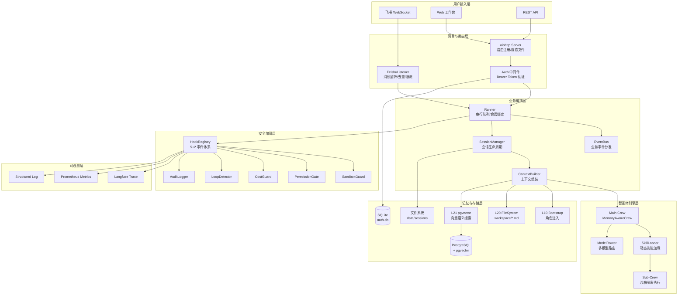

---

## 3. 后端架构

### 3.1 目录结构

```
xiaopaw/
├── main.py              # 入口：配置加载 → 组件初始化 → 服务启动
├── runner.py            # 核心：per-routing_key 串行队列 + Agent 调度
├── event_bus.py         # 业务事件总线（Agent/Community 事件）
├── models.py            # 全局数据模型（InboundMessage, SenderProtocol）
├── diagnostic.py        # 自诊断工具
│
├── agents/              # 智能体引擎
│   ├── main_crew.py     #   Main Crew（MemoryAwareCrew 编排）
│   ├── skill_crew.py    #   Sub-Crew（沙箱隔离执行）
│   └── models.py        #   结构化输出模型
│
├── api/                 # 测试 API（开发调试用）
│   ├── capture_sender.py
│   └── test_server.py
│
├── config/              # 配置管理
│   ├── validator.py     #   Pydantic 配置校验（config.yaml → AppConfig）
│   ├── safety.py        #   生产安全检查
│   └── flags.py         #   Feature Flags
│
├── cron/                # 定时任务
│   ├── service.py       #   调度服务
│   ├── automation.py    #   自动化规则引擎
│   └── storage.py       #   持久化存储
│
├── export/              # 会话导出
│   ├── service.py       #   导出调度
│   ├── markdown_builder.py
│   ├── docx_renderer.py
│   └── pdf_renderer.py
│
├── feishu/              # 飞书集成
│   ├── listener.py      #   WebSocket 消息监听
│   ├── sender.py        #   消息发送（并发信号量+指数退避）
│   ├── downloader.py    #   附件下载
│   └── session_key.py   #   路由键生成
│
├── frontend/            # Web 后端（aiohttp）
│   ├── server.py        #   HTTP 服务启动
│   ├── auth.py          #   用户认证（SQLite：用户/会话 Token/is_admin/团队表）
│   ├── team.py          #   TeamStore（团队/成员/邀请码/会话共享）
│   ├── store.py         #   数据存储抽象（PG/SQLite fallback）
│   ├── expert.py        #   专家系统（角色+技能组合）
│   ├── routes/          #   模块化路由
│   │   ├── auth.py      #     登录/注册/Token/个人资料
│   │   ├── session.py   #     会话 CRUD + 消息
│   │   ├── team.py      #     团队/成员/邀请/会话共享
│   │   ├── workspace.py #     工作区文件
│   │   ├── expert.py    #     专家管理
│   │   ├── channel.py   #     模型通道
│   │   ├── library.py   #     资料库
│   │   ├── export.py    #     会话导出
│   │   ├── search.py    #     全局搜索
│   │   ├── automation.py#     自动化
│   │   ├── activity.py  #     Agent 活动（轮询）
│   │   └── activity_stream.py # Agent 活动（SSE 实时推送）
│   └── search_service.py#   跨会话语义搜索
│
├── hook_framework/      # Hook 加固框架
│   ├── registry.py      #   事件注册 + dispatch_gate
│   ├── loader.py        #   hooks.yaml 声明式加载
│   └── crew_adapter.py  #   CrewAI 适配器
│
├── llm/                 # LLM 接入
│   ├── model_router.py  #   多模型路由（策略/故障转移）
│   ├── channel_manager.py#  通道管理
│   └── aliyun_llm.py    #   阿里云 Qwen 适配
│
├── memory/              # 三层记忆
│   ├── bootstrap.py     #   L19 角色注入
│   ├── context_mgmt.py  #   上下文窗口管理（裁剪/压缩）
│   ├── indexer.py       #   L21 向量索引
│   └── token_counter.py #   Token 计数
│
├── observability/       # 可观测性
│   ├── trace.py         #   Trace ID 绑定
│   ├── metrics.py       #   Prometheus 指标
│   ├── metrics_server.py#   指标 HTTP 端点
│   ├── logging_config.py#   JSON 结构化日志
│   ├── pii_mask.py      #   PII 脱敏
│   ├── security.py      #   安全审计
│   └── activity_recorder.py# Agent 活动记录
│
├── session/             # 会话管理
│   ├── manager.py       #   会话生命周期（创建/命名/归档）
│   ├── context_builder.py#  上下文组装（记忆+历史+技能）
│   └── models.py        #   会话数据模型
│
├── skills/              # 内置技能（SKILL.md + scripts/）
│   ├── docx/            #   Word 文档处理
│   ├── pptx/            #   PPT 生成
│   ├── xlsx/            #   Excel 处理
│   ├── feishu_ops/      #   飞书操作
│   ├── baidu_search/    #   百度搜索
│   └── _shared_office/  #   共享 Office 工具
│
├── skills_mgmt/         # 技能管理
│   ├── registry.py      #   技能注册表
│   ├── market.py        #   技能市场（远程同步）
│   ├── community.py     #   社区技能（发布/审核/安装/评价/收藏）
│   ├── api.py           #   技能/市场/社区/管理员审核 REST 路由
│   ├── packager.py      #   技能归档打包/解包
│   └── validator.py     #   SKILL.md 校验
│
├── cleanup/             # 数据清理
│   └── service.py       #   过期会话/Trace 清理
│
└── utils/               # 工具
    └── performance.py   #   异步 I/O 性能优化

shared_hooks/            # Hook 策略实现
├── hooks.yaml           #   声明式配置（事件→处理器映射）
├── structured_log.py    #   结构化日志
├── langfuse_trace.py    #   Langfuse 追踪
├── audit_logger.py      #   安全审计
├── sandbox_guard.py     #   沙箱守卫
├── permission_gate.py   #   权限门控
├── cost_guard.py        #   成本围栏
├── loop_detector.py     #   循环检测
└── retry_tracker.py     #   重试追踪
```

### 3.2 启动流程

```mermaid
graph LR
    A[main.py] --> B[load_dotenv]
    B --> C[load_config<br/>Pydantic 校验]
    C --> D[assert_all_production_safe]
    D --> E[setup_logging<br/>JSON 结构化]
    E --> F[_init_model_router<br/>多模型路由]
    F --> G[_prewarm_crewai_storage]
    G --> H[_build_skill_layers<br/>技能注册/市场/社区]
    H --> I[HookRegistry.load<br/>hooks.yaml]
    I --> J[SessionManager + ContextBuilder]
    J --> K[Runner 初始化]
    K --> L[FeishuListener.start<br/>WebSocket 线程]
    L --> M[aiohttp Server<br/>:8080]
    M --> N[Metrics Server<br/>:8090]
```

### 3.3 消息处理流程

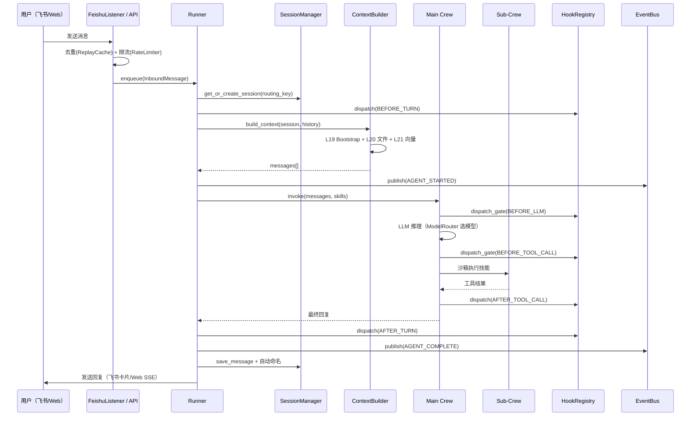

---

## 4. 前端架构

### 4.1 技术选型

| 层面 | 技术 | 版本 |
|------|------|------|
| 框架 | React | 19 |
| 语言 | TypeScript | 5.7 |
| 构建 | Vite | 6.x |
| 样式 | Tailwind CSS + CSS Variables | 4.x |
| 实时同步 | ElectricSQL | 1.5 |
| Markdown | react-markdown + remark-gfm + rehype-highlight | — |
| 测试 | Vitest + Testing Library | 3.x |

### 4.2 组件架构

```mermaid
graph TB
    APP[App.tsx<br/>状态中枢/路由]
    
    APP --> LOGIN[LoginView<br/>登录/注册]
    APP --> SIDEBAR[Sidebar<br/>导航/最近任务]
    APP --> TOPBAR[DashboardTopBar<br/>标签页/工具栏]
    
    APP --> DASH[DashboardHome<br/>工作台首页]
    APP --> CHAT[ChatView<br/>会话详情]
    APP --> SKILL_M[SkillManagerView<br/>技能管理]
    APP --> SEARCH[GlobalSearchView<br/>全局搜索]
    APP --> MARKET[MarketplaceView<br/>技能市场]
    APP --> LIBRARY[LibraryView<br/>资料库]
    APP --> EXPERT[ExpertManagerView<br/>专家管理]
    APP --> MODEL_C[ModelConfigView<br/>模型配置]
    APP --> AUTO_M[AutomationManagerView<br/>自动化]
    APP --> WORKSPACE[WorkspaceView<br/>工作区]
    APP --> TEAM[TeamPanel<br/>团队协作]
    
    MARKET --> MHOME[MarketHome<br/>市场首页/榜单/精选]
    MARKET --> MDETAIL[SkillDetailPage<br/>详情/评价/安装]
    MARKET --> MPUB[PublishSkillView<br/>技能发布]
    MARKET --> MMY[MySkillsView<br/>我的发布/状态徽章]
    MARKET --> MREVIEW[AdminReviewView<br/>管理员审核面板]
    
    TEAM --> TSESS[TeamSessions<br/>团队共享会话]
    CHAT --> SHARE[ShareDialog<br/>会话共享]
    CHAT --> TIMELINE[AgentTimeline<br/>Agent 活动时间线/SSE]
    
    DASH --> INPUT[UnifiedInputBar<br/>统一输入框]
    CHAT --> INPUT
    CHAT --> MD[MarkdownRenderer<br/>Markdown 渲染]
    
    APP --> THEME[ThemeContext<br/>主题管理]
    APP --> UX[UXComponents<br/>Loading/Error/Empty]
```

### 4.3 状态管理

App.tsx 作为状态中枢，通过 props 向下传递：

```
App.tsx 核心状态
├── authToken / currentUser     # 认证（currentUser.is_admin 驱动管理员入口）
├── sessions: Session[]         # 会话列表（30s 轮询 + focus 刷新）
├── activeSessionId             # 当前会话
├── messages: Message[]         # 当前会话消息
├── loading / historyLoading    # 加载状态
├── activeView                  # 当前视图（navConfig 驱动）
└── sidebarExpanded             # 侧边栏展开状态
```

大型视图（如 MarketplaceView）内部采用 `useReducer + useCallback` 管理局部状态，通过 props（`authToken`、`isAdmin` 等）从 App.tsx 注入上下文。

### 4.4 API 通信

前端通过 `fetch` 调用后端 REST API（统一前缀 `/api/frontend/*`，Bearer Token 认证），主要端点：

| 模块 | 端点 | 说明 |
|------|------|------|
| 认证 | `POST /api/frontend/auth/login` / `register` / `logout` | 登录获取 Bearer Token |
| 认证 | `GET /api/frontend/auth/me` | 当前用户（含 is_admin） |
| 会话 | `GET /api/frontend/sessions` | 会话列表 |
| 会话 | `GET /api/frontend/sessions/{id}/messages` | 消息历史 |
| 会话 | `POST /api/frontend/message` | 发送消息 |
| 会话 | `POST/DELETE /api/frontend/sessions/{id}/share` | 会话共享/取消共享 |
| 活动 | `GET /api/frontend/sessions/{id}/activities` | Agent 活动（轮询） |
| 活动 | `GET /api/frontend/sessions/{id}/activities/stream` | Agent 活动（SSE 实时） |
| 团队 | `GET/POST /api/frontend/teams` · `POST /api/frontend/teams/join` | 团队 CRUD/邀请码加入 |
| 团队 | `/api/frontend/teams/{id}/members` / `invitations` / `sessions` | 成员/邀请/共享会话 |
| 技能 | `GET /api/frontend/skills` · `POST /api/frontend/skills/upload` | 技能列表/上传 |
| 市场 | `GET /api/frontend/market/skills` · `POST .../{name}/install` | 远程市场同步/安装 |
| 社区 | `/api/frontend/market/community/skills` · `publish` / `install` / `reviews` | 社区发布/安装/评价/收藏/榜单 |
| 审核 | `GET /api/frontend/market/community/admin/pending` | 待审核队列（仅管理员） |
| 审核 | `POST .../admin/skills/{name}/moderate` / `feature` | 通过/拒绝/精选（仅管理员） |
| 搜索 | `GET /api/frontend/search?q=` | 全局搜索 |
| 导出 | `GET /api/frontend/sessions/{id}/export` | 会话导出（md/docx/pdf） |
| 资料库 | `GET /api/frontend/library/files` | 文件列表 |
| 模型 | `GET /api/frontend/channels` | 模型通道 |

---

## 5. 智能体引擎

### 5.1 主从双层架构

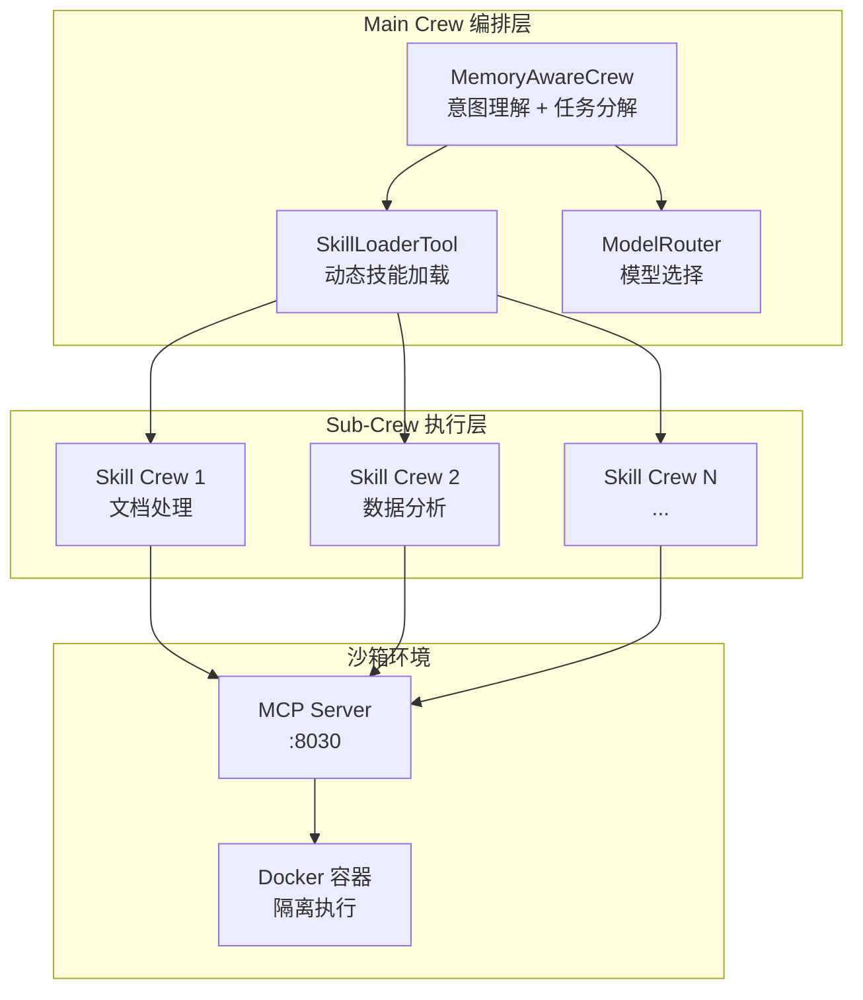

- **Main Crew**（`main_crew.py`）：接收用户消息 + 上下文，进行意图理解和任务编排，通过 `SkillLoaderTool` 动态选择并加载技能
- **Sub-Crew**（`skill_crew.py`）：在隔离沙箱中实例化，执行具体技能任务（文档生成、数据分析等）
- **ModelRouter**（`model_router.py`）：支持 cost_first / quality_first / latency_sensitive / round_robin / priority 五种路由策略，含故障转移链

### 5.2 技能系统

```
技能层次：
├── 内置技能（xiaopaw/skills/）
│   ├── docx/     → SKILL.md + scripts/（Word 处理）
│   ├── pptx/     → SKILL.md + scripts/（PPT 生成）
│   ├── xlsx/     → SKILL.md + scripts/（Excel 处理）
│   ├── feishu_ops/ → SKILL.md + scripts/（飞书操作）
│   └── baidu_search/ → SKILL.md + scripts/（搜索）
│
├── 用户技能（data/user_skills/）
│   └── 用户上传的自定义技能
│
└── 社区市场（PostgreSQL）
    ├── Vercel Skills 远程同步（skill_market 表）
    └── 社区发布 + 审核上架（community_skills 表）
```

每个技能由 `SKILL.md`（声明式定义：名称、描述、参数、脚本入口）+ `scripts/`（执行脚本）组成，发布前经 `validator.py` 校验、`packager.py` 打包为归档。

### 5.3 技能市场生态（发布 → 审核 → 上架 → 安装）

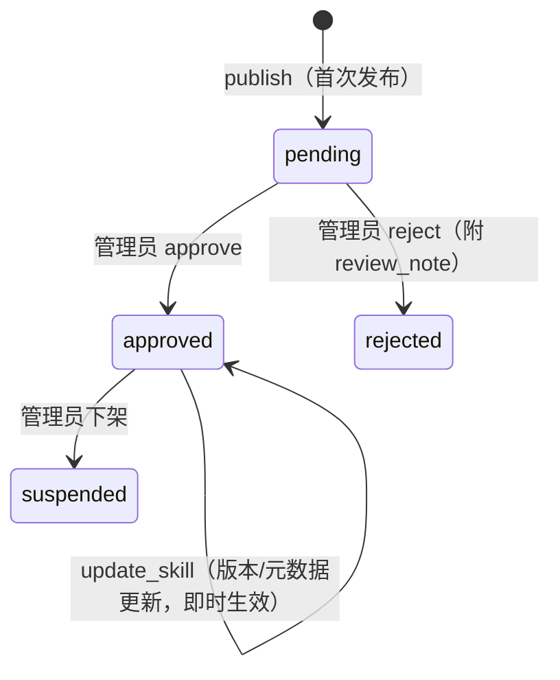

**闭环设计要点**：

| 环节 | 实现 |
|------|------|
| 发布 | `CommunityRegistry.publish_skill`：归档存入 `_storage_dir`，生成 `local://{path}` 安装 URL，状态置为 `pending` |
| 审核权限 | SQLite `users.is_admin` 为权威来源（默认 admin 账户为管理员），API 层 `_require_admin` 门控，非管理员返回 403 |
| 审核操作 | `list_pending` / `moderate_skill`（approve/reject + 审计字段 reviewed_by/reviewed_at/review_note）/ `set_featured` |
| 可见性 | 仅 `approved` 技能对市场搜索/列表可见；发布者在「我的发布」可见全部状态及拒绝原因 |
| 安装 | `install_skill`：`local://` 归档直读（路径限定存储目录内防穿越），http(s) 归档经 fetcher 下载，解包至用户技能目录 |
| 事件 | EventBus 发布 SKILL_PUBLISHED / SKILL_APPROVED / SKILL_INSTALLED / SKILL_FEATURED / SKILL_SUSPENDED |
| 前端 | MarketplaceView 四 Tab（市场/已安装/我的发布/审核），审核 Tab 仅管理员可见并带待审角标 |

---

## 6. 三层记忆系统

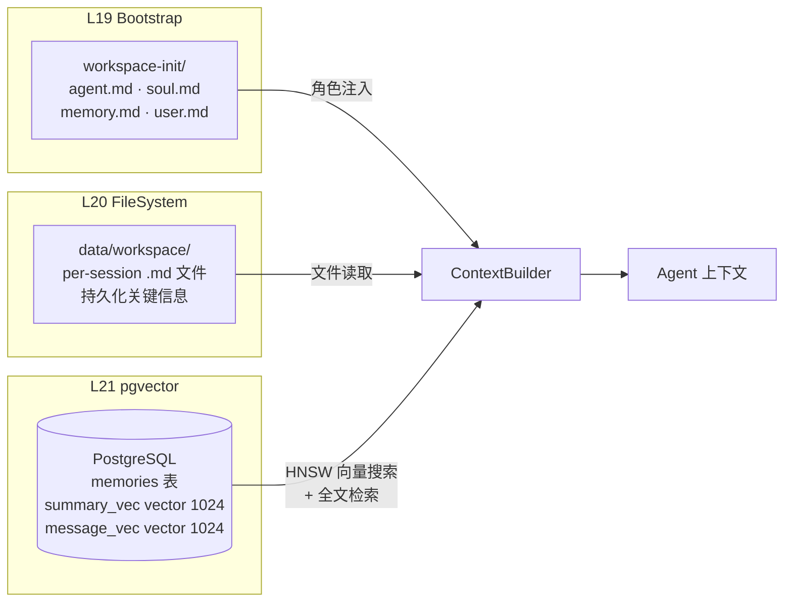

| 层级 | 存储 | 用途 | 生命周期 |
|------|------|------|----------|
| L19 Bootstrap | `workspace-init/*.md` | 角色人设、行为准则 | 永久（手动维护） |
| L20 FileSystem | `data/workspace/*.md` | 会话级关键信息持久化 | 随会话 |
| L21 pgvector | PostgreSQL `memories` 表 | 语义向量搜索 + 全文检索 | 可配置 TTL |

**上下文窗口管理**（`context_mgmt.py`）：
- Token 计数（支持 HuggingFace DeepSeek tokenizer）
- 旧工具结果裁剪（`prune_tool_results`）
- 阈值压缩（`maybe_compress`，compress_threshold=0.45）
- 上下文窗口限制（context_window_tokens=32000）

---

## 7. Hook 加固框架

### 7.1 事件体系（5+2）

```
观测事件（fire-and-forget）：
  BEFORE_TURN → BEFORE_LLM → BEFORE_TOOL_CALL → AFTER_TOOL_CALL → AFTER_TURN

生命周期事件：
  TASK_COMPLETE · SESSION_END
```

### 7.2 策略矩阵

| 策略 | 类型 | 挂载事件 | 功能 |
|------|------|----------|------|
| `structured_log` | 观测 | 全部 7 个 | JSON 结构化日志 |
| `langfuse_trace` | 观测 | 全部 7 个 | Langfuse Trace 树 |
| `audit_logger` | 安全 | SESSION_END | 安全审计日志 |
| `sandbox_guard` | 安全 | BEFORE_TOOL_CALL | MCP 白名单 + 沙箱校验 |
| `permission_gate` | 安全 | BEFORE_TOOL_CALL | 工具权限门控 |
| `cost_guard` | 可靠性 | AFTER_TURN, BEFORE_TOOL_CALL | 成本围栏（budget_usd=1.0） |
| `loop_detector` | 可靠性 | AFTER_TOOL_CALL, AFTER_TURN | 循环检测（threshold=3） |
| `retry_tracker` | 可靠性 | AFTER_TOOL_CALL | 重试追踪（max_retries=5） |

### 7.3 执行模型

- **观测层**（`dispatch`）：fire-and-forget，不阻断执行流
- **策略层**（`dispatch_gate`）：可返回 `GuardrailDeny` 阻断工具调用
- 声明式配置：`shared_hooks/hooks.yaml` 统一定义事件→处理器映射

---

## 8. 可观测性

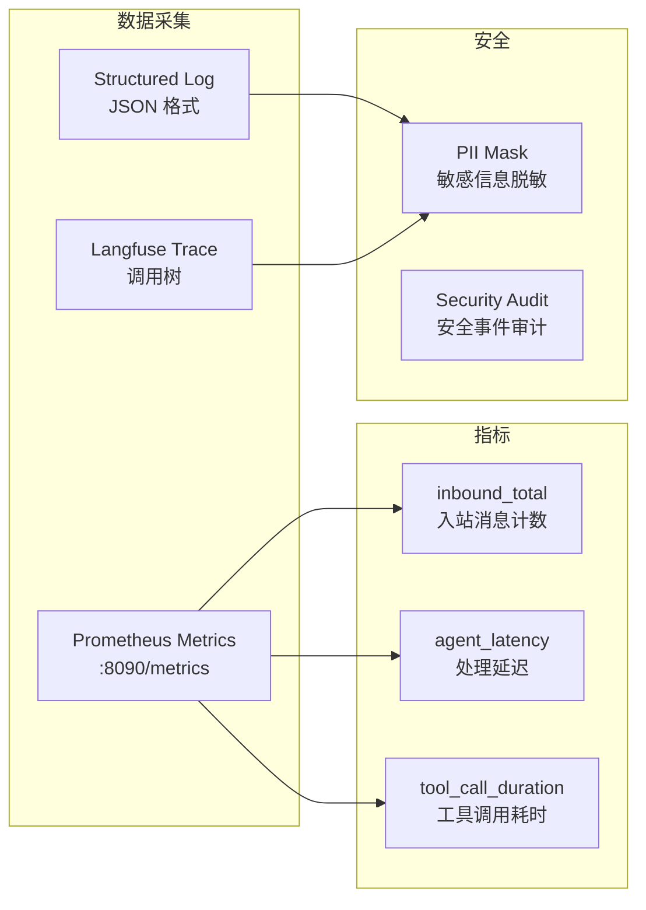

- **Langfuse**：完整 Trace 树（Turn → LLM Call → Tool Call），支持回放与分析
- **Prometheus**：`/metrics` 端点暴露入站计数、延迟直方图、工具调用指标
- **结构化日志**：JSON 格式，含 trace_id / session_id / routing_key 关联字段
- **PII 脱敏**：日志和 Trace 中的敏感信息自动掩码
- **Agent 活动实时链路**：EventBus → ActivityRecorder（PG agent_activities 表）→ SSE `/activities/stream` → 前端 AgentTimeline（断线自动降级为轮询）

---

## 9. 数据模型

### 9.1 核心表（PostgreSQL）

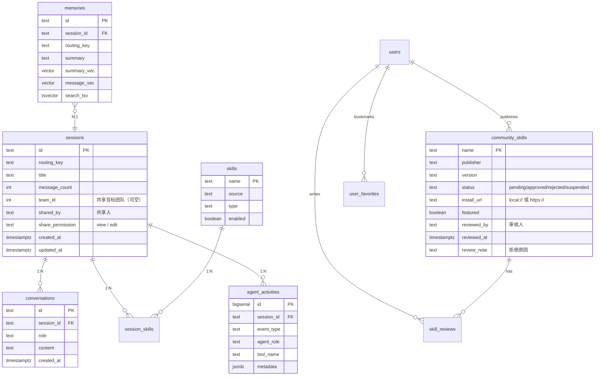

### 9.2 认证与团队模型（SQLite auth.db）

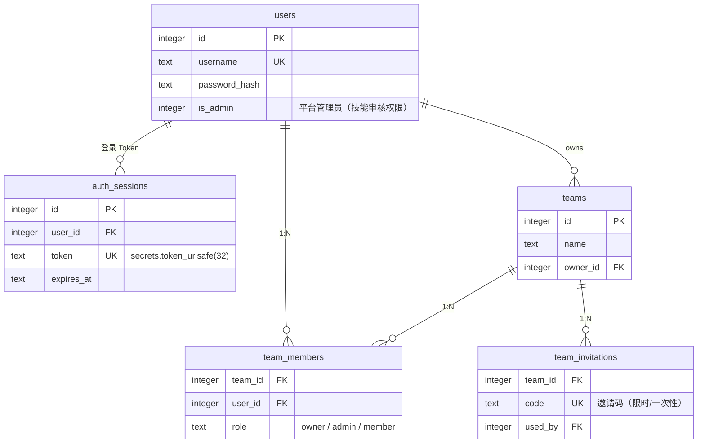

- **TeamStore**（`frontend/team.py`）复用 auth.db：WAL 模式并发读，写操作 `threading.Lock` 保护
- **会话共享跨库关联**：团队实体在 SQLite，共享标记（team_id/shared_by/share_permission）写在 PG `sessions` 表，通过 user_id/username 关联
- **is_admin 跨库关联**：管理员身份存于 SQLite，审核对象（community_skills）存于 PG，API 层先验 Token 再查 is_admin

### 9.3 存储分层

| 存储 | 用途 | 位置 |
|------|------|------|
| PostgreSQL + pgvector | 会话、消息、记忆向量、技能、社区市场、Agent 活动 | `schema.sql` |
| SQLite | 用户认证（is_admin）、登录 Token、团队/成员/邀请 | `data/auth.db` |
| 文件系统 | 会话上下文（ctx/raw）、技能脚本、社区技能归档、导出文件 | `data/` |
| 内存 | LRU 缓存、Replay Cache、Rate Limiter、SSE 订阅者队列 | 运行时 |

---

## 10. 并发与可靠性

### 10.1 Runner 串行队列

```
Runner 设计：per-routing_key 串行队列 + gen-counter 工作线程生命周期

routing_key_1 → [Queue] → Worker_1（串行处理消息）
routing_key_2 → [Queue] → Worker_2
routing_key_N → [Queue] → Worker_N

特性：
- 同一 routing_key 的消息严格串行（避免并发冲突）
- 空闲超时自动回收（idle_timeout_s=300）
- 队列容量限制（max_queue_size=10）
- gen-counter 防止僵尸 worker
```

### 10.2 并发安全措施

| 措施 | 实现 |
|------|------|
| 飞书消息去重 | ReplayCache（TTL=300s, maxsize=10000） |
| 入站限流 | RateLimiter（per_user_per_minute=20） |
| 发送并发控制 | 信号量（max_concurrent=5）+ 指数退避重试 |
| CrewAI 存储路径 | CREWAI_STORAGE_DIR 环境变量固定 |
| 记忆写入 | filelock 文件锁保护 |
| 定时任务 | filelock 防重入 |

---

## 11. 部署架构

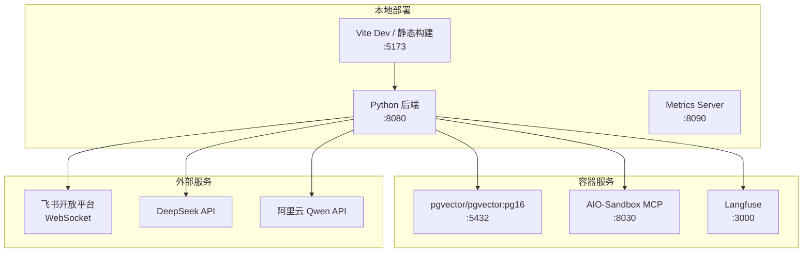

### 11.1 端口分配

| 服务 | 端口 | 说明 |
|------|------|------|
| 后端 API | 8080 | aiohttp HTTP + 静态文件 |
| 前端 Dev | 5173 | Vite 开发服务器 |
| 指标 | 8090 | Prometheus `/metrics` |
| 测试 API | 9090 | 开发调试（enable_test_api） |
| PostgreSQL | 5432 | pgvector 向量数据库 |
| 沙箱 MCP | 8030 | Docker 隔离执行环境 |
| Langfuse | 3000 | 可观测性平台 |

### 11.2 配置管理

- **config.yaml**：主配置文件（Pydantic 校验），涵盖飞书、Agent、沙箱、记忆、路由等全部配置
- **.env**：敏感凭据（API Key、Secret），`load_dotenv(override=True)` 优先
- **Feature Flags**：`config.yaml → feature_flags` 段，支持运行时功能开关

---

## 12. 安全设计

| 安全域 | 措施 |
|--------|------|
| 认证 | Bearer Token（`secrets.token_urlsafe(32)` 不透明 Token，SQLite sessions 表存储，带过期时间），密码哈希存储 |
| 授权（工具） | PermissionGate 工具级权限门控 |
| 授权（平台） | `users.is_admin` 管理员门控（技能审核/精选/下架），API 层 `_require_admin` 统一校验 |
| 授权（团队） | 团队操作按 owner/admin/member 角色分级；团队会话仅成员可见 |
| 沙箱 | MCP 白名单 + Docker 容器隔离执行 |
| 路径穿越防护 | 社区技能 `local://` 安装路径强制限定存储目录内（resolve + parents 校验） |
| 成本 | CostGuard 预算围栏（budget_usd=1.0） |
| 审计 | SecurityAuditLogger 全量操作审计；技能审核留存 reviewed_by/reviewed_at/review_note |
| 脱敏 | PII Mask 日志/Trace 敏感信息掩码 |
| 限流 | 入站消息限流 + 发送并发控制 |
| 去重 | ReplayCache 防止消息重复处理 |
| 循环保护 | LoopDetector 检测 Agent 死循环 |
| 密钥管理 | .env 文件 + 环境变量，禁止硬编码 |

---

## 13. 测试体系

```
tests/
├── unit/           # 单元测试（mock 外部依赖）
├── integration/    # 集成测试（真实组件交互）
├── e2e/            # 端到端测试（TestAPI 驱动）
└── fixtures/       # 测试夹具

标记体系（pytest markers）：
- integration     : 集成测试
- llm_dependent   : 依赖 LLM 行为
- sandbox         : 需要 AIO-Sandbox
- pgvector_required: 需要 pgvector
- security        : 安全攻防测试
- observability   : 可观测性验证
- no_llm          : 无 LLM（斜杠命令/路由）
- e2e             : 端到端
- full            : 完整 e2e（sandbox + pgvector）

前端测试：Vitest + Testing Library + jsdom
```

---

## 14. 演进路线

| 阶段 | 目标 | 状态 |
|------|------|------|
| 基础 | 单用户架构，飞书 + Web 双通道 | ✅ 已完成 |
| 可视化 | 多 Agent 协作可视化（AgentTimeline + SSE 实时推送） | ✅ 已完成 |
| 协作 | 多用户团队协作（邀请制团队 + 会话共享） | ✅ 已完成 |
| 生态 | 技能市场生态（发布/审核/上架/安装闭环） | ✅ 已完成 |
| 后续 | 共享会话 view/edit 权限后端强制校验加固 | 📋 规划中 |
| 后续 | 技能版本更新纳入审核流程、审核通知 | 📋 规划中 |
| 远期 | 多租户隔离、技能计费与分成 | 📋 规划中 |
